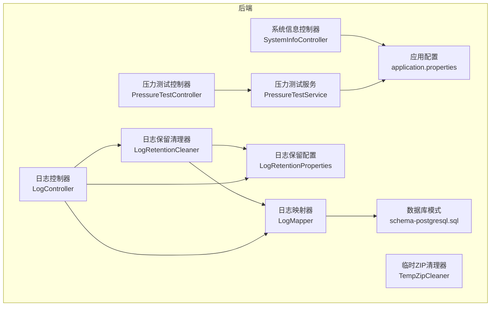
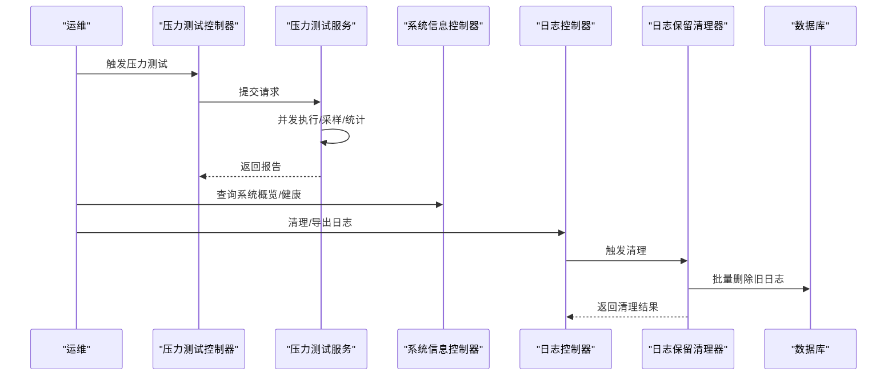
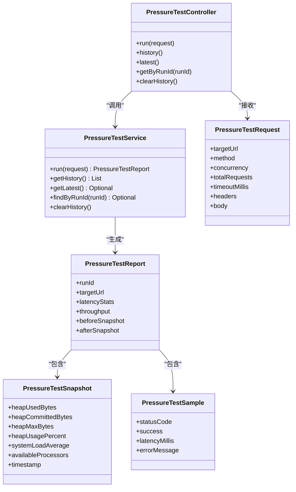
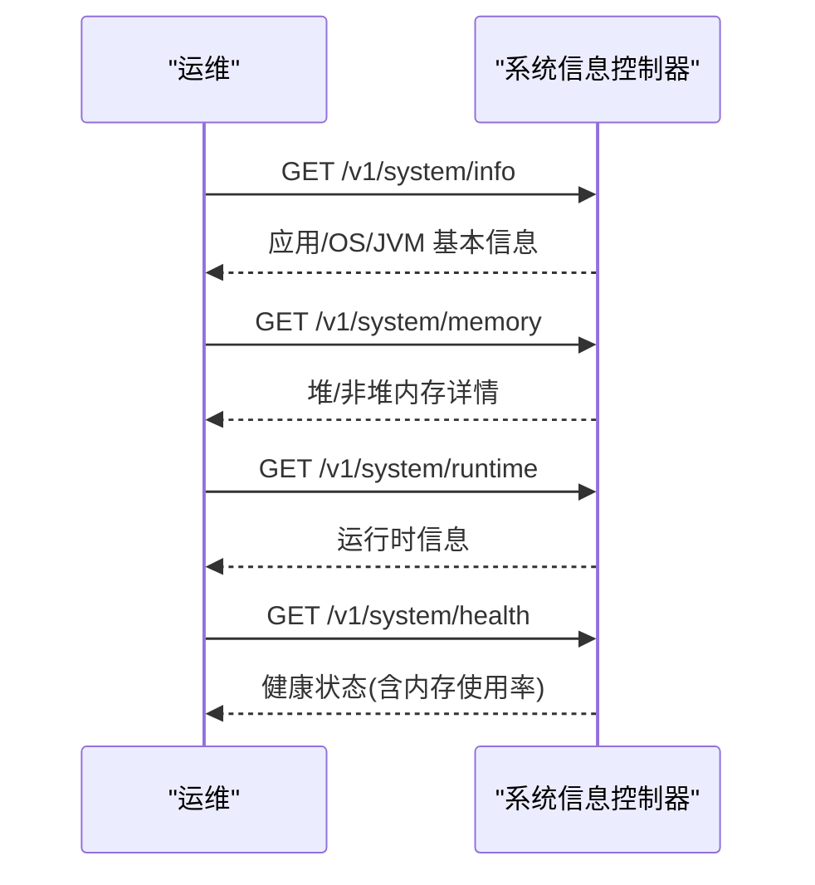
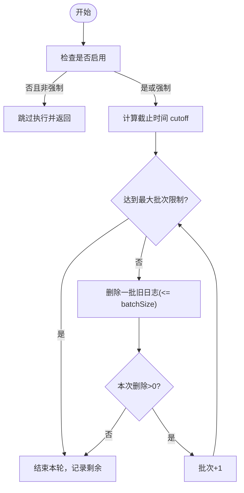
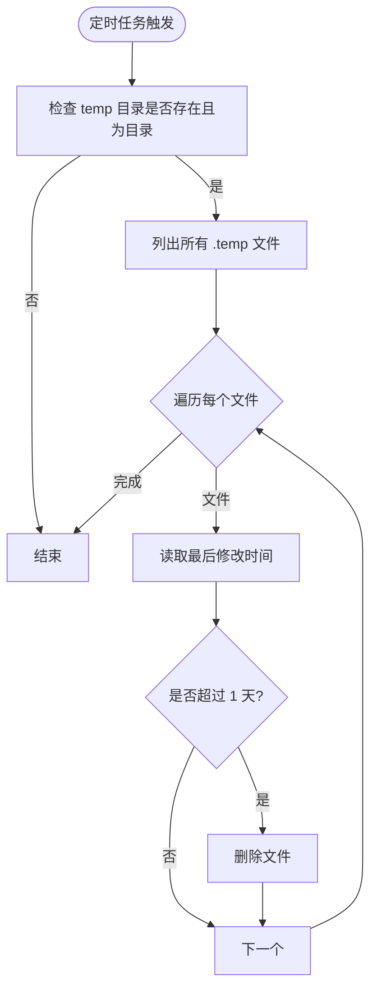
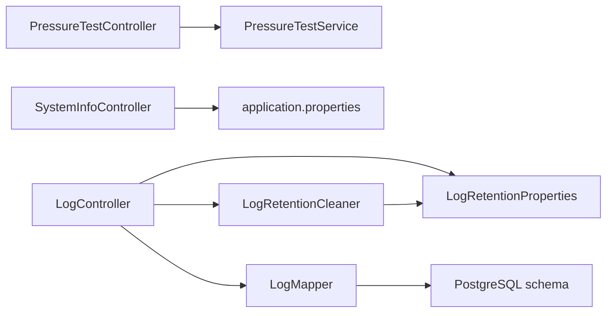

# 监控告警

<cite>
**本文引用的文件**
- [PressureTestService.java](file://backend-repo/src/main/java/com/zjcxph/imgapi/monitoring/PressureTestService.java)
- [PressureTestController.java](file://backend-repo/src/main/java/com/zjcxph/imgapi/controller/PressureTestController.java)
- [PressureTestReport.java](file://backend-repo/src/main/java/com/zjcxph/imgapi/monitoring/PressureTestReport.java)
- [PressureTestRequest.java](file://backend-repo/src/main/java/com/zjcxph/imgapi/monitoring/PressureTestRequest.java)
- [PressureTestSample.java](file://backend-repo/src/main/java/com/zjcxph/imgapi/monitoring/PressureTestSample.java)
- [PressureTestSnapshot.java](file://backend-repo/src/main/java/com/zjcxph/imgapi/monitoring/PressureTestSnapshot.java)
- [SystemInfoController.java](file://backend-repo/src/main/java/com/zjcxph/imgapi/controller/SystemInfoController.java)
- [LogRetentionCleaner.java](file://backend-repo/src/main/java/com/zjcxph/imgapi/scheduler/LogRetentionCleaner.java)
- [TempZipCleaner.java](file://backend-repo/src/main/java/com/zjcxph/imgapi/scheduler/TempZipCleaner.java)
- [LogRetentionProperties.java](file://backend-repo/src/main/java/com/zjcxph/imgapi/config/LogRetentionProperties.java)
- [LogController.java](file://backend-repo/src/main/java/com/zjcxph/imgapi/controller/LogController.java)
- [LogMapper.java](file://backend-repo/src/main/java/com/zjcxph/imgapi/mapper/LogMapper.java)
- [application.properties](file://backend-repo/src/main/resources/application.properties)
- [schema-postgresql.sql](file://backend-repo/src/main/resources/schema-postgresql.sql)
</cite>

## 目录
1. [简介](#简介)
2. [项目结构](#项目结构)
3. [核心组件](#核心组件)
4. [架构总览](#架构总览)
5. [详细组件分析](#详细组件分析)
6. [依赖分析](#依赖分析)
7. [性能考量](#性能考量)
8. [故障排查指南](#故障排查指南)
9. [结论](#结论)
10. [附录](#附录)

## 简介
本文件面向运维团队，提供 MRR 系统的监控与告警管理指南。内容覆盖应用性能监控（APM）、数据库状态与容量、容器资源使用、压力测试与性能基准、日志保留与清理、临时文件管理、健康检查与自动重启策略、告警规则与通知渠道、监控数据采集与可视化、性能瓶颈识别与容量规划，以及监控仪表板配置与关键指标跟踪。

## 项目结构
后端采用 Spring Boot 架构，监控相关能力集中在以下模块：
- 压力测试：控制器、服务、报告与样本模型
- 系统信息与健康检查：统一系统概览、内存与运行时信息、健康检查端点
- 日志保留清理：定时任务、清理结果与导出
- 数据库：访问日志表结构与索引
- 配置：应用属性与日志保留参数

**图表来源**
- [PressureTestController.java:22-73](file://backend-repo/src/main/java/com/zjcxph/imgapi/controller/PressureTestController.java#L22-L73)
- [PressureTestService.java:32-112](file://backend-repo/src/main/java/com/zjcxph/imgapi/monitoring/PressureTestService.java#L32-L112)
- [SystemInfoController.java:22-180](file://backend-repo/src/main/java/com/zjcxph/imgapi/controller/SystemInfoController.java#L22-L180)
- [LogRetentionCleaner.java:13-119](file://backend-repo/src/main/java/com/zjcxph/imgapi/scheduler/LogRetentionCleaner.java#L13-L119)
- [TempZipCleaner.java:15-57](file://backend-repo/src/main/java/com/zjcxph/imgapi/scheduler/TempZipCleaner.java#L15-L57)
- [LogController.java:32-245](file://backend-repo/src/main/java/com/zjcxph/imgapi/controller/LogController.java#L32-L245)
- [LogMapper.java:9-166](file://backend-repo/src/main/java/com/zjcxph/imgapi/mapper/LogMapper.java#L9-L166)
- [LogRetentionProperties.java:5-54](file://backend-repo/src/main/java/com/zjcxph/imgapi/config/LogRetentionProperties.java#L5-L54)
- [application.properties:1-49](file://backend-repo/src/main/resources/application.properties#L1-L49)
- [schema-postgresql.sql:61-90](file://backend-repo/src/main/resources/schema-postgresql.sql#L61-L90)

**章节来源**
- [application.properties:1-49](file://backend-repo/src/main/resources/application.properties#L1-L49)
- [schema-postgresql.sql:1-109](file://backend-repo/src/main/resources/schema-postgresql.sql#L1-L109)

## 核心组件
- 压力测试子系统：提供并发请求执行、延迟统计、成功率计算、JVM/系统负载快照、历史记录与查询
- 系统监控子系统：统一系统信息、内存与运行时详情、健康检查（含内存阈值）
- 日志保留与清理：基于 Cron 的定时清理、批量删除、剩余统计、手动触发与导出
- 临时文件管理：定时清理 temp 目录下的过期临时文件
- 数据库：访问日志表结构与索引，支持按时间、IP、URI、状态等维度检索

**章节来源**
- [PressureTestService.java:32-112](file://backend-repo/src/main/java/com/zjcxph/imgapi/monitoring/PressureTestService.java#L32-L112)
- [SystemInfoController.java:22-180](file://backend-repo/src/main/java/com/zjcxph/imgapi/controller/SystemInfoController.java#L22-L180)
- [LogRetentionCleaner.java:13-119](file://backend-repo/src/main/java/com/zjcxph/imgapi/scheduler/LogRetentionCleaner.java#L13-L119)
- [TempZipCleaner.java:15-57](file://backend-repo/src/main/java/com/zjcxph/imgapi/scheduler/TempZipCleaner.java#L15-L57)
- [LogController.java:32-245](file://backend-repo/src/main/java/com/zjcxph/imgapi/controller/LogController.java#L32-L245)
- [LogMapper.java:9-166](file://backend-repo/src/main/java/com/zjcxph/imgapi/mapper/LogMapper.java#L9-L166)

## 架构总览
系统通过 REST 接口暴露监控能力，并结合数据库与文件系统实现日志与临时文件的生命周期管理。压力测试服务在 JVM 内部采集快照，系统控制器提供统一健康视图。

**图表来源**
- [PressureTestController.java:35-41](file://backend-repo/src/main/java/com/zjcxph/imgapi/controller/PressureTestController.java#L35-L41)
- [PressureTestService.java:44-112](file://backend-repo/src/main/java/com/zjcxph/imgapi/monitoring/PressureTestService.java#L44-L112)
- [SystemInfoController.java:120-144](file://backend-repo/src/main/java/com/zjcxph/imgapi/controller/SystemInfoController.java#L120-L144)
- [LogController.java:94-106](file://backend-repo/src/main/java/com/zjcxph/imgapi/controller/LogController.java#L94-L106)
- [LogRetentionCleaner.java:26-37](file://backend-repo/src/main/java/com/zjcxph/imgapi/scheduler/LogRetentionCleaner.java#L26-L37)
- [LogMapper.java:41-51](file://backend-repo/src/main/java/com/zjcxph/imgapi/mapper/LogMapper.java#L41-L51)

## 详细组件分析

### 压力测试子系统
- 能力概述
  - 支持指定目标 URL、方法、并发度、总请求数、超时、请求头与请求体
  - 并发执行请求，统计最小/平均/p95/最大延迟、成功率、吞吐、持续时间
  - 记录执行前后 JVM 堆内存、系统负载、CPU 核数等快照
  - 维护最近 20 条历史记录，支持按 runId 查询与清空
- 关键指标
  - 延迟分布：min、avg、p95、max（毫秒）
  - 成功率：百分比
  - 吞吐：requests/sec
  - 资源快照：heapUsed、heapCommitted、heapMax、heap%、loadAverage、processors
- 使用建议
  - 建议从低并发开始，逐步提升至峰值，观察 p95 延迟与失败率
  - 结合系统健康检查端点关注内存使用率是否接近阈值

**图表来源**
- [PressureTestController.java:22-73](file://backend-repo/src/main/java/com/zjcxph/imgapi/controller/PressureTestController.java#L22-L73)
- [PressureTestService.java:32-112](file://backend-repo/src/main/java/com/zjcxph/imgapi/monitoring/PressureTestService.java#L32-L112)
- [PressureTestReport.java:6-75](file://backend-repo/src/main/java/com/zjcxph/imgapi/monitoring/PressureTestReport.java#L6-L75)
- [PressureTestRequest.java:12-65](file://backend-repo/src/main/java/com/zjcxph/imgapi/monitoring/PressureTestRequest.java#L12-L65)
- [PressureTestSample.java:3-20](file://backend-repo/src/main/java/com/zjcxph/imgapi/monitoring/PressureTestSample.java#L3-L20)
- [PressureTestSnapshot.java:3-32](file://backend-repo/src/main/java/com/zjcxph/imgapi/monitoring/PressureTestSnapshot.java#L3-L32)

**章节来源**
- [PressureTestController.java:22-73](file://backend-repo/src/main/java/com/zjcxph/imgapi/controller/PressureTestController.java#L22-L73)
- [PressureTestService.java:32-112](file://backend-repo/src/main/java/com/zjcxph/imgapi/monitoring/PressureTestService.java#L32-L112)
- [PressureTestReport.java:6-75](file://backend-repo/src/main/java/com/zjcxph/imgapi/monitoring/PressureTestReport.java#L6-L75)
- [PressureTestRequest.java:12-65](file://backend-repo/src/main/java/com/zjcxph/imgapi/monitoring/PressureTestRequest.java#L12-L65)
- [PressureTestSample.java:3-20](file://backend-repo/src/main/java/com/zjcxph/imgapi/monitoring/PressureTestSample.java#L3-L20)
- [PressureTestSnapshot.java:3-32](file://backend-repo/src/main/java/com/zjcxph/imgapi/monitoring/PressureTestSnapshot.java#L3-L32)

### 系统监控与健康检查
- 能力概述
  - 统一系统概览：应用名、启动时间、运行时长、JVM/OS/属性
  - 内存详情：堆/非堆内存初始/已用/提交/最大、使用率
  - 运行时信息：进程名、启动时间、Uptime、类路径、输入参数
  - 健康检查：整体状态、时间戳、端口、应用名；内存使用率作为组件健康依据（阈值 90%）
- 健康检查策略
  - 建议将内存使用率纳入告警阈值，超过 90% 触发预警
  - 结合压力测试期间的内存快照对比，定位异常波动

**图表来源**
- [SystemInfoController.java:35-144](file://backend-repo/src/main/java/com/zjcxph/imgapi/controller/SystemInfoController.java#L35-L144)

**章节来源**
- [SystemInfoController.java:22-180](file://backend-repo/src/main/java/com/zjcxph/imgapi/controller/SystemInfoController.java#L22-L180)

### 日志保留与清理
- 能力概述
  - 基于 Cron 的定时清理，默认每天凌晨 2:30 执行
  - 支持手动触发清理，可指定截止时间
  - 批量删除与剩余统计，避免单次操作过大
  - 导出过期日志为 CSV，便于审计与归档
- 关键参数
  - enabled：是否启用
  - cron：Cron 表达式
  - retentionDays：保留天数
  - batchSize：每批删除条数
  - maxBatchesPerRun：每轮最大批次
- 清理流程
  - 计算截止时间 cutoff = now - retentionDays
  - 循环删除不超过 maxBatchesPerRun 批，每批 batchSize 条
  - 统计删除总数、剩余未删数量、批次数，记录日志

**图表来源**
- [LogRetentionCleaner.java:39-117](file://backend-repo/src/main/java/com/zjcxph/imgapi/scheduler/LogRetentionCleaner.java#L39-L117)
- [LogRetentionProperties.java:5-54](file://backend-repo/src/main/java/com/zjcxph/imgapi/config/LogRetentionProperties.java#L5-L54)
- [LogController.java:94-106](file://backend-repo/src/main/java/com/zjcxph/imgapi/controller/LogController.java#L94-L106)

**章节来源**
- [LogRetentionCleaner.java:13-119](file://backend-repo/src/main/java/com/zjcxph/imgapi/scheduler/LogRetentionCleaner.java#L13-L119)
- [LogRetentionProperties.java:5-54](file://backend-repo/src/main/java/com/zjcxph/imgapi/config/LogRetentionProperties.java#L5-L54)
- [LogController.java:94-148](file://backend-repo/src/main/java/com/zjcxph/imgapi/controller/LogController.java#L94-L148)
- [LogMapper.java:41-68](file://backend-repo/src/main/java/com/zjcxph/imgapi/mapper/LogMapper.java#L41-L68)

### 临时文件管理
- 能力概述
  - 每天中午 12:00 清理 temp 目录下扩展名为 .temp 且最后修改时间超过 1 天的文件
  - 仅删除符合条件的文件，异常安全处理
- 策略建议
  - 将临时文件命名规范为 .temp 扩展名，便于清理
  - 结合压力测试输出与批量下载场景，控制 temp 目录大小

**图表来源**
- [TempZipCleaner.java:28-55](file://backend-repo/src/main/java/com/zjcxph/imgapi/scheduler/TempZipCleaner.java#L28-L55)

**章节来源**
- [TempZipCleaner.java:15-57](file://backend-repo/src/main/java/com/zjcxph/imgapi/scheduler/TempZipCleaner.java#L15-L57)

### 数据库与日志表结构
- 表结构要点
  - access_log：客户端 IP、请求 URI、方法、UA、访问时间、查询串、请求体、响应状态、执行时间、Referer
  - 多列索引：按 access_time、client_ip、request_uri、method、response_status 等建立索引
- 性能影响
  - 索引覆盖常见查询维度，有助于搜索与统计
  - 清理策略配合索引可减少扫描范围

**章节来源**
- [schema-postgresql.sql:61-90](file://backend-repo/src/main/resources/schema-postgresql.sql#L61-L90)
- [LogMapper.java:9-166](file://backend-repo/src/main/java/com/zjcxph/imgapi/mapper/LogMapper.java#L9-L166)

## 依赖分析
- 控制器到服务层：压力测试控制器依赖压力测试服务；日志控制器依赖清理器与映射器
- 服务到配置：压力测试服务依赖应用配置（如端口、压缩等）；日志清理依赖保留配置
- 映射器到数据库：日志映射器通过 SQL 操作 access_log 表，受索引影响查询性能

**图表来源**
- [PressureTestController.java:29-33](file://backend-repo/src/main/java/com/zjcxph/imgapi/controller/PressureTestController.java#L29-L33)
- [PressureTestService.java:38-40](file://backend-repo/src/main/java/com/zjcxph/imgapi/monitoring/PressureTestService.java#L38-L40)
- [SystemInfoController.java:29-30](file://backend-repo/src/main/java/com/zjcxph/imgapi/controller/SystemInfoController.java#L29-L30)
- [LogController.java:44-53](file://backend-repo/src/main/java/com/zjcxph/imgapi/controller/LogController.java#L44-L53)
- [LogRetentionCleaner.java:21-24](file://backend-repo/src/main/java/com/zjcxph/imgapi/scheduler/LogRetentionCleaner.java#L21-L24)
- [LogRetentionProperties.java:5-54](file://backend-repo/src/main/java/com/zjcxph/imgapi/config/LogRetentionProperties.java#L5-L54)
- [LogMapper.java:9-166](file://backend-repo/src/main/java/com/zjcxph/imgapi/mapper/LogMapper.java#L9-L166)
- [application.properties:1-49](file://backend-repo/src/main/resources/application.properties#L1-L49)
- [schema-postgresql.sql:61-90](file://backend-repo/src/main/resources/schema-postgresql.sql#L61-L90)

**章节来源**
- [PressureTestController.java:22-73](file://backend-repo/src/main/java/com/zjcxph/imgapi/controller/PressureTestController.java#L22-L73)
- [LogController.java:32-245](file://backend-repo/src/main/java/com/zjcxph/imgapi/controller/LogController.java#L32-L245)
- [LogRetentionCleaner.java:13-119](file://backend-repo/src/main/java/com/zjcxph/imgapi/scheduler/LogRetentionCleaner.java#L13-L119)
- [LogRetentionProperties.java:5-54](file://backend-repo/src/main/java/com/zjcxph/imgapi/config/LogRetentionProperties.java#L5-L54)
- [LogMapper.java:9-166](file://backend-repo/src/main/java/com/zjcxph/imgapi/mapper/LogMapper.java#L9-L166)
- [application.properties:1-49](file://backend-repo/src/main/resources/application.properties#L1-L49)
- [schema-postgresql.sql:1-109](file://backend-repo/src/main/resources/schema-postgresql.sql#L1-L109)

## 性能考量
- 压力测试并发与资源
  - 并发度与总请求数直接影响 CPU/内存占用与网络带宽
  - 建议以 p95 延迟为主要阈值，避免仅看平均值导致误判
- JVM 与系统负载
  - 压力测试服务会采集 heap 使用与系统负载，结合系统健康检查端点进行综合评估
- 数据库写入与清理
  - access_log 写入频繁时，注意连接池参数与索引对写入的影响
  - 清理策略应与业务峰值错峰，避免在高峰期执行大批量删除
- 临时文件
  - 控制 temp 目录清理周期与阈值，防止磁盘空间被占满

[本节为通用指导，无需具体文件来源]

## 故障排查指南
- 压力测试失败
  - 检查请求参数合法性（URL、方法、并发、请求数、超时）
  - 查看日志中“pressure worker failed”警告
  - 对比 before/after 快照，确认是否存在内存泄漏或 GC 抖动
- 健康检查异常
  - 内存使用率接近 90% 时健康状态为 WARNING，需扩容或优化
  - 检查系统运行时参数与类路径
- 日志清理失败
  - 查看清理器错误日志，确认截止时间、批次与剩余条数
  - 如达到最大批次仍存在旧数据，适当提高 maxBatchesPerRun 或缩短清理间隔
- 临时文件未清理
  - 确认 temp 目录存在且为目录
  - 检查文件扩展名是否为 .temp，最后修改时间是否超过 1 天

**章节来源**
- [PressureTestService.java:160-164](file://backend-repo/src/main/java/com/zjcxph/imgapi/monitoring/PressureTestService.java#L160-L164)
- [SystemInfoController.java:120-144](file://backend-repo/src/main/java/com/zjcxph/imgapi/controller/SystemInfoController.java#L120-L144)
- [LogRetentionCleaner.java:110-114](file://backend-repo/src/main/java/com/zjcxph/imgapi/scheduler/LogRetentionCleaner.java#L110-L114)
- [TempZipCleaner.java:30-55](file://backend-repo/src/main/java/com/zjcxph/imgapi/scheduler/TempZipCleaner.java#L30-L55)

## 结论
通过压力测试、系统健康检查、日志保留与临时文件管理，MRR 系统具备了完整的监控与告警基础。建议将内存使用率、压力测试 p95 延迟、吞吐量、日志清理剩余量、临时文件占用等指标纳入监控与告警体系，并结合容量规划与数据库索引优化，确保系统在高负载下稳定运行。

[本节为总结性内容，无需具体文件来源]

## 附录

### 监控指标定义与采集
- 应用性能
  - 压力测试：min/avg/p95/max 延迟、成功率、吞吐、执行时长
  - 资源快照：heapUsed、heapCommitted、heapMax、heap%、loadAverage、processors
- 数据库状态
  - access_log 表大小、索引命中率、清理剩余条数
- 容器资源使用
  - CPU 使用率、内存使用率、磁盘 IO、网络带宽（由容器编排平台提供）

[本节为概念性内容，无需具体文件来源]

### 压力测试服务配置与性能基准
- 配置项
  - 并发度：1–128
  - 总请求数：1–10000
  - 超时：100–30000 ms
  - 方法：GET/POST/PUT/PATCH/DELETE
  - 请求头与请求体：可选
- 基准测试方法
  - 从低并发起步，逐步提升，记录 p95 延迟与失败率
  - 在不同时间段重复测试，排除瞬时干扰
  - 对比清理前后与扩容前后的指标变化

**章节来源**
- [PressureTestRequest.java:23-33](file://backend-repo/src/main/java/com/zjcxph/imgapi/monitoring/PressureTestRequest.java#L23-L33)
- [PressureTestService.java:138-170](file://backend-repo/src/main/java/com/zjcxph/imgapi/monitoring/PressureTestService.java#L138-L170)

### 日志保留清理机制与临时文件管理
- 日志保留
  - Cron：默认每日凌晨 2:30
  - 保留天数：默认 1095 天
  - 批量大小：默认 5000
  - 每轮最大批次：默认 20
  - 手动触发：支持指定截止时间
- 临时文件
  - 清理周期：每天中午 12:00
  - 老化阈值：1 天
  - 扩展名：.temp

**章节来源**
- [application.properties:40-45](file://backend-repo/src/main/resources/application.properties#L40-L45)
- [LogRetentionProperties.java:5-54](file://backend-repo/src/main/java/com/zjcxph/imgapi/config/LogRetentionProperties.java#L5-L54)
- [LogRetentionCleaner.java:26-37](file://backend-repo/src/main/java/com/zjcxph/imgapi/scheduler/LogRetentionCleaner.java#L26-L37)
- [TempZipCleaner.java:18-20](file://backend-repo/src/main/java/com/zjcxph/imgapi/scheduler/TempZipCleaner.java#L18-L20)

### 健康检查端点与自动重启策略
- 健康检查端点
  - /v1/system/health：返回整体状态、时间戳、端口、应用名、内存使用率
  - 建议将内存使用率阈值设为 90%，超过则预警
- 自动重启策略
  - 建议结合容器编排平台的健康探针与重启策略，当健康检查连续失败达到阈值时自动重启

**章节来源**
- [SystemInfoController.java:120-144](file://backend-repo/src/main/java/com/zjcxph/imgapi/controller/SystemInfoController.java#L120-L144)

### 告警规则、通知渠道与故障响应流程
- 告警规则示例
  - 内存使用率 ≥ 90%
  - 压力测试 p95 延迟 > 阈值
  - 吞吐量显著下降
  - 日志清理剩余条数持续增长
  - 临时文件占用超过阈值
- 通知渠道
  - 邮件、IM、短信等
- 故障响应流程
  - 触发告警 → 自动工单 → 运维处置 → 回滚/扩容/优化 → 验证恢复 → 关闭工单

[本节为通用流程，无需具体文件来源]

### 监控数据收集、存储与可视化
- 收集
  - 应用指标：Spring Boot Actuator（health、info、metrics、prometheus）
  - 压力测试报告：本地历史队列与持久化（建议）
  - 日志：access_log 表与 CSV 导出
- 存储
  - 指标：Prometheus + Grafana
  - 日志：数据库 + 归档存储
- 可视化
  - Grafana 仪表板：内存使用率、延迟分布、吞吐、清理进度、临时文件大小

**章节来源**
- [application.properties:35-38](file://backend-repo/src/main/resources/application.properties#L35-L38)

### 性能瓶颈识别与容量规划
- 瓶颈识别
  - 压力测试 p95 延迟与失败率
  - JVM 堆使用与 GC 时间
  - 数据库写入与索引扫描
- 容量规划
  - 以峰值 QPS 与 P95 延迟为目标，预留 CPU/内存/IO/网络
  - 清理策略与连接池参数与业务峰值错峰

[本节为通用指导，无需具体文件来源]

### 监控仪表板配置与关键指标跟踪
- 关键指标
  - 系统健康：内存使用率、CPU 使用率、磁盘使用率
  - 压力测试：成功率、p95 延迟、吞吐、资源快照
  - 日志：清理删除数、剩余条数、导出总量
  - 临时文件：清理数量、占用空间
- 仪表板建议
  - 分区展示：应用层、数据库层、资源层
  - 实时与历史对比，趋势分析

[本节为通用指导，无需具体文件来源]