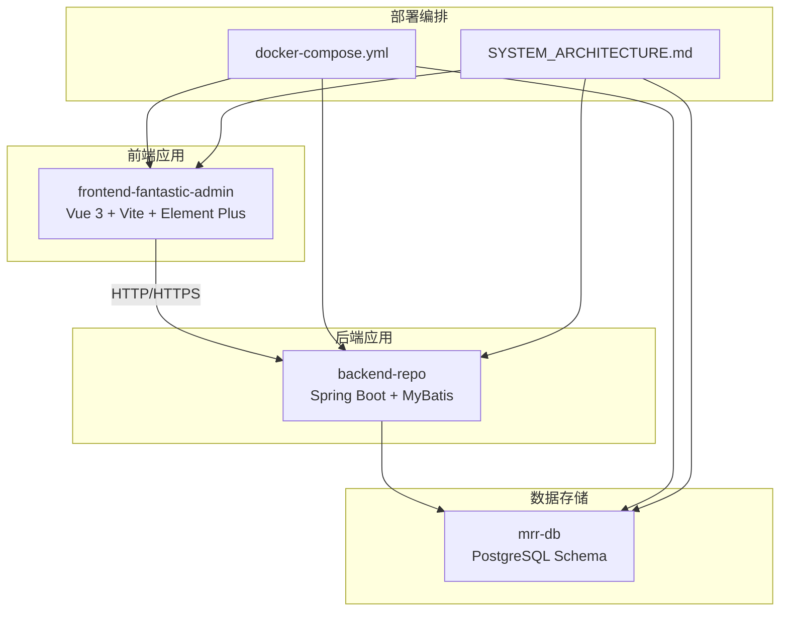
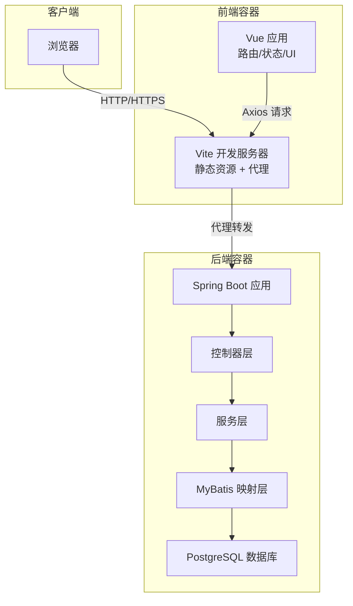
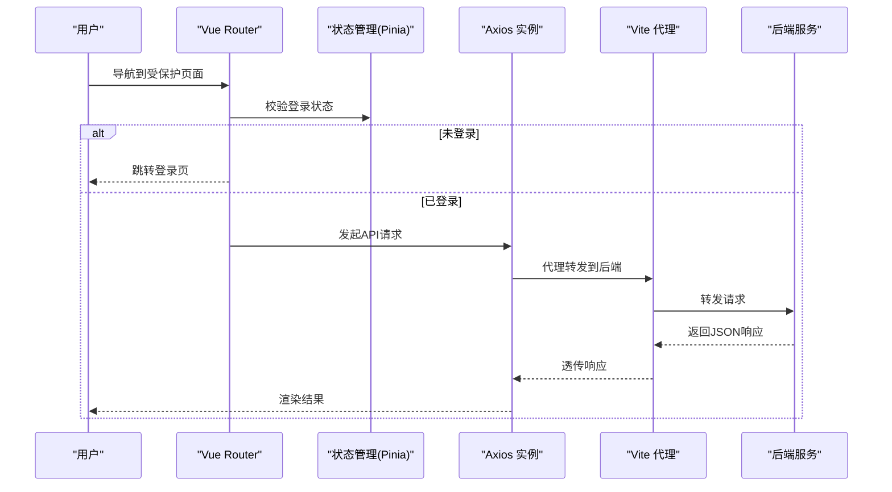
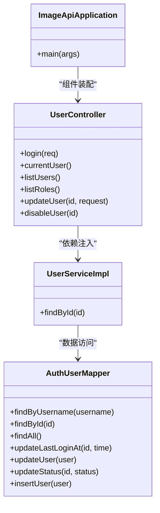
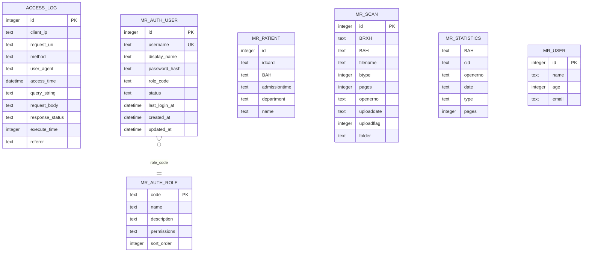
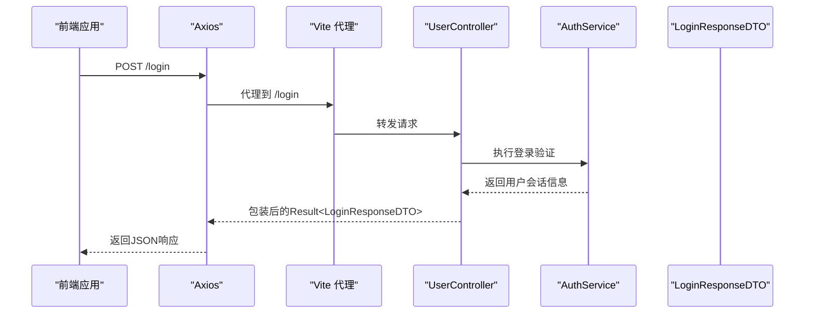
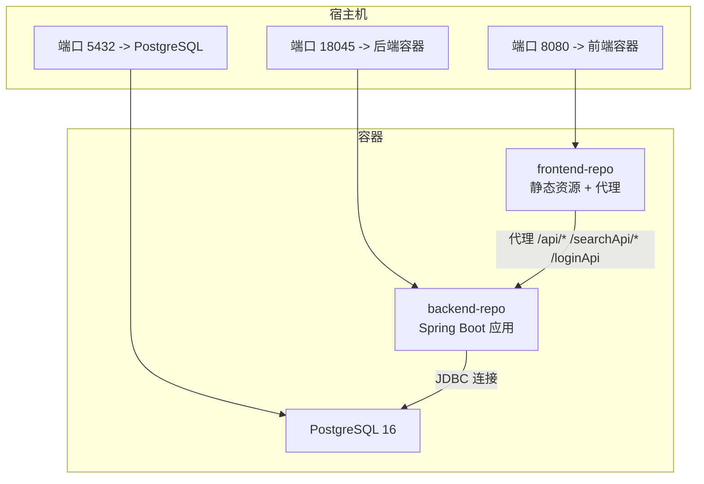
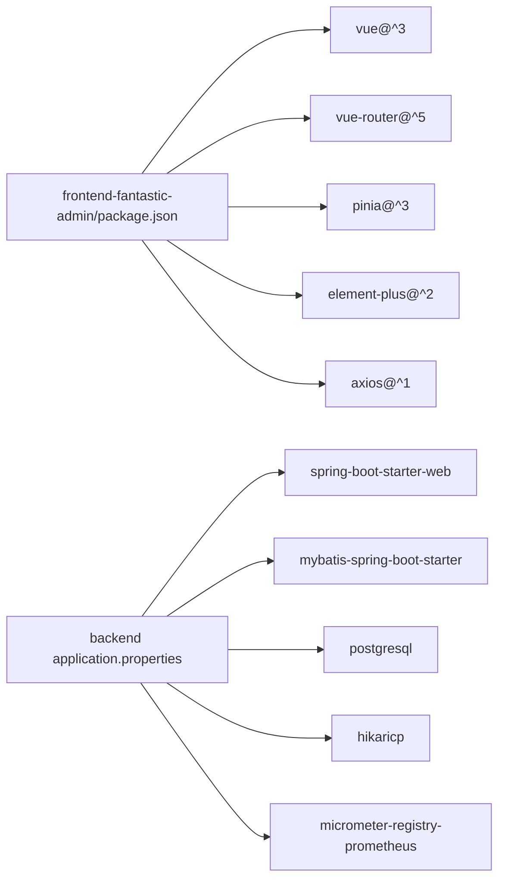

# 技术架构概览

<cite>
**本文档引用的文件**
- [SYSTEM_ARCHITECTURE.md](file://SYSTEM_ARCHITECTURE.md)
- [docker-compose.yml](file://docker-compose.yml)
- [backend-repo/Dockerfile](file://backend-repo/Dockerfile)
- [frontend-fantastic-admin/package.json](file://frontend-fantastic-admin/package.json)
- [mrr-db/schema.sql](file://mrr-db/schema.sql)
- [backend-repo/src/main/java/com/zjcxph/imgapi/ImageApiApplication.java](file://backend-repo/src/main/java/com/zjcxph/imgapi/ImageApiApplication.java)
- [backend-repo/src/main/resources/application.properties](file://backend-repo/src/main/resources/application.properties)
- [frontend-fantastic-admin/vite.config.ts](file://frontend-fantastic-admin/vite.config.ts)
- [backend-repo/API_CONTRACT.md](file://backend-repo/API_CONTRACT.md)
- [frontend-fantastic-admin/src/main.ts](file://frontend-fantastic-admin/src/main.ts)
- [backend-repo/src/main/java/com/zjcxph/imgapi/controller/UserController.java](file://backend-repo/src/main/java/com/zjcxph/imgapi/controller/UserController.java)
- [backend-repo/src/main/java/com/zjcxph/imgapi/service/impl/UserServiceImpl.java](file://backend-repo/src/main/java/com/zjcxph/imgapi/service/impl/UserServiceImpl.java)
- [backend-repo/src/main/java/com/zjcxph/imgapi/mapper/AuthUserMapper.java](file://backend-repo/src/main/java/com/zjcxph/imgapi/mapper/AuthUserMapper.java)
- [frontend-fantastic-admin/src/api/index.ts](file://frontend-fantastic-admin/src/api/index.ts)
- [frontend-fantastic-admin/src/router/index.ts](file://frontend-fantastic-admin/src/router/index.ts)
</cite>

## 目录
1. [引言](#引言)
2. [项目结构](#项目结构)
3. [核心组件](#核心组件)
4. [架构总览](#架构总览)
5. [详细组件分析](#详细组件分析)
6. [依赖关系分析](#依赖关系分析)
7. [性能考虑](#性能考虑)
8. [故障排除指南](#故障排除指南)
9. [结论](#结论)

## 引言
本文件面向MRR医疗记录影像管理系统，提供技术架构概览与深入分析。系统采用前后端分离设计：前端基于Vue 3 + Vite + Element Plus构建，后端采用Spring Boot微服务架构，数据存储使用PostgreSQL，并通过Docker Compose进行容器化部署。架构遵循分层设计原则，明确表现层、业务逻辑层与数据访问层的职责边界；同时提供清晰的API契约、代理与安全策略，确保可维护性、可扩展性与安全性。

## 项目结构
系统采用多仓库组织方式，分别存放前端、后端与数据库脚本：
- 后端仓库（backend-repo）：包含Spring Boot应用、MyBatis映射、配置与测试代码。
- 前端仓库（frontend-fantastic-admin）：包含Vue 3应用、路由、状态管理、UI组件与构建配置。
- 数据库脚本（mrr-db）：包含PostgreSQL初始化表结构与示例数据。
- 部署编排（根目录）：包含Docker Compose编排文件与系统架构说明文档。

图表来源
- [docker-compose.yml:1-47](file://docker-compose.yml#L1-L47)
- [SYSTEM_ARCHITECTURE.md:1-72](file://SYSTEM_ARCHITECTURE.md#L1-L72)

章节来源
- [docker-compose.yml:1-47](file://docker-compose.yml#L1-L47)
- [SYSTEM_ARCHITECTURE.md:1-72](file://SYSTEM_ARCHITECTURE.md#L1-L72)

## 核心组件
- 前端框架与工具链
  - 框架：Vue 3（组合式API、响应式系统）
  - 构建：Vite（开发服务器、热更新、代理）
  - UI库：Element Plus（组件生态）
  - 状态管理：Pinia
  - 路由：Vue Router（哈希历史模式）
  - 网络：Axios（拦截器、重试、错误处理）
  - 工具：Day.js、mitt、NProgress等
- 后端框架与工具链
  - 框架：Spring Boot（自动配置、Starter）
  - ORM：MyBatis（Mapper接口+XML）
  - 数据源：HikariCP连接池
  - 安全：JWT认证、权限注解
  - 监控：Actuator、Prometheus暴露
  - 定时任务：@EnableScheduling
- 数据库
  - PostgreSQL（主数据存储），包含访问日志、患者、扫描记录、统计、用户与角色等核心表
- 部署
  - Docker镜像构建（多阶段构建）、Compose编排（PostgreSQL、后端、前端）

章节来源
- [frontend-fantastic-admin/package.json:1-131](file://frontend-fantastic-admin/package.json#L1-L131)
- [backend-repo/src/main/java/com/zjcxph/imgapi/ImageApiApplication.java:1-20](file://backend-repo/src/main/java/com/zjcxph/imgapi/ImageApiApplication.java#L1-L20)
- [backend-repo/src/main/resources/application.properties:1-49](file://backend-repo/src/main/resources/application.properties#L1-L49)
- [mrr-db/schema.sql:1-95](file://mrr-db/schema.sql#L1-L95)
- [backend-repo/Dockerfile:1-16](file://backend-repo/Dockerfile#L1-L16)

## 架构总览
系统采用三层架构与微服务思想：
- 表现层（前端）：负责用户界面、交互与API调用，通过Vite代理转发到后端。
- 业务逻辑层（后端）：控制器（Thin Controller）+ 服务层（Service），集中处理业务规则与权限控制。
- 数据访问层（后端）：MyBatis Mapper封装SQL，配合实体与DTO完成数据持久化与查询。
- 数据层：PostgreSQL承载核心业务数据与审计日志，支持定时清理与归档策略。

图表来源
- [frontend-fantastic-admin/vite.config.ts:20-32](file://frontend-fantastic-admin/vite.config.ts#L20-L32)
- [backend-repo/API_CONTRACT.md:5-10](file://backend-repo/API_CONTRACT.md#L5-L10)
- [backend-repo/src/main/java/com/zjcxph/imgapi/controller/UserController.java:27-37](file://backend-repo/src/main/java/com/zjcxph/imgapi/controller/UserController.java#L27-L37)
- [backend-repo/src/main/java/com/zjcxph/imgapi/mapper/AuthUserMapper.java:13-29](file://backend-repo/src/main/java/com/zjcxph/imgapi/mapper/AuthUserMapper.java#L13-L29)

## 详细组件分析

### 前端架构与运行机制
- 应用入口与插件注册
  - 在应用入口中注册路由、状态管理、UI提供者与自定义指令，统一挂载应用实例。
- 路由与守卫
  - 使用Vue Router配置常量路由与系统路由，支持基于文件系统的路由生成；设置全局守卫与扩展。
- 网络层与拦截器
  - Axios统一创建实例，支持开发环境代理与生产环境基地址切换；内置请求头注入（Bearer Token）、响应体状态码校验、错误提示与重试机制。
- 构建与开发体验
  - Vite提供开发服务器、热更新与代理配置；支持SCSS全局资源注入与别名解析；生产构建输出至dist目录。

图表来源
- [frontend-fantastic-admin/src/router/index.ts:9-23](file://frontend-fantastic-admin/src/router/index.ts#L9-L23)
- [frontend-fantastic-admin/src/api/index.ts:65-106](file://frontend-fantastic-admin/src/api/index.ts#L65-L106)
- [frontend-fantastic-admin/vite.config.ts:25-31](file://frontend-fantastic-admin/vite.config.ts#L25-L31)

章节来源
- [frontend-fantastic-admin/src/main.ts:21-32](file://frontend-fantastic-admin/src/main.ts#L21-L32)
- [frontend-fantastic-admin/src/router/index.ts:1-24](file://frontend-fantastic-admin/src/router/index.ts#L1-L24)
- [frontend-fantastic-admin/src/api/index.ts:16-108](file://frontend-fantastic-admin/src/api/index.ts#L16-L108)
- [frontend-fantastic-admin/vite.config.ts:10-63](file://frontend-fantastic-admin/vite.config.ts#L10-L63)

### 后端架构与分层设计
- 应用启动与扫描
  - Spring Boot启动类启用调度、配置属性扫描与Mapper扫描，统一装配组件。
- 配置与数据源
  - application.properties集中管理端口、数据源、缓存、压缩、日志、图像路径、访问日志保留策略与AES密钥等。
- 控制器层（薄控制器）
  - 控制器仅做参数绑定、权限注解与返回包装，具体业务逻辑委托给服务层。
- 服务层
  - 业务编排与领域逻辑处理，依赖Mapper进行数据访问。
- 数据访问层
  - MyBatis Mapper接口定义SQL，结合实体与DTO完成查询、更新与插入操作。

图表来源
- [backend-repo/src/main/java/com/zjcxph/imgapi/ImageApiApplication.java:9-12](file://backend-repo/src/main/java/com/zjcxph/imgapi/ImageApiApplication.java#L9-L12)
- [backend-repo/src/main/java/com/zjcxph/imgapi/controller/UserController.java:32-36](file://backend-repo/src/main/java/com/zjcxph/imgapi/controller/UserController.java#L32-L36)
- [backend-repo/src/main/java/com/zjcxph/imgapi/service/impl/UserServiceImpl.java:14-17](file://backend-repo/src/main/java/com/zjcxph/imgapi/service/impl/UserServiceImpl.java#L14-L17)
- [backend-repo/src/main/java/com/zjcxph/imgapi/mapper/AuthUserMapper.java:13-77](file://backend-repo/src/main/java/com/zjcxph/imgapi/mapper/AuthUserMapper.java#L13-L77)

章节来源
- [backend-repo/src/main/java/com/zjcxph/imgapi/ImageApiApplication.java:1-20](file://backend-repo/src/main/java/com/zjcxph/imgapi/ImageApiApplication.java#L1-L20)
- [backend-repo/src/main/resources/application.properties:1-49](file://backend-repo/src/main/resources/application.properties#L1-L49)
- [backend-repo/src/main/java/com/zjcxph/imgapi/controller/UserController.java:1-95](file://backend-repo/src/main/java/com/zjcxph/imgapi/controller/UserController.java#L1-L95)
- [backend-repo/src/main/java/com/zjcxph/imgapi/service/impl/UserServiceImpl.java:1-25](file://backend-repo/src/main/java/com/zjcxph/imgapi/service/impl/UserServiceImpl.java#L1-L25)
- [backend-repo/src/main/java/com/zjcxph/imgapi/mapper/AuthUserMapper.java:1-78](file://backend-repo/src/main/java/com/zjcxph/imgapi/mapper/AuthUserMapper.java#L1-L78)

### 数据模型与表结构
系统核心数据模型围绕“访问日志、患者、扫描记录、统计、用户与角色”展开，采用PostgreSQL作为主数据存储，支持审计与合规要求。

图表来源
- [mrr-db/schema.sql:1-95](file://mrr-db/schema.sql#L1-L95)

章节来源
- [mrr-db/schema.sql:1-95](file://mrr-db/schema.sql#L1-L95)

### API设计与数据传输协议
- 网关/代理映射
  - 前端通过Vite代理将/api/*映射到后端/v1/*，/searchApi/*映射到/v2/*，/loginApi映射到/login。
- 认证与授权
  - 登录接口返回令牌，后续请求在请求头中携带Bearer Token；控制器方法使用权限注解进行细粒度授权。
- 数据传输格式
  - 统一使用JSON；后端返回包装对象包含状态码与数据字段；前端拦截器对响应进行校验与错误提示。
- 文件下载
  - 批量下载接口返回二进制流（zip），前端接收后触发浏览器下载。

图表来源
- [backend-repo/API_CONTRACT.md:13-15](file://backend-repo/API_CONTRACT.md#L13-L15)
- [backend-repo/src/main/java/com/zjcxph/imgapi/controller/UserController.java:38-47](file://backend-repo/src/main/java/com/zjcxph/imgapi/controller/UserController.java#L38-L47)
- [frontend-fantastic-admin/src/api/index.ts:65-106](file://frontend-fantastic-admin/src/api/index.ts#L65-L106)

章节来源
- [backend-repo/API_CONTRACT.md:1-44](file://backend-repo/API_CONTRACT.md#L1-L44)
- [frontend-fantastic-admin/vite.config.ts:25-31](file://frontend-fantastic-admin/vite.config.ts#L25-L31)
- [frontend-fantastic-admin/src/api/index.ts:16-108](file://frontend-fantastic-admin/src/api/index.ts#L16-L108)
- [backend-repo/src/main/java/com/zjcxph/imgapi/controller/UserController.java:38-47](file://backend-repo/src/main/java/com/zjcxph/imgapi/controller/UserController.java#L38-L47)

### 部署拓扑与服务间通信
- 容器编排
  - PostgreSQL容器：持久化卷、健康检查、端口映射。
  - 后端容器：多阶段构建、暴露端口、依赖数据库健康状态。
  - 前端容器：构建后提供静态资源，代理API、Swagger与Actuator路径。
- 服务间通信
  - 前端通过同一域名下的代理访问后端；后端通过JDBC连接PostgreSQL；后端内部通过Spring组件依赖注入进行服务协作。

图表来源
- [docker-compose.yml:1-47](file://docker-compose.yml#L1-L47)
- [backend-repo/Dockerfile:1-16](file://backend-repo/Dockerfile#L1-L16)

章节来源
- [docker-compose.yml:1-47](file://docker-compose.yml#L1-L47)
- [backend-repo/Dockerfile:1-16](file://backend-repo/Dockerfile#L1-L16)

### 安全与合规
- 认证与授权
  - JWT令牌用于会话保持；权限注解限制敏感操作；登录成功后返回令牌，前端在请求头中携带。
- 数据保护
  - AES密钥通过环境变量配置，需在生产环境覆盖默认值；密码哈希存储于用户表。
- 日志与审计
  - 访问日志表记录请求元数据，支持导出与清理；默认不自动删除，手动清理流程可追溯。
- 运维可观测性
  - Actuator暴露健康、指标与Prometheus端点，便于监控与告警。

章节来源
- [backend-repo/src/main/resources/application.properties:40-49](file://backend-repo/src/main/resources/application.properties#L40-L49)
- [mrr-db/schema.sql:1-14](file://mrr-db/schema.sql#L1-L14)
- [SYSTEM_ARCHITECTURE.md:34-47](file://SYSTEM_ARCHITECTURE.md#L34-L47)

## 依赖关系分析
- 前端依赖
  - Vue 3、Vue Router、Pinia、Element Plus、Axios、Day.js、mitt、NProgress等，构成现代单页应用栈。
- 后端依赖
  - Spring Boot Starter、MyBatis、PostgreSQL驱动、HikariCP、Actuator、Swagger等，支撑企业级后端服务。
- 前后端耦合点
  - 通过API契约与Vite代理解耦；前端通过统一拦截器处理错误与重试，降低耦合复杂度。

图表来源
- [frontend-fantastic-admin/package.json:27-60](file://frontend-fantastic-admin/package.json#L27-L60)
- [backend-repo/src/main/resources/application.properties:10-49](file://backend-repo/src/main/resources/application.properties#L10-L49)

章节来源
- [frontend-fantastic-admin/package.json:1-131](file://frontend-fantastic-admin/package.json#L1-L131)
- [backend-repo/src/main/resources/application.properties:1-49](file://backend-repo/src/main/resources/application.properties#L1-L49)

## 性能考虑
- 前端
  - Vite开发服务器与按需加载提升开发效率；生产构建开启SourceMap可选；SCSS全局资源减少重复引入。
- 后端
  - Hikari连接池参数可调优；启用响应压缩与静态资源缓存；Actuator指标便于性能观测。
- 数据库
  - 合理索引（如用户表用户名与角色外键）提升查询性能；日志表按需清理避免膨胀。
- 部署
  - 多阶段构建减小镜像体积；Compose编排简化部署与扩缩容。

## 故障排除指南
- 常见问题定位
  - 前端：检查Vite代理目标与开关、请求头是否正确注入Token、拦截器错误提示。
  - 后端：查看日志文件位置、Actuator健康与指标端点、数据库连接参数。
  - 数据库：确认PostgreSQL健康检查、Schema初始化脚本执行情况。
- 错误处理流程
  - 前端：401自动登出、统一错误提示、可配置重试次数；后端：全局异常处理器返回标准包装对象。
- 清理与审计
  - 访问日志清理需先导出再删除，确保可追溯；默认保留期与批处理大小可在配置中调整。

章节来源
- [frontend-fantastic-admin/src/api/index.ts:40-63](file://frontend-fantastic-admin/src/api/index.ts#L40-L63)
- [backend-repo/src/main/resources/application.properties:24-49](file://backend-repo/src/main/resources/application.properties#L24-L49)
- [SYSTEM_ARCHITECTURE.md:34-47](file://SYSTEM_ARCHITECTURE.md#L34-L47)

## 结论
MRR系统通过前后端分离与容器化部署，实现了模块化、可测试与可运维的架构目标。前端以Vue 3为核心，配合Vite与Element Plus构建现代化界面；后端采用Spring Boot与MyBatis，清晰分层与统一API契约保障了可扩展性。数据库层面以PostgreSQL为主，辅以日志保留与清理策略，满足合规与性能需求。未来可在配置中心化、领域拆分、分页导出与对象存储等方面持续演进。