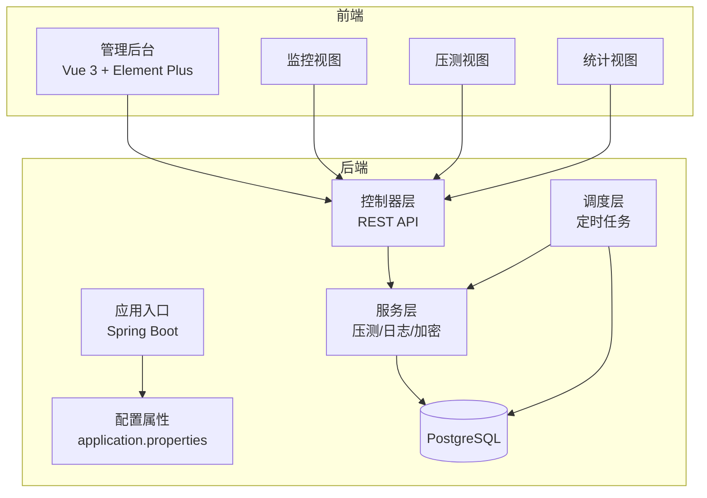
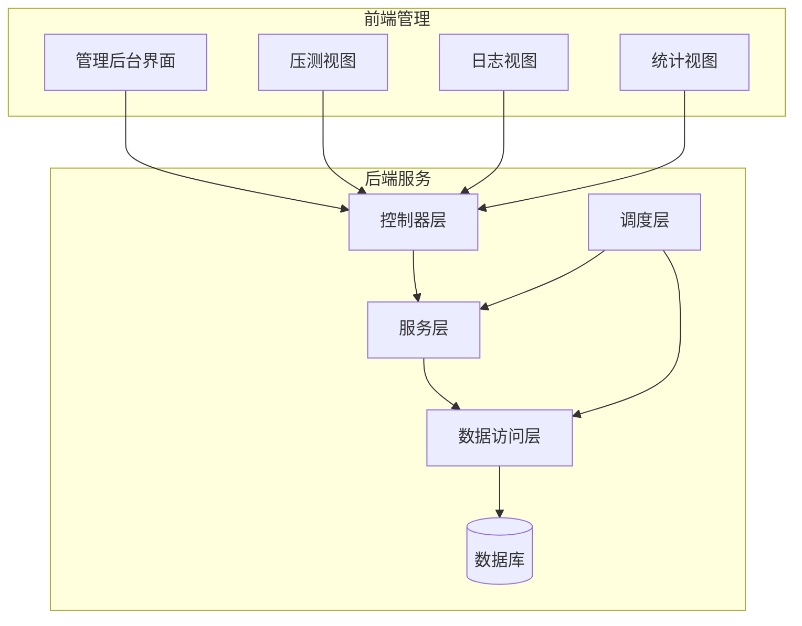
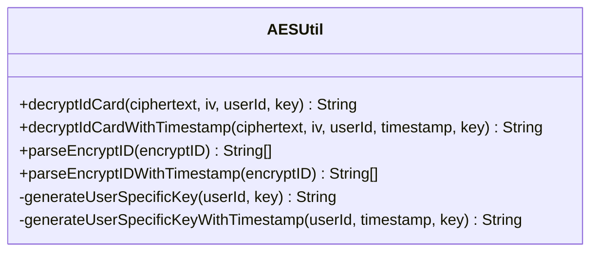
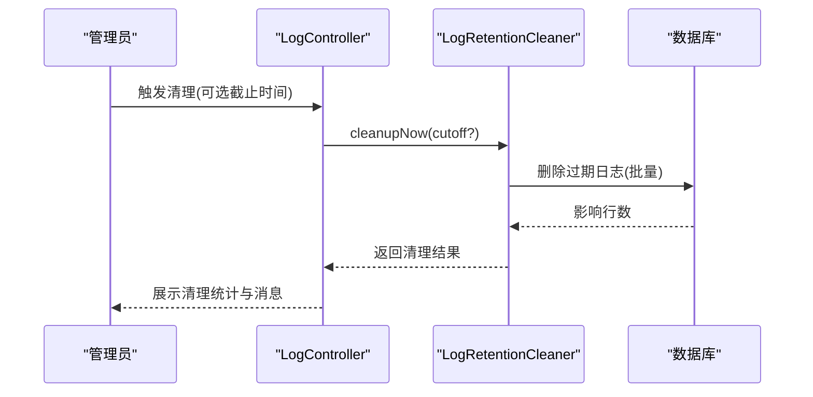
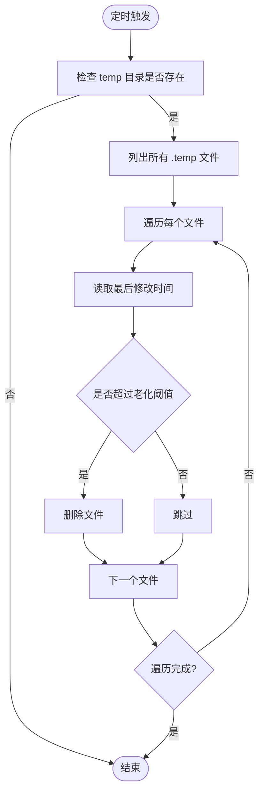
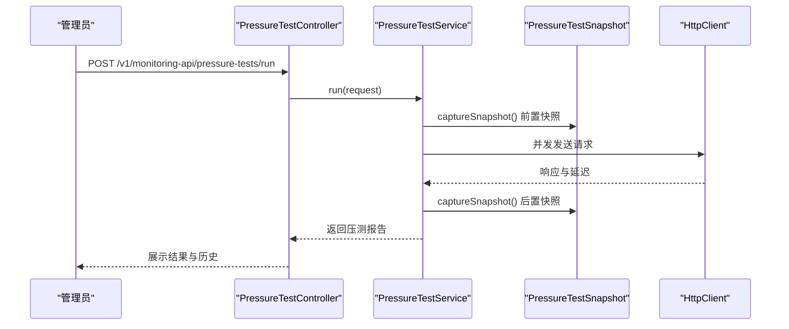
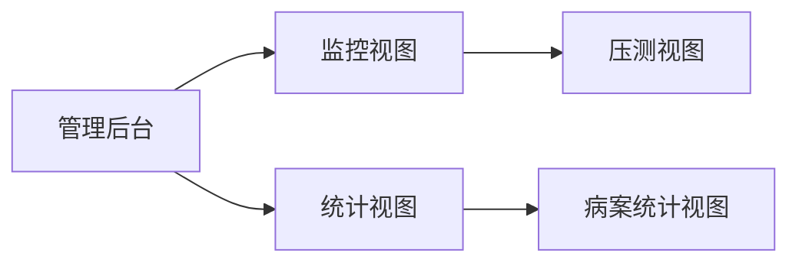
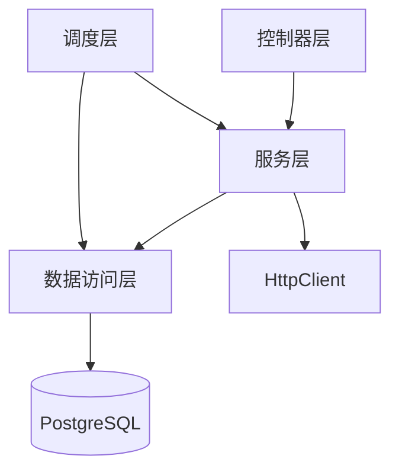

# 系统特性与优势

<cite>
**本文档引用的文件**
- [ImageApiApplication.java](file://backend-repo/src/main/java/com/zjcxph/imgapi/ImageApiApplication.java)
- [LogRetentionProperties.java](file://backend-repo/src/main/java/com/zjcxph/imgapi/config/LogRetentionProperties.java)
- [LogRetentionCleaner.java](file://backend-repo/src/main/java/com/zjcxph/imgapi/scheduler/LogRetentionCleaner.java)
- [PressureTestService.java](file://backend-repo/src/main/java/com/zjcxph/imgapi/monitoring/PressureTestService.java)
- [PressureTestController.java](file://backend-repo/src/main/java/com/zjcxph/imgapi/controller/PressureTestController.java)
- [PressureTestSnapshot.java](file://backend-repo/src/main/java/com/zjcxph/imgapi/monitoring/PressureTestSnapshot.java)
- [AESUtil.java](file://backend-repo/src/main/java/com/zjcxph/imgapi/utils/AESUtil.java)
- [TempZipCleaner.java](file://backend-repo/src/main/java/com/zjcxph/imgapi/scheduler/TempZipCleaner.java)
- [LogController.java](file://backend-repo/src/main/java/com/zjcxph/imgapi/controller/LogController.java)
- [application.properties](file://backend-repo/src/main/resources/application.properties)
- [SYSTEM_ARCHITECTURE.md](file://SYSTEM_ARCHITECTURE.md)
- [PressureTestView.vue](file://frontend-repo/src/components/admin/PressureTestView.vue)
- [RecordsStatisticsView.vue](file://frontend-repo/src/components/admin/RecordsStatisticsView.vue)
- [MonitoringView.vue](file://frontend-repo/src/views/admin/MonitoringView.vue)
- [LogRetentionCleanupResult.java](file://backend-repo/src/main/java/com/zjcxph/imgapi/dto/resp/LogRetentionCleanupResult.java)
</cite>

## 目录
1. [引言](#引言)
2. [项目结构](#项目结构)
3. [核心组件](#核心组件)
4. [架构概览](#架构概览)
5. [详细组件分析](#详细组件分析)
6. [依赖分析](#依赖分析)
7. [性能考量](#性能考量)
8. [故障排除指南](#故障排除指南)
9. [结论](#结论)
10. [附录](#附录)

## 引言
本文件系统性阐述 MRR 医疗记录影像管理系统的特性与优势，重点覆盖以下方面：
- 数据安全设计：基于对称加密的敏感信息保护与密钥管理
- 日志保留策略：可配置的保留窗口、批量清理与导出审计
- 自动清理机制：定时任务与批处理策略，避免一次性全量删除
- 手动清理可追溯性：先导出再清理，提供清理结果与统计
- 压力测试功能：内置压测模块，支持并发、吞吐、延迟与内存快照
- 内存快照监控：实时采集 JVM 堆内存与系统负载快照
- 可扩展性与可维护性：模块化分层、配置驱动与运维友好接口
- 合规性优势：默认安全策略、可审计流程与最小暴露面

通过与传统医疗影像管理系统的对比，突出 MRR 在安全性、可观测性、自动化运维与用户体验方面的创新与改进。

## 项目结构
系统采用前后端分离架构，后端基于 Spring Boot + MyBatis，前端采用 Vue 3 + Element Plus，数据库为 PostgreSQL。核心特性分布在以下层次：
- 应用入口与配置：Spring Boot 启动类、配置属性与调度开关
- 控制器层：对外暴露 API，封装业务调用与响应包装
- 服务层：核心业务逻辑，如压测执行、日志清理、加密工具
- 调度层：定时任务，负责日志清理与临时文件清理
- 前端管理面板：提供压测、统计、监控等管理能力

**图表来源**
- [ImageApiApplication.java:1-20](file://backend-repo/src/main/java/com/zjcxph/imgapi/ImageApiApplication.java#L1-L20)
- [application.properties:1-49](file://backend-repo/src/main/resources/application.properties#L1-L49)

**章节来源**
- [SYSTEM_ARCHITECTURE.md:1-72](file://SYSTEM_ARCHITECTURE.md#L1-L72)
- [ImageApiApplication.java:1-20](file://backend-repo/src/main/java/com/zjcxph/imgapi/ImageApiApplication.java#L1-L20)
- [application.properties:1-49](file://backend-repo/src/main/resources/application.properties#L1-L49)

## 核心组件
- 数据安全组件：AESUtil 提供基于 AES/CBC 的加解密能力，支持用户级密钥派生与时间戳增强方案，确保敏感信息（如身份证号）在传输与存储中的机密性与完整性。
- 日志保留组件：LogRetentionProperties 定义保留策略；LogRetentionCleaner 实现定时清理与手动清理，支持批量删除与剩余量统计；LogController 提供清理触发与 CSV 导出接口。
- 压力测试组件：PressureTestService 支持并发请求、采样统计、延迟分布与内存快照；PressureTestController 暴露运行、历史查询与清理接口；前端 PressureTestView 提供可视化配置与结果展示。
- 内存快照组件：PressureTestSnapshot 采集堆使用、提交容量、最大容量、使用率与系统负载等指标，支撑压测过程中的资源监控。
- 自动清理组件：TempZipCleaner 清理临时压缩文件，防止磁盘空间长期占用。
- 配置与属性：application.properties 集中管理数据库连接、缓存、压缩、日志保留参数与 AES 密钥等。

**章节来源**
- [AESUtil.java:1-233](file://backend-repo/src/main/java/com/zjcxph/imgapi/utils/AESUtil.java#L1-L233)
- [LogRetentionProperties.java:1-54](file://backend-repo/src/main/java/com/zjcxph/imgapi/config/LogRetentionProperties.java#L1-L54)
- [LogRetentionCleaner.java:1-119](file://backend-repo/src/main/java/com/zjcxph/imgapi/scheduler/LogRetentionCleaner.java#L1-L119)
- [LogController.java:1-245](file://backend-repo/src/main/java/com/zjcxph/imgapi/controller/LogController.java#L1-L245)
- [PressureTestService.java:1-293](file://backend-repo/src/main/java/com/zjcxph/imgapi/monitoring/PressureTestService.java#L1-L293)
- [PressureTestController.java:1-73](file://backend-repo/src/main/java/com/zjcxph/imgapi/controller/PressureTestController.java#L1-L73)
- [PressureTestSnapshot.java:1-118](file://backend-repo/src/main/java/com/zjcxph/imgapi/monitoring/PressureTestSnapshot.java#L1-L118)
- [TempZipCleaner.java:1-57](file://backend-repo/src/main/java/com/zjcxph/imgapi/scheduler/TempZipCleaner.java#L1-L57)
- [application.properties:1-49](file://backend-repo/src/main/resources/application.properties#L1-L49)

## 架构概览
MRR 采用“薄控制器、厚服务”的分层设计，调度器负责周期性任务，服务层承担业务逻辑，控制器仅做参数校验与结果封装。日志保留遵循“默认安全、手动可追溯”原则：默认关闭自动清理，要求管理员先导出再清理，并在管理面板展示清理结果。

**图表来源**
- [SYSTEM_ARCHITECTURE.md:18-31](file://SYSTEM_ARCHITECTURE.md#L18-L31)
- [LogController.java:1-245](file://backend-repo/src/main/java/com/zjcxph/imgapi/controller/LogController.java#L1-L245)
- [PressureTestController.java:1-73](file://backend-repo/src/main/java/com/zjcxph/imgapi/controller/PressureTestController.java#L1-L73)

## 详细组件分析

### 数据安全设计（AES 加密）
- 特性要点
  - 支持用户级密钥派生与时间戳增强，提升密钥多样性与抗重放能力
  - 提供多种解密方法，兼容旧版与新版加密格式
  - 错误处理集中记录，便于审计与排障
- 技术实现
  - 使用 AES/CBC/PKCS5Padding 模式
  - 密钥长度统一为 32 字节，不足补位
  - 十六进制编码的密文与 IV 便于跨语言解析
- 业务价值
  - 保障患者隐私数据在传输与存储中的机密性
  - 支持密钥轮换与版本演进，满足合规要求

**图表来源**
- [AESUtil.java:1-233](file://backend-repo/src/main/java/com/zjcxph/imgapi/utils/AESUtil.java#L1-L233)

**章节来源**
- [AESUtil.java:1-233](file://backend-repo/src/main/java/com/zjcxph/imgapi/utils/AESUtil.java#L1-L233)

### 日志保留策略与清理流程
- 特性要点
  - 可配置保留天数、批大小与每轮最大批次，避免大事务阻塞
  - 默认关闭自动清理，强制手动导出与清理，确保可追溯
  - 提供清理结果 DTO，包含执行时间、截止时间、删除数量与剩余量
- 技术实现
  - 定时任务按 Cron 表达式执行清理
  - 批量删除 + 剩余计数，支持多次运行逐步收敛
  - 导出接口支持流式输出 CSV，便于归档与审计
- 业务价值
  - 平衡存储成本与合规要求
  - 降低数据库膨胀风险，提升查询性能

**图表来源**
- [LogController.java:94-106](file://backend-repo/src/main/java/com/zjcxph/imgapi/controller/LogController.java#L94-L106)
- [LogRetentionCleaner.java:31-37](file://backend-repo/src/main/java/com/zjcxph/imgapi/scheduler/LogRetentionCleaner.java#L31-L37)
- [LogRetentionCleanupResult.java:1-119](file://backend-repo/src/main/java/com/zjcxph/imgapi/dto/resp/LogRetentionCleanupResult.java#L1-L119)

**章节来源**
- [LogRetentionProperties.java:1-54](file://backend-repo/src/main/java/com/zjcxph/imgapi/config/LogRetentionProperties.java#L1-L54)
- [LogRetentionCleaner.java:1-119](file://backend-repo/src/main/java/com/zjcxph/imgapi/scheduler/LogRetentionCleaner.java#L1-L119)
- [LogController.java:108-148](file://backend-repo/src/main/java/com/zjcxph/imgapi/controller/LogController.java#L108-L148)
- [LogRetentionCleanupResult.java:1-119](file://backend-repo/src/main/java/com/zjcxph/imgapi/dto/resp/LogRetentionCleanupResult.java#L1-L119)

### 自动清理机制（临时文件）
- 特性要点
  - 每日定时清理 temp 目录下的过期 .temp 文件
  - 基于最后修改时间判断老化阈值，避免误删活跃文件
- 技术实现
  - 使用 NIO 读取文件属性，比较时间差
  - 异常捕获，保证清理任务健壮性
- 业务价值
  - 防止临时文件堆积导致磁盘空间不足
  - 降低人工巡检成本

**图表来源**
- [TempZipCleaner.java:1-57](file://backend-repo/src/main/java/com/zjcxph/imgapi/scheduler/TempZipCleaner.java#L1-L57)

**章节来源**
- [TempZipCleaner.java:1-57](file://backend-repo/src/main/java/com/zjcxph/imgapi/scheduler/TempZipCleaner.java#L1-L57)

### 压力测试功能与内存快照监控
- 特性要点
  - 支持 GET/POST/PUT/PATCH/DELETE 方法与自定义请求头/体
  - 并发执行、采样统计（成功/失败、延迟、吞吐）、历史保留与可视化
  - 内存快照采集：堆使用、提交容量、最大容量、使用率与系统负载
- 技术实现
  - 固定线程池并发执行请求
  - 使用 HttpClient 发送请求并统计延迟与状态码
  - 压测报告包含运行标识、指标摘要与样本序列
- 业务价值
  - 快速评估系统在高负载下的稳定性与性能瓶颈
  - 为容量规划与优化提供数据支撑

**图表来源**
- [PressureTestController.java:35-41](file://backend-repo/src/main/java/com/zjcxph/imgapi/controller/PressureTestController.java#L35-L41)
- [PressureTestService.java:44-112](file://backend-repo/src/main/java/com/zjcxph/imgapi/monitoring/PressureTestService.java#L44-L112)
- [PressureTestSnapshot.java:232-251](file://backend-repo/src/main/java/com/zjcxph/imgapi/monitoring/PressureTestSnapshot.java#L232-L251)

**章节来源**
- [PressureTestService.java:1-293](file://backend-repo/src/main/java/com/zjcxph/imgapi/monitoring/PressureTestService.java#L1-L293)
- [PressureTestController.java:1-73](file://backend-repo/src/main/java/com/zjcxph/imgapi/controller/PressureTestController.java#L1-L73)
- [PressureTestSnapshot.java:1-118](file://backend-repo/src/main/java/com/zjcxph/imgapi/monitoring/PressureTestSnapshot.java#L1-L118)
- [PressureTestView.vue:1-305](file://frontend-repo/src/components/admin/PressureTestView.vue#L1-L305)

### 前端监控与统计能力
- 压测监控视图：提供表单配置、执行按钮、历史列表与最新结果展示
- 统计视图：展示病案扫描数据的总记录数、总页数、唯一病案号数与日期趋势
- 监控入口：统一挂载到管理后台路由

**图表来源**
- [MonitoringView.vue:1-8](file://frontend-repo/src/views/admin/MonitoringView.vue#L1-L8)
- [PressureTestView.vue:1-305](file://frontend-repo/src/components/admin/PressureTestView.vue#L1-L305)
- [RecordsStatisticsView.vue:1-800](file://frontend-repo/src/components/admin/RecordsStatisticsView.vue#L1-L800)

**章节来源**
- [MonitoringView.vue:1-8](file://frontend-repo/src/views/admin/MonitoringView.vue#L1-L8)
- [PressureTestView.vue:1-305](file://frontend-repo/src/components/admin/PressureTestView.vue#L1-L305)
- [RecordsStatisticsView.vue:1-800](file://frontend-repo/src/components/admin/RecordsStatisticsView.vue#L1-L800)

## 依赖分析
- 组件耦合
  - 控制器依赖服务层，服务层依赖数据访问层与外部网络客户端
  - 调度器独立于控制器，通过服务层与数据访问层交互
- 关键依赖链
  - LogController → LogRetentionCleaner → LogMapper → 数据库
  - PressureTestController → PressureTestService → HttpClient → 后端 API
- 外部集成
  - PostgreSQL 作为主数据存储
  - 流式导出 CSV 用于日志归档
  - 前端通过代理访问后端 API，统一浏览器同源策略

**图表来源**
- [SYSTEM_ARCHITECTURE.md:18-31](file://SYSTEM_ARCHITECTURE.md#L18-L31)
- [LogController.java:1-245](file://backend-repo/src/main/java/com/zjcxph/imgapi/controller/LogController.java#L1-L245)
- [PressureTestController.java:1-73](file://backend-repo/src/main/java/com/zjcxph/imgapi/controller/PressureTestController.java#L1-L73)

**章节来源**
- [SYSTEM_ARCHITECTURE.md:18-31](file://SYSTEM_ARCHITECTURE.md#L18-L31)

## 性能考量
- 压测指标
  - 成功率、吞吐量（rps）、最小/平均/P95/最大延迟、运行时长
  - 内存快照：堆使用、提交容量、最大容量与使用率
- 清理策略
  - 批量删除 + 最大批次限制，避免长时间锁与长事务
  - 剩余量统计与警告，指导后续清理计划
- 缓存与压缩
  - 启用响应压缩与静态资源缓存，降低带宽与延迟

**章节来源**
- [PressureTestService.java:75-99](file://backend-repo/src/main/java/com/zjcxph/imgapi/monitoring/PressureTestService.java#L75-L99)
- [LogRetentionCleaner.java:71-110](file://backend-repo/src/main/java/com/zjcxph/imgapi/scheduler/LogRetentionCleaner.java#L71-L110)
- [application.properties:4-8](file://backend-repo/src/main/resources/application.properties#L4-L8)

## 故障排除指南
- 日志清理失败
  - 检查保留策略配置（启用标志、保留天数、批大小、最大批次）
  - 查看清理结果中的消息与剩余量，确认是否达到最大批次限制
  - 如需强制执行，可在关闭状态下传入强制参数
- 压测执行异常
  - 校验目标地址、方法、并发与总请求数
  - 查看历史记录中的错误信息与中断原因
- 内存快照异常
  - 确认系统负载平均值有效性（NaN 或负值将被归零处理）
- 临时文件未清理
  - 检查 temp 目录存在性与权限
  - 确认文件最后修改时间是否超过老化阈值

**章节来源**
- [LogRetentionCleaner.java:110-114](file://backend-repo/src/main/java/com/zjcxph/imgapi/scheduler/LogRetentionCleaner.java#L110-L114)
- [PressureTestService.java:180-187](file://backend-repo/src/main/java/com/zjcxph/imgapi/monitoring/PressureTestService.java#L180-L187)
- [TempZipCleaner.java:44-53](file://backend-repo/src/main/java/com/zjcxph/imgapi/scheduler/TempZipCleaner.java#L44-L53)

## 结论
MRR 医疗记录影像管理系统通过模块化设计与配置驱动，实现了安全、可观测、可维护与可扩展的系统能力。其核心优势体现在：
- 安全性：AES 加密与密钥管理，保障敏感数据机密性
- 可靠性：日志保留策略与自动清理机制，兼顾合规与性能
- 可观测性：压测模块与内存快照，提供性能与资源洞察
- 可用性：前端管理面板与导出审计，简化运维与监管流程
- 合规性：默认安全策略与可追溯流程，满足医疗行业数据治理要求

## 附录
- 配置项建议
  - 日志保留：根据法规要求设定保留天数，合理配置批大小与最大批次
  - 压测：从低并发与低请求数起步，逐步放大，结合内存快照定位瓶颈
  - 加密：生产环境务必替换默认密钥，定期轮换并审计密钥使用
- 部署建议
  - 使用容器编排，统一暴露前端代理与后端 API
  - 开启 Prometheus 指标导出，配合压测与清理任务进行持续监控