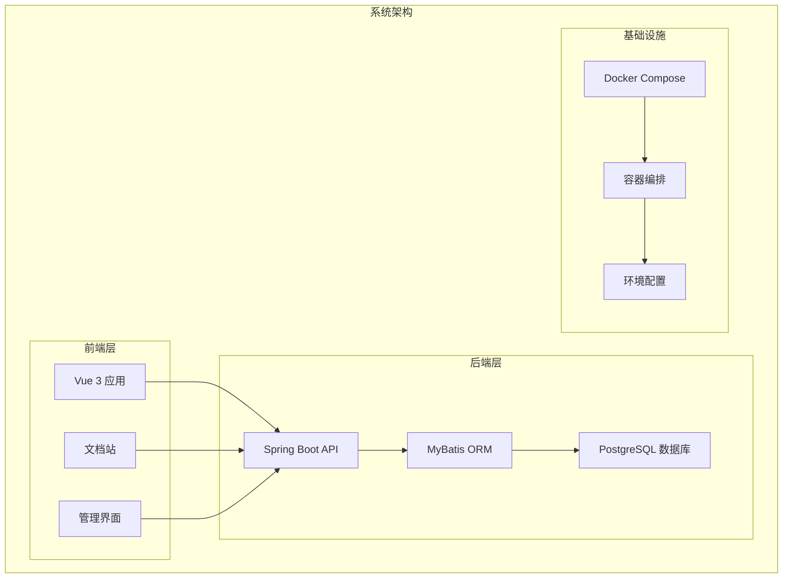
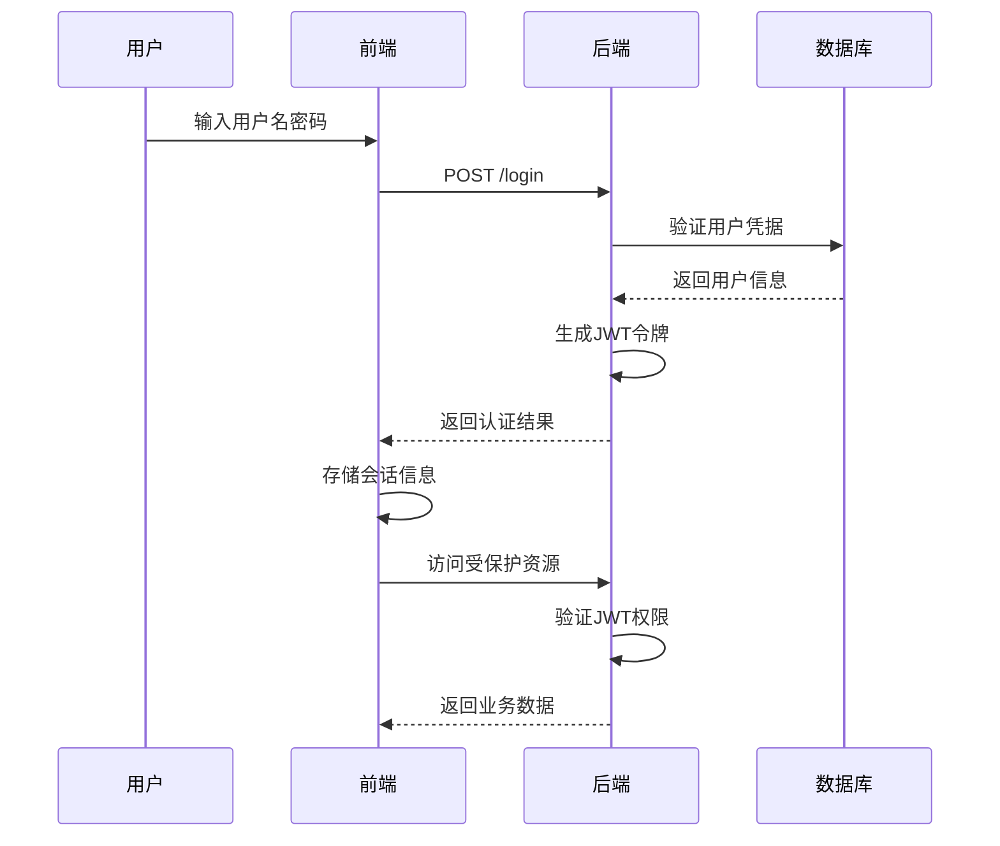
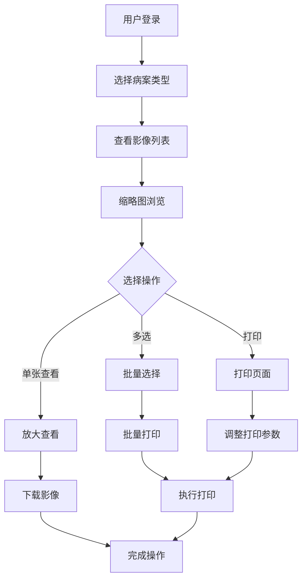
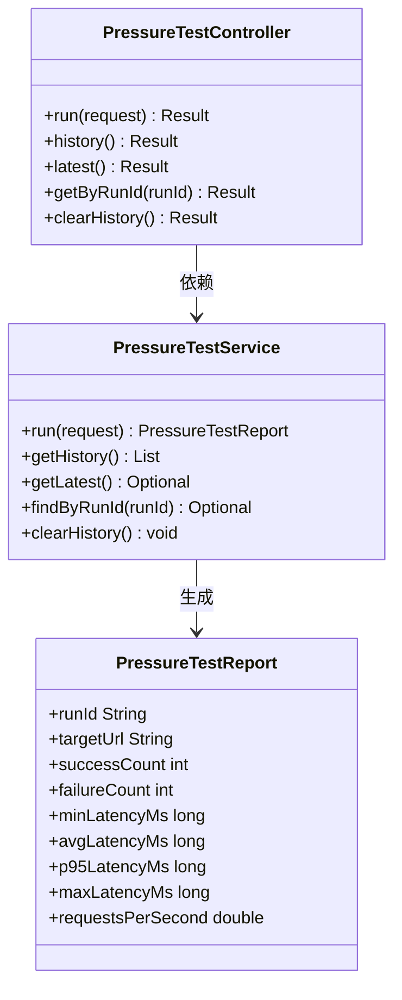
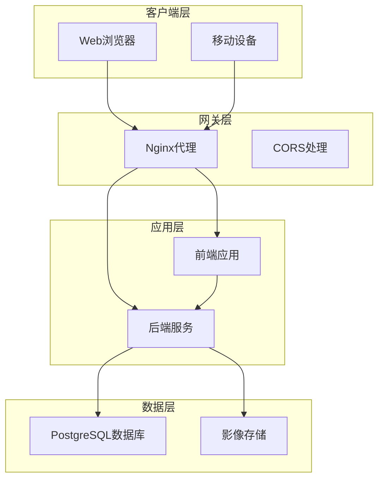
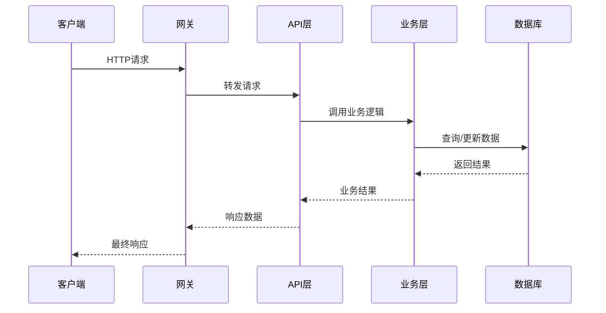
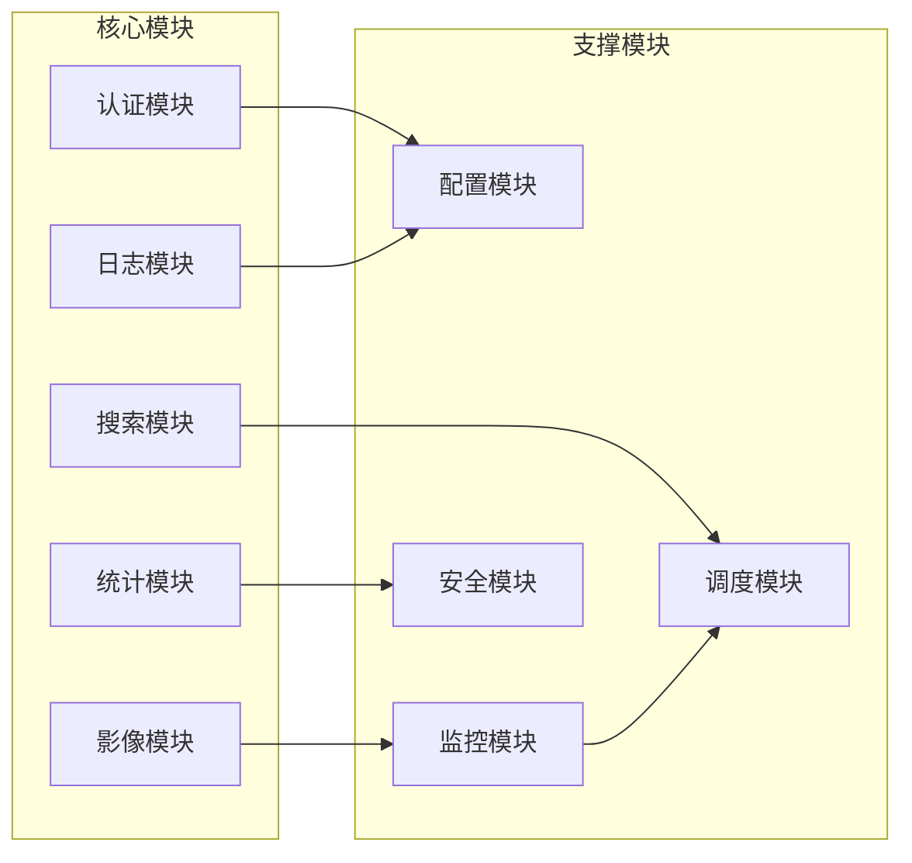
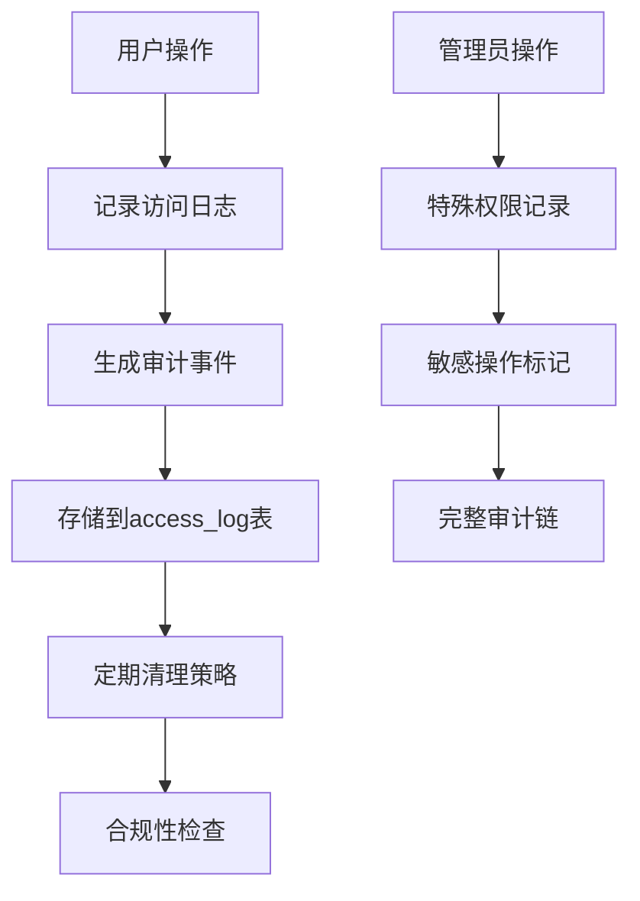
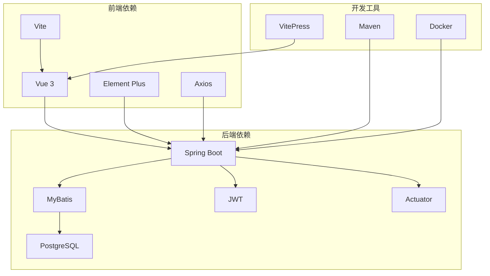
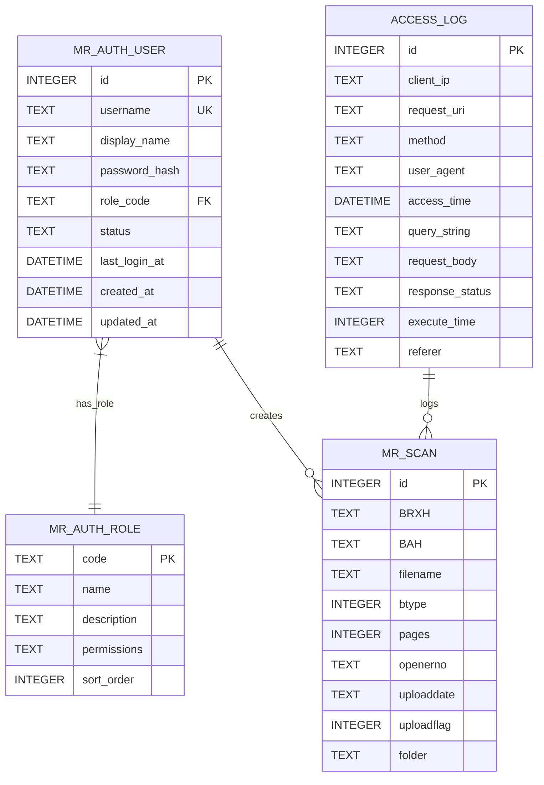

# 系统目标与愿景

<cite>
**本文引用的文件**
- [SYSTEM_ARCHITECTURE.md](file://SYSTEM_ARCHITECTURE.md)
- [README.md](file://backend-repo/README.md)
- [项目说明文档.md](file://frontend-repo/docs/guide/项目说明文档.md)
- [schema.sql](file://mrr-db/schema.sql)
- [ImageApiApplication.java](file://backend-repo/src/main/java/com/zjcxph/imgapi/ImageApiApplication.java)
- [API_CONTRACT.md](file://backend-repo/API_CONTRACT.md)
- [application.properties](file://backend-repo/src/main/resources/application.properties)
- [docker-compose.yml](file://docker-compose.yml)
- [Dockerfile](file://backend-repo/Dockerfile)
- [PressureTestController.java](file://backend-repo/src/main/java/com/zjcxph/imgapi/controller/PressureTestController.java)
- [PressureTestService.java](file://backend-repo/src/main/java/com/zjcxph/imgapi/monitoring/PressureTestService.java)
- [LogRetentionCleaner.java](file://backend-repo/src/main/java/com/zjcxph/imgapi/scheduler/LogRetentionCleaner.java)
</cite>

## 目录
1. [引言](#引言)
2. [项目结构](#项目结构)
3. [核心组件](#核心组件)
4. [架构概览](#架构概览)
5. [详细组件分析](#详细组件分析)
6. [依赖关系分析](#依赖关系分析)
7. [性能考虑](#性能考虑)
8. [故障排除指南](#故障排除指南)
9. [结论](#结论)
10. [附录](#附录)

## 引言

MRR医疗记录影像管理系统是一套面向病案影像管理场景的前后端一体化系统，致力于解决医疗机构在医学影像管理方面的核心痛点。系统通过模块化设计、严格的访问控制和完善的审计追踪机制，为医院管理者、技术人员和医生提供高效、安全、合规的影像管理解决方案。

### 核心使命

系统的核心使命是"让医学影像管理更简单、更安全、更合规"。通过提供统一的影像浏览、打印、统计分析和后台管理功能，帮助医疗机构实现：

- **数据集中化管理**：统一存储和管理各类医学影像数据
- **访问安全保障**：基于角色的精细化权限控制
- **合规性保障**：完整的审计追踪和数据保留策略
- **操作便利性**：直观的用户界面和高效的业务流程

### 长期愿景

成为国内领先的医疗记录影像管理平台，推动医疗信息化向智能化、标准化方向发展。通过持续的技术创新和功能完善，实现：

- **智能化管理**：引入AI辅助诊断和智能检索功能
- **云端化服务**：提供弹性扩展的云服务模式
- **标准化输出**：支持国家医疗信息标准的数据交换
- **生态化发展**：构建开放的医疗信息化生态系统

### 业务目标

系统设定的业务目标包括：

1. **技术目标**：实现模块化、可测试、可部署的系统架构
2. **运营目标**：建立安全可靠的日志保留和清理机制
3. **管理目标**：提供完善的后台管理和监控能力
4. **合规目标**：满足医疗行业的数据保护和审计要求

## 项目结构

MRR系统采用多仓库结构组织，包含前端应用、后端服务、数据库脚本和部署配置四个主要部分：

**图表来源**
- [SYSTEM_ARCHITECTURE.md:10-55](file://SYSTEM_ARCHITECTURE.md#L10-L55)
- [项目说明文档.md:60-76](file://frontend-repo/docs/guide/项目说明文档.md#L60-L76)

### 技术栈特点

系统采用业界成熟的技术栈组合：

- **前端技术**：Vue 3 + Vite + Element Plus，提供现代化的用户界面
- **后端技术**：Spring Boot 4 + MyBatis + PostgreSQL，确保系统的稳定性和性能
- **开发工具**：Maven + Docker，简化开发和部署流程
- **文档系统**：VitePress，提供完整的文档支持

**章节来源**
- [项目说明文档.md:27-53](file://frontend-repo/docs/guide/项目说明文档.md#L27-L53)
- [README.md:5-9](file://backend-repo/README.md#L5-L9)

## 核心组件

### 登录认证与权限管理

系统实现了基于JWT的认证机制和基于角色的权限控制系统：

**图表来源**
- [项目说明文档.md:126-142](file://frontend-repo/docs/guide/项目说明文档.md#L126-L142)
- [API_CONTRACT.md:11-16](file://backend-repo/API_CONTRACT.md#L11-L16)

系统支持三种核心角色：
- **系统管理员**：拥有完整的用户与权限管理能力
- **医生**：负责病案查询与业务处理
- **护士**：负责基础查询与病案协助

### 病案影像管理

系统提供完整的病案影像浏览、打印和管理功能：

**图表来源**
- [项目说明文档.md:122-125](file://frontend-repo/docs/guide/项目说明文档.md#L122-L125)
- [功能演示说明.md:24-42](file://frontend-repo/docs/guide/功能演示说明.md#L24-L42)

### 系统监控与压力测试

系统内置了完善的监控和压力测试能力：

**图表来源**
- [PressureTestController.java:22-73](file://backend-repo/src/main/java/com/zjcxph/imgapi/controller/PressureTestController.java#L22-L73)
- [PressureTestService.java:32-293](file://backend-repo/src/main/java/com/zjcxph/imgapi/monitoring/PressureTestService.java#L32-L293)

**章节来源**
- [PressureTestController.java:1-73](file://backend-repo/src/main/java/com/zjcxph/imgapi/controller/PressureTestController.java#L1-L73)
- [PressureTestService.java:1-293](file://backend-repo/src/main/java/com/zjcxph/imgapi/monitoring/PressureTestService.java#L1-L293)

## 架构概览

### 系统架构设计

**图表来源**
- [SYSTEM_ARCHITECTURE.md:49-55](file://SYSTEM_ARCHITECTURE.md#L49-L55)
- [docker-compose.yml:1-47](file://docker-compose.yml#L1-L47)

### 数据流设计

系统采用分层的数据流架构，确保数据的安全性和一致性：

**图表来源**
- [SYSTEM_ARCHITECTURE.md:18-31](file://SYSTEM_ARCHITECTURE.md#L18-L31)
- [API_CONTRACT.md:5-10](file://backend-repo/API_CONTRACT.md#L5-L10)

## 详细组件分析

### 模块化设计理念

系统遵循模块化设计原则，将功能划分为独立的模块：

**图表来源**
- [SYSTEM_ARCHITECTURE.md:3-9](file://SYSTEM_ARCHITECTURE.md#L3-L9)

### 可测试性设计

系统具备良好的可测试性，支持单元测试、集成测试和端到端测试：

- **控制器测试**：针对API端点的测试
- **服务层测试**：针对业务逻辑的测试  
- **数据访问测试**：针对数据库操作的测试
- **集成测试**：跨模块协作的测试

### 可部署性目标

系统支持多种部署方式：

- **容器化部署**：使用Docker和Docker Compose
- **传统部署**：支持传统的JAR包部署
- **云原生部署**：支持Kubernetes集群部署
- **混合部署**：支持分布式部署架构

**章节来源**
- [SYSTEM_ARCHITECTURE.md:66-72](file://SYSTEM_ARCHITECTURE.md#L66-L72)
- [docker-compose.yml:19-44](file://docker-compose.yml#L19-L44)

### 审计追踪与合规性

系统实现了完整的审计追踪机制：

**图表来源**
- [schema.sql:1-14](file://mrr-db/schema.sql#L1-L14)
- [LogRetentionCleaner.java:39-117](file://backend-repo/src/main/java/com/zjcxph/imgapi/scheduler/LogRetentionCleaner.java#L39-L117)

系统采用3年默认保留期，支持手动导出和清理流程，确保操作的可追溯性。

**章节来源**
- [SYSTEM_ARCHITECTURE.md:34-47](file://SYSTEM_ARCHITECTURE.md#L34-L47)
- [application.properties:40-49](file://backend-repo/src/main/resources/application.properties#L40-L49)

## 依赖关系分析

### 技术依赖关系

**图表来源**
- [项目说明文档.md:27-53](file://frontend-repo/docs/guide/项目说明文档.md#L27-L53)
- [README.md:23-31](file://backend-repo/README.md#L23-L31)

### 数据模型关系

系统采用关系型数据库设计，支持复杂的业务关系：

**图表来源**
- [schema.sql:16-78](file://mrr-db/schema.sql#L16-L78)

**章节来源**
- [schema.sql:1-95](file://mrr-db/schema.sql#L1-L95)

## 性能考虑

### 性能优化策略

系统采用多层次的性能优化策略：

1. **数据库优化**
   - 合理的索引设计
   - 连接池配置优化
   - 查询语句优化

2. **缓存策略**
   - 前端本地缓存
   - 后端内存缓存
   - CDN静态资源缓存

3. **并发处理**
   - 异步任务处理
   - 连接池并发控制
   - 压力测试监控

### 监控指标

系统提供全面的性能监控指标：

- **响应时间**：API请求的平均响应时间
- **吞吐量**：每秒处理的请求数
- **资源使用率**：CPU、内存、磁盘使用情况
- **错误率**：系统错误的发生频率

## 故障排除指南

### 常见问题诊断

系统提供了完善的故障排除指南：

1. **启动问题**
   - 检查Java版本兼容性
   - 验证数据库连接配置
   - 确认端口占用情况

2. **认证问题**
   - 验证用户凭据
   - 检查JWT令牌有效性
   - 确认权限配置

3. **性能问题**
   - 分析压力测试报告
   - 监控系统资源使用
   - 优化数据库查询

**章节来源**
- [项目说明文档.md:297-333](file://frontend-repo/docs/guide/项目说明文档.md#L297-L333)

## 结论

MRR医疗记录影像管理系统通过模块化设计、严格的安全控制和完善的审计机制，为医疗机构提供了全面的医学影像管理解决方案。系统不仅解决了当前的业务痛点，还为未来的功能扩展和技术升级奠定了坚实的基础。

### 核心优势

1. **模块化架构**：清晰的功能划分和独立的模块设计
2. **安全可靠**：完善的认证授权和数据保护机制
3. **合规性强**：符合医疗行业的法规要求
4. **易于部署**：支持多种部署方式和环境配置
5. **可扩展性**：为未来功能扩展预留了空间

### 价值主张

对于不同角色的用户，系统提供了差异化的价值：

- **医院管理者**：提升管理效率，降低运营成本
- **技术人员**：简化系统维护，提高开发效率  
- **医生**：改善工作流程，提升诊断效率

## 附录

### 部署配置

系统支持灵活的部署配置，通过环境变量进行参数化配置：

- **数据库配置**：连接URL、用户名、密码
- **应用配置**：端口号、缓存设置、日志级别
- **安全配置**：JWT密钥、加密参数、访问控制

### 开发指南

系统提供了完整的开发指南，包括：

- **环境搭建**：开发环境的准备和配置
- **代码规范**：编码标准和最佳实践
- **测试策略**：测试方法和质量保证
- **部署流程**：生产环境的部署和运维