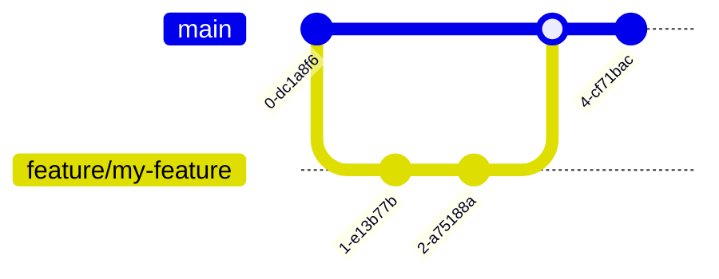

# 贡献指南

感谢您对 MRR 项目的关注！本文档描述了参与贡献的流程和规范。

## 📋 目录

1. [行为准则](#行为准则)
2. [开发流程](#开发流程)
3. [分支规范](#分支规范)
4. [提交规范](#提交规范)
5. [代码风格](#代码风格)
6. [Pull Request 流程](#pull-request-流程)
7. [报告问题](#报告问题)

## 行为准则

- 尊重所有参与者，保持友善和专业
- 欢迎建设性的批评和反馈
- 关注问题本身，而非人身

## 开发流程



1. 从 `main` 分支创建特性分支
2. 在特性分支上开发
3. 提交前运行测试和 lint
4. 创建 Pull Request 到 `main` 分支
5. 等待 Code Review

## 分支规范

| 分支名 | 用途 | 来源 |
|--------|------|------|
| `main` | 稳定发布版本 | - |
| `develop` | 开发主分支 | `main` |
| `feature/*` | 新功能开发 | `develop` |
| `fix/*` | Bug 修复 | `develop` |
| `hotfix/*` | 紧急修复 | `main` |
| `release/*` | 发布准备 | `develop` |

命名示例：
- `feature/user-export`
- `fix/login-redirect-error`
- `hotfix/security-vulnerability`

## 提交规范

使用 [Conventional Commits](https://www.conventionalcommits.org/) 规范：

```
<type>(<scope>): <description>

[optional body]
```

### 类型说明

| 类型 | 说明 |
|------|------|
| `feat` | 新功能 |
| `fix` | Bug 修复 |
| `docs` | 文档变更 |
| `style` | 代码格式（不影响功能） |
| `refactor` | 代码重构 |
| `perf` | 性能优化 |
| `test` | 测试相关 |
| `chore` | 构建/工具变更 |
| `ci` | CI 配置变更 |

### 示例

```
feat(scan): 添加 DICOM 批量导出功能
fix(auth): 修复 Token 刷新时 NPE 异常
docs(api): 更新统计分析接口文档
refactor(mapper): 抽取公共查询方法
```

## 代码风格

### 后端 (Java)

- 遵循阿里巴巴 Java 开发手册
- 使用 Lombok 减少样板代码
- Controller 层只做参数校验和路由
- Service 层处理业务逻辑
- Mapper 层只做数据访问

### 前端 (Vue 3 + TypeScript)

- 使用 Composition API + `<script setup>`
- 组件名使用 PascalCase
- 文件夹名使用 kebab-case
- 类型定义放在 `types/` 目录
- API 调用封装在 `api/` 目录

### 检查命令

```bash
# 后端
cd backend-repo
mvn checkstyle:check

# 前端
cd frontend-fantastic-admin
npm run lint
```

## Pull Request 流程

1. **提交前准备**
   - 确保代码通过 lint 和测试
   - 更新相关文档
   - 添加必要的单元测试

2. **创建 PR**
   - PR 标题遵循提交规范
   - 描述变更内容、原因和影响
   - 关联相关的 Issue

3. **PR 模板**

```markdown
## 描述
请简要描述此 PR 的变更内容。

## 关联 Issue
Closes #123

## 变更类型
- [ ] Bug 修复
- [ ] 新功能
- [ ] 文档更新
- [ ] 代码重构
- [ ] 性能优化

## 测试说明
- [ ] 单元测试已通过
- [ ] 集成测试已通过
- [ ] 手动测试已完成

## 检查清单
- [ ] 代码遵循项目规范
- [ ] 已添加/更新测试
- [ ] 已更新相关文档
- [ ] 提交信息符合规范
```

4. **Review 流程**
   - 至少需要 1 人 Review 通过
   - Review 关注：设计、安全、性能、可维护性
   - 解决所有讨论后才可合并

## 报告问题

提交 Issue 时请包含：

- 问题描述（清晰简洁）
- 复现步骤
- 预期行为和实际行为
- 环境信息（OS、JDK 版本、浏览器等）
- 相关日志或截图

### Issue 标签

| 标签 | 说明 |
|------|------|
| `bug` | 缺陷报告 |
| `enhancement` | 功能建议 |
| `documentation` | 文档相关 |
| `good first issue` | 适合新手 |
| `help wanted` | 需要协助 |
| `question` | 疑问咨询 |

---

再次感谢您的贡献！
