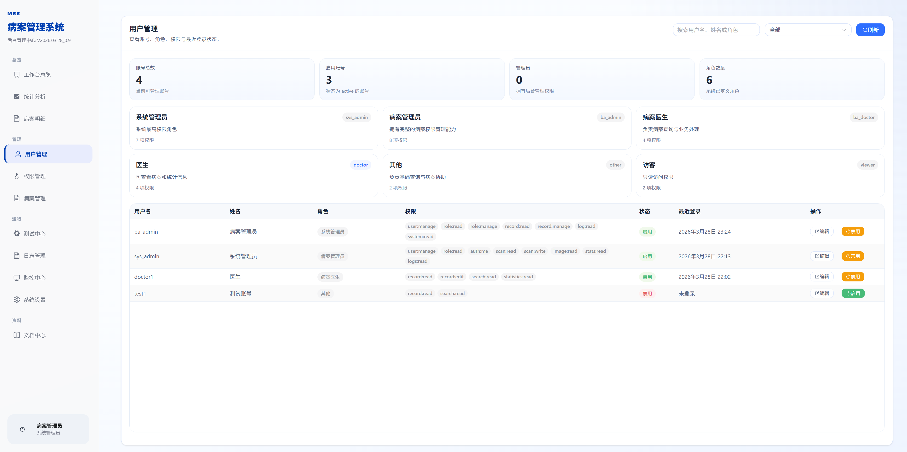
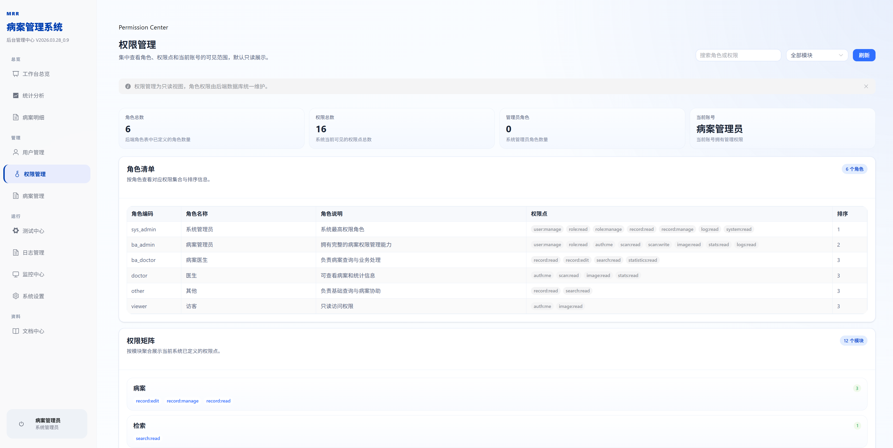
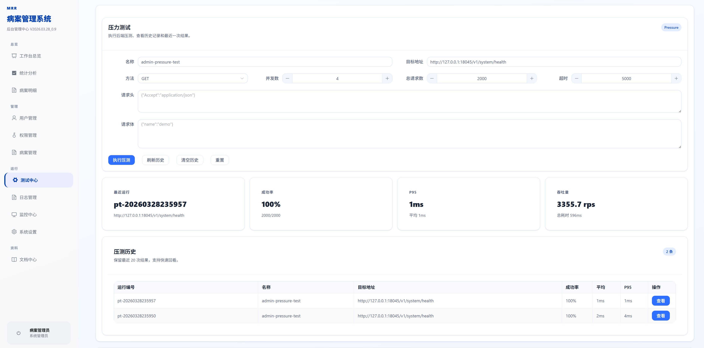
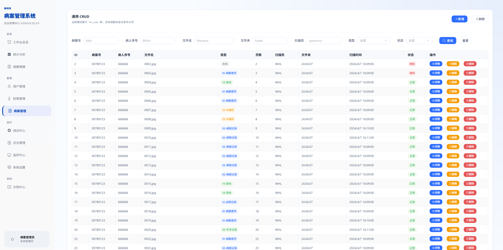
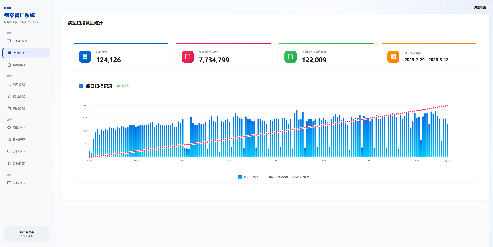
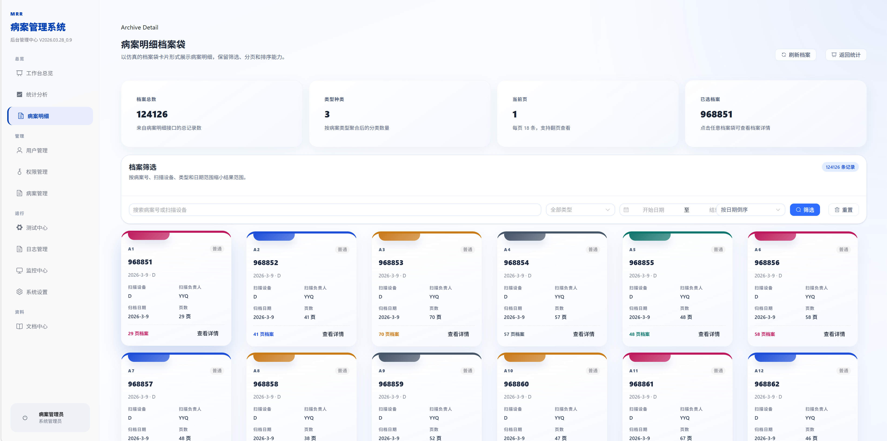
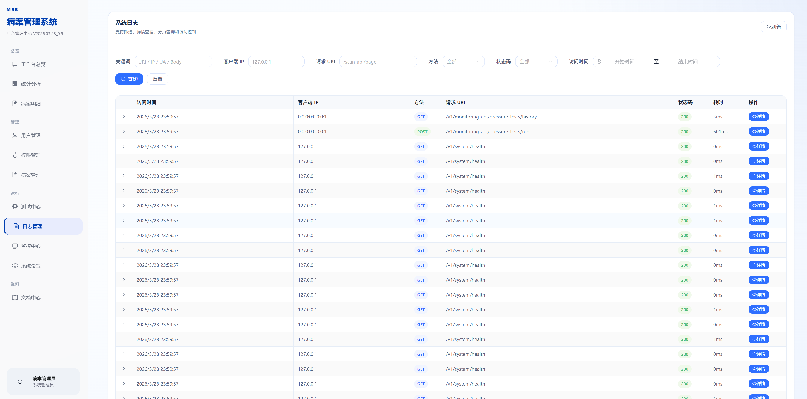
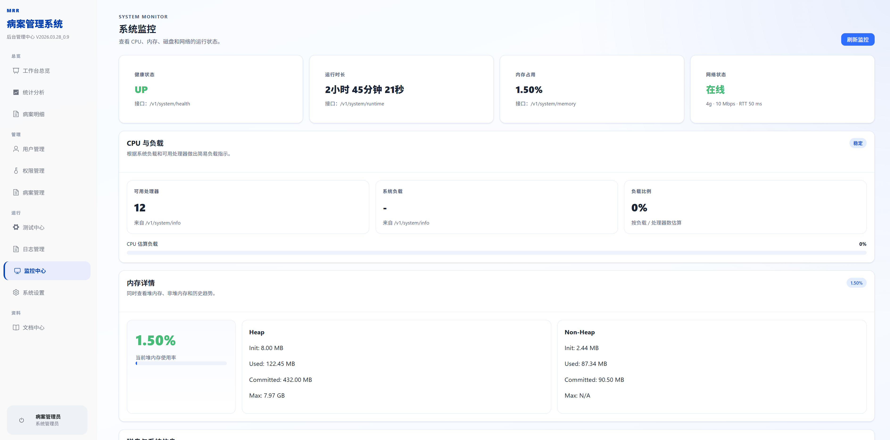
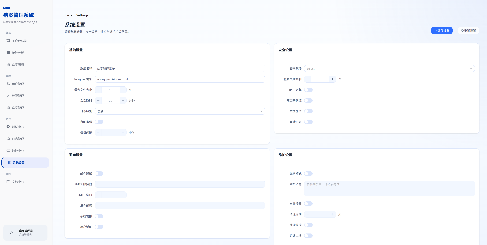

# 当前版本使用说明

> 文档版本：v0.0.9  
> 更新日期：2026-03-29  
> 适用范围：PMR 当前前端版本的日常使用与功能浏览

## 1. 文档目的

这份说明面向系统使用者，结合 `docs/imgs/v0.0.9_imgs` 中的模块截图，整理当前版本的主要操作路径。重点覆盖登录、后台总览、用户与权限管理、测试中心、病案与统计模块、日志、监控、系统设置和文档中心。

## 2. 登录系统

系统从登录页进入。登录成功后，普通账号会进入对应功能页，管理员账号会进入后台管理中心。

### 登录说明

- 用户名和密码由后台认证系统校验。
- 当前联调环境常用账号为 `br_admin / br_password`。
- 登录成功后会自动保存会话信息，刷新页面不会丢失登录状态。

## 3. 后台总览

登录后进入后台总览页。这里是所有功能模块的入口，页面采用嵌入式后台壳设计，左侧是模块导航，右侧是内容区。

### 总览页能做什么

- 快速进入用户、权限、测试、日志、监控、病案、统计和系统设置。
- 查看当前账号、角色和权限摘要。
- 通过功能卡片直接跳转到常用页面。

## 4. 主要功能模块

### 4.1 用户管理

用户管理用于维护账号状态、角色绑定和基础信息。

可执行的操作包括：

- 查看账号列表
- 修改账号信息
- 调整角色与权限范围
- 禁用或启用账号

### 4.2 权限管理

权限管理用于查看角色权限矩阵和当前账号的可见范围。

使用时可以重点关注：

- 角色对应的权限集合
- 账号是否具备管理能力
- 不同模块的访问边界

### 4.3 测试中心

测试中心把接口冒烟、压力测试、密码密文生成和其他调试工具集中到同一页，方便开发和联调。

建议使用方式：

- 先选择顶部选项卡切换不同测试模块
- 再在当前模块中执行接口请求或工具测试
- 适合开发联调和问题排查

### 4.4 病案管理

病案管理用于查看和维护病案基础数据，是系统业务侧的核心入口之一。

常见操作：

- 查询病案列表
- 按条件筛选记录
- 查看单条病案详情
- 进行批量维护

### 4.5 统计分析

统计分析页用于浏览病案汇总信息和统计结果。

在这一页可以：

- 观察病案统计指标
- 浏览趋势或分类结果
- 进入病案明细页继续查看分页列表

### 4.6 病案明细

病案明细页用于按分页查看归档档案，点击“查看详情”后会进入该档案的图片展示页。

当前版本的明细页支持：

- 按病案号、类型、日期等条件筛选
- 调整排序和分页大小
- 点击某条档案直接进入档案图片页

### 4.7 档案图片查看

点击病案明细中的“查看详情”后，会进入当前档案的图片展示页。该页支持缩略图切换、图片选择、打印和导出 PDF。

> 当前截图目录中未单独收录该页面截图，但它是当前版本的新增使用路径。

典型使用流程：

1. 在病案明细页选择一条档案。
2. 进入图片展示页后浏览所有图片。
3. 通过左侧图片类型筛选内容。
4. 勾选需要打印或导出的图片。
5. 点击“打印选中”或“导出 PDF”完成输出。

### 4.8 日志管理

日志管理用于查看系统访问日志和操作记录，适合排查异常和审计使用。

建议关注：

- 请求时间
- 操作账号
- 接口路径和结果状态

### 4.9 监控中心

监控中心用于观察系统运行状态、健康检查和基础资源信息。

常见查看内容：

- CPU 和内存状态
- 磁盘占用
- 应用健康检查
- 系统运行指标

### 4.10 系统设置

系统设置用于维护基础参数、安全策略和系统级配置。

这里可以查看或调整：

- 基础系统名称和展示信息
- 密码和安全相关策略
- 日志与运行参数

### 4.11 文档中心

文档中心用于统一查看项目说明、功能说明和维护指南。

适合在以下场景打开：

- 新成员上手
- 联调时查阅接口说明
- 发布前检查变更说明

## 5. 推荐使用路径

如果你是第一次使用当前版本，可以按照下面顺序操作：

1. 先登录系统。
2. 从工作台总览进入目标模块。
3. 按“用户管理 / 权限管理 / 测试中心 / 病案管理 / 统计分析”的顺序熟悉主流程。
4. 需要查看档案图片时，从病案明细进入图片展示页。
5. 需要打印或导出时，在图片展示页中先选图，再执行输出操作。

## 6. 截图索引

| 截图 | 页面 |
| --- | --- |
| `登录界面.png` | 登录页 |
| `工作台总览.png` | 后台总览 |
| `用户管理.png` | 用户管理 |
| `权限管理.png` | 权限管理 |
| `测试中心.png` | 测试中心 |
| `病案管理.png` | 病案管理 |
| `统计分析.png` | 统计分析 |
| `病案明细.png` | 病案明细 |
| `日志管理.png` | 日志管理 |
| `监控中心.png` | 监控中心 |
| `系统设置.png` | 系统设置 |
| `文档中心.png` | 文档中心 |

## 7. 维护建议

- 新增模块时，建议同步补充一张截图到 `docs/imgs/v0.0.9_imgs`。
- 模块名称和导航文案变更后，文档里的截图索引也要一起更新。
- 发布前建议执行一次 `npm run docs:build`，确认文档可以正常生成。
