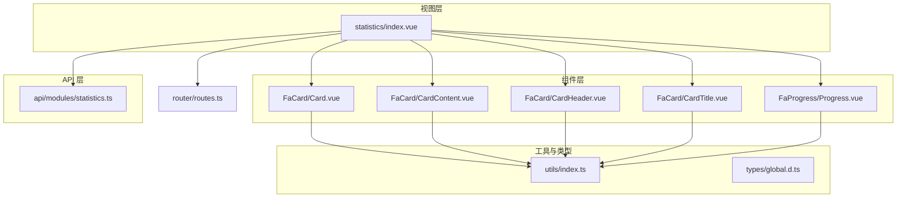
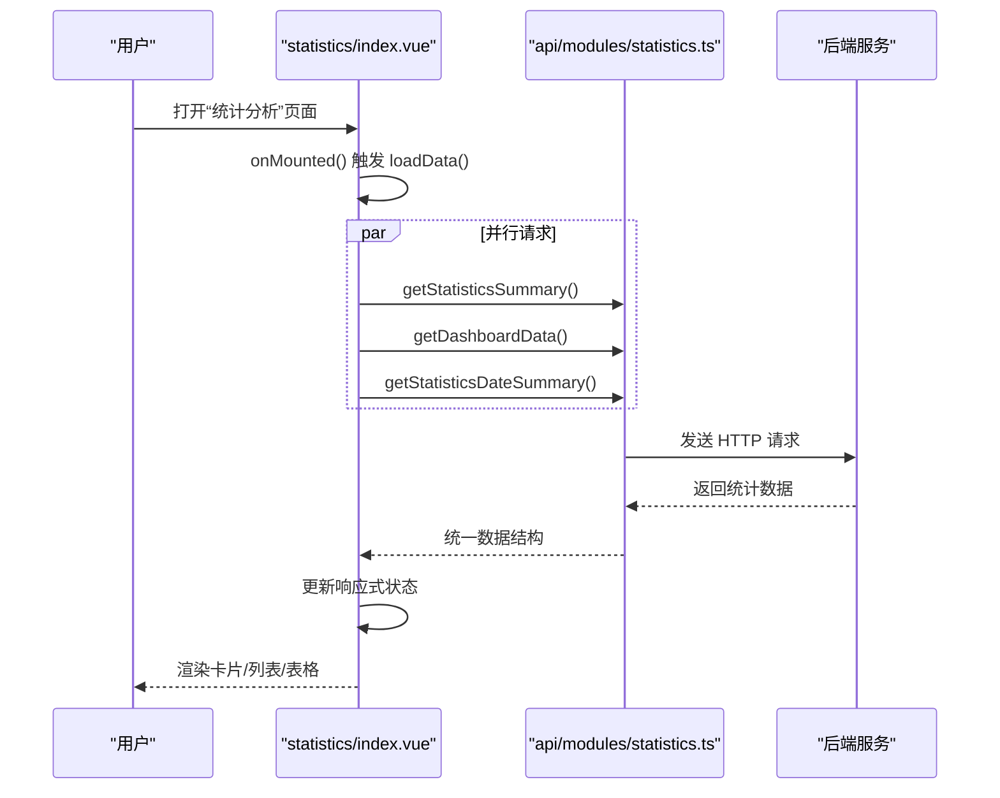
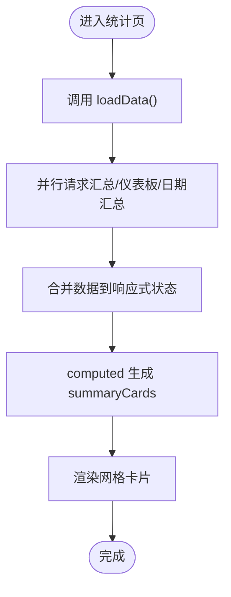
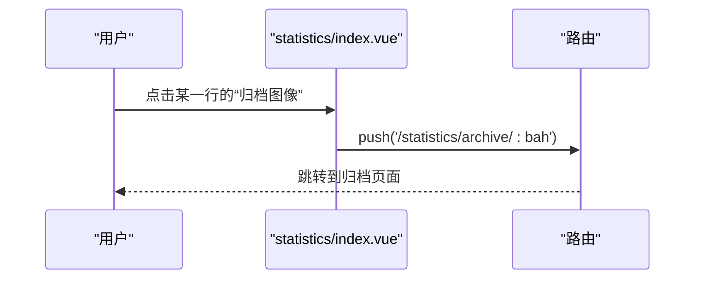
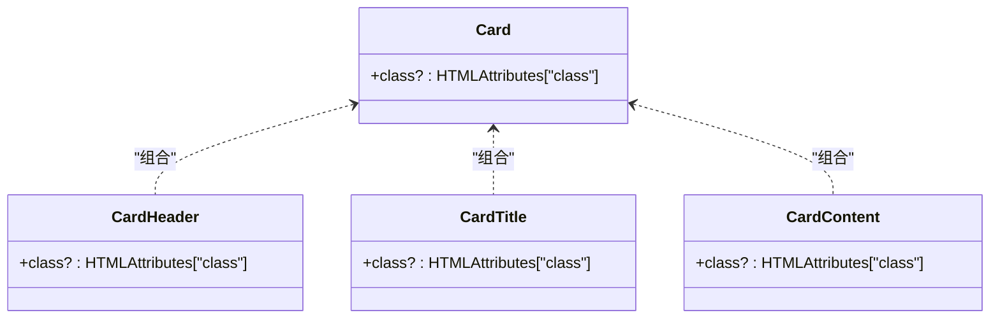
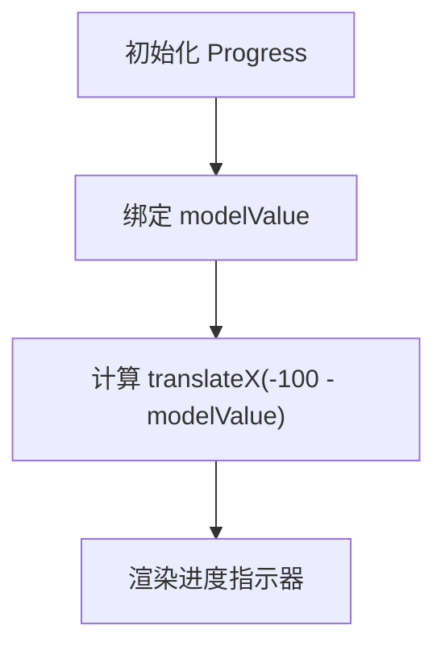
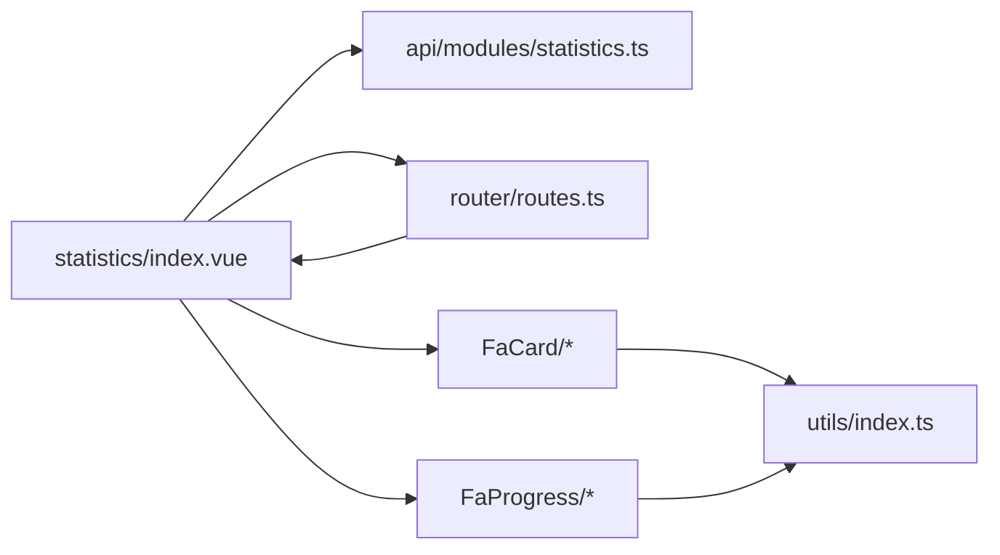

# 仪表板组件

**本文引用的文件**
- [statistics/index.vue](file://frontend-fantastic-admin/src/views/statistics/index.vue)
- [statistics.ts](file://frontend-fantastic-admin/src/api/modules/statistics.ts)
- [routes.ts](file://frontend-fantastic-admin/src/router/routes.ts)
- [FaCard/Card.vue](file://frontend-fantastic-admin/src/ui/components/FaCard/card/Card.vue)
- [FaCard/CardContent.vue](file://frontend-fantastic-admin/src/ui/components/FaCard/card/CardContent.vue)
- [FaCard/CardHeader.vue](file://frontend-fantastic-admin/src/ui/components/FaCard/card/CardHeader.vue)
- [FaCard/CardTitle.vue](file://frontend-fantastic-admin/src/ui/components/FaCard/card/CardTitle.vue)
- [FaProgress/Progress.vue](file://frontend-fantastic-admin/src/ui/components/FaProgress/progress/Progress.vue)
- [utils/index.ts](file://frontend-fantastic-admin/src/utils/index.ts)
- [global.d.ts](file://frontend-fantastic-admin/src/types/global.d.ts)

## 目录
1. [简介](#简介)
2. [项目结构](#项目结构)
3. [核心组件](#核心组件)
4. [架构总览](#架构总览)
5. [详细组件分析](#详细组件分析)
6. [依赖关系分析](#依赖关系分析)
7. [性能考虑](#性能考虑)
8. [故障排查指南](#故障排查指南)
9. [结论](#结论)
10. [附录](#附录)

## 简介
本文件面向 MRR 项目的“统计分析”仪表板，系统化梳理并说明以下内容：
- 统计数据卡片、类型分布、趋势列表、高频病案号表格等核心组件的视觉外观与交互行为
- 组件属性配置、数据绑定与事件处理机制
- 使用示例与代码片段路径，展示如何在仪表板布局中集成
- 组件状态管理、数据更新与实时刷新的实现方案
- 响应式布局适配与性能优化策略
- 组件间通信模式与数据流管理

## 项目结构
该仪表板位于前端工程的视图层，通过路由挂载到主布局下，并通过 API 模块拉取后端统计数据。核心文件组织如下：
- 视图层：统计分析页面负责数据聚合与布局渲染
- 组件层：自研 FaCard 与 FaProgress 提供卡片与进度条基础能力
- API 层：封装统计相关接口，统一返回数据结构
- 工具层：通用类名合并与路由类型定义

**图表来源**
- [statistics/index.vue:1-227](file://frontend-fantastic-admin/src/views/statistics/index.vue#L1-L227)
- [statistics.ts:1-61](file://frontend-fantastic-admin/src/api/modules/statistics.ts#L1-L61)
- [routes.ts:111-136](file://frontend-fantastic-admin/src/router/routes.ts#L111-L136)
- [FaCard/Card.vue:1-22](file://frontend-fantastic-admin/src/ui/components/FaCard/card/Card.vue#L1-L22)
- [FaCard/CardContent.vue:1-15](file://frontend-fantastic-admin/src/ui/components/FaCard/card/CardContent.vue#L1-L15)
- [FaCard/CardHeader.vue:1-15](file://frontend-fantastic-admin/src/ui/components/FaCard/card/CardHeader.vue#L1-L15)
- [FaCard/CardTitle.vue:1-19](file://frontend-fantastic-admin/src/ui/components/FaCard/card/CardTitle.vue#L1-L19)
- [FaProgress/Progress.vue:1-37](file://frontend-fantastic-admin/src/ui/components/FaProgress/progress/Progress.vue#L1-L37)
- [utils/index.ts:1-13](file://frontend-fantastic-admin/src/utils/index.ts#L1-L13)
- [global.d.ts:1-307](file://frontend-fantastic-admin/src/types/global.d.ts#L1-L307)

**章节来源**
- [statistics/index.vue:1-227](file://frontend-fantastic-admin/src/views/statistics/index.vue#L1-L227)
- [statistics.ts:1-61](file://frontend-fantastic-admin/src/api/modules/statistics.ts#L1-L61)
- [routes.ts:111-136](file://frontend-fantastic-admin/src/router/routes.ts#L111-L136)

## 核心组件
本节聚焦于仪表板中的关键可视化组件及其职责：
- 统计数据卡片：用于展示总量、趋势点数等关键指标
- 类型分布列表：按类型聚合统计，展示记录数与页数
- 近期趋势列表：按日期展示记录数与页数
- 高频病案号表格：展示出现频率最高的病案号及归档入口
- 自定义卡片容器：FaCard 提供统一的卡片结构与样式基底
- 进度条组件：FaProgress 提供数值驱动的进度指示器

这些组件通过响应式计算属性与模板指令完成数据绑定与交互。

**章节来源**
- [statistics/index.vue:16-25](file://frontend-fantastic-admin/src/views/statistics/index.vue#L16-L25)
- [statistics/index.vue:76-143](file://frontend-fantastic-admin/src/views/statistics/index.vue#L76-L143)
- [FaCard/Card.vue:1-22](file://frontend-fantastic-admin/src/ui/components/FaCard/card/Card.vue#L1-L22)
- [FaProgress/Progress.vue:1-37](file://frontend-fantastic-admin/src/ui/components/FaProgress/progress/Progress.vue#L1-L37)

## 架构总览
仪表板采用“视图-组件-API-工具”分层架构，数据从后端接口经 API 模块注入到视图层，再由模板进行渲染。路由系统控制页面入口与导航。

**图表来源**
- [statistics/index.vue:27-55](file://frontend-fantastic-admin/src/views/statistics/index.vue#L27-L55)
- [statistics.ts:18-31](file://frontend-fantastic-admin/src/api/modules/statistics.ts#L18-L31)

**章节来源**
- [statistics/index.vue:27-55](file://frontend-fantastic-admin/src/views/statistics/index.vue#L27-L55)
- [statistics.ts:18-31](file://frontend-fantastic-admin/src/api/modules/statistics.ts#L18-L31)

## 详细组件分析

### 统计数据卡片
- 视觉外观
  - 采用网格布局，四列等宽卡片，卡片内含标签、数值与说明三段式内容
  - 数值使用较大字号与高权重字体，强调关键指标
- 交互行为
  - 加载态：卡片整体支持 loading 状态，避免空白闪烁
  - 跳转：卡片区域无直接点击跳转，但页面提供“查看统计明细”按钮
- 数据绑定
  - 通过 computed 计算 summaryCards，映射后端返回的 total 与 uniqueBAHCount
- 事件处理
  - 无卡片级点击事件；通过路由跳转至明细页

**图表来源**
- [statistics/index.vue:16-21](file://frontend-fantastic-admin/src/views/statistics/index.vue#L16-L21)
- [statistics/index.vue:27-45](file://frontend-fantastic-admin/src/views/statistics/index.vue#L27-L45)

**章节来源**
- [statistics/index.vue:76-88](file://frontend-fantastic-admin/src/views/statistics/index.vue#L76-L88)

### 类型分布列表
- 视觉外观
  - 卡片内以堆叠列表展示，每项包含类型名与记录数、页数标签
  - 使用标签组件突出页数信息
- 数据绑定
  - 通过 computed 计算 typeList，来源于后端 byType 字段
- 交互行为
  - 无交互按钮，仅展示数据

**章节来源**
- [statistics/index.vue:90-125](file://frontend-fantastic-admin/src/views/statistics/index.vue#L90-L125)

### 近期趋势列表
- 视觉外观
  - 卡片内以堆叠列表展示最近若干天的数据，日期作为标题，记录数与页数分别展示
  - 页数使用成功类型的标签强调
- 数据绑定
  - 通过 computed 计算 recentDates，截取最近 10 天并反转顺序
- 交互行为
  - 无交互按钮，仅展示数据

**章节来源**
- [statistics/index.vue:107-125](file://frontend-fantastic-admin/src/views/statistics/index.vue#L107-L125)

### 高频病案号表格
- 视觉外观
  - 表格包含病案号、记录数、总页数与操作列
  - 操作列提供“归档图像”按钮
- 数据绑定
  - 表格数据来自 topBahList，来源于后端 topBAH 字段
- 事件处理
  - 点击“归档图像”按钮，路由跳转至对应病案号的归档页面

**图表来源**
- [statistics/index.vue:51-53](file://frontend-fantastic-admin/src/views/statistics/index.vue#L51-L53)
- [statistics/index.vue:131-142](file://frontend-fantastic-admin/src/views/statistics/index.vue#L131-L142)
- [routes.ts:129-136](file://frontend-fantastic-admin/src/router/routes.ts#L129-L136)

**章节来源**
- [statistics/index.vue:127-143](file://frontend-fantastic-admin/src/views/statistics/index.vue#L127-L143)
- [routes.ts:129-136](file://frontend-fantastic-admin/src/router/routes.ts#L129-L136)

### 自定义卡片容器 FaCard
- 结构组成
  - 卡片根元素、头部、标题、内容等子组件
  - 通过 cn 工具函数合并 Tailwind 类，保证样式一致性
- 属性配置
  - 支持传入 class 自定义样式
- 使用示例
  - 在统计页中，类型分布、近期趋势、高频病案号均使用 el-card 包裹，FaCard 提供统一基底

**图表来源**
- [FaCard/Card.vue:1-22](file://frontend-fantastic-admin/src/ui/components/FaCard/card/Card.vue#L1-L22)
- [FaCard/CardHeader.vue:1-15](file://frontend-fantastic-admin/src/ui/components/FaCard/card/CardHeader.vue#L1-L15)
- [FaCard/CardTitle.vue:1-19](file://frontend-fantastic-admin/src/ui/components/FaCard/card/CardTitle.vue#L1-L19)
- [FaCard/CardContent.vue:1-15](file://frontend-fantastic-admin/src/ui/components/FaCard/card/CardContent.vue#L1-L15)

**章节来源**
- [FaCard/Card.vue:1-22](file://frontend-fantastic-admin/src/ui/components/FaCard/card/Card.vue#L1-L22)
- [FaCard/CardHeader.vue:1-15](file://frontend-fantastic-admin/src/ui/components/FaCard/card/CardHeader.vue#L1-L15)
- [FaCard/CardTitle.vue:1-19](file://frontend-fantastic-admin/src/ui/components/FaCard/card/CardTitle.vue#L1-L19)
- [FaCard/CardContent.vue:1-15](file://frontend-fantastic-admin/src/ui/components/FaCard/card/CardContent.vue#L1-L15)

### 进度条组件 FaProgress
- 视觉外观
  - 容器采用圆角背景，指示器根据 modelValue 百分比进行位移
- 属性配置
  - modelValue 默认值为 0，支持传入 class 自定义样式
- 使用场景
  - 可用于展示任务进度、资源使用率等数值型进度

**图表来源**
- [FaProgress/Progress.vue:11-18](file://frontend-fantastic-admin/src/ui/components/FaProgress/progress/Progress.vue#L11-L18)
- [FaProgress/Progress.vue:31-34](file://frontend-fantastic-admin/src/ui/components/FaProgress/progress/Progress.vue#L31-L34)

**章节来源**
- [FaProgress/Progress.vue:1-37](file://frontend-fantastic-admin/src/ui/components/FaProgress/progress/Progress.vue#L1-L37)

## 依赖关系分析
- 视图层依赖 API 层提供的接口方法，统一返回数据结构
- 组件层依赖工具层的 cn 函数进行类名合并
- 路由层控制页面入口与嵌套路由，确保统计页与明细页、归档页的导航连通

**图表来源**
- [statistics/index.vue:1-10](file://frontend-fantastic-admin/src/views/statistics/index.vue#L1-L10)
- [statistics.ts:1-61](file://frontend-fantastic-admin/src/api/modules/statistics.ts#L1-L61)
- [routes.ts:111-136](file://frontend-fantastic-admin/src/router/routes.ts#L111-L136)
- [utils/index.ts:6-8](file://frontend-fantastic-admin/src/utils/index.ts#L6-L8)

**章节来源**
- [statistics/index.vue:1-10](file://frontend-fantastic-admin/src/views/statistics/index.vue#L1-L10)
- [statistics.ts:1-61](file://frontend-fantastic-admin/src/api/modules/statistics.ts#L1-L61)
- [routes.ts:111-136](file://frontend-fantastic-admin/src/router/routes.ts#L111-L136)
- [utils/index.ts:6-8](file://frontend-fantastic-admin/src/utils/index.ts#L6-L8)

## 性能考虑
- 并行请求：在视图挂载时，使用 Promise.all 并行拉取多个接口，减少总等待时间
- 响应式裁剪：对列表数据进行切片与排序，避免一次性渲染大量节点
- 加载态：卡片支持 loading 状态，提升用户体验
- 样式合并：通过 cn 工具函数合并类名，减少重复样式计算

**章节来源**
- [statistics/index.vue:27-45](file://frontend-fantastic-admin/src/views/statistics/index.vue#L27-L45)
- [statistics/index.vue:23-25](file://frontend-fantastic-admin/src/views/statistics/index.vue#L23-L25)
- [utils/index.ts:6-8](file://frontend-fantastic-admin/src/utils/index.ts#L6-L8)

## 故障排查指南
- 数据为空或异常
  - 检查接口返回结构是否符合预期，确认后端字段映射正确
  - 关注错误提示与加载态，确保 finally 中重置 loading
- 路由跳转无效
  - 确认路由配置中存在对应路径与组件映射
- 样式异常
  - 检查 cn 工具函数是否正确合并类名，Tailwind 样式是否生效

**章节来源**
- [statistics/index.vue:39-44](file://frontend-fantastic-admin/src/views/statistics/index.vue#L39-L44)
- [routes.ts:111-136](file://frontend-fantastic-admin/src/router/routes.ts#L111-L136)
- [utils/index.ts:6-8](file://frontend-fantastic-admin/src/utils/index.ts#L6-L8)

## 结论
本仪表板通过清晰的分层设计与组件化封装，实现了统计数据的高效展示与良好交互体验。建议在后续迭代中：
- 引入更细粒度的状态管理（如 Pinia）以支撑复杂筛选与缓存
- 增加轮询或 WebSocket 实时刷新机制，满足动态数据需求
- 丰富图表组件（如柱状图、折线图），提升数据可视化能力
- 完善权限与埋点，确保安全与可观测性

## 附录

### 使用示例与代码片段路径
- 在仪表板布局中集成统计数据卡片
  - [statistics/index.vue:76-88](file://frontend-fantastic-admin/src/views/statistics/index.vue#L76-L88)
- 在类型分布卡片中渲染列表项
  - [statistics/index.vue:96-104](file://frontend-fantastic-admin/src/views/statistics/index.vue#L96-L104)
- 在近期趋势卡片中渲染列表项
  - [statistics/index.vue:112-122](file://frontend-fantastic-admin/src/views/statistics/index.vue#L112-L122)
- 在高频病案号表格中绑定数据与操作
  - [statistics/index.vue:131-142](file://frontend-fantastic-admin/src/views/statistics/index.vue#L131-L142)
- 在路由中配置统计与归档页面
  - [routes.ts:111-136](file://frontend-fantastic-admin/src/router/routes.ts#L111-L136)

### 组件状态管理与数据流
- 状态来源
  - 通过 API 模块统一拉取数据，赋值到响应式 ref
- 数据流
  - 视图层 -> 计算属性 -> 模板渲染 -> 用户交互
- 实时刷新
  - 可在定时器或监听器中再次触发 loadData，实现周期性刷新

**章节来源**
- [statistics/index.vue:11-14](file://frontend-fantastic-admin/src/views/statistics/index.vue#L11-L14)
- [statistics/index.vue:27-55](file://frontend-fantastic-admin/src/views/statistics/index.vue#L27-L55)
- [statistics.ts:18-31](file://frontend-fantastic-admin/src/api/modules/statistics.ts#L18-L31)

### 响应式布局适配
- 移动端适配开关
  - 通过全局设置中的移动端适配选项控制布局行为
- 栅格系统
  - 使用 el-row/col 的栅格系统实现两列布局与间距控制

**章节来源**
- [global.d.ts:75-81](file://frontend-fantastic-admin/src/types/global.d.ts#L75-L81)
- [statistics/index.vue:90-125](file://frontend-fantastic-admin/src/views/statistics/index.vue#L90-L125)