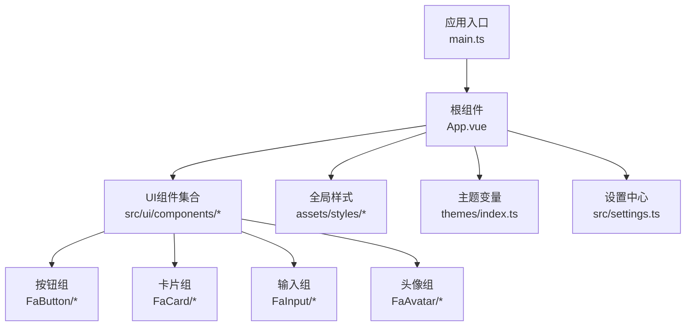
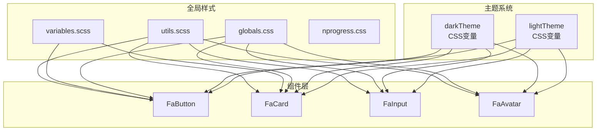
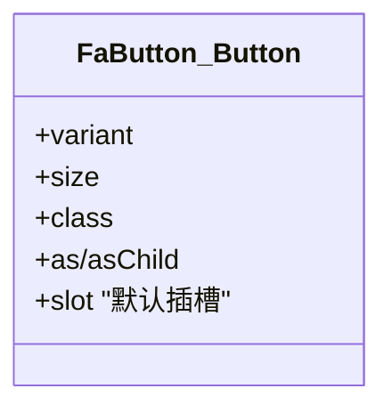
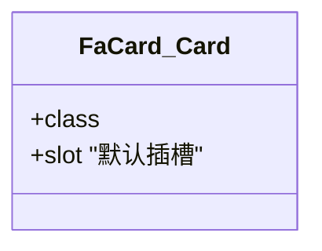
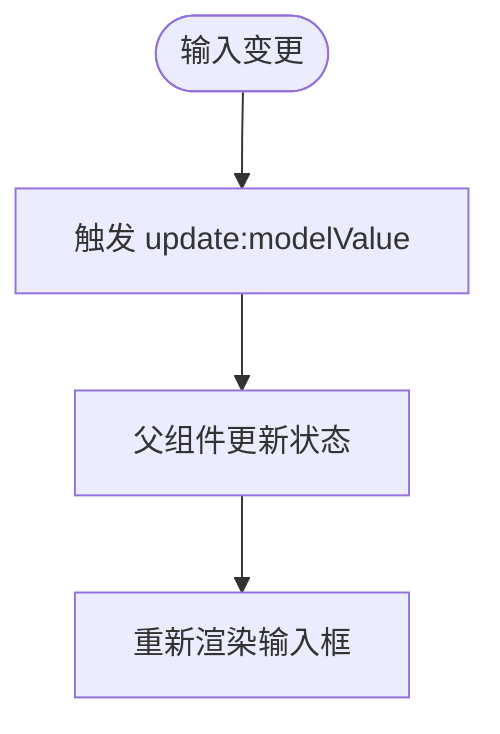
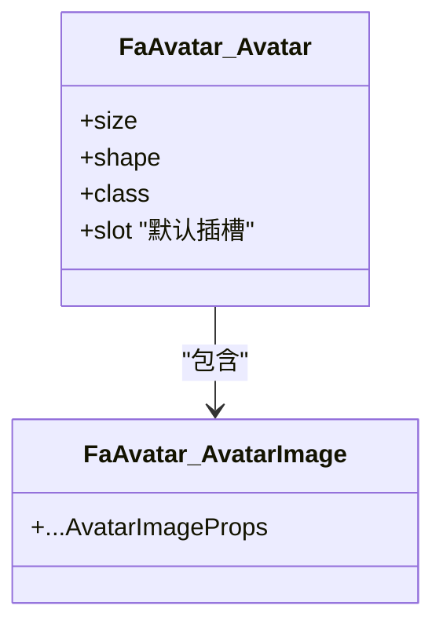
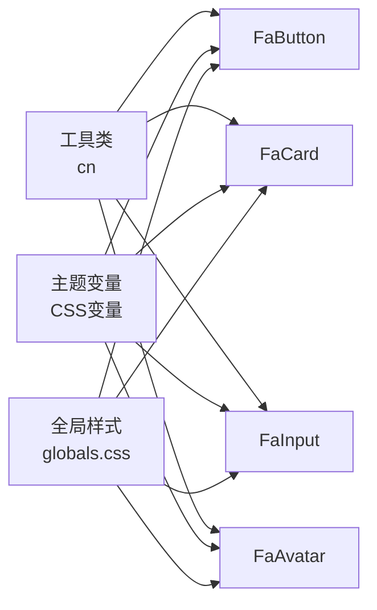

# 前端组件

**本文引用的文件**
- [settings.ts](file://frontend-fantastic-admin/src/settings.ts)
- [index.ts（主题）](file://frontend-fantastic-admin/themes/index.ts)
- [Button.vue](file://frontend-fantastic-admin/src/ui/components/FaButton/button/Button.vue)
- [Card.vue](file://frontend-fantastic-admin/src/ui/components/FaCard/card/Card.vue)
- [Input.vue](file://frontend-fantastic-admin/src/ui/components/FaInput/input/Input.vue)
- [Avatar.vue](file://frontend-fantastic-admin/src/ui/components/FaAvatar/avatar/Avatar.vue)
- [AvatarImage.vue](file://frontend-fantastic-admin/src/ui/components/FaAvatar/avatar/AvatarImage.vue)
- [App.vue](file://frontend-fantastic-admin/src/App.vue)
- [main.ts](file://frontend-fantastic-admin/src/main.ts)
- [globals.css](file://frontend-fantastic-admin/src/assets/styles/globals.css)
- [nprogress.css](file://frontend-fantastic-admin/src/assets/styles/nprogress.css)
- [variables.scss](file://frontend-fantastic-admin/src/assets/styles/resources/variables.scss)
- [utils.scss](file://frontend-fantastic-admin/src/assets/styles/resources/utils.scss)
- [index.vue（FaAuth）](file://frontend-fantastic-admin/src/ui/components/FaAuth/index.vue)
- [index.vue（FaAvatar）](file://frontend-fantastic-admin/src/ui/components/FaAvatar/index.vue)
- [index.vue（FaBackToTop）](file://frontend-fantastic-admin/src/ui/components/FaBackToTop/index.vue)
- [index.vue（FaButton）](file://frontend-fantastic-admin/src/ui/components/FaButton/index.vue)
- [index.vue（FaButtonGroup）](file://frontend-fantastic-admin/src/ui/components/FaButtonGroup/index.vue)
- [index.vue（FaCard）](file://frontend-fantastic-admin/src/ui/components/FaCard/index.vue)
- [index.vue（FaCheckbox）](file://frontend-fantastic-admin/src/ui/components/FaCheckbox/index.vue)
- [index.vue（FaCollapsible）](file://frontend-fantastic-admin/src/ui/components/FaCollapsible/index.vue)
- [index.vue（FaContextMenu）](file://frontend-fantastic-admin/src/ui/components/FaContextMenu/index.vue)
- [index.vue（FaCopyright）](file://frontend-fantastic-admin/src/ui/components/FaCopyright/index.vue)
- [index.vue（FaDivider）](file://frontend-fantastic-admin/src/ui/components/FaDivider/index.vue)
- [index.vue（FaDrawer）](file://frontend-fantastic-admin/src/ui/components/FaDrawer/index.vue)
- [index.vue（FaDropdown）](file://frontend-fantastic-admin/src/ui/components/FaDropdown/index.vue)
- [index.vue（FaFileUpload）](file://frontend-fantastic-admin/src/ui/components/FaFileUpload/index.vue)
- [index.vue（FaFixedActionBar）](file://frontend-fantastic-admin/src/ui/components/FaFixedActionBar/index.vue)
- [index.vue（FaHoverCard）](file://frontend-fantastic-admin/src/ui/components/FaHoverCard/index.vue)
- [index.vue（FaIcon）](file://frontend-fantastic-admin/src/ui/components/FaIcon/index.vue)
- [index.vue（FaImagePreview）](file://frontend-fantastic-admin/src/ui/components/FaImagePreview/index.vue)
- [index.vue（FaImageUpload）](file://frontend-fantastic-admin/src/ui/components/FaImageUpload/index.vue)
- [index.vue（FaInput）](file://frontend-fantastic-admin/src/ui/components/FaInput/index.vue)
- [index.vue（FaKbd）](file://frontend-fantastic-admin/src/ui/components/FaKbd/index.vue)
- [index.vue（FaModal）](file://frontend-fantastic-admin/src/ui/components/FaModal/index.vue)
- [index.vue（FaNotAllowed）](file://frontend-fantastic-admin/src/ui/components/FaNotAllowed/index.vue)
- [index.vue（FaNotification）](file://frontend-fantastic-admin/src/ui/components/FaNotification/index.vue)
- [index.vue（FaPageHeader）](file://frontend-fantastic-admin/src/ui/components/FaPageHeader/index.vue)
- [index.vue（FaPageMain）](file://frontend-fantastic-admin/src/ui/components/FaPageMain/index.vue)
- [index.vue（FaPasswordStrength)（FaPasswordStrength）](file://frontend-fantastic-admin/src/ui/components/FaPasswordStrength/index.vue)
- [index.vue（FaPinInput）](file://frontend-fantastic-admin/src/ui/components/FaPinInput/index.vue)
- [index.vue（FaPopover）](file://frontend-fantastic-admin/src/ui/components/FaPopover/index.vue)
- [index.vue（FaProgress）](file://frontend-fantastic-admin/src/ui/components/FaProgress/index.vue)
- [index.vue（FaScrollArea）](file://frontend-fantastic-admin/src/ui/components/FaScrollArea/index.vue)
- [index.vue（FaSearchBar）](file://frontend-fantastic-admin/src/ui/components/FaSearchBar/index.vue)
- [index.vue（FaSelect）](file://frontend-fantastic-admin/src/ui/components/FaSelect/index.vue)
- [index.vue（FaSlider）](file://frontend-fantastic-admin/src/ui/components/FaSlider/index.vue)
- [index.vue（FaSmartFixedBlock）](file://frontend-fantastic-admin/src/ui/components/FaSmartFixedBlock/index.vue)
- [index.vue（FaSwitch）](file://frontend-fantastic-admin/src/ui/components/FaSwitch/index.vue)
- [index.vue（FaSystemInfo）](file://frontend-fantastic-admin/src/ui/components/FaSystemInfo/index.vue)
- [index.vue（FaTabs）](file://frontend-fantastic-admin/src/ui/components/FaTabs/index.vue)
- [index.vue（FaTextarea）](file://frontend-fantastic-admin/src/ui/components/FaTextarea/index.vue)
- [index.vue（FaToast）](file://frontend-fantastic-admin/src/ui/components/FaToast/index.vue)
- [index.vue（FaTooltip）](file://frontend-fantastic-admin/src/ui/components/FaTooltip/index.vue)
- [index.vue（AccountButton）](file://frontend-fantastic-admin/src/components/AccountButton/index.vue)
- [profile.vue（AccountButton）](file://frontend-fantastic-admin/src/components/AccountButton/profile.vue)
- [LoginForm.vue（AccountForm）](file://frontend-fantastic-admin/src/components/AccountForm/LoginForm.vue)
- [RegisterForm.vue（AccountForm）](file://frontend-fantastic-admin/src/components/AccountForm/RegisterForm.vue)
- [ResetPasswordForm.vue（AccountForm）](file://frontend-fantastic-admin/src/components/AccountForm/ResetPasswordForm.vue)
- [EditPasswordForm.vue（AccountForm）](file://frontend-fantastic-admin/src/components/AccountForm/EditPasswordForm.vue)

## 目录
1. 引言
2. 项目结构
3. 核心组件
4. 架构总览
5. 组件详细分析
6. 依赖关系分析
7. 性能与可访问性
8. 故障排查
9. 结论
10. 附录

## 引言
本文件面向MRR前端组件库，聚焦于“Fantastic Admin”风格的UI组件体系，覆盖组件的视觉外观、行为与交互模式；记录属性、事件、插槽与自定义选项；提供使用示例与代码片段路径；给出响应式与无障碍合规建议；说明状态、动画与过渡效果；阐述样式自定义与主题支持；并补充跨浏览器兼容性与性能优化要点。文档同时梳理组件与布局、表单、通知等模块的集成方式，帮助开发者快速理解与正确使用。

## 项目结构
前端采用Vite+Vue3+TypeScript技术栈，组件集中在src/ui/components下，按功能域拆分（如FaButton、FaCard、FaAvatar等），并通过各组件的index.vue统一导出。全局样式与主题变量位于assets/styles与themes目录，应用入口在main.ts与App.vue中初始化。

图示来源
- [main.ts](file://frontend-fantastic-admin/src/main.ts)
- [App.vue](file://frontend-fantastic-admin/src/App.vue)
- [globals.css](file://frontend-fantastic-admin/src/assets/styles/globals.css)
- [variables.scss](file://frontend-fantastic-admin/src/assets/styles/resources/variables.scss)
- [utils.scss](file://frontend-fantastic-admin/src/assets/styles/resources/utils.scss)
- [index.ts（主题）](file://frontend-fantastic-admin/themes/index.ts)
- [settings.ts](file://frontend-fantastic-admin/src/settings.ts)

章节来源
- [main.ts](file://frontend-fantastic-admin/src/main.ts)
- [App.vue](file://frontend-fantastic-admin/src/App.vue)
- [globals.css](file://frontend-fantastic-admin/src/assets/styles/globals.css)
- [variables.scss](file://frontend-fantastic-admin/src/assets/styles/resources/variables.scss)
- [utils.scss](file://frontend-fantastic-admin/src/assets/styles/resources/utils.scss)
- [index.ts（主题）](file://frontend-fantastic-admin/themes/index.ts)
- [settings.ts](file://frontend-fantastic-admin/src/settings.ts)

## 核心组件
本节对高频使用的核心组件进行概览，包括按钮、卡片、输入与头像等，说明其职责、典型用法与可定制点。

- 按钮（FaButton）
  - 角色：承载点击交互，强调主次与尺寸。
  - 关键属性：variant、size、原生as/作为容器渲染。
  - 插槽：默认插槽用于放置文案或图标。
  - 自定义：通过variants与cn工具类实现样式变体。
  - 参考路径：[Button.vue](file://frontend-fantastic-admin/src/ui/components/FaButton/button/Button.vue)

- 卡片（FaCard）
  - 角色：内容容器，提供圆角、边框与阴影。
  - 关键属性：class以扩展样式。
  - 插槽：默认插槽承载卡片内容。
  - 参考路径：[Card.vue](file://frontend-fantastic-admin/src/ui/components/FaCard/card/Card.vue)

- 输入（FaInput）
  - 角色：文本/数字输入，双向绑定modelValue。
  - 关键属性：defaultValue、modelValue、class。
  - 事件：update:modelValue。
  - 参考路径：[Input.vue](file://frontend-fantastic-admin/src/ui/components/FaInput/input/Input.vue)

- 头像（FaAvatar）
  - 角色：用户头像展示，支持占位与图片。
  - 关键属性：size、shape、class。
  - 子组件：AvatarImage用于图片层。
  - 参考路径：[Avatar.vue](file://frontend-fantastic-admin/src/ui/components/FaAvatar/avatar/Avatar.vue)、[AvatarImage.vue](file://frontend-fantastic-admin/src/ui/components/FaAvatar/avatar/AvatarImage.vue)

章节来源
- [Button.vue](file://frontend-fantastic-admin/src/ui/components/FaButton/button/Button.vue)
- [Card.vue](file://frontend-fantastic-admin/src/ui/components/FaCard/card/Card.vue)
- [Input.vue](file://frontend-fantastic-admin/src/ui/components/FaInput/input/Input.vue)
- [Avatar.vue](file://frontend-fantastic-admin/src/ui/components/FaAvatar/avatar/Avatar.vue)
- [AvatarImage.vue](file://frontend-fantastic-admin/src/ui/components/FaAvatar/avatar/AvatarImage.vue)

## 架构总览
组件架构围绕“原子化组件 + 组合式布局 + 主题系统 + 全局样式”展开。组件通过统一的变体与工具类实现一致的外观与交互；主题系统提供明暗两套CSS变量映射；全局样式与资源样式提供基础排版与工具类。

图示来源
- [index.ts（主题）](file://frontend-fantastic-admin/themes/index.ts)
- [globals.css](file://frontend-fantastic-admin/src/assets/styles/globals.css)
- [variables.scss](file://frontend-fantastic-admin/src/assets/styles/resources/variables.scss)
- [utils.scss](file://frontend-fantastic-admin/src/assets/styles/resources/utils.scss)
- [Button.vue](file://frontend-fantastic-admin/src/ui/components/FaButton/button/Button.vue)
- [Card.vue](file://frontend-fantastic-admin/src/ui/components/FaCard/card/Card.vue)
- [Input.vue](file://frontend-fantastic-admin/src/ui/components/FaInput/input/Input.vue)
- [Avatar.vue](file://frontend-fantastic-admin/src/ui/components/FaAvatar/avatar/Avatar.vue)

## 组件详细分析

### 按钮（FaButton）
- 视觉与行为
  - 支持多种变体与尺寸，通过变体工具类生成不同风格。
  - 可作为原生button或容器元素渲染，便于与图标等组合。
- 属性
  - variant：变体类型（由变体工具类定义）
  - size：尺寸规格（由变体工具类定义）
  - class：追加样式类
  - as/asChild：透传原生渲染语义
- 事件与插槽
  - 默认插槽：承载按钮内容
  - 无特定事件（通常由父级处理点击）
- 使用示例（路径）
  - [Button.vue](file://frontend-fantastic-admin/src/ui/components/FaButton/button/Button.vue)
- 状态与交互
  - 通过hover/focus/active等伪类与主题变量联动，确保明暗主题一致体验
- 动画与过渡
  - 无内置动画，建议在父级容器或路由切换时引入过渡
- 样式自定义
  - 通过class扩展与主题变量覆盖实现
- 可访问性
  - 建议在父级容器或按钮元素上设置aria-label或title，明确语义
- 跨浏览器与性能
  - 使用原生button语义，避免不必要的重排；变体样式通过CSS变量与工具类复用

图示来源
- [Button.vue](file://frontend-fantastic-admin/src/ui/components/FaButton/button/Button.vue)

章节来源
- [Button.vue](file://frontend-fantastic-admin/src/ui/components/FaButton/button/Button.vue)

### 卡片（FaCard）
- 视觉与行为
  - 提供圆角、边框与阴影的基础容器，适合内容分组与信息区块
- 属性
  - class：追加样式类
- 插槽
  - 默认插槽：承载卡片内容
- 使用示例（路径）
  - [Card.vue](file://frontend-fantastic-admin/src/ui/components/FaCard/card/Card.vue)
- 状态与交互
  - 无交互状态，作为静态容器
- 样式自定义
  - 通过class扩展，结合主题变量控制前景/背景色
- 可访问性
  - 建议在卡片外层添加role="region"与aria-labelledby，提升可读性
- 跨浏览器与性能
  - 阴影与边框为轻量样式，性能影响极小

图示来源
- [Card.vue](file://frontend-fantastic-admin/src/ui/components/FaCard/card/Card.vue)

章节来源
- [Card.vue](file://frontend-fantastic-admin/src/ui/components/FaCard/card/Card.vue)

### 输入（FaInput）
- 视觉与行为
  - 提供输入框基础样式，支持v-model双向绑定与受控/非受控两种模式
- 属性
  - defaultValue：初始值（非受控）
  - modelValue：当前值（受控）
  - class：追加样式类
- 事件
  - update:modelValue：用于受控场景更新外部状态
- 使用示例（路径）
  - [Input.vue](file://frontend-fantastic-admin/src/ui/components/FaInput/input/Input.vue)
- 状态与交互
  - 支持禁用与聚焦态高亮
- 样式自定义
  - 通过class扩展，结合主题变量控制边框、背景、占位符颜色
- 可访问性
  - 建议配合label或aria-label，提供清晰的输入语义
- 跨浏览器与性能
  - 使用被动v-model策略，减少不必要同步开销

图示来源
- [Input.vue](file://frontend-fantastic-admin/src/ui/components/FaInput/input/Input.vue)

章节来源
- [Input.vue](file://frontend-fantastic-admin/src/ui/components/FaInput/input/Input.vue)

### 头像（FaAvatar）
- 视觉与行为
  - 支持圆形/方形等形状与多尺寸，提供占位与图片层
- 属性
  - size：尺寸规格
  - shape：形状（circle/square等）
  - class：追加样式类
- 子组件
  - AvatarImage：承载图片层，支持对象填充
- 使用示例（路径）
  - [Avatar.vue](file://frontend-fantastic-admin/src/ui/components/FaAvatar/avatar/Avatar.vue)
  - [AvatarImage.vue](file://frontend-fantastic-admin/src/ui/components/FaAvatar/avatar/AvatarImage.vue)
- 状态与交互
  - 无交互状态，作为静态展示
- 样式自定义
  - 通过变体工具类与class扩展
- 可访问性
  - 建议在图片层提供alt或通过父级提供语义描述
- 跨浏览器与性能
  - 图片层使用object-cover，注意加载失败回退策略

图示来源
- [Avatar.vue](file://frontend-fantastic-admin/src/ui/components/FaAvatar/avatar/Avatar.vue)
- [AvatarImage.vue](file://frontend-fantastic-admin/src/ui/components/FaAvatar/avatar/AvatarImage.vue)

章节来源
- [Avatar.vue](file://frontend-fantastic-admin/src/ui/components/FaAvatar/avatar/Avatar.vue)
- [AvatarImage.vue](file://frontend-fantastic-admin/src/ui/components/FaAvatar/avatar/AvatarImage.vue)

### 表单与账户相关组件
- 登录/注册/重置密码/修改密码表单
  - 作用：提供认证流程中的表单能力
  - 使用：在视图中组合字段、校验与提交逻辑
  - 参考路径：
    - [LoginForm.vue（AccountForm）](file://frontend-fantastic-admin/src/components/AccountForm/LoginForm.vue)
    - [RegisterForm.vue（AccountForm）](file://frontend-fantastic-admin/src/components/AccountForm/RegisterForm.vue)
    - [ResetPasswordForm.vue（AccountForm）](file://frontend-fantastic-admin/src/components/AccountForm/ResetPasswordForm.vue)
    - [EditPasswordForm.vue（AccountForm）](file://frontend-fantastic-admin/src/components/AccountForm/EditPasswordForm.vue)
- 账户按钮与资料
  - 作用：展示当前用户信息与操作入口
  - 参考路径：
    - [index.vue（AccountButton）](file://frontend-fantastic-admin/src/components/AccountButton/index.vue)
    - [profile.vue（AccountButton）](file://frontend-fantastic-admin/src/components/AccountButton/profile.vue)

章节来源
- [LoginForm.vue（AccountForm）](file://frontend-fantastic-admin/src/components/AccountForm/LoginForm.vue)
- [RegisterForm.vue（AccountForm）](file://frontend-fantastic-admin/src/components/AccountForm/RegisterForm.vue)
- [ResetPasswordForm.vue（AccountForm）](file://frontend-fantastic-admin/src/components/AccountForm/ResetPasswordForm.vue)
- [EditPasswordForm.vue（AccountForm）](file://frontend-fantastic-admin/src/components/AccountForm/EditPasswordForm.vue)
- [index.vue（AccountButton）](file://frontend-fantastic-admin/src/components/AccountButton/index.vue)
- [profile.vue（AccountButton）](file://frontend-fantastic-admin/src/components/AccountButton/profile.vue)

## 依赖关系分析
- 组件到工具类
  - 组件普遍使用cn工具类合并样式，确保变体与自定义class叠加
- 组件到主题
  - 主题变量通过CSS变量注入，组件样式与主题变量解耦
- 组件到全局样式
  - 全局样式提供基础排版与通用工具类，组件通过class扩展实现差异化

图示来源
- [Button.vue](file://frontend-fantastic-admin/src/ui/components/FaButton/button/Button.vue)
- [Card.vue](file://frontend-fantastic-admin/src/ui/components/FaCard/card/Card.vue)
- [Input.vue](file://frontend-fantastic-admin/src/ui/components/FaInput/input/Input.vue)
- [Avatar.vue](file://frontend-fantastic-admin/src/ui/components/FaAvatar/avatar/Avatar.vue)
- [globals.css](file://frontend-fantastic-admin/src/assets/styles/globals.css)
- [index.ts（主题）](file://frontend-fantastic-admin/themes/index.ts)

章节来源
- [Button.vue](file://frontend-fantastic-admin/src/ui/components/FaButton/button/Button.vue)
- [Card.vue](file://frontend-fantastic-admin/src/ui/components/FaCard/card/Card.vue)
- [Input.vue](file://frontend-fantastic-admin/src/ui/components/FaInput/input/Input.vue)
- [Avatar.vue](file://frontend-fantastic-admin/src/ui/components/FaAvatar/avatar/Avatar.vue)
- [globals.css](file://frontend-fantastic-admin/src/assets/styles/globals.css)
- [index.ts（主题）](file://frontend-fantastic-admin/themes/index.ts)

## 性能与可访问性
- 性能
  - 使用被动v-model策略减少同步成本（参考输入组件）
  - 尽量使用CSS变量与工具类，避免重复计算样式
  - 对复杂列表使用虚拟滚动与懒加载（如后续扩展）
- 可访问性
  - 为交互元素提供aria-label或title
  - 为表单控件提供label关联
  - 保持键盘可达性（tab顺序合理）
- 响应式
  - 基础样式已考虑移动端适配，建议在业务组件中补充断点与布局调整
- 主题与一致性
  - 明/暗主题通过CSS变量统一管理，确保组件在不同主题下表现一致

## 故障排查
- 输入无法受控
  - 确认是否正确监听update:modelValue并更新外部状态
  - 参考路径：[Input.vue](file://frontend-fantastic-admin/src/ui/components/FaInput/input/Input.vue)
- 头像图片不显示
  - 检查图片地址与占位策略，确保AvatarImage正确绑定
  - 参考路径：[AvatarImage.vue](file://frontend-fantastic-admin/src/ui/components/FaAvatar/avatar/AvatarImage.vue)
- 按钮样式异常
  - 检查变体参数与自定义class叠加顺序
  - 参考路径：[Button.vue](file://frontend-fantastic-admin/src/ui/components/FaButton/button/Button.vue)
- 主题色不生效
  - 检查CSS变量是否正确注入，以及主题切换逻辑
  - 参考路径：[index.ts（主题）](file://frontend-fantastic-admin/themes/index.ts)

章节来源
- [Input.vue](file://frontend-fantastic-admin/src/ui/components/FaInput/input/Input.vue)
- [AvatarImage.vue](file://frontend-fantastic-admin/src/ui/components/FaAvatar/avatar/AvatarImage.vue)
- [Button.vue](file://frontend-fantastic-admin/src/ui/components/FaButton/button/Button.vue)
- [index.ts（主题）](file://frontend-fantastic-admin/themes/index.ts)

## 结论
本组件库以简洁一致的设计语言为基础，通过变体与工具类实现高度可定制的外观；主题系统保障明暗主题的一致体验；全局样式与资源样式提供良好的基础支撑。建议在实际业务中遵循“最小可用原则”，优先使用现有组件，通过属性与插槽满足需求；在需要差异化场景下，通过class与主题变量进行扩展。

## 附录
- 设置中心（settings.ts）
  - 应用标题动态开关、菜单模式、工具栏启用与面包屑/搜索开关等
  - 参考路径：[settings.ts](file://frontend-fantastic-admin/src/settings.ts)
- 全局样式与资源
  - globals.css：全局样式
  - variables.scss：设计令牌与变量
  - utils.scss：工具类
  - nprogress.css：进度条样式
  - 参考路径：
    - [globals.css](file://frontend-fantastic-admin/src/assets/styles/globals.css)
    - [variables.scss](file://frontend-fantastic-admin/src/assets/styles/resources/variables.scss)
    - [utils.scss](file://frontend-fantastic-admin/src/assets/styles/resources/utils.scss)
    - [nprogress.css](file://frontend-fantastic-admin/src/assets/styles/nprogress.css)
- 组件索引（部分）
  - FaAuth、FaAvatar、FaBackToTop、FaButton、FaButtonGroup、FaCard、FaCheckbox、FaCollapsible、FaContextMenu、FaCopyright、FaDivider、FaDrawer、FaDropdown、FaFileUpload、FaFixedActionBar、FaHoverCard、FaIcon、FaImagePreview、FaImageUpload、FaInput、FaKbd、FaModal、FaNotAllowed、FaNotification、FaPageHeader、FaPageMain、FaPasswordStrength、FaPinInput、FaPopover、FaProgress、FaScrollArea、FaSearchBar、FaSelect、FaSlider、FaSmartFixedBlock、FaSwitch、FaSystemInfo、FaTabs、FaTextarea、FaToast、FaTooltip
  - 参考路径：
    - [index.vue（FaAuth）](file://frontend-fantastic-admin/src/ui/components/FaAuth/index.vue)
    - [index.vue（FaAvatar）](file://frontend-fantastic-admin/src/ui/components/FaAvatar/index.vue)
    - [index.vue（FaBackToTop）](file://frontend-fantastic-admin/src/ui/components/FaBackToTop/index.vue)
    - [index.vue（FaButton）](file://frontend-fantastic-admin/src/ui/components/FaButton/index.vue)
    - [index.vue（FaButtonGroup）](file://frontend-fantastic-admin/src/ui/components/FaButtonGroup/index.vue)
    - [index.vue（FaCard）](file://frontend-fantastic-admin/src/ui/components/FaCard/index.vue)
    - [index.vue（FaCheckbox）](file://frontend-fantastic-admin/src/ui/components/FaCheckbox/index.vue)
    - [index.vue（FaCollapsible）](file://frontend-fantastic-admin/src/ui/components/FaCollapsible/index.vue)
    - [index.vue（FaContextMenu）](file://frontend-fantastic-admin/src/ui/components/FaContextMenu/index.vue)
    - [index.vue（FaCopyright）](file://frontend-fantastic-admin/src/ui/components/FaCopyright/index.vue)
    - [index.vue（FaDivider）](file://frontend-fantastic-admin/src/ui/components/FaDivider/index.vue)
    - [index.vue（FaDrawer）](file://frontend-fantastic-admin/src/ui/components/FaDrawer/index.vue)
    - [index.vue（FaDropdown）](file://frontend-fantastic-admin/src/ui/components/FaDropdown/index.vue)
    - [index.vue（FaFileUpload）](file://frontend-fantastic-admin/src/ui/components/FaFileUpload/index.vue)
    - [index.vue（FaFixedActionBar）](file://frontend-fantastic-admin/src/ui/components/FaFixedActionBar/index.vue)
    - [index.vue（FaHoverCard）](file://frontend-fantastic-admin/src/ui/components/FaHoverCard/index.vue)
    - [index.vue（FaIcon）](file://frontend-fantastic-admin/src/ui/components/FaIcon/index.vue)
    - [index.vue（FaImagePreview）](file://frontend-fantastic-admin/src/ui/components/FaImagePreview/index.vue)
    - [index.vue（FaImageUpload）](file://frontend-fantastic-admin/src/ui/components/FaImageUpload/index.vue)
    - [index.vue（FaInput）](file://frontend-fantastic-admin/src/ui/components/FaInput/index.vue)
    - [index.vue（FaKbd）](file://frontend-fantastic-admin/src/ui/components/FaKbd/index.vue)
    - [index.vue（FaModal）](file://frontend-fantastic-admin/src/ui/components/FaModal/index.vue)
    - [index.vue（FaNotAllowed）](file://frontend-fantastic-admin/src/ui/components/FaNotAllowed/index.vue)
    - [index.vue（FaNotification）](file://frontend-fantastic-admin/src/ui/components/FaNotification/index.vue)
    - [index.vue（FaPageHeader）](file://frontend-fantastic-admin/src/ui/components/FaPageHeader/index.vue)
    - [index.vue（FaPageMain）](file://frontend-fantastic-admin/src/ui/components/FaPageMain/index.vue)
    - [index.vue（FaPasswordStrength）](file://frontend-fantastic-admin/src/ui/components/FaPasswordStrength/index.vue)
    - [index.vue（FaPinInput）](file://frontend-fantastic-admin/src/ui/components/FaPinInput/index.vue)
    - [index.vue（FaPopover）](file://frontend-fantastic-admin/src/ui/components/FaPopover/index.vue)
    - [index.vue（FaProgress）](file://frontend-fantastic-admin/src/ui/components/FaProgress/index.vue)
    - [index.vue（FaScrollArea）](file://frontend-fantastic-admin/src/ui/components/FaScrollArea/index.vue)
    - [index.vue（FaSearchBar）](file://frontend-fantastic-admin/src/ui/components/FaSearchBar/index.vue)
    - [index.vue（FaSelect）](file://frontend-fantastic-admin/src/ui/components/FaSelect/index.vue)
    - [index.vue（FaSlider）](file://frontend-fantastic-admin/src/ui/components/FaSlider/index.vue)
    - [index.vue（FaSmartFixedBlock）](file://frontend-fantastic-admin/src/ui/components/FaSmartFixedBlock/index.vue)
    - [index.vue（FaSwitch）](file://frontend-fantastic-admin/src/ui/components/FaSwitch/index.vue)
    - [index.vue（FaSystemInfo）](file://frontend-fantastic-admin/src/ui/components/FaSystemInfo/index.vue)
    - [index.vue（FaTabs）](file://frontend-fantastic-admin/src/ui/components/FaTabs/index.vue)
    - [index.vue（FaTextarea）](file://frontend-fantastic-admin/src/ui/components/FaTextarea/index.vue)
    - [index.vue（FaToast）](file://frontend-fantastic-admin/src/ui/components/FaToast/index.vue)
    - [index.vue（FaTooltip）](file://frontend-fantastic-admin/src/ui/components/FaTooltip/index.vue)