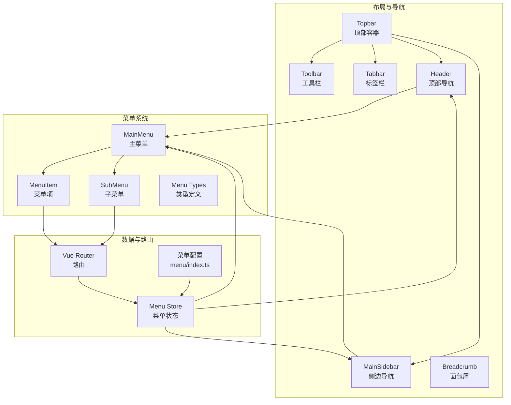
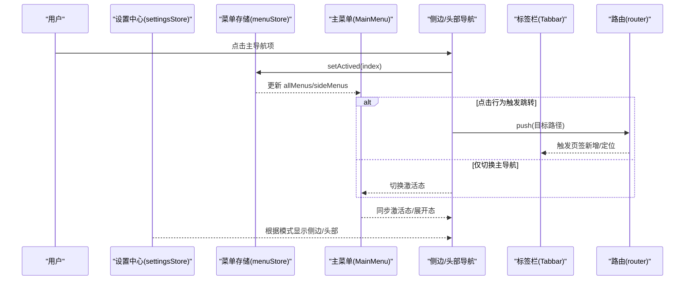
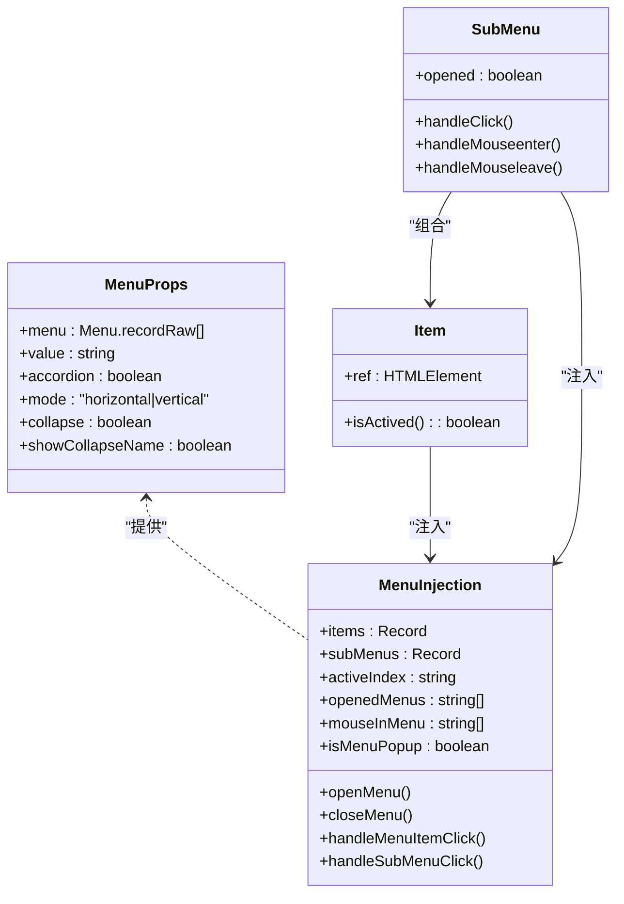
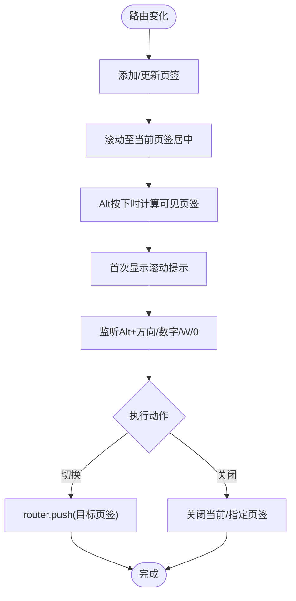
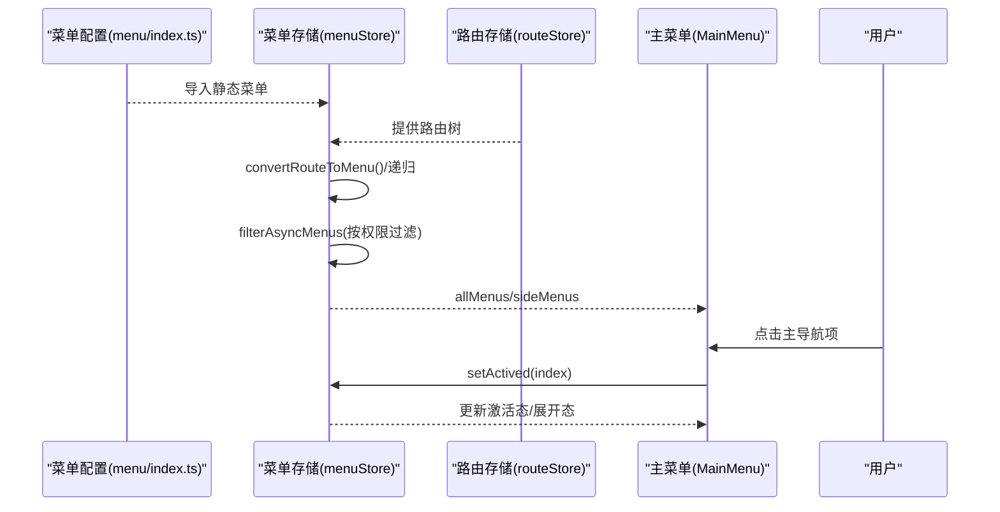
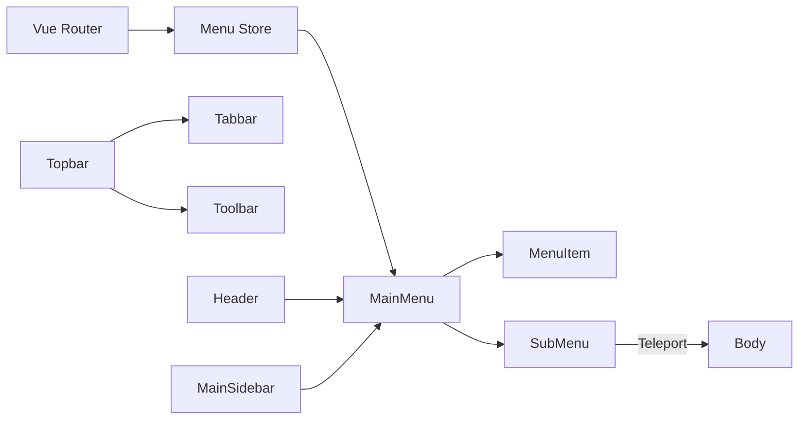

# 导航组件

**本文引用的文件**
- [MainSidebar/index.vue](file://frontend-fantastic-admin/src/layouts/components/MainSidebar/index.vue)
- [Header/index.vue](file://frontend-fantastic-admin/src/layouts/components/Header/index.vue)
- [Topbar/index.vue](file://frontend-fantastic-admin/src/layouts/components/Topbar/index.vue)
- [Topbar/Tabbar/index.vue](file://frontend-fantastic-admin/src/layouts/components/Topbar/Tabbar/index.vue)
- [Topbar/Toolbar/index.vue](file://frontend-fantastic-admin/src/layouts/components/Topbar/Toolbar/index.vue)
- [Menu/index.vue](file://frontend-fantastic-admin/src/layouts/components/Menu/index.vue)
- [Menu/item.vue](file://frontend-fantastic-admin/src/layouts/components/Menu/item.vue)
- [Menu/sub.vue](file://frontend-fantastic-admin/src/layouts/components/Menu/sub.vue)
- [Menu/types.ts](file://frontend-fantastic-admin/src/layouts/components/Menu/types.ts)
- [Breadcrumb/index.vue](file://frontend-fantastic-admin/src/layouts/components/Breadcrumb/index.vue)
- [Breadcrumb/item.vue](file://frontend-fantastic-admin/src/layouts/components/Breadcrumb/item.vue)
- [menu/index.ts](file://frontend-fantastic-admin/src/menu/index.ts)
- [store/modules/menu.ts](file://frontend-fantastic-admin/src/store/modules/menu.ts)
- [utils/composables/useMenu.ts](file://frontend-fantastic-admin/src/utils/composables/useMenu.ts)
- [router/index.ts](file://frontend-fantastic-admin/src/router/index.ts)

## 目录
1. [简介](#简介)
2. [项目结构](#项目结构)
3. [核心组件](#核心组件)
4. [架构总览](#架构总览)
5. [详细组件分析](#详细组件分析)
6. [依赖分析](#依赖分析)
7. [性能考虑](#性能考虑)
8. [故障排查指南](#故障排查指南)
9. [结论](#结论)
10. [附录](#附录)

## 简介
本文件面向 MRR 前端“Fantastic Admin”导航体系，系统化梳理侧边栏菜单、顶部栏、标签栏与面包屑导航的组件结构、交互逻辑与数据流。重点覆盖：
- 菜单项配置与路由集成方式
- 权限控制与动态菜单生成
- 响应式布局、移动端适配与导航状态同步
- 导航动画、键盘快捷键与无障碍支持
- 主题定制与样式覆盖方法
- 不同导航布局的设计模式与使用示例

## 项目结构
导航系统主要分布在以下模块：
- 布局容器：顶部栏 Topbar、主内容区与工具栏 Toolbar、标签栏 Tabbar
- 导航菜单：主菜单 MainMenu 及其子项 Item/SubMenu
- 侧边栏与头部导航：MainSidebar（侧边）与 Header（顶部）
- 面包屑导航：Breadcrumb 容器与单个项
- 菜单配置与路由：前端静态菜单定义、菜单存储与路由集成

图表来源
- [Topbar/index.vue:1-94](file://frontend-fantastic-admin/src/layouts/components/Topbar/index.vue#L1-L94)
- [Topbar/Toolbar/index.vue:1-26](file://frontend-fantastic-admin/src/layouts/components/Topbar/Toolbar/index.vue#L1-L26)
- [Topbar/Tabbar/index.vue:1-436](file://frontend-fantastic-admin/src/layouts/components/Topbar/Tabbar/index.vue#L1-L436)
- [Header/index.vue:1-145](file://frontend-fantastic-admin/src/layouts/components/Header/index.vue#L1-L145)
- [MainSidebar/index.vue:1-127](file://frontend-fantastic-admin/src/layouts/components/MainSidebar/index.vue#L1-L127)
- [Menu/index.vue:1-186](file://frontend-fantastic-admin/src/layouts/components/Menu/index.vue#L1-L186)
- [Menu/item.vue:1-95](file://frontend-fantastic-admin/src/layouts/components/Menu/item.vue#L1-L95)
- [Menu/sub.vue:1-227](file://frontend-fantastic-admin/src/layouts/components/Menu/sub.vue#L1-L227)
- [Menu/types.ts:1-49](file://frontend-fantastic-admin/src/layouts/components/Menu/types.ts#L1-L49)
- [store/modules/menu.ts:1-218](file://frontend-fantastic-admin/src/store/modules/menu.ts#L1-L218)
- [menu/index.ts:1-18](file://frontend-fantastic-admin/src/menu/index.ts#L1-L18)
- [router/index.ts:1-24](file://frontend-fantastic-admin/src/router/index.ts#L1-L24)

章节来源
- [Topbar/index.vue:1-94](file://frontend-fantastic-admin/src/layouts/components/Topbar/index.vue#L1-L94)
- [Menu/index.vue:1-186](file://frontend-fantastic-admin/src/layouts/components/Menu/index.vue#L1-L186)
- [store/modules/menu.ts:1-218](file://frontend-fantastic-admin/src/store/modules/menu.ts#L1-L218)
- [router/index.ts:1-24](file://frontend-fantastic-admin/src/router/index.ts#L1-L24)

## 核心组件
- 顶部栏 Topbar：聚合标签栏与工具栏，支持吸顶/粘性/固定等模式，配合滚动隐藏与遮罩渐变效果。
- 主菜单 MainMenu：支持垂直/水平、手风琴/多开、折叠/展开、弹出菜单等模式，内部通过注入上下文协调子项状态。
- 侧边导航 MainSidebar：在侧边或移动端显示主导航，支持热键切换主导航项。
- 顶部导航 Header：在 PC 端顶部以横向菜单形式展示主导航。
- 标签栏 Tabbar：多页签管理，支持键盘快捷键、右键菜单、滚动提示与可见索引高亮。
- 工具栏 Toolbar：左右两侧插槽，承载面包屑、搜索、全屏等功能入口。
- 面包屑 Breadcrumb：容器与项组件，支持点击跳转与分隔符样式。

章节来源
- [Topbar/index.vue:1-94](file://frontend-fantastic-admin/src/layouts/components/Topbar/index.vue#L1-L94)
- [Menu/index.vue:1-186](file://frontend-fantastic-admin/src/layouts/components/Menu/index.vue#L1-L186)
- [MainSidebar/index.vue:1-127](file://frontend-fantastic-admin/src/layouts/components/MainSidebar/index.vue#L1-L127)
- [Header/index.vue:1-145](file://frontend-fantastic-admin/src/layouts/components/Header/index.vue#L1-L145)
- [Topbar/Tabbar/index.vue:1-436](file://frontend-fantastic-admin/src/layouts/components/Topbar/Tabbar/index.vue#L1-L436)
- [Topbar/Toolbar/index.vue:1-26](file://frontend-fantastic-admin/src/layouts/components/Topbar/Toolbar/index.vue#L1-L26)
- [Breadcrumb/index.vue:1-22](file://frontend-fantastic-admin/src/layouts/components/Breadcrumb/index.vue#L1-L22)
- [Breadcrumb/item.vue:1-39](file://frontend-fantastic-admin/src/layouts/components/Breadcrumb/item.vue#L1-L39)

## 架构总览
导航系统围绕“设置驱动 + 菜单存储 + 路由联动”的架构运行：
- 设置中心（settingsStore）决定导航模式（侧边/顶部/单栏）、键盘热键、工具栏开关等。
- 菜单存储（menuStore）负责将路由或静态菜单转换为导航树，按权限过滤，并维护主导航激活态与默认展开路径。
- 主菜单（MainMenu）基于菜单树渲染，处理点击、展开/收起、激活态同步。
- 顶部栏/侧边栏/头部导航根据设置与菜单状态进行条件渲染与样式切换。
- 标签栏（Tabbar）基于路由变化自动增删页签，支持键盘与右键操作。
- 工具栏（Toolbar）在启用时显示面包屑等区域。

图表来源
- [utils/composables/useMenu.ts:1-21](file://frontend-fantastic-admin/src/utils/composables/useMenu.ts#L1-L21)
- [store/modules/menu.ts:1-218](file://frontend-fantastic-admin/src/store/modules/menu.ts#L1-L218)
- [Menu/index.vue:1-186](file://frontend-fantastic-admin/src/layouts/components/Menu/index.vue#L1-L186)
- [MainSidebar/index.vue:1-127](file://frontend-fantastic-admin/src/layouts/components/MainSidebar/index.vue#L1-L127)
- [Header/index.vue:1-145](file://frontend-fantastic-admin/src/layouts/components/Header/index.vue#L1-L145)
- [Topbar/Tabbar/index.vue:1-436](file://frontend-fantastic-admin/src/layouts/components/Topbar/Tabbar/index.vue#L1-L436)
- [router/index.ts:1-24](file://frontend-fantastic-admin/src/router/index.ts#L1-L24)

## 详细组件分析

### 主菜单系统（MainMenu/Item/SubMenu）
- 设计要点
  - 使用 provide/inject 提供菜单上下文，统一管理激活项、展开项、手风琴模式与弹出模式。
  - 支持垂直/水平、折叠、弹出菜单（popup）等模式，子菜单 Teleport 到 body 并自适应边界。
  - 通过唯一键（uniqueKey）与 indexPath 维护层级关系，确保激活态与展开态正确传播。
- 交互逻辑
  - 点击菜单项：若为子菜单则切换展开，否则触发激活并根据设置决定是否跳转。
  - 鼠标悬停（popup 模式）：延时打开子菜单，计算最佳定位避免溢出。
  - 键盘/热键：支持 Alt+` 切换主导航项（侧边/头部模式下生效）。
- 动画与过渡
  - 子菜单展开/收起使用 Transition/Teleport，支持高度自适应与边界处理。
  - popup 模式下提供平滑的进入/离开动画类。

图表来源
- [Menu/types.ts:1-49](file://frontend-fantastic-admin/src/layouts/components/Menu/types.ts#L1-L49)
- [Menu/index.vue:1-186](file://frontend-fantastic-admin/src/layouts/components/Menu/index.vue#L1-L186)
- [Menu/item.vue:1-95](file://frontend-fantastic-admin/src/layouts/components/Menu/item.vue#L1-L95)
- [Menu/sub.vue:1-227](file://frontend-fantastic-admin/src/layouts/components/Menu/sub.vue#L1-L227)

章节来源
- [Menu/index.vue:1-186](file://frontend-fantastic-admin/src/layouts/components/Menu/index.vue#L1-L186)
- [Menu/item.vue:1-95](file://frontend-fantastic-admin/src/layouts/components/Menu/item.vue#L1-L95)
- [Menu/sub.vue:1-227](file://frontend-fantastic-admin/src/layouts/components/Menu/sub.vue#L1-L227)
- [Menu/types.ts:1-49](file://frontend-fantastic-admin/src/layouts/components/Menu/types.ts#L1-L49)

### 侧边导航（MainSidebar）
- 渲染条件：当设置为侧边模式或移动端非 single 模式时显示。
- 结构组成：顶部插槽、Logo、菜单区（滚动区域）、底部插槽、账户按钮。
- 交互特性
  - Alt+` 与 Alt+Shift+` 在侧边/头部模式下循环切换主导航项。
  - 菜单项点击通过 useMenu.switchTo 切换主导航并按策略决定是否跳转。
- 样式与主题
  - 使用 CSS 变量控制宽度、背景、颜色、悬停/激活态色值，支持深浅主题切换。

章节来源
- [MainSidebar/index.vue:1-127](file://frontend-fantastic-admin/src/layouts/components/MainSidebar/index.vue#L1-L127)
- [utils/composables/useMenu.ts:1-21](file://frontend-fantastic-admin/src/utils/composables/useMenu.ts#L1-L21)

### 顶部导航（Header）
- 渲染条件：PC 端且设置为头部模式时显示。
- 结构组成：Logo、横向菜单区、右侧工具区、账户按钮。
- 交互特性：与侧边导航一致的主导航切换与热键支持；菜单项点击后根据策略决定跳转。

章节来源
- [Header/index.vue:1-145](file://frontend-fantastic-admin/src/layouts/components/Header/index.vue#L1-L145)
- [utils/composables/useMenu.ts:1-21](file://frontend-fantastic-admin/src/utils/composables/useMenu.ts#L1-L21)

### 顶部栏与工具栏（Topbar/Toolbar）
- Topbar
  - 根据设置选择 sticky/fixed/static 模式，监听滚动实现隐藏与遮罩渐变。
  - 条件渲染 Tabbar 与 Toolbar。
- Toolbar
  - 左侧遮罩与右侧插槽，承载面包屑、搜索、全屏等控件。
  - 根据设置动态启用/禁用各功能项（如文件系统路由模式下禁用面包屑）。

章节来源
- [Topbar/index.vue:1-94](file://frontend-fantastic-admin/src/layouts/components/Topbar/index.vue#L1-L94)
- [Topbar/Toolbar/index.vue:1-26](file://frontend-fantastic-admin/src/layouts/components/Topbar/Toolbar/index.vue#L1-L26)

### 标签栏（Tabbar）
- 自动管理：路由变化时自动添加/定位活动页签，滚动居中显示当前页签。
- 快捷键：Alt+方向键切换相邻页签、Alt+W 关闭当前、Alt+数字快速定位可见页签、Alt+0 最后一个。
- 上下文菜单：重新加载、关闭、关闭其他/左右侧等。
- 可见性检测：在 Alt 按下时计算可视范围内页签索引，显示数字快捷键提示。

图表来源
- [Topbar/Tabbar/index.vue:1-436](file://frontend-fantastic-admin/src/layouts/components/Topbar/Tabbar/index.vue#L1-L436)

章节来源
- [Topbar/Tabbar/index.vue:1-436](file://frontend-fantastic-admin/src/layouts/components/Topbar/Tabbar/index.vue#L1-L436)

### 面包屑（Breadcrumb）
- 容器：控制分隔符与末项样式。
- 单项：支持点击跳转（push/replace），未提供 to 时不激活链接态。
- 与工具栏联动：文件系统路由模式下自动禁用面包屑功能。

章节来源
- [Breadcrumb/index.vue:1-22](file://frontend-fantastic-admin/src/layouts/components/Breadcrumb/index.vue#L1-L22)
- [Breadcrumb/item.vue:1-39](file://frontend-fantastic-admin/src/layouts/components/Breadcrumb/item.vue#L1-L39)
- [Topbar/Toolbar/index.vue:1-26](file://frontend-fantastic-admin/src/layouts/components/Topbar/Toolbar/index.vue#L1-L26)

### 菜单项配置与路由集成
- 菜单来源
  - 前端静态菜单：通过 menu/index.ts 定义，支持多级嵌套与元信息（标题、图标、权限、默认展开等）。
  - 后端动态菜单：通过接口拉取，转换为导航树。
- 转换与过滤
  - 将路由树转换为菜单树，保留 meta 信息并递归处理子节点。
  - 根据权限（auth）过滤不可见菜单。
- 主导航切换策略
  - 点击主导航项时，根据设置决定是仅切换主导航还是直接跳转到次级菜单首深路径。

图表来源
- [menu/index.ts:1-18](file://frontend-fantastic-admin/src/menu/index.ts#L1-L18)
- [store/modules/menu.ts:1-218](file://frontend-fantastic-admin/src/store/modules/menu.ts#L1-L218)
- [Menu/index.vue:1-186](file://frontend-fantastic-admin/src/layouts/components/Menu/index.vue#L1-L186)

章节来源
- [menu/index.ts:1-18](file://frontend-fantastic-admin/src/menu/index.ts#L1-L18)
- [store/modules/menu.ts:1-218](file://frontend-fantastic-admin/src/store/modules/menu.ts#L1-L218)
- [utils/composables/useMenu.ts:1-21](file://frontend-fantastic-admin/src/utils/composables/useMenu.ts#L1-L21)
- [router/index.ts:1-24](file://frontend-fantastic-admin/src/router/index.ts#L1-L24)

### 权限控制与动态菜单
- 权限判断：菜单元信息中包含 auth 字段，存储层通过 auth.auth() 进行过滤。
- 动态生成：支持前端静态生成与后端接口生成两种模式，按设置切换。
- 默认展开：根据 meta.defaultOpened 与当前路由匹配，计算默认展开路径集合。

章节来源
- [store/modules/menu.ts:1-218](file://frontend-fantastic-admin/src/store/modules/menu.ts#L1-L218)

### 响应式导航与移动端适配
- 模式切换：通过设置中心控制 menu.mode（side/head/single）与 topbar.mode（sticky/static/fixed）。
- 移动端：侧边导航在移动端非 single 模式下显示；头部导航仅在 head 模式下显示。
- 滚动行为：Topbar 在 sticky 模式下根据滚动方向与阈值隐藏/显示，提供遮罩渐变。

章节来源
- [MainSidebar/index.vue:1-127](file://frontend-fantastic-admin/src/layouts/components/MainSidebar/index.vue#L1-L127)
- [Header/index.vue:1-145](file://frontend-fantastic-admin/src/layouts/components/Header/index.vue#L1-L145)
- [Topbar/index.vue:1-94](file://frontend-fantastic-admin/src/layouts/components/Topbar/index.vue#L1-L94)

### 导航动画、键盘导航与无障碍支持
- 动画
  - 侧边导航与头部导航使用 Vue Transition 实现进入/离开动画。
  - 标签栏使用 TransitionGroup 实现页签增删动画。
  - 子菜单展开/收起使用 Transition 与 Teleport，支持边界自适应。
- 键盘导航
  - Alt+` 与 Alt+Shift+` 循环切换主导航项（侧边/头部模式）。
  - Tabbar 支持 Alt+方向键、Alt+W、Alt+数字、Alt+0 等快捷键。
- 无障碍
  - Tooltip 提供文本提示，popup 模式下在特定层级显示。
  - 菜单项使用语义化元素与 title 属性增强可读性。

章节来源
- [MainSidebar/index.vue:1-127](file://frontend-fantastic-admin/src/layouts/components/MainSidebar/index.vue#L1-L127)
- [Header/index.vue:1-145](file://frontend-fantastic-admin/src/layouts/components/Header/index.vue#L1-L145)
- [Topbar/Tabbar/index.vue:1-436](file://frontend-fantastic-admin/src/layouts/components/Topbar/Tabbar/index.vue#L1-L436)
- [Menu/sub.vue:1-227](file://frontend-fantastic-admin/src/layouts/components/Menu/sub.vue#L1-L227)

### 主题定制与样式覆盖
- CSS 变量：广泛使用 CSS 变量控制颜色、背景、尺寸等，便于主题切换。
- 组件作用域样式：通过 scoped 样式与 :deep 选择器覆盖子组件样式。
- 示例变量（来源于组件样式）：
  - --g-main-sidebar-width、--g-main-sidebar-bg、--g-main-sidebar-menu-color 等
  - --g-header-bg、--g-header-height、--g-header-menu-* 等
  - --g-tabbar-height、--g-tabbar-bg、--g-tabbar-tab-* 等
  - --g-toolbar-height、--g-toolbar-bg 等
- 覆盖建议
  - 在全局样式中重定义上述变量以实现主题切换。
  - 使用 :deep 选择器对子组件容器进行样式穿透，避免破坏组件结构。

章节来源
- [MainSidebar/index.vue:75-126](file://frontend-fantastic-admin/src/layouts/components/MainSidebar/index.vue#L75-L126)
- [Header/index.vue:57-144](file://frontend-fantastic-admin/src/layouts/components/Header/index.vue#L57-L144)
- [Topbar/index.vue:56-93](file://frontend-fantastic-admin/src/layouts/components/Topbar/index.vue#L56-L93)
- [Topbar/Tabbar/index.vue:240-435](file://frontend-fantastic-admin/src/layouts/components/Topbar/Tabbar/index.vue#L240-L435)
- [Topbar/Toolbar/index.vue:21-25](file://frontend-fantastic-admin/src/layouts/components/Topbar/Toolbar/index.vue#L21-L25)

## 依赖分析
- 组件耦合
  - Menu 系列组件通过 provide/inject 共享上下文，降低跨层级通信成本。
  - Topbar 作为容器聚合多个子组件，职责清晰。
- 外部依赖
  - Vue Router：路由跳转、守卫与扩展。
  - hotkeys-js：全局热键绑定与解绑。
  - @vueuse/core：useElementSize、useMagicKeys、useTimeoutFn 等。
- 潜在风险
  - 热键绑定/解绑需与生命周期严格匹配，避免内存泄漏。
  - 子菜单 Teleport 与边界计算需在窗口尺寸变化时重算。

图表来源
- [router/index.ts:1-24](file://frontend-fantastic-admin/src/router/index.ts#L1-L24)
- [store/modules/menu.ts:1-218](file://frontend-fantastic-admin/src/store/modules/menu.ts#L1-L218)
- [Menu/sub.vue:210-225](file://frontend-fantastic-admin/src/layouts/components/Menu/sub.vue#L210-L225)

章节来源
- [router/index.ts:1-24](file://frontend-fantastic-admin/src/router/index.ts#L1-L24)
- [store/modules/menu.ts:1-218](file://frontend-fantastic-admin/src/store/modules/menu.ts#L1-L218)
- [Menu/sub.vue:1-227](file://frontend-fantastic-admin/src/layouts/components/Menu/sub.vue#L1-L227)

## 性能考虑
- 渲染优化
  - 子菜单展开/收起使用 Transition 与 Teleport，避免频繁 DOM 重排。
  - popup 模式下延迟打开与边界计算减少不必要的重绘。
- 计算属性
  - 菜单树转换与权限过滤结果缓存于计算属性，避免重复遍历。
- 事件与监听
  - 热键绑定/解绑与滚动监听在挂载/卸载阶段管理，防止泄漏。
- 建议
  - 大型菜单树可考虑虚拟滚动或分页加载。
  - 避免在渲染函数中进行复杂计算，尽量使用计算属性或缓存。

## 故障排查指南
- 热键无效
  - 检查设置中是否启用热键与当前导航模式是否允许（side/head）。
  - 确认 onMounted/onUnmounted 中绑定/解绑是否正确。
- 子菜单溢出或遮挡
  - 检查 Teleport 边界计算逻辑与窗口尺寸变化处理。
  - 确认 popup 模式下的最大高度与溢出控制。
- 标签栏快捷键冲突
  - 确认浏览器快捷键与应用快捷键优先级，必要时调整组合键。
- 权限导致菜单缺失
  - 检查菜单 meta.auth 是否正确，确认权限过滤逻辑与用户角色匹配。
- 路由跳转异常
  - 检查路由守卫与扩展是否正确初始化，确认目标路由是否存在。

章节来源
- [MainSidebar/index.vue:15-32](file://frontend-fantastic-admin/src/layouts/components/MainSidebar/index.vue#L15-L32)
- [Topbar/Tabbar/index.vue:134-189](file://frontend-fantastic-admin/src/layouts/components/Topbar/Tabbar/index.vue#L134-L189)
- [Menu/sub.vue:130-205](file://frontend-fantastic-admin/src/layouts/components/Menu/sub.vue#L130-L205)
- [store/modules/menu.ts:153-169](file://frontend-fantastic-admin/src/store/modules/menu.ts#L153-L169)
- [router/index.ts:1-24](file://frontend-fantastic-admin/src/router/index.ts#L1-L24)

## 结论
MRR 导航体系以设置为中心，结合菜单存储与主菜单组件，实现了灵活的侧边/顶部/单栏导航模式，配合标签栏、工具栏与面包屑，形成完整的多维导航体验。通过权限过滤、热键支持与响应式适配，满足多场景需求。建议在大型项目中进一步引入虚拟滚动与更细粒度的状态管理，以提升性能与可维护性。

## 附录
- 设计模式参考
  - 容器-组件分离：Topbar 聚合 Tabbar/Toolbar，Menu 系列组件独立渲染。
  - 组合优于继承：通过 provide/inject 传递上下文，避免深层 props 下钻。
  - 策略模式：主导航点击策略（仅切换/跳转）由设置决定。
- 使用示例（路径指引）
  - 侧边导航：[MainSidebar/index.vue:35-73](file://frontend-fantastic-admin/src/layouts/components/MainSidebar/index.vue#L35-L73)
  - 顶部导航：[Header/index.vue:15-54](file://frontend-fantastic-admin/src/layouts/components/Header/index.vue#L15-L54)
  - 主菜单：[Menu/index.vue:171-185](file://frontend-fantastic-admin/src/layouts/components/Menu/index.vue#L171-L185)
  - 标签栏：[Topbar/Tabbar/index.vue:192-238](file://frontend-fantastic-admin/src/layouts/components/Topbar/Tabbar/index.vue#L192-L238)
  - 工具栏：[Topbar/Toolbar/index.vue:10-19](file://frontend-fantastic-admin/src/layouts/components/Topbar/Toolbar/index.vue#L10-L19)
  - 面包屑：[Breadcrumb/index.vue:1-5](file://frontend-fantastic-admin/src/layouts/components/Breadcrumb/index.vue#L1-L5)
  - 菜单配置：[menu/index.ts:5-15](file://frontend-fantastic-admin/src/menu/index.ts#L5-L15)
  - 菜单存储：[store/modules/menu.ts:69-79](file://frontend-fantastic-admin/src/store/modules/menu.ts#L69-L79)
  - 路由集成：[router/index.ts:9-14](file://frontend-fantastic-admin/src/router/index.ts#L9-L14)