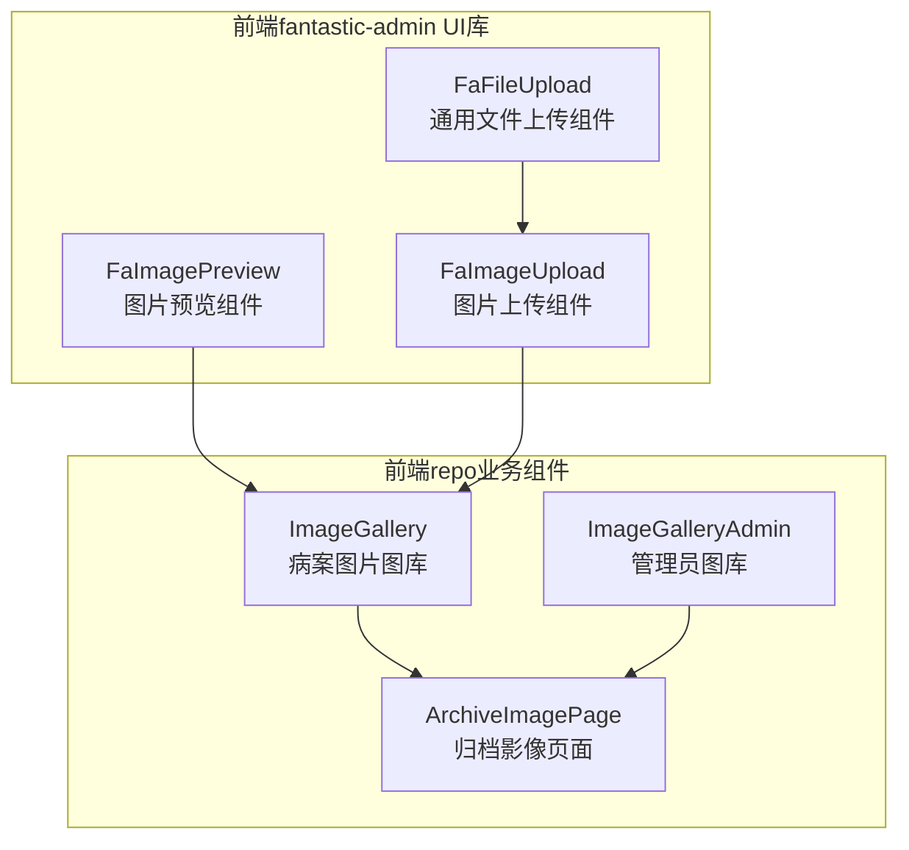
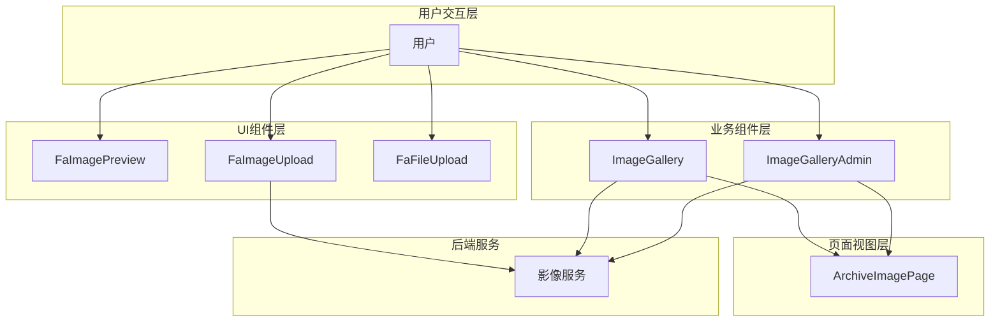
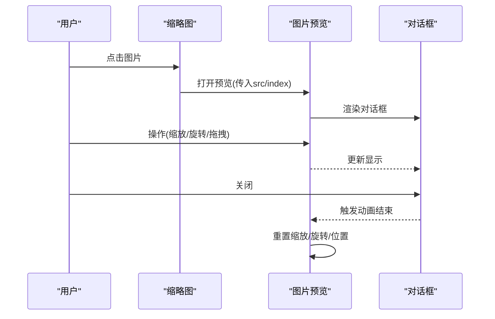
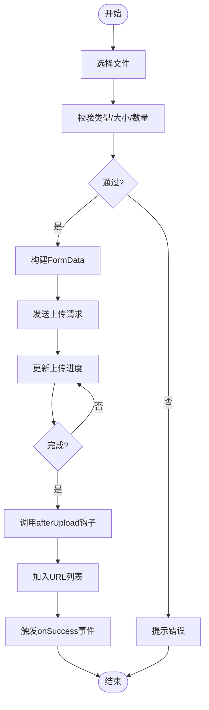
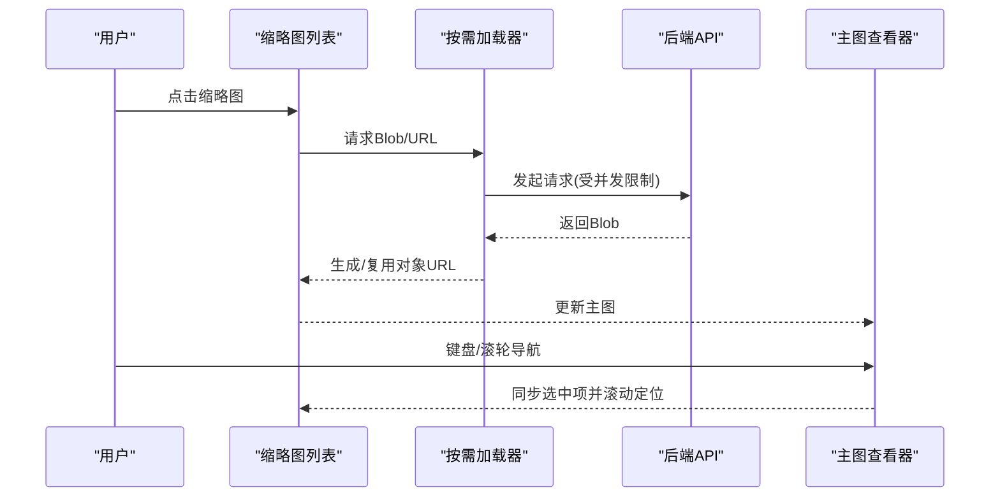
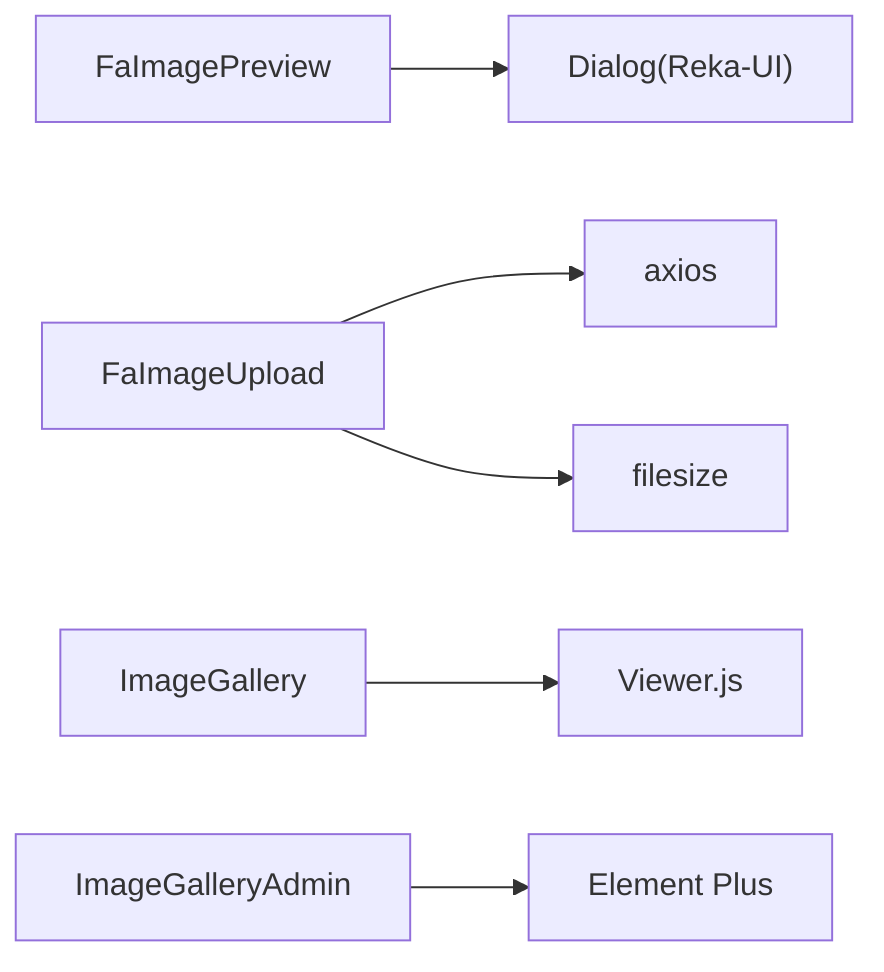

# 影像浏览组件

**本文档引用的文件**
- [frontend-fantastic-admin/src/ui/components/FaImagePreview/index.vue](file://frontend-fantastic-admin/src/ui/components/FaImagePreview/index.vue)
- [frontend-fantastic-admin/src/ui/components/FaImagePreview/preview.vue](file://frontend-fantastic-admin/src/ui/components/FaImagePreview/preview.vue)
- [frontend-fantastic-admin/src/ui/components/FaImagePreview/index.ts](file://frontend-fantastic-admin/src/ui/components/FaImagePreview/index.ts)
- [frontend-fantastic-admin/src/ui/components/FaImagePreview/dialog/Dialog.vue](file://frontend-fantastic-admin/src/ui/components/FaImagePreview/dialog/Dialog.vue)
- [frontend-fantastic-admin/src/ui/components/FaImageUpload/index.vue](file://frontend-fantastic-admin/src/ui/components/FaImageUpload/index.vue)
- [frontend-fantastic-admin/src/ui/components/FaFileUpload/index.vue](file://frontend-fantastic-admin/src/ui/components/FaFileUpload/index.vue)
- [frontend-repo/src/components/ImageGallery.vue](file://frontend-repo/src/components/ImageGallery.vue)
- [frontend-repo/src/components/ImageGalleryAdmin.vue](file://frontend-repo/src/components/ImageGalleryAdmin.vue)
- [frontend-repo/src/views/admin/ArchiveImagePage.vue](file://frontend-repo/src/views/admin/ArchiveImagePage.vue)

## 目录
1. [简介](#简介)
2. [项目结构](#项目结构)
3. [核心组件](#核心组件)
4. [架构总览](#架构总览)
5. [详细组件分析](#详细组件分析)
6. [依赖关系分析](#依赖关系分析)
7. [性能考量](#性能考量)
8. [故障排查指南](#故障排查指南)
9. [结论](#结论)
10. [附录](#附录)

## 简介
本文件面向MRR项目的影像浏览组件，系统性梳理图片预览、批量上传、缩略图网格等影像处理能力，覆盖文件格式支持、尺寸限制、压缩算法配置、拖拽上传、进度显示、错误处理、大文件处理与内存优化、浏览器兼容性以及可访问性与键盘导航等主题。文档同时提供最佳实践示例与实现方案，帮助开发者快速集成与优化影像浏览体验。

## 项目结构
围绕影像浏览的核心文件分布于前后端前端仓库的多个模块中：
- 前端fantastic-admin UI库：提供可复用的图片预览与上传组件
- 前端repo业务组件：提供完整的病案图片图库与管理界面
- 页面级视图：提供归档影像页面与管理员界面

**图表来源**
- [frontend-fantastic-admin/src/ui/components/FaImagePreview/index.vue:1-72](file://frontend-fantastic-admin/src/ui/components/FaImagePreview/index.vue#L1-L72)
- [frontend-fantastic-admin/src/ui/components/FaImageUpload/index.vue:1-219](file://frontend-fantastic-admin/src/ui/components/FaImageUpload/index.vue#L1-L219)
- [frontend-fantastic-admin/src/ui/components/FaFileUpload/index.vue:1-200](file://frontend-fantastic-admin/src/ui/components/FaFileUpload/index.vue#L1-L200)
- [frontend-repo/src/components/ImageGallery.vue:1-800](file://frontend-repo/src/components/ImageGallery.vue#L1-L800)
- [frontend-repo/src/components/ImageGalleryAdmin.vue:1-800](file://frontend-repo/src/components/ImageGalleryAdmin.vue#L1-L800)
- [frontend-repo/src/views/admin/ArchiveImagePage.vue:958-1104](file://frontend-repo/src/views/admin/ArchiveImagePage.vue#L958-L1104)

**章节来源**
- [frontend-fantastic-admin/src/ui/components/FaImagePreview/index.vue:1-72](file://frontend-fantastic-admin/src/ui/components/FaImagePreview/index.vue#L1-L72)
- [frontend-fantastic-admin/src/ui/components/FaImageUpload/index.vue:1-219](file://frontend-fantastic-admin/src/ui/components/FaImageUpload/index.vue#L1-L219)
- [frontend-repo/src/components/ImageGallery.vue:1-800](file://frontend-repo/src/components/ImageGallery.vue#L1-L800)

## 核心组件
- 图片预览组件（FaImagePreview）
  - 支持单图与多图预览，内置缩放、旋转、拖拽平移、滚轮缩放、左右切换与原图尺寸控制
  - 提供无障碍隐藏标题与描述，确保可访问性
- 图片上传组件（FaImageUpload）
  - 支持多文件选择、拖拽上传、进度条显示、格式与大小限制、批量预览与删除、排序调整
  - 与后端接口对接，支持自定义headers、data与afterUpload钩子
- 通用文件上传组件（FaFileUpload）
  - 提供拖拽区域、禁用态、提示文案与文件类型/大小校验
- 病案图片图库（ImageGallery / ImageGalleryAdmin）
  - 提供缩略图网格、主图预览、类型筛选、批量选择、打印导出、下载压缩包、键盘导航与滚动定位
  - 内置按需加载、并发控制、缓存与内存回收机制，适配大图集场景

**章节来源**
- [frontend-fantastic-admin/src/ui/components/FaImagePreview/preview.vue:1-175](file://frontend-fantastic-admin/src/ui/components/FaImagePreview/preview.vue#L1-L175)
- [frontend-fantastic-admin/src/ui/components/FaImageUpload/index.vue:1-219](file://frontend-fantastic-admin/src/ui/components/FaImageUpload/index.vue#L1-L219)
- [frontend-fantastic-admin/src/ui/components/FaFileUpload/index.vue:1-200](file://frontend-fantastic-admin/src/ui/components/FaFileUpload/index.vue#L1-L200)
- [frontend-repo/src/components/ImageGallery.vue:1-800](file://frontend-repo/src/components/ImageGallery.vue#L1-L800)
- [frontend-repo/src/components/ImageGalleryAdmin.vue:1-800](file://frontend-repo/src/components/ImageGalleryAdmin.vue#L1-L800)

## 架构总览
整体架构采用“UI组件库 + 业务组件 + 页面视图”的分层设计，预览与上传组件作为基础能力，图库组件负责数据驱动的展示与交互，页面视图承载具体业务场景。

**图表来源**
- [frontend-fantastic-admin/src/ui/components/FaImagePreview/index.vue:1-72](file://frontend-fantastic-admin/src/ui/components/FaImagePreview/index.vue#L1-L72)
- [frontend-fantastic-admin/src/ui/components/FaImageUpload/index.vue:1-219](file://frontend-fantastic-admin/src/ui/components/FaImageUpload/index.vue#L1-L219)
- [frontend-repo/src/components/ImageGallery.vue:1-800](file://frontend-repo/src/components/ImageGallery.vue#L1-L800)
- [frontend-repo/src/components/ImageGalleryAdmin.vue:1-800](file://frontend-repo/src/components/ImageGalleryAdmin.vue#L1-L800)
- [frontend-repo/src/views/admin/ArchiveImagePage.vue:958-1104](file://frontend-repo/src/views/admin/ArchiveImagePage.vue#L958-L1104)

## 详细组件分析

### 图片预览组件（FaImagePreview）
- 功能特性
  - 单图/多图预览，支持索引切换
  - 缩放（+/-）、原图尺寸、旋转（左/右）、拖拽平移
  - 滚轮缩放、加载状态、错误状态与占位符
  - 无障碍支持（隐藏标题/描述）
- 交互流程
  - 点击缩略图触发预览对话框
  - 支持键盘与鼠标手势操作
  - 关闭时自动重置状态

**图表来源**
- [frontend-fantastic-admin/src/ui/components/FaImagePreview/index.vue:1-72](file://frontend-fantastic-admin/src/ui/components/FaImagePreview/index.vue#L1-L72)
- [frontend-fantastic-admin/src/ui/components/FaImagePreview/preview.vue:1-175](file://frontend-fantastic-admin/src/ui/components/FaImagePreview/preview.vue#L1-L175)
- [frontend-fantastic-admin/src/ui/components/FaImagePreview/dialog/Dialog.vue:1-16](file://frontend-fantastic-admin/src/ui/components/FaImagePreview/dialog/Dialog.vue#L1-L16)

**章节来源**
- [frontend-fantastic-admin/src/ui/components/FaImagePreview/index.vue:1-72](file://frontend-fantastic-admin/src/ui/components/FaImagePreview/index.vue#L1-L72)
- [frontend-fantastic-admin/src/ui/components/FaImagePreview/preview.vue:1-175](file://frontend-fantastic-admin/src/ui/components/FaImagePreview/preview.vue#L1-L175)
- [frontend-fantastic-admin/src/ui/components/FaImagePreview/index.ts:1-22](file://frontend-fantastic-admin/src/ui/components/FaImagePreview/index.ts#L1-L22)

### 图片上传组件（FaImageUpload）
- 功能特性
  - 多文件选择与拖拽上传
  - 文件类型与大小限制、逐个上传与进度显示
  - 成功回调afterUpload钩子，支持返回最终URL
  - 预览、删除、排序调整
- 上传流程
  - 选择文件 → 校验类型/大小 → 构造FormData → 发送请求 → 更新URL列表 → 触发成功事件

**图表来源**
- [frontend-fantastic-admin/src/ui/components/FaImageUpload/index.vue:1-219](file://frontend-fantastic-admin/src/ui/components/FaImageUpload/index.vue#L1-L219)

**章节来源**
- [frontend-fantastic-admin/src/ui/components/FaImageUpload/index.vue:1-219](file://frontend-fantastic-admin/src/ui/components/FaImageUpload/index.vue#L1-L219)

### 病案图片图库（ImageGallery / ImageGalleryAdmin）
- 功能特性
  - 左侧类型筛选与缩略图网格，右侧主图预览
  - 按需加载（Blob/URL）、并发控制、缓存与内存回收
  - 键盘导航（左右方向键）、滚动定位、全屏预览
  - 管理员模式支持多选、批量打印、类型切换与撤销
- 性能策略
  - 并发抓取上限、请求队列、占位图、懒加载与IntersectionObserver降级
  - 全屏预览时预加载邻近图片，减少切换闪屏
  - 对象URL统一管理与销毁，避免内存泄漏

**图表来源**
- [frontend-repo/src/components/ImageGallery.vue:425-581](file://frontend-repo/src/components/ImageGallery.vue#L425-L581)
- [frontend-repo/src/components/ImageGalleryAdmin.vue:364-456](file://frontend-repo/src/components/ImageGalleryAdmin.vue#L364-L456)

**章节来源**
- [frontend-repo/src/components/ImageGallery.vue:1-800](file://frontend-repo/src/components/ImageGallery.vue#L1-L800)
- [frontend-repo/src/components/ImageGalleryAdmin.vue:1-800](file://frontend-repo/src/components/ImageGalleryAdmin.vue#L1-L800)

## 依赖关系分析
- 组件耦合
  - FaImagePreview与Dialog组件解耦，通过useFaImagePreview工厂函数动态挂载
  - FaImageUpload依赖axios与进度组件，提供afterUpload钩子扩展
  - ImageGallery与ImageGalleryAdmin共享按需加载与并发控制策略
- 外部依赖
  - 图片预览依赖第三方查看器库（Viewer.js）
  - 上传组件依赖axios与文件大小格式化工具
  - 管理员图库依赖Element Plus组件生态

**图表来源**
- [frontend-fantastic-admin/src/ui/components/FaImagePreview/index.ts:1-22](file://frontend-fantastic-admin/src/ui/components/FaImagePreview/index.ts#L1-L22)
- [frontend-fantastic-admin/src/ui/components/FaImageUpload/index.vue:1-219](file://frontend-fantastic-admin/src/ui/components/FaImageUpload/index.vue#L1-L219)
- [frontend-repo/src/components/ImageGallery.vue:209-211](file://frontend-repo/src/components/ImageGallery.vue#L209-L211)
- [frontend-repo/src/components/ImageGalleryAdmin.vue:177-180](file://frontend-repo/src/components/ImageGalleryAdmin.vue#L177-L180)

**章节来源**
- [frontend-fantastic-admin/src/ui/components/FaImagePreview/index.ts:1-22](file://frontend-fantastic-admin/src/ui/components/FaImagePreview/index.ts#L1-L22)
- [frontend-fantastic-admin/src/ui/components/FaImageUpload/index.vue:1-219](file://frontend-fantastic-admin/src/ui/components/FaImageUpload/index.vue#L1-L219)
- [frontend-repo/src/components/ImageGallery.vue:209-211](file://frontend-repo/src/components/ImageGallery.vue#L209-L211)
- [frontend-repo/src/components/ImageGalleryAdmin.vue:177-180](file://frontend-repo/src/components/ImageGalleryAdmin.vue#L177-L180)

## 性能考量
- 大图集加载
  - 通过并发上限与请求队列控制网络风暴，避免阻塞主线程
  - 使用对象URL缓存与去重，减少重复网络与解码成本
- 内存优化
  - 统一管理对象URL生命周期，在组件卸载或重置时回收
  - 占位透明像素避免布局抖动，提升首屏体验
- 浏览器兼容性
  - IntersectionObserver降级为预加载前若干张，保证在不支持的环境中仍可用
  - 全屏预览与滚动行为采用现代API，必要时提供回退策略
- 键盘导航与可访问性
  - 预览对话框提供隐藏标题/描述，满足屏幕阅读器需求
  - 图库组件对输入控件进行判断，避免键盘事件干扰

**章节来源**
- [frontend-repo/src/components/ImageGallery.vue:425-581](file://frontend-repo/src/components/ImageGallery.vue#L425-L581)
- [frontend-repo/src/components/ImageGalleryAdmin.vue:668-738](file://frontend-repo/src/components/ImageGalleryAdmin.vue#L668-L738)
- [frontend-fantastic-admin/src/ui/components/FaImagePreview/preview.vue:123-175](file://frontend-fantastic-admin/src/ui/components/FaImagePreview/preview.vue#L123-L175)

## 故障排查指南
- 上传失败
  - 检查文件类型与大小限制，确认ext与size配置
  - 查看上传进度与错误提示，核对后端接口返回结构
- 预览异常
  - 确认src有效且可访问，检查跨域与鉴权头设置
  - 若为多图预览，确认索引边界与数组长度
- 图库加载缓慢
  - 检查网络状况与后端响应时间
  - 调整并发上限与占位图策略，避免大量并发导致卡顿
- 内存占用高
  - 确认对象URL在组件卸载时被正确回收
  - 避免重复创建大对象或监听器未清理

**章节来源**
- [frontend-fantastic-admin/src/ui/components/FaImageUpload/index.vue:52-129](file://frontend-fantastic-admin/src/ui/components/FaImageUpload/index.vue#L52-L129)
- [frontend-fantastic-admin/src/ui/components/FaImagePreview/preview.vue:98-120](file://frontend-fantastic-admin/src/ui/components/FaImagePreview/preview.vue#L98-L120)
- [frontend-repo/src/components/ImageGallery.vue:440-452](file://frontend-repo/src/components/ImageGallery.vue#L440-L452)

## 结论
MRR项目的影像浏览组件通过UI库与业务组件的协同，实现了从上传、预览到图库管理的完整闭环。组件在性能、可访问性与用户体验方面均提供了完善的策略与实现，适合在大规模影像数据场景中稳定运行。建议在生产环境结合业务需求进一步定制格式支持、尺寸限制与压缩策略，并持续关注浏览器兼容性与内存回收。

## 附录

### 文件格式支持与尺寸限制
- 图片上传组件
  - 支持格式：通过ext属性配置（如jpg/png/webp等）
  - 大小限制：通过size属性配置（单位：字节，默认5MB）
  - 数量限制：通过max属性配置（0表示无上限）
- 图库组件
  - 展示方式：缩略图网格与主图预览
  - 类型筛选：按病案类型分组展示
  - 建议尺寸：可通过dimension属性提示（组件内提供提示文案）

**章节来源**
- [frontend-fantastic-admin/src/ui/components/FaImageUpload/index.vue:8-40](file://frontend-fantastic-admin/src/ui/components/FaImageUpload/index.vue#L8-L40)
- [frontend-repo/src/components/ImageGallery.vue:203-216](file://frontend-repo/src/components/ImageGallery.vue#L203-L216)

### 压缩算法配置
- 后端服务配置
  - 图像属性与压缩策略由后端ImageProperties配置决定
  - 建议在后端统一处理压缩质量与格式转换，前端仅消费最终URL
- 前端展示
  - 图库组件支持直接展示后端返回的URL或Blob对象
  - 全屏预览时对邻近图片进行预加载，提升切换流畅度

**章节来源**
- [backend-repo/src/main/java/com/zjcxph/imgapi/config/ImageProperties.java:1-200](file://backend-repo/src/main/java/com/zjcxph/imgapi/config/ImageProperties.java#L1-L200)

### 使用示例与最佳实践
- 图片预览
  - 使用useFaImagePreview工厂函数打开预览，支持单图或多图传入
  - 在缩略图点击事件中调用，确保src与index正确传递
- 图片上传
  - 配置action、headers、data与afterUpload钩子
  - 设置ext与size限制，结合提示文案引导用户
  - 监听onSuccess事件进行后续处理
- 图库浏览
  - 通过病案号检索图片清单，启用按需加载与并发控制
  - 使用键盘方向键快速切换，结合滚动定位提升效率
  - 管理员模式下启用多选与批量打印，提高工作效率

**章节来源**
- [frontend-fantastic-admin/src/ui/components/FaImagePreview/index.ts:1-22](file://frontend-fantastic-admin/src/ui/components/FaImagePreview/index.ts#L1-L22)
- [frontend-fantastic-admin/src/ui/components/FaImageUpload/index.vue:8-46](file://frontend-fantastic-admin/src/ui/components/FaImageUpload/index.vue#L8-L46)
- [frontend-repo/src/components/ImageGallery.vue:583-587](file://frontend-repo/src/components/ImageGallery.vue#L583-L587)

### 拖拽上传、进度显示与错误处理
- 拖拽上传
  - FaFileUpload提供拖拽区域，支持dragover/dragleave/drop事件
  - FaImageUpload在选择文件后逐个上传，支持进度条显示
- 进度显示
  - 上传过程中实时更新uploadProgress，结合进度条组件展示
- 错误处理
  - 类型/大小校验失败时弹出提示
  - 上传失败或后端返回异常时统一处理并提示

**章节来源**
- [frontend-fantastic-admin/src/ui/components/FaFileUpload/index.vue:63-189](file://frontend-fantastic-admin/src/ui/components/FaFileUpload/index.vue#L63-L189)
- [frontend-fantastic-admin/src/ui/components/FaImageUpload/index.vue:108-128](file://frontend-fantastic-admin/src/ui/components/FaImageUpload/index.vue#L108-L128)

### 大文件处理与内存优化
- 大文件上传
  - 建议后端支持断点续传或分片上传（需后端配合）
  - 前端上传组件支持进度展示与错误重试
- 内存优化
  - 对象URL统一管理与销毁，避免内存泄漏
  - 按需加载与并发控制，减少同时在内存中的图片数量

**章节来源**
- [frontend-repo/src/components/ImageGallery.vue:440-452](file://frontend-repo/src/components/ImageGallery.vue#L440-L452)
- [frontend-repo/src/components/ImageGalleryAdmin.vue:377-380](file://frontend-repo/src/components/ImageGalleryAdmin.vue#L377-L380)

### 浏览器兼容性与可访问性
- 兼容性
  - IntersectionObserver降级为预加载策略，保证在旧版浏览器可用
  - 全屏预览与滚动行为采用现代API，必要时提供回退
- 可访问性
  - 预览对话框提供隐藏标题与描述，支持屏幕阅读器
  - 键盘导航与焦点管理，确保非鼠标用户也能高效操作

**章节来源**
- [frontend-repo/src/components/ImageGallery.vue:668-738](file://frontend-repo/src/components/ImageGallery.vue#L668-L738)
- [frontend-fantastic-admin/src/ui/components/FaImagePreview/preview.vue:123-129](file://frontend-fantastic-admin/src/ui/components/FaImagePreview/preview.vue#L123-L129)