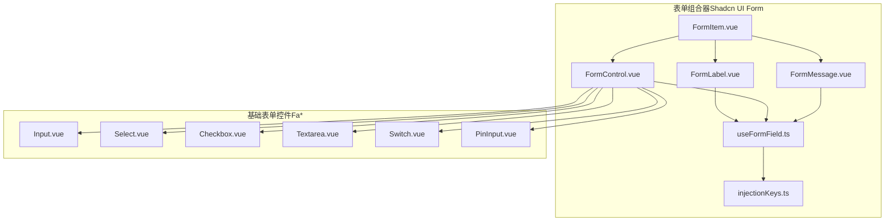
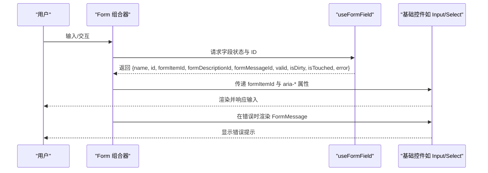
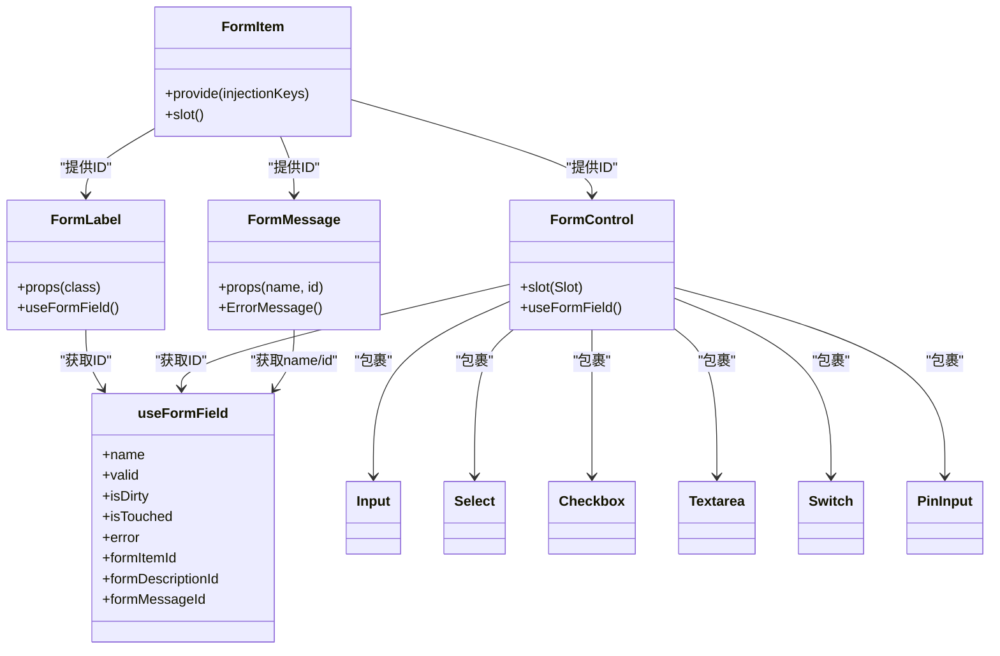
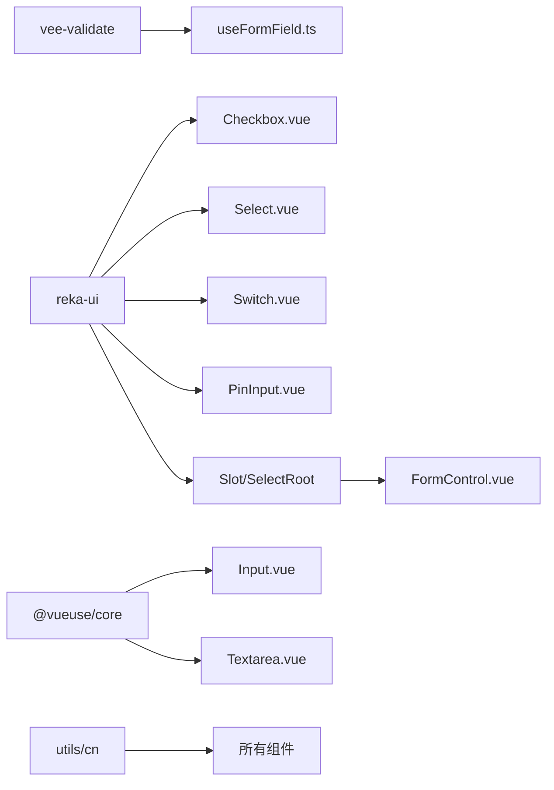

# 表单组件

**本文引用的文件**
- [FormControl.vue](file://frontend-fantastic-admin/src/ui/shadcn/ui/form/FormControl.vue)
- [FormItem.vue](file://frontend-fantastic-admin/src/ui/shadcn/ui/form/FormItem.vue)
- [FormLabel.vue](file://frontend-fantastic-admin/src/ui/shadcn/ui/form/FormLabel.vue)
- [FormMessage.vue](file://frontend-fantastic-admin/src/ui/shadcn/ui/form/FormMessage.vue)
- [useFormField.ts](file://frontend-fantastic-admin/src/ui/shadcn/ui/form/useFormField.ts)
- [injectionKeys.ts](file://frontend-fantastic-admin/src/ui/shadcn/ui/form/injectionKeys.ts)
- [Input.vue](file://frontend-fantastic-admin/src/ui/components/FaInput/input/Input.vue)
- [Select.vue](file://frontend-fantastic-admin/src/ui/components/FaSelect/select/Select.vue)
- [Checkbox.vue](file://frontend-fantastic-admin/src/ui/components/FaCheckbox/checkbox/Checkbox.vue)
- [Textarea.vue](file://frontend-fantastic-admin/src/ui/components/FaTextarea/textarea/Textarea.vue)
- [Switch.vue](file://frontend-fantastic-admin/src/ui/components/FaSwitch/switch/Switch.vue)
- [PinInput.vue](file://frontend-fantastic-admin/src/ui/components/FaPinInput/pin-input/PinInput.vue)

## 目录
1. [简介](#简介)
2. [项目结构](#项目结构)
3. [核心组件](#核心组件)
4. [架构总览](#架构总览)
5. [详细组件分析](#详细组件分析)
6. [依赖关系分析](#依赖关系分析)
7. [性能考量](#性能考量)
8. [故障排查指南](#故障排查指南)
9. [结论](#结论)
10. [附录](#附录)

## 简介
本文件面向 MRR 前端项目中的表单组件体系，重点覆盖以下内容：
- 输入框、选择器、复选框、文本域、开关、密码输入等基础表单控件的功能特性与使用方法
- 组件属性配置、与 vee-validate 的集成、验证规则与事件处理机制
- 典型使用示例：登录、注册、重置密码、修改密码等常见表单场景
- 高级用法：表单联动、动态字段、条件显示
- 表单验证、错误提示与用户反馈优化
- 样式定制与主题适配支持

## 项目结构
本项目采用“UI 组件库 + 表单组合器”的分层组织方式：
- 基础表单控件位于 src/ui/components 下（如 FaInput、FaSelect、FaCheckbox、FaTextarea、FaSwitch、FaPinInput）
- 表单组合器与可访问性增强位于 src/ui/shadcn/ui/form 下（FormItem、FormLabel、FormControl、FormMessage、useFormField）

图示来源
- [FormItem.vue:1-21](file://frontend-fantastic-admin/src/ui/shadcn/ui/form/FormItem.vue#L1-L21)
- [FormLabel.vue:1-24](file://frontend-fantastic-admin/src/ui/shadcn/ui/form/FormLabel.vue#L1-L24)
- [FormControl.vue:1-17](file://frontend-fantastic-admin/src/ui/shadcn/ui/form/FormControl.vue#L1-L17)
- [FormMessage.vue:1-17](file://frontend-fantastic-admin/src/ui/shadcn/ui/form/FormMessage.vue#L1-L17)
- [useFormField.ts:1-32](file://frontend-fantastic-admin/src/ui/shadcn/ui/form/useFormField.ts#L1-L32)
- [injectionKeys.ts:1-4](file://frontend-fantastic-admin/src/ui/shadcn/ui/form/injectionKeys.ts#L1-L4)
- [Input.vue:1-25](file://frontend-fantastic-admin/src/ui/components/FaInput/input/Input.vue#L1-L25)
- [Select.vue:1-16](file://frontend-fantastic-admin/src/ui/components/FaSelect/select/Select.vue#L1-L16)
- [Checkbox.vue:1-30](file://frontend-fantastic-admin/src/ui/components/FaCheckbox/checkbox/Checkbox.vue#L1-L30)
- [Textarea.vue:1-25](file://frontend-fantastic-admin/src/ui/components/FaTextarea/textarea/Textarea.vue#L1-L25)
- [Switch.vue:1-36](file://frontend-fantastic-admin/src/ui/components/FaSwitch/switch/Switch.vue#L1-L36)
- [PinInput.vue:1-23](file://frontend-fantastic-admin/src/ui/components/FaPinInput/pin-input/PinInput.vue#L1-L23)

章节来源
- [FormItem.vue:1-21](file://frontend-fantastic-admin/src/ui/shadcn/ui/form/FormItem.vue#L1-L21)
- [FormLabel.vue:1-24](file://frontend-fantastic-admin/src/ui/shadcn/ui/form/FormLabel.vue#L1-L24)
- [FormControl.vue:1-17](file://frontend-fantastic-admin/src/ui/shadcn/ui/form/FormControl.vue#L1-L17)
- [FormMessage.vue:1-17](file://frontend-fantastic-admin/src/ui/shadcn/ui/form/FormMessage.vue#L1-L17)
- [useFormField.ts:1-32](file://frontend-fantastic-admin/src/ui/shadcn/ui/form/useFormField.ts#L1-L32)
- [injectionKeys.ts:1-4](file://frontend-fantastic-admin/src/ui/shadcn/ui/form/injectionKeys.ts#L1-L4)
- [Input.vue:1-25](file://frontend-fantastic-admin/src/ui/components/FaInput/input/Input.vue#L1-L25)
- [Select.vue:1-16](file://frontend-fantastic-admin/src/ui/components/FaSelect/select/Select.vue#L1-L16)
- [Checkbox.vue:1-30](file://frontend-fantastic-admin/src/ui/components/FaCheckbox/checkbox/Checkbox.vue#L1-L30)
- [Textarea.vue:1-25](file://frontend-fantastic-admin/src/ui/components/FaTextarea/textarea/Textarea.vue#L1-L25)
- [Switch.vue:1-36](file://frontend-fantastic-admin/src/ui/components/FaSwitch/switch/Switch.vue#L1-L36)
- [PinInput.vue:1-23](file://frontend-fantastic-admin/src/ui/components/FaPinInput/pin-input/PinInput.vue#L1-L23)

## 核心组件
- 表单项容器：FormItem 提供作用域 ID 注入，统一管理子元素的可访问性标识
- 标签：FormLabel 将标签与字段 ID 绑定，并在错误时切换样式
- 控制器：FormControl 包裹具体控件，注入 aria 属性与错误状态
- 错误消息：FormMessage 使用 vee-validate 的 ErrorMessage 渲染错误信息
- 字段钩子：useFormField 汇聚字段状态（有效/脏/触碰/错误），生成 ID 并暴露给子组件
- 基础控件：FaInput、FaSelect、FaCheckbox、FaTextarea、FaSwitch、FaPinInput

章节来源
- [FormItem.vue:1-21](file://frontend-fantastic-admin/src/ui/shadcn/ui/form/FormItem.vue#L1-L21)
- [FormLabel.vue:1-24](file://frontend-fantastic-admin/src/ui/shadcn/ui/form/FormLabel.vue#L1-L24)
- [FormControl.vue:1-17](file://frontend-fantastic-admin/src/ui/shadcn/ui/form/FormControl.vue#L1-L17)
- [FormMessage.vue:1-17](file://frontend-fantastic-admin/src/ui/shadcn/ui/form/FormMessage.vue#L1-L17)
- [useFormField.ts:1-32](file://frontend-fantastic-admin/src/ui/shadcn/ui/form/useFormField.ts#L1-L32)
- [injectionKeys.ts:1-4](file://frontend-fantastic-admin/src/ui/shadcn/ui/form/injectionKeys.ts#L1-L4)

## 架构总览
下图展示了表单组合器如何通过上下文与注入键，将字段状态与基础控件连接起来：

图示来源
- [useFormField.ts:1-32](file://frontend-fantastic-admin/src/ui/shadcn/ui/form/useFormField.ts#L1-L32)
- [FormControl.vue:1-17](file://frontend-fantastic-admin/src/ui/shadcn/ui/form/FormControl.vue#L1-L17)
- [FormMessage.vue:1-17](file://frontend-fantastic-admin/src/ui/shadcn/ui/form/FormMessage.vue#L1-L17)

## 详细组件分析

### 基础表单控件

#### 输入框（FaInput）
- 功能特性
  - 双向绑定 modelValue，支持默认值
  - 被动同步（passive）以提升性能
  - 支持禁用态与聚焦态样式
- 关键属性
  - modelValue：受控值
  - defaultValue：初始默认值
  - class：自定义样式扩展
- 事件
  - update:modelValue：值变更事件
- 使用建议
  - 与 FormItem/FormLabel/FormControl 组合使用
  - 结合 vee-validate 规则进行校验

章节来源
- [Input.vue:1-25](file://frontend-fantastic-admin/src/ui/components/FaInput/input/Input.vue#L1-L25)

#### 文本域（FaTextarea）
- 功能特性
  - 多行文本输入，支持被动双向绑定
  - 自适应高度与可聚焦样式
- 关键属性
  - modelValue / defaultValue / class
- 事件
  - update:modelValue
- 使用建议
  - 适用于长文本输入场景（如备注、描述）

章节来源
- [Textarea.vue:1-25](file://frontend-fantastic-admin/src/ui/components/FaTextarea/textarea/Textarea.vue#L1-L25)

#### 选择器（FaSelect）
- 功能特性
  - 基于 reka-ui SelectRoot 的封装，透传属性与事件
  - 支持插槽与自定义内容
- 关键属性
  - 透传 SelectRootProps
- 事件
  - 透传 SelectRootEmits
- 使用建议
  - 与 FormControl 组合，确保可访问性与错误提示

章节来源
- [Select.vue:1-16](file://frontend-fantastic-admin/src/ui/components/FaSelect/select/Select.vue#L1-L16)

#### 复选框（FaCheckbox）
- 功能特性
  - 支持三态（true/false/indeterminate）
  - 内置指示器（勾选/减号）
  - 支持禁用态与聚焦态
- 关键属性
  - modelValue：布尔或 indeterminate
  - class：自定义样式
- 事件
  - 透传 CheckboxRootEmits
- 使用建议
  - 用于同意条款、批量选择等场景

章节来源
- [Checkbox.vue:1-30](file://frontend-fantastic-admin/src/ui/components/FaCheckbox/checkbox/Checkbox.vue#L1-L30)

#### 开关（FaSwitch）
- 功能特性
  - 圆柱形开关，内置拇指组件
  - 支持禁用态与状态切换样式
- 关键属性
  - modelValue：布尔
  - class：自定义样式
- 事件
  - 透传 SwitchRootEmits
- 使用建议
  - 适合开启/关闭类设置项

章节来源
- [Switch.vue:1-36](file://frontend-fantastic-admin/src/ui/components/FaSwitch/switch/Switch.vue#L1-L36)

#### 密码输入（FaPinInput）
- 功能特性
  - 数字验证码输入，支持数组形式的 modelValue
  - 容器布局与间距控制
- 关键属性
  - modelValue：字符串数组（每个格子一个字符）
  - class：自定义容器样式
- 事件
  - 透传 PinInputRootEmits
- 使用建议
  - 适用于短信验证码、支付密码等场景

章节来源
- [PinInput.vue:1-23](file://frontend-fantastic-admin/src/ui/components/FaPinInput/pin-input/PinInput.vue#L1-L23)

### 表单组合器与可访问性

#### FormItem
- 作用
  - 提供唯一 ID 注入，作为字段上下文的根节点
  - 统一子元素的布局间距
- 关键点
  - 使用 provide/inject 与 injectionKeys.ts 中的键进行通信

章节来源
- [FormItem.vue:1-21](file://frontend-fantastic-admin/src/ui/shadcn/ui/form/FormItem.vue#L1-L21)
- [injectionKeys.ts:1-4](file://frontend-fantastic-admin/src/ui/shadcn/ui/form/injectionKeys.ts#L1-L4)

#### FormLabel
- 作用
  - 将标签与字段 ID 绑定，错误时切换为破坏性样式
- 关键点
  - 通过 useFormField 获取 formItemId

章节来源
- [FormLabel.vue:1-24](file://frontend-fantastic-admin/src/ui/shadcn/ui/form/FormLabel.vue#L1-L24)
- [useFormField.ts:1-32](file://frontend-fantastic-admin/src/ui/shadcn/ui/form/useFormField.ts#L1-L32)

#### FormControl
- 作用
  - 包裹基础控件，注入 aria-* 属性与 ID
  - 在有错误时，将错误描述与消息 ID 一并加入 aria-describedby
- 关键点
  - 通过 Slot 透传属性

章节来源
- [FormControl.vue:1-17](file://frontend-fantastic-admin/src/ui/shadcn/ui/form/FormControl.vue#L1-L17)
- [useFormField.ts:1-32](file://frontend-fantastic-admin/src/ui/shadcn/ui/form/useFormField.ts#L1-L32)

#### FormMessage
- 作用
  - 使用 vee-validate 的 ErrorMessage 渲染字段错误
  - 通过 name 与 formMessageId 进行可访问性关联
- 关键点
  - 文本样式为小号破坏性字体

章节来源
- [FormMessage.vue:1-17](file://frontend-fantastic-admin/src/ui/shadcn/ui/form/FormMessage.vue#L1-L17)
- [useFormField.ts:1-32](file://frontend-fantastic-admin/src/ui/shadcn/ui/form/useFormField.ts#L1-L32)

#### useFormField
- 作用
  - 从 vee-validate 上下文中提取字段状态与名称
  - 生成 formItemId、描述与消息的 ID
  - 暴露 valid/isDirty/isTouched/error 等状态
- 关键点
  - 必须在 FormField（由 FormItem 包裹）内部使用

章节来源
- [useFormField.ts:1-32](file://frontend-fantastic-admin/src/ui/shadcn/ui/form/useFormField.ts#L1-L32)

### 类关系图（代码级）

图示来源
- [FormItem.vue:1-21](file://frontend-fantastic-admin/src/ui/shadcn/ui/form/FormItem.vue#L1-L21)
- [FormLabel.vue:1-24](file://frontend-fantastic-admin/src/ui/shadcn/ui/form/FormLabel.vue#L1-L24)
- [FormControl.vue:1-17](file://frontend-fantastic-admin/src/ui/shadcn/ui/form/FormControl.vue#L1-L17)
- [FormMessage.vue:1-17](file://frontend-fantastic-admin/src/ui/shadcn/ui/form/FormMessage.vue#L1-L17)
- [useFormField.ts:1-32](file://frontend-fantastic-admin/src/ui/shadcn/ui/form/useFormField.ts#L1-L32)
- [Input.vue:1-25](file://frontend-fantastic-admin/src/ui/components/FaInput/input/Input.vue#L1-L25)
- [Select.vue:1-16](file://frontend-fantastic-admin/src/ui/components/FaSelect/select/Select.vue#L1-L16)
- [Checkbox.vue:1-30](file://frontend-fantastic-admin/src/ui/components/FaCheckbox/checkbox/Checkbox.vue#L1-L30)
- [Textarea.vue:1-25](file://frontend-fantastic-admin/src/ui/components/FaTextarea/textarea/Textarea.vue#L1-L25)
- [Switch.vue:1-36](file://frontend-fantastic-admin/src/ui/components/FaSwitch/switch/Switch.vue#L1-L36)
- [PinInput.vue:1-23](file://frontend-fantastic-admin/src/ui/components/FaPinInput/pin-input/PinInput.vue#L1-L23)

## 依赖关系分析
- 组件耦合
  - 基础控件与 Form 组合器之间通过 FormControl 间接耦合，降低直接依赖
  - FormLabel/FormControl/FormMessage 通过 useFormField 获取字段上下文，避免重复逻辑
- 外部依赖
  - vee-validate：字段状态与错误信息
  - reka-ui：基础 UI 组件与 forwardPropsEmits
  - @vueuse/core：被动 v-model 与工具函数
- 潜在风险
  - 若在 FormItem 外部调用 useFormField，会抛出错误
  - 错误提示需配合 vee-validate 的规则与 name 使用

图示来源
- [useFormField.ts:1-32](file://frontend-fantastic-admin/src/ui/shadcn/ui/form/useFormField.ts#L1-L32)
- [Checkbox.vue:1-30](file://frontend-fantastic-admin/src/ui/components/FaCheckbox/checkbox/Checkbox.vue#L1-L30)
- [Select.vue:1-16](file://frontend-fantastic-admin/src/ui/components/FaSelect/select/Select.vue#L1-L16)
- [Switch.vue:1-36](file://frontend-fantastic-admin/src/ui/components/FaSwitch/switch/Switch.vue#L1-L36)
- [PinInput.vue:1-23](file://frontend-fantastic-admin/src/ui/components/FaPinInput/pin-input/PinInput.vue#L1-L23)
- [FormControl.vue:1-17](file://frontend-fantastic-admin/src/ui/shadcn/ui/form/FormControl.vue#L1-L17)
- [Input.vue:1-25](file://frontend-fantastic-admin/src/ui/components/FaInput/input/Input.vue#L1-L25)
- [Textarea.vue:1-25](file://frontend-fantastic-admin/src/ui/components/FaTextarea/textarea/Textarea.vue#L1-L25)

章节来源
- [useFormField.ts:1-32](file://frontend-fantastic-admin/src/ui/shadcn/ui/form/useFormField.ts#L1-L32)
- [FormControl.vue:1-17](file://frontend-fantastic-admin/src/ui/shadcn/ui/form/FormControl.vue#L1-L17)
- [Checkbox.vue:1-30](file://frontend-fantastic-admin/src/ui/components/FaCheckbox/checkbox/Checkbox.vue#L1-L30)
- [Select.vue:1-16](file://frontend-fantastic-admin/src/ui/components/FaSelect/select/Select.vue#L1-L16)
- [Switch.vue:1-36](file://frontend-fantastic-admin/src/ui/components/FaSwitch/switch/Switch.vue#L1-L36)
- [PinInput.vue:1-23](file://frontend-fantastic-admin/src/ui/components/FaPinInput/pin-input/PinInput.vue#L1-L23)
- [Input.vue:1-25](file://frontend-fantastic-admin/src/ui/components/FaInput/input/Input.vue#L1-L25)
- [Textarea.vue:1-25](file://frontend-fantastic-admin/src/ui/components/FaTextarea/textarea/Textarea.vue#L1-L25)

## 性能考量
- 被动 v-model：Input 与 Textarea 使用被动同步，减少不必要的重渲染
- 透传属性：Select/Switch/PinInput 仅转发必要属性，避免额外包装开销
- 条件渲染：FormMessage 仅在存在错误时渲染，降低 DOM 负担
- 样式合并：统一使用 cn 工具合并类名，避免重复计算

## 故障排查指南
- 在 FormItem 外部使用 useFormField 抛错
  - 现象：运行时报错，提示应在 `<FormField>` 内使用
  - 处理：确保 useFormField 在 FormItem 包裹范围内调用
- 错误提示不显示
  - 现象：输入错误后无提示
  - 排查：确认字段已正确命名（name）且已配置 vee-validate 规则；检查 FormMessage 是否被渲染
- 可访问性异常
  - 现象：屏幕阅读器无法正确读取标签或错误
  - 排查：确认 FormControl 已注入 aria-* 属性；FormLabel 的 for 与 formItemId 对应一致

章节来源
- [useFormField.ts:1-32](file://frontend-fantastic-admin/src/ui/shadcn/ui/form/useFormField.ts#L1-L32)
- [FormMessage.vue:1-17](file://frontend-fantastic-admin/src/ui/shadcn/ui/form/FormMessage.vue#L1-L17)
- [FormControl.vue:1-17](file://frontend-fantastic-admin/src/ui/shadcn/ui/form/FormControl.vue#L1-L17)
- [FormLabel.vue:1-24](file://frontend-fantastic-admin/src/ui/shadcn/ui/form/FormLabel.vue#L1-L24)

## 结论
本表单组件体系通过“组合器 + 基础控件”的分层设计，结合 vee-validate 的字段状态管理与 reka-ui 的可访问性能力，提供了高可用、易扩展、可定制的表单解决方案。推荐在实际业务中：
- 优先使用 FormItem/FormLabel/FormControl/FormMessage 组合器
- 为每个字段提供明确的 name 与校验规则
- 利用被动 v-model 与条件渲染优化性能
- 通过 class 与 cn 工具实现样式定制与主题适配

## 附录

### 使用示例（路径指引）
- 登录表单
  - 组合器：FormItem + FormLabel + FormControl + FormMessage
  - 控件：FaInput（用户名）、FaInput（密码，type=password）
  - 规则：必填、长度限制、格式校验
  - 路径参考：[LoginForm.vue](file://frontend-fantastic-admin/src/components/AccountForm/LoginForm.vue)
- 注册表单
  - 组合器：FormItem + FormLabel + FormControl + FormMessage
  - 控件：FaInput（邮箱）、FaInput（密码）、FaCheckbox（同意协议）
  - 规则：邮箱格式、密码强度、协议勾选
  - 路径参考：[RegisterForm.vue](file://frontend-fantastic-admin/src/components/AccountForm/RegisterForm.vue)
- 重置密码表单
  - 组合器：FormItem + FormLabel + FormControl + FormMessage
  - 控件：FaPinInput（验证码）、FaInput（新密码）、FaInput（确认密码）
  - 规则：验证码校验、两次密码一致
  - 路径参考：[ResetPasswordForm.vue](file://frontend-fantastic-admin/src/components/AccountForm/ResetPasswordForm.vue)
- 修改密码表单
  - 组合器：FormItem + FormLabel + FormControl + FormMessage
  - 控件：FaInput（旧密码）、FaInput（新密码）、FaInput（确认密码）
  - 规则：旧密码校验、新密码强度、一致性
  - 路径参考：[EditPasswordForm.vue](file://frontend-fantastic-admin/src/components/AccountForm/EditPasswordForm.vue)

### 高级用法（路径指引）
- 表单联动
  - 示例：根据选择器选项动态启用/禁用某输入框
  - 实现：在选择器 change 事件中更新目标字段的禁用状态
  - 参考：[Select.vue:1-16](file://frontend-fantastic-admin/src/ui/components/FaSelect/select/Select.vue#L1-L16)
- 动态字段
  - 示例：根据条件渲染多个输入框或文本域
  - 实现：使用 v-if/v-show 控制控件挂载
  - 参考：[Input.vue:1-25](file://frontend-fantastic-admin/src/ui/components/FaInput/input/Input.vue#L1-L25)、[Textarea.vue:1-25](file://frontend-fantastic-admin/src/ui/components/FaTextarea/textarea/Textarea.vue#L1-L25)
- 条件显示
  - 示例：当复选框勾选时显示更多选项
  - 实现：v-if 绑定到复选框状态
  - 参考：[Checkbox.vue:1-30](file://frontend-fantastic-admin/src/ui/components/FaCheckbox/checkbox/Checkbox.vue#L1-L30)

### 验证与错误提示（路径指引）
- 规则定义与触发
  - 使用 vee-validate 的规则与 name，错误由 FormMessage 渲染
  - 参考：[FormMessage.vue:1-17](file://frontend-fantastic-admin/src/ui/shadcn/ui/form/FormMessage.vue#L1-L17)
- 用户反馈优化
  - 在输入时进行轻量校验，失焦时进行强校验
  - 使用 FormControl 的 aria-* 属性提升可访问性
  - 参考：[FormControl.vue:1-17](file://frontend-fantastic-admin/src/ui/shadcn/ui/form/FormControl.vue#L1-L17)

### 样式定制与主题适配（路径指引）
- 统一样式工具
  - 使用 cn 合并类名，便于主题切换
  - 参考：所有组件的模板内类名拼接
- 主题变量
  - 通过全局样式与设计令牌实现主题适配
  - 参考：项目样式资源目录（如 globals.css、tokens.css）