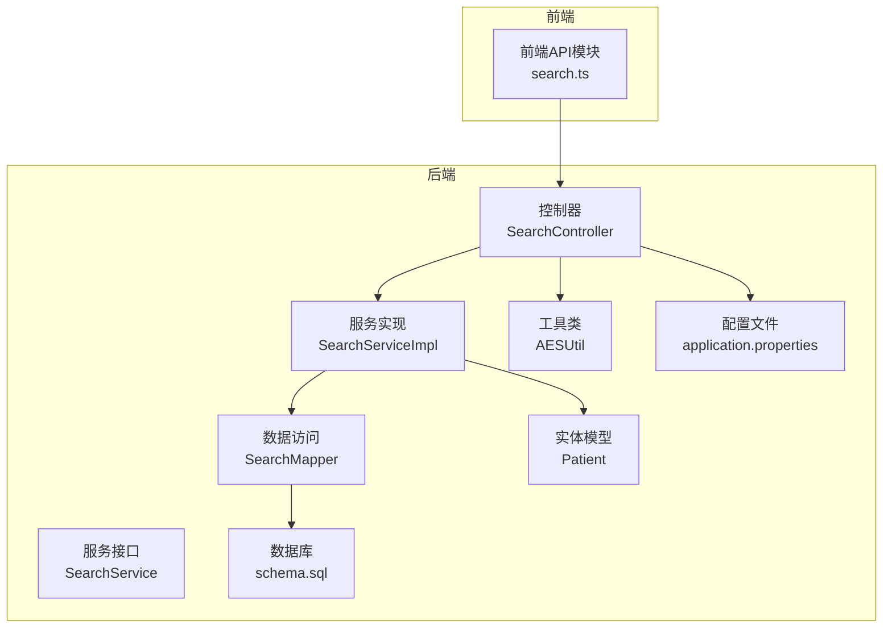
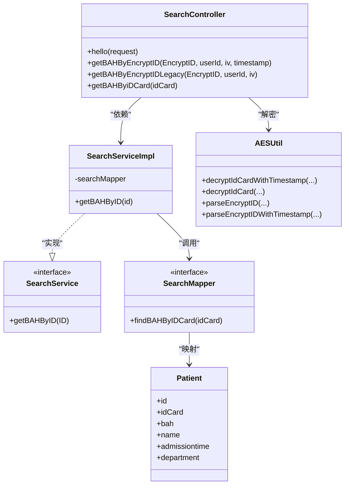

# 搜索查询API


**本文引用的文件**
- [SearchController.java](file://backend-repo/src/main/java/com/zjcxph/imgapi/controller/SearchController.java)
- [SearchService.java](file://backend-repo/src/main/java/com/zjcxph/imgapi/service/SearchService.java)
- [SearchServiceImpl.java](file://backend-repo/src/main/java/com/zjcxph/imgapi/service/impl/SearchServiceImpl.java)
- [SearchMapper.java](file://backend-repo/src/main/java/com/zjcxph/imgapi/mapper/SearchMapper.java)
- [Patient.java](file://backend-repo/src/main/java/com/zjcxph/imgapi/entity/Patient.java)
- [AESUtil.java](file://backend-repo/src/main/java/com/zjcxph/imgapi/utils/AESUtil.java)
- [application.properties](file://backend-repo/src/main/resources/application.properties)
- [schema.sql](file://mrr-db/schema.sql)
- [API_CONTRACT.md](file://backend-repo/API_CONTRACT.md)
- [search.ts](file://frontend-fantastic-admin/src/api/modules/search.ts)
- [SearchControllerTest.java](file://backend-repo/src/test/java/com/zjcxph/imgapi/SearchControllerTest.java)


## 目录
1. [简介](#简介)
2. [项目结构](#项目结构)
3. [核心组件](#核心组件)
4. [架构总览](#架构总览)
5. [详细组件分析](#详细组件分析)
6. [依赖关系分析](#依赖关系分析)
7. [性能考虑](#性能考虑)
8. [故障排查指南](#故障排查指南)
9. [结论](#结论)
10. [附录](#附录)

## 简介
本文件为 MRR 患者搜索查询 API 的权威技术文档，覆盖基于“身份证号”和“加密ID”的两种查询路径，明确默认流程与兼容性处理策略；详述搜索算法、数据匹配规则与结果排序机制；提供请求参数、响应结构与分页处理说明；并给出性能优化、索引策略与缓存机制建议。同时，结合前端对接模块与数据库表结构，帮助开发者快速集成与扩展。

## 项目结构
后端采用 Spring Boot 分层架构：控制器层负责对外暴露 REST 接口；服务层封装业务逻辑；持久层通过 MyBatis Mapper 访问数据库；实体模型映射数据库表字段；工具类提供对称加密解密能力；配置文件定义数据源与运行参数；契约文件定义前后端路由映射与默认流程。



**图表来源**
- [SearchController.java:1-92](file://backend-repo/src/main/java/com/zjcxph/imgapi/controller/SearchController.java#L1-L92)
- [SearchServiceImpl.java:1-26](file://backend-repo/src/main/java/com/zjcxph/imgapi/service/impl/SearchServiceImpl.java#L1-L26)
- [SearchMapper.java:1-16](file://backend-repo/src/main/java/com/zjcxph/imgapi/mapper/SearchMapper.java#L1-L16)
- [Patient.java:1-103](file://backend-repo/src/main/java/com/zjcxph/imgapi/entity/Patient.java#L1-L103)
- [AESUtil.java:1-233](file://backend-repo/src/main/java/com/zjcxph/imgapi/utils/AESUtil.java#L1-L233)
- [application.properties:1-49](file://backend-repo/src/main/resources/application.properties#L1-L49)
- [schema.sql:1-95](file://mrr-db/schema.sql#L1-L95)

**章节来源**
- [SearchController.java:1-92](file://backend-repo/src/main/java/com/zjcxph/imgapi/controller/SearchController.java#L1-L92)
- [API_CONTRACT.md:24-44](file://backend-repo/API_CONTRACT.md#L24-L44)

## 核心组件
- 控制器层：提供三个对外接口，分别对应默认明文身份证号查询、带时间戳的新版加密ID查询与旧版兼容查询。
- 服务层：定义统一的查询契约，实现类委托 Mapper 完成数据库查询。
- 数据访问层：MyBatis Mapper 使用原生 SQL 查询患者信息。
- 实体模型：Patient 映射数据库字段，包含主键、身份证号、病案号、姓名、入院时间与科室等。
- 工具类：AESUtil 提供基于用户ID、时间戳与密钥派生的对称解密能力，兼容新旧两种加密格式。
- 配置与数据库：application.properties 提供数据源与密钥配置；schema.sql 定义表结构与索引。

**章节来源**
- [SearchService.java:1-11](file://backend-repo/src/main/java/com/zjcxph/imgapi/service/SearchService.java#L1-L11)
- [SearchServiceImpl.java:11-26](file://backend-repo/src/main/java/com/zjcxph/imgapi/service/impl/SearchServiceImpl.java#L11-L26)
- [SearchMapper.java:9-16](file://backend-repo/src/main/java/com/zjcxph/imgapi/mapper/SearchMapper.java#L9-L16)
- [Patient.java:6-19](file://backend-repo/src/main/java/com/zjcxph/imgapi/entity/Patient.java#L6-L19)
- [AESUtil.java:19-162](file://backend-repo/src/main/java/com/zjcxph/imgapi/utils/AESUtil.java#L19-L162)
- [application.properties:47-49](file://backend-repo/src/main/resources/application.properties#L47-L49)
- [schema.sql:16-24](file://mrr-db/schema.sql#L16-L24)

## 架构总览
以下序列图展示默认流程与兼容性处理的关键调用链：

```mermaid
sequenceDiagram
participant FE as "前端"
participant CTRL as "SearchController"
participant UTIL as "AESUtil"
participant SVC as "SearchServiceImpl"
participant MAP as "SearchMapper"
participant DB as "数据库"
Note over FE,CTRL : 默认流程：明文身份证号查询
FE->>CTRL : GET /v2/search/getBAHByID/{idCard}
CTRL->>SVC : getBAHByID(idCard)
SVC->>MAP : findBAHByIDCard(idCard)
MAP->>DB : SELECT ... FROM mr_patient WHERE idcard = ?
DB-->>MAP : List&lt;Patient&gt;
MAP-->>SVC : List&lt;Patient&gt;
SVC-->>CTRL : List&lt;Patient&gt;
CTRL-->>FE : Result{code, msg, data}
Note over FE,CTRL : 兼容性流程：新版加密ID(含时间戳)
FE->>CTRL : GET /v2/search/getBAHByEncryptID?EncryptID&userId&iv&timestamp
CTRL->>UTIL : decryptIdCardWithTimestamp(...)
UTIL-->>CTRL : idCard
CTRL->>SVC : getBAHByID(idCard)
SVC->>MAP : findBAHByIDCard(idCard)
MAP->>DB : SELECT ... FROM mr_patient WHERE idcard = ?
DB-->>MAP : List&lt;Patient&gt;
MAP-->>SVC : List&lt;Patient&gt;
SVC-->>CTRL : List&lt;Patient&gt;
CTRL-->>FE : Result{code, msg, data}
```

**图表来源**
- [SearchController.java:39-79](file://backend-repo/src/main/java/com/zjcxph/imgapi/controller/SearchController.java#L39-L79)
- [AESUtil.java:121-162](file://backend-repo/src/main/java/com/zjcxph/imgapi/utils/AESUtil.java#L121-L162)
- [SearchServiceImpl.java:21-24](file://backend-repo/src/main/java/com/zjcxph/imgapi/service/impl/SearchServiceImpl.java#L21-L24)
- [SearchMapper.java:14-15](file://backend-repo/src/main/java/com/zjcxph/imgapi/mapper/SearchMapper.java#L14-L15)

## 详细组件分析

### 控制器层：SearchController
- 接口设计
  - 默认流程：GET /v2/search/getBAHByID/{idCard}
  - 新版兼容：GET /v2/search/getBAHByEncryptID（EncryptID、userId、iv、timestamp）
  - 旧版兼容：GET /v2/search/getBAHByEncryptIDLegacy（EncryptID、userId、iv）
- 参数与行为
  - 明文查询：路径参数 idCard 直接传入服务层。
  - 加密查询：请求参数 EncryptID、userId、iv、timestamp（可选）先经 AESUtil 解密得到 idCard，再执行查询。
  - 返回：Result 包裹状态码、消息与数据列表。
- 错误处理：捕获解密异常并返回错误状态与具体信息。
- 日志记录：记录解密与查询过程，便于审计与排障。

**章节来源**
- [SearchController.java:34-91](file://backend-repo/src/main/java/com/zjcxph/imgapi/controller/SearchController.java#L34-L91)
- [API_CONTRACT.md:26-28](file://backend-repo/API_CONTRACT.md#L26-L28)

### 服务层：SearchService 与 SearchServiceImpl
- SearchService：声明 getBAHByID(String) 查询契约。
- SearchServiceImpl：注入 SearchMapper，直接委派执行 SQL 查询。

**章节来源**
- [SearchService.java:7-10](file://backend-repo/src/main/java/com/zjcxph/imgapi/service/SearchService.java#L7-L10)
- [SearchServiceImpl.java:11-26](file://backend-repo/src/main/java/com/zjcxph/imgapi/service/impl/SearchServiceImpl.java#L11-L26)

### 数据访问层：SearchMapper
- SQL 查询：根据 idcard 精确匹配，返回包含 id、idcard、bah、name、admissiontime、department 的集合。
- 结果映射：由 MyBatis 自动映射到 Patient 实体。

**章节来源**
- [SearchMapper.java:10-16](file://backend-repo/src/main/java/com/zjcxph/imgapi/mapper/SearchMapper.java#L10-L16)

### 实体模型：Patient
- 字段：id、idCard、bah、name、admissiontime、department。
- 用途：承载查询结果，作为 API 响应对象的一部分。

**章节来源**
- [Patient.java:6-19](file://backend-repo/src/main/java/com/zjcxph/imgapi/entity/Patient.java#L6-L19)

### 工具类：AESUtil
- 新版解密：decryptIdCardWithTimestamp(ciphertext, iv, userId, timestamp, key)
  - 基于 userId + "_" + timestamp + "_" + key 派生用户特定密钥，进行 AES/CBC/PKCS5Padding 解密。
- 旧版解密：decryptIdCard(ciphertext, iv, userId, key)
  - 基于 userId + "_" + key 派生用户特定密钥，进行相同解密流程。
- 参数解析：parseEncryptID 与 parseEncryptIDWithTimestamp 支持 ciphertext_iv 与 JSON 格式解析。
- 异常处理：统一抛出运行时异常并记录日志。

**章节来源**
- [AESUtil.java:19-162](file://backend-repo/src/main/java/com/zjcxph/imgapi/utils/AESUtil.java#L19-L162)

### 前端对接：search.ts
- getBAHByIdCard(idCard)：调用默认明文查询接口。
- getBAHByEncryptID(params)：调用新版加密ID查询接口，参数来自 EncryptIDSearchParams 类型。

**章节来源**
- [search.ts:4-12](file://frontend-fantastic-admin/src/api/modules/search.ts#L4-L12)

## 依赖关系分析



**图表来源**
- [SearchController.java:19-91](file://backend-repo/src/main/java/com/zjcxph/imgapi/controller/SearchController.java#L19-L91)
- [SearchService.java:7-10](file://backend-repo/src/main/java/com/zjcxph/imgapi/service/SearchService.java#L7-L10)
- [SearchServiceImpl.java:11-26](file://backend-repo/src/main/java/com/zjcxph/imgapi/service/impl/SearchServiceImpl.java#L11-L26)
- [SearchMapper.java:9-16](file://backend-repo/src/main/java/com/zjcxph/imgapi/mapper/SearchMapper.java#L9-L16)
- [Patient.java:6-19](file://backend-repo/src/main/java/com/zjcxph/imgapi/entity/Patient.java#L6-L19)
- [AESUtil.java:19-162](file://backend-repo/src/main/java/com/zjcxph/imgapi/utils/AESUtil.java#L19-L162)

**章节来源**
- [SearchController.java:19-91](file://backend-repo/src/main/java/com/zjcxph/imgapi/controller/SearchController.java#L19-L91)
- [SearchServiceImpl.java:11-26](file://backend-repo/src/main/java/com/zjcxph/imgapi/service/impl/SearchServiceImpl.java#L11-L26)
- [SearchMapper.java:9-16](file://backend-repo/src/main/java/com/zjcxph/imgapi/mapper/SearchMapper.java#L9-L16)
- [Patient.java:6-19](file://backend-repo/src/main/java/com/zjcxph/imgapi/entity/Patient.java#L6-L19)
- [AESUtil.java:19-162](file://backend-repo/src/main/java/com/zjcxph/imgapi/utils/AESUtil.java#L19-L162)

## 性能考虑

### 查询算法与匹配规则
- 精确匹配：SQL 使用 idcard = ? 进行等值匹配，复杂度 O(1)（若存在索引）。
- 结果集：返回所有匹配的患者记录，未内置排序字段，按数据库顺序返回。

**章节来源**
- [SearchMapper.java:14-15](file://backend-repo/src/main/java/com/zjcxph/imgapi/mapper/SearchMapper.java#L14-L15)

### 索引策略
- 建议在 mr_patient.idcard 上建立唯一索引以提升查询性能与去重能力。
- 若存在高频组合查询（如 idcard + admissiontime），可考虑复合索引。

**章节来源**
- [schema.sql:16-24](file://mrr-db/schema.sql#L16-L24)

### 缓存机制
- 应用层缓存：对热点身份证号的查询结果进行短期缓存，降低数据库压力。
- 前端缓存：浏览器与代理层可利用 HTTP 缓存头减少重复请求。
- 建议：结合 Redis 或本地缓存框架，设置合理的 TTL 与失效策略。

### 分页处理
- 当前实现未提供分页参数与分页返回结构，建议在现有接口基础上扩展 page、size 参数，并返回 total 与分页元信息。

**章节来源**
- [API_CONTRACT.md:26-28](file://backend-repo/API_CONTRACT.md#L26-L28)

### 模糊查询与搜索增强
- 当前仅支持精确匹配；如需模糊查询或全文检索，可在数据库侧引入 LIKE 或全文索引，或在应用层引入搜索引擎（如 Elasticsearch/MiniSearch）。
- 建议：保留现有精确查询接口不变，新增模糊/智能搜索接口，避免破坏兼容性。

## 故障排查指南

### 常见问题与定位
- 解密失败
  - 现象：返回解密失败错误。
  - 排查：确认 EncryptID 格式、iv 与密钥长度；检查时间戳是否过期；核对 userId 是否正确。
- 查询无结果
  - 现象：返回空列表。
  - 排查：确认 idcard 是否正确；检查数据库是否存在该记录；确认 schema 初始化是否成功。
- 参数缺失
  - 现象：参数校验失败。
  - 排查：确保必填参数齐全；核对前端传参与契约一致。

**章节来源**
- [SearchController.java:45-54](file://backend-repo/src/main/java/com/zjcxph/imgapi/controller/SearchController.java#L45-L54)
- [AESUtil.java:95-98](file://backend-repo/src/main/java/com/zjcxph/imgapi/utils/AESUtil.java#L95-L98)

### 单元测试参考
- 测试用例覆盖了 IP 获取逻辑与基本接口返回，可作为集成测试的参考模板。

**章节来源**
- [SearchControllerTest.java:33-82](file://backend-repo/src/test/java/com/zjcxph/imgapi/SearchControllerTest.java#L33-L82)

## 结论
本搜索查询 API 提供了清晰的默认流程与完善的兼容性处理，支持明文与加密两种输入方式。当前实现以精确匹配为主，具备良好的扩展空间：可在不破坏现有接口的前提下引入索引、缓存、分页与模糊/智能搜索能力，从而满足更高性能与更丰富的搜索体验需求。

## 附录

### API 定义与参数说明

- 默认流程：GET /v2/search/getBAHByID/{idCard}
  - 路径参数
    - idCard：字符串，身份证号
  - 响应
    - Result 对象，包含 code、msg、data（`List<Patient>`）

- 新版加密ID：GET /v2/search/getBAHByEncryptID
  - 查询参数
    - EncryptID：字符串，加密的身份证号（JSON 格式或 ciphertext_iv）
    - userId：字符串，用户标识
    - iv：字符串，初始化向量（十六进制）
    - timestamp：字符串，时间戳（用于新版本密钥派生）
  - 响应
    - Result 对象，包含 code、msg、data（`List<Patient>`）

- 旧版兼容：GET /v2/search/getBAHByEncryptIDLegacy
  - 查询参数
    - EncryptID：字符串，加密的身份证号（ciphertext_iv）
    - userId：字符串，用户标识
    - iv：字符串，初始化向量（十六进制）
  - 响应
    - Result 对象，包含 code、msg、data（`List<Patient>`）

- 前端调用
  - getBAHByIdCard(idCard)：调用默认流程
  - getBAHByEncryptID(params)：调用新版加密ID流程

**章节来源**
- [API_CONTRACT.md:26-28](file://backend-repo/API_CONTRACT.md#L26-L28)
- [search.ts:4-12](file://frontend-fantastic-admin/src/api/modules/search.ts#L4-L12)

### 响应数据结构
- Result
  - code：整数，状态码
  - msg：字符串，消息
  - data：对象或数组，实际数据
- `List<Patient>`
  - id：整数，主键
  - idCard：字符串，身份证号
  - bah：字符串，病案号
  - name：字符串，姓名
  - admissiontime：字符串，入院时间
  - department：字符串，住院科室

**章节来源**
- [Patient.java:6-19](file://backend-repo/src/main/java/com/zjcxph/imgapi/entity/Patient.java#L6-L19)

### 数据库表结构
- mr_patient
  - 字段：id、idcard、BAH、admissiontime、department、name
  - 建议：为 idcard 建立唯一索引

**章节来源**
- [schema.sql:16-24](file://mrr-db/schema.sql#L16-L24)

### 配置项
- aes.secret.key：AES 秘钥（生产环境必须覆盖）
- spring.datasource.*：数据库连接池配置
- logging.level.*：日志级别配置

**章节来源**
- [application.properties:47-49](file://backend-repo/src/main/resources/application.properties#L47-L49)
- [application.properties:10-22](file://backend-repo/src/main/resources/application.properties#L10-L22)
- [application.properties:24-28](file://backend-repo/src/main/resources/application.properties#L24-L28)