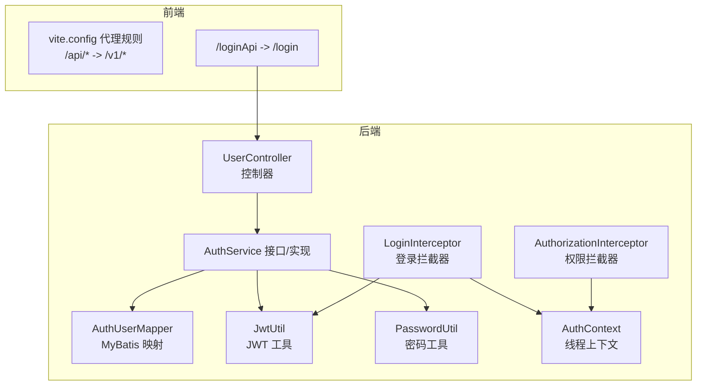
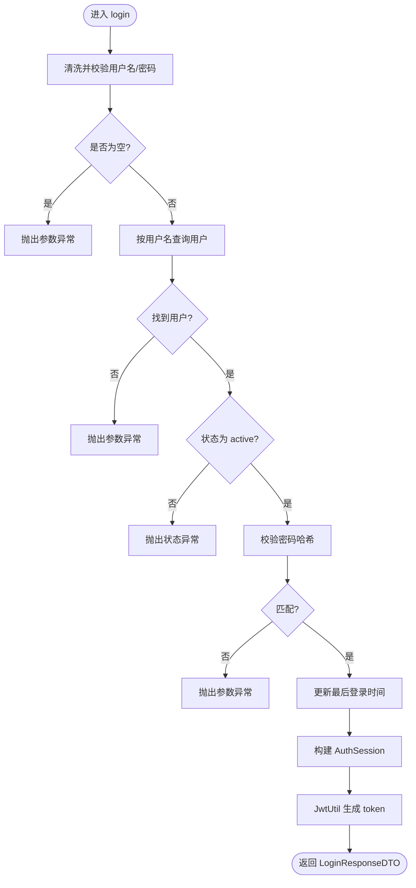
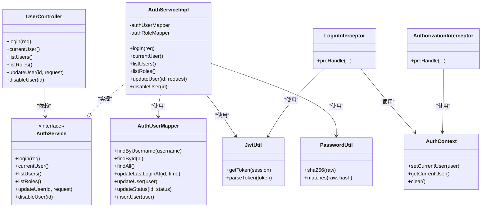

# 认证授权API


**本文引用的文件**
- [UserController.java](file://backend-repo/src/main/java/com/zjcxph/imgapi/controller/UserController.java)
- [AuthService.java](file://backend-repo/src/main/java/com/zjcxph/imgapi/service/AuthService.java)
- [AuthServiceImpl.java](file://backend-repo/src/main/java/com/zjcxph/imgapi/service/impl/AuthServiceImpl.java)
- [LoginResponseDTO.java](file://backend-repo/src/main/java/com/zjcxph/imgapi/dto/resp/LoginResponseDTO.java)
- [UserRequest.java](file://backend-repo/src/main/java/com/zjcxph/imgapi/dto/req/UserRequest.java)
- [AuthUserProfileDTO.java](file://backend-repo/src/main/java/com/zjcxph/imgapi/dto/resp/AuthUserProfileDTO.java)
- [JwtUtil.java](file://backend-repo/src/main/java/com/zjcxph/imgapi/utils/JwtUtil.java)
- [AuthorizationInterceptor.java](file://backend-repo/src/main/java/com/zjcxph/imgapi/interceptors/AuthorizationInterceptor.java)
- [LoginInterceptor.java](file://backend-repo/src/main/java/com/zjcxph/imgapi/interceptors/LoginInterceptor.java)
- [AuthContext.java](file://backend-repo/src/main/java/com/zjcxph/imgapi/utils/AuthContext.java)
- [PasswordUtil.java](file://backend-repo/src/main/java/com/zjcxph/imgapi/utils/PasswordUtil.java)
- [RequirePermissions.java](file://backend-repo/src/main/java/com/zjcxph/imgapi/annotation/RequirePermissions.java)
- [AuthUserMapper.java](file://backend-repo/src/main/java/com/zjcxph/imgapi/mapper/AuthUserMapper.java)
- [API_CONTRACT.md](file://backend-repo/API_CONTRACT.md)
- [application.properties](file://backend-repo/src/main/resources/application.properties)


## 目录
1. [简介](#简介)
2. [项目结构](#项目结构)
3. [核心组件](#核心组件)
4. [架构总览](#架构总览)
5. [详细组件分析](#详细组件分析)
6. [依赖关系分析](#依赖关系分析)
7. [性能考量](#性能考量)
8. [故障排查指南](#故障排查指南)
9. [结论](#结论)
10. [附录](#附录)

## 简介
本文件为 MRR 项目的认证授权 API 详细文档，覆盖登录接口、用户信息获取、用户与角色列表查询、用户更新与禁用、权限校验与拦截机制、JWT 令牌生成与解析、会话管理与过期处理、以及安全最佳实践。文档同时提供请求与响应示例、错误码说明与常见问题排查建议。

## 项目结构
认证授权相关代码主要位于后端 Java 工程中，采用 Spring MVC 控制器层、服务层、数据访问层（MyBatis Mapper）与工具类分层组织；前端通过代理规则将请求映射到后端路径。



图表来源
- [UserController.java:38-94](file://backend-repo/src/main/java/com/zjcxph/imgapi/controller/UserController.java#L38-L94)
- [AuthService.java:12-24](file://backend-repo/src/main/java/com/zjcxph/imgapi/service/AuthService.java#L12-L24)
- [AuthServiceImpl.java:36-62](file://backend-repo/src/main/java/com/zjcxph/imgapi/service/impl/AuthServiceImpl.java#L36-L62)
- [AuthUserMapper.java:14-77](file://backend-repo/src/main/java/com/zjcxph/imgapi/mapper/AuthUserMapper.java#L14-L77)
- [JwtUtil.java:28-76](file://backend-repo/src/main/java/com/zjcxph/imgapi/utils/JwtUtil.java#L28-L76)
- [PasswordUtil.java:10-22](file://backend-repo/src/main/java/com/zjcxph/imgapi/utils/PasswordUtil.java#L10-L22)
- [LoginInterceptor.java:30-52](file://backend-repo/src/main/java/com/zjcxph/imgapi/interceptors/LoginInterceptor.java#L30-L52)
- [AuthorizationInterceptor.java:22-56](file://backend-repo/src/main/java/com/zjcxph/imgapi/interceptors/AuthorizationInterceptor.java#L22-L56)
- [AuthContext.java:12-26](file://backend-repo/src/main/java/com/zjcxph/imgapi/utils/AuthContext.java#L12-L26)
- [API_CONTRACT.md:7-16](file://backend-repo/API_CONTRACT.md#L7-L16)

章节来源
- [API_CONTRACT.md:7-16](file://backend-repo/API_CONTRACT.md#L7-L16)
- [application.properties:1-49](file://backend-repo/src/main/resources/application.properties#L1-L49)

## 核心组件
- 登录接口：接收用户名与密码，校验后签发 JWT，并返回用户会话信息。
- 用户信息接口：返回当前已登录用户的会话信息。
- 权限管理接口：支持列出用户、角色；更新用户资料（显示名、角色、状态）；禁用用户。
- 拦截器链：登录拦截器负责提取并校验 Bearer Token，权限拦截器负责基于注解的权限判定。
- 工具类：JWT 工具用于生成与解析令牌；密码工具用于哈希比对；线程上下文用于在请求生命周期内传递会话。

章节来源
- [UserController.java:38-94](file://backend-repo/src/main/java/com/zjcxph/imgapi/controller/UserController.java#L38-L94)
- [AuthService.java:12-24](file://backend-repo/src/main/java/com/zjcxph/imgapi/service/AuthService.java#L12-L24)
- [AuthServiceImpl.java:36-105](file://backend-repo/src/main/java/com/zjcxph/imgapi/service/impl/AuthServiceImpl.java#L36-L105)
- [JwtUtil.java:28-76](file://backend-repo/src/main/java/com/zjcxph/imgapi/utils/JwtUtil.java#L28-L76)
- [AuthorizationInterceptor.java:22-56](file://backend-repo/src/main/java/com/zjcxph/imgapi/interceptors/AuthorizationInterceptor.java#L22-L56)
- [LoginInterceptor.java:30-52](file://backend-repo/src/main/java/com/zjcxph/imgapi/interceptors/LoginInterceptor.java#L30-L52)

## 架构总览
认证授权的整体流程如下：

```mermaid
sequenceDiagram
participant FE as "前端应用"
participant GW as "网关/代理"
participant CTRL as "UserController"
participant SVC as "AuthServiceImpl"
participant MAP as "AuthUserMapper"
participant JWT as "JwtUtil"
participant INT1 as "LoginInterceptor"
participant INT2 as "AuthorizationInterceptor"
FE->>GW : "POST /loginApi"
GW->>CTRL : "POST /login"
CTRL->>SVC : "login(UserRequest)"
SVC->>MAP : "findByUsername(username)"
MAP-->>SVC : "AuthUser"
SVC->>SVC : "PasswordUtil.matches(password, hash)"
SVC->>MAP : "updateLastLoginAt(userId, now)"
SVC->>JWT : "getToken(AuthSession)"
JWT-->>SVC : "token"
SVC-->>CTRL : "LoginResponseDTO{token,user}"
CTRL-->>FE : "Result&lt;LoginResponseDTO&gt;"
FE->>GW : "GET /api/v1/auth/me"
GW->>INT1 : "拦截并解析 Authorization : Bearer"
INT1->>JWT : "parseToken(token)"
JWT-->>INT1 : "AuthSession"
INT1->>INT2 : "注入会话并放行"
INT2->>CTRL : "currentUser()"
CTRL-->>FE : "Result&lt;AuthSession&gt;"
```

图表来源
- [UserController.java:38-57](file://backend-repo/src/main/java/com/zjcxph/imgapi/controller/UserController.java#L38-L57)
- [AuthServiceImpl.java:36-62](file://backend-repo/src/main/java/com/zjcxph/imgapi/service/impl/AuthServiceImpl.java#L36-L62)
- [AuthUserMapper.java:16-29](file://backend-repo/src/main/java/com/zjcxph/imgapi/mapper/AuthUserMapper.java#L16-L29)
- [JwtUtil.java:28-76](file://backend-repo/src/main/java/com/zjcxph/imgapi/utils/JwtUtil.java#L28-L76)
- [LoginInterceptor.java:30-52](file://backend-repo/src/main/java/com/zjcxph/imgapi/interceptors/LoginInterceptor.java#L30-L52)
- [AuthorizationInterceptor.java:22-56](file://backend-repo/src/main/java/com/zjcxph/imgapi/interceptors/AuthorizationInterceptor.java#L22-L56)

## 详细组件分析

### 登录接口
- 方法与路径
  - POST /login
- 请求体
  - 字段：username（必填）、password（必填）
- 成功响应
  - 结构：`Result<LoginResponseDTO>`
  - LoginResponseDTO 包含：token（字符串）、user（AuthSession）
- 失败响应
  - 返回 Result.fail，消息包含“用户名或密码错误”、“账号已被禁用，请联系管理员”等



图表来源
- [UserController.java:38-47](file://backend-repo/src/main/java/com/zjcxph/imgapi/controller/UserController.java#L38-L47)
- [AuthServiceImpl.java:36-62](file://backend-repo/src/main/java/com/zjcxph/imgapi/service/impl/AuthServiceImpl.java#L36-L62)
- [AuthUserMapper.java:16-29](file://backend-repo/src/main/java/com/zjcxph/imgapi/mapper/AuthUserMapper.java#L16-L29)
- [PasswordUtil.java:17-22](file://backend-repo/src/main/java/com/zjcxph/imgapi/utils/PasswordUtil.java#L17-L22)
- [JwtUtil.java:28-59](file://backend-repo/src/main/java/com/zjcxph/imgapi/utils/JwtUtil.java#L28-L59)

章节来源
- [UserController.java:38-47](file://backend-repo/src/main/java/com/zjcxph/imgapi/controller/UserController.java#L38-L47)
- [UserRequest.java:8-30](file://backend-repo/src/main/java/com/zjcxph/imgapi/dto/req/UserRequest.java#L8-L30)
- [LoginResponseDTO.java:6-33](file://backend-repo/src/main/java/com/zjcxph/imgapi/dto/resp/LoginResponseDTO.java#L6-L33)
- [API_CONTRACT.md:13-15](file://backend-repo/API_CONTRACT.md#L13-L15)

### 用户信息获取接口
- 方法与路径
  - GET /v1/auth/me
- 成功响应
  - 返回当前会话 AuthSession；若无会话则返回失败
- 会话来源
  - 由 LoginInterceptor 解析 Authorization: Bearer 并写入线程上下文

章节来源
- [UserController.java:49-57](file://backend-repo/src/main/java/com/zjcxph/imgapi/controller/UserController.java#L49-L57)
- [LoginInterceptor.java:41-45](file://backend-repo/src/main/java/com/zjcxph/imgapi/interceptors/LoginInterceptor.java#L41-L45)
- [AuthContext.java:20-22](file://backend-repo/src/main/java/com/zjcxph/imgapi/utils/AuthContext.java#L20-L22)

### 权限管理接口
- 列出用户
  - 方法与路径：GET /v1/auth/users
  - 需要权限：user:manage
- 列出角色
  - 方法与路径：GET /v1/auth/roles
  - 需要权限：role:read
- 更新用户
  - 方法与路径：PUT /v1/auth/users/{id}
  - 需要权限：user:manage
  - 请求体：AuthUserUpdateRequest（包含显示名、角色编码、状态）
- 禁用用户
  - 方法与路径：DELETE /v1/auth/users/{id}
  - 需要权限：user:manage

章节来源
- [UserController.java:59-93](file://backend-repo/src/main/java/com/zjcxph/imgapi/controller/UserController.java#L59-L93)
- [RequirePermissions.java:8-12](file://backend-repo/src/main/java/com/zjcxph/imgapi/annotation/RequirePermissions.java#L8-L12)

### JWT 令牌生成与解析
- 生成
  - 使用 JwtUtil.getToken(AuthSession) 生成 token，有效期 24 小时
  - Claims 包括：id、username、displayName、roleCode、roleName、status、permissions（数组）
- 解析
  - 使用 JwtUtil.parseToken(token) 校验并解析 token，恢复 AuthSession
- 密钥
  - 默认密钥可在运行时通过环境变量覆盖

章节来源
- [JwtUtil.java:14-17](file://backend-repo/src/main/java/com/zjcxph/imgapi/utils/JwtUtil.java#L14-L17)
- [JwtUtil.java:28-76](file://backend-repo/src/main/java/com/zjcxph/imgapi/utils/JwtUtil.java#L28-L76)

### 认证与权限拦截机制
- 登录拦截器
  - 提取 Authorization 头中的 Bearer Token
  - 解析失败或缺失 token 时返回 401
  - 成功解析后将 AuthSession 写入请求属性与线程上下文
- 权限拦截器
  - 读取 RequirePermissions 注解，判断会话权限集合是否包含所需权限
  - 管理员（ADMIN 角色或具备 user:manage/role:manage）拥有豁免权
  - 缺少权限返回 403

章节来源
- [LoginInterceptor.java:22-52](file://backend-repo/src/main/java/com/zjcxph/imgapi/interceptors/LoginInterceptor.java#L22-L52)
- [AuthorizationInterceptor.java:22-56](file://backend-repo/src/main/java/com/zjcxph/imgapi/interceptors/AuthorizationInterceptor.java#L22-L56)
- [RequirePermissions.java:8-12](file://backend-repo/src/main/java/com/zjcxph/imgapi/annotation/RequirePermissions.java#L8-L12)

### 数据模型与复杂度
- AuthSession
  - 字段：id、username、displayName、roleCode、roleName、permissions、status、lastLoginAt
  - 复杂度：构造与序列化均为 O(n)，n 为 permissions 数量
- AuthUserProfileDTO
  - 字段：id、username、displayName、roleCode、roleName、permissions、status、lastLoginAt
  - 复杂度：同上
- 权限拆分
  - splitPermissions 将逗号分隔字符串转为去重列表，复杂度 O(n)

章节来源
- [AuthSession.java:7-89](file://backend-repo/src/main/java/com/zjcxph/imgapi/common/AuthSession.java#L7-L89)
- [AuthUserProfileDTO.java:10-83](file://backend-repo/src/main/java/com/zjcxph/imgapi/dto/resp/AuthUserProfileDTO.java#L10-L83)
- [AuthServiceImpl.java:136-145](file://backend-repo/src/main/java/com/zjcxph/imgapi/service/impl/AuthServiceImpl.java#L136-L145)

## 依赖关系分析
- 控制器依赖服务接口，服务实现依赖 Mapper、JWT 工具与密码工具
- 拦截器依赖 JWT 工具与线程上下文，权限注解用于标注受保护资源
- 前端通过代理规则将 /loginApi 映射到 /login，/api/* 映射到 /v1/*



图表来源
- [UserController.java:32-36](file://backend-repo/src/main/java/com/zjcxph/imgapi/controller/UserController.java#L32-L36)
- [AuthService.java:12-24](file://backend-repo/src/main/java/com/zjcxph/imgapi/service/AuthService.java#L12-L24)
- [AuthServiceImpl.java:25-34](file://backend-repo/src/main/java/com/zjcxph/imgapi/service/impl/AuthServiceImpl.java#L25-L34)
- [AuthUserMapper.java:14-77](file://backend-repo/src/main/java/com/zjcxph/imgapi/mapper/AuthUserMapper.java#L14-L77)
- [JwtUtil.java:12-76](file://backend-repo/src/main/java/com/zjcxph/imgapi/utils/JwtUtil.java#L12-L76)
- [PasswordUtil.java:5-23](file://backend-repo/src/main/java/com/zjcxph/imgapi/utils/PasswordUtil.java#L5-L23)
- [LoginInterceptor.java:16-68](file://backend-repo/src/main/java/com/zjcxph/imgapi/interceptors/LoginInterceptor.java#L16-L68)
- [AuthorizationInterceptor.java:17-77](file://backend-repo/src/main/java/com/zjcxph/imgapi/interceptors/AuthorizationInterceptor.java#L17-L77)
- [AuthContext.java:5-27](file://backend-repo/src/main/java/com/zjcxph/imgapi/utils/AuthContext.java#L5-L27)

## 性能考量
- 登录与权限校验均为内存操作，复杂度低；数据库访问集中在用户查询与更新最后登录时间
- 建议
  - 对频繁调用的 /v1/auth/me 可结合缓存策略减少重复解析与上下文写入开销
  - 对权限集合进行预处理与缓存，避免每次请求重复拆分字符串
  - 合理设置 JWT 过期时间与刷新策略，平衡安全性与用户体验

## 故障排查指南
- 401 未授权
  - 缺失 Authorization 头或非 Bearer 类型
  - Token 无效或签名不匹配
  - 会话不存在或已过期
- 403 禁止访问
  - 当前用户不具备所需权限
  - 非管理员且未满足 RequirePermissions 注解要求
- 典型错误场景
  - 用户名或密码为空：参数校验失败
  - 用户不存在或状态非 active：业务校验失败
  - 密码哈希不匹配：认证失败

章节来源
- [LoginInterceptor.java:59-67](file://backend-repo/src/main/java/com/zjcxph/imgapi/interceptors/LoginInterceptor.java#L59-L67)
- [AuthorizationInterceptor.java:58-68](file://backend-repo/src/main/java/com/zjcxph/imgapi/interceptors/AuthorizationInterceptor.java#L58-L68)
- [AuthServiceImpl.java:41-54](file://backend-repo/src/main/java/com/zjcxph/imgapi/service/impl/AuthServiceImpl.java#L41-L54)

## 结论
本认证授权体系以 Spring MVC 为基础，结合拦截器链实现统一的登录与权限控制；JWT 负责无状态会话承载，配合线程上下文在请求范围内传递用户信息。通过 RequirePermissions 注解与拦截器，可灵活地对资源进行细粒度权限控制。建议在生产环境中强化密钥管理、引入刷新令牌与速率限制等安全措施。

## 附录

### API 定义与示例

- 登录
  - 方法：POST
  - 路径：/login
  - 请求体字段：username、password
  - 成功响应：Result.success(LoginResponseDTO{token,user})
  - 失败响应：Result.fail(具体原因)
  - 示例请求
    - POST /login
    - Content-Type: application/json
    - Body: {"username":"`<用户名>`","password":"`<密码>`"}
  - 示例成功响应
    - {
      "code": 200,
      "message": "Login success",
      "data": {
        "token": "`<JWT>`",
        "user": {
          "id": 1,
          "username": "admin",
          "displayName": "管理员",
          "roleCode": "ADMIN",
          "roleName": "管理员",
          "permissions": ["user:manage","role:read"],
          "status": "active",
          "lastLoginAt": "2025-01-01T00:00:00"
        }
      }
    }
  - 示例失败响应
    - {
      "code": 400,
      "message": "Invalid username or password",
      "data": null
    }

- 获取当前用户
  - 方法：GET
  - 路径：/v1/auth/me
  - 请求头：Authorization: Bearer `<token>`
  - 成功响应：Result.success(AuthSession)
  - 失败响应：Result.fail("Not logged in or token expired")

- 列出用户
  - 方法：GET
  - 路径：/v1/auth/users
  - 需要权限：user:manage
  - 成功响应：Result.success(`List<AuthUserProfileDTO>`)

- 列出角色
  - 方法：GET
  - 路径：/v1/auth/roles
  - 需要权限：role:read
  - 成功响应：Result.success(`List<AuthRole>`)

- 更新用户
  - 方法：PUT
  - 路径：/v1/auth/users/{id}
  - 需要权限：user:manage
  - 请求体：AuthUserUpdateRequest（包含显示名、角色编码、状态）

- 禁用用户
  - 方法：DELETE
  - 路径：/v1/auth/users/{id}
  - 需要权限：user:manage
  - 成功响应：Result.success("Disable success")

章节来源
- [API_CONTRACT.md:13-15](file://backend-repo/API_CONTRACT.md#L13-L15)
- [UserController.java:38-93](file://backend-repo/src/main/java/com/zjcxph/imgapi/controller/UserController.java#L38-L93)
- [RequirePermissions.java:8-12](file://backend-repo/src/main/java/com/zjcxph/imgapi/annotation/RequirePermissions.java#L8-L12)

### 错误码说明
- 400：参数非法（用户名或密码为空、用户名或密码错误）
- 401：未授权（缺少 token、token 无效、未登录）
- 403：禁止访问（权限不足）
- 500：服务器内部错误（数据库异常、解析异常等）

章节来源
- [LoginInterceptor.java:59-67](file://backend-repo/src/main/java/com/zjcxph/imgapi/interceptors/LoginInterceptor.java#L59-L67)
- [AuthorizationInterceptor.java:58-68](file://backend-repo/src/main/java/com/zjcxph/imgapi/interceptors/AuthorizationInterceptor.java#L58-L68)
- [AuthServiceImpl.java:41-54](file://backend-repo/src/main/java/com/zjcxph/imgapi/service/impl/AuthServiceImpl.java#L41-L54)

### 安全最佳实践
- 密钥管理
  - 通过环境变量设置 JWT_SECRET_KEY，避免硬编码
- 传输安全
  - 强制 HTTPS，避免明文传输
- 令牌策略
  - 短有效期 + 刷新令牌机制（建议后续扩展）
- 日志与审计
  - 记录登录与权限事件，避免泄露敏感信息
- 速率限制
  - 对登录接口增加频率限制，降低暴力破解风险

章节来源
- [JwtUtil.java:14-17](file://backend-repo/src/main/java/com/zjcxph/imgapi/utils/JwtUtil.java#L14-L17)
- [application.properties:1-49](file://backend-repo/src/main/resources/application.properties#L1-L49)