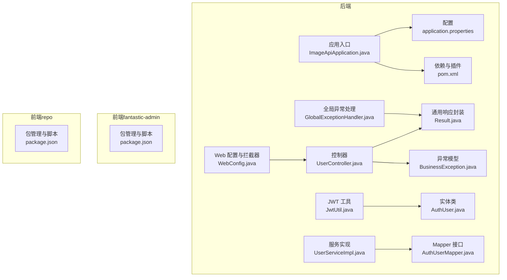
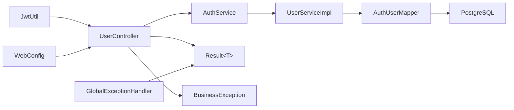

# 代码规范


**本文引用的文件**
- [ImageApiApplication.java](file://backend-repo/src/main/java/com/zjcxph/imgapi/ImageApiApplication.java)
- [application.properties](file://backend-repo/src/main/resources/application.properties)
- [pom.xml](file://backend-repo/pom.xml)
- [Result.java](file://backend-repo/src/main/java/com/zjcxph/imgapi/common/Result.java)
- [BusinessException.java](file://backend-repo/src/main/java/com/zjcxph/imgapi/exception/BusinessException.java)
- [GlobalExceptionHandler.java](file://backend-repo/src/main/java/com/zjcxph/imgapi/handler/GlobalExceptionHandler.java)
- [JwtUtil.java](file://backend-repo/src/main/java/com/zjcxph/imgapi/utils/JwtUtil.java)
- [WebConfig.java](file://backend-repo/src/main/java/com/zjcxph/imgapi/config/WebConfig.java)
- [AuthUser.java](file://backend-repo/src/main/java/com/zjcxph/imgapi/entity/AuthUser.java)
- [UserController.java](file://backend-repo/src/main/java/com/zjcxph/imgapi/controller/UserController.java)
- [UserServiceImpl.java](file://backend-repo/src/main/java/com/zjcxph/imgapi/service/impl/UserServiceImpl.java)
- [AuthUserMapper.java](file://backend-repo/src/main/java/com/zjcxph/imgapi/mapper/AuthUserMapper.java)
- [refactor_lombok.py](file://backend-repo/refactor_lombok.py)
- [package.json（fantastic-admin）](file://frontend-fantastic-admin/package.json)
- [package.json（repo）](file://frontend-repo/package.json)


## 目录
1. [引言](#引言)
2. [项目结构](#项目结构)
3. [核心组件](#核心组件)
4. [架构总览](#架构总览)
5. [详细组件分析](#详细组件分析)
6. [依赖分析](#依赖分析)
7. [性能考虑](#性能考虑)
8. [故障排查指南](#故障排查指南)
9. [结论](#结论)
10. [附录](#附录)

## 引言
本文件为 MRR 项目的代码规范文档，覆盖 Java 后端与 Vue 前端两部分。内容包括：
- Java 后端：命名约定、类结构、注释规范、最佳实践；Lombok 使用规范；JWT 认证实现；MyBatis 映射规则；Spring Boot 配置规范；异常处理模式；日志记录标准；代码格式化与静态检查工具配置、IDE 设置建议。
- Vue 前端：组件命名、样式组织、状态管理规范；构建与质量工具链。

本规范旨在统一团队开发风格，提升可读性、可维护性与协作效率，并为不同经验水平的开发者提供清晰的参考与示例路径。

## 项目结构
后端采用 Spring Boot + MyBatis 的分层架构，前端提供两个仓库（fantastic-admin 与 repo），分别服务于不同场景或阶段。整体目录要点如下：
- 后端 backend-repo：应用入口、配置、拦截器、控制器、服务、数据访问层、工具类、异常与全局处理器等。
- 前端 fantastic-admin：基于 Vue 3 的现代化管理界面，包含 API 模块、路由守卫、状态管理、UI 组件库等。
- 前端 repo：文档与演示站点，包含 ESLint、Prettier、Vitest 等质量工具配置。



图表来源
- [ImageApiApplication.java:1-20](file://backend-repo/src/main/java/com/zjcxph/imgapi/ImageApiApplication.java#L1-L20)
- [application.properties:1-49](file://backend-repo/src/main/resources/application.properties#L1-L49)
- [pom.xml:1-136](file://backend-repo/pom.xml#L1-L136)
- [Result.java:1-77](file://backend-repo/src/main/java/com/zjcxph/imgapi/common/Result.java#L1-L77)
- [BusinessException.java:1-20](file://backend-repo/src/main/java/com/zjcxph/imgapi/exception/BusinessException.java#L1-L20)
- [GlobalExceptionHandler.java:1-62](file://backend-repo/src/main/java/com/zjcxph/imgapi/handler/GlobalExceptionHandler.java#L1-L62)
- [JwtUtil.java:1-77](file://backend-repo/src/main/java/com/zjcxph/imgapi/utils/JwtUtil.java#L1-L77)
- [WebConfig.java:1-61](file://backend-repo/src/main/java/com/zjcxph/imgapi/config/WebConfig.java#L1-L61)
- [AuthUser.java:1-134](file://backend-repo/src/main/java/com/zjcxph/imgapi/entity/AuthUser.java#L1-L134)
- [UserController.java:1-95](file://backend-repo/src/main/java/com/zjcxph/imgapi/controller/UserController.java#L1-L95)
- [UserServiceImpl.java:1-25](file://backend-repo/src/main/java/com/zjcxph/imgapi/service/impl/UserServiceImpl.java#L1-L25)
- [AuthUserMapper.java:1-78](file://backend-repo/src/main/java/com/zjcxph/imgapi/mapper/AuthUserMapper.java#L1-L78)
- [package.json（fantastic-admin）:1-131](file://frontend-fantastic-admin/package.json#L1-L131)
- [package.json（repo）:1-63](file://frontend-repo/package.json#L1-L63)

章节来源
- [ImageApiApplication.java:1-20](file://backend-repo/src/main/java/com/zjcxph/imgapi/ImageApiApplication.java#L1-L20)
- [application.properties:1-49](file://backend-repo/src/main/resources/application.properties#L1-L49)
- [pom.xml:1-136](file://backend-repo/pom.xml#L1-L136)
- [package.json（fantastic-admin）:1-131](file://frontend-fantastic-admin/package.json#L1-L131)
- [package.json（repo）:1-63](file://frontend-repo/package.json#L1-L63)

## 核心组件
本节对后端关键组件进行规范说明，便于快速定位与遵循。

- 应用入口与扫描
  - 入口类启用调度、配置属性扫描与 Mapper 扫描，确保模块按需加载。
  - 参考路径：[ImageApiApplication.java:1-20](file://backend-repo/src/main/java/com/zjcxph/imgapi/ImageApiApplication.java#L1-L20)

- 配置与环境变量
  - 运行端口、压缩、静态资源缓存策略、数据库连接池参数、SQL 初始化策略、日志级别与文件名、图像源凭据、清理任务开关与计划、AES 密钥等均通过 application.properties 管理。
  - 参考路径：[application.properties:1-49](file://backend-repo/src/main/resources/application.properties#L1-L49)

- 依赖与构建
  - 使用 Spring Boot 21、MyBatis Starter、JWT、OpenAPI/Swagger、Actuator、Resilience4j 限流、iText PDF、Lombok 等。
  - 构建插件包含编译与打包，支持重新打包。
  - 参考路径：[pom.xml:1-136](file://backend-repo/pom.xml#L1-L136)

- 统一响应封装
  - `Result<T>` 提供成功/失败构造、时间戳、分页总数字段与链式设置方法，控制器统一返回该类型。
  - 参考路径：[Result.java:1-77](file://backend-repo/src/main/java/com/zjcxph/imgapi/common/Result.java#L1-L77)

- 业务异常模型
  - BusinessException 支持自定义错误码与消息，配合全局异常处理器统一返回。
  - 参考路径：[BusinessException.java:1-20](file://backend-repo/src/main/java/com/zjcxph/imgapi/exception/BusinessException.java#L1-L20)

- 全局异常处理
  - RestControllerAdvice 捕获业务异常、参数校验异常、非法参数/状态异常、通用异常，按状态码返回 Result 结构。
  - 参考路径：[GlobalExceptionHandler.java:1-62](file://backend-repo/src/main/java/com/zjcxph/imgapi/handler/GlobalExceptionHandler.java#L1-L62)

- JWT 认证工具
  - 使用 HMAC256 签发与解析，支持声明（id、username、displayName、roleCode、roleName、status、permissions）与过期时间，默认 24 小时。
  - 参考路径：[JwtUtil.java:1-77](file://backend-repo/src/main/java/com/zjcxph/imgapi/utils/JwtUtil.java#L1-L77)

- Web 配置与拦截器
  - 登录拦截、权限拦截、日志拦截注册，排除健康检查、Swagger、静态资源等路径。
  - 参考路径：[WebConfig.java:1-61](file://backend-repo/src/main/java/com/zjcxph/imgapi/config/WebConfig.java#L1-L61)

- 实体类与权限
  - AuthUser 使用 Lombok 注解简化 getter/setter，密码与权限 CSV 字段标注忽略序列化，提供权限列表与权限判断方法。
  - 参考路径：[AuthUser.java:1-134](file://backend-repo/src/main/java/com/zjcxph/imgapi/entity/AuthUser.java#L1-L134)

- 控制器与服务
  - UserController 使用 Swagger 注解与统一 Result 返回；服务实现依赖 Mapper 完成数据访问。
  - 参考路径：[UserController.java:1-95](file://backend-repo/src/main/java/com/zjcxph/imgapi/controller/UserController.java#L1-L95)
  - [UserServiceImpl.java:1-25](file://backend-repo/src/main/java/com/zjcxph/imgapi/service/impl/UserServiceImpl.java#L1-L25)

- MyBatis Mapper
  - 使用注解方式编写 SQL，字段别名与实体属性一致，避免歧义；提供查询、更新、插入等常用操作。
  - 参考路径：[AuthUserMapper.java:1-78](file://backend-repo/src/main/java/com/zjcxph/imgapi/mapper/AuthUserMapper.java#L1-L78)

- Lombok 规范
  - 通过脚本批量迁移与注入 Lombok 注解，保持一致性与最小样板代码。
  - 参考路径：[refactor_lombok.py:1-39](file://backend-repo/refactor_lombok.py#L1-L39)

章节来源
- [ImageApiApplication.java:1-20](file://backend-repo/src/main/java/com/zjcxph/imgapi/ImageApiApplication.java#L1-L20)
- [application.properties:1-49](file://backend-repo/src/main/resources/application.properties#L1-L49)
- [pom.xml:1-136](file://backend-repo/pom.xml#L1-L136)
- [Result.java:1-77](file://backend-repo/src/main/java/com/zjcxph/imgapi/common/Result.java#L1-L77)
- [BusinessException.java:1-20](file://backend-repo/src/main/java/com/zjcxph/imgapi/exception/BusinessException.java#L1-L20)
- [GlobalExceptionHandler.java:1-62](file://backend-repo/src/main/java/com/zjcxph/imgapi/handler/GlobalExceptionHandler.java#L1-L62)
- [JwtUtil.java:1-77](file://backend-repo/src/main/java/com/zjcxph/imgapi/utils/JwtUtil.java#L1-L77)
- [WebConfig.java:1-61](file://backend-repo/src/main/java/com/zjcxph/imgapi/config/WebConfig.java#L1-L61)
- [AuthUser.java:1-134](file://backend-repo/src/main/java/com/zjcxph/imgapi/entity/AuthUser.java#L1-L134)
- [UserController.java:1-95](file://backend-repo/src/main/java/com/zjcxph/imgapi/controller/UserController.java#L1-L95)
- [UserServiceImpl.java:1-25](file://backend-repo/src/main/java/com/zjcxph/imgapi/service/impl/UserServiceImpl.java#L1-L25)
- [AuthUserMapper.java:1-78](file://backend-repo/src/main/java/com/zjcxph/imgapi/mapper/AuthUserMapper.java#L1-L78)
- [refactor_lombok.py:1-39](file://backend-repo/refactor_lombok.py#L1-L39)

## 架构总览
后端采用分层架构，前后端分离，通过 REST API 交互。下图展示从控制器到服务、Mapper 与数据库的关键交互。

```mermaid
sequenceDiagram
participant Client as "客户端"
participant Ctrl as "UserController"
participant Svc as "AuthService"
participant SvcImpl as "UserServiceImpl"
participant Mapper as "AuthUserMapper"
participant DB as "PostgreSQL"
Client->>Ctrl : "POST /login"
Ctrl->>Svc : "login(req)"
Svc->>SvcImpl : "调用业务逻辑"
SvcImpl->>Mapper : "findByUsername(username)"
Mapper->>DB : "执行查询"
DB-->>Mapper : "返回用户记录"
Mapper-->>SvcImpl : "返回实体"
SvcImpl-->>Svc : "返回登录结果"
Svc-->>Ctrl : "返回 DTO"
Ctrl-->>Client : "Result&lt;LoginResponseDTO&gt;"
```

图表来源
- [UserController.java:1-95](file://backend-repo/src/main/java/com/zjcxph/imgapi/controller/UserController.java#L1-L95)
- [UserServiceImpl.java:1-25](file://backend-repo/src/main/java/com/zjcxph/imgapi/service/impl/UserServiceImpl.java#L1-L25)
- [AuthUserMapper.java:1-78](file://backend-repo/src/main/java/com/zjcxph/imgapi/mapper/AuthUserMapper.java#L1-L78)

## 详细组件分析

### Java 后端代码风格与最佳实践
- 命名约定
  - 包名：com.zjcxph.imgapi 下按功能域划分（controller、service、mapper、entity、dto、common、utils、config、interceptors、handler、scheduler）。
  - 类名：采用帕斯卡命名法；接口以 I 前缀或抽象词开头（如 Mapper、Service）。
  - 方法名：动宾短语，小驼峰；常量全大写+下划线。
  - 路径变量与参数：使用语义化名称，避免缩写。
  - 参考路径：[ImageApiApplication.java:1-20](file://backend-repo/src/main/java/com/zjcxph/imgapi/ImageApiApplication.java#L1-L20)、[UserController.java:1-95](file://backend-repo/src/main/java/com/zjcxph/imgapi/controller/UserController.java#L1-L95)

- 类结构与职责
  - 控制器：仅负责接收请求、参数校验、调用服务、返回统一响应；不直接操作数据库。
  - 服务：封装业务流程，事务边界明确，必要时协调多个 Mapper。
  - Mapper：仅负责 SQL 映射与数据访问，字段别名与实体属性一一对应。
  - 实体：承载数据与简单行为（如权限解析），避免复杂逻辑。
  - 参考路径：[UserController.java:1-95](file://backend-repo/src/main/java/com/zjcxph/imgapi/controller/UserController.java#L1-L95)、[UserServiceImpl.java:1-25](file://backend-repo/src/main/java/com/zjcxph/imgapi/service/impl/UserServiceImpl.java#L1-L25)、[AuthUserMapper.java:1-78](file://backend-repo/src/main/java/com/zjcxph/imgapi/mapper/AuthUserMapper.java#L1-L78)、[AuthUser.java:1-134](file://backend-repo/src/main/java/com/zjcxph/imgapi/entity/AuthUser.java#L1-L134)

- 注释规范
  - 类与方法使用 Swagger 注解描述用途、参数与返回值，便于生成文档。
  - 关键业务逻辑添加简要注释，解释“为什么”而非“是什么”。
  - 参考路径：[UserController.java:1-95](file://backend-repo/src/main/java/com/zjcxph/imgapi/controller/UserController.java#L1-L95)

- 最佳实践
  - 统一使用 `Result<T>` 返回，保证契约一致。
  - 参数校验优先在 DTO 层完成，控制器使用 @Valid。
  - 异常统一由 GlobalExceptionHandler 处理，避免在控制器中重复判断。
  - 日志使用 SLF4J，区分 warn/error 级别，保留上下文信息。
  - 参考路径：[Result.java:1-77](file://backend-repo/src/main/java/com/zjcxph/imgapi/common/Result.java#L1-L77)、[GlobalExceptionHandler.java:1-62](file://backend-repo/src/main/java/com/zjcxph/imgapi/handler/GlobalExceptionHandler.java#L1-L62)

- Lombok 使用规范
  - 通过脚本批量注入 @Data 与包名迁移，减少样板代码。
  - 不滥用 @Builder/@AllArgsConstructor 等，避免过度复杂化。
  - 对敏感字段（如密码哈希）使用 @JsonIgnore 或显式 getter/setter 控制序列化。
  - 参考路径：[refactor_lombok.py:1-39](file://backend-repo/refactor_lombok.py#L1-L39)、[AuthUser.java:1-134](file://backend-repo/src/main/java/com/zjcxph/imgapi/entity/AuthUser.java#L1-L134)

- JWT 认证实现
  - 签发：包含 id、username、displayName、roleCode、roleName、status、permissions 数组等声明，过期时间默认 24 小时。
  - 解析：验证签名与过期，提取声明并填充会话对象。
  - 环境变量：JWT_SECRET_KEY 可覆盖默认密钥。
  - 参考路径：[JwtUtil.java:1-77](file://backend-repo/src/main/java/com/zjcxph/imgapi/utils/JwtUtil.java#L1-L77)

- MyBatis 映射规则
  - 字段别名与实体属性一致，避免歧义；LEFT JOIN 查询角色与权限。
  - 使用 @Param 标注参数，SQL 语句集中于 Mapper 接口内，便于维护。
  - 参考路径：[AuthUserMapper.java:1-78](file://backend-repo/src/main/java/com/zjcxph/imgapi/mapper/AuthUserMapper.java#L1-L78)

- Spring Boot 配置规范
  - 环境变量驱动：数据库、日志、图像源、清理任务、AES 密钥等均通过环境变量或 application.properties 注入。
  - Actuator 开放指标与健康检查，便于运维监控。
  - 参考路径：[application.properties:1-49](file://backend-repo/src/main/resources/application.properties#L1-L49)

- 异常处理模式
  - BusinessException 自定义错误码与消息；全局处理器按状态码返回 Result。
  - 参数校验异常、非法参数/状态异常、通用异常分别处理，确保前端可读性。
  - 参考路径：[BusinessException.java:1-20](file://backend-repo/src/main/java/com/zjcxph/imgapi/exception/BusinessException.java#L1-L20)、[GlobalExceptionHandler.java:1-62](file://backend-repo/src/main/java/com/zjcxph/imgapi/handler/GlobalExceptionHandler.java#L1-L62)

- 日志记录标准
  - 控制器与服务记录关键事件与错误；全局异常处理器记录异常堆栈。
  - 日志文件名与轮转策略在配置中定义。
  - 参考路径：[GlobalExceptionHandler.java:1-62](file://backend-repo/src/main/java/com/zjcxph/imgapi/handler/GlobalExceptionHandler.java#L1-L62)、[application.properties:24-29](file://backend-repo/src/main/resources/application.properties#L24-L29)

- 代码格式化与静态检查
  - 后端未提供独立 formatter 配置文件，建议统一使用 IDE 插件（如 SpotBugs、Checkstyle、SpotBugs）与 Maven 插件集成。
  - 前端使用 ESLint、Stylelint、Prettier、TypeScript 编译检查，脚本统一在 package.json 中定义。
  - 参考路径：[package.json（fantastic-admin）:1-131](file://frontend-fantastic-admin/package.json#L1-L131)、[package.json（repo）:1-63](file://frontend-repo/package.json#L1-L63)

章节来源
- [UserController.java:1-95](file://backend-repo/src/main/java/com/zjcxph/imgapi/controller/UserController.java#L1-L95)
- [UserServiceImpl.java:1-25](file://backend-repo/src/main/java/com/zjcxph/imgapi/service/impl/UserServiceImpl.java#L1-L25)
- [AuthUserMapper.java:1-78](file://backend-repo/src/main/java/com/zjcxph/imgapi/mapper/AuthUserMapper.java#L1-L78)
- [AuthUser.java:1-134](file://backend-repo/src/main/java/com/zjcxph/imgapi/entity/AuthUser.java#L1-L134)
- [JwtUtil.java:1-77](file://backend-repo/src/main/java/com/zjcxph/imgapi/utils/JwtUtil.java#L1-L77)
- [application.properties:1-49](file://backend-repo/src/main/resources/application.properties#L1-L49)
- [BusinessException.java:1-20](file://backend-repo/src/main/java/com/zjcxph/imgapi/exception/BusinessException.java#L1-L20)
- [GlobalExceptionHandler.java:1-62](file://backend-repo/src/main/java/com/zjcxph/imgapi/handler/GlobalExceptionHandler.java#L1-L62)
- [refactor_lombok.py:1-39](file://backend-repo/refactor_lombok.py#L1-L39)
- [package.json（fantastic-admin）:1-131](file://frontend-fantastic-admin/package.json#L1-L131)
- [package.json（repo）:1-63](file://frontend-repo/package.json#L1-L63)

### Vue 前端代码规范
- 组件命名
  - 文件名采用帕斯卡命名（如 LoginForm.vue），组件导出名称与文件名一致。
  - 复合组件按功能域组织在 components/ 子目录中，如 AccountForm、shared 等。
  - 参考路径：[package.json（fantastic-admin）:1-131](file://frontend-fantastic-admin/package.json#L1-L131)

- 样式组织
  - 全局样式与工具变量位于 assets/styles；组件样式尽量局部化，必要时使用深度选择器。
  - 使用 UnoCSS/Element Plus 等 UI 框架，避免重复造轮子。
  - 参考路径：[package.json（fantastic-admin）:1-131](file://frontend-fantastic-admin/package.json#L1-L131)

- 状态管理规范（Pinia）
  - 模块化拆分（user、menu、route、settings、tabbar、keepAlive），每个模块职责单一。
  - 使用持久化插件时注意敏感数据不落盘。
  - 参考路径：[package.json（fantastic-admin）:1-131](file://frontend-fantastic-admin/package.json#L1-L131)

- API 与类型
  - API 模块按领域划分（auth.ts、image.ts、logs.ts、statistics.ts 等），统一导出与类型定义。
  - TypeScript 类型文件集中管理，避免类型分散。
  - 参考路径：[package.json（fantastic-admin）:1-131](file://frontend-fantastic-admin/package.json#L1-L131)

- 质量工具链
  - ESLint、Stylelint、Prettier、TypeScript 编译检查，脚本统一在 package.json 中定义，支持缓存与自动修复。
  - 参考路径：[package.json（fantastic-admin）:1-131](file://frontend-fantastic-admin/package.json#L1-L131)、[package.json（repo）:1-63](file://frontend-repo/package.json#L1-L63)

章节来源
- [package.json（fantastic-admin）:1-131](file://frontend-fantastic-admin/package.json#L1-L131)
- [package.json（repo）:1-63](file://frontend-repo/package.json#L1-L63)

## 依赖分析
后端依赖关系清晰，遵循“控制器-服务-数据访问”的单向依赖，避免循环依赖。



图表来源
- [UserController.java:1-95](file://backend-repo/src/main/java/com/zjcxph/imgapi/controller/UserController.java#L1-L95)
- [UserServiceImpl.java:1-25](file://backend-repo/src/main/java/com/zjcxph/imgapi/service/impl/UserServiceImpl.java#L1-L25)
- [AuthUserMapper.java:1-78](file://backend-repo/src/main/java/com/zjcxph/imgapi/mapper/AuthUserMapper.java#L1-L78)
- [Result.java:1-77](file://backend-repo/src/main/java/com/zjcxph/imgapi/common/Result.java#L1-L77)
- [BusinessException.java:1-20](file://backend-repo/src/main/java/com/zjcxph/imgapi/exception/BusinessException.java#L1-L20)
- [GlobalExceptionHandler.java:1-62](file://backend-repo/src/main/java/com/zjcxph/imgapi/handler/GlobalExceptionHandler.java#L1-L62)
- [JwtUtil.java:1-77](file://backend-repo/src/main/java/com/zjcxph/imgapi/utils/JwtUtil.java#L1-L77)
- [WebConfig.java:1-61](file://backend-repo/src/main/java/com/zjcxph/imgapi/config/WebConfig.java#L1-L61)

章节来源
- [UserController.java:1-95](file://backend-repo/src/main/java/com/zjcxph/imgapi/controller/UserController.java#L1-L95)
- [UserServiceImpl.java:1-25](file://backend-repo/src/main/java/com/zjcxph/imgapi/service/impl/UserServiceImpl.java#L1-L25)
- [AuthUserMapper.java:1-78](file://backend-repo/src/main/java/com/zjcxph/imgapi/mapper/AuthUserMapper.java#L1-L78)
- [Result.java:1-77](file://backend-repo/src/main/java/com/zjcxph/imgapi/common/Result.java#L1-L77)
- [BusinessException.java:1-20](file://backend-repo/src/main/java/com/zjcxph/imgapi/exception/BusinessException.java#L1-L20)
- [GlobalExceptionHandler.java:1-62](file://backend-repo/src/main/java/com/zjcxph/imgapi/handler/GlobalExceptionHandler.java#L1-L62)
- [JwtUtil.java:1-77](file://backend-repo/src/main/java/com/zjcxph/imgapi/utils/JwtUtil.java#L1-L77)
- [WebConfig.java:1-61](file://backend-repo/src/main/java/com/zjcxph/imgapi/config/WebConfig.java#L1-L61)

## 性能考虑
- 数据库连接池与超时
  - 合理设置最大池大小、空闲超时、最大生命周期与连接超时，避免高并发下的连接争用。
  - 参考路径：[application.properties:15-19](file://backend-repo/src/main/resources/application.properties#L15-L19)

- SQL 优化
  - 使用字段别名与 LEFT JOIN 查询，避免 N+1；必要时增加索引与分页。
  - 参考路径：[AuthUserMapper.java:1-78](file://backend-repo/src/main/java/com/zjcxph/imgapi/mapper/AuthUserMapper.java#L1-L78)

- 缓存与压缩
  - 启用响应压缩与静态资源缓存，降低带宽与延迟。
  - 参考路径：[application.properties:4-8](file://backend-repo/src/main/resources/application.properties#L4-L8)

- 日志轮转
  - 控制日志文件大小与保留策略，避免磁盘占用过高。
  - 参考路径：[application.properties:28-29](file://backend-repo/src/main/resources/application.properties#L28-L29)

- 限流与熔断
  - 使用 Resilience4j 限流器控制突发流量，保护下游系统。
  - 参考路径：[pom.xml:90-93](file://backend-repo/pom.xml#L90-L93)

## 故障排查指南
- 统一响应与异常
  - 若前端收到非预期结构，检查控制器是否正确返回 `Result<T>`，以及全局异常处理器是否生效。
  - 参考路径：[Result.java:1-77](file://backend-repo/src/main/java/com/zjcxph/imgapi/common/Result.java#L1-L77)、[GlobalExceptionHandler.java:1-62](file://backend-repo/src/main/java/com/zjcxph/imgapi/handler/GlobalExceptionHandler.java#L1-L62)

- JWT 问题
  - 若登录失败或 Token 过期，确认密钥环境变量、过期时间与签发/解析流程。
  - 参考路径：[JwtUtil.java:1-77](file://backend-repo/src/main/java/com/zjcxph/imgapi/utils/JwtUtil.java#L1-L77)

- 权限与拦截器
  - 若出现 403，检查权限注解与拦截器排除规则。
  - 参考路径：[WebConfig.java:1-61](file://backend-repo/src/main/java/com/zjcxph/imgapi/config/WebConfig.java#L1-L61)

- 数据访问
  - 若查询为空或字段映射异常，核对 SQL 别名与实体属性一致性。
  - 参考路径：[AuthUserMapper.java:1-78](file://backend-repo/src/main/java/com/zjcxph/imgapi/mapper/AuthUserMapper.java#L1-L78)

- 日志与监控
  - 查看应用日志与 Actuator 指标，定位性能瓶颈与异常来源。
  - 参考路径：[application.properties:24-39](file://backend-repo/src/main/resources/application.properties#L24-L39)

章节来源
- [Result.java:1-77](file://backend-repo/src/main/java/com/zjcxph/imgapi/common/Result.java#L1-L77)
- [GlobalExceptionHandler.java:1-62](file://backend-repo/src/main/java/com/zjcxph/imgapi/handler/GlobalExceptionHandler.java#L1-L62)
- [JwtUtil.java:1-77](file://backend-repo/src/main/java/com/zjcxph/imgapi/utils/JwtUtil.java#L1-L77)
- [WebConfig.java:1-61](file://backend-repo/src/main/java/com/zjcxph/imgapi/config/WebConfig.java#L1-L61)
- [AuthUserMapper.java:1-78](file://backend-repo/src/main/java/com/zjcxph/imgapi/mapper/AuthUserMapper.java#L1-L78)
- [application.properties:24-39](file://backend-repo/src/main/resources/application.properties#L24-L39)

## 结论
本规范围绕“统一响应、异常治理、安全认证、数据访问与配置治理”五大主题，结合现有代码实现给出可落地的约束与建议。建议团队在评审与日常开发中严格遵循，持续完善质量工具链，确保系统稳定、可演进与易维护。

## 附录
- 示例与反例对比（以路径代替具体代码）
  - 命名与注释：控制器方法应使用动宾短语并添加 Swagger 注解；避免缩写与无意义命名。
    - 参考路径：[UserController.java:1-95](file://backend-repo/src/main/java/com/zjcxph/imgapi/controller/UserController.java#L1-L95)
  - 统一响应：所有控制器返回 `Result<T>`，避免直接返回原始对象。
    - 参考路径：[Result.java:1-77](file://backend-repo/src/main/java/com/zjcxph/imgapi/common/Result.java#L1-L77)
  - 异常处理：业务异常统一抛出 BusinessException，交由全局处理器处理。
    - 参考路径：[BusinessException.java:1-20](file://backend-repo/src/main/java/com/zjcxph/imgapi/exception/BusinessException.java#L1-L20)、[GlobalExceptionHandler.java:1-62](file://backend-repo/src/main/java/com/zjcxph/imgapi/handler/GlobalExceptionHandler.java#L1-L62)
  - Lombok 使用：通过脚本批量注入 @Data，避免手写 getter/setter。
    - 参考路径：[refactor_lombok.py:1-39](file://backend-repo/refactor_lombok.py#L1-L39)
  - JWT：使用环境变量覆盖密钥，避免硬编码。
    - 参考路径：[JwtUtil.java:1-77](file://backend-repo/src/main/java/com/zjcxph/imgapi/utils/JwtUtil.java#L1-L77)
  - MyBatis：字段别名与实体属性一致，SQL 集中管理。
    - 参考路径：[AuthUserMapper.java:1-78](file://backend-repo/src/main/java/com/zjcxph/imgapi/mapper/AuthUserMapper.java#L1-L78)
  - 前端质量：统一使用 ESLint、Stylelint、Prettier、TypeScript 编译检查。
    - 参考路径：[package.json（fantastic-admin）:1-131](file://frontend-fantastic-admin/package.json#L1-L131)、[package.json（repo）:1-63](file://frontend-repo/package.json#L1-L63)