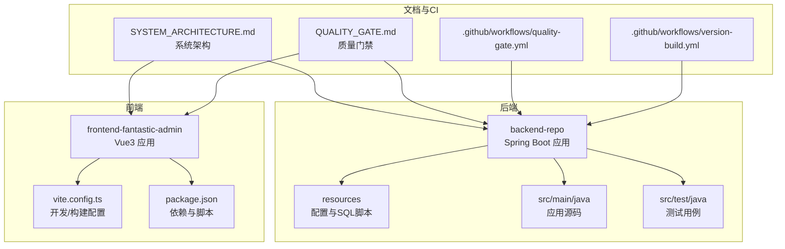
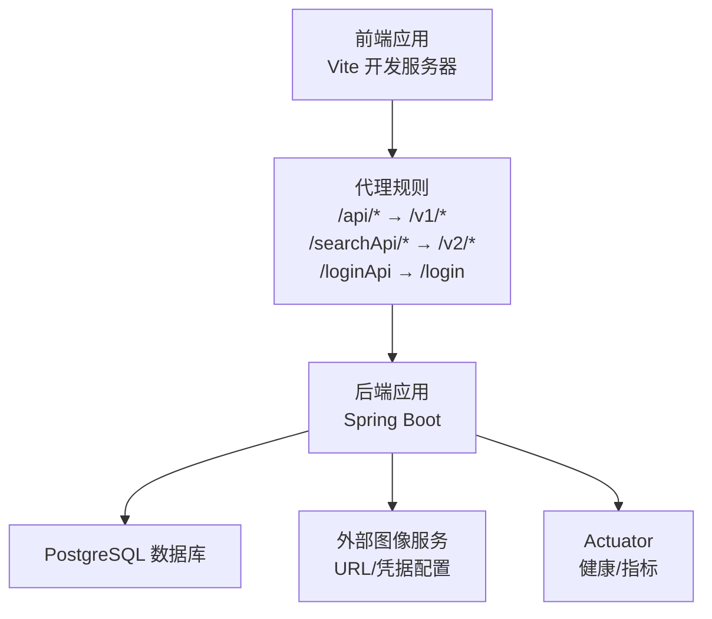
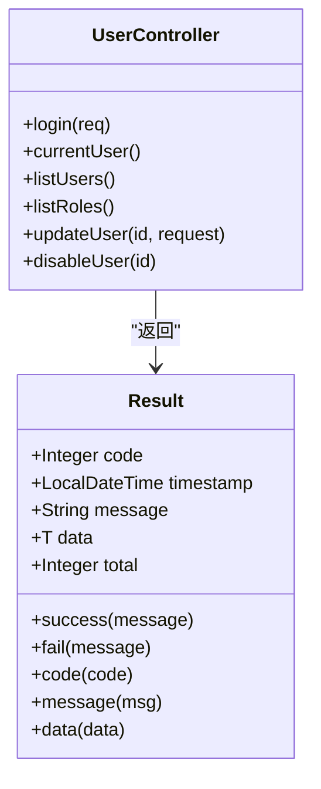
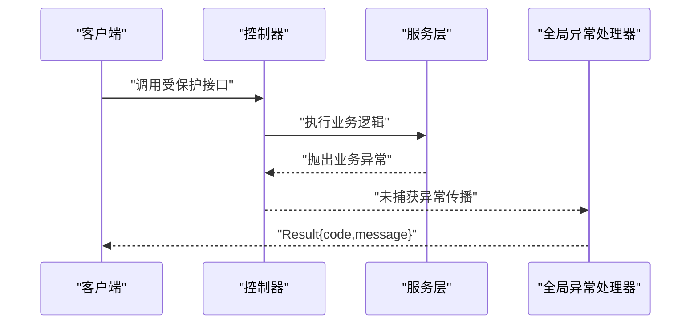
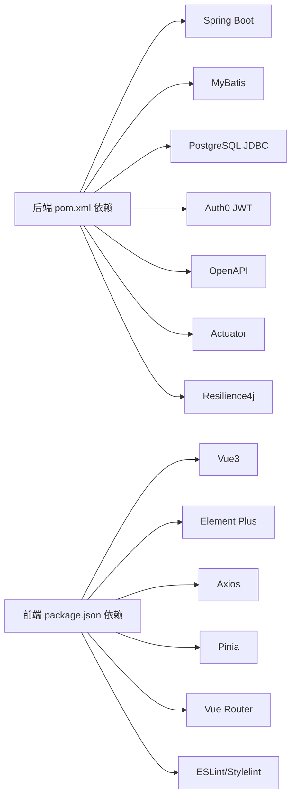

# 开发指南

**本文引用的文件**
- [backend-repo/README.md](file://backend-repo/README.md)
- [backend-repo/API_CONTRACT.md](file://backend-repo/API_CONTRACT.md)
- [backend-repo/pom.xml](file://backend-repo/pom.xml)
- [backend-repo/src/main/java/com/zjcxph/imgapi/ImageApiApplication.java](file://backend-repo/src/main/java/com/zjcxph/imgapi/ImageApiApplication.java)
- [backend-repo/src/main/resources/application.properties](file://backend-repo/src/main/resources/application.properties)
- [backend-repo/src/main/java/com/zjcxph/imgapi/controller/UserController.java](file://backend-repo/src/main/java/com/zjcxph/imgapi/controller/UserController.java)
- [backend-repo/src/main/java/com/zjcxph/imgapi/common/Result.java](file://backend-repo/src/main/java/com/zjcxph/imgapi/common/Result.java)
- [backend-repo/src/main/java/com/zjcxph/imgapi/exception/BusinessException.java](file://backend-repo/src/main/java/com/zjcxph/imgapi/exception/BusinessException.java)
- [backend-repo/src/main/java/com/zjcxph/imgapi/handler/GlobalExceptionHandler.java](file://backend-repo/src/main/java/com/zjcxph/imgapi/handler/GlobalExceptionHandler.java)
- [backend-repo/src/test/java/com/zjcxph/imgapi/ImageApiApplicationTests.java](file://backend-repo/src/test/java/com/zjcxph/imgapi/ImageApiApplicationTests.java)
- [frontend-fantastic-admin/README.md](file://frontend-fantastic-admin/README.md)
- [frontend-fantastic-admin/package.json](file://frontend-fantastic-admin/package.json)
- [frontend-fantastic-admin/vite.config.ts](file://frontend-fantastic-admin/vite.config.ts)
- [frontend-fantastic-admin/.editorconfig](file://frontend-fantastic-admin/.editorconfig)
- [frontend-fantastic-admin/eslint.config.js](file://frontend-fantastic-admin/eslint.config.js)
- [frontend-fantastic-admin/stylelint.config.js](file://frontend-fantastic-admin/stylelint.config.js)
- [.github/workflows/quality-gate.yml](file://.github/workflows/quality-gate.yml)
- [.github/workflows/version-build.yml](file://.github/workflows/version-build.yml)
- [SYSTEM_ARCHITECTURE.md](file://SYSTEM_ARCHITECTURE.md)
- [QUALITY_GATE.md](file://QUALITY_GATE.md)

## 目录
1. [简介](#简介)
2. [项目结构](#项目结构)
3. [核心组件](#核心组件)
4. [架构总览](#架构总览)
5. [详细组件分析](#详细组件分析)
6. [依赖分析](#依赖分析)
7. [性能考虑](#性能考虑)
8. [故障排查指南](#故障排查指南)
9. [结论](#结论)
10. [附录](#附录)

## 简介
本开发指南面向新加入的开发者，系统性地介绍 MRR 项目的开发规范、编程约定、最佳实践与工程化流程。内容涵盖：
- 开发环境搭建与 IDE 配置
- Git 工作流、分支策略与代码审查标准
- 单元测试、集成测试与测试覆盖率要求
- 依赖管理、版本控制与发布流程
- API 设计原则、错误处理与异常管理
- 性能优化、内存管理与并发处理最佳实践
- 学习路径与技能要求

## 项目结构
MRR 采用前后端分离架构，后端基于 Spring Boot 4 + MyBatis + PostgreSQL，前端基于 Vue3 + Vite。项目根目录包含多个子模块与文档，便于独立开发与协作。

图表来源
- [backend-repo/README.md:1-57](file://backend-repo/README.md#L1-L57)
- [frontend-fantastic-admin/README.md:1-134](file://frontend-fantastic-admin/README.md#L1-L134)
- [SYSTEM_ARCHITECTURE.md](file://SYSTEM_ARCHITECTURE.md)
- [QUALITY_GATE.md](file://QUALITY_GATE.md)

章节来源
- [backend-repo/README.md:1-57](file://backend-repo/README.md#L1-L57)
- [frontend-fantastic-admin/README.md:1-134](file://frontend-fantastic-admin/README.md#L1-L134)

## 核心组件
- 应用入口与扫描注解：启用调度、配置属性扫描、Mapper 扫描与 Spring Boot 启动。
- 配置中心：集中管理运行时参数（端口、数据库连接、缓存、日志、图像资源等）。
- 控制器层：统一返回体封装与权限注解，提供认证、用户、角色、扫描、搜索、统计、日志、系统信息等接口。
- 异常处理：全局异常处理器，对业务异常、参数校验异常、非法状态与通用异常进行分类处理。
- 测试基线：应用上下文加载测试，作为集成测试与压力测试的基础。

章节来源
- [backend-repo/src/main/java/com/zjcxph/imgapi/ImageApiApplication.java:1-20](file://backend-repo/src/main/java/com/zjcxph/imgapi/ImageApiApplication.java#L1-L20)
- [backend-repo/src/main/resources/application.properties:1-49](file://backend-repo/src/main/resources/application.properties#L1-L49)
- [backend-repo/src/main/java/com/zjcxph/imgapi/controller/UserController.java:1-95](file://backend-repo/src/main/java/com/zjcxph/imgapi/controller/UserController.java#L1-L95)
- [backend-repo/src/main/java/com/zjcxph/imgapi/common/Result.java:1-77](file://backend-repo/src/main/java/com/zjcxph/imgapi/common/Result.java#L1-L77)
- [backend-repo/src/main/java/com/zjcxph/imgapi/exception/BusinessException.java:1-20](file://backend-repo/src/main/java/com/zjcxph/imgapi/exception/BusinessException.java#L1-L20)
- [backend-repo/src/main/java/com/zjcxph/imgapi/handler/GlobalExceptionHandler.java:1-62](file://backend-repo/src/main/java/com/zjcxph/imgapi/handler/GlobalExceptionHandler.java#L1-L62)
- [backend-repo/src/test/java/com/zjcxph/imgapi/ImageApiApplicationTests.java:1-13](file://backend-repo/src/test/java/com/zjcxph/imgapi/ImageApiApplicationTests.java#L1-L13)

## 架构总览
后端通过 Spring MVC 暴露 REST 接口，前端通过 Vite 开发服务器代理到后端。API 约定由契约文件统一约束，Actuator 暴露健康检查与指标。

图表来源
- [backend-repo/API_CONTRACT.md:1-44](file://backend-repo/API_CONTRACT.md#L1-L44)
- [backend-repo/src/main/resources/application.properties:1-49](file://backend-repo/src/main/resources/application.properties#L1-L49)
- [frontend-fantastic-admin/vite.config.ts:1-64](file://frontend-fantastic-admin/vite.config.ts#L1-L64)

章节来源
- [backend-repo/API_CONTRACT.md:1-44](file://backend-repo/API_CONTRACT.md#L1-L44)
- [backend-repo/src/main/resources/application.properties:1-49](file://backend-repo/src/main/resources/application.properties#L1-L49)
- [frontend-fantastic-admin/vite.config.ts:1-64](file://frontend-fantastic-admin/vite.config.ts#L1-L64)

## 详细组件分析

### 统一响应体与控制器层
- 统一响应体封装：提供成功/失败构造方法与链式设置字段，支持分页场景。
- 控制器层：使用 OpenAPI 注解标注接口，结合权限注解与参数校验，返回统一响应体。
- 日志与审计：在关键操作处记录日志，便于问题定位与审计追踪。

图表来源
- [backend-repo/src/main/java/com/zjcxph/imgapi/common/Result.java:1-77](file://backend-repo/src/main/java/com/zjcxph/imgapi/common/Result.java#L1-L77)
- [backend-repo/src/main/java/com/zjcxph/imgapi/controller/UserController.java:1-95](file://backend-repo/src/main/java/com/zjcxph/imgapi/controller/UserController.java#L1-L95)

章节来源
- [backend-repo/src/main/java/com/zjcxph/imgapi/common/Result.java:1-77](file://backend-repo/src/main/java/com/zjcxph/imgapi/common/Result.java#L1-L77)
- [backend-repo/src/main/java/com/zjcxph/imgapi/controller/UserController.java:1-95](file://backend-repo/src/main/java/com/zjcxph/imgapi/controller/UserController.java#L1-L95)

### 全局异常处理
- 分类处理：业务异常、参数校验异常、非法参数/状态、通用异常。
- 返回格式：统一 Result 包装，HTTP 状态码映射。
- 记录策略：按异常类型记录不同级别日志，便于问题诊断。

图表来源
- [backend-repo/src/main/java/com/zjcxph/imgapi/handler/GlobalExceptionHandler.java:1-62](file://backend-repo/src/main/java/com/zjcxph/imgapi/handler/GlobalExceptionHandler.java#L1-L62)
- [backend-repo/src/main/java/com/zjcxph/imgapi/exception/BusinessException.java:1-20](file://backend-repo/src/main/java/com/zjcxph/imgapi/exception/BusinessException.java#L1-L20)

章节来源
- [backend-repo/src/main/java/com/zjcxph/imgapi/handler/GlobalExceptionHandler.java:1-62](file://backend-repo/src/main/java/com/zjcxph/imgapi/handler/GlobalExceptionHandler.java#L1-L62)
- [backend-repo/src/main/java/com/zjcxph/imgapi/exception/BusinessException.java:1-20](file://backend-repo/src/main/java/com/zjcxph/imgapi/exception/BusinessException.java#L1-L20)

### API 设计与契约
- 契约定义：明确前端代理映射与各模块接口清单，包括认证、图像、搜索、扫描等。
- 默认行为：当前默认患者查询采用明文 ID 卡，保留兼容接口以支持加密 ID。
- 响应约定：统一 Result 包裹，便于前端一致处理。

章节来源
- [backend-repo/API_CONTRACT.md:1-44](file://backend-repo/API_CONTRACT.md#L1-L44)

### 配置与运行时参数
- 端口与压缩：开启响应压缩与静态资源缓存。
- 数据源：Hikari 连接池参数可调，支持多环境覆盖。
- 日志：Mapper 层 DEBUG 级别日志，Root INFO 级别，支持滚动日志策略。
- 图像资源：外部图像服务 URL、用户名、密码与基础路径可配置。
- Actuator：暴露健康、指标等端点，支持 Prometheus。
- 清理策略：日志保留清理开关与定时任务配置项。

章节来源
- [backend-repo/src/main/resources/application.properties:1-49](file://backend-repo/src/main/resources/application.properties#L1-L49)

### 开发环境搭建与 IDE 配置
- 后端
  - JDK 21+、Maven 3.9+、PostgreSQL 15+。
  - 本地配置：通过环境变量或本地配置文件覆盖默认参数。
  - 启动方式：Maven 打包运行或直接运行主类。
- 前端
  - Node.js 版本要求与包管理器锁定。
  - 开发服务器端口、代理配置与构建输出目录。
  - 代码风格与提交钩子：EditorConfig、ESLint、Stylelint、simple-git-hooks。

章节来源
- [backend-repo/README.md:5-21](file://backend-repo/README.md#L5-L21)
- [backend-repo/src/main/resources/application.properties:1-49](file://backend-repo/src/main/resources/application.properties#L1-L49)
- [frontend-fantastic-admin/README.md:34-43](file://frontend-fantastic-admin/README.md#L34-L43)
- [frontend-fantastic-admin/package.json:1-131](file://frontend-fantastic-admin/package.json#L1-L131)
- [frontend-fantastic-admin/vite.config.ts:1-64](file://frontend-fantastic-admin/vite.config.ts#L1-L64)
- [frontend-fantastic-admin/.editorconfig:1-10](file://frontend-fantastic-admin/.editorconfig#L1-L10)
- [frontend-fantastic-admin/eslint.config.js:1-33](file://frontend-fantastic-admin/eslint.config.js#L1-L33)
- [frontend-fantastic-admin/stylelint.config.js:1-52](file://frontend-fantastic-admin/stylelint.config.js#L1-L52)

### 测试策略与覆盖率要求
- 单元测试：使用 JUnit 与 Spring Boot Test，建议针对 Service 与工具类进行隔离测试。
- 集成测试：基于 SpringBootTest 启动容器，覆盖控制器与数据库交互。
- 压力测试：内置压力测试相关组件与报告模型，可用于性能评估。
- 覆盖率：建议在 CI 中强制覆盖率阈值（如方法行覆盖率≥80%），并结合质量门禁策略。

章节来源
- [backend-repo/src/test/java/com/zjcxph/imgapi/ImageApiApplicationTests.java:1-13](file://backend-repo/src/test/java/com/zjcxph/imgapi/ImageApiApplicationTests.java#L1-L13)
- [backend-repo/pom.xml:27-114](file://backend-repo/pom.xml#L27-L114)
- [frontend-fantastic-admin/package.json:8-26](file://frontend-fantastic-admin/package.json#L8-L26)

### 依赖管理与版本控制
- 后端：Spring Boot 4、MyBatis、PostgreSQL JDBC、JWT、OpenAPI、Actuator、Resilience4j、PDF 生成等。
- 前端：Vue3、Element Plus、Axios、Pinia、Vue Router、UnoCSS、ESLint/Stylelint 等生态。
- 版本：后端 SNAPSHOT 版本，前端语义化版本；发布通过脚本与 CI 流水线完成。

章节来源
- [backend-repo/pom.xml:1-136](file://backend-repo/pom.xml#L1-L136)
- [frontend-fantastic-admin/package.json:1-131](file://frontend-fantastic-admin/package.json#L1-L131)

### 发布流程
- CI 工作流：质量门禁与版本构建流水线，确保代码质量与版本一致性。
- 前后端：分别在各自仓库执行构建与部署，遵循质量门禁策略。

章节来源
- [.github/workflows/quality-gate.yml](file://.github/workflows/quality-gate.yml)
- [.github/workflows/version-build.yml](file://.github/workflows/version-build.yml)
- [QUALITY_GATE.md](file://QUALITY_GATE.md)

### Git 工作流、分支策略与代码审查
- 分支策略：建议采用功能分支开发、主分支保护、Pull Request 合并与自动化质量检查。
- 提交规范：使用 commitizen 与 git hooks，保证提交信息可读性与可追溯性。
- 代码审查：PR 必须通过 CI 与代码质量检查，至少一名维护者批准。

章节来源
- [frontend-fantastic-admin/package.json:21-25](file://frontend-fantastic-admin/package.json#L21-L25)
- [frontend-fantastic-admin/package.json:121-129](file://frontend-fantastic-admin/package.json#L121-L129)

### 并发处理与性能优化
- 连接池：合理配置 Hikari 最大池大小、空闲超时与生命周期，避免连接泄漏。
- 缓存：静态资源缓存与响应压缩，降低带宽与延迟。
- 定时任务：日志清理等后台任务需设置合理的批处理与最大批次限制。
- PDF 生成：批量导出时注意内存占用与流式写入策略。
- 前端：Vite 构建优化、按需加载与组件懒加载，减少首屏体积。

章节来源
- [backend-repo/src/main/resources/application.properties:15-19](file://backend-repo/src/main/resources/application.properties#L15-L19)
- [backend-repo/src/main/resources/application.properties:4-8](file://backend-repo/src/main/resources/application.properties#L4-L8)
- [backend-repo/src/main/resources/application.properties:40-45](file://backend-repo/src/main/resources/application.properties#L40-L45)
- [backend-repo/pom.xml:95-103](file://backend-repo/pom.xml#L95-L103)
- [frontend-fantastic-admin/vite.config.ts:34-37](file://frontend-fantastic-admin/vite.config.ts#L34-L37)

### 错误处理与异常管理
- 业务异常：通过 BusinessException 抛出，携带业务码，由全局异常处理器转换为 HTTP 状态码。
- 参数校验：利用 Bean Validation 与全局异常处理返回 400。
- 权限异常：非法状态转换为 403。
- 通用异常：未知异常统一返回 500。

章节来源
- [backend-repo/src/main/java/com/zjcxph/imgapi/exception/BusinessException.java:1-20](file://backend-repo/src/main/java/com/zjcxph/imgapi/exception/BusinessException.java#L1-L20)
- [backend-repo/src/main/java/com/zjcxph/imgapi/handler/GlobalExceptionHandler.java:1-62](file://backend-repo/src/main/java/com/zjcxph/imgapi/handler/GlobalExceptionHandler.java#L1-L62)

### 学习路径与技能要求
- 后端
  - Java 21+、Spring 生态、MyBatis、PostgreSQL、RESTful API、JWT、Actuator。
  - 单元测试与集成测试、质量门禁与 CI。
- 前端
  - Vue3、TypeScript、Vite、状态管理、组件化开发、ESLint/Stylelint。
  - 构建优化与性能调优。
- 工程化
  - Git 工作流、分支策略、提交规范、代码审查与发布流程。

章节来源
- [backend-repo/README.md:5-11](file://backend-repo/README.md#L5-L11)
- [frontend-fantastic-admin/README.md:22-33](file://frontend-fantastic-admin/README.md#L22-L33)
- [frontend-fantastic-admin/package.json:5-7](file://frontend-fantastic-admin/package.json#L5-L7)

## 依赖分析
后端与前端均通过各自配置文件声明依赖，后端使用 Maven 管理，前端使用 pnpm。两者通过 API 契约与代理规则耦合。

图表来源
- [backend-repo/pom.xml:27-114](file://backend-repo/pom.xml#L27-L114)
- [frontend-fantastic-admin/package.json:27-61](file://frontend-fantastic-admin/package.json#L27-L61)
- [frontend-fantastic-admin/package.json:62-120](file://frontend-fantastic-admin/package.json#L62-L120)

章节来源
- [backend-repo/pom.xml:1-136](file://backend-repo/pom.xml#L1-L136)
- [frontend-fantastic-admin/package.json:1-131](file://frontend-fantastic-admin/package.json#L1-L131)

## 性能考虑
- 数据库层
  - 合理设置连接池参数，避免过度连接导致资源争用。
  - 使用索引与查询优化，避免 N+1 查询。
- 应用层
  - 启用响应压缩与静态资源缓存，降低网络传输成本。
  - 对外服务调用增加超时与重试策略，必要时引入限流。
- 前端层
  - 构建产物按需加载与懒加载，减少初始包体。
  - 使用 UnoCSS 等工具按需引入样式，避免全量引入。

[本节为通用指导，无需特定文件来源]

## 故障排查指南
- 启动失败
  - 检查数据库连通性与 schema 初始化脚本是否执行。
  - 查看日志文件与 Actuator 健康检查端点。
- 接口异常
  - 观察全局异常处理器返回的 Result 结构，定位业务码与消息。
  - 对参数校验异常，检查请求体与校验注解。
- 性能问题
  - 关注数据库慢查询与连接池状态。
  - 前端构建产物与网络请求分析，定位瓶颈。

章节来源
- [backend-repo/src/main/resources/application.properties:20-22](file://backend-repo/src/main/resources/application.properties#L20-L22)
- [backend-repo/src/main/resources/application.properties:25-28](file://backend-repo/src/main/resources/application.properties#L25-L28)
- [backend-repo/src/main/java/com/zjcxph/imgapi/handler/GlobalExceptionHandler.java:19-60](file://backend-repo/src/main/java/com/zjcxph/imgapi/handler/GlobalExceptionHandler.java#L19-L60)

## 结论
本指南从工程化与技术细节两个维度，为 MRR 项目提供了可落地的开发规范与最佳实践。建议团队在日常开发中严格遵循：统一的 API 契约、严格的代码质量门禁、完善的测试体系与持续改进的性能优化策略。

[本节为总结性内容，无需特定文件来源]

## 附录
- 系统架构说明与质量门禁文档可作为进一步阅读材料，帮助理解整体设计与质量策略。

章节来源
- [SYSTEM_ARCHITECTURE.md](file://SYSTEM_ARCHITECTURE.md)
- [QUALITY_GATE.md](file://QUALITY_GATE.md)