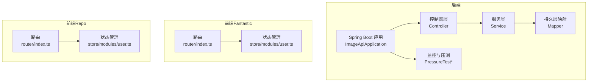
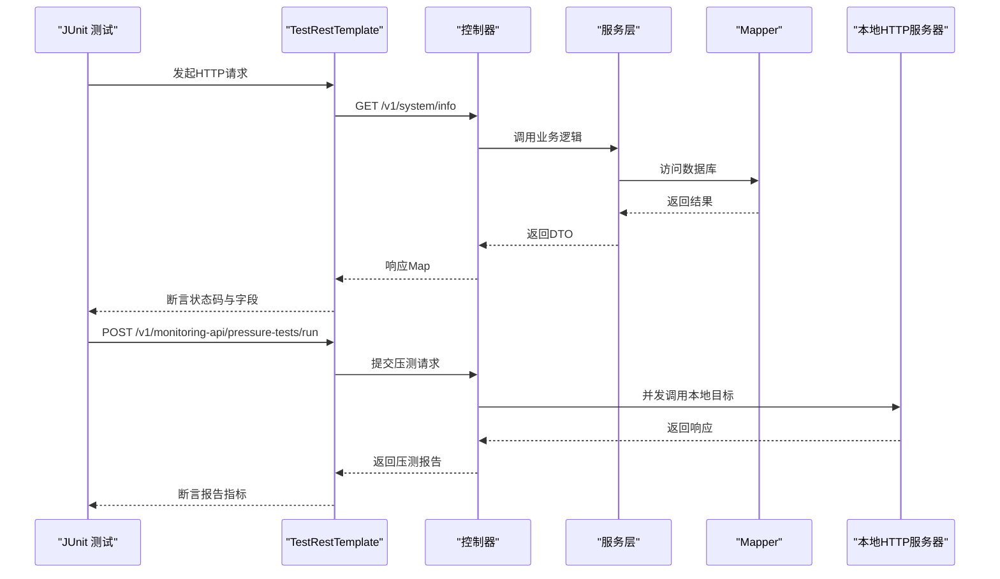
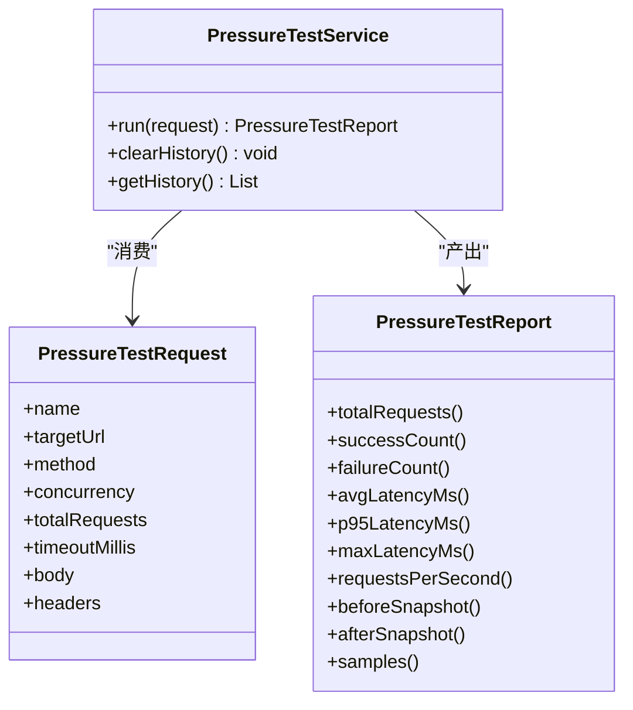
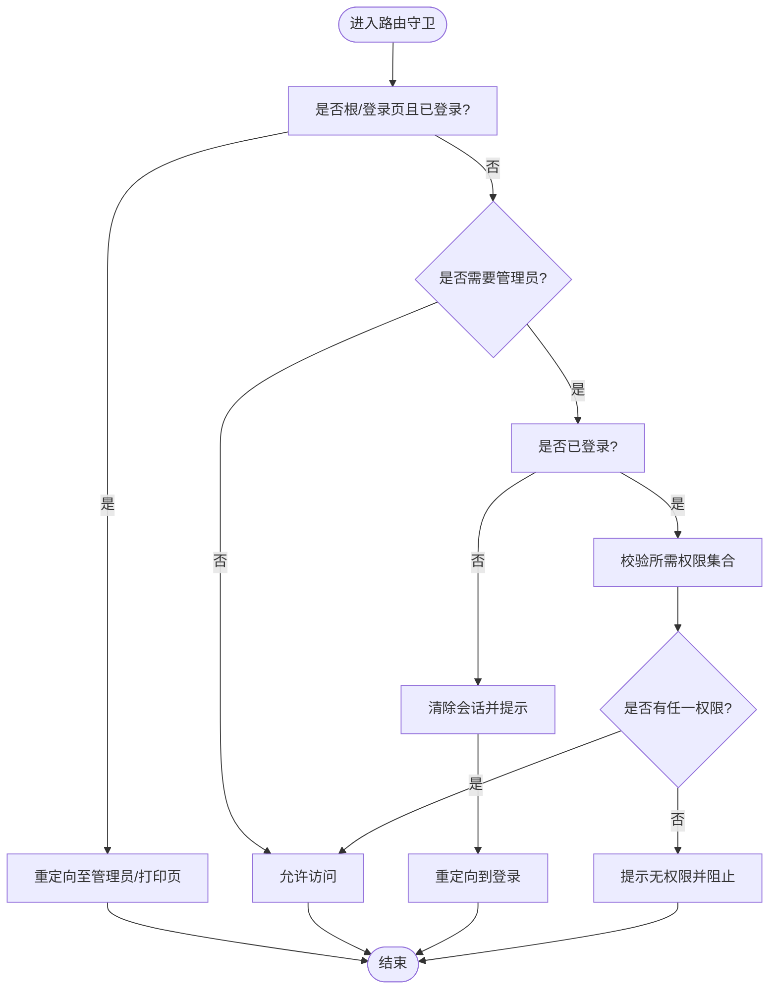
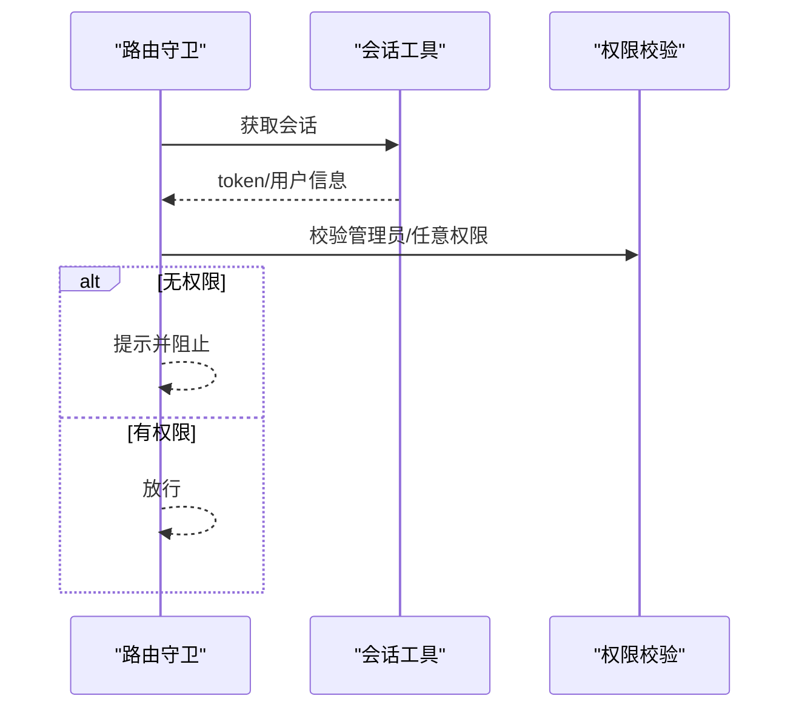
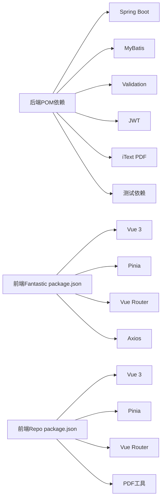

# 测试策略

**本文引用的文件**
- [ImageApiApplication.java](file://backend-repo/src/main/java/com/zjcxph/imgapi/ImageApiApplication.java)
- [pom.xml](file://backend-repo/pom.xml)
- [ImageApiApplicationTests.java](file://backend-repo/src/test/java/com/zjcxph/imgapi/ImageApiApplicationTests.java)
- [ControllerIntegrationTest.java](file://backend-repo/src/test/java/com/zjcxph/imgapi/ControllerIntegrationTest.java)
- [PressureTestControllerIntegrationTest.java](file://backend-repo/src/test/java/com/zjcxph/imgapi/PressureTestControllerIntegrationTest.java)
- [PressureTestServiceTest.java](file://backend-repo/src/test/java/com/zjcxph/imgapi/PressureTestServiceTest.java)
- [package.json（前端Fantastic）](file://frontend-fantastic-admin/package.json)
- [package.json（前端Repo）](file://frontend-repo/package.json)
- [router/index.ts（前端Fantastic）](file://frontend-fantastic-admin/src/router/index.ts)
- [router/index.ts（前端Repo）](file://frontend-repo/src/router/index.ts)
- [store/modules/user.ts（前端Fantastic）](file://frontend-fantastic-admin/src/store/modules/user.ts)
- [store/modules/user.ts（前端Repo）](file://frontend-repo/src/store/modules/user.ts)
- [.github/workflows/quality-gate.yml](file://.github/workflows/quality-gate.yml)
- [.github/workflows/version-build.yml](file://.github/workflows/version-build.yml)

## 目录
1. [引言](#引言)
2. [项目结构](#项目结构)
3. [核心组件](#核心组件)
4. [架构总览](#架构总览)
5. [详细组件分析](#详细组件分析)
6. [依赖分析](#依赖分析)
7. [性能考虑](#性能考虑)
8. [故障排查指南](#故障排查指南)
9. [结论](#结论)
10. [附录](#附录)

## 引言
本测试策略文档面向MRR项目的开发与测试团队，系统化定义单元测试、集成测试与端到端测试的实施方法，覆盖后端Spring Boot与前端Vue生态。内容包括：
- 测试框架与工具链：Spring Boot Test、TestRestTemplate、JUnit 5、Mockito（后端）、Vitest（前端）
- 模拟对象与测试数据准备：控制器层与服务层的隔离测试、本地HTTP目标服务用于压测
- Vue组件、路由与状态管理测试最佳实践
- 覆盖率要求、用例设计原则与测试环境配置
- 压力测试、性能测试与安全测试执行流程
- 测试自动化与CI中的测试执行、报告生成
- TDD实践与测试维护策略

## 项目结构
MRR采用前后端分离架构：
- 后端：Spring Boot应用，提供REST API、定时任务、MyBatis映射、监控与压力测试能力
- 前端Fantastic：基于Vue 3 + Pinia + Vue Router的管理端
- 前端Repo：基于Vue 3 + Pinia + Vue Router的展示/测试端
- CI：GitHub Actions工作流负责质量门禁与版本构建

图表来源
- [ImageApiApplication.java:1-20](file://backend-repo/src/main/java/com/zjcxph/imgapi/ImageApiApplication.java#L1-L20)
- [router/index.ts（前端Fantastic）:1-24](file://frontend-fantastic-admin/src/router/index.ts#L1-L24)
- [store/modules/user.ts（前端Fantastic）:1-129](file://frontend-fantastic-admin/src/store/modules/user.ts#L1-L129)
- [router/index.ts（前端Repo）:1-132](file://frontend-repo/src/router/index.ts#L1-L132)
- [store/modules/user.ts（前端Repo）:1-68](file://frontend-repo/src/store/modules/user.ts#L1-L68)

章节来源
- [ImageApiApplication.java:1-20](file://backend-repo/src/main/java/com/zjcxph/imgapi/ImageApiApplication.java#L1-L20)
- [pom.xml:1-136](file://backend-repo/pom.xml#L1-L136)
- [package.json（前端Fantastic）:1-131](file://frontend-fantastic-admin/package.json#L1-L131)
- [package.json（前端Repo）:1-63](file://frontend-repo/package.json#L1-L63)

## 核心组件
- 后端应用入口与扫描注解：启用调度、配置属性扫描、Mapper扫描
- 测试骨架：Spring Boot Test上下文加载验证
- 集成测试：TestRestTemplate访问系统信息、健康检查、统计API、分页查询、并发请求等
- 压力测试：控制器集成测试与服务层单元测试，结合本地HTTP服务器作为压测目标
- 前端Fantastic：路由守卫、Pinia用户状态管理
- 前端Repo：路由守卫、权限校验、Pinia用户状态管理

章节来源
- [ImageApiApplication.java:1-20](file://backend-repo/src/main/java/com/zjcxph/imgapi/ImageApiApplication.java#L1-L20)
- [ImageApiApplicationTests.java:1-13](file://backend-repo/src/test/java/com/zjcxph/imgapi/ImageApiApplicationTests.java#L1-L13)
- [ControllerIntegrationTest.java:1-245](file://backend-repo/src/test/java/com/zjcxph/imgapi/ControllerIntegrationTest.java#L1-L245)
- [PressureTestControllerIntegrationTest.java:1-116](file://backend-repo/src/test/java/com/zjcxph/imgapi/PressureTestControllerIntegrationTest.java#L1-L116)
- [PressureTestServiceTest.java:1-105](file://backend-repo/src/test/java/com/zjcxph/imgapi/PressureTestServiceTest.java#L1-L105)
- [router/index.ts（前端Fantastic）:1-24](file://frontend-fantastic-admin/src/router/index.ts#L1-L24)
- [store/modules/user.ts（前端Fantastic）:1-129](file://frontend-fantastic-admin/src/store/modules/user.ts#L1-L129)
- [router/index.ts（前端Repo）:1-132](file://frontend-repo/src/router/index.ts#L1-L132)
- [store/modules/user.ts（前端Repo）:1-68](file://frontend-repo/src/store/modules/user.ts#L1-L68)

## 架构总览
下图展示后端测试执行路径与前端路由/状态交互。

图表来源
- [ControllerIntegrationTest.java:1-245](file://backend-repo/src/test/java/com/zjcxph/imgapi/ControllerIntegrationTest.java#L1-L245)
- [PressureTestControllerIntegrationTest.java:1-116](file://backend-repo/src/test/java/com/zjcxph/imgapi/PressureTestControllerIntegrationTest.java#L1-L116)
- [PressureTestServiceTest.java:1-105](file://backend-repo/src/test/java/com/zjcxph/imgapi/PressureTestServiceTest.java#L1-L105)

## 详细组件分析

### 后端测试策略
- 单元测试
  - 服务层：对PressureTestService进行独立运行与历史清理断言，确保指标收集正确
  - 断言要点：总请求数、成功数、失败数、平均/百分位延迟、RPS、样本数量、快照前后一致性
- 集成测试
  - 控制器层：通过TestRestTemplate访问系统信息、健康检查、统计API、分页查询、并发请求
  - 断言要点：状态码、响应体字段存在性、分页字段完整性、并发场景下的稳定性
- 压力测试
  - 控制器集成：启动本地HttpServer作为压测目标，提交压测请求，断言报告名称、总量、成功率、RPS、历史记录非空
  - 服务层单元：构造PressureTestRequest，断言报告指标与历史容量

图表来源
- [PressureTestServiceTest.java:1-105](file://backend-repo/src/test/java/com/zjcxph/imgapi/PressureTestServiceTest.java#L1-L105)

章节来源
- [PressureTestServiceTest.java:1-105](file://backend-repo/src/test/java/com/zjcxph/imgapi/PressureTestServiceTest.java#L1-L105)
- [PressureTestControllerIntegrationTest.java:1-116](file://backend-repo/src/test/java/com/zjcxph/imgapi/PressureTestControllerIntegrationTest.java#L1-L116)
- [ControllerIntegrationTest.java:1-245](file://backend-repo/src/test/java/com/zjcxph/imgapi/ControllerIntegrationTest.java#L1-L245)

### 前端Fantastic测试策略
- 路由测试
  - 路由守卫：校验未登录跳转登录、管理员权限校验、权限集合匹配
  - 路由注册：根据设置选择文件系统或固定路由模式
- 状态管理测试
  - 用户状态：登录会话写入、权限持久化、登出清理、权限判断getter
  - 与API模块解耦：通过Pinia Store与API模块解耦，便于单元测试

图表来源
- [router/index.ts（前端Fantastic）:1-24](file://frontend-fantastic-admin/src/router/index.ts#L1-L24)

章节来源
- [router/index.ts（前端Fantastic）:1-24](file://frontend-fantastic-admin/src/router/index.ts#L1-L24)
- [store/modules/user.ts（前端Fantastic）:1-129](file://frontend-fantastic-admin/src/store/modules/user.ts#L1-L129)

### 前端Repo测试策略
- 路由测试
  - 守卫逻辑：登录态检测、管理员/权限校验、自动跳转
- 状态管理测试
  - 用户状态：token与用户信息存取、权限判断、管理员判定、显示名/角色名getter
  - 持久化：localStorage键值与pick字段

图表来源
- [router/index.ts（前端Repo）:1-132](file://frontend-repo/src/router/index.ts#L1-L132)

章节来源
- [router/index.ts（前端Repo）:1-132](file://frontend-repo/src/router/index.ts#L1-L132)
- [store/modules/user.ts（前端Repo）:1-68](file://frontend-repo/src/store/modules/user.ts#L1-L68)

## 依赖分析
- 后端依赖
  - Spring Boot Starter Web、JDBC、MyBatis、Validation、OpenAPI、Actuator、JWT、iTextPDF、commons-codec、Lombok
  - 测试依赖：spring-boot-starter-test、spring-boot-restclient、spring-boot-resttestclient、mybatis-spring-boot-starter-test
- 前端Fantastic依赖
  - Vue 3、Pinia、Vue Router、Element Plus、Axios、GSAP、日志/调试工具等
- 前端Repo依赖
  - Vue 3、Pinia、Vue Router、Element Plus、PDF工具、持久化插件等
- 测试工具
  - 后端：JUnit 5、TestRestTemplate、Mockito（可按需引入）
  - 前端：Vitest（前端Fantastic与Repo均配置）

图表来源
- [pom.xml:1-136](file://backend-repo/pom.xml#L1-L136)
- [package.json（前端Fantastic）:1-131](file://frontend-fantastic-admin/package.json#L1-L131)
- [package.json（前端Repo）:1-63](file://frontend-repo/package.json#L1-L63)

章节来源
- [pom.xml:1-136](file://backend-repo/pom.xml#L1-L136)
- [package.json（前端Fantastic）:1-131](file://frontend-fantastic-admin/package.json#L1-L131)
- [package.json（前端Repo）:1-63](file://frontend-repo/package.json#L1-L63)

## 性能考虑
- 压力测试
  - 使用本地HttpServer作为压测目标，避免外部依赖波动
  - 控制并发数、总请求数、超时时间，断言RPS、延迟分布与成功率
- 性能测试
  - 利用Actuator暴露指标，结合外部监控系统采集CPU、内存、请求耗时
- 安全测试
  - 路由守卫与权限校验：确保未授权访问被拒绝
  - JWT与密码工具：在后端保障认证与敏感数据处理安全

章节来源
- [PressureTestControllerIntegrationTest.java:1-116](file://backend-repo/src/test/java/com/zjcxph/imgapi/PressureTestControllerIntegrationTest.java#L1-L116)
- [PressureTestServiceTest.java:1-105](file://backend-repo/src/test/java/com/zjcxph/imgapi/PressureTestServiceTest.java#L1-L105)
- [router/index.ts（前端Repo）:1-132](file://frontend-repo/src/router/index.ts#L1-L132)

## 故障排查指南
- 集成测试常见问题
  - 端口冲突：随机端口启动，确认TestRestTemplate可用
  - 响应断言失败：检查控制器返回结构与字段命名
- 压力测试异常
  - 本地目标不可达：确认HttpServer已启动、端口正确
  - 报告指标异常：检查并发参数与超时设置
- 前端路由/权限问题
  - 登录态不一致：检查localStorage与Pinia状态同步
  - 权限判断错误：核对权限字符串与守卫逻辑

章节来源
- [ControllerIntegrationTest.java:1-245](file://backend-repo/src/test/java/com/zjcxph/imgapi/ControllerIntegrationTest.java#L1-L245)
- [PressureTestControllerIntegrationTest.java:1-116](file://backend-repo/src/test/java/com/zjcxph/imgapi/PressureTestControllerIntegrationTest.java#L1-L116)
- [router/index.ts（前端Fantastic）:1-24](file://frontend-fantastic-admin/src/router/index.ts#L1-L24)
- [router/index.ts（前端Repo）:1-132](file://frontend-repo/src/router/index.ts#L1-L132)

## 结论
本测试策略以“后端控制器集成+服务层单元+前端路由/状态管理”为核心，辅以压力测试与权限校验，形成完整的测试金字塔。建议在CI中统一执行后端与前端测试，并输出测试报告；同时建立TDD闭环，推动高质量交付。

## 附录

### 测试覆盖率与用例设计原则
- 覆盖率目标
  - 后端：控制器与服务层语句覆盖率≥80%，分支覆盖率≥60%
  - 前端：路由守卫与状态管理函数覆盖率≥85%
- 用例设计
  - 正向场景：完整字段、正确分页、权限满足
  - 边界场景：空输入、最大/最小分页、权限边界
  - 异常场景：未登录、权限不足、目标不可达、超时

### 测试环境配置
- 后端
  - 使用TestRestTemplate与随机端口，避免端口冲突
  - 压测目标使用Java内置HttpServer，便于本地快速搭建
- 前端
  - Vitest运行环境，支持JS DOM（如jsdom），便于组件与路由测试
  - Pinia持久化配置与localStorage交互需在测试中隔离或模拟

章节来源
- [ControllerIntegrationTest.java:1-245](file://backend-repo/src/test/java/com/zjcxph/imgapi/ControllerIntegrationTest.java#L1-L245)
- [PressureTestServiceTest.java:1-105](file://backend-repo/src/test/java/com/zjcxph/imgapi/PressureTestServiceTest.java#L1-L105)
- [package.json（前端Repo）:1-63](file://frontend-repo/package.json#L1-L63)

### 测试自动化与CI
- 工作流
  - 质量门禁：在PR与主干合并时执行测试与静态检查
  - 版本构建：打包与镜像构建前执行测试
- 建议
  - 输出JUnit/JUnit XML报告供CI解析
  - 前端使用Vitest生成HTML/JSON报告，上传Artifacts

章节来源
- [.github/workflows/quality-gate.yml](file://.github/workflows/quality-gate.yml)
- [.github/workflows/version-build.yml](file://.github/workflows/version-build.yml)

### TDD实践与测试维护
- TDD步骤
  - 编写失败用例 → 实现最小代码 → 重构与优化 → 继续下一个需求
- 测试维护
  - 用例命名清晰、断言明确、关注边界与异常
  - 随着功能演进定期回归，保持覆盖率稳定