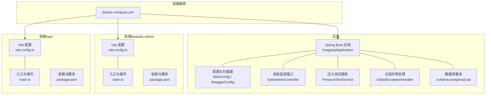
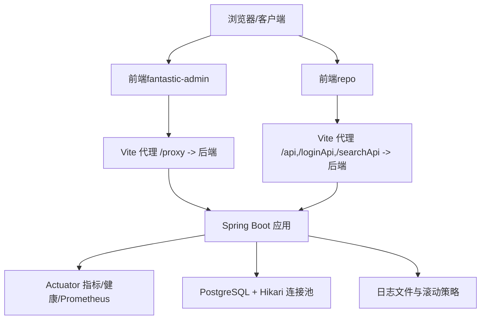
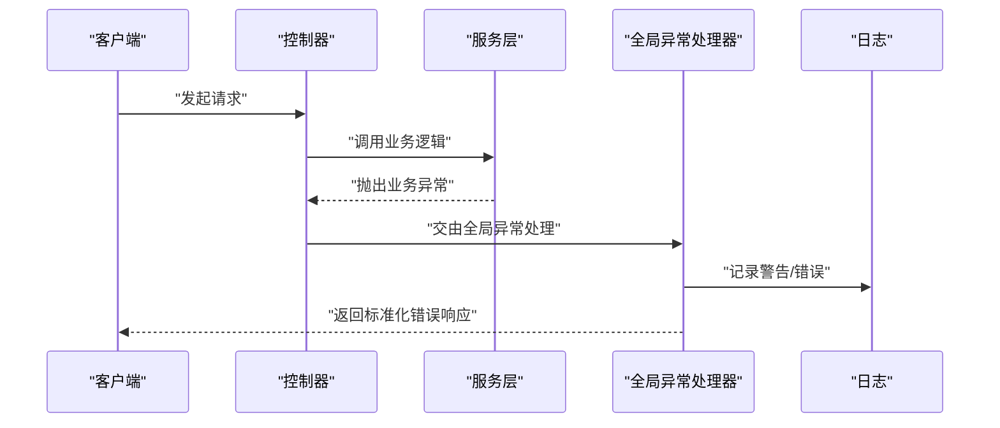
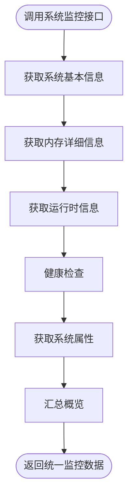
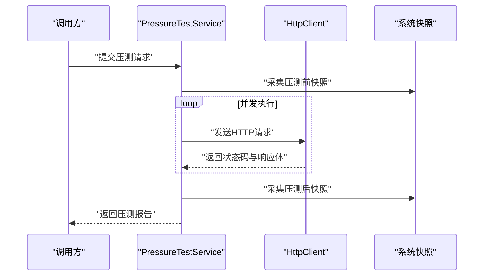
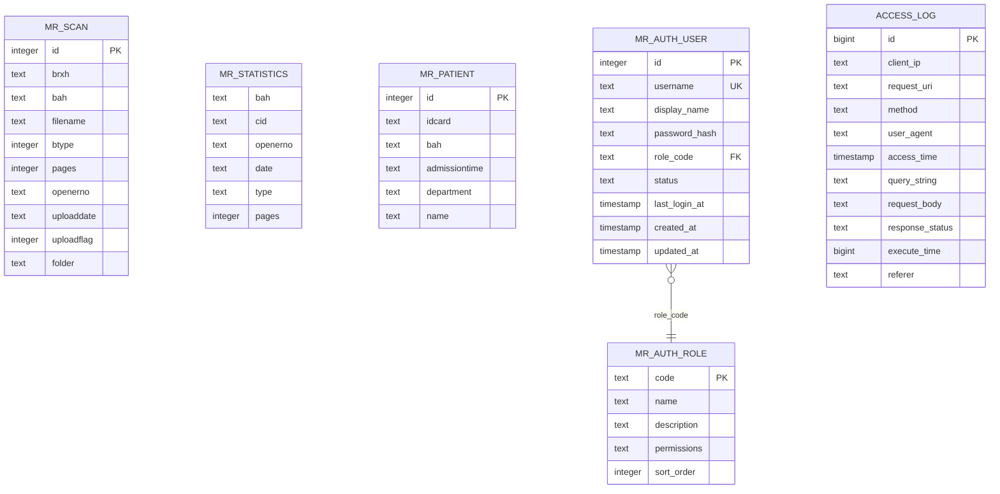
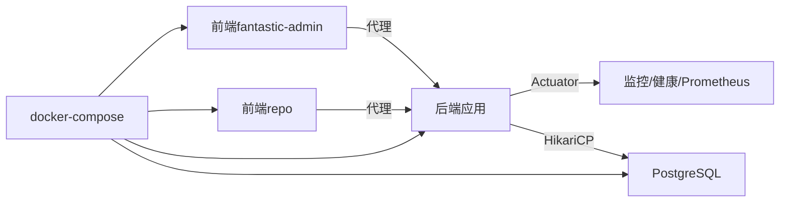

# 调试与故障排除

**本文引用的文件**
- [ImageApiApplication.java](file://backend-repo/src/main/java/com/zjcxph/imgapi/ImageApiApplication.java)
- [application.properties](file://backend-repo/src/main/resources/application.properties)
- [GlobalExceptionHandler.java](file://backend-repo/src/main/java/com/zjcxph/imgapi/handler/GlobalExceptionHandler.java)
- [WebConfig.java](file://backend-repo/src/main/java/com/zjcxph/imgapi/config/WebConfig.java)
- [SwaggerConfig.java](file://backend-repo/src/main/java/com/zjcxph/imgapi/config/SwaggerConfig.java)
- [SystemInfoController.java](file://backend-repo/src/main/java/com/zjcxph/imgapi/controller/SystemInfoController.java)
- [DbController.java](file://backend-repo/src/main/java/com/zjcxph/imgapi/controller/DbController.java)
- [PressureTestService.java](file://backend-repo/src/main/java/com/zjcxph/imgapi/monitoring/PressureTestService.java)
- [schema-postgresql.sql](file://backend-repo/src/main/resources/schema-postgresql.sql)
- [docker-compose.yml](file://docker-compose.yml)
- [package.json（fantastic-admin）](file://frontend-fantastic-admin/package.json)
- [vite.config.ts（fantastic-admin）](file://frontend-fantastic-admin/vite.config.ts)
- [main.ts（fantastic-admin）](file://frontend-fantastic-admin/src/main.ts)
- [package.json（repo）](file://frontend-repo/package.json)
- [vite.config.ts（repo）](file://frontend-repo/vite.config.ts)
- [main.ts（repo）](file://frontend-repo/src/main.ts)

## 目录
1. [简介](#简介)
2. [项目结构](#项目结构)
3. [核心组件](#核心组件)
4. [架构总览](#架构总览)
5. [详细组件分析](#详细组件分析)
6. [依赖分析](#依赖分析)
7. [性能考量](#性能考量)
8. [故障排除指南](#故障排除指南)
9. [结论](#结论)
10. [附录](#附录)

## 简介
本指南面向MRR项目的开发者，提供从后端Spring Boot到前端Vue的全栈调试与故障排除方法。内容涵盖：
- Spring Boot应用远程调试、断点设置与日志分析
- Vue前端调试工具、浏览器开发者工具与Vue DevTools配置
- 常见异常处理、错误追踪与堆栈分析
- 数据库连接问题排查、SQL查询优化与性能诊断
- 网络请求问题、API接口调试与响应时间分析
- 系统资源监控、内存泄漏检测与并发问题排查

## 项目结构
MRR采用前后端分离架构：后端基于Spring Boot，前端包含两个仓库（fantastic-admin与repo），并通过Docker Compose编排运行。

图表来源
- [ImageApiApplication.java:1-20](file://backend-repo/src/main/java/com/zjcxph/imgapi/ImageApiApplication.java#L1-L20)
- [WebConfig.java:1-61](file://backend-repo/src/main/java/com/zjcxph/imgapi/config/WebConfig.java#L1-L61)
- [SwaggerConfig.java:1-41](file://backend-repo/src/main/java/com/zjcxph/imgapi/config/SwaggerConfig.java#L1-L41)
- [SystemInfoController.java:1-236](file://backend-repo/src/main/java/com/zjcxph/imgapi/controller/SystemInfoController.java#L1-L236)
- [PressureTestService.java:1-293](file://backend-repo/src/main/java/com/zjcxph/imgapi/monitoring/PressureTestService.java#L1-L293)
- [GlobalExceptionHandler.java:1-62](file://backend-repo/src/main/java/com/zjcxph/imgapi/handler/GlobalExceptionHandler.java#L1-L62)
- [schema-postgresql.sql:1-109](file://backend-repo/src/main/resources/schema-postgresql.sql#L1-L109)
- [vite.config.ts（fantastic-admin）:1-64](file://frontend-fantastic-admin/vite.config.ts#L1-L64)
- [main.ts（fantastic-admin）:1-33](file://frontend-fantastic-admin/src/main.ts#L1-L33)
- [vite.config.ts（repo）:1-90](file://frontend-repo/vite.config.ts#L1-L90)
- [main.ts（repo）:1-18](file://frontend-repo/src/main.ts#L1-L18)
- [docker-compose.yml:1-47](file://docker-compose.yml#L1-L47)

章节来源
- [ImageApiApplication.java:1-20](file://backend-repo/src/main/java/com/zjcxph/imgapi/ImageApiApplication.java#L1-L20)
- [docker-compose.yml:1-47](file://docker-compose.yml#L1-L47)

## 核心组件
- 后端启动类与扫描注解：负责启用调度、配置属性扫描与MyBatis Mapper扫描。
- 配置与拦截器：统一注册登录、鉴权与日志拦截器，并排除静态路径与监控端点。
- 系统监控接口：提供系统信息、内存、运行时、健康检查与属性概览。
- 压力测试服务：内置并发压测执行器，采集成功率、延迟分位数与吞吐量。
- 全局异常处理：集中捕获业务异常、参数校验异常、非法状态等，返回标准化结果。
- 数据库脚本：定义模式、表结构、索引与初始角色/用户数据。
- 前端Vite配置：开发代理、构建产物、别名与插件集成；入口挂载与UI生态初始化。

章节来源
- [ImageApiApplication.java:1-20](file://backend-repo/src/main/java/com/zjcxph/imgapi/ImageApiApplication.java#L1-L20)
- [WebConfig.java:1-61](file://backend-repo/src/main/java/com/zjcxph/imgapi/config/WebConfig.java#L1-L61)
- [SystemInfoController.java:1-236](file://backend-repo/src/main/java/com/zjcxph/imgapi/controller/SystemInfoController.java#L1-L236)
- [PressureTestService.java:1-293](file://backend-repo/src/main/java/com/zjcxph/imgapi/monitoring/PressureTestService.java#L1-L293)
- [GlobalExceptionHandler.java:1-62](file://backend-repo/src/main/java/com/zjcxph/imgapi/handler/GlobalExceptionHandler.java#L1-L62)
- [schema-postgresql.sql:1-109](file://backend-repo/src/main/resources/schema-postgresql.sql#L1-L109)
- [vite.config.ts（fantastic-admin）:1-64](file://frontend-fantastic-admin/vite.config.ts#L1-L64)
- [main.ts（fantastic-admin）:1-33](file://frontend-fantastic-admin/src/main.ts#L1-L33)
- [vite.config.ts（repo）:1-90](file://frontend-repo/vite.config.ts#L1-L90)
- [main.ts（repo）:1-18](file://frontend-repo/src/main.ts#L1-L18)

## 架构总览
后端通过Actuator暴露健康、指标与Prometheus端点，前端通过Vite代理转发至后端API。数据库由PostgreSQL提供，Hikari连接池在生产环境可调优。

图表来源
- [application.properties:35-45](file://backend-repo/src/main/resources/application.properties#L35-L45)
- [vite.config.ts（fantastic-admin）:25-31](file://frontend-fantastic-admin/vite.config.ts#L25-L31)
- [vite.config.ts（repo）:70-86](file://frontend-repo/vite.config.ts#L70-L86)
- [docker-compose.yml:19-43](file://docker-compose.yml#L19-L43)

## 详细组件分析

### Spring Boot 应用调试与断点设置
- 远程调试建议
  - VM参数：开启远程调试端口与热重载（DevTools已启用）
  - IDE断点：在控制器、服务层、拦截器与全局异常处理器中设置断点
  - 日志级别：将mapper包设为DEBUG，根级别INFO，便于快速定位
- 关键入口与扫描
  - 启动类启用调度、配置属性扫描与Mapper扫描
- 排查要点
  - Actuator端点：/actuator/health、/actuator/info、/actuator/metrics
  - 数据源配置：URL、用户名、密码、连接池参数
  - 日志文件：按大小滚动，定位异常堆栈与耗时

章节来源
- [ImageApiApplication.java:1-20](file://backend-repo/src/main/java/com/zjcxph/imgapi/ImageApiApplication.java#L1-L20)
- [application.properties:1-49](file://backend-repo/src/main/resources/application.properties#L1-L49)

### 全局异常处理与错误追踪
- 异常分类与响应
  - 业务异常：根据状态码映射HTTP状态
  - 参数校验异常：统一返回400
  - 非法参数/状态：400/403
  - 未捕获异常：500
- 堆栈分析
  - 使用日志文件与控制台输出结合，关注异常链与业务上下文
  - 在IDE中设置“抛出”断点，捕获首次抛出位置

图表来源
- [GlobalExceptionHandler.java:1-62](file://backend-repo/src/main/java/com/zjcxph/imgapi/handler/GlobalExceptionHandler.java#L1-L62)

章节来源
- [GlobalExceptionHandler.java:1-62](file://backend-repo/src/main/java/com/zjcxph/imgapi/handler/GlobalExceptionHandler.java#L1-L62)

### 系统监控与资源诊断
- 系统信息接口：应用名称、启动时间、运行时长、JVM与操作系统信息
- 内存详情：堆/非堆内存、使用百分比
- 运行时信息：启动时间、运行时长、类路径、输入参数
- 健康检查：组件级健康（内存使用率阈值）
- 属性查询：常用系统属性快照
- 实战建议
  - 定期抓取/health与/overview，观察内存使用率与运行时长
  - 结合Prometheus/Grafana进行趋势分析

图表来源
- [SystemInfoController.java:1-236](file://backend-repo/src/main/java/com/zjcxph/imgapi/controller/SystemInfoController.java#L1-L236)

章节来源
- [SystemInfoController.java:1-236](file://backend-repo/src/main/java/com/zjcxph/imgapi/controller/SystemInfoController.java#L1-L236)

### 压力测试与响应时间分析
- 并发压测服务
  - 固定线程池并发执行，统计成功/失败、最小/平均/95分位/最大延迟
  - 计算每秒请求数与历史报告上限
- 调试要点
  - 观察成功率与延迟分位数，定位瓶颈（CPU/IO/数据库）
  - 对比压测前后内存与系统负载变化
  - 使用历史接口查看最近报告，核对运行ID

图表来源
- [PressureTestService.java:1-293](file://backend-repo/src/main/java/com/zjcxph/imgapi/monitoring/PressureTestService.java#L1-L293)

章节来源
- [PressureTestService.java:1-293](file://backend-repo/src/main/java/com/zjcxph/imgapi/monitoring/PressureTestService.java#L1-L293)

### 数据库连接与SQL诊断
- 连接配置
  - 数据源URL、用户名、密码、驱动类名
  - Hikari连接池参数：最大池大小、最小空闲、连接超时、空闲超时、最大生存时间
- 初始化与模式
  - SQL初始化模式、平台、脚本位置
- 排查步骤
  - 使用docker-compose确认PostgreSQL健康检查
  - 查看日志文件中的SQL执行与异常
  - 分析索引使用情况与慢查询
- 表结构与索引参考
  - 模式app、mr_*表、access_log与索引定义

图表来源
- [schema-postgresql.sql:1-109](file://backend-repo/src/main/resources/schema-postgresql.sql#L1-L109)

章节来源
- [application.properties:10-22](file://backend-repo/src/main/resources/application.properties#L10-L22)
- [docker-compose.yml:1-47](file://docker-compose.yml#L1-L47)
- [schema-postgresql.sql:1-109](file://backend-repo/src/main/resources/schema-postgresql.sql#L1-L109)

### 前端调试与浏览器工具
- fantastic-admin
  - Vite开发服务器：端口、自动打开、代理规则
  - 插件与别名：UI生态、SVG图标、UnoCSS等
  - 入口挂载：路由、状态、UI Provider与自定义指令
- repo
  - Vite代理：/api、/loginApi、/searchApi到后端
  - 构建目标与代码分割：针对现代浏览器优化
  - 测试环境：jsdom、全局设置与测试目录
- 调试建议
  - 使用Vue DevTools检查组件树、状态与事件
  - 利用Network面板观察代理转发与后端响应
  - 在Sources面板设置条件断点与XHR断点

章节来源
- [vite.config.ts（fantastic-admin）:1-64](file://frontend-fantastic-admin/vite.config.ts#L1-L64)
- [main.ts（fantastic-admin）:1-33](file://frontend-fantastic-admin/src/main.ts#L1-L33)
- [vite.config.ts（repo）:1-90](file://frontend-repo/vite.config.ts#L1-L90)
- [main.ts（repo）:1-18](file://frontend-repo/src/main.ts#L1-L18)

### API接口调试与Swagger
- Swagger配置
  - Bearer Token安全方案，支持在头部携带JWT
- 调试流程
  - 通过Swagger或浏览器访问接口文档
  - 使用拦截器排除列表中的公开端点
  - 结合Actuator与系统监控接口验证后端健康

章节来源
- [SwaggerConfig.java:1-41](file://backend-repo/src/main/java/com/zjcxph/imgapi/config/SwaggerConfig.java#L1-L41)
- [WebConfig.java:1-61](file://backend-repo/src/main/java/com/zjcxph/imgapi/config/WebConfig.java#L1-L61)

## 依赖分析
- 后端
  - Actuator暴露健康、指标与Prometheus端点
  - Hikari连接池参数可调，影响数据库并发与稳定性
  - 日志滚动策略与文件名可配置
- 前端
  - 依赖包含axios、Vue、Element Plus、Vue Router、Pinia等
  - Vite插件与自动导入提升开发效率
- 编排
  - docker-compose提供PostgreSQL、后端与前端服务编排

图表来源
- [application.properties:35-45](file://backend-repo/src/main/resources/application.properties#L35-L45)
- [docker-compose.yml:1-47](file://docker-compose.yml#L1-L47)

章节来源
- [application.properties:1-49](file://backend-repo/src/main/resources/application.properties#L1-L49)
- [docker-compose.yml:1-47](file://docker-compose.yml#L1-L47)

## 性能考量
- JVM与系统
  - 定期检查堆内存使用率与GC行为，避免长期高占用
  - 关注系统负载平均值与可用处理器数量
- 数据库
  - 合理设置Hikari连接池参数，避免连接不足或过多
  - 基于索引覆盖与查询计划优化热点SQL
- 前端
  - 利用Vite构建优化与代码分割，减少首屏体积
  - 代理转发时避免不必要的重定向与跨域问题

## 故障排除指南

### Spring Boot 应用调试
- 远程调试
  - 在IDE中启用远程调试，附加到运行中的进程
  - 设置断点于控制器、服务与拦截器
- 日志分析
  - 关注mapper包DEBUG日志与全局异常处理器记录
  - 使用滚动日志文件定位异常堆栈与耗时
- Actuator与健康检查
  - 访问/actuator/health与/actuator/metrics，核对组件状态与指标

章节来源
- [application.properties:24-28](file://backend-repo/src/main/resources/application.properties#L24-L28)
- [GlobalExceptionHandler.java:1-62](file://backend-repo/src/main/java/com/zjcxph/imgapi/handler/GlobalExceptionHandler.java#L1-L62)
- [SystemInfoController.java:120-144](file://backend-repo/src/main/java/com/zjcxph/imgapi/controller/SystemInfoController.java#L120-L144)

### 数据库连接问题
- 排查步骤
  - 使用docker-compose确认PostgreSQL健康检查
  - 核对数据源URL、用户名、密码与驱动类名
  - 检查Hikari连接池参数是否合理
- SQL诊断
  - 分析access_log中的execute_time与响应状态
  - 基于索引使用情况优化查询

章节来源
- [docker-compose.yml:13-17](file://docker-compose.yml#L13-L17)
- [application.properties:10-22](file://backend-repo/src/main/resources/application.properties#L10-L22)
- [schema-postgresql.sql:61-89](file://backend-repo/src/main/resources/schema-postgresql.sql#L61-L89)

### 网络请求与API调试
- 代理与重写
  - fantastic-admin：/proxy -> 后端基础地址
  - repo：/api、/loginApi、/searchApi -> 后端路径重写
- 调试建议
  - 使用浏览器Network面板观察请求与响应
  - 在Swagger中验证认证头与请求体
  - 对比压测前后接口延迟与成功率

章节来源
- [vite.config.ts（fantastic-admin）:25-31](file://frontend-fantastic-admin/vite.config.ts#L25-L31)
- [vite.config.ts（repo）:70-86](file://frontend-repo/vite.config.ts#L70-L86)
- [SwaggerConfig.java:16-33](file://backend-repo/src/main/java/com/zjcxph/imgapi/config/SwaggerConfig.java#L16-L33)

### 系统资源监控与并发问题
- 资源监控
  - 使用/overview与/health接口获取系统与内存快照
  - 结合Prometheus/Grafana进行趋势分析
- 并发问题
  - 压测服务提供并发执行与延迟统计
  - 观察线程池与队列行为，避免阻塞与死锁

章节来源
- [SystemInfoController.java:170-180](file://backend-repo/src/main/java/com/zjcxph/imgapi/controller/SystemInfoController.java#L170-L180)
- [PressureTestService.java:138-170](file://backend-repo/src/main/java/com/zjcxph/imgapi/monitoring/PressureTestService.java#L138-L170)

### 常见异常处理与最佳实践
- 业务异常
  - 统一返回码与消息，避免泄露内部细节
- 参数校验
  - 使用约束校验异常，返回明确的错误信息
- 未捕获异常
  - 全局异常处理器兜底，记录错误日志并返回标准格式

章节来源
- [GlobalExceptionHandler.java:19-60](file://backend-repo/src/main/java/com/zjcxph/imgapi/handler/GlobalExceptionHandler.java#L19-L60)

## 结论
通过结合后端Actuator与系统监控接口、前端代理与Vue DevTools、以及数据库脚本与连接池配置，开发者可以高效定位并解决MRR项目中的各类问题。建议建立标准化的调试流程与监控告警机制，持续优化性能与稳定性。

## 附录
- 快速检查清单
  - 后端：Actuator端点可达、日志文件存在、数据库连接正常
  - 前端：代理配置正确、Network无跨域错误、组件树正常
  - 数据库：索引齐全、连接池参数合理、慢查询可追踪
  - 并发：压测报告稳定、内存使用率可控、系统负载均衡