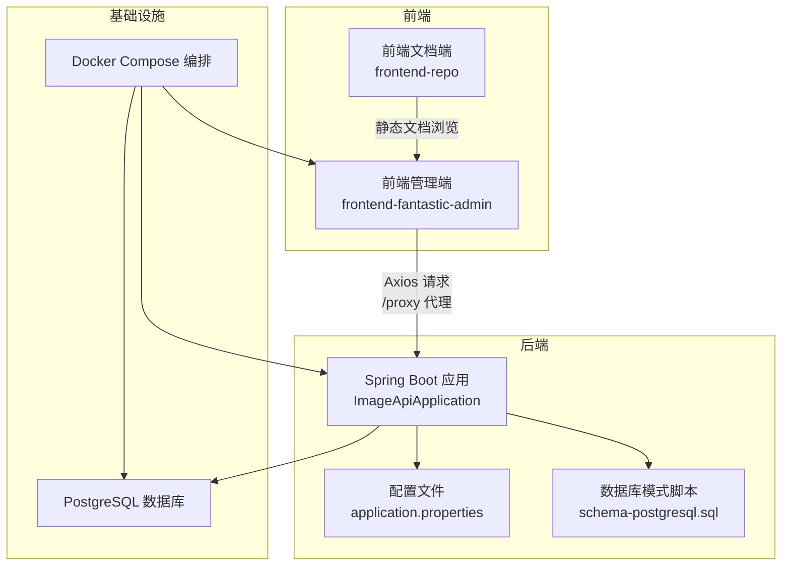
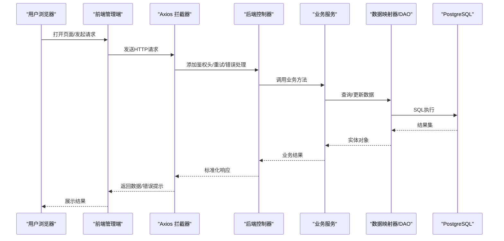
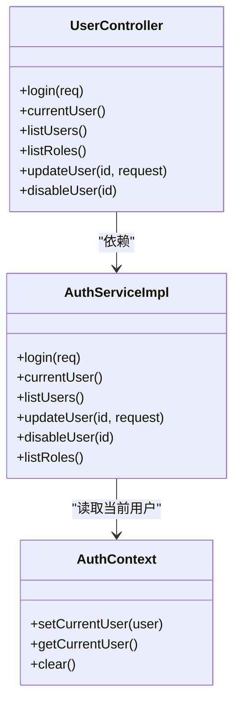
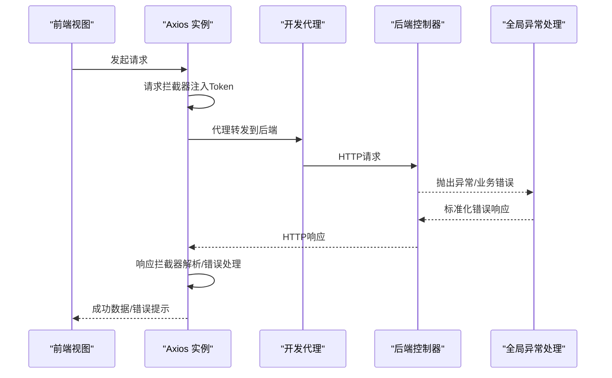
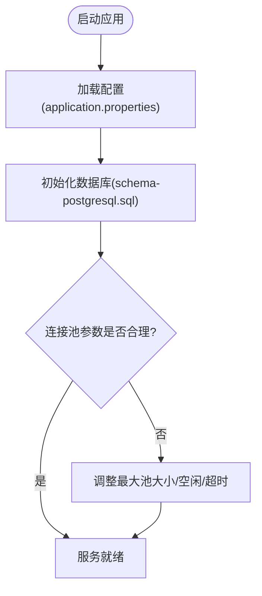
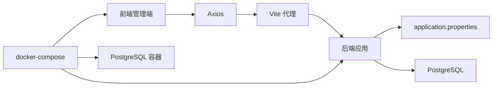

# 故障排除与FAQ

**本文引用的文件**
- [ImageApiApplication.java](file://backend-repo/src/main/java/com/zjcxph/imgapi/ImageApiApplication.java)
- [application.properties](file://backend-repo/src/main/resources/application.properties)
- [errors.txt](file://backend-repo/errors.txt)
- [GlobalExceptionHandler.java](file://backend-repo/src/main/java/com/zjcxph/imgapi/handler/GlobalExceptionHandler.java)
- [BusinessException.java](file://backend-repo/src/main/java/com/zjcxph/imgapi/exception/BusinessException.java)
- [schema-postgresql.sql](file://backend-repo/src/main/resources/schema-postgresql.sql)
- [API_CONTRACT.md](file://backend-repo/API_CONTRACT.md)
- [index.ts（前端API封装）](file://frontend-fantastic-admin/src/api/index.ts)
- [main.ts（前端入口）](file://frontend-fantastic-admin/src/main.ts)
- [vite.config.ts（前端代理配置）](file://frontend-fantastic-admin/vite.config.ts)
- [UserController.java](file://backend-repo/src/main/java/com/zjcxph/imgapi/controller/UserController.java)
- [AuthServiceImpl.java](file://backend-repo/src/main/java/com/zjcxph/imgapi/service/impl/AuthServiceImpl.java)
- [AuthContext.java](file://backend-repo/src/main/java/com/zjcxph/imgapi/utils/AuthContext.java)
- [docker-compose.yml](file://docker-compose.yml)

## 目录
1. [简介](#简介)
2. [项目结构](#项目结构)
3. [核心组件](#核心组件)
4. [架构总览](#架构总览)
5. [详细组件分析](#详细组件分析)
6. [依赖分析](#依赖分析)
7. [性能考虑](#性能考虑)
8. [故障排除指南](#故障排除指南)
9. [结论](#结论)
10. [附录](#附录)

## 简介
本指南面向用户与开发者，提供MRR系统的系统化故障排除与常见问题解答。内容覆盖数据库连接问题、API调用失败、前端加载错误、权限与认证异常、文件上传与导出异常、日志分析方法、性能瓶颈识别与内存泄漏检测，并给出不同环境下的排查清单与工具使用建议。

## 项目结构
MRR系统由三部分组成：后端Spring Boot应用、前端Vite应用以及PostgreSQL数据库。系统通过docker-compose进行编排，后端负责认证、扫描记录、统计与日志等核心能力；前端提供管理与查询界面；数据库存储业务数据与访问日志。

图表来源
- [ImageApiApplication.java:1-20](file://backend-repo/src/main/java/com/zjcxph/imgapi/ImageApiApplication.java#L1-L20)
- [application.properties:1-49](file://backend-repo/src/main/resources/application.properties#L1-L49)
- [schema-postgresql.sql:1-109](file://backend-repo/src/main/resources/schema-postgresql.sql#L1-L109)
- [docker-compose.yml:1-47](file://docker-compose.yml#L1-L47)

章节来源
- [ImageApiApplication.java:1-20](file://backend-repo/src/main/java/com/zjcxph/imgapi/ImageApiApplication.java#L1-L20)
- [application.properties:1-49](file://backend-repo/src/main/resources/application.properties#L1-L49)
- [schema-postgresql.sql:1-109](file://backend-repo/src/main/resources/schema-postgresql.sql#L1-L109)
- [docker-compose.yml:1-47](file://docker-compose.yml#L1-L47)

## 核心组件
- 后端应用启动器：负责Spring Boot应用初始化与组件扫描。
- 配置中心：集中管理运行参数（端口、数据库连接、日志、图像服务凭据、清理策略、加密密钥等）。
- 异常处理：统一捕获业务异常、参数校验异常、非法参数/状态异常与通用异常，返回标准化响应。
- 数据库模式：定义扫描记录、统计、患者、用户、角色、访问日志等表及索引。
- 前端API封装：Axios实例、拦截器、重试机制、错误提示与鉴权头注入。
- 前端入口与代理：应用挂载、图标与UI资源加载、开发代理规则。
- 认证与权限：登录、当前用户、用户与角色列表、更新与禁用用户；基于注解的权限控制。

章节来源
- [GlobalExceptionHandler.java:1-62](file://backend-repo/src/main/java/com/zjcxph/imgapi/handler/GlobalExceptionHandler.java#L1-L62)
- [BusinessException.java:1-20](file://backend-repo/src/main/java/com/zjcxph/imgapi/exception/BusinessException.java#L1-L20)
- [schema-postgresql.sql:1-109](file://backend-repo/src/main/resources/schema-postgresql.sql#L1-L109)
- [index.ts（前端API封装）:1-118](file://frontend-fantastic-admin/src/api/index.ts#L1-L118)
- [main.ts（前端入口）:1-33](file://frontend-fantastic-admin/src/main.ts#L1-L33)
- [vite.config.ts（前端代理配置）:1-64](file://frontend-fantastic-admin/vite.config.ts#L1-L64)
- [UserController.java:1-95](file://backend-repo/src/main/java/com/zjcxph/imgapi/controller/UserController.java#L1-L95)
- [AuthServiceImpl.java:1-151](file://backend-repo/src/main/java/com/zjcxph/imgapi/service/impl/AuthServiceImpl.java#L1-L151)
- [AuthContext.java:1-28](file://backend-repo/src/main/java/com/zjcxph/imgapi/utils/AuthContext.java#L1-L28)

## 架构总览
后端采用分层架构：控制器层接收HTTP请求，服务层执行业务逻辑，持久层通过MyBatis访问数据库；全局异常处理器统一输出错误；前后端通过代理转发到后端/v1与/v2路径。

图表来源
- [API_CONTRACT.md:1-44](file://backend-repo/API_CONTRACT.md#L1-L44)
- [index.ts（前端API封装）:1-118](file://frontend-fantastic-admin/src/api/index.ts#L1-L118)
- [UserController.java:1-95](file://backend-repo/src/main/java/com/zjcxph/imgapi/controller/UserController.java#L1-L95)
- [AuthServiceImpl.java:1-151](file://backend-repo/src/main/java/com/zjcxph/imgapi/service/impl/AuthServiceImpl.java#L1-L151)
- [schema-postgresql.sql:1-109](file://backend-repo/src/main/resources/schema-postgresql.sql#L1-L109)

## 详细组件分析

### 组件A：认证与权限（后端）
- 登录流程：接收用户名/密码，校验状态，验证密码哈希，更新最近登录时间，签发JWT并封装会话信息。
- 权限控制：基于注解的权限检查，要求具备相应权限才可访问用户/角色管理接口。
- 会话上下文：线程本地存储当前用户，便于服务层读取。

图表来源
- [UserController.java:1-95](file://backend-repo/src/main/java/com/zjcxph/imgapi/controller/UserController.java#L1-L95)
- [AuthServiceImpl.java:1-151](file://backend-repo/src/main/java/com/zjcxph/imgapi/service/impl/AuthServiceImpl.java#L1-L151)
- [AuthContext.java:1-28](file://backend-repo/src/main/java/com/zjcxph/imgapi/utils/AuthContext.java#L1-L28)

章节来源
- [UserController.java:1-95](file://backend-repo/src/main/java/com/zjcxph/imgapi/controller/UserController.java#L1-L95)
- [AuthServiceImpl.java:1-151](file://backend-repo/src/main/java/com/zjcxph/imgapi/service/impl/AuthServiceImpl.java#L1-L151)
- [AuthContext.java:1-28](file://backend-repo/src/main/java/com/zjcxph/imgapi/utils/AuthContext.java#L1-L28)

### 组件B：API调用流程（前端）
- Axios实例：设置基础URL、超时、响应类型；支持开发环境代理与生产环境直接域名。
- 请求拦截：自动注入Authorization头（Bearer Token）。
- 响应拦截：解析后端返回的统一结构，区分status/code字段；对401进行登出处理；对4xx/5xx弹出错误提示。
- 错误消息：根据响应内容与网络错误类型生成友好提示；支持有限次重试。

图表来源
- [index.ts（前端API封装）:1-118](file://frontend-fantastic-admin/src/api/index.ts#L1-L118)
- [vite.config.ts（前端代理配置）:1-64](file://frontend-fantastic-admin/vite.config.ts#L1-L64)
- [GlobalExceptionHandler.java:1-62](file://backend-repo/src/main/java/com/zjcxph/imgapi/handler/GlobalExceptionHandler.java#L1-L62)

章节来源
- [index.ts（前端API封装）:1-118](file://frontend-fantastic-admin/src/api/index.ts#L1-L118)
- [vite.config.ts（前端代理配置）:1-64](file://frontend-fantastic-admin/vite.config.ts#L1-L64)

### 组件C：数据库连接与模式（后端）
- 连接参数：通过环境变量注入，支持Hikari连接池参数调整；初始化SQL脚本按PostgreSQL平台执行。
- 模式与索引：定义扫描记录、统计、患者、用户、角色、访问日志等表及常用索引；插入默认角色与用户数据。
- 日志保留：可通过配置启用访问日志清理任务（Cron表达式）。

图表来源
- [application.properties:1-49](file://backend-repo/src/main/resources/application.properties#L1-L49)
- [schema-postgresql.sql:1-109](file://backend-repo/src/main/resources/schema-postgresql.sql#L1-L109)

章节来源
- [application.properties:1-49](file://backend-repo/src/main/resources/application.properties#L1-L49)
- [schema-postgresql.sql:1-109](file://backend-repo/src/main/resources/schema-postgresql.sql#L1-L109)

## 依赖分析
- 后端应用依赖Spring Boot、MyBatis Mapper扫描、调度与配置属性扫描；数据库驱动为PostgreSQL。
- 前端依赖Vue生态、Element Plus图标、UnoCSS、Axios；开发代理将/api/*等路由转发至后端。
- docker-compose编排PostgreSQL、后端与前端服务，定义健康检查与端口映射。

图表来源
- [main.ts（前端入口）:1-33](file://frontend-fantastic-admin/src/main.ts#L1-L33)
- [vite.config.ts（前端代理配置）:1-64](file://frontend-fantastic-admin/vite.config.ts#L1-L64)
- [ImageApiApplication.java:1-20](file://backend-repo/src/main/java/com/zjcxph/imgapi/ImageApiApplication.java#L1-L20)
- [application.properties:1-49](file://backend-repo/src/main/resources/application.properties#L1-L49)
- [docker-compose.yml:1-47](file://docker-compose.yml#L1-L47)

章节来源
- [ImageApiApplication.java:1-20](file://backend-repo/src/main/java/com/zjcxph/imgapi/ImageApiApplication.java#L1-L20)
- [vite.config.ts（前端代理配置）:1-64](file://frontend-fantastic-admin/vite.config.ts#L1-L64)
- [docker-compose.yml:1-47](file://docker-compose.yml#L1-L47)

## 性能考虑
- 连接池与超时：合理设置最大池大小、最小空闲、连接超时与空闲超时，避免高并发下连接争用。
- 响应压缩：开启Gzip压缩，减少小体积JSON响应的传输开销。
- 缓存策略：静态资源缓存一年，降低带宽与服务器压力。
- 索引优化：确保高频查询字段（如BAH、BRXH、日期、类型、IP、URI、方法、状态）有合适索引。
- 日志轮转：限制单文件大小，避免磁盘膨胀影响IO。
- 前端超时：请求超时设置为1分钟，避免长时间占用连接。
- 导出与批量下载：后端批量下载接口返回二进制流，注意内存与网络峰值。

章节来源
- [application.properties:1-49](file://backend-repo/src/main/resources/application.properties#L1-L49)
- [schema-postgresql.sql:1-109](file://backend-repo/src/main/resources/schema-postgresql.sql#L1-L109)
- [index.ts（前端API封装）:1-118](file://frontend-fantastic-admin/src/api/index.ts#L1-L118)

## 故障排除指南

### 一、数据库连接问题
- 症状
  - 启动时报数据库连接失败或初始化SQL执行异常。
  - 数据库不可达或凭证错误。
- 排查步骤
  - 检查数据库容器健康状态与端口映射。
  - 核对数据源URL、用户名、密码与当前Schema。
  - 确认初始化脚本已正确执行，表与索引存在。
  - 查看连接池参数是否合理，避免连接耗尽。
- 解决方案
  - 使用docker-compose健康检查确认PostgreSQL可用。
  - 在application.properties中修正数据源配置。
  - 如需自定义Schema，确保URL包含currentSchema参数。
  - 调整Hikari连接池参数以适配负载。
- 相关配置
  - 数据源URL、用户名、密码、驱动、连接池参数、初始化脚本位置。

章节来源
- [docker-compose.yml:1-47](file://docker-compose.yml#L1-L47)
- [application.properties:10-22](file://backend-repo/src/main/resources/application.properties#L10-L22)
- [schema-postgresql.sql:1-109](file://backend-repo/src/main/resources/schema-postgresql.sql#L1-L109)

### 二、API调用失败
- 症状
  - 前端提示“接口XX异常”、“请求超时”、“后端网络异常”。
  - 后端返回400/401/403/500等错误码。
- 排查步骤
  - 检查前端代理配置是否正确转发到后端/v1与/v2路径。
  - 确认后端端口与容器映射一致。
  - 查看后端日志中的异常栈与业务异常信息。
  - 核对请求头Authorization是否正确注入。
- 解决方案
  - 修正Vite代理规则，确保/api/*与/searchApi/*映射到后端对应路径。
  - 确保后端端口在application.properties中正确配置。
  - 对401错误触发登出流程，重新登录获取有效Token。
  - 对400/403错误，检查参数与权限范围。
- 相关配置
  - API契约、前端代理、后端端口、全局异常处理。

章节来源
- [API_CONTRACT.md:1-44](file://backend-repo/API_CONTRACT.md#L1-L44)
- [vite.config.ts（前端代理配置）:25-31](file://frontend-fantastic-admin/vite.config.ts#L25-L31)
- [application.properties:2-6](file://backend-repo/src/main/resources/application.properties#L2-L6)
- [GlobalExceptionHandler.java:1-62](file://backend-repo/src/main/java/com/zjcxph/imgapi/handler/GlobalExceptionHandler.java#L1-L62)
- [index.ts（前端API封装）:40-63](file://frontend-fantastic-admin/src/api/index.ts#L40-L63)

### 三、前端加载错误
- 症状
  - 页面空白、图标未加载、样式缺失、控制台报错。
- 排查步骤
  - 检查静态资源与图标加载路径。
  - 确认开发服务器代理与构建产物目录。
  - 核对全局样式与UI组件注册。
- 解决方案
  - 确保main.ts中图标与UI Provider正确挂载。
  - 检查Vite别名与CSS预处理配置。
  - 生产环境确认dist目录构建完成且Nginx/静态服务器正确部署。
- 相关配置
  - 前端入口、代理、样式与插件。

章节来源
- [main.ts（前端入口）:1-33](file://frontend-fantastic-admin/src/main.ts#L1-L33)
- [vite.config.ts（前端代理配置）:1-64](file://frontend-fantastic-admin/vite.config.ts#L1-L64)

### 四、用户权限问题
- 症状
  - 提示“无权限访问”或无法访问用户/角色管理接口。
- 排查步骤
  - 检查当前用户角色与权限字符串。
  - 确认控制器上权限注解与实际权限匹配。
  - 核对用户状态是否为激活。
- 解决方案
  - 使用具备“user:manage”或“role:read”的账户登录。
  - 确保用户状态为active。
  - 如权限不足，联系管理员调整角色权限。
- 相关实现
  - 控制器权限注解、服务层用户状态校验、权限分割逻辑。

章节来源
- [UserController.java:60-93](file://backend-repo/src/main/java/com/zjcxph/imgapi/controller/UserController.java#L60-L93)
- [AuthServiceImpl.java:45-54](file://backend-repo/src/main/java/com/zjcxph/imgapi/service/impl/AuthServiceImpl.java#L45-L54)
- [schema-postgresql.sql:41-96](file://backend-repo/src/main/resources/schema-postgresql.sql#L41-L96)

### 五、文件上传与导出异常
- 症状
  - 批量下载返回空或失败；图片预览/下载路径错误。
- 排查步骤
  - 检查后端图像服务基础路径与凭据。
  - 确认文件夹与文件名参数传递正确。
  - 核对后端返回的二进制流格式。
- 解决方案
  - 在application.properties中配置image.basePath与凭据。
  - 按API契约传入正确的BAH/BRXH/FOLDER/FILENAME参数。
  - 对批量下载接口，确保ids数组非空且格式正确。
- 相关配置
  - 图像服务URL与凭据、API契约。

章节来源
- [application.properties:30-33](file://backend-repo/src/main/resources/application.properties#L30-L33)
- [API_CONTRACT.md:17-38](file://backend-repo/API_CONTRACT.md#L17-L38)

### 六、日志分析方法
- 后端日志
  - 查看img-api.log，定位异常堆栈与业务警告。
  - 关注访问日志表中的URI、方法、状态码、客户端IP、执行时间。
- 前端日志
  - 浏览器控制台查看Axios拦截器抛出的错误信息。
  - 使用网络面板确认请求/响应详情与状态码。
- 日志保留
  - 可通过配置启用定时清理访问日志，避免磁盘占用过高。

章节来源
- [application.properties:24-45](file://backend-repo/src/main/resources/application.properties#L24-L45)
- [schema-postgresql.sql:61-88](file://backend-repo/src/main/resources/schema-postgresql.sql#L61-L88)
- [index.ts（前端API封装）:22-38](file://frontend-fantastic-admin/src/api/index.ts#L22-L38)

### 七、性能瓶颈识别
- 数据库层面
  - 检查慢查询与缺少索引的字段，必要时补充索引。
  - 观察连接池使用率，避免连接数过多导致排队。
- 应用层面
  - 关注接口平均响应时间与错误率，定位热点接口。
  - 启用压缩与静态资源缓存，减少带宽与CPU消耗。
- 前端层面
  - 分析首屏加载时间与资源体积，优化打包与懒加载。
- 工具建议
  - 使用数据库性能分析工具与Prometheus/Grafana监控。
  - 使用浏览器性能面板与网络面板定位前端问题。

章节来源
- [application.properties:1-49](file://backend-repo/src/main/resources/application.properties#L1-L49)
- [schema-postgresql.sql:75-89](file://backend-repo/src/main/resources/schema-postgresql.sql#L75-L89)

### 八、内存泄漏检测
- 现象
  - 长时间运行后内存持续增长，GC回收效果差。
- 排查步骤
  - 检查线程本地变量是否正确清理（如AuthContext）。
  - 关注大对象持有与集合未释放。
  - 分析堆快照，定位不可达但仍被引用的对象。
- 解决方案
  - 在请求结束时清理ThreadLocal上下文。
  - 避免在静态容器中缓存请求上下文。
  - 使用内存分析工具进行根因定位。

章节来源
- [AuthContext.java:1-28](file://backend-repo/src/main/java/com/zjcxph/imgapi/utils/AuthContext.java#L1-L28)

### 九、不同环境下的排查清单
- 开发环境
  - 确认Vite代理生效，端口开放，前端可访问后端/v1与/v2。
  - application.properties中端口与数据源配置正确。
- 测试/生产环境
  - 确认容器健康检查通过，端口映射正确。
  - 检查日志轮转与磁盘空间，避免IO阻塞。
  - 校验TLS/反向代理配置与跨域策略。
- 容器编排
  - docker-compose中数据库、后端、前端服务顺序与依赖满足。
  - 环境变量覆盖正确，敏感信息不硬编码。

章节来源
- [docker-compose.yml:1-47](file://docker-compose.yml#L1-L47)
- [application.properties:1-49](file://backend-repo/src/main/resources/application.properties#L1-L49)
- [vite.config.ts（前端代理配置）:25-31](file://frontend-fantastic-admin/vite.config.ts#L25-L31)

### 十、常见错误与解决方案速查
- 编译错误（找不到类）
  - 现象：编译期找不到某个类，导致构建失败。
  - 处理：检查类是否存在、包路径是否正确、依赖是否完整。
  - 参考：errors.txt中的编译错误记录。
- 参数校验失败
  - 现象：返回400，提示参数校验失败。
  - 处理：检查必填字段与格式，确保前端传参符合后端约束。
- 业务异常
  - 现象：返回业务错误码与消息。
  - 处理：根据错误码与消息提示，修正操作或联系管理员。
- 通用异常
  - 现象：返回500，提示服务器异常。
  - 处理：查看后端日志定位具体异常，修复代码或配置。

章节来源
- [errors.txt:32-46](file://backend-repo/errors.txt#L32-L46)
- [GlobalExceptionHandler.java:32-59](file://backend-repo/src/main/java/com/zjcxph/imgapi/handler/GlobalExceptionHandler.java#L32-L59)
- [BusinessException.java:1-20](file://backend-repo/src/main/java/com/zjcxph/imgapi/exception/BusinessException.java#L1-L20)

## 结论
通过本指南，用户与开发者可以系统地定位与解决MRR系统在数据库连接、API调用、前端加载、权限与认证、文件上传与导出等方面的常见问题。建议在日常运维中结合日志分析、性能监控与容器健康检查，形成闭环的故障预防与快速恢复机制。

## 附录
- API契约摘要
  - 登录：POST /login，返回登录结果。
  - 图像：GET /v1/img-api/{bah}、/download/{BAH}、/image/{BAH}/{BRXH}/{FOLDER}/{FILENAME}、PUT /updateImageType/{id}。
  - 搜索：GET /v2/search/getBAHByID/{idCard}、兼容接口。
  - 扫描记录：GET/PUT/DELETE /v1/scan-api/{id}、POST /v1/scan-api/batch-download。
- 前端代理规则
  - /api/* → 后端/v1/*
  - /searchApi/* → 后端/v2/*
  - /loginApi → 后端/login

章节来源
- [API_CONTRACT.md:1-44](file://backend-repo/API_CONTRACT.md#L1-L44)
- [vite.config.ts（前端代理配置）:25-31](file://frontend-fantastic-admin/vite.config.ts#L25-L31)