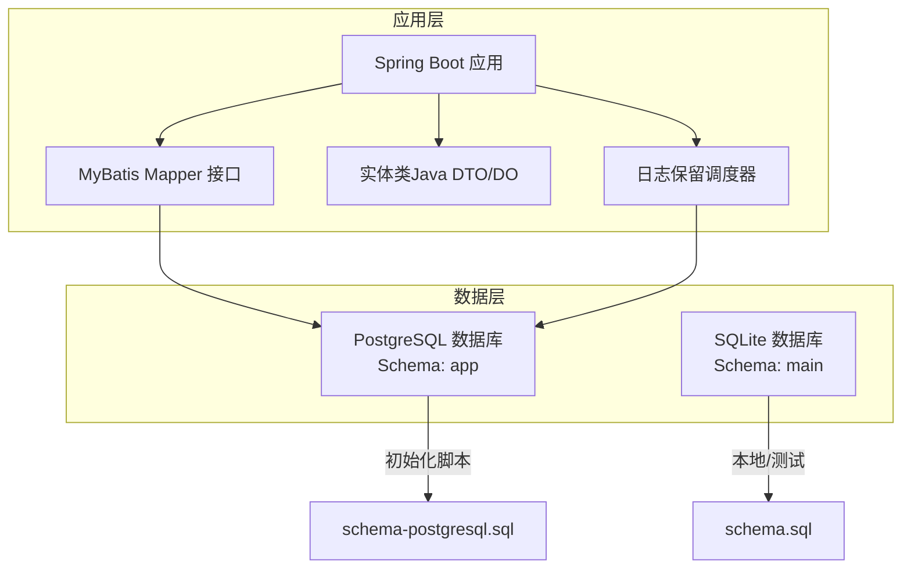
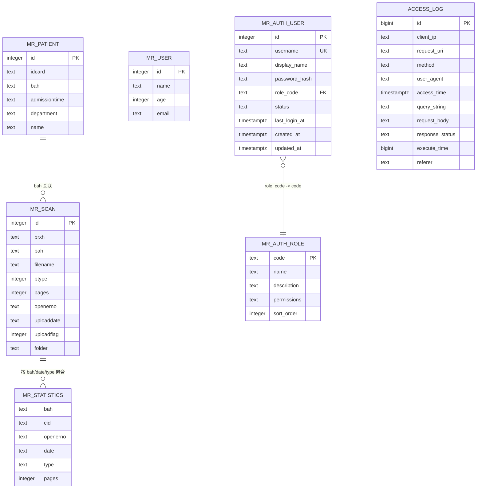
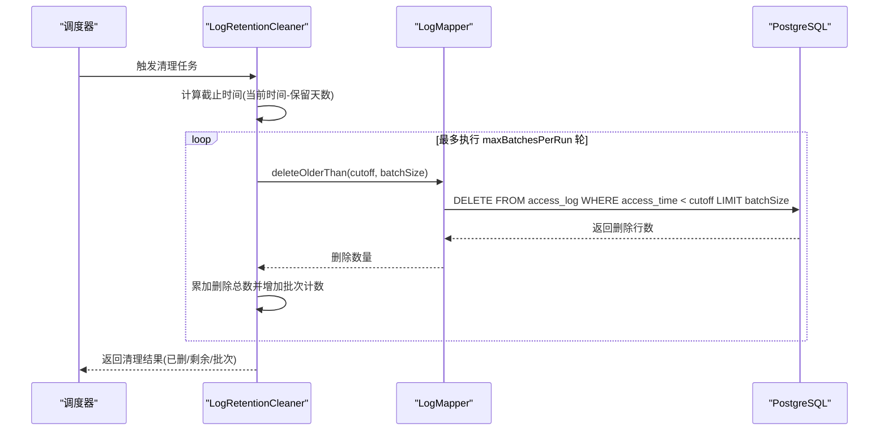
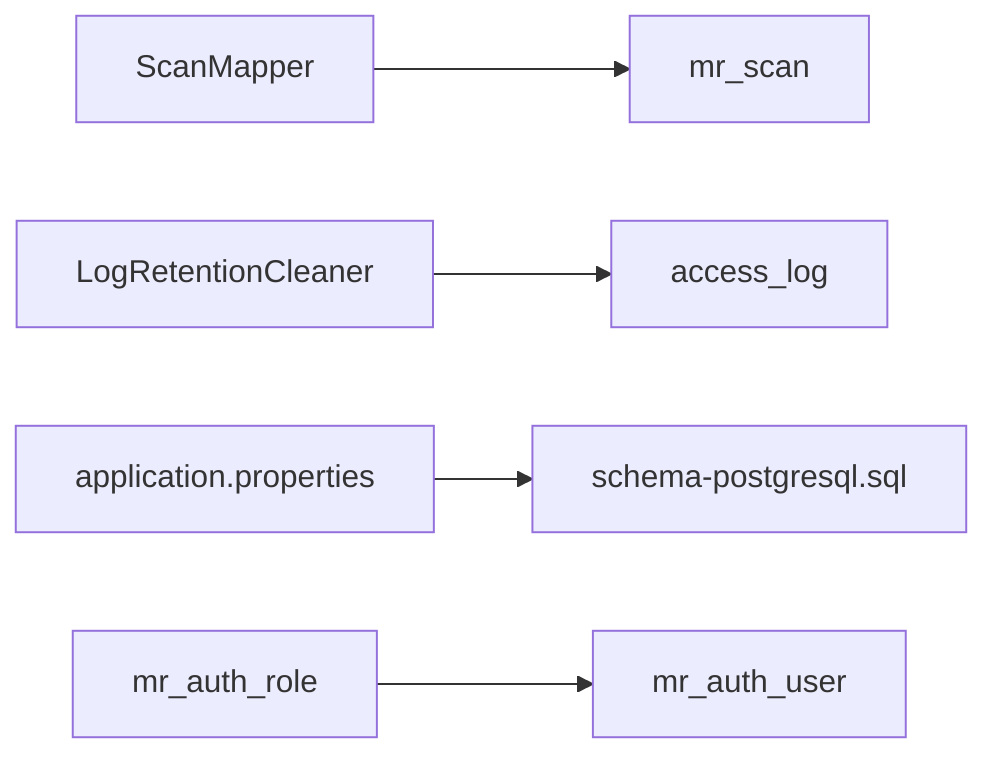

# 数据库设计

**本文引用的文件**
- [schema-postgresql.sql](file://backend-repo/src/main/resources/schema-postgresql.sql)
- [schema.sql](file://mrr-db/schema.sql)
- [application.properties](file://backend-repo/src/main/resources/application.properties)
- [Scan.java](file://backend-repo/src/main/java/com/zjcxph/imgapi/entity/Scan.java)
- [Patient.java](file://backend-repo/src/main/java/com/zjcxph/imgapi/entity/Patient.java)
- [Statistics.java](file://backend-repo/src/main/java/com/zjcxph/imgapi/entity/Statistics.java)
- [AuthUser.java](file://backend-repo/src/main/java/com/zjcxph/imgapi/entity/AuthUser.java)
- [AuthRole.java](file://backend-repo/src/main/java/com/zjcxph/imgapi/entity/AuthRole.java)
- [Log.java](file://backend-repo/src/main/java/com/zjcxph/imgapi/entity/Log.java)
- [ScanMapper.java](file://backend-repo/src/main/java/com/zjcxph/imgapi/mapper/ScanMapper.java)
- [LogRetentionProperties.java](file://backend-repo/src/main/java/com/zjcxph/imgapi/config/LogRetentionProperties.java)
- [LogRetentionCleaner.java](file://backend-repo/src/main/java/com/zjcxph/imgapi/scheduler/LogRetentionCleaner.java)
- [reset-br-admin-password.sql](file://backend-repo/src/main/resources/reset-br-admin-password.sql)

## 目录
1. [简介](#简介)
2. [项目结构](#项目结构)
3. [核心组件](#核心组件)
4. [架构总览](#架构总览)
5. [详细组件分析](#详细组件分析)
6. [依赖分析](#依赖分析)
7. [性能考虑](#性能考虑)
8. [故障排查指南](#故障排查指南)
9. [结论](#结论)
10. [附录](#附录)

## 简介
本文件为 MRR（病案与影像检索）系统的数据库设计文档，聚焦于核心业务表（mr_scan、mr_patient、mr_statistics、mr_user、mr_auth_user、mr_auth_role）与访问日志表（access_log）的实体关系、字段定义、数据类型、主键/外键、索引与约束、数据验证与业务规则、数据访问模式、缓存策略、性能考量、数据生命周期与保留策略、归档规则、数据迁移路径与版本管理、以及数据安全与隐私要求。文档同时提供数据库架构图与示例数据，帮助开发者与运维人员快速理解并正确使用该数据库。

## 项目结构
后端采用 Spring Boot + MyBatis 访问 PostgreSQL，数据库初始化脚本位于 resources 目录中；SQLite 的 schema.sql 用于本地或轻量环境；应用通过 application.properties 配置连接池、SQL 初始化与日志保留策略；核心实体类映射到数据库表，Mapper 提供 CRUD 与分页查询接口；日志清理通过定时任务执行。

图表来源
- [application.properties:10-22](file://backend-repo/src/main/resources/application.properties#L10-L22)
- [schema-postgresql.sql:1-109](file://backend-repo/src/main/resources/schema-postgresql.sql#L1-L109)
- [schema.sql:1-95](file://mrr-db/schema.sql#L1-L95)

章节来源
- [application.properties:10-22](file://backend-repo/src/main/resources/application.properties#L10-L22)
- [schema-postgresql.sql:1-109](file://backend-repo/src/main/resources/schema-postgresql.sql#L1-L109)
- [schema.sql:1-95](file://mrr-db/schema.sql#L1-L95)

## 核心组件
本节概述核心业务表与日志表的职责与关系：
- mr_scan：存储病案扫描记录，包括病案号、病人序号、文件名、页数、上传时间、文件夹等。
- mr_patient：存储患者基本信息（身份证号、病案号、姓名、入院时间、科室）。
- mr_statistics：存储按日期、类型、操作员等维度的统计聚合数据。
- mr_user：通用用户信息（名称、年龄、邮箱），可作为扩展用户表。
- mr_auth_user：认证用户表，包含用户名、显示名、密码哈希、角色编码、状态、登录时间与时间戳。
- mr_auth_role：角色表，包含角色编码、名称、描述、权限集合与排序。
- access_log：访问日志表，记录请求 URI、方法、客户端 IP、UA、响应状态、执行时间等。

章节来源
- [schema-postgresql.sql:3-73](file://backend-repo/src/main/resources/schema-postgresql.sql#L3-L73)
- [schema.sql:16-78](file://mrr-db/schema.sql#L16-L78)

## 架构总览
下图展示数据库架构、表间关系与典型访问流程：

图表来源
- [schema-postgresql.sql:3-73](file://backend-repo/src/main/resources/schema-postgresql.sql#L3-L73)
- [schema.sql:16-78](file://mrr-db/schema.sql#L16-L78)

## 详细组件分析

### 表：mr_scan（病案扫描记录）
- 设计理念：以“病案号”为主要检索维度，支持按“病人序号”、“文件名”、“文件夹”、“页数”、“上传标志”等条件过滤；提供动态更新与批量删除能力。
- 字段与类型：整型主键、文本标识符（病案号/病人序号/文件名/文件夹）、整型类型与页数、文本上传时间、整型上传标志。
- 主键/外键：主键 id；无外键。
- 索引：按病案号与病人序号建立索引，便于高频查询。
- 约束：无显式约束，但业务上建议对关键字段设置非空与唯一性约束（如 filename 唯一性）。
- 业务规则：
  - uploadflag 为 0 表示逻辑删除；
  - pages 与 btype 用于统计与分类；
  - folder 与 filename 组合决定文件路径定位。
- 示例数据（示意）：
  - id: 1001, brxh: "BR2024001", bah: "BA123456", filename: "scan_001.jpg", btype: 1, pages: 20, openerno: "OP001", uploaddate: "2024-01-01 10:00:00", uploadflag: 1, folder: "2024/01"

章节来源
- [schema-postgresql.sql:3-14](file://backend-repo/src/main/resources/schema-postgresql.sql#L3-L14)
- [schema.sql:26-38](file://mrr-db/schema.sql#L26-L38)
- [Scan.java:10-21](file://backend-repo/src/main/java/com/zjcxph/imgapi/entity/Scan.java#L10-L21)
- [ScanMapper.java:17-96](file://backend-repo/src/main/java/com/zjcxph/imgapi/mapper/ScanMapper.java#L17-L96)

### 表：mr_patient（患者信息）
- 设计理念：存储患者身份与入院信息，与扫描记录通过病案号关联。
- 字段与类型：整型主键、身份证号、病案号、入院时间、科室、姓名。
- 主键/外键：主键 id；无外键。
- 索引：按身份证号建立索引，便于快速查找。
- 约束：无显式约束。
- 业务规则：身份证号可用于唯一识别；入院时间与科室用于统计与查询过滤。
- 示例数据（示意）：
  - id: 1, idcard: "330101199001011234", bah: "BA123456", name: "张三", admissiontime: "2024-01-01", department: "心内科"

章节来源
- [schema-postgresql.sql:25-32](file://backend-repo/src/main/resources/schema-postgresql.sql#L25-L32)
- [schema.sql:16-24](file://mrr-db/schema.sql#L16-L24)
- [Patient.java:6-19](file://backend-repo/src/main/java/com/zjcxph/imgapi/entity/Patient.java#L6-L19)

### 表：mr_statistics（统计聚合）
- 设计理念：按日期、类型、操作员等维度汇总扫描页数，支撑报表与统计分析。
- 字段与类型：病案号、客户编号、操作员号、日期、类型、页数。
- 主键/外键：无主键；复合维度用于统计。
- 索引：按病案号、日期、类型建立索引，提升统计查询效率。
- 约束：无显式约束。
- 业务规则：pages 为累计值；bah/type/openerno/date 组合用于分组统计。
- 示例数据（示意）：
  - bah: "BA123456", cid: "CID001", openerno: "OP001", date: "2024-01-01", type: "CT", pages: 45

章节来源
- [schema-postgresql.sql:16-23](file://backend-repo/src/main/resources/schema-postgresql.sql#L16-L23)
- [schema.sql:40-48](file://mrr-db/schema.sql#L40-L48)
- [Statistics.java:6-12](file://backend-repo/src/main/java/com/zjcxph/imgapi/entity/Statistics.java#L6-L12)

### 表：mr_user（通用用户）
- 设计理念：通用用户信息表，可扩展为更细粒度的用户域。
- 字段与类型：整型主键、姓名、年龄、邮箱。
- 主键/外键：主键 id；无外键。
- 索引：无专用索引。
- 约束：无显式约束。
- 业务规则：与认证用户表解耦，避免与权限模型混杂。
- 示例数据（示意）：
  - id: 1, name: "李四", age: 30, email: "lisi@example.com"

章节来源
- [schema-postgresql.sql:34-39](file://backend-repo/src/main/resources/schema-postgresql.sql#L34-L39)
- [schema.sql:50-56](file://mrr-db/schema.sql#L50-L56)

### 表：mr_auth_user（认证用户）
- 设计理念：集中管理认证用户，与角色表通过角色编码关联。
- 字段与类型：自增主键、用户名（唯一）、显示名、密码哈希、角色编码（外键）、状态、最后登录时间、创建/更新时间。
- 主键/外键：主键 id；role_code 引用 mr_auth_role(code)，级联更新。
- 索引：按用户名、角色编码建立索引。
- 约束：用户名唯一；默认状态 active；创建/更新时间默认当前时间。
- 业务规则：密码哈希存储；角色编码决定权限集合；状态控制账户启用。
- 示例数据（示意）：
  - id: 1, username: "doctor1", display_name: "值班医生", role_code: "DOCTOR", status: "active", created_at: "2024-01-01 00:00:00"

章节来源
- [schema-postgresql.sql:49-59](file://backend-repo/src/main/resources/schema-postgresql.sql#L49-L59)
- [schema.sql:67-78](file://mrr-db/schema.sql#L67-L78)
- [AuthUser.java:13-24](file://backend-repo/src/main/java/com/zjcxph/imgapi/entity/AuthUser.java#L13-L24)

### 表：mr_auth_role（角色）
- 设计理念：集中管理角色与权限，支持权限字符串解析。
- 字段与类型：角色编码（主键）、名称、描述、权限集合、排序。
- 主键/外键：主键 code；无外键。
- 索引：无专用索引。
- 约束：权限集合非空；排序默认 0。
- 业务规则：权限以逗号分隔的字符串表示；应用侧解析为权限列表。
- 示例数据（示意）：
  - code: "DOCTOR", name: "Doctor", permissions: "record:read,record:edit,search:read,statistics:read", sort_order: 2

章节来源
- [schema-postgresql.sql:41-47](file://backend-repo/src/main/resources/schema-postgresql.sql#L41-L47)
- [schema.sql:58-65](file://mrr-db/schema.sql#L58-L65)
- [AuthRole.java:6-11](file://backend-repo/src/main/java/com/zjcxph/imgapi/entity/AuthRole.java#L6-L11)

### 表：access_log（访问日志）
- 设计理念：记录系统访问行为，支持按时间、URI、方法、状态等维度查询与清理。
- 字段与类型：自增主键、客户端 IP、请求 URI、方法、UA、访问时间、查询串、请求体、响应状态、执行时间、Referer。
- 主键/外键：主键 id；无外键。
- 索引：按访问时间（降序/升序组合）、客户端 IP、请求 URI、方法、响应状态、方法+状态组合建立索引。
- 约束：无显式约束。
- 业务规则：执行时间与响应状态用于性能与异常监控；支持定期清理。
- 示例数据（示意）：
  - id: 10001, client_ip: "192.168.1.100", request_uri: "/api/scans", method: "GET", response_status: "200", execute_time: 120

章节来源
- [schema-postgresql.sql:61-73](file://backend-repo/src/main/resources/schema-postgresql.sql#L61-L73)
- [schema.sql:1-14](file://mrr-db/schema.sql#L1-L14)
- [Log.java:8-19](file://backend-repo/src/main/java/com/zjcxph/imgapi/entity/Log.java#L8-L19)

### 数据访问模式与缓存策略
- 访问模式：
  - MyBatis Mapper 提供基于条件的动态查询、分页查询与计数；支持按病案号、病人序号、文件名、文件夹、页数、类型、上传标志等字段过滤。
  - 读写分离与连接池：通过 HikariCP 连接池配置最大池大小、最小空闲、连接超时等参数，确保高并发下的稳定性。
- 缓存策略：
  - 应用层未见显式缓存配置；可通过 Redis 或本地缓存缓存热点查询结果（如按病案号的扫描列表）。
  - 对于高频统计查询，可在应用层进行结果缓存，并设置合理过期时间。

章节来源
- [ScanMapper.java:17-129](file://backend-repo/src/main/java/com/zjcxph/imgapi/mapper/ScanMapper.java#L17-L129)
- [application.properties:15-19](file://backend-repo/src/main/resources/application.properties#L15-L19)

### 性能考量
- 索引优化：
  - mr_scan：按 bah、brxh 建立索引，加速按病案号与病人序号的查询。
  - mr_statistics：按 bah、date、type 建立索引，提升统计查询性能。
  - access_log：按 access_time、client_ip、request_uri、method、response_status 建立索引，支持日志检索与清理。
- 查询优化：
  - 使用分页查询与条件动态拼接，避免全表扫描。
  - 对大结果集采用 LIMIT/OFFSET 分页，避免一次性加载过多数据。
- 连接池与事务：
  - 合理设置连接池大小与超时，避免连接饥饿与资源浪费。
  - 将批量删除与更新放入事务中，减少锁竞争。

章节来源
- [schema-postgresql.sql:75-89](file://backend-repo/src/main/resources/schema-postgresql.sql#L75-L89)
- [ScanMapper.java:77-129](file://backend-repo/src/main/java/com/zjcxph/imgapi/mapper/ScanMapper.java#L77-L129)
- [application.properties:15-19](file://backend-repo/src/main/resources/application.properties#L15-L19)

### 数据生命周期、保留策略与归档规则
- 生命周期与保留策略：
  - access_log 支持基于保留天数的清理策略，默认关闭，可通过配置开启；支持批处理与最大批次限制，避免单次删除造成压力。
  - 默认保留天数为 1095 天（约 3 年），批大小为 5000，每轮最多执行 20 批。
- 归档规则：
  - 可将超过保留期的日志导出至对象存储或冷存储，再从 access_log 中删除，实现低成本长期保存。
- 清理流程（序列图）：

图表来源
- [LogRetentionCleaner.java:26-117](file://backend-repo/src/main/java/com/zjcxph/imgapi/scheduler/LogRetentionCleaner.java#L26-L117)
- [LogRetentionProperties.java:6-53](file://backend-repo/src/main/java/com/zjcxph/imgapi/config/LogRetentionProperties.java#L6-L53)

章节来源
- [application.properties:40-45](file://backend-repo/src/main/resources/application.properties#L40-L45)
- [LogRetentionProperties.java:6-53](file://backend-repo/src/main/java/com/zjcxph/imgapi/config/LogRetentionProperties.java#L6-L53)
- [LogRetentionCleaner.java:26-117](file://backend-repo/src/main/java/com/zjcxph/imgapi/scheduler/LogRetentionCleaner.java#L26-L117)

### 数据迁移路径与版本管理
- 迁移原则：
  - 每个变更均为迁移，生产环境仅向前迁移；回滚通过新增迁移实现。
  - DDL 与 DML 分离，先结构后数据；对大表添加索引使用并发方式，避免阻塞写入。
- PostgreSQL 实践：
  - 新增列建议允许为空或提供默认值；添加索引优先使用 CONCURRENTLY。
  - 扩展-迁移-收缩（expand-contract）模式：先新增字段并双写，再切换读取新字段，最后删除旧字段。
- 版本管理：
  - 使用 SQL 迁移文件，明确 up/down；在生产环境通过工具统一执行，禁止手工修改生产库。
- 示例迁移（示意）：
  - 添加列：先添加可空列，再批量回填数据，最后添加非空约束。
  - 删除列：先移除应用引用，再在后续迁移中删除列。

章节来源
- [schema-postgresql.sql:1-109](file://backend-repo/src/main/resources/schema-postgresql.sql#L1-L109)

### 数据安全、隐私要求与访问控制
- 密码与认证：
  - 用户密码以哈希形式存储，不保存明文；角色权限以字符串集合表示，应用侧解析为权限列表。
- 访问控制：
  - 通过角色编码与权限集合控制 API 访问；登录拦截器与授权拦截器配合实现鉴权。
- 日志保护：
  - access_log 包含敏感信息（如请求体），应限制其保留时间与访问范围；必要时脱敏处理。
- 凭据管理：
  - 数据库连接凭据与 AES 密钥通过环境变量注入，避免硬编码。

章节来源
- [AuthUser.java:50-82](file://backend-repo/src/main/java/com/zjcxph/imgapi/entity/AuthUser.java#L50-L82)
- [AuthRole.java:37-42](file://backend-repo/src/main/java/com/zjcxph/imgapi/entity/AuthRole.java#L37-L42)
- [application.properties:11-14](file://backend-repo/src/main/resources/application.properties#L11-L14)
- [reset-br-admin-password.sql:1-16](file://backend-repo/src/main/resources/reset-br-admin-password.sql#L1-L16)

## 依赖分析
- 组件耦合：
  - mr_auth_user 依赖 mr_auth_role（外键）；其他表之间无直接外键，通过业务字段（如 bah）间接关联。
- 直接与间接依赖：
  - ScanMapper 依赖 mr_scan；LogRetentionCleaner 依赖 access_log；应用通过配置文件选择 PostgreSQL 初始化脚本。
- 循环依赖：无循环依赖。
- 外部依赖：PostgreSQL 驱动、HikariCP 连接池、MyBatis。

图表来源
- [ScanMapper.java:17-129](file://backend-repo/src/main/java/com/zjcxph/imgapi/mapper/ScanMapper.java#L17-L129)
- [LogRetentionCleaner.java:18-24](file://backend-repo/src/main/java/com/zjcxph/imgapi/scheduler/LogRetentionCleaner.java#L18-L24)
- [application.properties:20-22](file://backend-repo/src/main/resources/application.properties#L20-L22)
- [schema-postgresql.sql:49-59](file://backend-repo/src/main/resources/schema-postgresql.sql#L49-L59)

章节来源
- [ScanMapper.java:17-129](file://backend-repo/src/main/java/com/zjcxph/imgapi/mapper/ScanMapper.java#L17-L129)
- [LogRetentionCleaner.java:18-24](file://backend-repo/src/main/java/com/zjcxph/imgapi/scheduler/LogRetentionCleaner.java#L18-L24)
- [application.properties:20-22](file://backend-repo/src/main/resources/application.properties#L20-L22)
- [schema-postgresql.sql:49-59](file://backend-repo/src/main/resources/schema-postgresql.sql#L49-L59)

## 性能考虑
- 索引策略：针对高频查询字段建立索引，避免全表扫描；对大表索引创建使用并发方式。
- 查询优化：分页查询、条件动态拼接、避免 N+1 查询。
- 连接池：合理配置最大池大小、空闲与超时时间，结合应用并发特性调优。
- 日志清理：分批删除、限制每轮最大批次，降低对数据库的压力。

章节来源
- [schema-postgresql.sql:75-89](file://backend-repo/src/main/resources/schema-postgresql.sql#L75-L89)
- [ScanMapper.java:77-129](file://backend-repo/src/main/java/com/zjcxph/imgapi/mapper/ScanMapper.java#L77-L129)
- [application.properties:15-19](file://backend-repo/src/main/resources/application.properties#L15-L19)

## 故障排查指南
- 日志清理失败：
  - 检查是否启用清理、保留天数是否大于 0、批大小与最大批次是否合理。
  - 查看清理结果中的错误消息与剩余条数，确认是否达到最大批次限制。
- 连接池问题：
  - 检查最大池大小、最小空闲、连接超时与空闲超时配置，观察连接泄漏与超时日志。
- 查询缓慢：
  - 确认相关字段是否建有索引；检查查询条件与分页参数；分析执行计划。

章节来源
- [LogRetentionCleaner.java:40-117](file://backend-repo/src/main/java/com/zjcxph/imgapi/scheduler/LogRetentionCleaner.java#L40-L117)
- [LogRetentionProperties.java:6-53](file://backend-repo/src/main/java/com/zjcxph/imgapi/config/LogRetentionProperties.java#L6-L53)
- [application.properties:15-19](file://backend-repo/src/main/resources/application.properties#L15-L19)

## 结论
本数据库设计围绕病案与影像检索的核心业务，建立了清晰的实体关系与完善的索引策略；通过访问日志与清理机制保障了可观测性与存储成本控制；借助角色与权限模型实现了细粒度的访问控制。建议在生产环境中遵循迁移与版本管理最佳实践，持续优化查询与索引，并结合缓存与归档策略提升整体性能与可维护性。

## 附录
- 初始化脚本：
  - PostgreSQL 初始化：schema-postgresql.sql
  - SQLite 初始化：schema.sql
- 示例数据（示意）：
  - mr_scan：见“mr_scan”小节
  - mr_patient：见“mr_patient”小节
  - mr_statistics：见“mr_statistics”小节
  - mr_auth_user：见“mr_auth_user”小节
  - mr_auth_role：见“mr_auth_role”小节
  - access_log：见“access_log”小节
- 密码重置：
  - reset-br-admin-password.sql 提供管理员密码重置脚本，使用 ON CONFLICT 语义保证幂等。

章节来源
- [schema-postgresql.sql:91-109](file://backend-repo/src/main/resources/schema-postgresql.sql#L91-L109)
- [schema.sql:83-94](file://mrr-db/schema.sql#L83-L94)
- [reset-br-admin-password.sql:1-16](file://backend-repo/src/main/resources/reset-br-admin-password.sql#L1-L16)