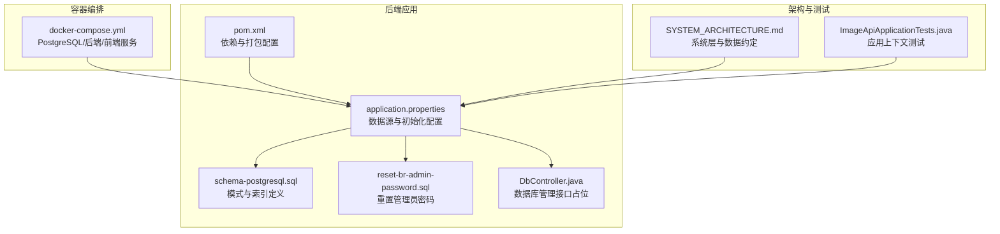
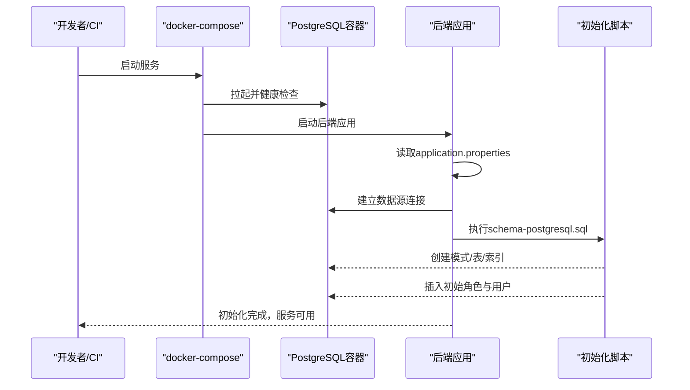
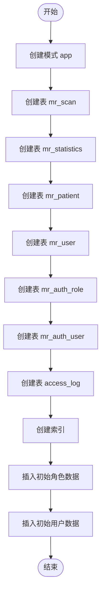
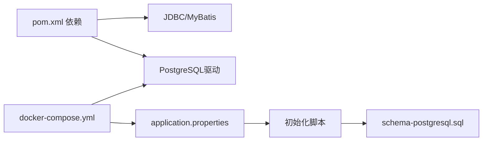

# 数据迁移与版本管理

**本文引用的文件**
- [schema-postgresql.sql](file://backend-repo/src/main/resources/schema-postgresql.sql)
- [reset-br-admin-password.sql](file://backend-repo/src/main/resources/reset-br-admin-password.sql)
- [application.properties](file://backend-repo/src/main/resources/application.properties)
- [DbController.java](file://backend-repo/src/main/java/com/zjcxph/imgapi/controller/DbController.java)
- [docker-compose.yml](file://docker-compose.yml)
- [SYSTEM_ARCHITECTURE.md](file://SYSTEM_ARCHITECTURE.md)
- [pom.xml](file://backend-repo/pom.xml)
- [ImageApiApplicationTests.java](file://backend-repo/src/test/java/com/zjcxph/imgapi/ImageApiApplicationTests.java)

## 目录
1. [简介](#简介)
2. [项目结构](#项目结构)
3. [核心组件](#核心组件)
4. [架构总览](#架构总览)
5. [详细组件分析](#详细组件分析)
6. [依赖关系分析](#依赖关系分析)
7. [性能考量](#性能考量)
8. [故障排除指南](#故障排除指南)
9. [结论](#结论)
10. [附录](#附录)

## 简介
本指南面向MRR（医学记录影像）系统的数据库迁移与版本管理，聚焦于以下目标：
- 明确数据库初始化脚本的结构与执行顺序
- 记录表创建、初始数据插入与权限配置的版本控制策略
- 解释数据库版本升级、回滚与数据备份恢复流程
- 提供迁移脚本编写规范、测试验证流程与生产部署注意事项
- 给出常见迁移场景的操作步骤与故障排除方法

系统采用PostgreSQL作为主数据存储，通过Spring Boot应用在启动时自动执行初始化脚本完成数据库模式与初始数据的准备。

## 项目结构
围绕数据库初始化与迁移的关键文件分布如下：
- 初始化脚本：PostgreSQL模式定义与初始数据
- 应用配置：数据源、初始化策略与运行参数
- 容器编排：本地开发环境的PostgreSQL、后端与前端服务
- 架构文档：系统层与数据约定
- 测试入口：应用上下文加载测试

**图表来源**
- [application.properties:10-23](file://backend-repo/src/main/resources/application.properties#L10-L23)
- [schema-postgresql.sql:1-109](file://backend-repo/src/main/resources/schema-postgresql.sql#L1-L109)
- [reset-br-admin-password.sql:1-16](file://backend-repo/src/main/resources/reset-br-admin-password.sql#L1-L16)
- [DbController.java:1-40](file://backend-repo/src/main/java/com/zjcxph/imgapi/controller/DbController.java#L1-L40)
- [docker-compose.yml:1-47](file://docker-compose.yml#L1-L47)
- [SYSTEM_ARCHITECTURE.md:18-31](file://SYSTEM_ARCHITECTURE.md#L18-L31)
- [pom.xml:27-88](file://backend-repo/pom.xml#L27-L88)
- [ImageApiApplicationTests.java:1-13](file://backend-repo/src/test/java/com/zjcxph/imgapi/ImageApiApplicationTests.java#L1-L13)

**章节来源**
- [application.properties:10-23](file://backend-repo/src/main/resources/application.properties#L10-L23)
- [schema-postgresql.sql:1-109](file://backend-repo/src/main/resources/schema-postgresql.sql#L1-L109)
- [reset-br-admin-password.sql:1-16](file://backend-repo/src/main/resources/reset-br-admin-password.sql#L1-L16)
- [docker-compose.yml:1-47](file://docker-compose.yml#L1-L47)
- [SYSTEM_ARCHITECTURE.md:18-31](file://SYSTEM_ARCHITECTURE.md#L18-L31)
- [pom.xml:27-88](file://backend-repo/pom.xml#L27-L88)
- [ImageApiApplicationTests.java:1-13](file://backend-repo/src/test/java/com/zjcxph/imgapi/ImageApiApplicationTests.java#L1-L13)

## 核心组件
- 初始化脚本（PostgreSQL）
  - 负责创建模式与表、建立索引、插入初始角色与用户数据
  - 使用PostgreSQL语法，包含冲突处理（ON CONFLICT）以支持幂等初始化
- 应用配置
  - 指定数据源URL、用户名、密码与连接池参数
  - 配置Spring SQL初始化策略：always模式、平台为postgresql、初始化脚本位置
- 容器编排
  - 通过docker-compose提供PostgreSQL、后端与前端服务，便于本地开发与集成测试
- 架构约定
  - 明确数据层的表命名与职责边界，确保迁移遵循统一命名与索引策略
- 测试入口
  - 应用上下文加载测试用于验证初始化流程是否成功

**章节来源**
- [schema-postgresql.sql:1-109](file://backend-repo/src/main/resources/schema-postgresql.sql#L1-L109)
- [application.properties:10-23](file://backend-repo/src/main/resources/application.properties#L10-L23)
- [docker-compose.yml:1-47](file://docker-compose.yml#L1-L47)
- [SYSTEM_ARCHITECTURE.md:26-31](file://SYSTEM_ARCHITECTURE.md#L26-L31)
- [ImageApiApplicationTests.java:1-13](file://backend-repo/src/test/java/com/zjcxph/imgapi/ImageApiApplicationTests.java#L1-L13)

## 架构总览
下图展示从应用启动到数据库初始化的整体流程，以及各组件之间的交互关系。

**图表来源**
- [application.properties:10-23](file://backend-repo/src/main/resources/application.properties#L10-L23)
- [schema-postgresql.sql:1-109](file://backend-repo/src/main/resources/schema-postgresql.sql#L1-L109)
- [docker-compose.yml:1-47](file://docker-compose.yml#L1-L47)

**章节来源**
- [application.properties:10-23](file://backend-repo/src/main/resources/application.properties#L10-L23)
- [schema-postgresql.sql:1-109](file://backend-repo/src/main/resources/schema-postgresql.sql#L1-L109)
- [docker-compose.yml:1-47](file://docker-compose.yml#L1-L47)

## 详细组件分析

### 初始化脚本结构与执行顺序
- 模式与表创建
  - 先创建模式（如app），再创建各业务表（mr_scan、mr_statistics、mr_patient、mr_user、mr_auth_role、mr_auth_user、access_log）
  - 表字段设计遵循业务需求，包含主键、唯一约束、外键（角色码到角色表）与时间戳字段
- 索引建立
  - 在高频查询列上建立索引，包括扫描记录、统计、患者、用户与访问日志相关字段
  - 对访问日志按时间倒序与组合索引进行优化
- 初始数据插入
  - 插入系统角色（ADMIN、DOCTOR、NURSE）及其权限描述
  - 插入初始用户（含管理员与默认医生/护士），使用冲突处理保证幂等
- 权限配置
  - 角色表包含权限字符串字段，用于授权控制
  - 用户表通过角色码关联角色，形成权限继承链

**图表来源**
- [schema-postgresql.sql:1-109](file://backend-repo/src/main/resources/schema-postgresql.sql#L1-L109)

**章节来源**
- [schema-postgresql.sql:1-109](file://backend-repo/src/main/resources/schema-postgresql.sql#L1-L109)

### 初始数据与权限配置策略
- 角色与用户
  - 使用ON CONFLICT策略避免重复初始化导致的数据异常
  - 用户密码采用哈希存储，角色与用户关联通过角色码实现
- 权限模型
  - 角色权限字符串用于细粒度授权
  - 用户状态字段用于启用/禁用控制

**章节来源**
- [schema-postgresql.sql:91-109](file://backend-repo/src/main/resources/schema-postgresql.sql#L91-L109)

### 数据库版本升级与回滚策略
- 升级策略
  - 采用“每次变更即迁移”的原则，所有生产变更必须通过迁移脚本执行
  - 分离DDL与DML，确保可审计与可回滚
  - 对大表新增列或索引时，优先使用PostgreSQL的非阻塞方式（如CONCURRENTLY）
- 回滚策略
  - 生产环境回滚通过新增正向迁移实现，不直接修改已部署迁移
  - 关键操作需有明确的回滚计划与验证步骤
- 幂等性
  - 初始脚本与重置脚本均采用冲突处理，确保多次执行的安全性

**章节来源**
- [schema-postgresql.sql:91-109](file://backend-repo/src/main/resources/schema-postgresql.sql#L91-L109)
- [reset-br-admin-password.sql:1-16](file://backend-repo/src/main/resources/reset-br-admin-password.sql#L1-L16)

### 数据备份与恢复流程
- 备份
  - 使用PostgreSQL标准备份工具导出数据库结构与数据
  - 建议在维护窗口内执行全量备份，并结合增量备份策略
- 恢复
  - 在新环境中先执行初始化脚本，再导入备份数据
  - 恢复后验证关键表完整性与索引状态

[本节为通用流程说明，无需特定文件引用]

### 迁移脚本编写规范
- 文件命名
  - 使用有序编号或时间戳前缀，确保迁移顺序稳定
- 内容组织
  - DDL与DML分离；必要时拆分为多个迁移文件
  - 新增列建议先nullable，再批量回填，最后添加约束
- 并发与锁
  - 大表索引创建使用CONCURRENTLY；避免长事务与全表锁
- 测试与验证
  - 在与生产规模相近的数据集上验证迁移性能与正确性
  - 回滚路径同样需要测试

[本节为通用规范说明，无需特定文件引用]

### 测试验证流程
- 单元/集成测试
  - 通过应用上下文测试验证初始化脚本执行无异常
- 端到端验证
  - 启动容器编排，确认数据库初始化完成且服务可用
- 性能验证
  - 针对关键查询建立基准，迁移后对比执行计划与耗时

**章节来源**
- [ImageApiApplicationTests.java:1-13](file://backend-repo/src/test/java/com/zjcxph/imgapi/ImageApiApplicationTests.java#L1-L13)
- [docker-compose.yml:1-47](file://docker-compose.yml#L1-L47)

### 生产环境部署注意事项
- 环境变量
  - 通过环境变量覆盖数据源URL、用户名、密码与连接池参数
- 初始化策略
  - spring.sql.init.mode设置为always，确保每次启动都会执行初始化脚本
- 监控与告警
  - 结合系统监控模块捕获迁移过程中的异常与性能波动
- 变更审批
  - 所有生产迁移需经过评审与演练，确保回滚方案完备

**章节来源**
- [application.properties:10-23](file://backend-repo/src/main/resources/application.properties#L10-L23)
- [SYSTEM_ARCHITECTURE.md:43-47](file://SYSTEM_ARCHITECTURE.md#L43-L47)

## 依赖关系分析
- 应用依赖
  - Spring Boot Starter Web、JDBC、MyBatis、PostgreSQL驱动等
- 初始化依赖
  - application.properties中声明的初始化脚本位置与平台
- 编排依赖
  - docker-compose定义了后端服务对PostgreSQL的依赖与健康检查

**图表来源**
- [pom.xml:27-88](file://backend-repo/pom.xml#L27-L88)
- [application.properties:10-23](file://backend-repo/src/main/resources/application.properties#L10-L23)
- [schema-postgresql.sql:1-109](file://backend-repo/src/main/resources/schema-postgresql.sql#L1-L109)
- [docker-compose.yml:1-47](file://docker-compose.yml#L1-L47)

**章节来源**
- [pom.xml:27-88](file://backend-repo/pom.xml#L27-L88)
- [application.properties:10-23](file://backend-repo/src/main/resources/application.properties#L10-L23)
- [docker-compose.yml:1-47](file://docker-compose.yml#L1-L47)

## 性能考量
- 索引策略
  - 在高频查询字段上建立索引，避免全表扫描
  - 对大表索引创建使用CONCURRENTLY，减少写入阻塞
- 批量操作
  - 大数据回填采用分批更新，降低单次事务锁持有时间
- 连接池与超时
  - 合理配置连接池大小与超时参数，避免资源争用

[本节为通用性能指导，无需特定文件引用]

## 故障排除指南
- 初始化失败
  - 检查数据源连接信息与PostgreSQL服务健康状态
  - 查看应用日志定位初始化脚本错误
- 权限问题
  - 确认角色与用户初始化是否成功，必要时使用重置脚本更新管理员密码
- 索引锁定
  - 若索引创建卡住，检查是否存在长事务或锁竞争，必要时终止阻塞会话
- 回滚验证
  - 回滚后验证数据一致性与查询性能，确保业务不受影响

**章节来源**
- [application.properties:10-23](file://backend-repo/src/main/resources/application.properties#L10-L23)
- [schema-postgresql.sql:91-109](file://backend-repo/src/main/resources/schema-postgresql.sql#L91-L109)
- [reset-br-admin-password.sql:1-16](file://backend-repo/src/main/resources/reset-br-admin-password.sql#L1-L16)
- [docker-compose.yml:1-47](file://docker-compose.yml#L1-L47)

## 结论
MRR系统的数据库初始化与迁移遵循“每次变更即迁移”的原则，通过PostgreSQL初始化脚本完成模式、索引与初始数据的准备。生产环境采用幂等初始化与严格的迁移安全清单，配合并发索引与分批回填等策略保障迁移过程的稳定性与可回滚性。建议在每次迁移前进行充分测试与演练，并在生产中严格执行变更审批与回滚预案。

[本节为总结性内容，无需特定文件引用]

## 附录

### 常见迁移场景操作步骤
- 新增业务表
  - 在schema脚本中新增表定义与索引
  - 如涉及历史数据，编写独立的数据迁移脚本进行回填
- 新增字段
  - 先添加nullable列，再分批填充默认值，最后添加约束
- 删除字段
  - 先在应用侧移除对该字段的使用，发布后再删除数据库列
- 索引变更
  - 使用CONCURRENTLY创建新索引，验证性能后替换旧索引

[本节为通用流程说明，无需特定文件引用]