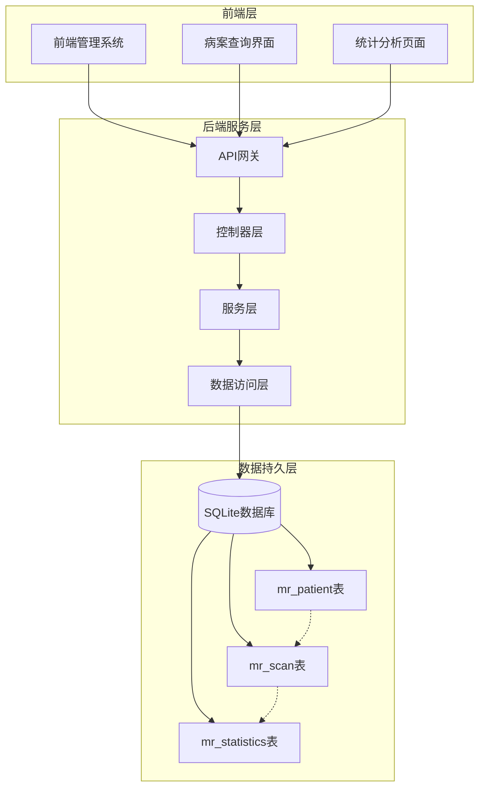
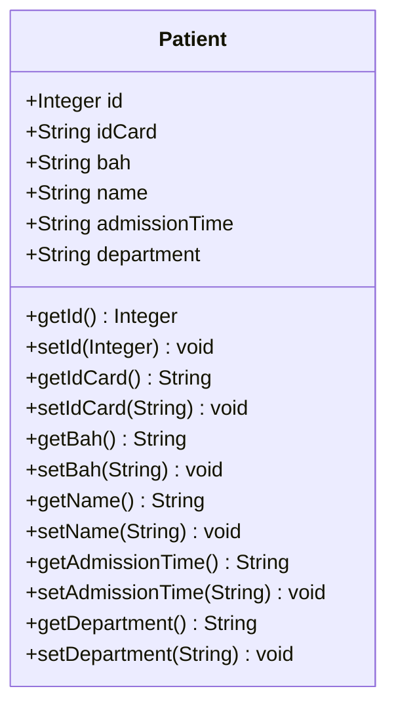
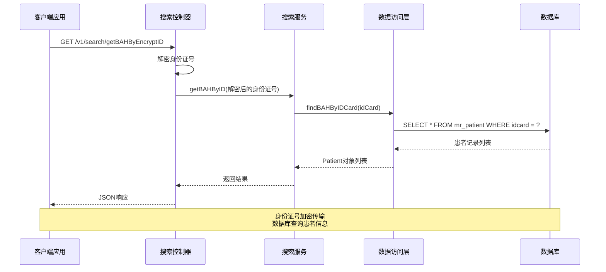
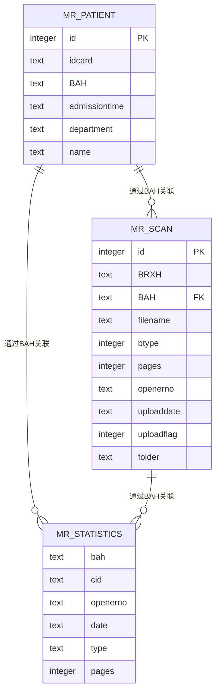
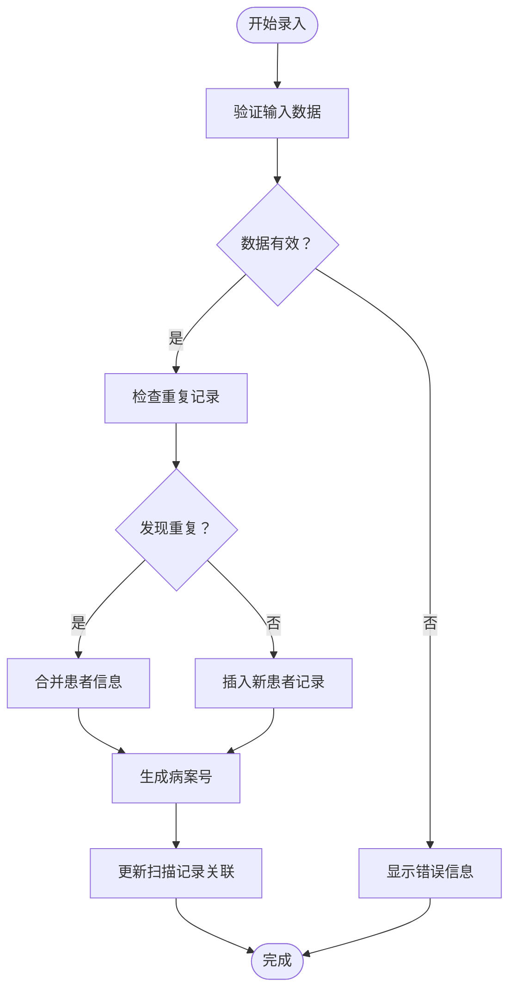
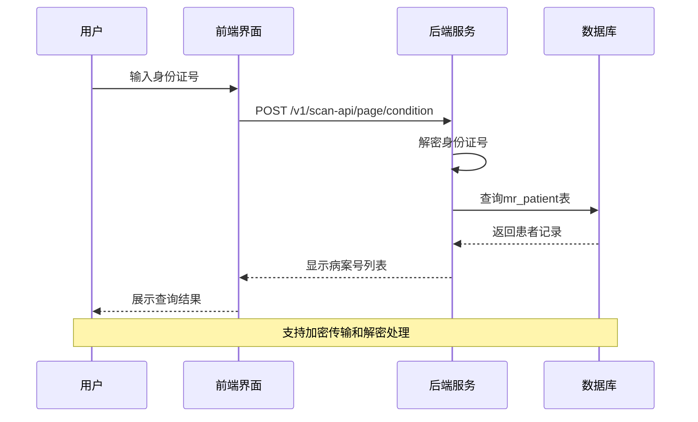
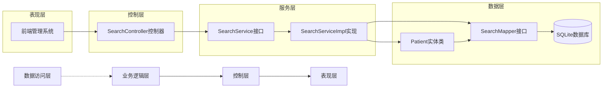
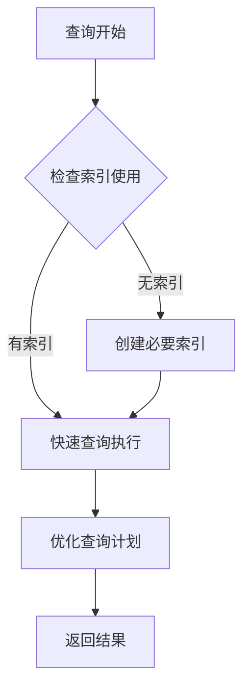

# mr_patient（患者表）

**本文档引用的文件**
- [schema.sql](file://mrr-db/schema.sql)
- [schema-postgresql.sql](file://backend-repo/src/main/resources/schema-postgresql.sql)
- [Patient.java](file://backend-repo/src/main/java/com/zjcxph/imgapi/entity/Patient.java)
- [SearchMapper.java](file://backend-repo/src/main/java/com/zjcxph/imgapi/mapper/SearchMapper.java)
- [SearchService.java](file://backend-repo/src/main/java/com/zjcxph/imgapi/service/SearchService.java)
- [SearchServiceImpl.java](file://backend-repo/src/main/java/com/zjcxph/imgapi/service/impl/SearchServiceImpl.java)
- [SearchController.java](file://backend-repo/src/main/java/com/zjcxph/imgapi/controller/SearchController.java)
- [records.ts](file://frontend-fantastic-admin/src/api/modules/records.ts)

## 目录
1. [简介](#简介)
2. [项目结构](#项目结构)
3. [核心组件](#核心组件)
4. [架构概览](#架构概览)
5. [详细组件分析](#详细组件分析)
6. [依赖分析](#依赖分析)
7. [性能考虑](#性能考虑)
8. [故障排除指南](#故障排除指南)
9. [结论](#结论)

## 简介

mr_patient（患者表）是MRR（医学影像归档系统）中的核心数据表，承担着患者基本信息管理的重要职责。该表在系统中发挥着以下关键作用：

- **患者基本信息管理**：存储患者的唯一标识、姓名、身份证号码等核心信息
- **病案号关联**：作为连接患者与医疗记录的桥梁，通过BAH字段实现与扫描记录的关联
- **科室信息维护**：记录患者所属的住院科室，支持按科室进行统计分析
- **入院时间管理**：记录患者入院时间，为医疗统计和分析提供时间维度数据

该表的设计体现了MRR系统对医疗数据标准化管理的需求，通过统一的字段定义和约束确保了数据的一致性和完整性。

## 项目结构

MRR系统采用前后端分离架构，mr_patient表在系统中的位置如下：

**图表来源**
- [schema.sql:16-24](file://mrr-db/schema.sql#L16-L24)
- [schema-postgresql.sql:25-32](file://backend-repo/src/main/resources/schema-postgresql.sql#L25-L32)

**章节来源**
- [schema.sql:1-95](file://mrr-db/schema.sql#L1-L95)
- [schema-postgresql.sql:1-89](file://backend-repo/src/main/resources/schema-postgresql.sql#L1-L89)

## 核心组件

### 数据表结构

mr_patient表采用SQLite语法定义，包含以下核心字段：

| 字段名 | 数据类型 | 是否可空 | 约束条件 | 描述 |
|--------|----------|----------|----------|------|
| id | integer | 否 | 主键 | 患者唯一标识符 |
| idcard | TEXT | 是 | 无 | 身份证号码 |
| BAH | TEXT | 是 | 无 | 病案号（与扫描记录关联） |
| admissiontime | TEXT | 是 | 无 | 入院时间 |
| department | TEXT | 是 | 无 | 住院科室 |
| name | TEXT | 是 | 无 | 患者姓名 |

### Java实体映射

后端使用Patient实体类映射数据库表结构：

**图表来源**
- [Patient.java:6-102](file://backend-repo/src/main/java/com/zjcxph/imgapi/entity/Patient.java#L6-L102)

**章节来源**
- [schema.sql:16-24](file://mrr-db/schema.sql#L16-L24)
- [Patient.java:1-103](file://backend-repo/src/main/java/com/zjcxph/imgapi/entity/Patient.java#L1-L103)

## 架构概览

### 数据流架构

**图表来源**
- [SearchController.java:39-55](file://backend-repo/src/main/java/com/zjcxph/imgapi/controller/SearchController.java#L39-L55)
- [SearchService.java:8-9](file://backend-repo/src/main/java/com/zjcxph/imgapi/service/SearchService.java#L8-L9)
- [SearchMapper.java:14-15](file://backend-repo/src/main/java/com/zjcxph/imgapi/mapper/SearchMapper.java#L14-L15)

### 关联关系设计

**图表来源**
- [schema.sql:16-38](file://mrr-db/schema.sql#L16-L38)
- [schema-postgresql.sql:25-32](file://backend-repo/src/main/resources/schema-postgresql.sql#L25-L32)

**章节来源**
- [schema.sql:16-38](file://mrr-db/schema.sql#L16-L38)
- [schema-postgresql.sql:25-32](file://backend-repo/src/main/resources/schema-postgresql.sql#L25-L32)

## 详细组件分析

### 字段详细说明

#### id（患者唯一标识）
- **数据类型**：integer（整数型）
- **业务规则**：
  - 必填字段，不可为空
  - 作为主键确保唯一性
  - 自动递增生成
- **业务场景**：
  - 系统内部识别患者的主要方式
  - 用于与其他表建立外键关联
  - 支持快速索引查询

#### idcard（身份证号码）
- **数据类型**：TEXT（文本型）
- **业务规则**：
  - 可为空，允许未登记身份证的患者
  - 建议保持格式一致性
  - 支持模糊查询和精确匹配
- **业务场景**：
  - 身份验证和患者识别
  - 与扫描记录建立关联
  - 统计分析的基础维度

#### BAH（病案号）
- **数据类型**：TEXT（文本型）
- **业务规则**：
  - 可为空，允许新患者录入
  - 作为扫描记录的关键关联字段
  - 支持重复值，表示同一患者多次就诊
- **业务场景**：
  - 医疗记录的唯一标识
  - 连接患者信息与扫描数据
  - 统计分析的核心维度

#### admissiontime（入院时间）
- **数据类型**：TEXT（文本型）
- **业务规则**：
  - 可为空，支持历史数据导入
  - 建议使用标准日期格式
  - 支持字符串比较和排序
- **业务场景**：
  - 医疗统计的时间维度
  - 就诊流程的时间记录
  - 分析患者就诊规律

#### department（科室）
- **数据类型**：TEXT（文本型）
- **业务规则**：
  - 可为空，支持门诊患者
  - 建议使用标准化科室名称
  - 支持按科室进行分组统计
- **业务场景**：
  - 医院管理的组织维度
  - 科室资源统计分析
  - 医疗质量评估指标

#### name（患者姓名）
- **数据类型**：TEXT（文本型）
- **业务规则**：
  - 可为空，支持匿名或特殊患者
  - 建议保持姓名一致性
  - 支持模糊搜索和精确匹配
- **业务场景**：
  - 患者身份识别
  - 医疗记录的可视化展示
  - 统计报表的人名显示

### 业务流程分析

#### 患者信息录入流程

**图表来源**
- [Patient.java:21-29](file://backend-repo/src/main/java/com/zjcxph/imgapi/entity/Patient.java#L21-L29)

#### 病案号查询流程

**图表来源**
- [records.ts:9-14](file://frontend-fantastic-admin/src/api/modules/records.ts#L9-L14)
- [SearchController.java:39-55](file://backend-repo/src/main/java/com/zjcxph/imgapi/controller/SearchController.java#L39-L55)

**章节来源**
- [Patient.java:1-103](file://backend-repo/src/main/java/com/zjcxph/imgapi/entity/Patient.java#L1-L103)
- [SearchController.java:39-65](file://backend-repo/src/main/java/com/zjcxph/imgapi/controller/SearchController.java#L39-L65)

## 依赖分析

### 技术依赖关系

**图表来源**
- [SearchMapper.java:1-16](file://backend-repo/src/main/java/com/zjcxph/imgapi/mapper/SearchMapper.java#L1-L16)
- [SearchService.java:1-10](file://backend-repo/src/main/java/com/zjcxph/imgapi/service/SearchService.java#L1-L10)
- [SearchServiceImpl.java:1-25](file://backend-repo/src/main/java/com/zjcxph/imgapi/service/impl/SearchServiceImpl.java#L1-L25)

### 外部依赖

- **数据库驱动**：SQLite数据库支持
- **ORM框架**：MyBatis注解映射
- **加密库**：AES加密算法用于身份证号保护
- **Web框架**：Spring Boot RESTful API

**章节来源**
- [SearchMapper.java:1-16](file://backend-repo/src/main/java/com/zjcxph/imgapi/mapper/SearchMapper.java#L1-L16)
- [SearchService.java:1-10](file://backend-repo/src/main/java/com/zjcxph/imgapi/service/SearchService.java#L1-L10)
- [SearchServiceImpl.java:1-25](file://backend-repo/src/main/java/com/zjcxph/imgapi/service/impl/SearchServiceImpl.java#L1-L25)

## 性能考虑

### 索引优化策略

根据数据库模式，建议重点关注以下索引：

1. **主键索引**：自动为id字段创建
2. **身份证号索引**：为idcard字段创建索引以支持快速查询
3. **病案号索引**：为BAH字段创建索引以优化关联查询

### 查询性能优化

### 缓存策略

- **查询结果缓存**：热门患者信息可缓存
- **配置信息缓存**：科室字典表可缓存
- **会话状态缓存**：用户认证信息缓存

## 故障排除指南

### 常见问题及解决方案

#### 数据重复问题
- **症状**：同一患者出现多条记录
- **原因**：身份证号或病案号重复
- **解决**：使用去重逻辑合并相同患者信息

#### 查询性能问题
- **症状**：查询响应缓慢
- **原因**：缺少必要的索引
- **解决**：为常用查询字段创建索引

#### 数据一致性问题
- **症状**：患者信息与扫描记录不匹配
- **原因**：BAH字段关联错误
- **解决**：检查数据导入流程和关联逻辑

**章节来源**
- [schema.sql:16-24](file://mrr-db/schema.sql#L16-L24)
- [schema-postgresql.sql:80-80](file://backend-repo/src/main/resources/schema-postgresql.sql#L80-L80)

## 结论

mr_patient（患者表）作为MRR系统的核心数据表，在整个医疗信息系统中发挥着承上启下的关键作用。通过合理的字段设计、完善的业务流程和有效的技术实现，该表为患者信息管理、病案号关联和科室统计提供了坚实的数据基础。

系统采用的前后端分离架构确保了良好的扩展性和维护性，而基于MyBatis的ORM映射则简化了数据访问层的开发工作。通过合理的索引策略和查询优化，系统能够高效地处理大量的医疗数据查询需求。

未来可以考虑的改进方向包括：增加数据完整性约束、实现更细粒度的权限控制、优化批量数据导入流程等，以进一步提升系统的稳定性和用户体验。