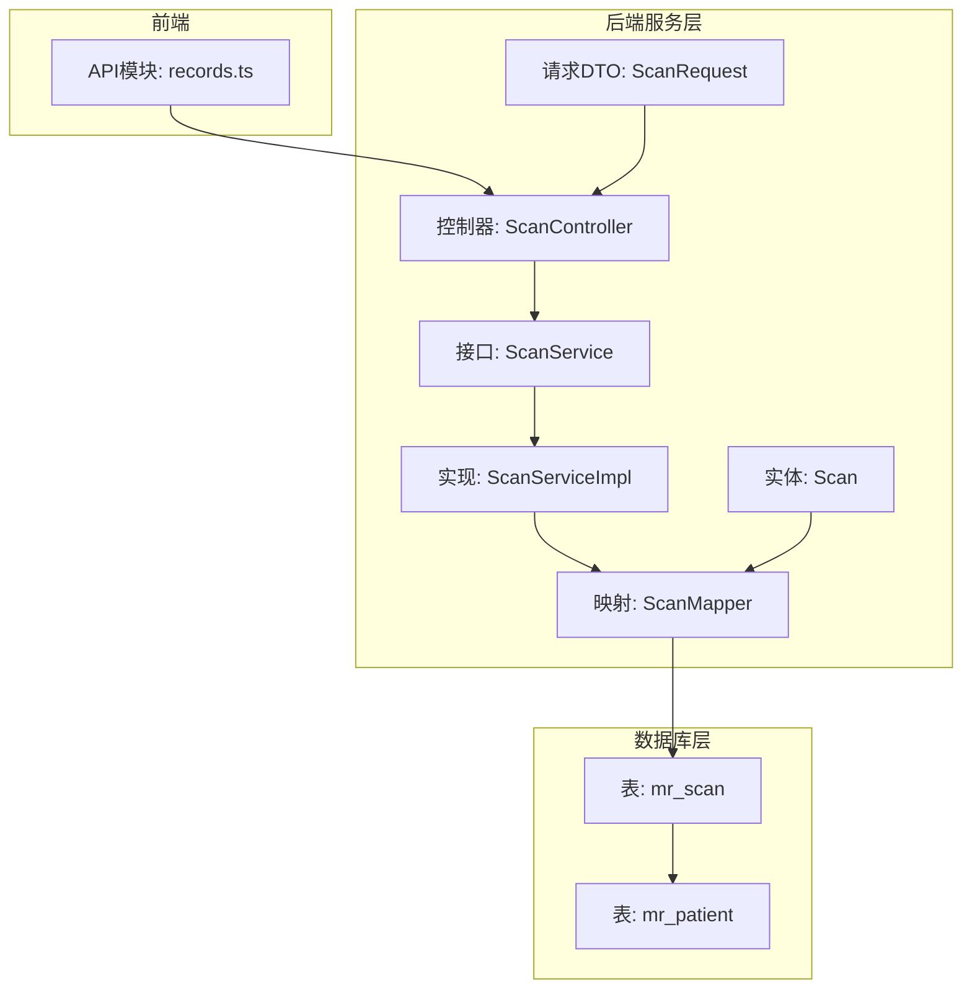
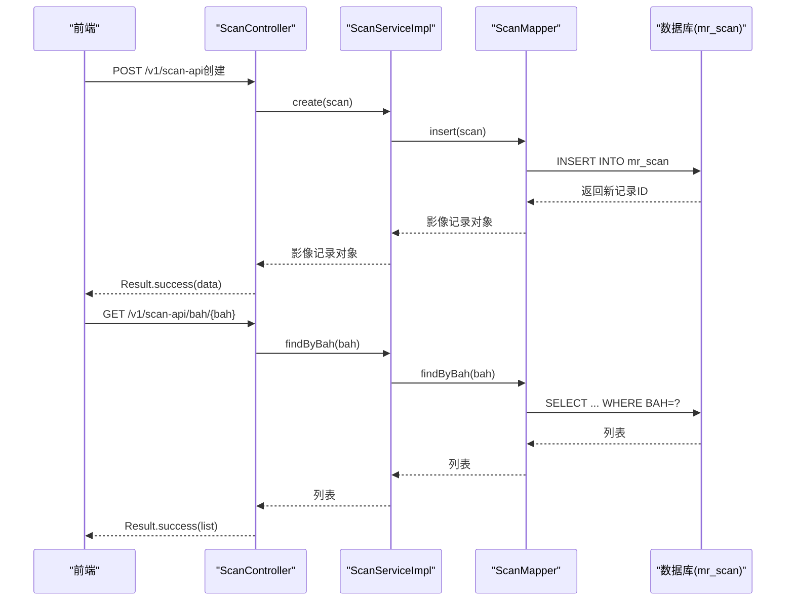
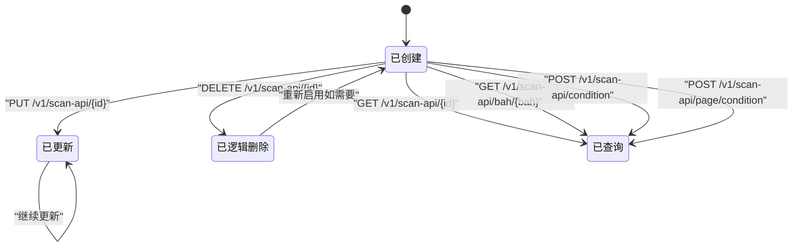
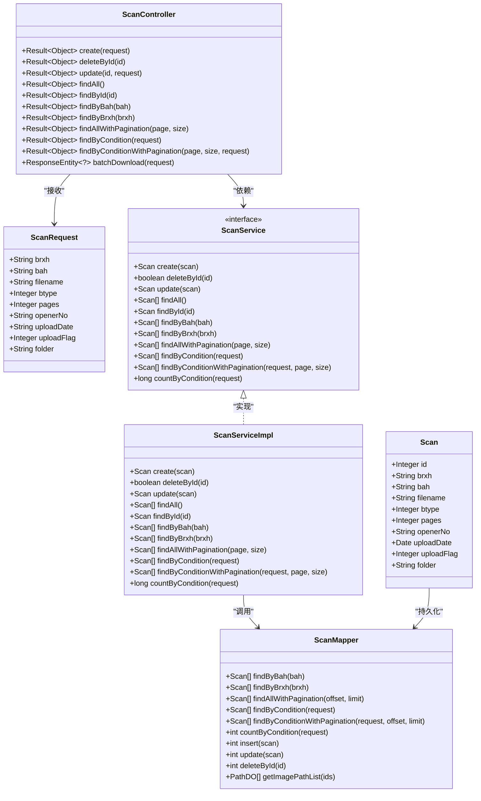

# mr_scan（扫描记录表）

**本文引用的文件**
- [schema.sql](file://mrr-db/schema.sql)
- [schema-postgresql.sql](file://backend-repo/src/main/resources/schema-postgresql.sql)
- [Scan.java](file://backend-repo/src/main/java/com/zjcxph/imgapi/entity/Scan.java)
- [ScanMapper.java](file://backend-repo/src/main/java/com/zjcxph/imgapi/mapper/ScanMapper.java)
- [ScanService.java](file://backend-repo/src/main/java/com/zjcxph/imgapi/service/ScanService.java)
- [ScanServiceImpl.java](file://backend-repo/src/main/java/com/zjcxph/imgapi/service/impl/ScanServiceImpl.java)
- [ScanController.java](file://backend-repo/src/main/java/com/zjcxph/imgapi/controller/ScanController.java)
- [ScanRequest.java](file://backend-repo/src/main/java/com/zjcxph/imgapi/dto/req/ScanRequest.java)
- [records.ts（前端）](file://frontend-fantastic-admin/src/api/modules/records.ts)
- [records.ts（后端）](file://frontend-repo/src/api/records.ts)
- [application.properties](file://backend-repo/src/main/resources/application.properties)
- [ScanTest.java](file://backend-repo/src/test/java/com/zjcxph/imgapi/ScanTest.java)

## 目录
1. [简介](#简介)
2. [项目结构](#项目结构)
3. [核心组件](#核心组件)
4. [架构总览](#架构总览)
5. [详细组件分析](#详细组件分析)
6. [依赖关系分析](#依赖关系分析)
7. [性能考虑](#性能考虑)
8. [故障排查指南](#故障排查指南)
9. [结论](#结论)
10. [附录](#附录)

## 简介
mr_scan 是影像扫描管理系统的核心数据表，承载着每一条扫描记录的完整生命周期信息。它不仅记录了扫描文件的基本属性（如文件名、页数、检查类型），还通过关键字段与患者信息、操作员、文件存储路径建立紧密关联，是实现“病案号（BAH）”驱动的归档检索、批量下载与统计分析的基础。

本文件将围绕 mr_scan 的字段语义、业务规则、数据完整性约束、典型业务流程（创建、更新、查询、逻辑删除）以及与患者表的关联关系进行系统化说明，并给出面向开发与运维的实践建议。

## 项目结构
mr_scan 数据模型位于数据库层（SQLite/PostgreSQL），并通过 MyBatis 映射到 Java 实体与服务层，最终由 REST 控制器对外暴露 API。前端通过统一的 records.ts 接口模块调用后端接口，完成对扫描记录的增删改查与批量下载。

图表来源
- [ScanController.java:38-333](file://backend-repo/src/main/java/com/zjcxph/imgapi/controller/ScanController.java#L38-L333)
- [ScanService.java:10-42](file://backend-repo/src/main/java/com/zjcxph/imgapi/service/ScanService.java#L10-L42)
- [ScanServiceImpl.java:75-134](file://backend-repo/src/main/java/com/zjcxph/imgapi/service/impl/ScanServiceImpl.java#L75-L134)
- [ScanMapper.java:15-131](file://backend-repo/src/main/java/com/zjcxph/imgapi/mapper/ScanMapper.java#L15-L131)
- [Scan.java:10-116](file://backend-repo/src/main/java/com/zjcxph/imgapi/entity/Scan.java#L10-L116)
- [ScanRequest.java:6-105](file://backend-repo/src/main/java/com/zjcxph/imgapi/dto/req/ScanRequest.java#L6-L105)
- [records.ts（前端）:1-56](file://frontend-fantastic-admin/src/api/modules/records.ts#L1-L56)
- [records.ts（前端）:1-55](file://frontend-repo/src/api/records.ts#L1-L55)

章节来源
- [schema.sql:26-38](file://mrr-db/schema.sql#L26-L38)
- [schema-postgresql.sql:3-14](file://backend-repo/src/main/resources/schema-postgresql.sql#L3-L14)
- [ScanController.java:38-333](file://backend-repo/src/main/java/com/zjcxph/imgapi/controller/ScanController.java#L38-L333)
- [ScanService.java:10-42](file://backend-repo/src/main/java/com/zjcxph/imgapi/service/ScanService.java#L10-L42)
- [ScanMapper.java:15-131](file://backend-repo/src/main/java/com/zjcxph/imgapi/mapper/ScanMapper.java#L15-L131)
- [Scan.java:10-116](file://backend-repo/src/main/java/com/zjcxph/imgapi/entity/Scan.java#L10-L116)
- [ScanRequest.java:6-105](file://backend-repo/src/main/java/com/zjcxph/imgapi/dto/req/ScanRequest.java#L6-L105)
- [records.ts（前端）:1-56](file://frontend-fantastic-admin/src/api/modules/records.ts#L1-L56)
- [records.ts（前端）:1-55](file://frontend-repo/src/api/records.ts#L1-L55)

## 核心组件
- 数据库表：mr_scan
  - 主键：id（整型，主键）
  - 关联字段：BAH（病案号，文本）
  - 业务字段：BRXH（检查序号，文本）、filename（文件名，文本）、btype（检查类型，整型）、pages（页数，整型）、openerno（操作员编号，文本）、uploaddate（上传日期，文本）、uploadflag（上传标志，整型）、folder（文件夹路径，文本）
- 实体类：Scan
  - 字段与数据库表一一对应，提供 getter/setter
- 映射接口：ScanMapper
  - 定义 CRUD、分页、条件查询、批量下载路径查询等 SQL
- 服务接口与实现：ScanService、ScanServiceImpl
  - 封装业务逻辑，协调 Mapper 与控制器
- 控制器：ScanController
  - 对外暴露 REST API，处理请求参数并返回 Result 包装的结果
- 请求 DTO：ScanRequest
  - 用于接收前端传入的查询与创建/更新参数
- 前端 API 模块：records.ts
  - 统一封装后端接口调用，支持分页、条件查询、批量下载

章节来源
- [schema.sql:26-38](file://mrr-db/schema.sql#L26-L38)
- [schema-postgresql.sql:3-14](file://backend-repo/src/main/resources/schema-postgresql.sql#L3-L14)
- [Scan.java:10-116](file://backend-repo/src/main/java/com/zjcxph/imgapi/entity/Scan.java#L10-L116)
- [ScanMapper.java:15-131](file://backend-repo/src/main/java/com/zjcxph/imgapi/mapper/ScanMapper.java#L15-L131)
- [ScanService.java:10-42](file://backend-repo/src/main/java/com/zjcxph/imgapi/service/ScanService.java#L10-L42)
- [ScanServiceImpl.java:75-134](file://backend-repo/src/main/java/com/zjcxph/imgapi/service/impl/ScanServiceImpl.java#L75-L134)
- [ScanController.java:38-333](file://backend-repo/src/main/java/com/zjcxph/imgapi/controller/ScanController.java#L38-L333)
- [ScanRequest.java:6-105](file://backend-repo/src/main/java/com/zjcxph/imgapi/dto/req/ScanRequest.java#L6-L105)
- [records.ts（前端）:1-56](file://frontend-fantastic-admin/src/api/modules/records.ts#L1-L56)
- [records.ts（前端）:1-55](file://frontend-repo/src/api/records.ts#L1-L55)

## 架构总览
mr_scan 在系统中的定位是“扫描记录中枢”。其核心职责包括：
- 记录每次影像扫描的元数据与文件位置
- 以 BAH 为纽带串联患者信息与扫描记录
- 支持按 BAH、BRXH、文件名、文件夹、操作员、上传日期、类型、页数、标志等维度进行查询
- 支持批量下载与统计分析

图表来源
- [ScanController.java:54-198](file://backend-repo/src/main/java/com/zjcxph/imgapi/controller/ScanController.java#L54-L198)
- [ScanServiceImpl.java:103-111](file://backend-repo/src/main/java/com/zjcxph/imgapi/service/impl/ScanServiceImpl.java#L103-L111)
- [ScanMapper.java:68-74](file://backend-repo/src/main/java/com/zjcxph/imgapi/mapper/ScanMapper.java#L68-L74)
- [Scan.java:10-116](file://backend-repo/src/main/java/com/zjcxph/imgapi/entity/Scan.java#L10-L116)

## 详细组件分析

### 数据模型与字段语义
mr_scan 的字段设计直接服务于“以 BAH 为中心”的归档与检索体系：

- id（扫描记录主键）
  - 类型：整型（SQLite：INTEGER；PostgreSQL：INTEGER GENERATED BY DEFAULT AS IDENTITY）
  - 作用：唯一标识每条扫描记录，作为数据库主键
  - 约束：非空且唯一
- BRXH（检查序号）
  - 类型：文本
  - 作用：与 BAH 配合，形成稳定的检索组合键
  - 约束：可为空，但建议保持一致性
- BAH（病案号）
  - 类型：文本
  - 作用：与患者表关联的关键字段，支撑“按病案号聚合”的所有业务
  - 约束：可为空，但建议非空；数据库层未声明 NOT NULL，需应用层保证
- filename（文件名）
  - 类型：文本
  - 作用：指向实际文件的名称
  - 约束：建议非空；与 folder、BRXH、BAH 共同决定文件物理路径
- btype（检查类型）
  - 类型：整型
  - 作用：区分不同类型的检查（如 X 光、CT、MR 等）
  - 约束：建议非负；可作为统计与筛选维度
- pages（页数）
  - 类型：整型
  - 作用：记录扫描文件的页数，用于统计与展示
  - 约束：建议非负；排序时可按 pages 升序排列
- openerno（操作员编号）
  - 类型：文本
  - 作用：标识扫描操作员，便于审计与追踪
  - 约束：可为空
- uploaddate（上传日期）
  - 类型：文本
  - 作用：记录上传时间，支持按日期筛选
  - 约束：可为空；建议采用标准日期格式
- uploadflag（上传标志）
  - 类型：整型
  - 作用：逻辑删除标记（0 表示已删除），避免物理删除带来的数据链路断裂
  - 约束：建议仅使用 0/1 等有限枚举值
- folder（文件夹路径）
  - 类型：文本
  - 作用：文件存储的相对路径，结合 basePath 生成绝对路径
  - 约束：可为空；建议非空且与物理目录一致

字段间业务关系与约束：
- BAH 与 mr_patient 的关联：BAH 作为外键（逻辑外键）与患者表关联，用于患者信息的读取与校验
- 文件路径解析：基于 folder 的前缀与 BRXH、BAH、filename 组合生成最终文件路径
- 逻辑删除：uploadflag=0 表示记录不可见，但数据仍保留，确保历史可追溯
- 排序与分页：默认按 id 升序；按 BAH 查询时按 pages 升序排列

章节来源
- [schema.sql:26-38](file://mrr-db/schema.sql#L26-L38)
- [schema-postgresql.sql:3-14](file://backend-repo/src/main/resources/schema-postgresql.sql#L3-L14)
- [Scan.java:10-116](file://backend-repo/src/main/java/com/zjcxph/imgapi/entity/Scan.java#L10-L116)
- [ScanMapper.java:15-131](file://backend-repo/src/main/java/com/zjcxph/imgapi/mapper/ScanMapper.java#L15-L131)
- [ScanController.java:317-331](file://backend-repo/src/main/java/com/zjcxph/imgapi/controller/ScanController.java#L317-L331)

### 生命周期管理
mr_scan 的完整生命周期如下：
- 创建：接收 ScanRequest，构造 Scan，写入数据库，返回带 id 的记录
- 更新：按 id 更新指定字段，支持部分字段更新
- 查询：支持按 id、BAH、BRXH、条件过滤、分页查询
- 逻辑删除：将 uploadflag 设为 0，不真正删除记录
- 批量下载：根据 id 列表查询文件路径，拼接物理路径并打包下载

图表来源
- [ScanController.java:82-254](file://backend-repo/src/main/java/com/zjcxph/imgapi/controller/ScanController.java#L82-L254)
- [ScanServiceImpl.java:75-134](file://backend-repo/src/main/java/com/zjcxph/imgapi/service/impl/ScanServiceImpl.java#L75-L134)
- [ScanMapper.java:38-129](file://backend-repo/src/main/java/com/zjcxph/imgapi/mapper/ScanMapper.java#L38-L129)

### 典型业务场景

#### 场景一：创建扫描记录
- 输入：ScanRequest（BRXH、BAH、filename、btype、pages、openerNo、uploadFlag、folder 等）
- 处理：控制器构造 Scan，调用服务层创建，返回新记录
- 输出：Result.success(data)，包含完整 Scan 对象

章节来源
- [ScanController.java:54-80](file://backend-repo/src/main/java/com/zjcxph/imgapi/controller/ScanController.java#L54-L80)
- [ScanServiceImpl.java:75-96](file://backend-repo/src/main/java/com/zjcxph/imgapi/service/impl/ScanServiceImpl.java#L75-L96)
- [ScanMapper.java:32-36](file://backend-repo/src/main/java/com/zjcxph/imgapi/mapper/ScanMapper.java#L32-L36)

#### 场景二：按病案号查询
- 输入：BAH
- 处理：按 BAH 查询，按 pages 升序返回
- 输出：扫描记录列表

章节来源
- [ScanController.java:168-182](file://backend-repo/src/main/java/com/zjcxph/imgapi/controller/ScanController.java#L168-L182)
- [ScanServiceImpl.java:103-106](file://backend-repo/src/main/java/com/zjcxph/imgapi/service/impl/ScanServiceImpl.java#L103-L106)
- [ScanMapper.java:68-70](file://backend-repo/src/main/java/com/zjcxph/imgapi/mapper/ScanMapper.java#L68-L70)

#### 场景三：条件分页查询
- 输入：ScanRequest（可选字段：BRXH、BAH、filename、folder、openerNo、uploadDate、btype、uploadFlag、pages）
- 处理：动态拼接 where 条件，支持分页与总数统计
- 输出：包含 list、total、page、size、totalPages 的响应

章节来源
- [ScanController.java:223-254](file://backend-repo/src/main/java/com/zjcxph/imgapi/controller/ScanController.java#L223-L254)
- [ScanServiceImpl.java:119-133](file://backend-repo/src/main/java/com/zjcxph/imgapi/service/impl/ScanServiceImpl.java#L119-L133)
- [ScanMapper.java:80-129](file://backend-repo/src/main/java/com/zjcxph/imgapi/mapper/ScanMapper.java#L80-L129)

#### 场景四：批量下载
- 输入：ids 列表
- 处理：查询路径信息 PathDO（folder、filename、BRXH、BAH），拼接物理路径，打包为 zip
- 输出：application/octet-stream 的 zip 文件

章节来源
- [ScanController.java:256-331](file://backend-repo/src/main/java/com/zjcxph/imgapi/controller/ScanController.java#L256-L331)
- [ScanMapper.java:21-27](file://backend-repo/src/main/java/com/zjcxph/imgapi/mapper/ScanMapper.java#L21-L27)

### 与患者表的关联关系
- 关联键：BAH
- 用途：通过 BAH 可关联患者信息，实现“按病案号聚合”的查询与统计
- 注意：mr_scan 中 BAH 为逻辑外键，未在数据库层声明约束，需在应用层保证一致性

章节来源
- [schema.sql:16-24](file://mrr-db/schema.sql#L16-L24)
- [ScanMapper.java:17-18](file://backend-repo/src/main/java/com/zjcxph/imgapi/mapper/ScanMapper.java#L17-L18)

### 数据完整性检查与业务规则
- 主键约束：id 必须唯一且非空
- 逻辑删除：uploadflag=0 表示记录不可见，删除操作通过更新标志实现
- 字段约束建议：
  - BAH：建议非空，作为检索与聚合的首要维度
  - filename、folder：建议非空，确保文件路径可解析
  - pages、btype：建议非负，避免统计异常
  - uploaddate：建议标准化日期格式
- 查询与排序：
  - 默认按 id 升序
  - 按 BAH 查询时按 pages 升序
- 性能索引：
  - PostgreSQL 版本提供了 idx_mr_scan_bah、idx_mr_scan_brxh 等索引，提升按 BAH/BRXH 查询性能

章节来源
- [schema-postgresql.sql:75-76](file://backend-repo/src/main/resources/schema-postgresql.sql#L75-L76)
- [ScanController.java:82-102](file://backend-repo/src/main/java/com/zjcxph/imgapi/controller/ScanController.java#L82-L102)
- [ScanMapper.java:38-40](file://backend-repo/src/main/java/com/zjcxph/imgapi/mapper/ScanMapper.java#L38-L40)

## 依赖关系分析

图表来源
- [Scan.java:10-116](file://backend-repo/src/main/java/com/zjcxph/imgapi/entity/Scan.java#L10-L116)
- [ScanRequest.java:6-105](file://backend-repo/src/main/java/com/zjcxph/imgapi/dto/req/ScanRequest.java#L6-L105)
- [ScanMapper.java:15-131](file://backend-repo/src/main/java/com/zjcxph/imgapi/mapper/ScanMapper.java#L15-L131)
- [ScanService.java:10-42](file://backend-repo/src/main/java/com/zjcxph/imgapi/service/ScanService.java#L10-L42)
- [ScanServiceImpl.java:75-134](file://backend-repo/src/main/java/com/zjcxph/imgapi/service/impl/ScanServiceImpl.java#L75-L134)
- [ScanController.java:38-333](file://backend-repo/src/main/java/com/zjcxph/imgapi/controller/ScanController.java#L38-L333)

## 性能考虑
- 索引策略
  - PostgreSQL 已创建 idx_mr_scan_bah、idx_mr_scan_brxh，建议在高并发场景下评估是否增加复合索引（如 BAH+pages）
- 分页与排序
  - 默认按 id 升序；条件查询按 id 排序，避免无序结果
- 批量下载
  - 建议限制单次批量下载的文件数量，防止内存溢出
- 存储路径
  - basePath 由配置项 image.basePath 提供，建议使用高性能存储与合理的目录层级

章节来源
- [schema-postgresql.sql:75-76](file://backend-repo/src/main/resources/schema-postgresql.sql#L75-L76)
- [application.properties:30-33](file://backend-repo/src/main/resources/application.properties#L30-L33)
- [ScanController.java:256-331](file://backend-repo/src/main/java/com/zjcxph/imgapi/controller/ScanController.java#L256-L331)

## 故障排查指南
- 创建失败
  - 检查必填字段（如 filename、folder、BAH）是否为空
  - 查看数据库连接与 schema 初始化情况
- 查询无结果
  - 确认 BAH/BRXH 是否正确，注意大小写与前后空格
  - 检查 uploadflag 是否为 0（逻辑删除）
- 批量下载失败
  - 检查文件是否存在与可读
  - 核对 basePath、folder、filename 组合路径
- 删除异常
  - 逻辑删除仅更新 uploadflag，不会抛出异常；确认 uploadflag=0 后记录不可见

章节来源
- [ScanController.java:82-102](file://backend-repo/src/main/java/com/zjcxph/imgapi/controller/ScanController.java#L82-L102)
- [ScanMapper.java:38-40](file://backend-repo/src/main/java/com/zjcxph/imgapi/mapper/ScanMapper.java#L38-L40)
- [ScanTest.java:147-179](file://backend-repo/src/test/java/com/zjcxph/imgapi/ScanTest.java#L147-L179)

## 结论
mr_scan 作为影像扫描管理的核心表，通过简洁而明确的字段设计与完善的查询/更新/删除能力，支撑起以 BAH 为中心的归档与检索体系。配合逻辑删除、批量下载与条件分页查询，系统在保证数据完整性的同时，兼顾了可维护性与扩展性。建议在生产环境中强化字段约束与索引策略，并持续完善测试覆盖，确保业务规则的一致性与稳定性。

## 附录

### 字段对照表
- id：主键
- BRXH：检查序号
- BAH：病案号
- filename：文件名
- btype：检查类型
- pages：页数
- openerno：操作员编号
- uploaddate：上传日期
- uploadflag：上传标志（逻辑删除）
- folder：文件夹路径

章节来源
- [schema.sql:26-38](file://mrr-db/schema.sql#L26-L38)
- [schema-postgresql.sql:3-14](file://backend-repo/src/main/resources/schema-postgresql.sql#L3-L14)
- [Scan.java:10-116](file://backend-repo/src/main/java/com/zjcxph/imgapi/entity/Scan.java#L10-L116)