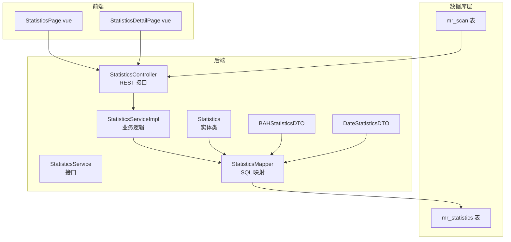
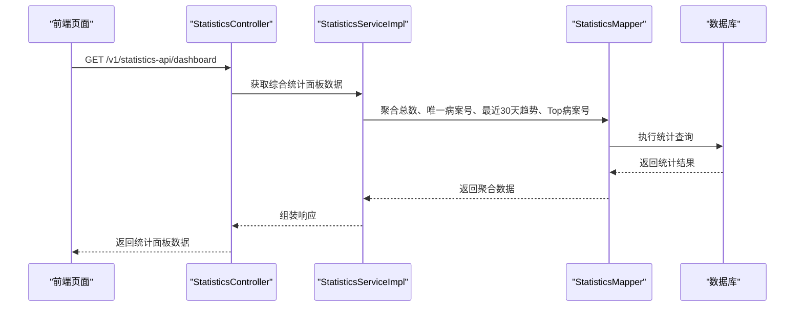
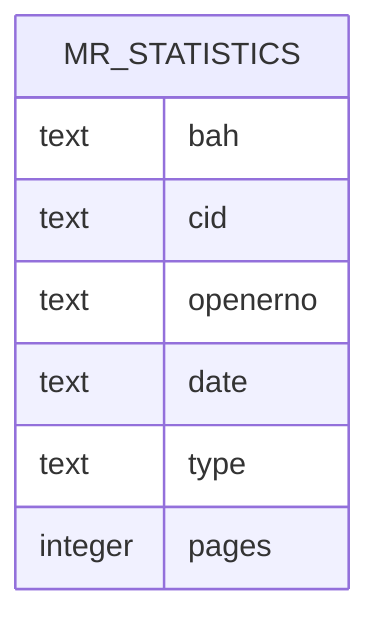
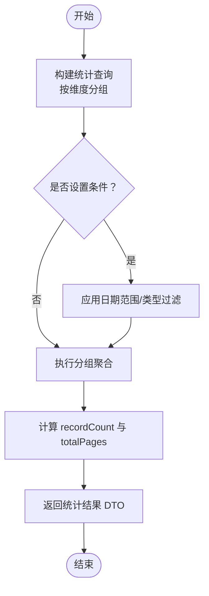
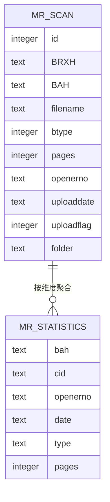
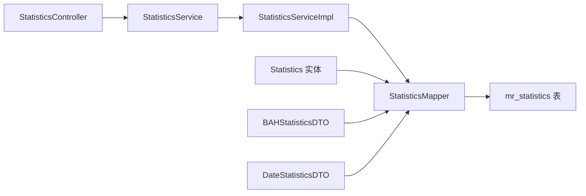

# mr_statistics（统计表）

**本文引用的文件列表**
- [schema.sql](file://mrr-db/schema.sql)
- [Statistics.java](file://backend-repo/src/main/java/com/zjcxph/imgapi/entity/Statistics.java)
- [StatisticsMapper.java](file://backend-repo/src/main/java/com/zjcxph/imgapi/mapper/StatisticsMapper.java)
- [StatisticsService.java](file://backend-repo/src/main/java/com/zjcxph/imgapi/service/StatisticsService.java)
- [StatisticsServiceImpl.java](file://backend-repo/src/main/java/com/zjcxph/imgapi/service/impl/StatisticsServiceImpl.java)
- [StatisticsController.java](file://backend-repo/src/main/java/com/zjcxph/imgapi/controller/StatisticsController.java)
- [BAHStatisticsDTO.java](file://backend-repo/src/main/java/com/zjcxph/imgapi/dto/resp/BAHStatisticsDTO.java)
- [DateStatisticsDTO.java](file://backend-repo/src/main/java/com/zjcxph/imgapi/dto/resp/DateStatisticsDTO.java)
- [ScanMapper.java](file://backend-repo/src/main/java/com/zjcxph/imgapi/mapper/ScanMapper.java)
- [ScanServiceImpl.java](file://backend-repo/src/main/java/com/zjcxph/imgapi/service/impl/ScanServiceImpl.java)
- [schema-postgresql.sql](file://backend-repo/src/main/resources/schema-postgresql.sql)
- [StatisticsPage.vue](file://frontend-repo/src/views/admin/StatisticsPage.vue)
- [StatisticsDetailPage.vue](file://frontend-repo/src/views/admin/StatisticsDetailPage.vue)

## 目录
1. [简介](#简介)
2. [项目结构](#项目结构)
3. [核心组件](#核心组件)
4. [架构概览](#架构概览)
5. [详细组件分析](#详细组件分析)
6. [依赖关系分析](#依赖关系分析)
7. [性能考量](#性能考量)
8. [故障排查指南](#故障排查指南)
9. [结论](#结论)
10. [附录](#附录)

## 简介
mr_statistics 是系统中用于存储扫描记录统计信息的核心表，承担着病案扫描量统计、报表生成与分析的关键职责。该表通过聚合扫描记录（mr_scan）中的关键信息，形成按不同维度（如病案号、日期、统计类型等）的统计数据，支撑管理端的统计面板、明细查询与趋势分析等功能。

## 项目结构
mr_statistics 表位于数据库层，配合后端的实体类、映射器、服务层与控制器，共同完成数据的读取、统计与对外暴露；前端通过页面组件调用后端接口，渲染统计图表与表格。

**图表来源**
- [schema.sql:40-48](file://mrr-db/schema.sql#L40-L48)
- [StatisticsController.java:30-281](file://backend-repo/src/main/java/com/zjcxph/imgapi/controller/StatisticsController.java#L30-L281)
- [StatisticsServiceImpl.java:13-98](file://backend-repo/src/main/java/com/zjcxph/imgapi/service/impl/StatisticsServiceImpl.java#L13-L98)
- [StatisticsMapper.java:13-167](file://backend-repo/src/main/java/com/zjcxph/imgapi/mapper/StatisticsMapper.java#L13-L167)
- [Statistics.java:1-74](file://backend-repo/src/main/java/com/zjcxph/imgapi/entity/Statistics.java#L1-L74)
- [BAHStatisticsDTO.java:1-47](file://backend-repo/src/main/java/com/zjcxph/imgapi/dto/resp/BAHStatisticsDTO.java#L1-L47)
- [DateStatisticsDTO.java:1-47](file://backend-repo/src/main/java/com/zjcxph/imgapi/dto/resp/DateStatisticsDTO.java#L1-L47)
- [StatisticsPage.vue:1-38](file://frontend-repo/src/views/admin/StatisticsPage.vue#L1-L38)
- [StatisticsDetailPage.vue:1-8](file://frontend-repo/src/views/admin/StatisticsDetailPage.vue#L1-L8)

**章节来源**
- [schema.sql:40-48](file://mrr-db/schema.sql#L40-L48)
- [schema-postgresql.sql:75-79](file://backend-repo/src/main/resources/schema-postgresql.sql#L75-L79)

## 核心组件
- 实体类 Statistics：封装统计表字段，便于 Java 层对象化处理。
- 映射器 StatisticsMapper：定义 SQL 查询与统计聚合逻辑，覆盖全表查询、分页、条件过滤、按病案号/日期统计、按类型统计等。
- 服务层 StatisticsService/StatisticsServiceImpl：提供业务方法，协调 Mapper 完成统计计算。
- 控制器 StatisticsController：对外暴露 REST 接口，支持分页、条件筛选、按日期范围与类型统计、仪表板汇总等。
- DTO：BAHStatisticsDTO、DateStatisticsDTO 用于封装按病案号与按日期的统计结果。
- 数据库索引：针对 bah、date、type 字段建立索引，提升查询与分组统计性能。

**章节来源**
- [Statistics.java:1-74](file://backend-repo/src/main/java/com/zjcxph/imgapi/entity/Statistics.java#L1-L74)
- [StatisticsMapper.java:13-167](file://backend-repo/src/main/java/com/zjcxph/imgapi/mapper/StatisticsMapper.java#L13-L167)
- [StatisticsService.java:10-55](file://backend-repo/src/main/java/com/zjcxph/imgapi/service/StatisticsService.java#L10-L55)
- [StatisticsServiceImpl.java:13-98](file://backend-repo/src/main/java/com/zjcxph/imgapi/service/impl/StatisticsServiceImpl.java#L13-L98)
- [StatisticsController.java:30-281](file://backend-repo/src/main/java/com/zjcxph/imgapi/controller/StatisticsController.java#L30-L281)
- [BAHStatisticsDTO.java:1-47](file://backend-repo/src/main/java/com/zjcxph/imgapi/dto/resp/BAHStatisticsDTO.java#L1-L47)
- [DateStatisticsDTO.java:1-47](file://backend-repo/src/main/java/com/zjcxph/imgapi/dto/resp/DateStatisticsDTO.java#L1-L47)
- [schema-postgresql.sql:75-79](file://backend-repo/src/main/resources/schema-postgresql.sql#L75-L79)

## 架构概览
mr_statistics 的数据流从扫描记录（mr_scan）产生，经由后端统计逻辑写入或聚合到统计表，并通过 REST 接口对外提供查询与统计能力。前端页面通过调用接口渲染统计面板与明细列表。

**图表来源**
- [StatisticsController.java:215-242](file://backend-repo/src/main/java/com/zjcxph/imgapi/controller/StatisticsController.java#L215-L242)
- [StatisticsServiceImpl.java:82-96](file://backend-repo/src/main/java/com/zjcxph/imgapi/service/impl/StatisticsServiceImpl.java#L82-L96)
- [StatisticsMapper.java:153-166](file://backend-repo/src/main/java/com/zjcxph/imgapi/mapper/StatisticsMapper.java#L153-L166)

## 详细组件分析

### 数据模型定义
mr_statistics 表字段说明：
- bah（病案号）：标识具体病案，用于按病案号维度统计。
- cid（统计编码）：可选的统计分类编码，便于进一步细分统计口径。
- openerno（操作员编号）：记录扫描操作员标识，可用于按操作员统计。
- date（统计日期）：记录扫描发生的日期字符串，支持按日期维度统计。
- type（统计类型）：扫描类型标识，如“普通”、“质控”、“高拍”等，用于按类型统计。
- pages（页数统计）：单条记录对应的页数，用于统计总页数。

**图表来源**
- [schema.sql:40-48](file://mrr-db/schema.sql#L40-L48)

**章节来源**
- [schema.sql:40-48](file://mrr-db/schema.sql#L40-L48)

### 字段详解与业务含义
- bah（病案号）
  - 类型：文本
  - 作用：作为统计分组与关联查询的关键键值，支持按病案号统计扫描量与页数。
  - 关联：与 mr_scan 中的 BAH 字段一致，确保统计与原始扫描记录的可追溯性。
- cid（统计编码）
  - 类型：文本
  - 作用：用于更细粒度的统计分类，便于按编码维度生成报表。
- openerno（操作员编号）
  - 类型：文本
  - 作用：用于按操作员统计扫描量，辅助绩效与质量评估。
- date（统计日期）
  - 类型：文本
  - 作用：按日期维度进行统计，支持趋势分析与时间序列报表。
  - 格式：接口层对日期格式有兼容处理，支持多种输入格式。
- type（统计类型）
  - 类型：文本
  - 作用：区分扫描类型，如普通、质控、高拍等，便于按类型统计。
- pages（页数统计）
  - 类型：整数
  - 作用：记录单条扫描记录的页数，用于统计总页数与平均页数。

**章节来源**
- [Statistics.java:7-12](file://backend-repo/src/main/java/com/zjcxph/imgapi/entity/Statistics.java#L7-L12)
- [StatisticsController.java:54-57](file://backend-repo/src/main/java/com/zjcxph/imgapi/controller/StatisticsController.java#L54-L57)

### 统计维度与报表生成
- 按病案号统计
  - 使用聚合查询按 bah 分组，统计 recordCount（记录数）与 totalPages（总页数）。
  - 适用于生成“Top N 病案号”报表，识别高扫描量病案。
- 按日期统计
  - 使用聚合查询按 date 分组，统计每日 recordCount 与 totalPages。
  - 支持按日期范围与类型条件组合统计，生成趋势图与日报表。
- 按类型统计
  - 使用聚合查询按 type 分组，统计各类型的 recordCount 与 totalPages。
  - 用于分析不同类型扫描的工作量分布。
- 综合统计面板
  - 后端一次性返回总体统计、唯一病案号数量、最近30天趋势、Top病案号等数据，前端渲染仪表板。

**图表来源**
- [StatisticsMapper.java:116-166](file://backend-repo/src/main/java/com/zjcxph/imgapi/mapper/StatisticsMapper.java#L116-L166)
- [StatisticsController.java:144-205](file://backend-repo/src/main/java/com/zjcxph/imgapi/controller/StatisticsController.java#L144-L205)

**章节来源**
- [StatisticsMapper.java:116-166](file://backend-repo/src/main/java/com/zjcxph/imgapi/mapper/StatisticsMapper.java#L116-L166)
- [StatisticsController.java:144-205](file://backend-repo/src/main/java/com/zjcxph/imgapi/controller/StatisticsController.java#L144-L205)

### 统计表与业务表的关系
- 业务表 mr_scan：存储扫描记录的原始数据，包含 BAH、openerno、pages、uploaddate 等字段。
- 统计表 mr_statistics：基于 mr_scan 的聚合统计结果，形成按维度的汇总数据，降低复杂查询成本，提升报表性能。
- 关系映射：
  - bah 字段在两表中保持一致，便于关联与校验。
  - date 字段来源于扫描记录的上传日期，type 字段来源于扫描类型配置。
  - pages 字段直接沿用扫描记录的页数，保证统计准确性。

**图表来源**
- [schema.sql:26-38](file://mrr-db/schema.sql#L26-L38)
- [schema.sql:40-48](file://mrr-db/schema.sql#L40-L48)

**章节来源**
- [schema.sql:26-38](file://mrr-db/schema.sql#L26-L38)
- [schema.sql:40-48](file://mrr-db/schema.sql#L40-L48)

### 统计表的数据更新机制与计算逻辑
- 数据来源：扫描服务在插入或更新扫描记录时，应同步维护统计表的聚合数据。
- 计算逻辑：
  - 按病案号维度：对同一 bah 的记录进行分组，累加 pages 得到 totalPages，统计记录数。
  - 按日期维度：对同一天的记录进行分组，统计 recordCount 与 totalPages。
  - 按类型维度：对同类型的记录进行分组，统计 recordCount 与 totalPages。
- 更新策略建议：
  - 在扫描记录新增/更新时，触发统计表的增量更新或定时批量重算。
  - 使用事务保证统计表与业务表的一致性。
  - 对高频查询字段（bah、date、type）建立索引，提升统计查询性能。

**章节来源**
- [ScanMapper.java:32-36](file://backend-repo/src/main/java/com/zjcxph/imgapi/mapper/ScanMapper.java#L32-L36)
- [StatisticsMapper.java:116-166](file://backend-repo/src/main/java/com/zjcxph/imgapi/mapper/StatisticsMapper.java#L116-L166)
- [schema-postgresql.sql:75-79](file://backend-repo/src/main/resources/schema-postgresql.sql#L75-L79)

### 统计结果的应用场景与报表展示需求
- 应用场景
  - 管理看板：展示总体扫描量、唯一病案号、近期趋势与Top病案号。
  - 明细查询：支持按关键字、类型、日期范围进行分页查询与导出。
  - 绩效分析：按操作员统计扫描量，评估工作负荷。
  - 质量监控：按类型统计不同扫描类型的占比与页数分布。
- 报表展示
  - 前端页面通过调用后端接口获取数据，渲染柱状图、折线图与表格。
  - 支持排序、筛选与分页，满足大体量数据的浏览与分析需求。

**章节来源**
- [StatisticsController.java:215-242](file://backend-repo/src/main/java/com/zjcxph/imgapi/controller/StatisticsController.java#L215-L242)
- [StatisticsPage.vue:1-38](file://frontend-repo/src/views/admin/StatisticsPage.vue#L1-L38)
- [StatisticsDetailPage.vue:1-8](file://frontend-repo/src/views/admin/StatisticsDetailPage.vue#L1-L8)

## 依赖关系分析
- 控制器依赖服务层，服务层依赖映射器，映射器访问数据库表。
- 实体类与 DTO 仅用于数据传输与封装，不直接参与数据库访问。
- 前端页面依赖控制器提供的接口，实现可视化展示。

**图表来源**
- [StatisticsController.java:37-41](file://backend-repo/src/main/java/com/zjcxph/imgapi/controller/StatisticsController.java#L37-L41)
- [StatisticsServiceImpl.java:16-20](file://backend-repo/src/main/java/com/zjcxph/imgapi/service/impl/StatisticsServiceImpl.java#L16-L20)
- [StatisticsMapper.java:13-14](file://backend-repo/src/main/java/com/zjcxph/imgapi/mapper/StatisticsMapper.java#L13-L14)

**章节来源**
- [StatisticsController.java:37-41](file://backend-repo/src/main/java/com/zjcxph/imgapi/controller/StatisticsController.java#L37-L41)
- [StatisticsServiceImpl.java:16-20](file://backend-repo/src/main/java/com/zjcxph/imgapi/service/impl/StatisticsServiceImpl.java#L16-L20)
- [StatisticsMapper.java:13-14](file://backend-repo/src/main/java/com/zjcxph/imgapi/mapper/StatisticsMapper.java#L13-L14)

## 性能考量
- 索引优化：已为 bah、date、type 建立索引，建议定期检查统计查询的执行计划，必要时增加复合索引。
- 分页与限制：接口默认每页最大 1000 条，避免超大数据量一次性返回。
- 查询条件：支持模糊匹配与日期范围过滤，建议在高频查询上使用索引字段。
- 聚合查询：按维度分组的统计查询应尽量减少不必要的列选择，仅返回必要的 recordCount 与 totalPages。

**章节来源**
- [schema-postgresql.sql:75-79](file://backend-repo/src/main/resources/schema-postgresql.sql#L75-L79)
- [StatisticsController.java:66-72](file://backend-repo/src/main/java/com/zjcxph/imgapi/controller/StatisticsController.java#L66-L72)
- [StatisticsMapper.java:116-166](file://backend-repo/src/main/java/com/zjcxph/imgapi/mapper/StatisticsMapper.java#L116-L166)

## 故障排查指南
- 参数校验
  - 页码与每页大小必须大于 0，超过上限会被限制为 1000。
  - 排序字段与方向进行标准化处理，非法值将回退为默认值。
- 常见问题
  - 查询无结果：确认日期格式、类型参数与关键字是否正确；检查索引是否存在。
  - 性能异常：关注聚合查询的执行时间，考虑添加复合索引或优化条件。
  - 数据不一致：核对扫描记录与统计表的同步逻辑，确保事务一致性。
- 日志与调试
  - 控制器记录请求参数与处理过程，便于定位问题。
  - 单元测试覆盖日期范围与类型条件的统计查询，确保边界情况正确。

**章节来源**
- [StatisticsController.java:63-109](file://backend-repo/src/main/java/com/zjcxph/imgapi/controller/StatisticsController.java#L63-L109)
- [StatisticsController.java:172-187](file://backend-repo/src/main/java/com/zjcxph/imgapi/controller/StatisticsController.java#L172-L187)

## 结论
mr_statistics 统计表通过聚合扫描记录的关键信息，为系统提供了强大的统计与分析能力。结合后端的 REST 接口与前端的可视化组件，能够高效地生成各类统计报表，支撑管理决策与运营分析。建议持续优化索引与查询性能，并完善统计表与业务表的同步机制，确保数据的准确性与时效性。

## 附录
- 统计维度示例
  - 按医生统计扫描量：结合 openerno 与 pages，统计每位医生的扫描记录数与总页数。
  - 按科室统计工作量：通过关联患者信息（mr_patient）与扫描记录（mr_scan），按科室维度统计。
  - 按时间段统计业务量：使用 date 字段进行区间统计，生成日/周/月趋势报表。
- 报表展示需求
  - 面板卡片：显示总体记录数、总页数、唯一病案号数量。
  - 图表：柱状图/折线图展示趋势与分布。
  - 表格：支持按病案号、日期、类型排序与筛选，提供导出功能。