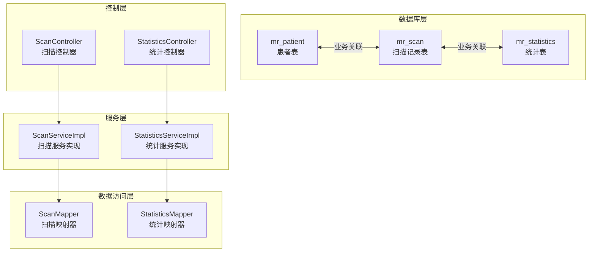
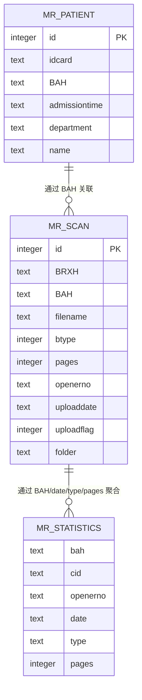
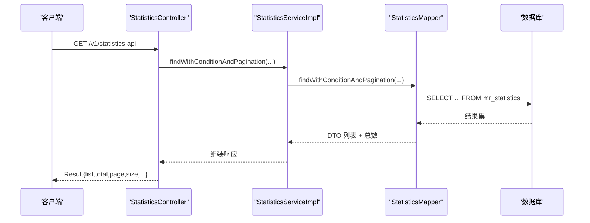
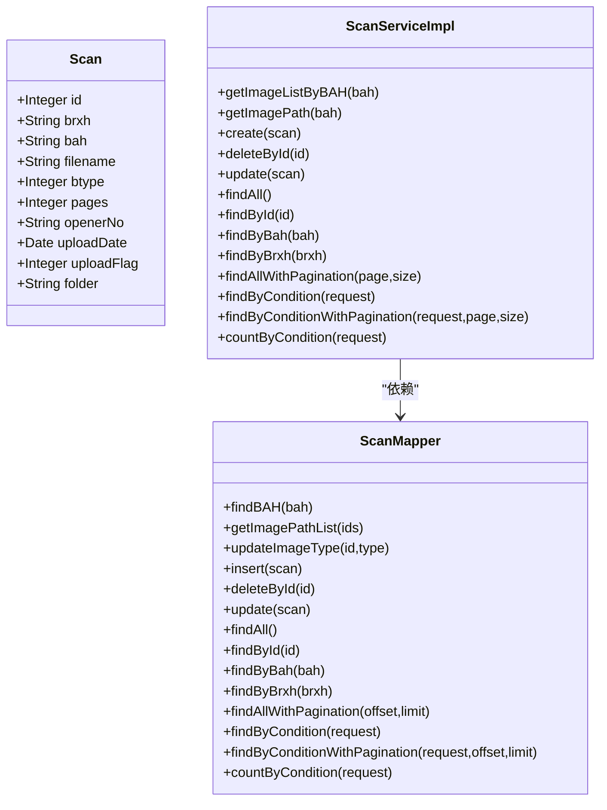
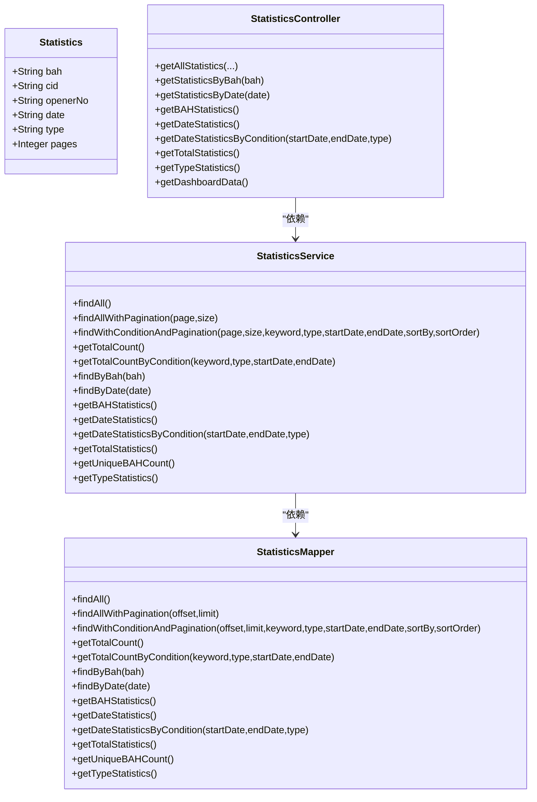
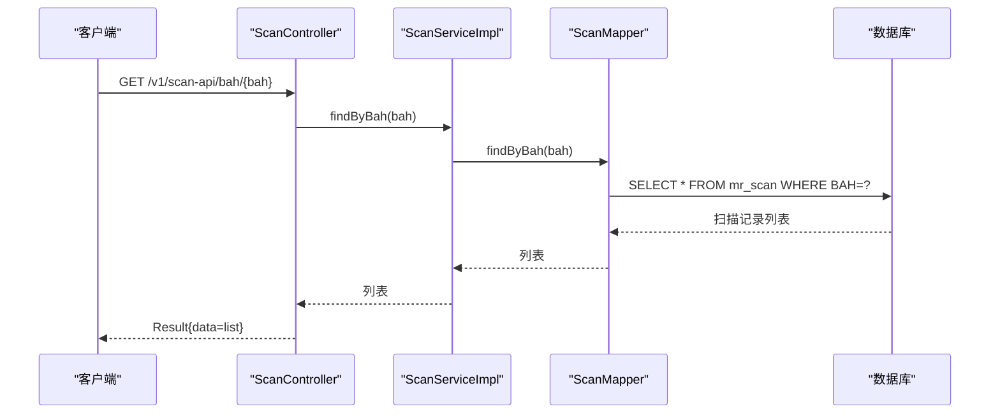
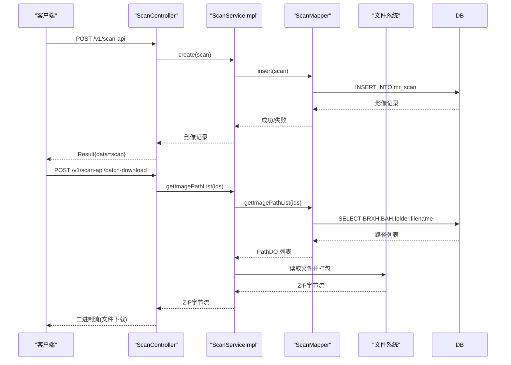
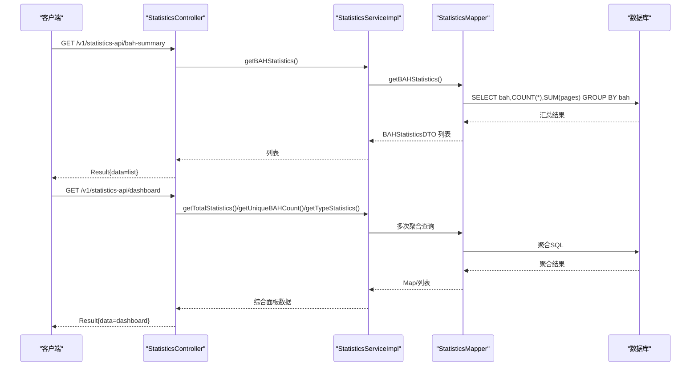
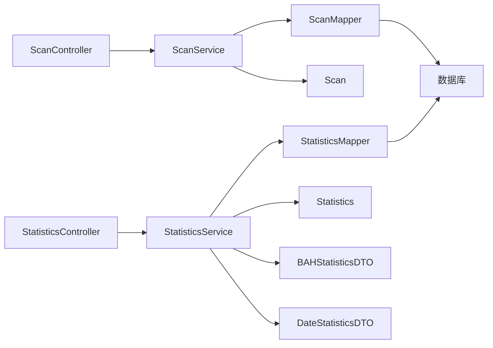

# 核心业务表

**本文引用的文件**
- [schema.sql](file://mrr-db/schema.sql)
- [Patient.java](file://backend-repo/src/main/java/com/zjcxph/imgapi/entity/Patient.java)
- [Scan.java](file://backend-repo/src/main/java/com/zjcxph/imgapi/entity/Scan.java)
- [Statistics.java](file://backend-repo/src/main/java/com/zjcxph/imgapi/entity/Statistics.java)
- [ScanMapper.java](file://backend-repo/src/main/java/com/zjcxph/imgapi/mapper/ScanMapper.java)
- [ScanServiceImpl.java](file://backend-repo/src/main/java/com/zjcxph/imgapi/service/impl/ScanServiceImpl.java)
- [StatisticsMapper.java](file://backend-repo/src/main/java/com/zjcxph/imgapi/mapper/StatisticsMapper.java)
- [StatisticsService.java](file://backend-repo/src/main/java/com/zjcxph/imgapi/service/StatisticsService.java)
- [StatisticsServiceImpl.java](file://backend-repo/src/main/java/com/zjcxph/imgapi/service/impl/StatisticsServiceImpl.java)
- [StatisticsController.java](file://backend-repo/src/main/java/com/zjcxph/imgapi/controller/StatisticsController.java)
- [ScanController.java](file://backend-repo/src/main/java/com/zjcxph/imgapi/controller/ScanController.java)
- [BAHStatisticsDTO.java](file://backend-repo/src/main/java/com/zjcxph/imgapi/dto/resp/BAHStatisticsDTO.java)
- [DateStatisticsDTO.java](file://backend-repo/src/main/java/com/zjcxph/imgapi/dto/resp/DateStatisticsDTO.java)
- [StatisticsTest.java](file://backend-repo/src/test/java/com/zjcxph/imgapi/StatisticsTest.java)

## 目录
1. [简介](#简介)
2. [项目结构](#项目结构)
3. [核心组件](#核心组件)
4. [架构概览](#架构概览)
5. [详细组件分析](#详细组件分析)
6. [依赖分析](#依赖分析)
7. [性能考虑](#性能考虑)
8. [故障排除指南](#故障排除指南)
9. [结论](#结论)

## 简介
本文件面向MRR系统的核心业务表，围绕以下三张表展开：
- mr_patient（患者表）
- mr_scan（扫描记录表）
- mr_statistics（统计表）

我们将从数据模型设计、字段定义、业务含义、表间关联关系、典型业务场景以及数据流转角度进行全面阐述，并提供可视化图表帮助开发者快速理解。

## 项目结构
后端采用Java Spring Boot + MyBatis架构，核心业务表位于数据库模式文件中，对应的实体类、Mapper接口与Service层分别位于backend-repo目录下。控制器层提供REST API，用于对外暴露数据访问与统计能力。

**图表来源**
- [schema.sql:16-48](file://mrr-db/schema.sql#L16-L48)
- [ScanServiceImpl.java:16-24](file://backend-repo/src/main/java/com/zjcxph/imgapi/service/impl/ScanServiceImpl.java#L16-L24)
- [StatisticsServiceImpl.java:14-20](file://backend-repo/src/main/java/com/zjcxph/imgapi/service/impl/StatisticsServiceImpl.java#L14-L20)
- [ScanMapper.java:15-131](file://backend-repo/src/main/java/com/zjcxph/imgapi/mapper/ScanMapper.java#L15-L131)
- [StatisticsMapper.java:14-168](file://backend-repo/src/main/java/com/zjcxph/imgapi/mapper/StatisticsMapper.java#L14-L168)
- [ScanController.java:38-49](file://backend-repo/src/main/java/com/zjcxph/imgapi/controller/ScanController.java#L38-L49)
- [StatisticsController.java:30-41](file://backend-repo/src/main/java/com/zjcxph/imgapi/controller/StatisticsController.java#L30-L41)

**章节来源**
- [schema.sql:16-48](file://mrr-db/schema.sql#L16-L48)
- [ScanController.java:38-49](file://backend-repo/src/main/java/com/zjcxph/imgapi/controller/ScanController.java#L38-L49)
- [StatisticsController.java:30-41](file://backend-repo/src/main/java/com/zjcxph/imgapi/controller/StatisticsController.java#L30-L41)

## 核心组件

### 数据模型总览
- mr_patient（患者表）：存储患者基本信息，作为扫描记录的上游数据来源之一。
- mr_scan（扫描记录表）：记录影像扫描的元数据与状态，是统计表的数据来源。
- mr_statistics（统计表）：对扫描记录进行聚合统计，支撑报表与仪表盘展示。

**图表来源**
- [schema.sql:16-48](file://mrr-db/schema.sql#L16-L48)

**章节来源**
- [schema.sql:16-48](file://mrr-db/schema.sql#L16-L48)

## 架构概览
从数据流向看，扫描记录表承载了最原始的业务数据，统计表基于扫描记录进行聚合；患者表提供患者维度的基础信息。控制器层接收请求，调用服务层，服务层通过Mapper访问数据库，最终返回给前端或调用方。

**图表来源**
- [StatisticsController.java:43-109](file://backend-repo/src/main/java/com/zjcxph/imgapi/controller/StatisticsController.java#L43-L109)
- [StatisticsServiceImpl.java:33-46](file://backend-repo/src/main/java/com/zjcxph/imgapi/service/impl/StatisticsServiceImpl.java#L33-L46)
- [StatisticsMapper.java:24-72](file://backend-repo/src/main/java/com/zjcxph/imgapi/mapper/StatisticsMapper.java#L24-L72)

**章节来源**
- [StatisticsController.java:43-109](file://backend-repo/src/main/java/com/zjcxph/imgapi/controller/StatisticsController.java#L43-L109)
- [StatisticsServiceImpl.java:33-46](file://backend-repo/src/main/java/com/zjcxph/imgapi/service/impl/StatisticsServiceImpl.java#L33-L46)
- [StatisticsMapper.java:24-72](file://backend-repo/src/main/java/com/zjcxph/imgapi/mapper/StatisticsMapper.java#L24-L72)

## 详细组件分析

### mr_patient（患者表）数据模型
- 设计理念：以患者维度为核心，提供基础标识与基本信息，便于与其他业务表建立关联。
- 业务用途：作为扫描记录的关联对象之一，支撑按患者维度的检索与统计。
- 字段定义与业务含义：
  - id：主键，整型，唯一标识患者。
  - idcard：身份证号，文本，唯一性约束在数据库层面未见声明，建议在应用层或数据库层补充唯一性约束。
  - BAH：病案号，文本，与扫描记录表形成强关联。
  - admissiontime：入院时间，文本，便于统计与筛选。
  - department：住院科室，文本，支持按科室统计。
  - name：患者姓名，文本，便于展示与检索。
- 约束条件：未见显式主键/唯一性约束定义，建议在生产环境补充唯一性与非空约束。
- 关联关系：与mr_scan通过BAH建立关联，用于按病案号检索扫描记录。

**章节来源**
- [schema.sql:16-24](file://mrr-db/schema.sql#L16-L24)
- [Patient.java:6-20](file://backend-repo/src/main/java/com/zjcxph/imgapi/entity/Patient.java#L6-L20)

### mr_scan（扫描记录表）数据模型
- 设计理念：记录影像扫描的元数据与状态，支撑批量下载、类型分类、分页查询与条件过滤。
- 业务用途：作为统计表的数据源，提供扫描详情、路径解析与批量操作能力。
- 字段定义与业务含义：
  - id：主键，整型，唯一标识扫描记录。
  - BRXH：病人序号，文本，支持按病人序号检索。
  - BAH：病案号，文本，与患者表、统计表形成关联。
  - filename：文件名，文本，用于定位具体影像文件。
  - btype：类型，整型，用于区分扫描类型。
  - pages：页数，整型，用于统计与计算。
  - openerno：操作员编号，文本，便于审计与追踪。
  - uploaddate：上传日期，文本，支持按日期筛选。
  - uploadflag：上传标志，整型，用于软删除或状态控制。
  - folder：文件夹路径片段，文本，与文件系统布局相关。
- 约束条件：id为主键；部分字段允许为空，需在业务层保证一致性。
- 关联关系：与mr_patient通过BAH关联；与mr_statistics通过BAH/date/type/pages聚合。

**图表来源**
- [Scan.java:10-21](file://backend-repo/src/main/java/com/zjcxph/imgapi/entity/Scan.java#L10-L21)
- [ScanMapper.java:17-131](file://backend-repo/src/main/java/com/zjcxph/imgapi/mapper/ScanMapper.java#L17-L131)
- [ScanServiceImpl.java:16-135](file://backend-repo/src/main/java/com/zjcxph/imgapi/service/impl/ScanServiceImpl.java#L16-L135)

**章节来源**
- [schema.sql:26-38](file://mrr-db/schema.sql#L26-L38)
- [Scan.java:10-21](file://backend-repo/src/main/java/com/zjcxph/imgapi/entity/Scan.java#L10-L21)
- [ScanMapper.java:17-131](file://backend-repo/src/main/java/com/zjcxph/imgapi/mapper/ScanMapper.java#L17-L131)
- [ScanServiceImpl.java:16-135](file://backend-repo/src/main/java/com/zjcxph/imgapi/service/impl/ScanServiceImpl.java#L16-L135)

### mr_statistics（统计表）数据模型
- 设计理念：对扫描记录进行聚合统计，支持按病案号、日期、类型等维度的汇总与趋势分析。
- 业务用途：为报表与仪表盘提供聚合数据，支撑运营与管理决策。
- 字段定义与业务含义：
  - bah：病案号，文本，与扫描记录表关联。
  - cid：客户编号，文本，用于区分客户维度。
  - openerno：操作员编号，文本，便于人员维度统计。
  - date：日期，文本，支持按日期聚合与趋势分析。
  - type：类型，文本，用于按类型统计。
  - pages：页数，整型，用于统计总页数。
- 约束条件：未见显式约束，建议在应用层或数据库层补充非空与合理性校验。
- 关联关系：与mr_scan通过BAH/date/type/pages进行聚合统计。

**图表来源**
- [Statistics.java:6-12](file://backend-repo/src/main/java/com/zjcxph/imgapi/entity/Statistics.java#L6-L12)
- [StatisticsMapper.java:17-168](file://backend-repo/src/main/java/com/zjcxph/imgapi/mapper/StatisticsMapper.java#L17-L168)
- [StatisticsService.java:10-56](file://backend-repo/src/main/java/com/zjcxph/imgapi/service/StatisticsService.java#L10-L56)
- [StatisticsServiceImpl.java:14-98](file://backend-repo/src/main/java/com/zjcxph/imgapi/service/impl/StatisticsServiceImpl.java#L14-L98)
- [StatisticsController.java:30-281](file://backend-repo/src/main/java/com/zjcxph/imgapi/controller/StatisticsController.java#L30-281)

**章节来源**
- [schema.sql:40-48](file://mrr-db/schema.sql#L40-L48)
- [Statistics.java:6-12](file://backend-repo/src/main/java/com/zjcxph/imgapi/entity/Statistics.java#L6-L12)
- [StatisticsMapper.java:17-168](file://backend-repo/src/main/java/com/zjcxph/imgapi/mapper/StatisticsMapper.java#L17-L168)
- [StatisticsService.java:10-56](file://backend-repo/src/main/java/com/zjcxph/imgapi/service/StatisticsService.java#L10-L56)
- [StatisticsServiceImpl.java:14-98](file://backend-repo/src/main/java/com/zjcxph/imgapi/service/impl/StatisticsServiceImpl.java#L14-L98)
- [StatisticsController.java:30-281](file://backend-repo/src/main/java/com/zjcxph/imgapi/controller/StatisticsController.java#L30-281)

### 实际业务场景示例

#### 场景一：患者信息管理与关联查询
- 业务目标：维护患者基本信息，并能按病案号检索其扫描记录。
- 数据流：
  - 控制器接收请求，调用服务层。
  - 服务层通过Mapper查询mr_patient与mr_scan，按BAH关联。
  - 返回患者基本信息与关联的扫描记录列表。

**图表来源**
- [ScanController.java:168-182](file://backend-repo/src/main/java/com/zjcxph/imgapi/controller/ScanController.java#L168-L182)
- [ScanServiceImpl.java:104-106](file://backend-repo/src/main/java/com/zjcxph/imgapi/service/impl/ScanServiceImpl.java#L104-L106)
- [ScanMapper.java:68-70](file://backend-repo/src/main/java/com/zjcxph/imgapi/mapper/ScanMapper.java#L68-L70)

**章节来源**
- [ScanController.java:168-182](file://backend-repo/src/main/java/com/zjcxph/imgapi/controller/ScanController.java#L168-L182)
- [ScanServiceImpl.java:104-106](file://backend-repo/src/main/java/com/zjcxph/imgapi/service/impl/ScanServiceImpl.java#L104-L106)
- [ScanMapper.java:68-70](file://backend-repo/src/main/java/com/zjcxph/imgapi/mapper/ScanMapper.java#L68-L70)

#### 场景二：影像扫描记录管理
- 业务目标：新增、更新、删除扫描记录，并支持批量下载。
- 数据流：
  - 控制器接收请求，封装为Scan实体。
  - 服务层调用Mapper执行插入/更新/删除。
  - 批量下载时，根据ids查询路径并打包压缩。

**图表来源**
- [ScanController.java:54-80](file://backend-repo/src/main/java/com/zjcxph/imgapi/controller/ScanController.java#L54-L80)
- [ScanController.java:256-281](file://backend-repo/src/main/java/com/zjcxph/imgapi/controller/ScanController.java#L256-L281)
- [ScanServiceImpl.java:63-65](file://backend-repo/src/main/java/com/zjcxph/imgapi/service/impl/ScanServiceImpl.java#L63-L65)
- [ScanMapper.java:21-27](file://backend-repo/src/main/java/com/zjcxph/imgapi/mapper/ScanMapper.java#L21-L27)

**章节来源**
- [ScanController.java:54-80](file://backend-repo/src/main/java/com/zjcxph/imgapi/controller/ScanController.java#L54-L80)
- [ScanController.java:256-281](file://backend-repo/src/main/java/com/zjcxph/imgapi/controller/ScanController.java#L256-L281)
- [ScanServiceImpl.java:63-65](file://backend-repo/src/main/java/com/zjcxph/imgapi/service/impl/ScanServiceImpl.java#L63-L65)
- [ScanMapper.java:21-27](file://backend-repo/src/main/java/com/zjcxph/imgapi/mapper/ScanMapper.java#L21-L27)

#### 场景三：统计数据生成与查询
- 业务目标：按病案号、日期、类型等维度生成统计报表。
- 数据流：
  - 控制器接收查询参数，调用服务层。
  - 服务层通过Mapper执行聚合查询，返回DTO列表或总览数据。

**图表来源**
- [StatisticsController.java:144-158](file://backend-repo/src/main/java/com/zjcxph/imgapi/controller/StatisticsController.java#L144-L158)
- [StatisticsController.java:215-242](file://backend-repo/src/main/java/com/zjcxph/imgapi/controller/StatisticsController.java#L215-L242)
- [StatisticsServiceImpl.java:69-71](file://backend-repo/src/main/java/com/zjcxph/imgapi/service/impl/StatisticsServiceImpl.java#L69-L71)
- [StatisticsServiceImpl.java:84-96](file://backend-repo/src/main/java/com/zjcxph/imgapi/service/impl/StatisticsServiceImpl.java#L84-L96)
- [StatisticsMapper.java:117-121](file://backend-repo/src/main/java/com/zjcxph/imgapi/mapper/StatisticsMapper.java#L117-L121)
- [StatisticsMapper.java:153-159](file://backend-repo/src/main/java/com/zjcxph/imgapi/mapper/StatisticsMapper.java#L153-L159)

**章节来源**
- [StatisticsController.java:144-158](file://backend-repo/src/main/java/com/zjcxph/imgapi/controller/StatisticsController.java#L144-L158)
- [StatisticsController.java:215-242](file://backend-repo/src/main/java/com/zjcxph/imgapi/controller/StatisticsController.java#L215-L242)
- [StatisticsServiceImpl.java:69-71](file://backend-repo/src/main/java/com/zjcxph/imgapi/service/impl/StatisticsServiceImpl.java#L69-L71)
- [StatisticsServiceImpl.java:84-96](file://backend-repo/src/main/java/com/zjcxph/imgapi/service/impl/StatisticsServiceImpl.java#L84-L96)
- [StatisticsMapper.java:117-121](file://backend-repo/src/main/java/com/zjcxph/imgapi/mapper/StatisticsMapper.java#L117-L121)
- [StatisticsMapper.java:153-159](file://backend-repo/src/main/java/com/zjcxph/imgapi/mapper/StatisticsMapper.java#L153-L159)

## 依赖分析
- 控制器层依赖服务层接口，确保业务逻辑与HTTP协议解耦。
- 服务层依赖Mapper接口，Mapper通过MyBatis映射SQL到数据库。
- 实体类与数据库表字段一一对应，保持数据传输对象的一致性。
- 统计DTO（BAHStatisticsDTO、DateStatisticsDTO）用于跨层传递聚合结果。

**图表来源**
- [ScanController.java:38-49](file://backend-repo/src/main/java/com/zjcxph/imgapi/controller/ScanController.java#L38-L49)
- [ScanServiceImpl.java:16-24](file://backend-repo/src/main/java/com/zjcxph/imgapi/service/impl/ScanServiceImpl.java#L16-L24)
- [ScanMapper.java:15-131](file://backend-repo/src/main/java/com/zjcxph/imgapi/mapper/ScanMapper.java#L15-L131)
- [StatisticsController.java:30-41](file://backend-repo/src/main/java/com/zjcxph/imgapi/controller/StatisticsController.java#L30-L41)
- [StatisticsServiceImpl.java:14-20](file://backend-repo/src/main/java/com/zjcxph/imgapi/service/impl/StatisticsServiceImpl.java#L14-L20)
- [StatisticsMapper.java:14-168](file://backend-repo/src/main/java/com/zjcxph/imgapi/mapper/StatisticsMapper.java#L14-L168)

**章节来源**
- [ScanController.java:38-49](file://backend-repo/src/main/java/com/zjcxph/imgapi/controller/ScanController.java#L38-L49)
- [ScanServiceImpl.java:16-24](file://backend-repo/src/main/java/com/zjcxph/imgapi/service/impl/ScanServiceImpl.java#L16-L24)
- [ScanMapper.java:15-131](file://backend-repo/src/main/java/com/zjcxph/imgapi/mapper/ScanMapper.java#L15-L131)
- [StatisticsController.java:30-41](file://backend-repo/src/main/java/com/zjcxph/imgapi/controller/StatisticsController.java#L30-L41)
- [StatisticsServiceImpl.java:14-20](file://backend-repo/src/main/java/com/zjcxph/imgapi/service/impl/StatisticsServiceImpl.java#L14-L20)
- [StatisticsMapper.java:14-168](file://backend-repo/src/main/java/com/zjcxph/imgapi/mapper/StatisticsMapper.java#L14-L168)

## 性能考虑
- 分页查询：扫描与统计均提供分页查询接口，避免一次性加载大量数据。
- 动态条件查询：支持按多个字段进行模糊/精确匹配，注意索引优化与SQL复杂度控制。
- 聚合统计：统计接口使用GROUP BY与SUM/COUNT，建议在高频字段上建立索引。
- 批量下载：通过路径列表直接读取文件并打包，减少中间对象开销。
- 缓存策略：可考虑对热点统计结果进行缓存，降低数据库压力。

## 故障排除指南
- 参数校验：
  - 日期格式：统计接口支持多种日期格式输入，内部会进行规范化处理。
  - 排序字段与方向：仅接受预设字段与asc/desc，其他值将回退到默认配置。
- 数据完整性：
  - 统计测试覆盖了空病案号与负页数等异常情况，建议在生产环境增加数据库级约束。
- 错误处理：
  - 控制器对非法参数返回明确错误信息，服务层捕获异常并转换为统一响应格式。

**章节来源**
- [StatisticsController.java:244-279](file://backend-repo/src/main/java/com/zjcxph/imgapi/controller/StatisticsController.java#L244-L279)
- [StatisticsTest.java:257-292](file://backend-repo/src/test/java/com/zjcxph/imgapi/StatisticsTest.java#L257-L292)

## 结论
本文从数据模型、字段定义、业务含义、表间关联与典型业务场景出发，系统梳理了MRR系统核心业务表mr_patient、mr_scan与mr_statistics的设计与实现。通过控制器-服务-数据访问-数据库的分层架构，系统实现了从扫描记录管理到统计分析的完整数据流。建议在生产环境中进一步完善数据库约束、索引与缓存策略，以提升系统的稳定性与性能。