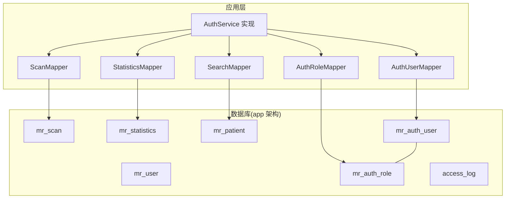
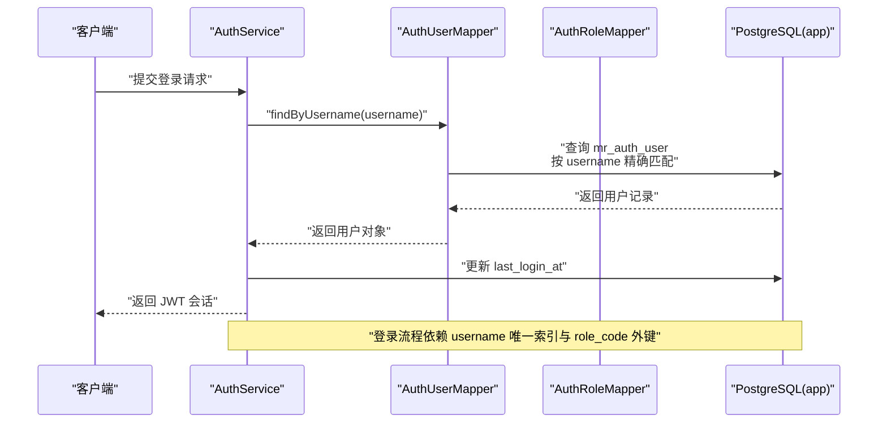
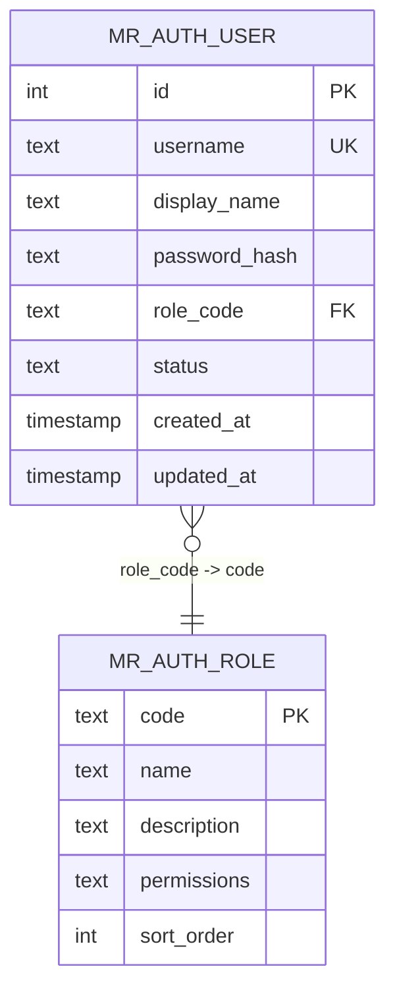
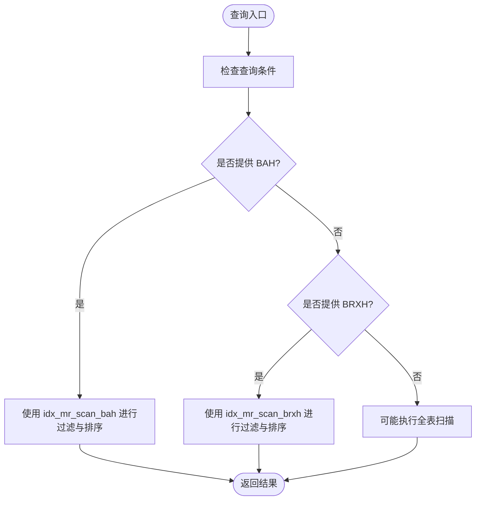
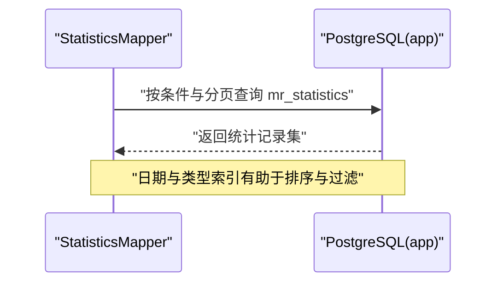
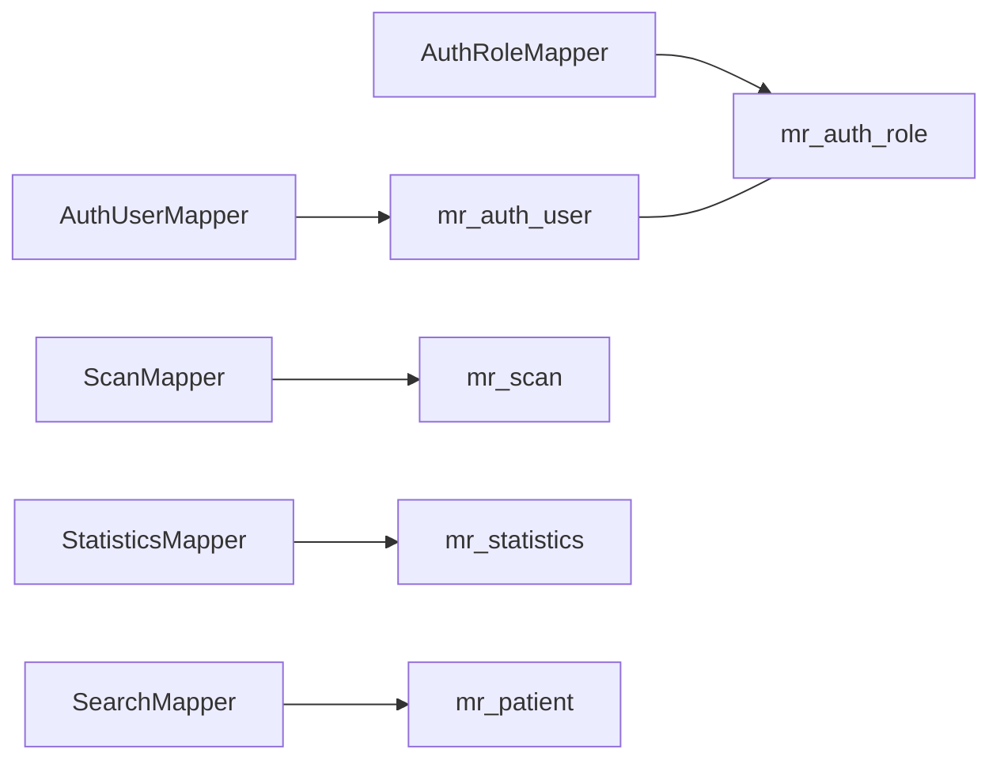

# 索引与约束

**本文引用的文件**
- [schema-postgresql.sql](file://backend-repo/src/main/resources/schema-postgresql.sql)
- [AuthUserMapper.java](file://backend-repo/src/main/java/com/zjcxph/imgapi/mapper/AuthUserMapper.java)
- [AuthRoleMapper.java](file://backend-repo/src/main/java/com/zjcxph/imgapi/mapper/AuthRoleMapper.java)
- [SearchMapper.java](file://backend-repo/src/main/java/com/zjcxph/imgapi/mapper/SearchMapper.java)
- [StatisticsMapper.java](file://backend-repo/src/main/java/com/zjcxph/imgapi/mapper/StatisticsMapper.java)
- [ScanMapper.java](file://backend-repo/src/main/java/com/zjcxph/imgapi/mapper/ScanMapper.java)
- [AuthUser.java](file://backend-repo/src/main/java/com/zjcxph/imgapi/entity/AuthUser.java)
- [AuthRole.java](file://backend-repo/src/main/java/com/zjcxph/imgapi/entity/AuthRole.java)
- [application.properties](file://backend-repo/src/main/resources/application.properties)

## 目录
1. [简介](#简介)
2. [项目结构](#项目结构)
3. [核心组件](#核心组件)
4. [架构总览](#架构总览)
5. [详细组件分析](#详细组件分析)
6. [依赖分析](#依赖分析)
7. [性能考量](#性能考量)
8. [故障排查指南](#故障排查指南)
9. [结论](#结论)
10. [附录](#附录)

## 简介
本文件聚焦于 MRR 数据库的索引与约束设计，系统梳理各表的主键、外键与唯一性约束，解释索引策略的选择原因与性能影响，并结合实际查询路径给出索引优化建议、查询性能分析与数据库调优指导。同时提供常见 SQL 查询的索引使用示例，帮助读者在不直接阅读源码的情况下理解数据库层面的设计意图与最佳实践。

## 项目结构
- 后端使用 Spring Boot + MyBatis 访问 PostgreSQL 数据库，数据库初始化脚本位于资源目录中，采用 app 架构空间组织表结构。
- 关键表包括：mr_scan、mr_statistics、mr_patient、mr_user、mr_auth_role、mr_auth_user、access_log。
- 索引覆盖了高频查询字段，如用户登录、角色关联、扫描记录检索、统计报表等场景。

图表来源
- [application.properties:10-22](file://backend-repo/src/main/resources/application.properties#L10-L22)
- [schema-postgresql.sql:1-109](file://backend-repo/src/main/resources/schema-postgresql.sql#L1-L109)

章节来源
- [application.properties:10-22](file://backend-repo/src/main/resources/application.properties#L10-L22)
- [schema-postgresql.sql:1-109](file://backend-repo/src/main/resources/schema-postgresql.sql#L1-L109)

## 核心组件
- 表与约束
  - mr_auth_role：主键 code，确保角色唯一标识；name、permissions 非空；sort_order 默认值。
  - mr_auth_user：自增主键 id；username 唯一；role_code 外键引用 mr_auth_role(code)，级联更新；status 默认 active；created_at/updated_at 默认当前时间。
  - mr_scan：自增主键 id；多字段存储扫描记录信息。
  - mr_statistics：非结构化统计表，包含 bah、cid、openerno、date、type、pages 等字段。
  - mr_patient：自增主键 id；idcard、bah 等字段。
  - mr_user：自增主键 id；name、age、email。
  - access_log：自增主键 id；记录访问日志关键字段。
- 索引
  - 用户相关：idx_mr_auth_user_username、idx_mr_auth_user_role_code。
  - 扫描相关：idx_mr_scan_bah、idx_mr_scan_brxh。
  - 统计相关：idx_mr_statistics_bah、idx_mr_statistics_date、idx_mr_statistics_type。
  - 患者相关：idx_mr_patient_idcard。
  - 访问日志：按时间倒序、时间升序+id 升序、client_ip、request_uri、method、response_status 等复合索引。

章节来源
- [schema-postgresql.sql:41-89](file://backend-repo/src/main/resources/schema-postgresql.sql#L41-L89)

## 架构总览
下图展示应用层与数据库层的交互关系，以及关键查询路径如何利用索引提升性能。

图表来源
- [AuthUserMapper.java:16-29](file://backend-repo/src/main/java/com/zjcxph/imgapi/mapper/AuthUserMapper.java#L16-L29)
- [schema-postgresql.sql:49-59](file://backend-repo/src/main/resources/schema-postgresql.sql#L49-L59)

## 详细组件分析

### 用户与角色表（mr_auth_user / mr_auth_role）
- 主键与唯一性
  - mr_auth_role(code)：主键，确保角色编码唯一。
  - mr_auth_user(id)：自增主键；username 唯一，保障登录凭据唯一。
- 外键关系
  - mr_auth_user.role_code → mr_auth_role.code，ON UPDATE CASCADE，确保角色变更时用户角色同步更新。
- 索引策略
  - idx_mr_auth_user_username：支撑 findByUsername 精确查找，避免全表扫描。
  - idx_mr_auth_user_role_code：支撑按角色过滤与连接查询。
- 性能影响
  - 登录流程频繁按 username 查找用户并进行密码校验，username 唯一索引可将查找复杂度降至 O(log N)。
  - 角色维度统计与权限判定可通过 role_code 索引快速定位用户集合。

图表来源
- [schema-postgresql.sql:41-59](file://backend-repo/src/main/resources/schema-postgresql.sql#L41-L59)
- [AuthUserMapper.java:16-29](file://backend-repo/src/main/java/com/zjcxph/imgapi/mapper/AuthUserMapper.java#L16-L29)

章节来源
- [schema-postgresql.sql:41-59](file://backend-repo/src/main/resources/schema-postgresql.sql#L41-L59)
- [AuthUserMapper.java:16-29](file://backend-repo/src/main/java/com/zjcxph/imgapi/mapper/AuthUserMapper.java#L16-L29)
- [AuthRoleMapper.java:13-17](file://backend-repo/src/main/java/com/zjcxph/imgapi/mapper/AuthRoleMapper.java#L13-L17)

### 扫描记录表（mr_scan）
- 主键与业务键
  - 主键 id 自动生成；业务键包括 BAH（病案号）、BRXH（病人序号）、filename、folder 等。
- 索引策略
  - idx_mr_scan_bah：支撑按病案号查询与排序。
  - idx_mr_scan_brxh：支撑按病人序号查询。
- 性能影响
  - 病案号与病人序号是高频检索字段，建立单列索引可显著降低查询成本。
  - 若存在大量按 BAH 的分页查询，建议评估是否需要组合索引以覆盖排序与过滤。

图表来源
- [schema-postgresql.sql:75-76](file://backend-repo/src/main/resources/schema-postgresql.sql#L75-L76)
- [ScanMapper.java:17-74](file://backend-repo/src/main/java/com/zjcxph/imgapi/mapper/ScanMapper.java#L17-L74)

章节来源
- [schema-postgresql.sql:75-76](file://backend-repo/src/main/resources/schema-postgresql.sql#L75-L76)
- [ScanMapper.java:17-74](file://backend-repo/src/main/java/com/zjcxph/imgapi/mapper/ScanMapper.java#L17-L74)

### 统计报表表（mr_statistics）
- 字段与查询模式
  - 包含 bah、cid、openerno、date、type、pages 等字段，支持按关键字、类型、日期范围等条件查询与分页。
- 索引策略
  - idx_mr_statistics_bah：支撑按病案号查询。
  - idx_mr_statistics_date：支撑按日期查询与排序。
  - idx_mr_statistics_type：支撑按类型过滤。
- 性能影响
  - 多条件组合查询与排序需综合考虑索引选择与查询计划；LIKE 模糊匹配通常无法有效利用索引，建议在业务允许范围内尽量减少模糊匹配或改用更精确的过滤条件。

图表来源
- [schema-postgresql.sql:77-79](file://backend-repo/src/main/resources/schema-postgresql.sql#L77-L79)
- [StatisticsMapper.java:24-72](file://backend-repo/src/main/java/com/zjcxph/imgapi/mapper/StatisticsMapper.java#L24-L72)

章节来源
- [schema-postgresql.sql:77-79](file://backend-repo/src/main/resources/schema-postgresql.sql#L77-L79)
- [StatisticsMapper.java:24-72](file://backend-repo/src/main/java/com/zjcxph/imgapi/mapper/StatisticsMapper.java#L24-L72)

### 患者表（mr_patient）
- 索引策略
  - idx_mr_patient_idcard：支撑按身份证号查询。
- 性能影响
  - 身份证号是唯一识别符，建立索引可显著提升患者档案检索效率。

章节来源
- [schema-postgresql.sql](file://backend-repo/src/main/resources/schema-postgresql.sql#L80)
- [SearchMapper.java](file://backend-repo/src/main/java/com/zjcxph/imgapi/mapper/SearchMapper.java#L14)

### 访问日志表（access_log）
- 索引策略
  - idx_access_log_access_time（降序）：支撑按时间倒序查看最新日志。
  - idx_access_log_access_time_id（升序, id 升序）：支撑按时间与 id 的稳定排序与分页。
  - idx_access_log_client_ip、idx_access_log_request_uri、idx_access_log_method、idx_access_log_response_status：支撑按维度过滤。
  - idx_access_log_method_status：支撑按方法与状态组合过滤。
- 性能影响
  - 日志表写入频繁，读取多为按时间窗口与维度过滤，上述索引可有效支撑常见查询模式。

章节来源
- [schema-postgresql.sql:83-89](file://backend-repo/src/main/resources/schema-postgresql.sql#L83-L89)

## 依赖分析
- 应用层依赖
  - AuthUserMapper 依赖 mr_auth_user 表，使用 username 唯一索引与 role_code 外键。
  - AuthRoleMapper 依赖 mr_auth_role 表，使用 code 主键。
  - ScanMapper 依赖 mr_scan 表，使用 BAH/BRXH 索引。
  - StatisticsMapper 依赖 mr_statistics 表，使用 bah/date/type 索引。
  - SearchMapper 依赖 mr_patient 表，使用 idcard 索引。
- 外部依赖
  - 数据库驱动与连接池配置由 application.properties 提供，初始化脚本位于 schema-postgresql.sql。

图表来源
- [AuthUserMapper.java:16-29](file://backend-repo/src/main/java/com/zjcxph/imgapi/mapper/AuthUserMapper.java#L16-L29)
- [AuthRoleMapper.java:13-17](file://backend-repo/src/main/java/com/zjcxph/imgapi/mapper/AuthRoleMapper.java#L13-L17)
- [ScanMapper.java:17-74](file://backend-repo/src/main/java/com/zjcxph/imgapi/mapper/ScanMapper.java#L17-L74)
- [StatisticsMapper.java:17-22](file://backend-repo/src/main/java/com/zjcxph/imgapi/mapper/StatisticsMapper.java#L17-L22)
- [SearchMapper.java](file://backend-repo/src/main/java/com/zjcxph/imgapi/mapper/SearchMapper.java#L14)

章节来源
- [application.properties:10-22](file://backend-repo/src/main/resources/application.properties#L10-L22)
- [schema-postgresql.sql:1-109](file://backend-repo/src/main/resources/schema-postgresql.sql#L1-L109)

## 性能考量
- 索引选择原则
  - 高频等值/范围查询优先：username、role_code、bah、brxh、date、type、idcard。
  - 排序与分页：对 ORDER BY 字段建立单列或组合索引，避免隐式排序导致的排序开销。
  - 过滤条件：WHERE 中的过滤字段应尽可能纳入索引，减少回表次数。
- 查询优化建议
  - 登录与用户查询：确保 username 唯一索引命中，避免 LIKE 模糊匹配。
  - 扫描记录查询：优先使用 BAH/BRXH 索引；若存在多条件组合，评估组合索引覆盖。
  - 统计查询：尽量减少 LIKE 模糊匹配；日期范围查询可利用索引覆盖。
  - 日志查询：按时间窗口与维度过滤时，优先使用已存在的索引。
- 数据库调优
  - 定期分析表统计信息与索引使用率，必要时重建索引。
  - 对热点表进行分区或归档，降低热区压力。
  - 控制写放大，批量插入与更新，避免长事务。

[本节为通用性能指导，无需列出具体文件来源]

## 故障排查指南
- 登录失败或慢查询
  - 检查 username 是否唯一且索引可用；确认用户状态为 active。
  - 参考路径：[AuthUserMapper.java:16-29](file://backend-repo/src/main/java/com/zjcxph/imgapi/mapper/AuthUserMapper.java#L16-L29)
- 用户列表或更新异常
  - 确认 id 存在且未被并发修改；关注 updateUser/updateStatus 的返回值。
  - 参考路径：[AuthUserMapper.java:61-76](file://backend-repo/src/main/java/com/zjcxph/imgapi/mapper/AuthUserMapper.java#L61-L76)
- 扫描记录查询无结果
  - 检查 BAH/BRXH 是否正确传入；确认索引是否存在。
  - 参考路径：[ScanMapper.java:17-74](file://backend-repo/src/main/java/com/zjcxph/imgapi/mapper/ScanMapper.java#L17-L74)
- 统计查询性能差
  - 减少 LIKE 模糊匹配；使用精确过滤与日期范围；确认相关索引。
  - 参考路径：[StatisticsMapper.java:24-72](file://backend-repo/src/main/java/com/zjcxph/imgapi/mapper/StatisticsMapper.java#L24-L72)
- 患者查询异常
  - 确认身份证号传参正确；检查 idcard 索引。
  - 参考路径：[SearchMapper.java](file://backend-repo/src/main/java/com/zjcxph/imgapi/mapper/SearchMapper.java#L14)

章节来源
- [AuthUserMapper.java:16-76](file://backend-repo/src/main/java/com/zjcxph/imgapi/mapper/AuthUserMapper.java#L16-L76)
- [ScanMapper.java:17-74](file://backend-repo/src/main/java/com/zjcxph/imgapi/mapper/ScanMapper.java#L17-L74)
- [StatisticsMapper.java:24-72](file://backend-repo/src/main/java/com/zjcxph/imgapi/mapper/StatisticsMapper.java#L24-L72)
- [SearchMapper.java](file://backend-repo/src/main/java/com/zjcxph/imgapi/mapper/SearchMapper.java#L14)

## 结论
MRR 数据库在关键查询路径上建立了针对性索引，配合主键、唯一性与外键约束，有效保障了数据完整性与查询性能。针对高频业务场景（登录、扫描记录检索、统计报表、日志查询），现有索引已能较好满足需求。建议持续监控查询计划与索引使用情况，结合业务演进适时调整索引策略，进一步提升整体性能与稳定性。

[本节为总结性内容，无需列出具体文件来源]

## 附录
- 常见 SQL 查询与索引使用示例（基于现有索引）
  - 登录查询：按 username 精确匹配，依赖 username 唯一索引。
    - 示例路径：[AuthUserMapper.java:16-29](file://backend-repo/src/main/java/com/zjcxph/imgapi/mapper/AuthUserMapper.java#L16-L29)
  - 用户列表：按 id 排序，依赖主键索引。
    - 示例路径：[AuthUserMapper.java:56-58](file://backend-repo/src/main/java/com/zjcxph/imgapi/mapper/AuthUserMapper.java#L56-L58)
  - 按病案号查询扫描记录：依赖 idx_mr_scan_bah。
    - 示例路径：[ScanMapper.java:17-70](file://backend-repo/src/main/java/com/zjcxph/imgapi/mapper/ScanMapper.java#L17-L70)
  - 按病人序号查询扫描记录：依赖 idx_mr_scan_brxh。
    - 示例路径：[ScanMapper.java:72-74](file://backend-repo/src/main/java/com/zjcxph/imgapi/mapper/ScanMapper.java#L72-L74)
  - 按身份证号查询患者：依赖 idx_mr_patient_idcard。
    - 示例路径：[SearchMapper.java](file://backend-repo/src/main/java/com/zjcxph/imgapi/mapper/SearchMapper.java#L14)
  - 统计报表查询：按日期、类型、病案号过滤与排序，依赖相应索引。
    - 示例路径：[StatisticsMapper.java:24-72](file://backend-repo/src/main/java/com/zjcxph/imgapi/mapper/StatisticsMapper.java#L24-L72)
  - 访问日志查询：按时间窗口与维度过滤，依赖相应索引。
    - 示例路径：[schema-postgresql.sql:83-89](file://backend-repo/src/main/resources/schema-postgresql.sql#L83-L89)

章节来源
- [AuthUserMapper.java:16-58](file://backend-repo/src/main/java/com/zjcxph/imgapi/mapper/AuthUserMapper.java#L16-L58)
- [ScanMapper.java:17-74](file://backend-repo/src/main/java/com/zjcxph/imgapi/mapper/ScanMapper.java#L17-L74)
- [SearchMapper.java](file://backend-repo/src/main/java/com/zjcxph/imgapi/mapper/SearchMapper.java#L14)
- [StatisticsMapper.java:24-72](file://backend-repo/src/main/java/com/zjcxph/imgapi/mapper/StatisticsMapper.java#L24-L72)
- [schema-postgresql.sql:83-89](file://backend-repo/src/main/resources/schema-postgresql.sql#L83-L89)