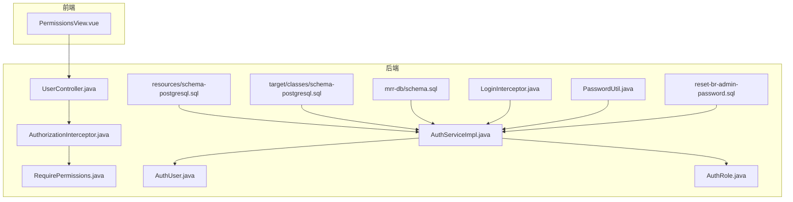
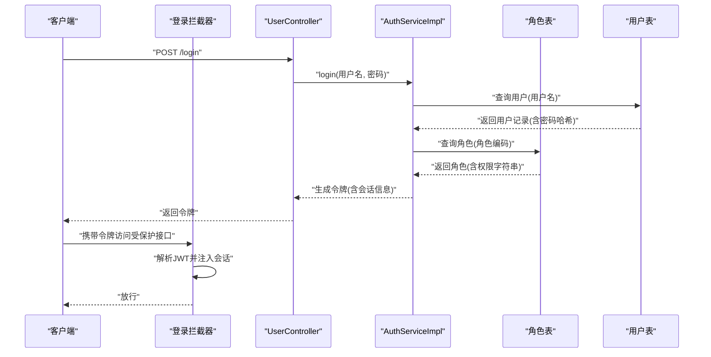
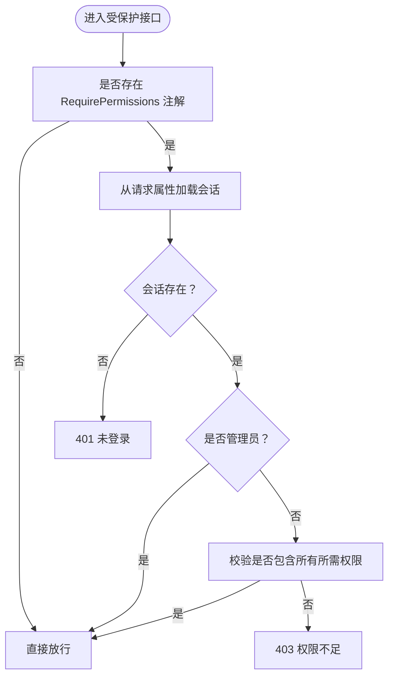
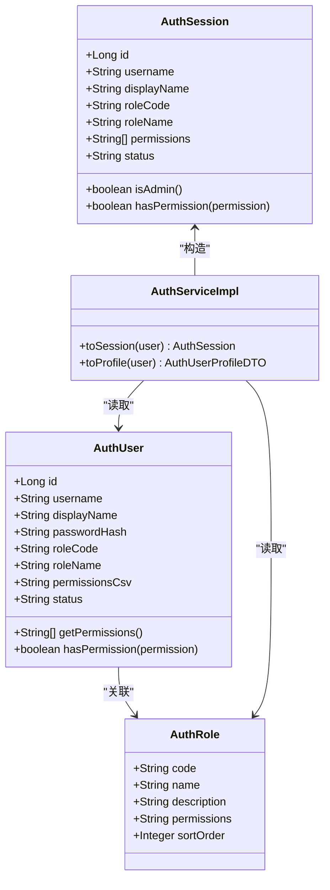
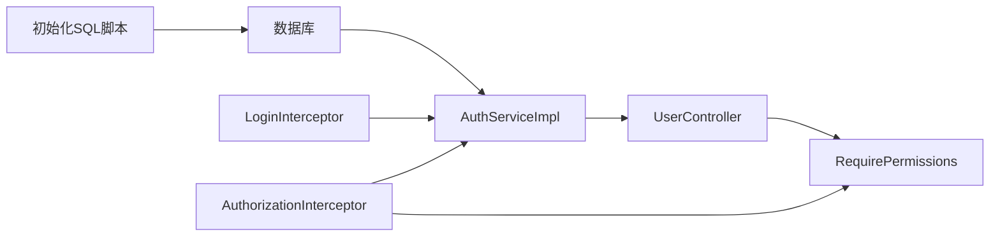

# 初始数据与示例

**本文引用的文件**
- [schema-postgresql.sql](file://backend-repo/src/main/resources/schema-postgresql.sql)
- [schema-postgresql.sql（目标类路径）](file://backend-repo/target/classes/schema-postgresql.sql)
- [schema.sql（mrr-db）](file://mrr-db/schema.sql)
- [AuthRole.java](file://backend-repo/src/main/java/com/zjcxph/imgapi/entity/AuthRole.java)
- [AuthUser.java](file://backend-repo/src/main/java/com/zjcxph/imgapi/entity/AuthUser.java)
- [RequirePermissions.java](file://backend-repo/src/main/java/com/zjcxph/imgapi/annotation/RequirePermissions.java)
- [AuthorizationInterceptor.java](file://backend-repo/src/main/java/com/zjcxph/imgapi/interceptors/AuthorizationInterceptor.java)
- [LoginInterceptor.java](file://backend-repo/src/main/java/com/zjcxph/imgapi/interceptors/LoginInterceptor.java)
- [UserController.java](file://backend-repo/src/main/java/com/zjcxph/imgapi/controller/UserController.java)
- [AuthServiceImpl.java](file://backend-repo/src/main/java/com/zjcxph/imgapi/service/impl/AuthServiceImpl.java)
- [PasswordUtil.java](file://backend-repo/src/main/java/com/zjcxph/imgapi/utils/PasswordUtil.java)
- [reset-br-admin-password.sql](file://backend-repo/src/main/resources/reset-br-admin-password.sql)
- [PermissionsView.vue](file://frontend-repo/src/components/admin/PermissionsView.vue)

## 目录
1. [简介](#简介)
2. [项目结构](#项目结构)
3. [核心组件](#核心组件)
4. [架构总览](#架构总览)
5. [详细组件分析](#详细组件分析)
6. [依赖分析](#依赖分析)
7. [性能考虑](#性能考虑)
8. [故障排查指南](#故障排查指南)
9. [结论](#结论)
10. [附录](#附录)

## 简介
本文件面向MRR系统的认证授权初始数据，系统性说明以下内容：
- 预置角色：ADMIN（系统管理员）、DOCTOR（医生）、NURSE（护士）的权限配置与职责范围
- 权限字符串的语义与业务场景映射
- 初始用户数据：br_admin、admin、doctor1、nurse1 的账户信息与默认密码哈希
- 角色与用户数据的导入流程、初始化脚本与部署注意事项
- 新环境部署时的种子数据配置指南与安全建议

## 项目结构
本项目的认证授权初始数据主要位于后端资源目录与数据库脚本中，并通过拦截器与服务层在运行期生效。前端提供“权限中心”视图用于展示与核验角色与权限。

图表来源
- [schema-postgresql.sql:91-108](file://backend-repo/src/main/resources/schema-postgresql.sql#L91-L108)
- [schema-postgresql.sql（目标类路径）:91-108](file://backend-repo/target/classes/schema-postgresql.sql#L91-L108)
- [mrr-db/schema.sql:58-94](file://mrr-db/schema.sql#L58-L94)
- [UserController.java:27-94](file://backend-repo/src/main/java/com/zjcxph/imgapi/controller/UserController.java#L27-L94)
- [AuthorizationInterceptor.java:18-56](file://backend-repo/src/main/java/com/zjcxph/imgapi/interceptors/AuthorizationInterceptor.java#L18-L56)
- [LoginInterceptor.java:36-68](file://backend-repo/src/main/java/com/zjcxph/imgapi/interceptors/LoginInterceptor.java#L36-L68)
- [RequirePermissions.java:8-12](file://backend-repo/src/main/java/com/zjcxph/imgapi/annotation/RequirePermissions.java#L8-L12)
- [AuthServiceImpl.java:104-135](file://backend-repo/src/main/java/com/zjcxph/imgapi/service/impl/AuthServiceImpl.java#L104-L135)
- [AuthUser.java:116-132](file://backend-repo/src/main/java/com/zjcxph/imgapi/entity/AuthUser.java#L116-L132)
- [AuthRole.java:5-11](file://backend-repo/src/main/java/com/zjcxph/imgapi/entity/AuthRole.java#L5-L11)
- [PasswordUtil.java:10-22](file://backend-repo/src/main/java/com/zjcxph/imgapi/utils/PasswordUtil.java#L10-L22)
- [reset-br-admin-password.sql:1-16](file://backend-repo/src/main/resources/reset-br-admin-password.sql#L1-L16)
- [PermissionsView.vue:157-294](file://frontend-repo/src/components/admin/PermissionsView.vue#L157-L294)

章节来源
- [schema-postgresql.sql:91-108](file://backend-repo/src/main/resources/schema-postgresql.sql#L91-L108)
- [mrr-db/schema.sql:58-94](file://mrr-db/schema.sql#L58-L94)
- [UserController.java:27-94](file://backend-repo/src/main/java/com/zjcxph/imgapi/controller/UserController.java#L27-L94)
- [AuthorizationInterceptor.java:18-56](file://backend-repo/src/main/java/com/zjcxph/imgapi/interceptors/AuthorizationInterceptor.java#L18-L56)
- [LoginInterceptor.java:36-68](file://backend-repo/src/main/java/com/zjcxph/imgapi/interceptors/LoginInterceptor.java#L36-L68)
- [AuthServiceImpl.java:104-135](file://backend-repo/src/main/java/com/zjcxph/imgapi/service/impl/AuthServiceImpl.java#L104-L135)
- [AuthUser.java:116-132](file://backend-repo/src/main/java/com/zjcxph/imgapi/entity/AuthUser.java#L116-L132)
- [AuthRole.java:5-11](file://backend-repo/src/main/java/com/zjcxph/imgapi/entity/AuthRole.java#L5-L11)
- [PasswordUtil.java:10-22](file://backend-repo/src/main/java/com/zjcxph/imgapi/utils/PasswordUtil.java#L10-L22)
- [reset-br-admin-password.sql:1-16](file://backend-repo/src/main/resources/reset-br-admin-password.sql#L1-L16)
- [PermissionsView.vue:157-294](file://frontend-repo/src/components/admin/PermissionsView.vue#L157-L294)

## 核心组件
- 角色实体与权限模型
  - 角色实体包含角色编码、名称、描述、权限字符串与排序字段，权限字符串以逗号分隔的权限点集合形式存储。
  - 用户实体包含用户名、显示名、密码哈希、角色编码、角色名称、权限CSV、状态等字段；提供将CSV解析为权限列表的方法与权限判断方法。
- 权限注解与拦截器
  - 注解用于在控制器方法上声明所需权限点集合。
  - 登录拦截器负责从请求头解析JWT并注入会话上下文。
  - 授权拦截器根据会话中的权限集合与注解要求进行校验，支持管理员豁免逻辑。
- 初始化脚本与重置脚本
  - 后端资源脚本中包含角色与用户的初始插入语句，采用“冲突忽略/更新”的策略保证幂等。
  - 提供重置 br_admin 密码的专用SQL脚本，便于生产环境快速恢复默认口令。

章节来源
- [AuthRole.java:5-11](file://backend-repo/src/main/java/com/zjcxph/imgapi/entity/AuthRole.java#L5-L11)
- [AuthUser.java:116-132](file://backend-repo/src/main/java/com/zjcxph/imgapi/entity/AuthUser.java#L116-L132)
- [RequirePermissions.java:8-12](file://backend-repo/src/main/java/com/zjcxph/imgapi/annotation/RequirePermissions.java#L8-L12)
- [AuthorizationInterceptor.java:18-56](file://backend-repo/src/main/java/com/zjcxph/imgapi/interceptors/AuthorizationInterceptor.java#L18-L56)
- [LoginInterceptor.java:36-68](file://backend-repo/src/main/java/com/zjcxph/imgapi/interceptors/LoginInterceptor.java#L36-L68)
- [schema-postgresql.sql:91-108](file://backend-repo/src/main/resources/schema-postgresql.sql#L91-L108)
- [reset-br-admin-password.sql:1-16](file://backend-repo/src/main/resources/reset-br-admin-password.sql#L1-L16)

## 架构总览
下图展示了从请求到权限校验与会话注入的关键流程，以及初始数据如何在系统启动时被加载。

图表来源
- [LoginInterceptor.java:36-68](file://backend-repo/src/main/java/com/zjcxph/imgapi/interceptors/LoginInterceptor.java#L36-L68)
- [UserController.java:38-47](file://backend-repo/src/main/java/com/zjcxph/imgapi/controller/UserController.java#L38-L47)
- [AuthServiceImpl.java:104-135](file://backend-repo/src/main/java/com/zjcxph/imgapi/service/impl/AuthServiceImpl.java#L104-L135)
- [schema-postgresql.sql:91-108](file://backend-repo/src/main/resources/schema-postgresql.sql#L91-L108)

## 详细组件分析

### 角色与权限配置
- ADMIN（系统管理员）
  - 权限字符串：user:manage,role:read,role:manage,record:read,record:manage,log:read,system:read
  - 职责范围：用户与角色的全量管理、病案读写、日志读取、系统信息读取
  - 业务场景：平台级运维、审计与配置变更
- DOCTOR（医生）
  - 权限字符串：record:read,record:edit,search:read,statistics:read
  - 职责范围：病案查询、编辑、检索与统计读取
  - 业务场景：临床工作流、病案处理与统计分析
- NURSE（护士）
  - 权限字符串：record:read,search:read
  - 职责范围：基础查询与辅助性操作
  - 业务场景：门诊与基础数据查阅

章节来源
- [schema-postgresql.sql:91-96](file://backend-repo/src/main/resources/schema-postgresql.sql#L91-L96)
- [mrr-db/schema.sql:83-87](file://mrr-db/schema.sql#L83-L87)
- [AuthRole.java:5-11](file://backend-repo/src/main/java/com/zjcxph/imgapi/entity/AuthRole.java#L5-L11)

### 用户与密码哈希
- 初始用户数据
  - br_admin：系统管理员，密码哈希见重置脚本
  - admin：系统管理员，密码哈希见资源脚本
  - doctor1：值班医生，密码哈希见资源脚本
  - nurse1：门诊护士，密码哈希见资源脚本
- 密码哈希算法
  - 使用SHA-256进行哈希计算与匹配验证

章节来源
- [schema-postgresql.sql:98-108](file://backend-repo/src/main/resources/schema-postgresql.sql#L98-L108)
- [schema-postgresql.sql（目标类路径）:98-108](file://backend-repo/target/classes/schema-postgresql.sql#L98-L108)
- [mrr-db/schema.sql:89-94](file://mrr-db/schema.sql#L89-L94)
- [reset-br-admin-password.sql:1-16](file://backend-repo/src/main/resources/reset-br-admin-password.sql#L1-L16)
- [PasswordUtil.java:10-22](file://backend-repo/src/main/java/com/zjcxph/imgapi/utils/PasswordUtil.java#L10-L22)

### 权限注解与拦截器
- 注解 RequirePermissions
  - 在控制器方法或类级别声明所需权限点数组
- 授权拦截器 AuthorizationInterceptor
  - 若方法标注了 RequirePermissions，则检查会话是否具备全部所需权限
  - 管理员角色（ADMIN）或具备 user:manage 或 role:manage 的会话可豁免细粒度权限校验
- 登录拦截器 LoginInterceptor
  - 从请求头解析JWT，构建 AuthSession 并注入到请求属性中

图表来源
- [RequirePermissions.java:8-12](file://backend-repo/src/main/java/com/zjcxph/imgapi/annotation/RequirePermissions.java#L8-L12)
- [AuthorizationInterceptor.java:18-56](file://backend-repo/src/main/java/com/zjcxph/imgapi/interceptors/AuthorizationInterceptor.java#L18-L56)
- [LoginInterceptor.java:36-68](file://backend-repo/src/main/java/com/zjcxph/imgapi/interceptors/LoginInterceptor.java#L36-L68)

章节来源
- [RequirePermissions.java:8-12](file://backend-repo/src/main/java/com/zjcxph/imgapi/annotation/RequirePermissions.java#L8-L12)
- [AuthorizationInterceptor.java:18-56](file://backend-repo/src/main/java/com/zjcxph/imgapi/interceptors/AuthorizationInterceptor.java#L18-L56)
- [LoginInterceptor.java:36-68](file://backend-repo/src/main/java/com/zjcxph/imgapi/interceptors/LoginInterceptor.java#L36-L68)

### 控制器与服务层交互
- UserController
  - 提供登录、获取当前用户、列出用户与角色等接口
  - 部分接口使用 RequirePermissions 进行权限约束
- AuthServiceImpl
  - 将用户与角色信息转换为会话对象，拆分权限字符串为权限列表
  - 支持管理员判定与权限判断

图表来源
- [AuthRole.java:5-11](file://backend-repo/src/main/java/com/zjcxph/imgapi/entity/AuthRole.java#L5-L11)
- [AuthUser.java:116-132](file://backend-repo/src/main/java/com/zjcxph/imgapi/entity/AuthUser.java#L116-L132)
- [AuthServiceImpl.java:104-135](file://backend-repo/src/main/java/com/zjcxph/imgapi/service/impl/AuthServiceImpl.java#L104-L135)

章节来源
- [UserController.java:27-94](file://backend-repo/src/main/java/com/zjcxph/imgapi/controller/UserController.java#L27-L94)
- [AuthServiceImpl.java:104-135](file://backend-repo/src/main/java/com/zjcxph/imgapi/service/impl/AuthServiceImpl.java#L104-L135)
- [AuthUser.java:116-132](file://backend-repo/src/main/java/com/zjcxph/imgapi/entity/AuthUser.java#L116-L132)
- [AuthRole.java:5-11](file://backend-repo/src/main/java/com/zjcxph/imgapi/entity/AuthRole.java#L5-L11)

### 前端权限中心视图
- 权限中心页面从后端拉取角色列表，解析权限字符串并按模块聚合展示
- 展示当前登录用户的权限标签，支持搜索与筛选

章节来源
- [PermissionsView.vue:157-294](file://frontend-repo/src/components/admin/PermissionsView.vue#L157-L294)

## 依赖分析
- 数据依赖
  - 角色与用户数据通过初始化SQL脚本写入数据库，后续运行期由服务层读取并注入会话
- 控制器依赖
  - UserController 依赖 AuthService 进行登录、用户与角色查询
- 拦截器依赖
  - AuthorizationInterceptor 依赖 RequirePermissions 注解与 AuthSession 权限集合
  - LoginInterceptor 依赖 JWT 工具解析令牌并注入会话

图表来源
- [schema-postgresql.sql:91-108](file://backend-repo/src/main/resources/schema-postgresql.sql#L91-L108)
- [UserController.java:27-94](file://backend-repo/src/main/java/com/zjcxph/imgapi/controller/UserController.java#L27-L94)
- [AuthorizationInterceptor.java:18-56](file://backend-repo/src/main/java/com/zjcxph/imgapi/interceptors/AuthorizationInterceptor.java#L18-L56)
- [LoginInterceptor.java:36-68](file://backend-repo/src/main/java/com/zjcxph/imgapi/interceptors/LoginInterceptor.java#L36-L68)
- [AuthServiceImpl.java:104-135](file://backend-repo/src/main/java/com/zjcxph/imgapi/service/impl/AuthServiceImpl.java#L104-L135)

章节来源
- [schema-postgresql.sql:91-108](file://backend-repo/src/main/resources/schema-postgresql.sql#L91-L108)
- [UserController.java:27-94](file://backend-repo/src/main/java/com/zjcxph/imgapi/controller/UserController.java#L27-L94)
- [AuthorizationInterceptor.java:18-56](file://backend-repo/src/main/java/com/zjcxph/imgapi/interceptors/AuthorizationInterceptor.java#L18-L56)
- [LoginInterceptor.java:36-68](file://backend-repo/src/main/java/com/zjcxph/imgapi/interceptors/LoginInterceptor.java#L36-L68)
- [AuthServiceImpl.java:104-135](file://backend-repo/src/main/java/com/zjcxph/imgapi/service/impl/AuthServiceImpl.java#L104-L135)

## 性能考虑
- 权限解析
  - 用户权限从CSV解析为列表，建议在会话缓存中复用，避免重复拆分
- 数据库索引
  - 用户表对 username 与 role_code 建有索引，有利于登录与角色查询
- 初始化脚本幂等
  - 使用“冲突忽略/更新”策略，确保多次执行不会产生重复数据

## 故障排查指南
- 登录失败
  - 检查用户名是否存在、密码哈希是否正确（使用 SHA-256 匹配）
  - 确认用户状态为 active
- 权限不足
  - 确认当前用户角色与所需权限点是否匹配
  - 管理员角色可豁免细粒度权限校验
- 默认口令重置
  - 使用提供的重置脚本将 br_admin 口令恢复为默认值

章节来源
- [PasswordUtil.java:10-22](file://backend-repo/src/main/java/com/zjcxph/imgapi/utils/PasswordUtil.java#L10-L22)
- [AuthorizationInterceptor.java:18-56](file://backend-repo/src/main/java/com/zjcxph/imgapi/interceptors/AuthorizationInterceptor.java#L18-L56)
- [reset-br-admin-password.sql:1-16](file://backend-repo/src/main/resources/reset-br-admin-password.sql#L1-L16)

## 结论
本文件梳理了MRR系统认证授权的初始数据与运行机制，明确了角色权限配置、用户初始数据与导入流程，并提供了部署与安全方面的实践建议。通过注解与拦截器实现细粒度权限控制，配合前端权限中心视图，可有效支撑系统在新环境中的快速落地与日常运维。

## 附录

### 角色与权限字符串语义对照
- user:manage
  - 用户管理：创建、修改、禁用用户
- role:read / role:manage
  - 角色只读/管理：查询与维护角色
- record:read / record:edit / record:manage
  - 病案只读/编辑/管理：查询、编辑与全量管理
- search:read
  - 检索只读：执行检索查询
- statistics:read
  - 统计只读：查看统计结果
- log:read
  - 日志只读：查看系统访问日志
- system:read
  - 系统信息只读：查看系统状态与配置信息

章节来源
- [schema-postgresql.sql:91-96](file://backend-repo/src/main/resources/schema-postgresql.sql#L91-L96)
- [mrr-db/schema.sql:83-87](file://mrr-db/schema.sql#L83-L87)

### 初始用户与默认密码哈希
- br_admin
  - 角色：ADMIN
  - 显示名：系统管理员
  - 密码哈希：见重置脚本
- admin
  - 角色：ADMIN
  - 显示名：系统管理员
  - 密码哈希：见资源脚本
- doctor1
  - 角色：DOCTOR
  - 显示名：值班医生
  - 密码哈希：见资源脚本
- nurse1
  - 角色：NURSE
  - 显示名：门诊护士
  - 密码哈希：见资源脚本

章节来源
- [schema-postgresql.sql:98-108](file://backend-repo/src/main/resources/schema-postgresql.sql#L98-L108)
- [schema-postgresql.sql（目标类路径）:98-108](file://backend-repo/target/classes/schema-postgresql.sql#L98-L108)
- [mrr-db/schema.sql:89-94](file://mrr-db/schema.sql#L89-L94)
- [reset-br-admin-password.sql:1-16](file://backend-repo/src/main/resources/reset-br-admin-password.sql#L1-L16)

### 导入流程与初始化脚本说明
- 角色与用户初始化
  - 在数据库启动或迁移阶段执行资源脚本中的 INSERT 语句，采用“冲突忽略/更新”策略保证幂等
- 密码重置
  - 生产环境如需重置 br_admin 口令，执行重置脚本
- 前端核验
  - 通过权限中心页面拉取角色列表，确认权限点与模块划分符合预期

章节来源
- [schema-postgresql.sql:91-108](file://backend-repo/src/main/resources/schema-postgresql.sql#L91-L108)
- [reset-br-admin-password.sql:1-16](file://backend-repo/src/main/resources/reset-br-admin-password.sql#L1-L16)
- [PermissionsView.vue:157-294](file://frontend-repo/src/components/admin/PermissionsView.vue#L157-L294)

### 新环境部署种子数据配置指南与安全建议
- 种子数据配置
  - 在数据库初始化或迁移脚本中包含角色与用户数据的 INSERT 语句
  - 使用“冲突忽略/更新”策略，确保重复部署不破坏现有数据
- 安全建议
  - 生产环境禁止使用默认口令，部署后立即修改管理员口令
  - 对密码进行SHA-256哈希存储，避免明文或弱加密
  - 限制用户与角色接口的访问范围，仅允许管理员调用
  - 定期审计权限点与角色配置，遵循最小权限原则