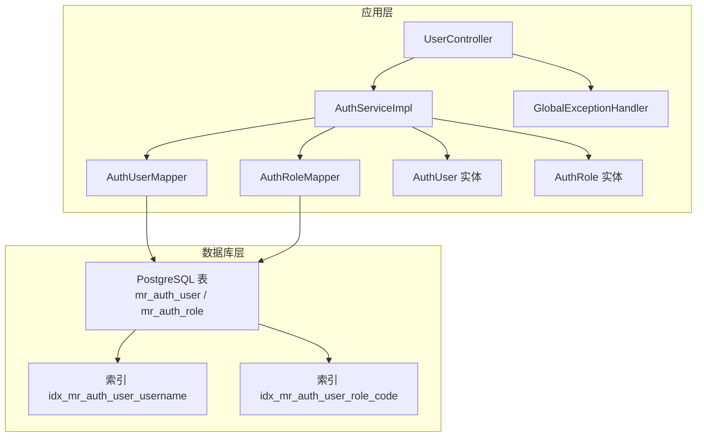
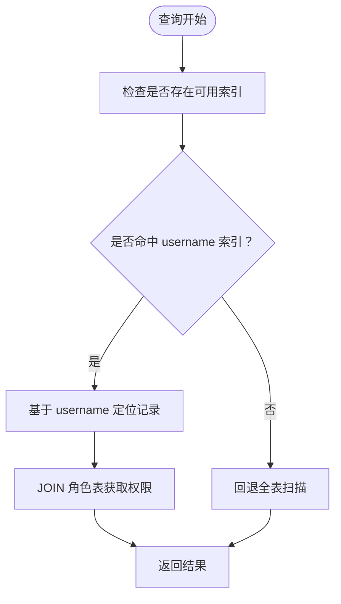
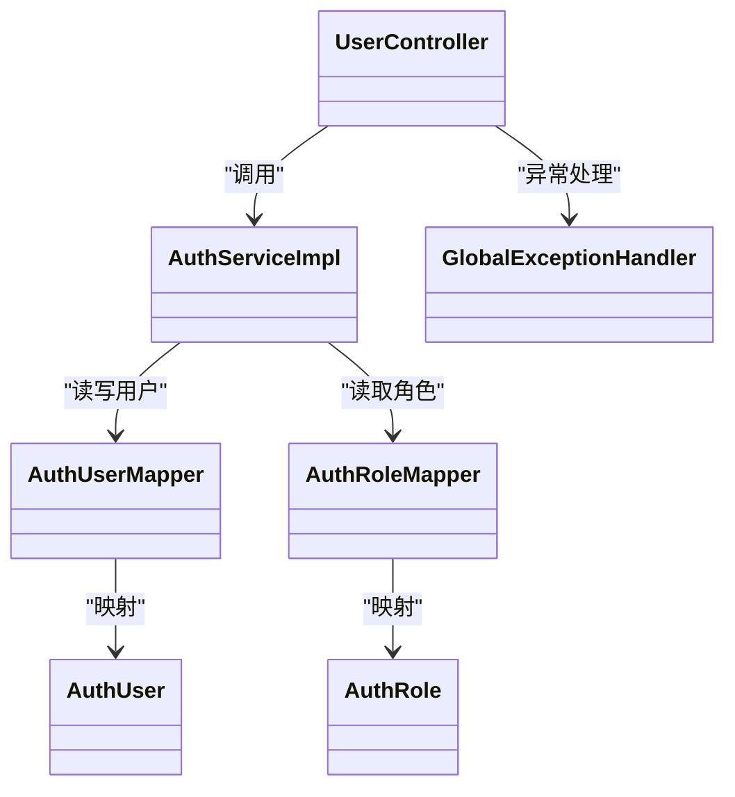

# 数据完整性与约束


**本文档引用的文件**
- [schema-postgresql.sql](file://backend-repo/src/main/resources/schema-postgresql.sql)
- [schema.sql](file://mrr-db/schema.sql)
- [AuthUser.java](file://backend-repo/src/main/java/com/zjcxph/imgapi/entity/AuthUser.java)
- [AuthRole.java](file://backend-repo/src/main/java/com/zjcxph/imgapi/entity/AuthRole.java)
- [AuthUserMapper.java](file://backend-repo/src/main/java/com/zjcxph/imgapi/mapper/AuthUserMapper.java)
- [AuthRoleMapper.java](file://backend-repo/src/main/java/com/zjcxph/imgapi/mapper/AuthRoleMapper.java)
- [AuthServiceImpl.java](file://backend-repo/src/main/java/com/zjcxph/imgapi/service/impl/AuthServiceImpl.java)
- [BusinessException.java](file://backend-repo/src/main/java/com/zjcxph/imgapi/exception/BusinessException.java)
- [GlobalExceptionHandler.java](file://backend-repo/src/main/java/com/zjcxph/imgapi/handler/GlobalExceptionHandler.java)
- [UserController.java](file://backend-repo/src/main/java/com/zjcxph/imgapi/controller/UserController.java)
- [AuthUserUpdateRequest.java](file://backend-repo/src/main/java/com/zjcxph/imgapi/dto/req/AuthUserUpdateRequest.java)


## 目录
1. [简介](#简介)
2. [项目结构](#项目结构)
3. [核心组件](#核心组件)
4. [架构总览](#架构总览)
5. [详细组件分析](#详细组件分析)
6. [依赖关系分析](#依赖关系分析)
7. [性能考虑](#性能考虑)
8. [故障排查指南](#故障排查指南)
9. [结论](#结论)

## 简介
本文件聚焦于MRR系统认证授权模块的数据完整性设计与实现，系统采用PostgreSQL作为生产数据库，通过DDL定义主键、唯一性、外键、非空与默认值约束，并在应用层通过MyBatis映射器与服务层逻辑进行约束验证与错误处理。重点覆盖以下方面：
- 主键约束：确保每条记录的唯一标识
- 唯一性约束：username字段的唯一性保障
- 外键约束：role_code对mr_auth_role.code的引用完整性
- 非空与默认值：关键字段的强制性与默认行为
- 索引策略：idx_mr_auth_user_username与idx_mr_auth_user_role_code的性能优化
- 数据一致性检查与约束违反处理：从数据库约束到应用层异常处理的全链路
- 插入与更新操作的约束验证示例与错误处理机制

## 项目结构
认证授权相关的核心文件分布如下：
- 数据库模式：PostgreSQL模式定义（生产环境）
- 实体类：AuthUser与AuthRole的领域模型
- 映射器：AuthUserMapper与AuthRoleMapper的SQL映射
- 服务层：AuthServiceImpl的业务逻辑与约束验证
- 控制器：UserController的对外接口
- 异常处理：GlobalExceptionHandler的统一异常响应
- 请求对象：AuthUserUpdateRequest的参数校验



**图表来源**
- [schema-postgresql.sql:49-59](file://backend-repo/src/main/resources/schema-postgresql.sql#L49-L59)
- [AuthUserMapper.java:14-77](file://backend-repo/src/main/java/com/zjcxph/imgapi/mapper/AuthUserMapper.java#L14-L77)
- [AuthRoleMapper.java:10-18](file://backend-repo/src/main/java/com/zjcxph/imgapi/mapper/AuthRoleMapper.java#L10-L18)
- [AuthServiceImpl.java:26-151](file://backend-repo/src/main/java/com/zjcxph/imgapi/service/impl/AuthServiceImpl.java#L26-L151)
- [UserController.java:27-95](file://backend-repo/src/main/java/com/zjcxph/imgapi/controller/UserController.java#L27-L95)
- [GlobalExceptionHandler.java:14-62](file://backend-repo/src/main/java/com/zjcxph/imgapi/handler/GlobalExceptionHandler.java#L14-L62)

**章节来源**
- [schema-postgresql.sql:1-109](file://backend-repo/src/main/resources/schema-postgresql.sql#L1-L109)
- [AuthUser.java:12-134](file://backend-repo/src/main/java/com/zjcxph/imgapi/entity/AuthUser.java#L12-L134)
- [AuthRole.java:5-53](file://backend-repo/src/main/java/com/zjcxph/imgapi/entity/AuthRole.java#L5-L53)
- [AuthUserMapper.java:14-77](file://backend-repo/src/main/java/com/zjcxph/imgapi/mapper/AuthUserMapper.java#L14-L77)
- [AuthRoleMapper.java:10-18](file://backend-repo/src/main/java/com/zjcxph/imgapi/mapper/AuthRoleMapper.java#L10-L18)
- [AuthServiceImpl.java:26-151](file://backend-repo/src/main/java/com/zjcxph/imgapi/service/impl/AuthServiceImpl.java#L26-L151)
- [UserController.java:27-95](file://backend-repo/src/main/java/com/zjcxph/imgapi/controller/UserController.java#L27-L95)
- [GlobalExceptionHandler.java:14-62](file://backend-repo/src/main/java/com/zjcxph/imgapi/handler/GlobalExceptionHandler.java#L14-L62)

## 核心组件
- 数据库表结构与约束
  - 用户表mr_auth_user：主键自增、username唯一、role_code外键引用角色表、status默认值、时间戳默认值等
  - 角色表mr_auth_role：主键code、非空字段、权限集合、排序字段
  - 索引：username与role_code的二级索引
- 应用层实体与映射
  - AuthUser与AuthRole实体承载业务属性
  - AuthUserMapper与AuthRoleMapper提供查询与写入操作
- 服务层逻辑
  - 登录流程中对用户名、密码、状态的验证
  - 用户更新时对角色码与状态的处理
- 异常处理
  - 全局异常处理器将不同类型的异常映射为标准化响应

**章节来源**
- [schema-postgresql.sql:49-59](file://backend-repo/src/main/resources/schema-postgresql.sql#L49-L59)
- [schema-postgresql.sql:41-47](file://backend-repo/src/main/resources/schema-postgresql.sql#L41-L47)
- [AuthUser.java:12-134](file://backend-repo/src/main/java/com/zjcxph/imgapi/entity/AuthUser.java#L12-L134)
- [AuthRole.java:5-53](file://backend-repo/src/main/java/com/zjcxph/imgapi/entity/AuthRole.java#L5-L53)
- [AuthUserMapper.java:14-77](file://backend-repo/src/main/java/com/zjcxph/imgapi/mapper/AuthUserMapper.java#L14-L77)
- [AuthRoleMapper.java:10-18](file://backend-repo/src/main/java/com/zjcxph/imgapi/mapper/AuthRoleMapper.java#L10-L18)
- [AuthServiceImpl.java:36-100](file://backend-repo/src/main/java/com/zjcxph/imgapi/service/impl/AuthServiceImpl.java#L36-L100)
- [GlobalExceptionHandler.java:19-60](file://backend-repo/src/main/java/com/zjcxph/imgapi/handler/GlobalExceptionHandler.java#L19-L60)

## 架构总览
认证授权数据完整性由“数据库约束 + 应用层验证 + 统一异常处理”三层协同保障。

```mermaid
sequenceDiagram
participant C as "客户端"
participant U as "UserController"
participant S as "AuthServiceImpl"
participant M as "AuthUserMapper"
participant R as "AuthRoleMapper"
participant DB as "PostgreSQL"
C->>U : "POST /login"
U->>S : "login(req)"
S->>M : "findByUsername(username)"
M->>DB : "SELECT ... WHERE username= ?"
DB-->>M : "返回用户记录或空"
M-->>S : "AuthUser"
S->>S : "校验状态与密码哈希"
S->>M : "updateLastLoginAt(id, now)"
M->>DB : "UPDATE ... SET last_login_at= ?"
DB-->>M : "影响行数"
M-->>S : "成功"
S-->>U : "LoginResponseDTO"
U-->>C : "Result&lt;LoginResponseDTO&gt;"
```

**图表来源**
- [UserController.java:38-47](file://backend-repo/src/main/java/com/zjcxph/imgapi/controller/UserController.java#L38-L47)
- [AuthServiceImpl.java:36-62](file://backend-repo/src/main/java/com/zjcxph/imgapi/service/impl/AuthServiceImpl.java#L36-L62)
- [AuthUserMapper.java:16-29](file://backend-repo/src/main/java/com/zjcxph/imgapi/mapper/AuthUserMapper.java#L16-L29)
- [AuthUserMapper.java:61-62](file://backend-repo/src/main/java/com/zjcxph/imgapi/mapper/AuthUserMapper.java#L61-L62)

## 详细组件分析

### 数据库约束设计与原理
- 主键约束
  - 用户表与角色表均以主键保证每条记录唯一性，避免重复标识
- 唯一性约束
  - username字段声明唯一，防止重复用户名导致的身份混淆
- 外键约束
  - 用户表role_code引用角色表code，确保角色存在性与一致性
- 非空与默认值
  - 关键字段如username、password_hash、role_code、status、created_at/updated_at等设置非空或默认值，保证数据完整性与可追踪性
- 索引策略
  - idx_mr_auth_user_username：加速按用户名登录与查找
  - idx_mr_auth_user_role_code：加速按角色过滤与关联查询

```mermaid
erDiagram
MR_AUTH_ROLE {
text code PK
text name NN
text description
text permissions NN
int4 sort_order NN
}
MR_AUTH_USER {
int4 id PK
text username NN UK
text display_name
text password_hash NN
text role_code NN FK
text status NN
timestamptz last_login_at
timestamptz created_at NN
timestamptz updated_at NN
}
MR_AUTH_USER }o--|| MR_AUTH_ROLE : "references code"
```

**图表来源**
- [schema-postgresql.sql:41-47](file://backend-repo/src/main/resources/schema-postgresql.sql#L41-L47)
- [schema-postgresql.sql:49-59](file://backend-repo/src/main/resources/schema-postgresql.sql#L49-L59)

**章节来源**
- [schema-postgresql.sql:41-47](file://backend-repo/src/main/resources/schema-postgresql.sql#L41-L47)
- [schema-postgresql.sql:49-59](file://backend-repo/src/main/resources/schema-postgresql.sql#L49-L59)
- [schema.sql:58-81](file://mrr-db/schema.sql#L58-L81)

### username字段唯一性约束
- 设计原理
  - username作为登录凭据，必须全局唯一，避免身份冲突
- 实现位置
  - 数据库层：PostgreSQL模式中username声明唯一
  - 应用层：登录流程通过findByUsername精确匹配，结合业务逻辑处理不存在或被禁用的情况
- 违反处理
  - 数据库层面：唯一约束冲突将导致写入失败
  - 应用层：通过全局异常处理器捕获并返回标准化错误

**章节来源**
- [schema-postgresql.sql:51](file://backend-repo/src/main/resources/schema-postgresql.sql#L51)
- [AuthUserMapper.java:16-29](file://backend-repo/src/main/java/com/zjcxph/imgapi/mapper/AuthUserMapper.java#L16-L29)
- [AuthServiceImpl.java:36-62](file://backend-repo/src/main/java/com/zjcxph/imgapi/service/impl/AuthServiceImpl.java#L36-L62)
- [GlobalExceptionHandler.java:32-44](file://backend-repo/src/main/java/com/zjcxph/imgapi/handler/GlobalExceptionHandler.java#L32-L44)

### role_code外键引用关系
- 设计原理
  - 用户的角色通过role_code引用角色表code，确保角色存在且一致
- 实现位置
  - 数据库层：role_code声明外键并设置级联更新
  - 应用层：用户更新时仅允许合法的角色码，查询时通过LEFT JOIN获取角色名称与权限
- 违反处理
  - 数据库层面：外键约束冲突阻止无效角色码写入
  - 应用层：通过异常处理器返回参数错误或业务错误

**章节来源**
- [schema-postgresql.sql:54](file://backend-repo/src/main/resources/schema-postgresql.sql#L54)
- [AuthUserMapper.java:16-29](file://backend-repo/src/main/java/com/zjcxph/imgapi/mapper/AuthUserMapper.java#L16-L29)
- [AuthRoleMapper.java:13-17](file://backend-repo/src/main/java/com/zjcxph/imgapi/mapper/AuthRoleMapper.java#L13-L17)
- [AuthServiceImpl.java:75-91](file://backend-repo/src/main/java/com/zjcxph/imgapi/service/impl/AuthServiceImpl.java#L75-L91)
- [GlobalExceptionHandler.java:39-51](file://backend-repo/src/main/java/com/zjcxph/imgapi/handler/GlobalExceptionHandler.java#L39-L51)

### NOT NULL与默认值的作用
- NOT NULL
  - 确保关键字段必填，如username、password_hash、role_code、status、created_at/updated_at
- 默认值
  - status默认'active'
  - created_at/updated_at默认当前时间
  - sort_order默认0
- 影响
  - 防止脏数据进入系统；保证审计与状态追踪的完整性

**章节来源**
- [schema-postgresql.sql:51-58](file://backend-repo/src/main/resources/schema-postgresql.sql#L51-L58)
- [schema-postgresql.sql:43-46](file://backend-repo/src/main/resources/schema-postgresql.sql#L43-L46)

### 索引策略与性能优化
- idx_mr_auth_user_username
  - 用途：按用户名登录与查询
  - 效果：减少全表扫描，提升登录与查找性能
- idx_mr_auth_user_role_code
  - 用途：按角色过滤与JOIN
  - 效果：优化用户列表按角色分组与权限关联查询
- 其他索引
  - PostgreSQL模式中还包含scan、statistics、access_log等表的索引，支撑系统其他模块的查询性能



**图表来源**
- [schema-postgresql.sql:81-82](file://backend-repo/src/main/resources/schema-postgresql.sql#L81-L82)
- [AuthUserMapper.java:16-29](file://backend-repo/src/main/java/com/zjcxph/imgapi/mapper/AuthUserMapper.java#L16-L29)

**章节来源**
- [schema-postgresql.sql:81-82](file://backend-repo/src/main/resources/schema-postgresql.sql#L81-L82)
- [schema.sql:80-81](file://mrr-db/schema.sql#L80-L81)

### 插入与更新操作的约束验证与错误处理
- 插入流程
  - 参数校验：用户名、显示名、密码哈希、角色码、状态
  - 写入数据库：通过AuthUserMapper.insertUser执行
  - 冲突处理：PostgreSQL模式中的INSERT ... ON CONFLICT针对username冲突进行更新
- 更新流程
  - 查询用户：findById
  - 参数校验：角色码与状态非空校验
  - 写入数据库：通过AuthUserMapper.updateUser执行
  - 结果判定：根据影响行数判断更新是否成功
- 错误处理
  - 参数错误：IllegalArgumentException映射为400
  - 业务错误：BusinessException映射为指定业务码
  - 权限错误：IllegalStateException映射为403
  - 未捕获异常：统一返回500

```mermaid
sequenceDiagram
participant C as "客户端"
participant U as "UserController"
participant S as "AuthServiceImpl"
participant M as "AuthUserMapper"
participant DB as "PostgreSQL"
C->>U : "PUT /v1/auth/users/{id}"
U->>S : "updateUser(id, request)"
S->>M : "findById(id)"
M->>DB : "SELECT ... WHERE id= ?"
DB-->>M : "返回用户记录"
M-->>S : "AuthUser"
S->>S : "校验角色码与状态"
S->>M : "updateUser(user)"
M->>DB : "UPDATE ... SET role_code,status"
DB-->>M : "影响行数"
M-->>S : "返回更新结果"
S-->>U : "AuthUserProfileDTO 或 null"
U-->>C : "Result&lt;DTO&gt;"
```

**图表来源**
- [UserController.java:73-82](file://backend-repo/src/main/java/com/zjcxph/imgapi/controller/UserController.java#L73-L82)
- [AuthServiceImpl.java:75-91](file://backend-repo/src/main/java/com/zjcxph/imgapi/service/impl/AuthServiceImpl.java#L75-L91)
- [AuthUserMapper.java:64-69](file://backend-repo/src/main/java/com/zjcxph/imgapi/mapper/AuthUserMapper.java#L64-L69)
- [AuthUserUpdateRequest.java:11-15](file://backend-repo/src/main/java/com/zjcxph/imgapi/dto/req/AuthUserUpdateRequest.java#L11-L15)

**章节来源**
- [AuthUserMapper.java:74-76](file://backend-repo/src/main/java/com/zjcxph/imgapi/mapper/AuthUserMapper.java#L74-L76)
- [schema-postgresql.sql:98-108](file://backend-repo/src/main/resources/schema-postgresql.sql#L98-L108)
- [AuthServiceImpl.java:75-100](file://backend-repo/src/main/java/com/zjcxph/imgapi/service/impl/AuthServiceImpl.java#L75-L100)
- [AuthUserUpdateRequest.java:8-41](file://backend-repo/src/main/java/com/zjcxph/imgapi/dto/req/AuthUserUpdateRequest.java#L8-L41)
- [GlobalExceptionHandler.java:19-60](file://backend-repo/src/main/java/com/zjcxph/imgapi/handler/GlobalExceptionHandler.java#L19-L60)

## 依赖关系分析
- 控制器依赖服务层，服务层依赖映射器，映射器依赖数据库
- 用户实体与角色实体分别承载用户与角色的业务属性
- 全局异常处理器为整个认证授权流程提供统一的错误响应



**图表来源**
- [UserController.java:27-95](file://backend-repo/src/main/java/com/zjcxph/imgapi/controller/UserController.java#L27-L95)
- [AuthServiceImpl.java:26-151](file://backend-repo/src/main/java/com/zjcxph/imgapi/service/impl/AuthServiceImpl.java#L26-L151)
- [AuthUserMapper.java:14-77](file://backend-repo/src/main/java/com/zjcxph/imgapi/mapper/AuthUserMapper.java#L14-L77)
- [AuthRoleMapper.java:10-18](file://backend-repo/src/main/java/com/zjcxph/imgapi/mapper/AuthRoleMapper.java#L10-L18)
- [AuthUser.java:12-134](file://backend-repo/src/main/java/com/zjcxph/imgapi/entity/AuthUser.java#L12-L134)
- [AuthRole.java:5-53](file://backend-repo/src/main/java/com/zjcxph/imgapi/entity/AuthRole.java#L5-L53)
- [GlobalExceptionHandler.java:14-62](file://backend-repo/src/main/java/com/zjcxph/imgapi/handler/GlobalExceptionHandler.java#L14-L62)

**章节来源**
- [UserController.java:27-95](file://backend-repo/src/main/java/com/zjcxph/imgapi/controller/UserController.java#L27-L95)
- [AuthServiceImpl.java:26-151](file://backend-repo/src/main/java/com/zjcxph/imgapi/service/impl/AuthServiceImpl.java#L26-L151)
- [AuthUserMapper.java:14-77](file://backend-repo/src/main/java/com/zjcxph/imgapi/mapper/AuthUserMapper.java#L14-L77)
- [AuthRoleMapper.java:10-18](file://backend-repo/src/main/java/com/zjcxph/imgapi/mapper/AuthRoleMapper.java#L10-L18)
- [GlobalExceptionHandler.java:14-62](file://backend-repo/src/main/java/com/zjcxph/imgapi/handler/GlobalExceptionHandler.java#L14-L62)

## 性能考虑
- 索引选择性
  - username与role_code具备较高选择性，适合建立二级索引
- 查询路径
  - 登录场景主要依赖username索引；用户列表与权限关联查询依赖role_code索引
- 写入路径
  - INSERT ... ON CONFLICT用于幂等写入，避免重复插入；常规UPDATE仅更新必要字段
- 时间戳默认值
  - created_at/updated_at默认值减少应用侧时间计算，降低写入开销

**章节来源**
- [schema-postgresql.sql:81-82](file://backend-repo/src/main/resources/schema-postgresql.sql#L81-L82)
- [schema-postgresql.sql:57-58](file://backend-repo/src/main/resources/schema-postgresql.sql#L57-L58)
- [schema-postgresql.sql:98-108](file://backend-repo/src/main/resources/schema-postgresql.sql#L98-L108)

## 故障排查指南
- 常见约束错误与处理
  - 唯一性冲突（username重复）：数据库拒绝写入，应用层捕获异常并返回400
  - 外键冲突（非法role_code）：数据库拒绝写入，应用层捕获异常并返回400
  - 参数为空：业务参数校验失败，返回400
  - 账号被禁用：状态不为active，返回403
  - 服务器内部错误：未捕获异常统一返回500
- 排查步骤
  - 检查数据库约束定义与索引是否存在
  - 查看服务层日志与异常栈
  - 使用控制器接口验证请求格式与参数
  - 对照全局异常处理器的响应码映射

**章节来源**
- [GlobalExceptionHandler.java:19-60](file://backend-repo/src/main/java/com/zjcxph/imgapi/handler/GlobalExceptionHandler.java#L19-L60)
- [AuthServiceImpl.java:36-62](file://backend-repo/src/main/java/com/zjcxph/imgapi/service/impl/AuthServiceImpl.java#L36-L62)
- [AuthServiceImpl.java:75-100](file://backend-repo/src/main/java/com/zjcxph/imgapi/service/impl/AuthServiceImpl.java#L75-L100)

## 结论
MRR系统的认证授权模块通过数据库层的主键、唯一性、外键、非空与默认值约束，配合应用层的参数校验与服务逻辑，以及统一的异常处理机制，形成了完整且高效的“数据完整性—性能优化—错误处理”闭环。username唯一性与role_code外键共同确保了身份与权限模型的一致性；索引策略有效支撑了高频查询场景；异常处理机制提供了清晰的错误反馈与恢复指引。建议在后续演进中持续关注索引维护、约束变更的迁移策略与监控告警，以保障系统长期稳定运行。