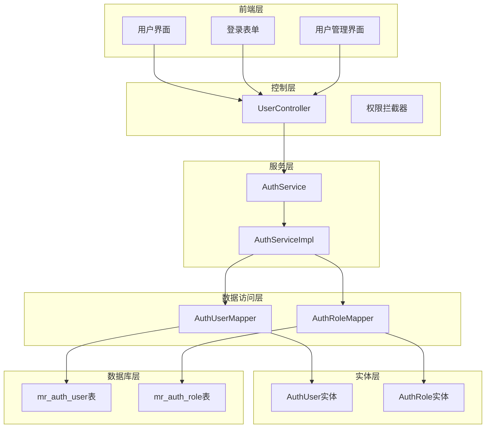
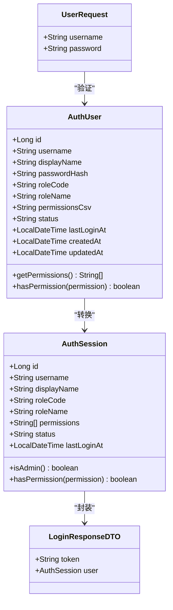
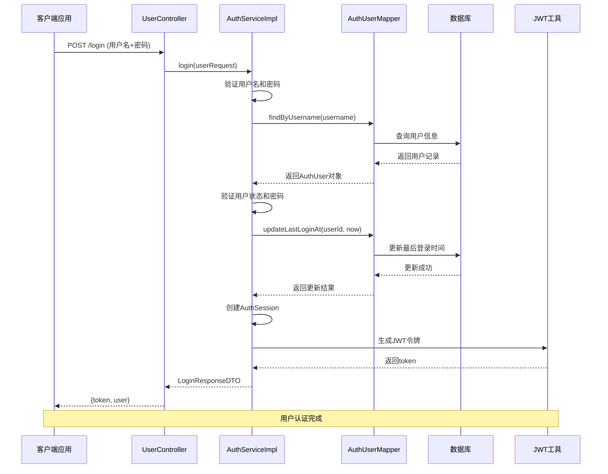
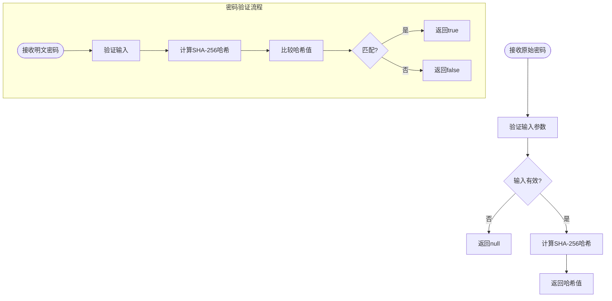
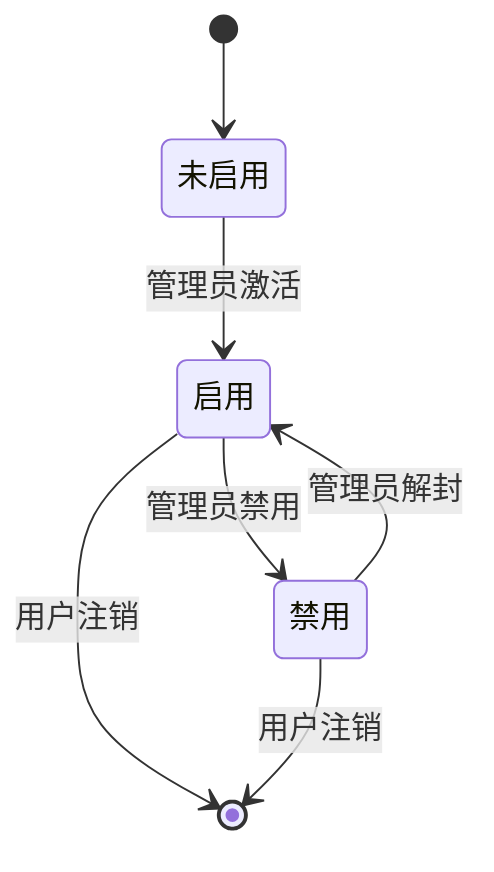
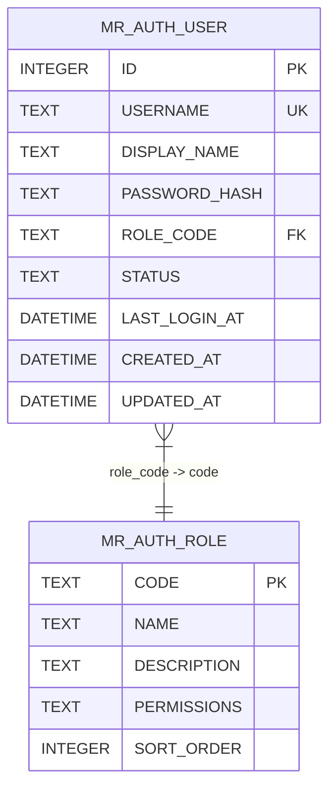
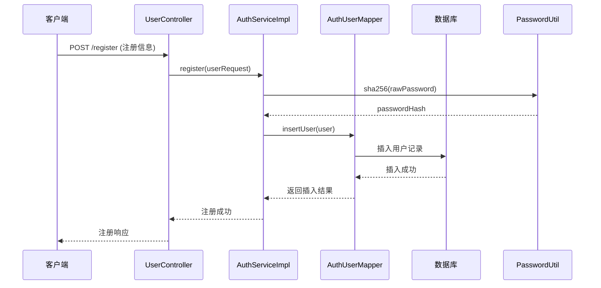
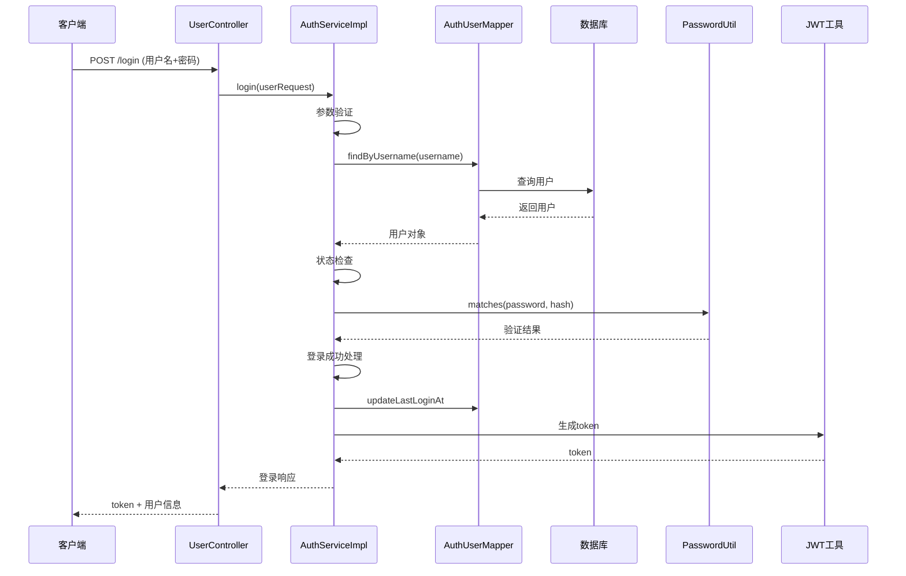
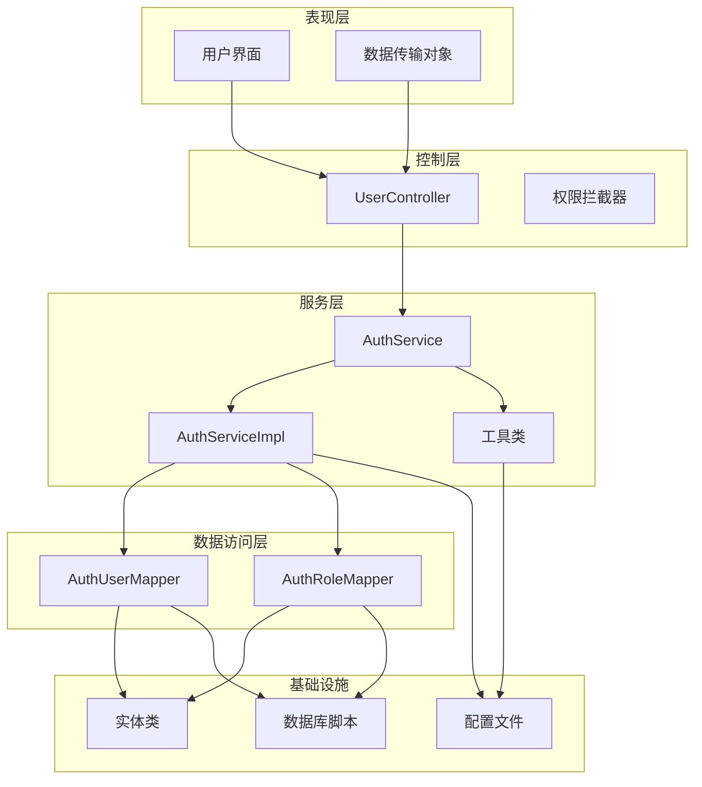

# 用户表 (mr_auth_user)

**本文档引用的文件**
- [schema.sql](file://mrr-db/schema.sql)
- [schema-postgresql.sql](file://backend-repo/src/main/resources/schema-postgresql.sql)
- [AuthUser.java](file://backend-repo/src/main/java/com/zjcxph/imgapi/entity/AuthUser.java)
- [AuthUserMapper.java](file://backend-repo/src/main/java/com/zjcxph/imgapi/mapper/AuthUserMapper.java)
- [AuthService.java](file://backend-repo/src/main/java/com/zjcxph/imgapi/service/AuthService.java)
- [AuthServiceImpl.java](file://backend-repo/src/main/java/com/zjcxph/imgapi/service/impl/AuthServiceImpl.java)
- [UserController.java](file://backend-repo/src/main/java/com/zjcxph/imgapi/controller/UserController.java)
- [PasswordUtil.java](file://backend-repo/src/main/java/com/zjcxph/imgapi/utils/PasswordUtil.java)
- [UserRequest.java](file://backend-repo/src/main/java/com/zjcxph/imgapi/dto/req/UserRequest.java)
- [LoginResponseDTO.java](file://backend-repo/src/main/java/com/zjcxph/imgapi/dto/resp/LoginResponseDTO.java)
- [reset-br-admin-password.sql](file://backend-repo/src/main/resources/reset-br-admin-password.sql)
- [AuthSession.java](file://backend-repo/src/main/java/com/zjcxph/imgapi/common/AuthSession.java)

## 目录
1. [简介](#简介)
2. [项目结构](#项目结构)
3. [核心组件](#核心组件)
4. [架构概览](#架构概览)
5. [详细组件分析](#详细组件分析)
6. [依赖关系分析](#依赖关系分析)
7. [性能考虑](#性能考虑)
8. [故障排除指南](#故障排除指南)
9. [结论](#结论)

## 简介

MRR系统中的mr_auth_user用户表是身份认证和权限管理系统的核心数据结构。本文档提供了该表的完整数据模型文档，包括字段结构、安全机制、关联关系、索引设计以及完整的用户管理流程。

该表采用SQLite和PostgreSQL双数据库支持策略，确保了系统的兼容性和可移植性。用户表不仅存储基本的用户信息，还集成了完整的权限管理体系，通过与mr_auth_role角色表的关联实现了基于角色的访问控制(RBAC)。

## 项目结构

MRR系统的用户管理模块采用分层架构设计，主要包含以下层次：

**图表来源**
- [UserController.java:27-95](file://backend-repo/src/main/java/com/zjcxph/imgapi/controller/UserController.java#L27-L95)
- [AuthServiceImpl.java:25-151](file://backend-repo/src/main/java/com/zjcxph/imgapi/service/impl/AuthServiceImpl.java#L25-L151)
- [AuthUserMapper.java:13-78](file://backend-repo/src/main/java/com/zjcxph/imgapi/mapper/AuthUserMapper.java#L13-L78)

**章节来源**
- [UserController.java:1-95](file://backend-repo/src/main/java/com/zjcxph/imgapi/controller/UserController.java#L1-L95)
- [AuthServiceImpl.java:1-151](file://backend-repo/src/main/java/com/zjcxph/imgapi/service/impl/AuthServiceImpl.java#L1-L151)

## 核心组件

### 数据库表结构

mr_auth_user表采用双数据库支持策略，同时兼容SQLite和PostgreSQL两种数据库引擎：

| 字段名 | 数据类型 | 约束条件 | 描述 | SQLite默认值 | PostgreSQL默认值 |
|--------|----------|----------|------|-------------|-----------------|
| id | INTEGER | PRIMARY KEY, AUTOINCREMENT | 自增主键 | 自动生成 | 自动生成 |
| username | TEXT | NOT NULL, UNIQUE | 用户名 | - | - |
| display_name | TEXT | - | 显示名称 | - | - |
| password_hash | TEXT | NOT NULL | 密码哈希值 | - | - |
| role_code | TEXT | NOT NULL, FOREIGN KEY | 角色代码 | - | 引用角色表 |
| status | TEXT | NOT NULL, DEFAULT 'active' | 用户状态 | 'active' | 'active' |
| last_login_at | DATETIME/TIMESTAMP | - | 最后登录时间 | - | - |
| created_at | DATETIME/TIMESTAMP | NOT NULL, DEFAULT CURRENT_TIMESTAMP | 创建时间 | 当前时间 | 当前时间 |
| updated_at | DATETIME/TIMESTAMP | NOT NULL, DEFAULT CURRENT_TIMESTAMP | 更新时间 | 当前时间 | 当前时间 |

### Java实体类映射

AuthUser实体类提供了完整的用户对象映射，包含了所有数据库字段的Java属性：

**图表来源**
- [AuthUser.java:12-134](file://backend-repo/src/main/java/com/zjcxph/imgapi/entity/AuthUser.java#L12-L134)
- [AuthSession.java:7-90](file://backend-repo/src/main/java/com/zjcxph/imgapi/common/AuthSession.java#L7-L90)
- [UserRequest.java:8-31](file://backend-repo/src/main/java/com/zjcxph/imgapi/dto/req/UserRequest.java#L8-L31)
- [LoginResponseDTO.java:7-34](file://backend-repo/src/main/java/com/zjcxph/imgapi/dto/resp/LoginResponseDTO.java#L7-L34)

**章节来源**
- [AuthUser.java:1-134](file://backend-repo/src/main/java/com/zjcxph/imgapi/entity/AuthUser.java#L1-L134)
- [AuthSession.java:1-90](file://backend-repo/src/main/java/com/zjcxph/imgapi/common/AuthSession.java#L1-L90)

## 架构概览

MRR系统的用户认证采用JWT(JSON Web Token)令牌机制，实现了无状态的身份验证和授权管理：

**图表来源**
- [UserController.java:38-47](file://backend-repo/src/main/java/com/zjcxph/imgapi/controller/UserController.java#L38-L47)
- [AuthServiceImpl.java:36-62](file://backend-repo/src/main/java/com/zjcxph/imgapi/service/impl/AuthServiceImpl.java#L36-L62)
- [AuthUserMapper.java:16-29](file://backend-repo/src/main/java/com/zjcxph/imgapi/mapper/AuthUserMapper.java#L16-L29)

**章节来源**
- [UserController.java:1-95](file://backend-repo/src/main/java/com/zjcxph/imgapi/controller/UserController.java#L1-L95)
- [AuthServiceImpl.java:1-151](file://backend-repo/src/main/java/com/zjcxph/imgapi/service/impl/AuthServiceImpl.java#L1-L151)

## 详细组件分析

### 密码哈希安全机制

系统采用SHA-256算法进行密码哈希处理，确保密码存储的安全性：

**图表来源**
- [PasswordUtil.java:10-22](file://backend-repo/src/main/java/com/zjcxph/imgapi/utils/PasswordUtil.java#L10-L22)

密码安全特性：
- 使用SHA-256算法进行不可逆加密
- 支持密码验证功能
- 防止明文密码存储
- 提供统一的密码处理接口

**章节来源**
- [PasswordUtil.java:1-24](file://backend-repo/src/main/java/com/zjcxph/imgapi/utils/PasswordUtil.java#L1-L24)

### 用户状态枚举值

用户状态采用文本枚举值设计，支持以下状态：

| 状态值 | 描述 | 用途 | 影响范围 |
|--------|------|------|----------|
| active | 启用状态 | 正常登录和使用 | 全部功能 |
| disabled | 禁用状态 | 禁止登录和使用 | 所有功能 |
| pending | 待审核状态 | 等待管理员审核 | 部分功能受限 |

状态管理流程：

**章节来源**
- [AuthServiceImpl.java:49-51](file://backend-repo/src/main/java/com/zjcxph/imgapi/service/impl/AuthServiceImpl.java#L49-L51)

### 外键关联关系

用户表与角色表建立了严格的外键约束关系：

**图表来源**
- [schema-postgresql.sql:41-59](file://backend-repo/src/main/resources/schema-postgresql.sql#L41-L59)
- [schema.sql:58-78](file://mrr-db/schema.sql#L58-L78)

**章节来源**
- [schema-postgresql.sql:41-59](file://backend-repo/src/main/resources/schema-postgresql.sql#L41-L59)
- [schema.sql:58-78](file://mrr-db/schema.sql#L58-L78)

### 索引设计

系统为用户表的关键字段建立了优化的索引策略：

| 索引名称 | 字段 | 类型 | 用途 | 性能影响 |
|----------|------|------|------|----------|
| idx_mr_auth_user_username | username | 唯一索引 | 用户名查询 | O(log n) |
| idx_mr_auth_user_role_code | role_code | 普通索引 | 角色关联查询 | O(log n) |

索引优化策略：
- username字段建立唯一索引，确保用户名唯一性并加速查询
- role_code字段建立普通索引，优化角色关联查询性能
- 支持高效的用户认证和权限检查操作

**章节来源**
- [schema-postgresql.sql:81-82](file://backend-repo/src/main/resources/schema-postgresql.sql#L81-L82)
- [schema.sql:80-81](file://mrr-db/schema.sql#L80-L81)

### 用户管理操作流程

#### 用户注册流程

#### 用户登录流程

**图表来源**
- [AuthServiceImpl.java:36-62](file://backend-repo/src/main/java/com/zjcxph/imgapi/service/impl/AuthServiceImpl.java#L36-L62)
- [AuthUserMapper.java:16-29](file://backend-repo/src/main/java/com/zjcxph/imgapi/mapper/AuthUserMapper.java#L16-L29)

**章节来源**
- [AuthServiceImpl.java:1-151](file://backend-repo/src/main/java/com/zjcxph/imgapi/service/impl/AuthServiceImpl.java#L1-L151)
- [AuthUserMapper.java:1-78](file://backend-repo/src/main/java/com/zjcxph/imgapi/mapper/AuthUserMapper.java#L1-L78)

## 依赖关系分析

系统采用清晰的分层依赖关系，确保了模块间的松耦合和高内聚：

**图表来源**
- [UserController.java:27-95](file://backend-repo/src/main/java/com/zjcxph/imgapi/controller/UserController.java#L27-L95)
- [AuthServiceImpl.java:25-34](file://backend-repo/src/main/java/com/zjcxph/imgapi/service/impl/AuthServiceImpl.java#L25-L34)

**章节来源**
- [UserController.java:1-95](file://backend-repo/src/main/java/com/zjcxph/imgapi/controller/UserController.java#L1-L95)
- [AuthServiceImpl.java:1-151](file://backend-repo/src/main/java/com/zjcxph/imgapi/service/impl/AuthServiceImpl.java#L1-L151)

## 性能考虑

### 查询优化策略

1. **索引优化**
   - username字段的唯一索引确保了O(log n)的查询性能
   - role_code字段的索引支持高效的关联查询

2. **连接查询优化**
   - 使用LEFT JOIN获取用户及其角色信息
   - 通过投影选择减少不必要的字段传输

3. **缓存策略**
   - JWT令牌避免了服务器端会话存储
   - 减少了数据库查询次数

### 安全最佳实践

1. **密码存储**
   - 使用SHA-256哈希算法
   - 不存储明文密码
   - 支持密码强度验证

2. **权限控制**
   - 基于角色的访问控制(RBAC)
   - 细粒度的权限检查
   - 权限继承机制

3. **会话管理**
   - JWT令牌过期机制
   - 会话状态无状态化
   - 安全的令牌传输

## 故障排除指南

### 常见问题及解决方案

#### 用户认证失败

**问题症状**：用户登录时提示用户名或密码错误

**可能原因**：
1. 用户名不存在或拼写错误
2. 密码不正确
3. 用户账户被禁用

**解决步骤**：
1. 验证用户名格式和大小写
2. 确认密码输入正确
3. 检查用户状态是否为"active"

#### 密码重置问题

**问题症状**：用户无法重置密码

**解决步骤**：
1. 检查reset-br-admin-password.sql脚本执行情况
2. 验证密码哈希值的有效性
3. 确认数据库连接正常

#### 权限访问问题

**问题症状**：用户无法访问特定功能

**解决步骤**：
1. 检查用户角色配置
2. 验证权限字符串格式
3. 确认权限继承关系

**章节来源**
- [AuthServiceImpl.java:41-54](file://backend-repo/src/main/java/com/zjcxph/imgapi/service/impl/AuthServiceImpl.java#L41-L54)
- [reset-br-admin-password.sql:1-16](file://backend-repo/src/main/resources/reset-br-admin-password.sql#L1-L16)

## 结论

MRR系统的mr_auth_user用户表设计体现了现代Web应用的安全性和可扩展性要求。通过采用双数据库支持、完善的索引策略、严格的角色权限管理和安全的密码哈希机制，系统为用户管理提供了可靠的技术基础。

关键设计亮点：
- **安全性**：SHA-256密码哈希、JWT令牌、权限控制
- **性能**：优化索引、高效查询、缓存策略
- **可维护性**：清晰的分层架构、标准化的数据模型
- **可扩展性**：灵活的角色权限体系、易于扩展的表结构

该设计为MRR系统的用户管理奠定了坚实的基础，支持未来的功能扩展和性能优化需求。