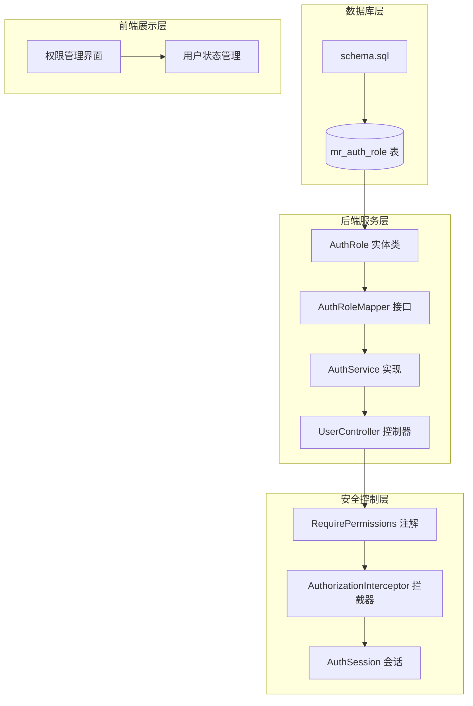
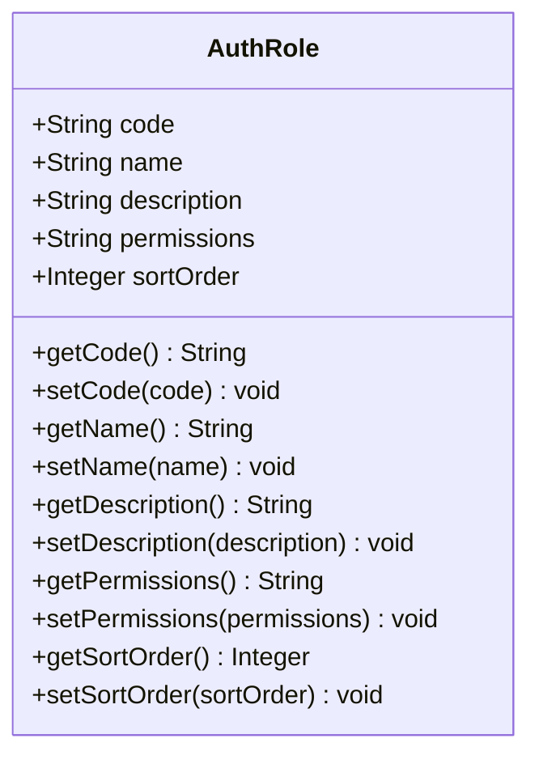
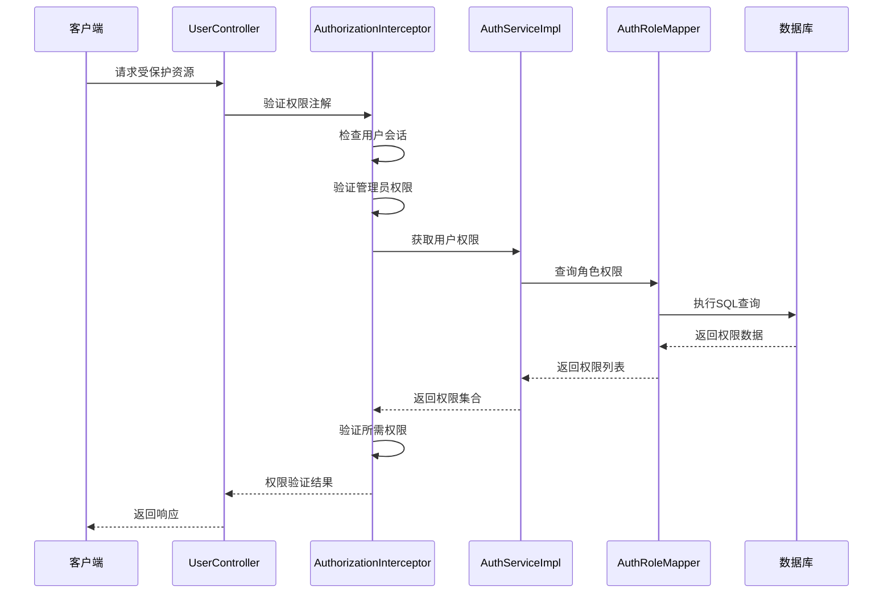
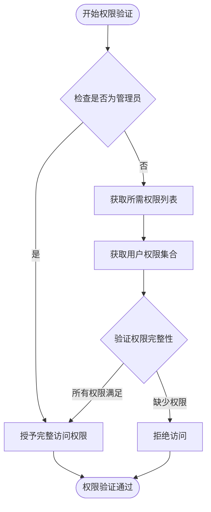
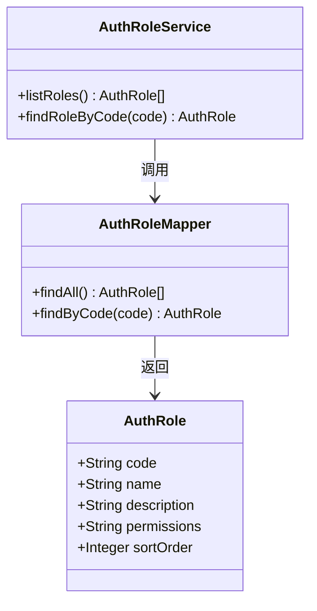
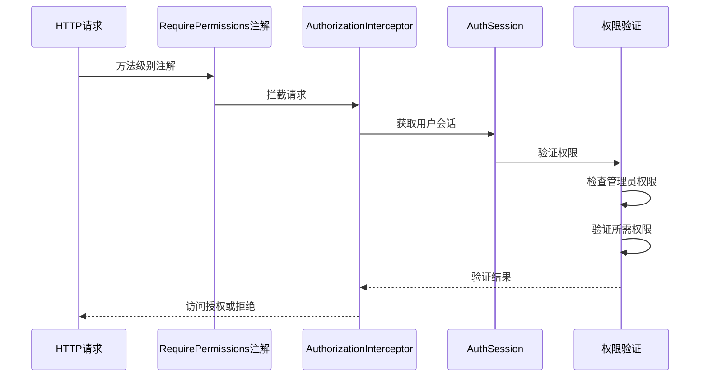
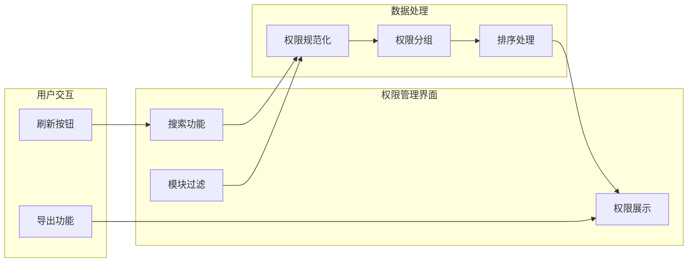
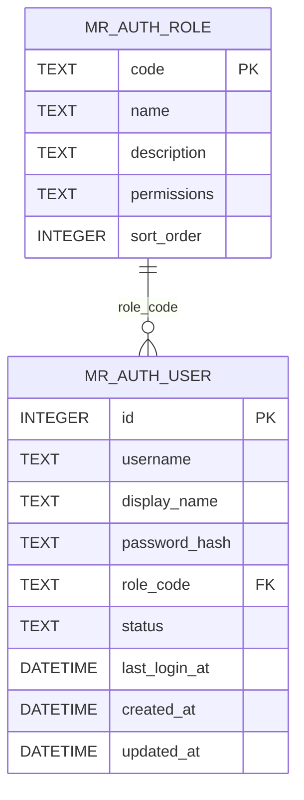

# 角色表 (mr_auth_role)

**本文档引用的文件**
- [schema.sql](file://mrr-db/schema.sql)
- [AuthRole.java](file://backend-repo/src/main/java/com/zjcxph/imgapi/entity/AuthRole.java)
- [AuthRoleMapper.java](file://backend-repo/src/main/java/com/zjcxph/imgapi/mapper/AuthRoleMapper.java)
- [AuthSession.java](file://backend-repo/src/main/java/com/zjcxph/imgapi/common/AuthSession.java)
- [AuthorizationInterceptor.java](file://backend-repo/src/main/java/com/zjcxph/imgapi/interceptors/AuthorizationInterceptor.java)
- [AuthServiceImpl.java](file://backend-repo/src/main/java/com/zjcxph/imgapi/service/impl/AuthServiceImpl.java)
- [UserController.java](file://backend-repo/src/main/java/com/zjcxph/imgapi/controller/UserController.java)
- [RequirePermissions.java](file://backend-repo/src/main/java/com/zjcxph/imgapi/annotation/RequirePermissions.java)
- [PermissionsView.vue](file://frontend-repo/src/components/admin/PermissionsView.vue)
- [index.vue](file://frontend-fantastic-admin/src/views/permissions/index.vue)
- [user.ts](file://frontend-repo/src/store/modules/user.ts)

## 目录
1. [简介](#简介)
2. [项目结构](#项目结构)
3. [核心组件](#核心组件)
4. [架构概览](#架构概览)
5. [详细组件分析](#详细组件分析)
6. [依赖关系分析](#依赖关系分析)
7. [性能考虑](#性能考虑)
8. [故障排除指南](#故障排除指南)
9. [结论](#结论)

## 简介

MRR系统中的mr_auth_role角色表是权限管理系统的核心数据结构，用于定义系统中不同角色的权限集合。该表采用轻量级设计，通过简洁的字段定义实现了灵活的角色权限管理机制。

本角色表在系统中扮演着至关重要的角色：
- 作为权限控制的基础数据源
- 定义用户角色与其权限的映射关系
- 支持基于角色的访问控制（RBAC）
- 提供权限继承和组合的灵活性

## 项目结构

角色表相关的代码分布在以下层次：

**图表来源**
- [schema.sql:58-65](file://mrr-db/schema.sql#L58-L65)
- [AuthRole.java:1-53](file://backend-repo/src/main/java/com/zjcxph/imgapi/entity/AuthRole.java#L1-L53)
- [AuthRoleMapper.java:1-19](file://backend-repo/src/main/java/com/zjcxph/imgapi/mapper/AuthRoleMapper.java#L1-L19)

**章节来源**
- [schema.sql:58-95](file://mrr-db/schema.sql#L58-L95)
- [AuthRole.java:1-53](file://backend-repo/src/main/java/com/zjcxph/imgapi/entity/AuthRole.java#L1-L53)

## 核心组件

### 数据库表结构

mr_auth_role表采用简洁而高效的设计，包含以下关键字段：

| 字段名 | 类型 | 约束 | 描述 |
|--------|------|------|------|
| code | TEXT | PRIMARY KEY | 角色代码，唯一标识符 |
| name | TEXT | NOT NULL | 角色名称，用于显示 |
| description | TEXT | NULL | 角色描述信息 |
| permissions | TEXT | NOT NULL | 权限字符串，逗号分隔 |
| sort_order | INTEGER | NOT NULL DEFAULT 0 | 排序权重，用于界面显示 |

### Java实体类映射

**图表来源**
- [AuthRole.java:6-51](file://backend-repo/src/main/java/com/zjcxph/imgapi/entity/AuthRole.java#L6-L51)

**章节来源**
- [schema.sql:58-65](file://mrr-db/schema.sql#L58-L65)
- [AuthRole.java:1-53](file://backend-repo/src/main/java/com/zjcxph/imgapi/entity/AuthRole.java#L1-L53)

## 架构概览

角色权限系统采用分层架构设计，确保了清晰的职责分离和良好的可维护性：

**图表来源**
- [AuthorizationInterceptor.java:22-56](file://backend-repo/src/main/java/com/zjcxph/imgapi/interceptors/AuthorizationInterceptor.java#L22-L56)
- [AuthServiceImpl.java:102-105](file://backend-repo/src/main/java/com/zjcxph/imgapi/service/impl/AuthServiceImpl.java#L102-L105)
- [AuthRoleMapper.java:13-17](file://backend-repo/src/main/java/com/zjcxph/imgapi/mapper/AuthRoleMapper.java#L13-L17)

## 详细组件分析

### 权限字符串格式规范

权限字符串采用标准化的格式规范，确保权限标识的一致性和可解析性：

#### 格式规范
- **基本格式**: `"module:action"`
- **分隔符**: 逗号(,)分隔多个权限
- **空白字符**: 自动去除前后空格
- **去重机制**: 自动移除重复权限
- **大小写**: 建议使用小写字母

#### 权限类型分类

| 权限模块 | 权限标识 | 含义 | 典型操作 |
|----------|----------|------|----------|
| user | manage | 用户管理 | 创建、修改、删除用户 |
| role | read | 角色读取 | 查看角色列表和详情 |
| role | manage | 角色管理 | 创建、修改、删除角色 |
| record | read | 病案读取 | 查看病案信息 |
| record | edit | 病案编辑 | 编辑病案内容 |
| record | manage | 病案管理 | 完整的病案操作权限 |
| log | read | 日志读取 | 查看系统日志 |
| system | read | 系统读取 | 访问系统配置信息 |
| search | read | 检索读取 | 使用搜索功能 |
| statistics | read | 统计读取 | 查看统计数据 |

### 角色代码命名约定

角色代码遵循统一的命名约定，确保标识符的语义化和一致性：

#### 命名规则
- **格式**: 大写字母和数字的组合
- **长度**: 建议不超过20个字符
- **语义**: 使用简短的英文单词或缩写
- **避免**: 特殊字符和空格

#### 推荐命名示例
- `ADMIN`: 系统管理员
- `DOCTOR`: 医生
- `NURSE`: 护士
- `RECEPTIONIST`: 挂号员
- `BILLING_STAFF`: 收费员

### 权限分配规则

系统实现了严格的权限分配和验证机制：

**图表来源**
- [AuthorizationInterceptor.java:70-76](file://backend-repo/src/main/java/com/zjcxph/imgapi/interceptors/AuthorizationInterceptor.java#L70-L76)
- [AuthSession.java:81-88](file://backend-repo/src/main/java/com/zjcxph/imgapi/common/AuthSession.java#L81-L88)

### 数据访问层实现

**图表来源**
- [AuthRoleMapper.java:10-18](file://backend-repo/src/main/java/com/zjcxph/imgapi/mapper/AuthRoleMapper.java#L10-L18)
- [AuthRole.java:6-11](file://backend-repo/src/main/java/com/zjcxph/imgapi/entity/AuthRole.java#L6-L11)

**章节来源**
- [AuthRoleMapper.java:13-17](file://backend-repo/src/main/java/com/zjcxph/imgapi/mapper/AuthRoleMapper.java#L13-L17)
- [AuthServiceImpl.java:102-105](file://backend-repo/src/main/java/com/zjcxph/imgapi/service/impl/AuthServiceImpl.java#L102-L105)

### 权限验证流程

系统实现了多层次的权限验证机制：

**图表来源**
- [RequirePermissions.java:8-12](file://backend-repo/src/main/java/com/zjcxph/imgapi/annotation/RequirePermissions.java#L8-L12)
- [AuthorizationInterceptor.java:29-56](file://backend-repo/src/main/java/com/zjcxph/imgapi/interceptors/AuthorizationInterceptor.java#L29-L56)

**章节来源**
- [AuthorizationInterceptor.java:17-78](file://backend-repo/src/main/java/com/zjcxph/imgapi/interceptors/AuthorizationInterceptor.java#L17-L78)
- [UserController.java:60-71](file://backend-repo/src/main/java/com/zjcxph/imgapi/controller/UserController.java#L60-L71)

### 前端权限展示

前端提供了完整的权限管理和展示功能：

**图表来源**
- [PermissionsView.vue:202-249](file://frontend-repo/src/components/admin/PermissionsView.vue#L202-L249)
- [index.vue:17-20](file://frontend-fantastic-admin/src/views/permissions/index.vue#L17-L20)

**章节来源**
- [PermissionsView.vue:1-363](file://frontend-repo/src/components/admin/PermissionsView.vue#L1-L363)
- [index.vue:1-54](file://frontend-fantastic-admin/src/views/permissions/index.vue#L1-L54)

## 依赖关系分析

角色表与其他系统组件存在紧密的依赖关系：

**图表来源**
- [schema.sql:58-65](file://mrr-db/schema.sql#L58-L65)
- [schema.sql:67-78](file://mrr-db/schema.sql#L67-L78)

### 依赖关系特点

1. **单向依赖**: 用户表依赖角色表进行权限关联
2. **外键约束**: 通过role_code建立外键关系
3. **数据一致性**: 确保角色代码的唯一性和有效性
4. **级联影响**: 角色删除会影响用户权限分配

**章节来源**
- [schema.sql:80-81](file://mrr-db/schema.sql#L80-L81)
- [AuthServiceImpl.java:107-118](file://backend-repo/src/main/java/com/zjcxph/imgapi/service/impl/AuthServiceImpl.java#L107-L118)

## 性能考虑

### 查询优化策略

1. **索引利用**: 数据库已为role_code建立索引，支持快速查找
2. **排序优化**: 通过sort_order字段实现高效的界面排序
3. **权限缓存**: 建议在会话层面缓存用户权限信息
4. **批量查询**: 支持批量获取角色列表，减少数据库往返

### 内存使用优化

- 权限字符串按需解析，避免不必要的内存占用
- 使用Set数据结构存储权限，确保去重和快速查找
- 支持权限字符串的懒加载机制

## 故障排除指南

### 常见问题及解决方案

#### 权限验证失败
**症状**: 用户无法访问受保护的资源
**原因分析**:
- 用户权限不足
- 角色权限配置错误
- 会话过期

**解决步骤**:
1. 检查用户角色对应的权限字符串
2. 验证权限字符串格式正确性
3. 确认用户会话状态有效

#### 角色代码冲突
**症状**: 新建角色时提示唯一性约束错误
**解决方案**:
- 使用唯一的角色代码标识符
- 遵循大写字母和数字的命名约定
- 检查现有角色代码的使用情况

#### 权限字符串格式错误
**症状**: 权限验证不生效或出现异常
**排查方法**:
1. 检查权限字符串是否以逗号分隔
2. 确认每个权限标识符符合"module:action"格式
3. 验证权限字符串中无多余空格

**章节来源**
- [AuthorizationInterceptor.java:58-68](file://backend-repo/src/main/java/com/zjcxph/imgapi/interceptors/AuthorizationInterceptor.java#L58-L68)
- [AuthServiceImpl.java:136-145](file://backend-repo/src/main/java/com/zjcxph/imgapi/service/impl/AuthServiceImpl.java#L136-L145)

## 结论

mr_auth_role角色表通过其简洁而强大的设计，为MRR系统提供了灵活且高效的权限管理机制。该设计的关键优势包括：

1. **简洁性**: 仅包含必要的字段，避免了过度复杂化
2. **灵活性**: 权限字符串支持动态扩展和组合
3. **可维护性**: 清晰的命名约定和验证机制
4. **可扩展性**: 支持新的权限模块和角色类型

通过合理的权限分配和严格的验证机制，该角色表为整个系统的安全访问控制奠定了坚实的基础。建议在实际使用中遵循既定的命名约定和权限规范，确保系统的安全性和稳定性。