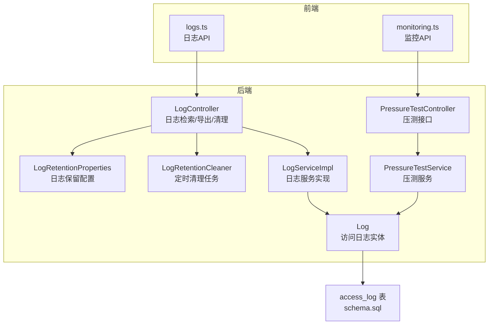
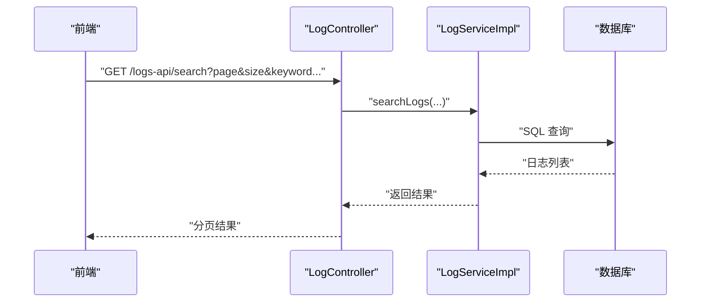
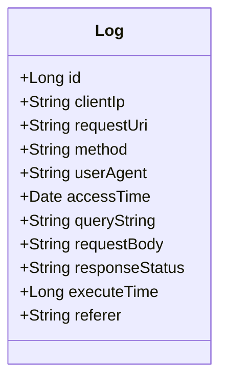
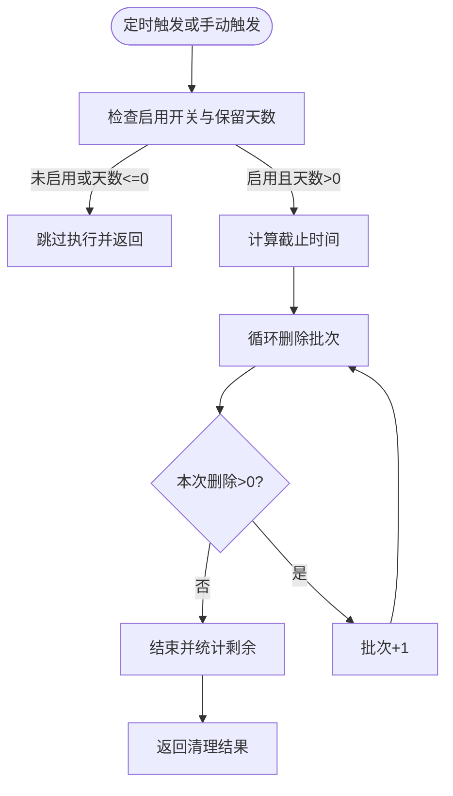
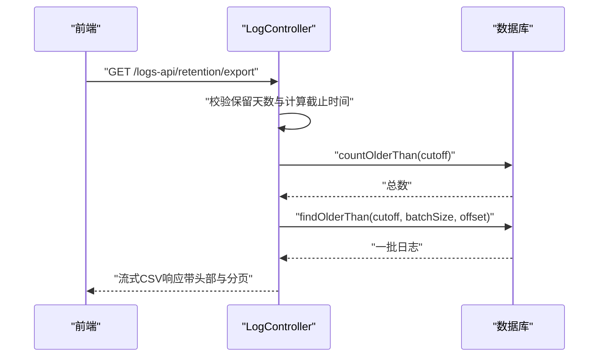
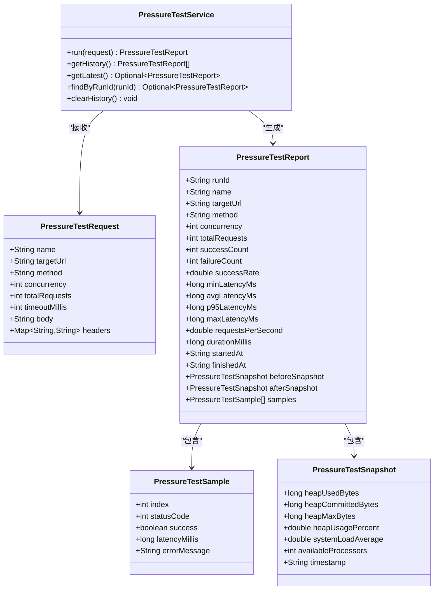
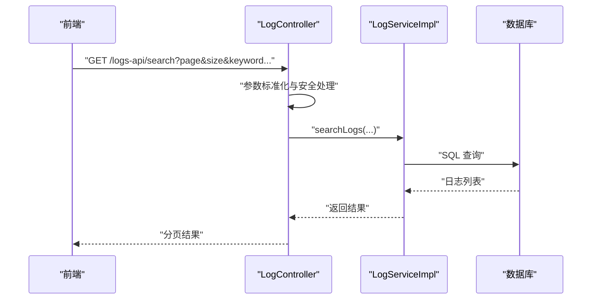
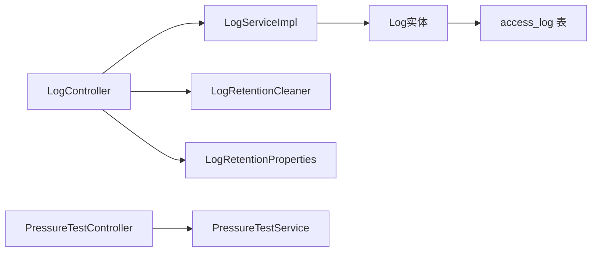

# 日志审计与监控

**本文引用的文件**   
- [LogRetentionProperties.java](file://backend-repo/src/main/java/com/zjcxph/imgapi/config/LogRetentionProperties.java)
- [LogRetentionCleaner.java](file://backend-repo/src/main/java/com/zjcxph/imgapi/scheduler/LogRetentionCleaner.java)
- [LogController.java](file://backend-repo/src/main/java/com/zjcxph/imgapi/controller/LogController.java)
- [LogServiceImpl.java](file://backend-repo/src/main/java/com/zjcxph/imgapi/service/impl/LogServiceImpl.java)
- [Log.java](file://backend-repo/src/main/java/com/zjcxph/imgapi/entity/Log.java)
- [PressureTestService.java](file://backend-repo/src/main/java/com/zjcxph/imgapi/monitoring/PressureTestService.java)
- [PressureTestReport.java](file://backend-repo/src/main/java/com/zjcxph/imgapi/monitoring/PressureTestReport.java)
- [PressureTestRequest.java](file://backend-repo/src/main/java/com/zjcxph/imgapi/monitoring/PressureTestRequest.java)
- [PressureTestSample.java](file://backend-repo/src/main/java/com/zjcxph/imgapi/monitoring/PressureTestSample.java)
- [PressureTestSnapshot.java](file://backend-repo/src/main/java/com/zjcxph/imgapi/monitoring/PressureTestSnapshot.java)
- [PressureTestController.java](file://backend-repo/src/main/java/com/zjcxph/imgapi/controller/PressureTestController.java)
- [application.properties](file://backend-repo/src/main/resources/application.properties)
- [schema.sql](file://mrr-db/schema.sql)
- [logs.ts](file://frontend-repo/src/api/logs.ts)
- [monitoring.ts](file://frontend-repo/src/api/monitoring.ts)

## 目录
1. [简介](#简介)
2. [项目结构](#项目结构)
3. [核心组件](#核心组件)
4. [架构总览](#架构总览)
5. [详细组件分析](#详细组件分析)
6. [依赖分析](#依赖分析)
7. [性能考虑](#性能考虑)
8. [故障排查指南](#故障排查指南)
9. [结论](#结论)
10. [附录](#附录)

## 简介
本文件面向MRR系统的日志审计与监控子系统，围绕访问日志记录、审计追踪、合规性要求、日志保留策略与自动清理、手动清理流程、压力测试与性能监控、内存快照、日志导出（CSV）与批量处理、监控仪表板与实时状态展示、告警机制、系统健康检查、性能基准测试与容量规划等方面进行系统化说明。文档以代码为依据，结合前后端接口与配置，帮助运维与开发人员理解并正确使用该子系统。

## 项目结构
后端采用Spring Boot工程，日志与监控相关代码集中在以下包与类中：
- 配置：LogRetentionProperties（日志保留配置）
- 定时任务：LogRetentionCleaner（基于Cron的过期日志清理）
- 控制器：LogController（日志检索、导出、保留清理触发）、PressureTestController（压测接口）
- 服务层：LogServiceImpl（日志查询与计数）、PressureTestService（压测执行、采样、快照）
- 实体：Log（访问日志实体）
- 数据库：schema.sql（定义access_log表结构）

图表来源
- [LogRetentionProperties.java:1-54](file://backend-repo/src/main/java/com/zjcxph/imgapi/config/LogRetentionProperties.java#L1-L54)
- [LogRetentionCleaner.java:1-119](file://backend-repo/src/main/java/com/zjcxph/imgapi/scheduler/LogRetentionCleaner.java#L1-L119)
- [LogController.java:1-245](file://backend-repo/src/main/java/com/zjcxph/imgapi/controller/LogController.java#L1-L245)
- [PressureTestController.java:1-73](file://backend-repo/src/main/java/com/zjcxph/imgapi/controller/PressureTestController.java#L1-L73)
- [LogServiceImpl.java:1-71](file://backend-repo/src/main/java/com/zjcxph/imgapi/service/impl/LogServiceImpl.java#L1-L71)
- [PressureTestService.java:1-293](file://backend-repo/src/main/java/com/zjcxph/imgapi/monitoring/PressureTestService.java#L1-L293)
- [Log.java:1-138](file://backend-repo/src/main/java/com/zjcxph/imgapi/entity/Log.java#L1-L138)
- [schema.sql:1-14](file://mrr-db/schema.sql#L1-L14)
- [logs.ts:1-18](file://frontend-repo/src/api/logs.ts#L1-L18)
- [monitoring.ts:1-22](file://frontend-repo/src/api/monitoring.ts#L1-L22)

章节来源
- [LogRetentionProperties.java:1-54](file://backend-repo/src/main/java/com/zjcxph/imgapi/config/LogRetentionProperties.java#L1-L54)
- [LogRetentionCleaner.java:1-119](file://backend-repo/src/main/java/com/zjcxph/imgapi/scheduler/LogRetentionCleaner.java#L1-L119)
- [LogController.java:1-245](file://backend-repo/src/main/java/com/zjcxph/imgapi/controller/LogController.java#L1-L245)
- [PressureTestController.java:1-73](file://backend-repo/src/main/java/com/zjcxph/imgapi/controller/PressureTestController.java#L1-L73)
- [LogServiceImpl.java:1-71](file://backend-repo/src/main/java/com/zjcxph/imgapi/service/impl/LogServiceImpl.java#L1-L71)
- [PressureTestService.java:1-293](file://backend-repo/src/main/java/com/zjcxph/imgapi/monitoring/PressureTestService.java#L1-L293)
- [Log.java:1-138](file://backend-repo/src/main/java/com/zjcxph/imgapi/entity/Log.java#L1-L138)
- [schema.sql:1-14](file://mrr-db/schema.sql#L1-L14)
- [logs.ts:1-18](file://frontend-repo/src/api/logs.ts#L1-L18)
- [monitoring.ts:1-22](file://frontend-repo/src/api/monitoring.ts#L1-L22)

## 核心组件
- 访问日志实体与持久化
  - 实体：Log（字段覆盖客户端IP、请求URI、方法、UA、时间、查询参数、请求体、响应状态、耗时、Referer等）
  - 表结构：access_log（含主键、索引与约束）
- 日志保留与清理
  - 配置：LogRetentionProperties（启用开关、Cron表达式、保留天数、批大小、每轮最大批次）
  - 清理：LogRetentionCleaner（按批次删除过期日志，记录清理结果）
  - 触发：LogController提供手动清理与导出接口
- 压力测试与性能监控
  - 请求模型：PressureTestRequest（名称、目标URL、方法、并发、请求数、超时、请求头、请求体）
  - 执行：PressureTestService（并发执行、统计成功率、延迟分位、吞吐、内存与CPU快照）
  - 报告：PressureTestReport（运行标识、指标、样本列表、前后快照）
  - 接口：PressureTestController（运行、历史、最新、按ID查询、清空历史）
- 前端接口
  - 日志：logs.ts（检索、按ID获取、触发清理、导出CSV）
  - 监控：monitoring.ts（运行压测、历史、最新、按ID查询、清空历史）

章节来源
- [Log.java:1-138](file://backend-repo/src/main/java/com/zjcxph/imgapi/entity/Log.java#L1-L138)
- [schema.sql:1-14](file://mrr-db/schema.sql#L1-L14)
- [LogRetentionProperties.java:1-54](file://backend-repo/src/main/java/com/zjcxph/imgapi/config/LogRetentionProperties.java#L1-L54)
- [LogRetentionCleaner.java:1-119](file://backend-repo/src/main/java/com/zjcxph/imgapi/scheduler/LogRetentionCleaner.java#L1-L119)
- [LogController.java:1-245](file://backend-repo/src/main/java/com/zjcxph/imgapi/controller/LogController.java#L1-L245)
- [PressureTestRequest.java:1-180](file://backend-repo/src/main/java/com/zjcxph/imgapi/monitoring/PressureTestRequest.java#L1-L180)
- [PressureTestService.java:1-293](file://backend-repo/src/main/java/com/zjcxph/imgapi/monitoring/PressureTestService.java#L1-L293)
- [PressureTestReport.java:1-317](file://backend-repo/src/main/java/com/zjcxph/imgapi/monitoring/PressureTestReport.java#L1-L317)
- [PressureTestController.java:1-73](file://backend-repo/src/main/java/com/zjcxph/imgapi/controller/PressureTestController.java#L1-L73)
- [logs.ts:1-18](file://frontend-repo/src/api/logs.ts#L1-L18)
- [monitoring.ts:1-22](file://frontend-repo/src/api/monitoring.ts#L1-L22)

## 架构总览
系统通过控制器暴露REST接口，服务层完成业务逻辑，定时任务按配置周期执行清理，数据库存储访问日志。前端通过API模块调用后端接口，实现日志检索、导出、清理与压测运行、历史查看等功能。

图表来源
- [LogController.java:150-202](file://backend-repo/src/main/java/com/zjcxph/imgapi/controller/LogController.java#L150-L202)
- [LogServiceImpl.java:46-69](file://backend-repo/src/main/java/com/zjcxph/imgapi/service/impl/LogServiceImpl.java#L46-L69)

## 详细组件分析

### 访问日志实体与表结构
- 实体字段覆盖关键审计要素：客户端IP、请求URI、方法、UA、访问时间、查询参数、请求体、响应状态、执行耗时、Referer
- 表结构定义了主键与字段类型，便于后续索引与查询优化

图表来源
- [Log.java:1-138](file://backend-repo/src/main/java/com/zjcxph/imgapi/entity/Log.java#L1-L138)

章节来源
- [Log.java:1-138](file://backend-repo/src/main/java/com/zjcxph/imgapi/entity/Log.java#L1-L138)
- [schema.sql:1-14](file://mrr-db/schema.sql#L1-L14)

### 日志保留策略与自动清理
- 配置项
  - 启用开关：控制是否执行清理
  - Cron表达式：默认每日凌晨2:30执行
  - 保留天数：默认1095天（约3年）
  - 批大小与每轮最大批次：避免单次删除造成过大负载
- 自动清理流程
  - 定时任务触发清理入口
  - 计算截止时间（当前时间减去保留天数）
  - 分批删除过期日志，统计删除数量与剩余条目
  - 记录执行结果与日志
- 手动清理流程
  - 通过接口传入可选截止时间，立即执行清理
  - 返回清理结果对象，包含执行状态、删除数量、剩余条目、批次数等

图表来源
- [LogRetentionCleaner.java:39-117](file://backend-repo/src/main/java/com/zjcxph/imgapi/scheduler/LogRetentionCleaner.java#L39-L117)
- [LogRetentionProperties.java:8-12](file://backend-repo/src/main/java/com/zjcxph/imgapi/config/LogRetentionProperties.java#L8-L12)

章节来源
- [LogRetentionProperties.java:1-54](file://backend-repo/src/main/java/com/zjcxph/imgapi/config/LogRetentionProperties.java#L1-L54)
- [LogRetentionCleaner.java:1-119](file://backend-repo/src/main/java/com/zjcxph/imgapi/scheduler/LogRetentionCleaner.java#L1-L119)
- [LogController.java:94-106](file://backend-repo/src/main/java/com/zjcxph/imgapi/controller/LogController.java#L94-L106)

### 日志导出与CSV批量处理
- 导出接口
  - 仅在保留天数>0时允许导出
  - 使用UTF-8-BOM写入CSV头部
  - 按批拉取过期日志，逐行写入CSV
  - 设置响应头包含导出总量与截止时间
- 批量处理
  - 通过批大小与偏移量分页读取，避免一次性加载过多数据
  - 流式输出，降低内存占用

图表来源
- [LogController.java:108-148](file://backend-repo/src/main/java/com/zjcxph/imgapi/controller/LogController.java#L108-L148)

章节来源
- [LogController.java:108-148](file://backend-repo/src/main/java/com/zjcxph/imgapi/controller/LogController.java#L108-L148)

### 压力测试与性能监控
- 压测请求模型
  - 支持GET/POST/PUT/PATCH/DELETE方法
  - 并发度与总请求数限制，超时时间限制
  - 可设置请求头与请求体
- 执行与采样
  - 固定线程池并发执行
  - 统计成功/失败次数、成功率、最小/平均/95分位/最大延迟
  - 吞吐（每秒请求数）、总耗时
- 内存与系统快照
  - 记录堆使用、提交、最大值与百分比
  - 系统负载平均值、可用处理器数
- 历史与查询
  - 历史上限固定，最近优先
  - 支持按运行ID查询与清空历史

图表来源
- [PressureTestRequest.java:1-180](file://backend-repo/src/main/java/com/zjcxph/imgapi/monitoring/PressureTestRequest.java#L1-L180)
- [PressureTestSample.java:1-82](file://backend-repo/src/main/java/com/zjcxph/imgapi/monitoring/PressureTestSample.java#L1-L82)
- [PressureTestSnapshot.java:1-118](file://backend-repo/src/main/java/com/zjcxph/imgapi/monitoring/PressureTestSnapshot.java#L1-L118)
- [PressureTestReport.java:1-317](file://backend-repo/src/main/java/com/zjcxph/imgapi/monitoring/PressureTestReport.java#L1-L317)
- [PressureTestService.java:1-293](file://backend-repo/src/main/java/com/zjcxph/imgapi/monitoring/PressureTestService.java#L1-L293)

章节来源
- [PressureTestRequest.java:1-180](file://backend-repo/src/main/java/com/zjcxph/imgapi/monitoring/PressureTestRequest.java#L1-L180)
- [PressureTestService.java:1-293](file://backend-repo/src/main/java/com/zjcxph/imgapi/monitoring/PressureTestService.java#L1-L293)
- [PressureTestReport.java:1-317](file://backend-repo/src/main/java/com/zjcxph/imgapi/monitoring/PressureTestReport.java#L1-L317)
- [PressureTestController.java:1-73](file://backend-repo/src/main/java/com/zjcxph/imgapi/controller/PressureTestController.java#L1-L73)

### 日志检索与搜索
- 支持按ID、客户端IP、请求URI、关键字、方法、响应状态、时间范围等条件检索
- 分页安全处理（最小页码与最大页大小）
- CSV单元格转义与日期格式化

图表来源
- [LogController.java:150-202](file://backend-repo/src/main/java/com/zjcxph/imgapi/controller/LogController.java#L150-L202)
- [LogServiceImpl.java:46-69](file://backend-repo/src/main/java/com/zjcxph/imgapi/service/impl/LogServiceImpl.java#L46-L69)

章节来源
- [LogController.java:150-202](file://backend-repo/src/main/java/com/zjcxph/imgapi/controller/LogController.java#L150-L202)
- [LogServiceImpl.java:1-71](file://backend-repo/src/main/java/com/zjcxph/imgapi/service/impl/LogServiceImpl.java#L1-L71)

### 前端监控与日志API
- 日志API：检索、按ID获取、触发清理、导出CSV
- 监控API：运行压测、获取历史、最新、按ID查询、清空历史

章节来源
- [logs.ts:1-18](file://frontend-repo/src/api/logs.ts#L1-L18)
- [monitoring.ts:1-22](file://frontend-repo/src/api/monitoring.ts#L1-L22)

## 依赖分析
- 组件耦合
  - LogController依赖LogServiceImpl、LogRetentionCleaner、LogRetentionProperties
  - PressureTestController依赖PressureTestService
  - LogServiceImpl依赖LogMapper（由MyBatis映射）
- 外部依赖
  - Spring Scheduling（定时任务）
  - Spring Web MVC（REST接口）
  - MyBatis（数据库访问）
  - SLF4J（日志）
- 配置依赖
  - application.properties中的日志保留相关属性绑定到LogRetentionProperties

图表来源
- [LogController.java:39-54](file://backend-repo/src/main/java/com/zjcxph/imgapi/controller/LogController.java#L39-L54)
- [PressureTestController.java:29-33](file://backend-repo/src/main/java/com/zjcxph/imgapi/controller/PressureTestController.java#L29-L33)
- [LogServiceImpl.java:14-15](file://backend-repo/src/main/java/com/zjcxph/imgapi/service/impl/LogServiceImpl.java#L14-L15)
- [LogRetentionCleaner.java:21-24](file://backend-repo/src/main/java/com/zjcxph/imgapi/scheduler/LogRetentionCleaner.java#L21-L24)
- [LogRetentionProperties.java:5-52](file://backend-repo/src/main/java/com/zjcxph/imgapi/config/LogRetentionProperties.java#L5-L52)
- [Log.java:7-8](file://backend-repo/src/main/java/com/zjcxph/imgapi/entity/Log.java#L7-L8)
- [schema.sql:1-14](file://mrr-db/schema.sql#L1-L14)

章节来源
- [application.properties:40-45](file://backend-repo/src/main/resources/application.properties#L40-L45)

## 性能考虑
- 清理性能
  - 批量删除避免长事务与锁竞争
  - 每轮最大批次限制防止长时间阻塞
  - 截止时间计算与索引配合提升查询效率
- 导出性能
  - 流式写入减少内存峰值
  - 分批读取避免大结果集
- 压测性能
  - 固定线程池并发，避免资源无序增长
  - 延迟统计与分位数计算用于评估尾延迟
  - 内存与系统负载快照辅助容量规划

## 故障排查指南
- 清理未执行
  - 检查启用开关与保留天数是否有效
  - 查看定时任务Cron配置是否正确
- 清理异常
  - 关注清理结果中的错误消息与日志
  - 检查数据库连接与权限
- 导出失败
  - 确认保留天数>0
  - 检查响应头与流式写出是否正常
- 压测异常
  - 检查目标URL可达性与超时设置
  - 关注工作线程异常与中断情况
- 健康检查
  - 开启Actuator端点，使用health、info、metrics、prometheus等端点进行系统状态检查

章节来源
- [LogRetentionCleaner.java:110-114](file://backend-repo/src/main/java/com/zjcxph/imgapi/scheduler/LogRetentionCleaner.java#L110-L114)
- [LogController.java:108-148](file://backend-repo/src/main/java/com/zjcxph/imgapi/controller/LogController.java#L108-L148)
- [PressureTestService.java:160-164](file://backend-repo/src/main/java/com/zjcxph/imgapi/monitoring/PressureTestService.java#L160-L164)
- [application.properties:37-38](file://backend-repo/src/main/resources/application.properties#L37-L38)

## 结论
MRR的日志审计与监控子系统提供了完善的访问日志记录、审计追踪、合规性支持、自动与手动清理、日志导出、压力测试与性能监控、内存快照与历史管理能力。通过合理的配置与接口设计，能够满足日常运维与容量规划需求。建议在生产环境开启清理与导出功能，并结合压测与健康检查持续优化系统性能与稳定性。

## 附录

### 日志保留配置清单
- app.log-retention.enabled：是否启用清理
- app.log-retention.cron：Cron表达式
- app.log-retention.retention-days：保留天数
- app.log-retention.batch-size：批大小
- app.log-retention.max-batches-per-run：每轮最大批次

章节来源
- [application.properties:40-45](file://backend-repo/src/main/resources/application.properties#L40-L45)
- [LogRetentionProperties.java:8-12](file://backend-repo/src/main/java/com/zjcxph/imgapi/config/LogRetentionProperties.java#L8-L12)

### 清理作业调度与数据完整性
- 调度：基于Spring Scheduling的Cron定时任务
- 数据完整性：分批删除与剩余计数，确保不会遗漏；导出时统计总量，便于核对

章节来源
- [LogRetentionCleaner.java:26-117](file://backend-repo/src/main/java/com/zjcxph/imgapi/scheduler/LogRetentionCleaner.java#L26-L117)
- [LogController.java:108-148](file://backend-repo/src/main/java/com/zjcxph/imgapi/controller/LogController.java#L108-L148)

### 监控仪表板与实时状态
- 压测历史与最新结果可通过前端API获取
- 建议在前端页面展示压测报告的关键指标与快照对比

章节来源
- [PressureTestController.java:43-71](file://backend-repo/src/main/java/com/zjcxph/imgapi/controller/PressureTestController.java#L43-L71)
- [monitoring.ts:1-22](file://frontend-repo/src/api/monitoring.ts#L1-L22)

### 告警机制
- 建议结合外部监控系统（如Prometheus/Grafana）采集Actuator指标，设置阈值告警（如健康状态异常、指标异常波动）
- 对清理失败与导出异常进行日志告警

章节来源
- [application.properties:37-38](file://backend-repo/src/main/resources/application.properties#L37-L38)

### 系统健康检查
- 启用health、info、metrics、prometheus端点，定期巡检系统状态与指标

章节来源
- [application.properties:37-38](file://backend-repo/src/main/resources/application.properties#L37-L38)

### 性能基准测试与容量规划
- 使用压测功能模拟不同并发与请求规模，观察延迟分位与吞吐变化
- 结合内存快照与系统负载，评估CPU与内存容量余量，制定扩容策略

章节来源
- [PressureTestService.java:232-251](file://backend-repo/src/main/java/com/zjcxph/imgapi/monitoring/PressureTestService.java#L232-L251)