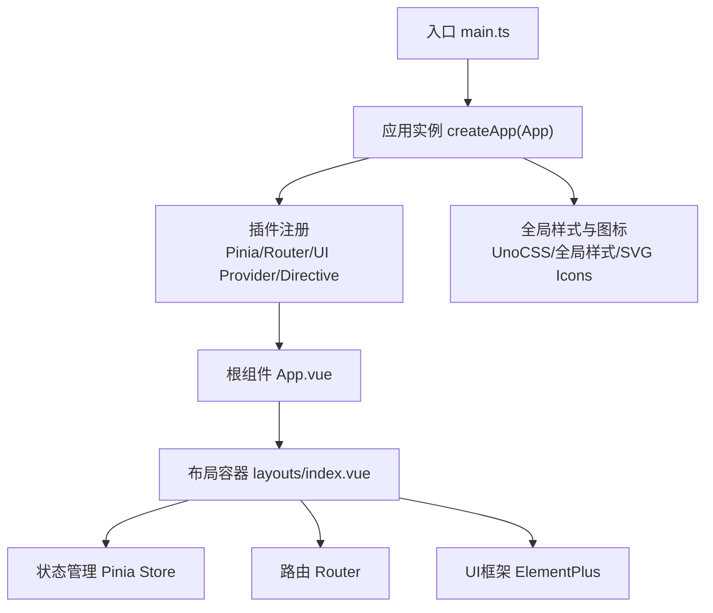
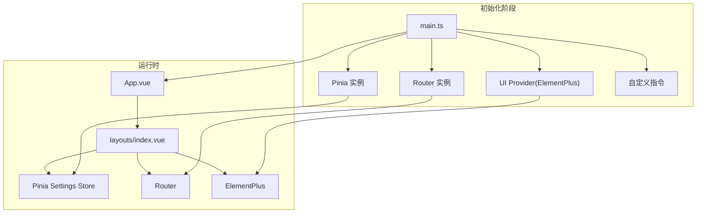
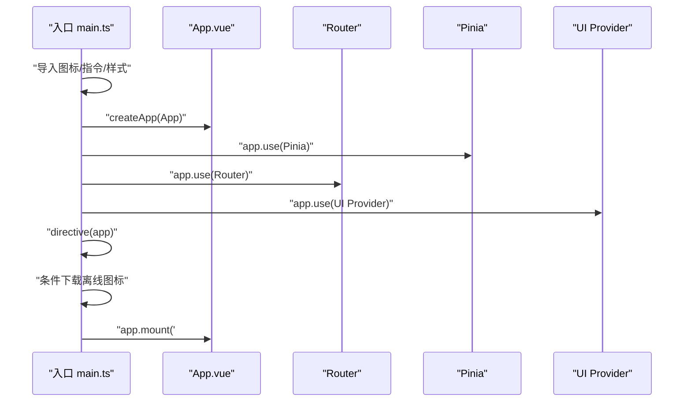
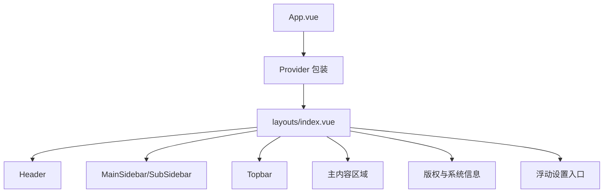
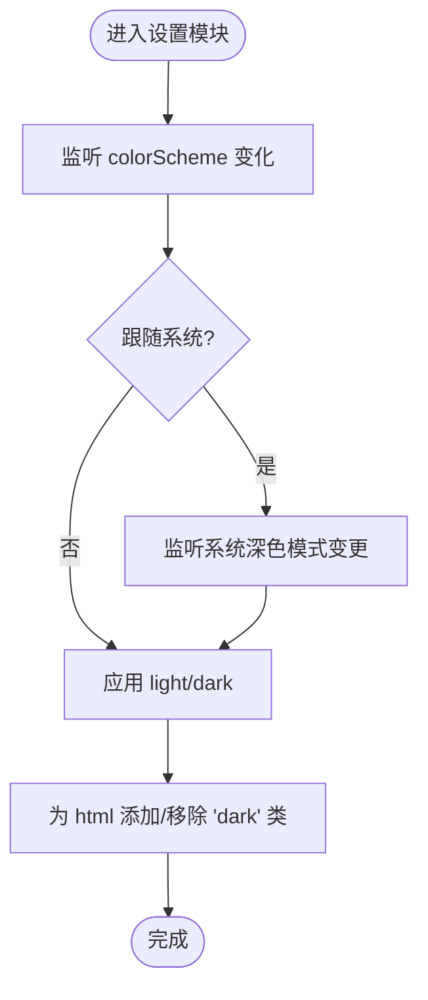
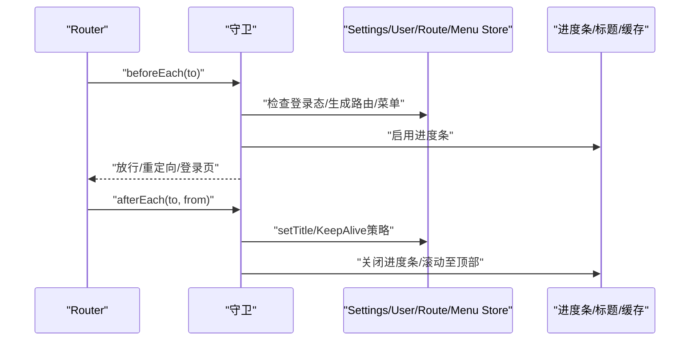
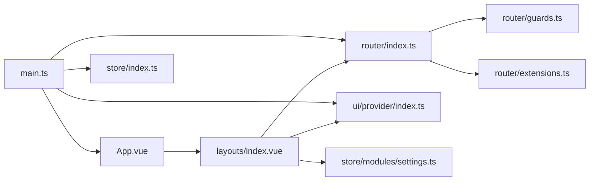

# Vue应用结构

**本文档引用的文件**
- [main.ts](file://frontend-fantastic-admin/src/main.ts)
- [App.vue](file://frontend-fantastic-admin/src/App.vue)
- [settings.ts](file://frontend-fantastic-admin/src/settings.ts)
- [settings.default.ts](file://frontend-fantastic-admin/src/settings.default.ts)
- [store/index.ts](file://frontend-fantastic-admin/src/store/index.ts)
- [router/index.ts](file://frontend-fantastic-admin/src/router/index.ts)
- [ui/provider/index.ts](file://frontend-fantastic-admin/src/ui/provider/index.ts)
- [utils/directive.ts](file://frontend-fantastic-admin/src/utils/directive.ts)
- [types/global.d.ts](file://frontend-fantastic-admin/src/types/global.d.ts)
- [vite.config.ts](file://frontend-fantastic-admin/vite.config.ts)
- [store/modules/settings.ts](file://frontend-fantastic-admin/src/store/modules/settings.ts)
- [layouts/index.vue](file://frontend-fantastic-admin/src/layouts/index.vue)
- [utils/composables/useAuth.ts](file://frontend-fantastic-admin/src/utils/composables/useAuth.ts)
- [package.json](file://frontend-fantastic-admin/package.json)
- [iconify/index.ts](file://frontend-fantastic-admin/src/iconify/index.ts)
- [utils/systemCopyright.ts](file://frontend-fantastic-admin/src/utils/systemCopyright.ts)
- [router/guards.ts](file://frontend-fantastic-admin/src/router/guards.ts)
- [router/extensions.ts](file://frontend-fantastic-admin/src/router/extensions.ts)

## 目录
1. [简介](#简介)
2. [项目结构](#项目结构)
3. [核心组件](#核心组件)
4. [架构总览](#架构总览)
5. [详细组件分析](#详细组件分析)
6. [依赖关系分析](#依赖关系分析)
7. [性能考虑](#性能考虑)
8. [故障排除指南](#故障排除指南)
9. [结论](#结论)
10. [附录](#附录)

## 简介
本文件面向MRR Vue 3前端应用，系统化梳理应用初始化流程、应用实例配置与全局注册机制；详解入口文件main.ts的模块导入顺序、插件注册流程与全局配置；解析App.vue根组件的设计模式、布局结构与全局状态管理；阐述应用设置系统（settings.ts）的配置项、主题切换机制与运行时配置；并覆盖全局类型定义、环境变量处理与应用生命周期管理。最后提供最佳实践与扩展指南，帮助开发者高效维护与演进应用。

## 项目结构
MRR前端采用“功能域+分层”混合组织方式：按功能域划分组件、布局、路由与状态模块，按技术层次组织类型、工具与构建配置。核心目录与职责如下：
- src：源代码根目录
  - api：接口封装
  - assets：静态资源（样式、图标、图片）
  - components：业务组件与共享组件
  - layouts：布局容器与通用部件
  - router：路由定义、守卫与扩展
  - store：状态管理（Pinia）
  - ui：UI框架集成与组件提供者
  - utils：工具函数与组合式工具
  - views：页面视图
  - types：全局类型声明
  - iconify：图标系统
  - App.vue、main.ts：根组件与入口
- vite.config.ts：构建与开发服务器配置
- package.json：依赖与脚本

图表来源
- [main.ts:21-32](file://frontend-fantastic-admin/src/main.ts#L21-L32)
- [App.vue:43-54](file://frontend-fantastic-admin/src/App.vue#L43-L54)
- [layouts/index.vue:78-121](file://frontend-fantastic-admin/src/layouts/index.vue#L78-L121)

章节来源
- [main.ts:1-33](file://frontend-fantastic-admin/src/main.ts#L1-L33)
- [vite.config.ts:10-63](file://frontend-fantastic-admin/vite.config.ts#L10-L63)

## 核心组件
本节聚焦应用初始化与全局配置的核心构件，包括入口、根组件、设置系统与状态管理。

- 应用入口 main.ts
  - 按序加载图标、自定义指令、App、路由、状态、UI提供者与系统版权提示
  - 注册全局SVG图标、UnoCSS重置与虚拟样式
  - 创建应用实例并依次use插件，按配置下载离线图标集合
  - 挂载到DOM
- 根组件 App.vue
  - 读取UA操作系统信息，注入body属性
  - 监听动态标题开关与标题值，结合环境变量生成最终标题
  - 初始化窗口尺寸检测，设置移动端/PC模式
  - 渲染Provider、RouterView、回顶部、通知与系统信息组件
- 设置系统 settings.ts 与 settings.default.ts
  - 默认配置集中于settings.default.ts，运行时通过settings.ts合并用户配置
  - 提供应用、菜单、工具栏、布局、版权等维度的配置项
- 状态管理 store/index.ts 与 store/modules/settings.ts
  - 统一导出Pinia实例
  - settings模块负责主题切换、圆角、滤镜模式、菜单模式、移动端适配、页面标题、标签栏等运行时状态

章节来源
- [main.ts:1-33](file://frontend-fantastic-admin/src/main.ts#L1-L33)
- [App.vue:1-55](file://frontend-fantastic-admin/src/App.vue#L1-L55)
- [settings.ts:1-22](file://frontend-fantastic-admin/src/settings.ts#L1-L22)
- [settings.default.ts:1-63](file://frontend-fantastic-admin/src/settings.default.ts#L1-L63)
- [store/index.ts:1-4](file://frontend-fantastic-admin/src/store/index.ts#L1-L4)
- [store/modules/settings.ts:1-181](file://frontend-fantastic-admin/src/store/modules/settings.ts#L1-L181)

## 架构总览
应用采用“入口创建实例 → 插件注册 → 根组件渲染 → 布局容器承载”的标准Vue 3架构。路由与状态贯穿全局，UI提供者统一注入ElementPlus，自定义指令实现权限控制，图标系统支持在线/离线模式。

图表来源
- [main.ts:21-32](file://frontend-fantastic-admin/src/main.ts#L21-L32)
- [App.vue:43-54](file://frontend-fantastic-admin/src/App.vue#L43-L54)
- [layouts/index.vue:78-121](file://frontend-fantastic-admin/src/layouts/index.vue#L78-L121)

## 详细组件分析

### 应用入口与初始化流程
- 模块导入顺序
  - 图标与指令：Iconify图标下载与安装、自定义指令
  - 应用与插件：App.vue、router、store、ui provider
  - 全局资源：SVG图标注册、UnoCSS重置与虚拟样式、全局样式
- 插件注册流程
  - createApp(App)创建应用实例
  - app.use(Pinia)、app.use(Router)、app.use(UI Provider)
  - directive(app)注册自定义指令
  - 条件下载离线图标集合
  - app.mount('#app')挂载
- 生命周期
  - 应用实例创建即开始，挂载后进入运行时

图表来源
- [main.ts:1-33](file://frontend-fantastic-admin/src/main.ts#L1-L33)

章节来源
- [main.ts:1-33](file://frontend-fantastic-admin/src/main.ts#L1-L33)

### 根组件设计模式与布局结构
- 设计模式
  - Provider模式：通过Provider包裹RouterView，统一注入UI能力
  - 条件渲染：基于权限指令控制组件显示
  - 响应式标题：监听设置与标题变化，动态更新document.title
- 布局结构
  - Header、MainSidebar、SubSidebar、Topbar、主内容区域、版权与浮动设置入口
  - 移动端适配：侧边栏抽屉式交互，滚动锁定与遮罩层
  - KeepAlive与过渡动画：提升页面切换体验
- 全局状态管理
  - settingsStore控制主题、圆角、滤镜、菜单模式、移动端模式、页面标题
  - keepAliveStore与tabbarStore配合路由扩展实现标签页与缓存策略

图表来源
- [App.vue:43-54](file://frontend-fantastic-admin/src/App.vue#L43-L54)
- [layouts/index.vue:78-121](file://frontend-fantastic-admin/src/layouts/index.vue#L78-L121)

章节来源
- [App.vue:1-55](file://frontend-fantastic-admin/src/App.vue#L1-L55)
- [layouts/index.vue:1-256](file://frontend-fantastic-admin/src/layouts/index.vue#L1-L256)

### 应用设置系统与主题切换机制
- 配置项
  - app：颜色方案、圆角、哀悼/色弱模式、权限、进度条、动态标题、路由来源
  - menu：模式、主菜单点击模式、子菜单唯一展开、折叠状态、快捷键等
  - toolbar：启用、面包屑、导航搜索、全屏、刷新、颜色主题
  - layout：移动端适配
  - tabbar：启用、图标、快捷键
  - copyright：版权信息
- 主题切换机制
  - 监听colorScheme变化，动态添加/移除html的dark类
  - 跟随系统暗色模式时，监听prefers-color-scheme变更
  - 设置圆角半径为CSS变量，滤镜组合支持哀悼与色弱模式
- 运行时配置
  - setMode根据窗口宽度与UA判断移动端/PC模式
  - setTitle在路由切换后更新页面标题
  - toggleSidebarCollapse控制子菜单折叠状态

图表来源
- [store/modules/settings.ts:13-49](file://frontend-fantastic-admin/src/store/modules/settings.ts#L13-L49)

章节来源
- [settings.ts:1-22](file://frontend-fantastic-admin/src/settings.ts#L1-L22)
- [settings.default.ts:1-63](file://frontend-fantastic-admin/src/settings.default.ts#L1-L63)
- [store/modules/settings.ts:1-181](file://frontend-fantastic-admin/src/store/modules/settings.ts#L1-L181)

### 路由与守卫体系
- 路由初始化
  - 根据settings决定路由来源（前端/后端/文件系统），组装常量路由与系统路由
  - 完成后触发loadingFadeOut，移除应用加载态
- 路由守卫
  - 权限与路由生成：登录态下按配置生成路由与菜单，处理单页模式与首页重定向
  - 进度条：beforeEach启用，afterEach关闭
  - 标题：afterEach根据meta设置页面标题
  - 页面缓存：afterEach根据meta.cache与noCache策略增删KeepAlive组件
  - 其他：滚动至顶部
- 路由扩展
  - push/go/replace扩展：支持标签页联动与关闭逻辑
  - close方法：在跳转后关闭当前标签

图表来源
- [router/index.ts:9-23](file://frontend-fantastic-admin/src/router/index.ts#L9-L23)
- [router/guards.ts:6-101](file://frontend-fantastic-admin/src/router/guards.ts#L6-L101)
- [router/extensions.ts:8-79](file://frontend-fantastic-admin/src/router/extensions.ts#L8-L79)

章节来源
- [router/index.ts:1-24](file://frontend-fantastic-admin/src/router/index.ts#L1-L24)
- [router/guards.ts:1-214](file://frontend-fantastic-admin/src/router/guards.ts#L1-L214)
- [router/extensions.ts:1-87](file://frontend-fantastic-admin/src/router/extensions.ts#L1-L87)

### 全局类型定义与环境变量处理
- 全局类型
  - Settings命名空间定义所有配置项的结构、默认值与可选值
  - RouteMeta扩展：title、icon、auth、menu、breadcrumb、cache等
  - Menu/Tabbar等辅助类型
- 环境变量
  - Vite通过loadEnv加载，构建时define注入系统信息
  - 代理配置、输出目录、SourceMap、别名与SCSS资源注入

章节来源
- [types/global.d.ts:1-307](file://frontend-fantastic-admin/src/types/global.d.ts#L1-L307)
- [vite.config.ts:10-63](file://frontend-fantastic-admin/vite.config.ts#L10-L63)

### 全局注册机制与UI集成
- UI提供者
  - UI Provider统一注册ElementPlus，引入明暗主题CSS变量
- 自定义指令
  - v-auth指令：根据权限显示/隐藏元素，支持all修饰符
- 图标系统
  - Iconify离线下载与安装，支持按需加载图标集合
- 系统版权提示
  - 生产环境控制台输出版权信息

章节来源
- [ui/provider/index.ts:1-11](file://frontend-fantastic-admin/src/ui/provider/index.ts#L1-L11)
- [utils/directive.ts:1-12](file://frontend-fantastic-admin/src/utils/directive.ts#L1-L12)
- [iconify/index.ts:1-10](file://frontend-fantastic-admin/src/iconify/index.ts#L1-L10)
- [utils/systemCopyright.ts:1-16](file://frontend-fantastic-admin/src/utils/systemCopyright.ts#L1-L16)

## 依赖关系分析
- 入口对各模块的依赖清晰：先加载资源与指令，再注册插件，最后挂载
- 路由与状态耦合紧密：守卫中读取settings、user、route、menu状态，影响导航与菜单生成
- UI提供者与布局强关联：ElementPlus在Provider中统一注入，布局组件消费设置状态
- 类型系统贯穿全局：全局类型约束settings与路由元信息，确保配置一致性

图表来源
- [main.ts:1-33](file://frontend-fantastic-admin/src/main.ts#L1-L33)
- [router/index.ts:1-24](file://frontend-fantastic-admin/src/router/index.ts#L1-L24)
- [store/index.ts:1-4](file://frontend-fantastic-admin/src/store/index.ts#L1-L4)
- [ui/provider/index.ts:1-11](file://frontend-fantastic-admin/src/ui/provider/index.ts#L1-L11)
- [layouts/index.vue:1-256](file://frontend-fantastic-admin/src/layouts/index.vue#L1-L256)

章节来源
- [package.json:27-61](file://frontend-fantastic-admin/package.json#L27-L61)

## 性能考虑
- 路由与菜单按需生成：仅在登录态且首次生成时拉取权限并构建路由，避免重复计算
- KeepAlive策略：根据meta.cache/noCache与刷新场景精准增删缓存，减少内存占用
- 主题切换去抖：通过requestAnimationFrame移除过渡时间类，降低视觉闪烁
- 移动端适配：移动端强制折叠子菜单，减少DOM复杂度
- 图标离线加载：离线使用时批量下载并安装，避免运行时网络请求

## 故障排除指南
- 登录后白屏或无限重定向
  - 检查路由守卫中的权限获取与路由生成逻辑
  - 确认settings.app.enablePermission与用户权限匹配
- 动态标题不生效
  - 确认settings.app.enableDynamicTitle为true，且App.vue中监听逻辑正常
  - 检查环境变量VITE_APP_TITLE是否正确
- 主题切换无效
  - 确认settings.app.colorScheme已变更，html上dark类存在与否
  - 若跟随系统，检查系统深色模式变更事件绑定
- 移动端侧边栏无法关闭
  - 检查移动端模式与subMenuCollapse状态联动逻辑
  - 确认遮罩层点击事件与toggleSidebarCollapse调用
- 图标缺失
  - 离线模式下确认icons.isOfflineUse与downloadAndInstall流程
  - 检查SVG图标注册与虚拟模块是否生效

章节来源
- [router/guards.ts:35-89](file://frontend-fantastic-admin/src/router/guards.ts#L35-L89)
- [App.vue:18-33](file://frontend-fantastic-admin/src/App.vue#L18-L33)
- [store/modules/settings.ts:13-49](file://frontend-fantastic-admin/src/store/modules/settings.ts#L13-L49)
- [layouts/index.vue:56-73](file://frontend-fantastic-admin/src/layouts/index.vue#L56-L73)
- [iconify/index.ts:4-7](file://frontend-fantastic-admin/src/iconify/index.ts#L4-L7)

## 结论
MRR Vue应用以清晰的初始化流程、完善的设置系统与强健的路由守卫为基础，结合布局容器与UI提供者，形成高内聚、低耦合的前端架构。通过全局类型约束与环境变量配置，确保了配置的一致性与可维护性。建议在扩展新功能时遵循现有模式：优先在settings中新增配置项，通过store模块化管理运行时状态，利用路由守卫与UI提供者统一接入新能力。

## 附录
- 最佳实践
  - 新增配置项：先在settings.default.ts定义默认值，再在settings.ts合并用户配置
  - 新增路由：按前端/后端/文件系统三种模式分别组织，确保守卫与菜单同步生成
  - 新增UI组件：通过ui/provider统一注册，避免分散引入
  - 新增指令：在utils/directive集中管理，保持与权限体系一致
- 扩展指南
  - 主题扩展：在settings.app中新增参数，store/modules/settings.ts中补充对应副作用
  - 菜单扩展：在menu模块中新增生成逻辑，确保与路由来源一致
  - 图标扩展：在iconify目录新增集合，入口处按需下载安装
  - 环境变量：在vite.config.ts中定义与注入，确保构建产物可用