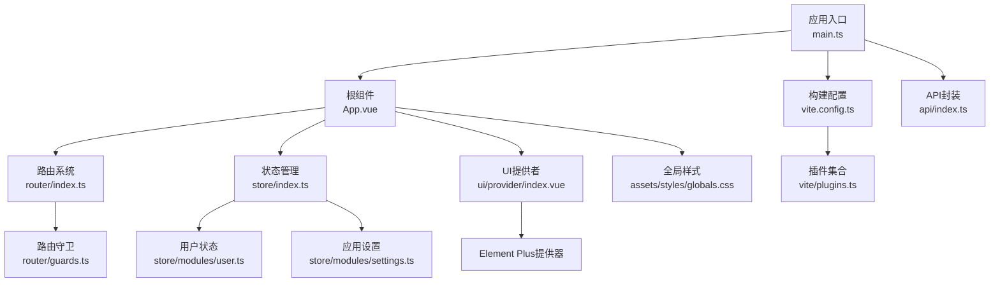
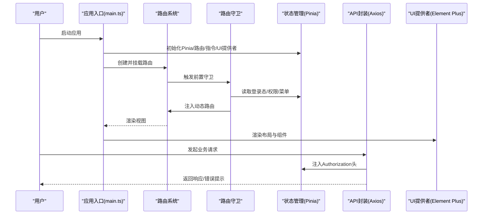
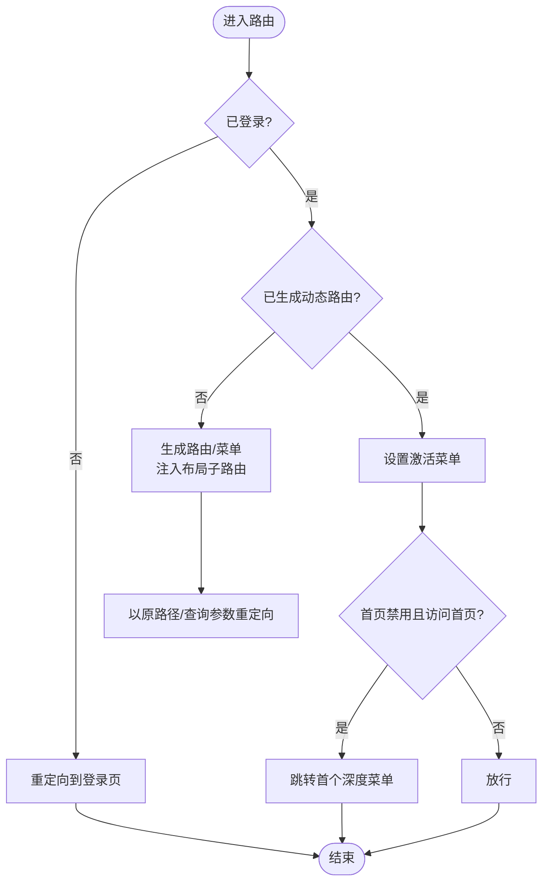
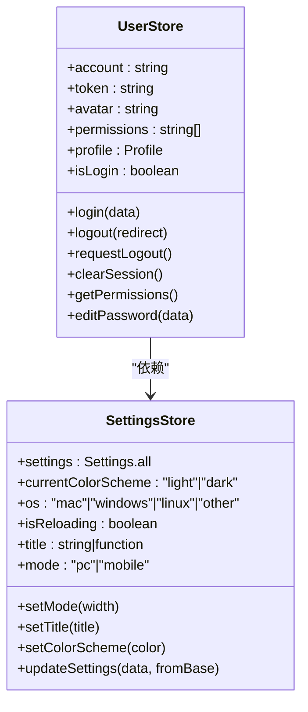
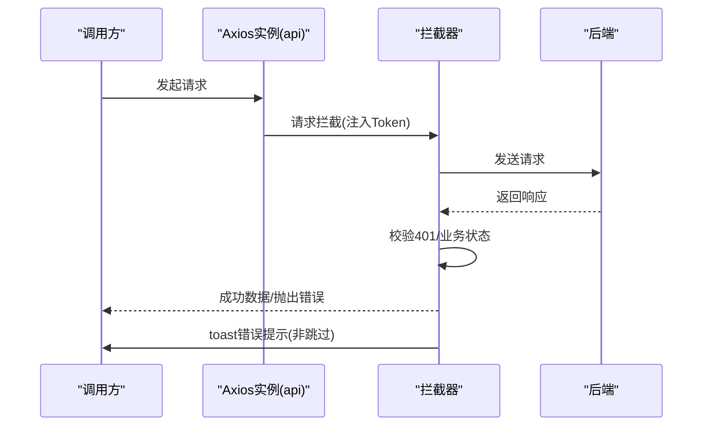
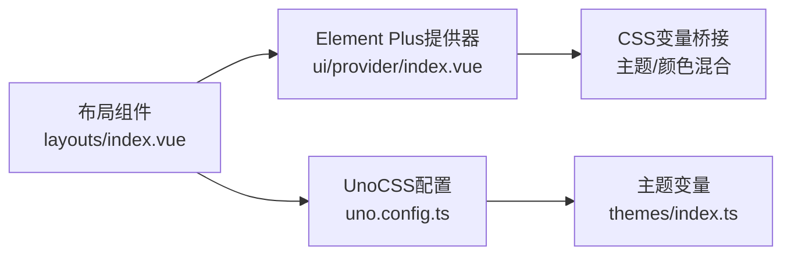
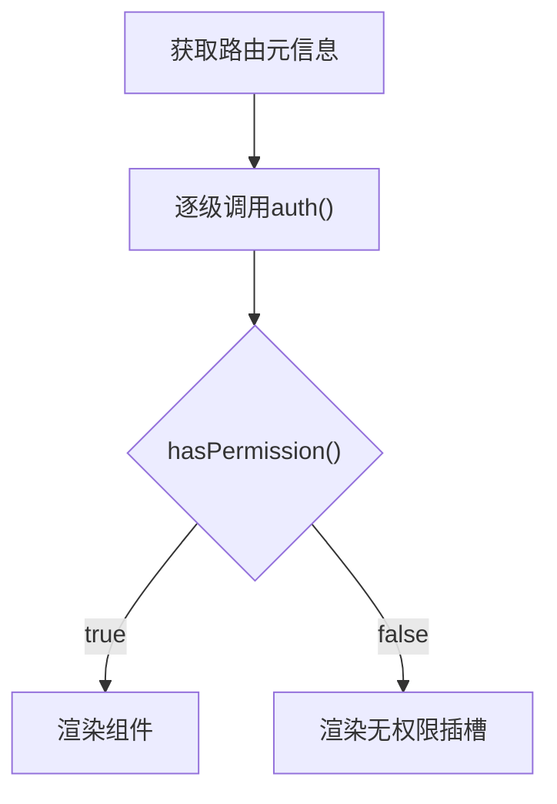
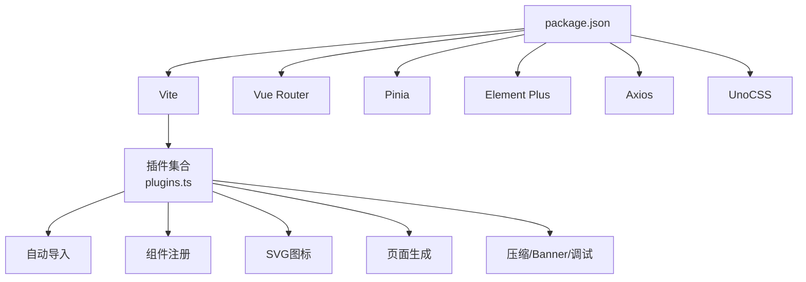

# 前端架构

**本文引用的文件**
- [package.json](file://frontend-fantastic-admin/package.json)
- [vite.config.ts](file://frontend-fantastic-admin/vite.config.ts)
- [plugins.ts](file://frontend-fantastic-admin/vite/plugins.ts)
- [main.ts](file://frontend-fantastic-admin/src/main.ts)
- [App.vue](file://frontend-fantastic-admin/src/App.vue)
- [layouts/index.vue](file://frontend-fantastic-admin/src/layouts/index.vue)
- [router/index.ts](file://frontend-fantastic-admin/src/router/index.ts)
- [router/guards.ts](file://frontend-fantastic-admin/src/router/guards.ts)
- [store/index.ts](file://frontend-fantastic-admin/src/store/index.ts)
- [store/modules/settings.ts](file://frontend-fantastic-admin/src/store/modules/settings.ts)
- [store/modules/user.ts](file://frontend-fantastic-admin/src/store/modules/user.ts)
- [api/index.ts](file://frontend-fantastic-admin/src/api/index.ts)
- [utils/composables/useAuth.ts](file://frontend-fantastic-admin/src/utils/composables/useAuth.ts)
- [ui/provider/index.vue](file://frontend-fantastic-admin/src/ui/provider/index.vue)
- [ui/components/FaAuth/index.vue](file://frontend-fantastic-admin/src/ui/components/FaAuth/index.vue)
- [assets/styles/globals.css](file://frontend-fantastic-admin/src/assets/styles/globals.css)
- [uno.config.ts](file://frontend-fantastic-admin/uno.config.ts)

## 目录
1. [简介](#简介)
2. [项目结构](#项目结构)
3. [核心组件](#核心组件)
4. [架构总览](#架构总览)
5. [详细组件分析](#详细组件分析)
6. [依赖关系分析](#依赖关系分析)
7. [性能考虑](#性能考虑)
8. [故障排查指南](#故障排查指南)
9. [结论](#结论)
10. [附录](#附录)

## 简介
本文件面向MRR项目的前端架构，围绕Vue 3 + Vite + Element Plus技术栈，系统梳理模块化结构、路由与守卫、状态管理（Pinia）、组件设计模式与UI库使用、构建与开发配置、前后端交互与认证、错误处理策略、性能优化与缓存策略，以及组件开发规范与样式主题定制指南。目标是帮助开发者快速理解并高效扩展前端能力。

## 项目结构
前端工程位于frontend-fantastic-admin目录，采用“功能域+分层”的组织方式：
- 应用入口与全局配置：main.ts、App.vue、vite.config.ts、uno.config.ts
- 路由与守卫：router/index.ts、router/guards.ts
- 状态管理：store/index.ts、store/modules/*
- API封装与模块：api/index.ts、api/modules/*
- UI与布局：ui/provider、layouts、ui/components
- 组件与工具：components、utils/composables、assets/styles
- 构建插件：vite/plugins.ts
- 主题与UnoCSS：uno.config.ts、themes/index.ts

**图表来源**
- [main.ts:1-33](file://frontend-fantastic-admin/src/main.ts#L1-L33)
- [App.vue:1-55](file://frontend-fantastic-admin/src/App.vue#L1-L55)
- [router/index.ts:1-24](file://frontend-fantastic-admin/src/router/index.ts#L1-L24)
- [store/index.ts:1-4](file://frontend-fantastic-admin/src/store/index.ts#L1-L4)
- [ui/provider/index.vue:1-37](file://frontend-fantastic-admin/src/ui/provider/index.vue#L1-L37)
- [assets/styles/globals.css:1-87](file://frontend-fantastic-admin/src/assets/styles/globals.css#L1-L87)
- [vite.config.ts:1-64](file://frontend-fantastic-admin/vite.config.ts#L1-L64)
- [plugins.ts:1-197](file://frontend-fantastic-admin/vite/plugins.ts#L1-L197)
- [api/index.ts:1-118](file://frontend-fantastic-admin/src/api/index.ts#L1-L118)

**章节来源**
- [main.ts:1-33](file://frontend-fantastic-admin/src/main.ts#L1-L33)
- [vite.config.ts:1-64](file://frontend-fantastic-admin/vite.config.ts#L1-L64)
- [uno.config.ts:1-140](file://frontend-fantastic-admin/uno.config.ts#L1-L140)

## 核心组件
- 应用入口与挂载：在main.ts中完成Pinia、Router、UI Provider、自定义指令、图标与UnoCSS的初始化，并挂载应用。
- 根组件与鉴权：App.vue负责动态标题、设备模式检测、权限校验与全局提示组件渲染。
- 路由系统：基于vue-router，支持多种路由生成策略（前端/后端/文件系统），并统一注入守卫。
- 状态管理：Pinia Store集中管理用户会话、菜单、标签页、应用设置等。
- API封装：基于Axios，统一拦截器、重试、错误提示与鉴权头注入。
- UI提供者：Element Plus ConfigProvider与主题变量桥接，支持明暗主题与颜色混合。
- 布局系统：多侧栏、顶部工具栏、标签栏、主内容区与版权信息组合，支持移动端适配。

**章节来源**
- [main.ts:1-33](file://frontend-fantastic-admin/src/main.ts#L1-L33)
- [App.vue:1-55](file://frontend-fantastic-admin/src/App.vue#L1-L55)
- [router/index.ts:1-24](file://frontend-fantastic-admin/src/router/index.ts#L1-L24)
- [store/index.ts:1-4](file://frontend-fantastic-admin/src/store/index.ts#L1-L4)
- [api/index.ts:1-118](file://frontend-fantastic-admin/src/api/index.ts#L1-L118)
- [ui/provider/index.vue:1-37](file://frontend-fantastic-admin/src/ui/provider/index.vue#L1-L37)
- [layouts/index.vue:1-255](file://frontend-fantastic-admin/src/layouts/index.vue#L1-L255)

## 架构总览
整体采用“入口初始化 → 路由守卫 → 状态管理 → UI提供 → 视图渲染”的控制流；API层通过拦截器统一处理鉴权、错误与业务状态码；构建阶段通过Vite插件链实现自动导入、组件注册、SVG图标、页面生成、压缩与Banner等。

**图表来源**
- [main.ts:1-33](file://frontend-fantastic-admin/src/main.ts#L1-L33)
- [router/index.ts:1-24](file://frontend-fantastic-admin/src/router/index.ts#L1-L24)
- [router/guards.ts:1-214](file://frontend-fantastic-admin/src/router/guards.ts#L1-L214)
- [store/modules/user.ts:1-129](file://frontend-fantastic-admin/src/store/modules/user.ts#L1-L129)
- [api/index.ts:1-118](file://frontend-fantastic-admin/src/api/index.ts#L1-L118)
- [ui/provider/index.vue:1-37](file://frontend-fantastic-admin/src/ui/provider/index.vue#L1-L37)

## 详细组件分析

### 路由与守卫
- 路由创建：支持基于文件系统的路由生成，或前端/后端生成策略；挂载后触发加载动画淡出。
- 守卫体系：
  - 权限与菜单生成：登录后按配置生成动态路由与菜单，处理单页模式下的激活项。
  - 自动重定向：父级无重定向时自动选择首个可访问子路由。
  - 进度条：可配置启用NProgress。
  - 标题更新：根据路由元信息动态设置页面标题。
  - KeepAlive缓存：根据to.meta.cache策略增删缓存项，支持字符串/数组/布尔值与noCache规则。
  - 其他：滚动至顶部等。

**图表来源**
- [router/guards.ts:1-214](file://frontend-fantastic-admin/src/router/guards.ts#L1-L214)
- [router/index.ts:1-24](file://frontend-fantastic-admin/src/router/index.ts#L1-L24)

**章节来源**
- [router/index.ts:1-24](file://frontend-fantastic-admin/src/router/index.ts#L1-L24)
- [router/guards.ts:1-214](file://frontend-fantastic-admin/src/router/guards.ts#L1-L214)

### 状态管理（Pinia）
- 用户模块：持久化token、头像、权限与用户资料；提供登录、登出、权限拉取、密码修改等方法。
- 设置模块：主题色、圆角半径、滤镜模式、菜单模式、移动端适配、标题与刷新标记等；监听变更同步到DOM属性与CSS变量。
- Store初始化：在main.ts中创建并挂载Pinia实例。

**图表来源**
- [store/modules/user.ts:1-129](file://frontend-fantastic-admin/src/store/modules/user.ts#L1-L129)
- [store/modules/settings.ts:1-181](file://frontend-fantastic-admin/src/store/modules/settings.ts#L1-L181)
- [store/index.ts:1-4](file://frontend-fantastic-admin/src/store/index.ts#L1-L4)

**章节来源**
- [store/modules/user.ts:1-129](file://frontend-fantastic-admin/src/store/modules/user.ts#L1-L129)
- [store/modules/settings.ts:1-181](file://frontend-fantastic-admin/src/store/modules/settings.ts#L1-L181)
- [store/index.ts:1-4](file://frontend-fantastic-admin/src/store/index.ts#L1-L4)

### API封装与认证
- 基础配置：开发环境走本地代理前缀，生产环境走环境变量；统一超时与响应类型。
- 请求拦截：自动注入Bearer Token（若存在）。
- 响应拦截：统一处理401登出、业务状态码（status/code）与通用错误消息；支持可选重试。
- 错误处理：统一toast提示，区分网络错误、超时与HTTP状态码异常。
- 模块化：按领域拆分api/modules/*，统一导出。

**图表来源**
- [api/index.ts:1-118](file://frontend-fantastic-admin/src/api/index.ts#L1-L118)
- [store/modules/user.ts:1-129](file://frontend-fantastic-admin/src/store/modules/user.ts#L1-L129)

**章节来源**
- [api/index.ts:1-118](file://frontend-fantastic-admin/src/api/index.ts#L1-L118)

### UI提供者与主题
- Element Plus提供器：设置语言与按钮空格行为；通过CSS变量桥接明/暗主题与颜色混合。
- UnoCSS：Wind3、Icons、Typography、动画预设与shadcn风格预设；主题变量从themes/index.ts注入。
- 布局系统：多侧栏、顶部工具栏、标签栏、版权信息与移动端适配；支持自由位置插槽。

**图表来源**
- [ui/provider/index.vue:1-37](file://frontend-fantastic-admin/src/ui/provider/index.vue#L1-L37)
- [uno.config.ts:1-140](file://frontend-fantastic-admin/uno.config.ts#L1-L140)
- [layouts/index.vue:1-255](file://frontend-fantastic-admin/src/layouts/index.vue#L1-L255)

**章节来源**
- [ui/provider/index.vue:1-37](file://frontend-fantastic-admin/src/ui/provider/index.vue#L1-L37)
- [uno.config.ts:1-140](file://frontend-fantastic-admin/uno.config.ts#L1-L140)
- [layouts/index.vue:1-255](file://frontend-fantastic-admin/src/layouts/index.vue#L1-L255)

### 权限组件与鉴权逻辑
- 权限组合式函数：支持单个/多个权限校验与“全部”校验。
- 权限组件：FaAuth根据权限决定渲染默认插槽或无权限插槽。
- 根组件校验：App.vue对路由元信息逐级校验，未授权显示不可访问组件。

**图表来源**
- [utils/composables/useAuth.ts:1-33](file://frontend-fantastic-admin/src/utils/composables/useAuth.ts#L1-L33)
- [ui/components/FaAuth/index.vue:1-24](file://frontend-fantastic-admin/src/ui/components/FaAuth/index.vue#L1-L24)
- [App.vue:12-16](file://frontend-fantastic-admin/src/App.vue#L12-L16)

**章节来源**
- [utils/composables/useAuth.ts:1-33](file://frontend-fantastic-admin/src/utils/composables/useAuth.ts#L1-L33)
- [ui/components/FaAuth/index.vue:1-24](file://frontend-fantastic-admin/src/ui/components/FaAuth/index.vue#L1-L24)
- [App.vue:12-16](file://frontend-fantastic-admin/src/App.vue#L12-L16)

## 依赖关系分析
- 技术栈依赖：Vue 3、Vue Router、Pinia、Element Plus、Axios、UnoCSS、Vite插件生态。
- 构建插件：自动导入、组件自动注册、SVG图标、页面生成、压缩、Banner、调试工具等。
- 运行时依赖：NProgress、GSAP、日志与调试工具、图标库等。

**图表来源**
- [package.json:1-131](file://frontend-fantastic-admin/package.json#L1-L131)
- [plugins.ts:1-197](file://frontend-fantastic-admin/vite/plugins.ts#L1-L197)

**章节来源**
- [package.json:1-131](file://frontend-fantastic-admin/package.json#L1-L131)
- [plugins.ts:1-197](file://frontend-fantastic-admin/vite/plugins.ts#L1-L197)

## 性能考虑
- 代码分割与懒加载：Vite Pages与KeepAlive结合，仅缓存命中组件；路由守卫中按需生成动态路由，避免一次性加载过多模块。
- 缓存策略：基于to.meta.cache策略精确控制缓存增删；支持noCache与刷新场景清理。
- 构建优化：开启压缩算法（gzip/brotli），产物归档与Banner；按需启用DevTools与调试工具，减少生产包体积。
- 样式与主题：UnoCSS按需生成，主题变量集中管理，避免重复计算与闪烁。
- 网络层：请求拦截器统一注入Token，响应拦截器统一处理401与业务状态，减少重复逻辑。

[本节为通用指导，无需具体文件引用]

## 故障排查指南
- 登录态异常：检查用户Store中的token与localStorage同步；确认守卫中getPermissions流程与后端返回字段一致性。
- 路由无法访问：确认路由元信息中的auth字段与用户权限匹配；检查FaAuth组件使用与App.vue逐级校验。
- API报错：查看拦截器错误分支与toast提示；关注401自动登出与重试策略。
- 主题/样式异常：检查UnoCSS主题变量注入与Element Plus颜色桥接；确认CSS变量覆盖顺序。
- 构建问题：核对Vite插件启用条件与环境变量；确认代理target与rewrite规则。

**章节来源**
- [store/modules/user.ts:1-129](file://frontend-fantastic-admin/src/store/modules/user.ts#L1-L129)
- [router/guards.ts:1-214](file://frontend-fantastic-admin/src/router/guards.ts#L1-L214)
- [api/index.ts:1-118](file://frontend-fantastic-admin/src/api/index.ts#L1-L118)
- [ui/provider/index.vue:1-37](file://frontend-fantastic-admin/src/ui/provider/index.vue#L1-L37)
- [uno.config.ts:1-140](file://frontend-fantastic-admin/uno.config.ts#L1-L140)

## 结论
该前端架构以Vue 3为核心，结合Vite与Element Plus，形成高内聚、低耦合的模块化体系。通过Pinia集中管理状态、路由守卫统一鉴权与缓存、API拦截器抽象网络层、UnoCSS与主题变量实现样式一致性与可维护性，具备良好的扩展性与可运维性。建议在后续迭代中持续完善组件文档、测试覆盖率与性能监控。

[本节为总结，无需具体文件引用]

## 附录

### 构建与开发配置要点
- 开发服务器：host绑定、端口、自动打开、代理映射到环境变量；支持按需开启代理。
- 构建输出：按模式输出不同目录，可选SourceMap。
- 插件链：自动导入、组件注册、SVG图标、页面生成、压缩、Banner、调试工具、假服务等。
- 环境变量：通过envParse生成类型声明，便于IDE提示与编译期校验。

**章节来源**
- [vite.config.ts:1-64](file://frontend-fantastic-admin/vite.config.ts#L1-L64)
- [plugins.ts:1-197](file://frontend-fantastic-admin/vite/plugins.ts#L1-L197)

### 组件开发规范与样式管理
- 组件命名：遵循语义化命名，使用PascalCase；公共组件置于ui/components或components目录。
- 插槽与权限：通过FaAuth组件实现细粒度权限控制；支持默认与无权限插槽。
- 样式：优先使用UnoCSS原子类与主题变量；全局样式集中于assets/styles/globals.css。
- 主题定制：通过themes/index.ts与uno.config.ts集中管理明/暗主题变量，Element Plus颜色通过CSS变量桥接。

**章节来源**
- [ui/components/FaAuth/index.vue:1-24](file://frontend-fantastic-admin/src/ui/components/FaAuth/index.vue#L1-L24)
- [assets/styles/globals.css:1-87](file://frontend-fantastic-admin/src/assets/styles/globals.css#L1-L87)
- [uno.config.ts:1-140](file://frontend-fantastic-admin/uno.config.ts#L1-L140)
- [ui/provider/index.vue:1-37](file://frontend-fantastic-admin/src/ui/provider/index.vue#L1-L37)