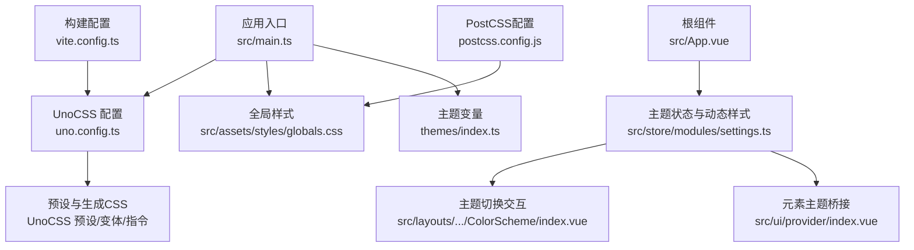
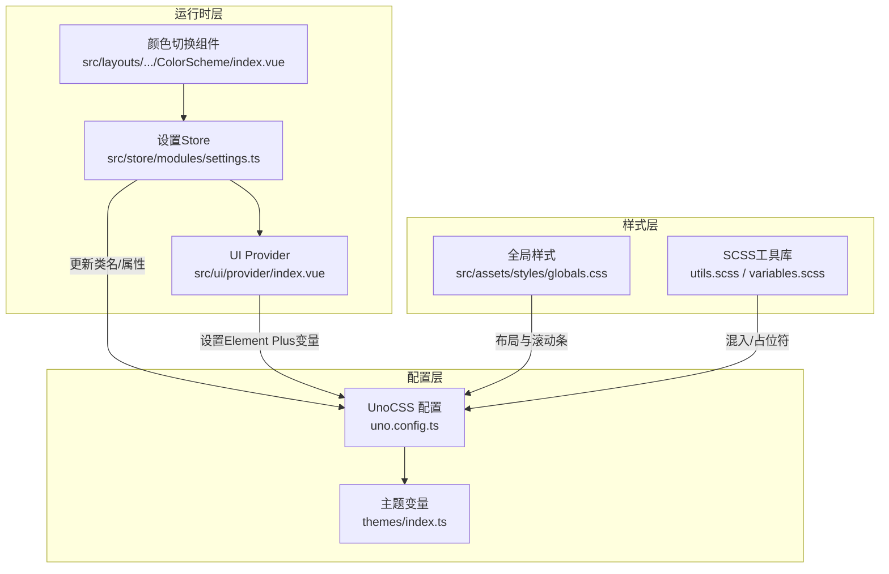
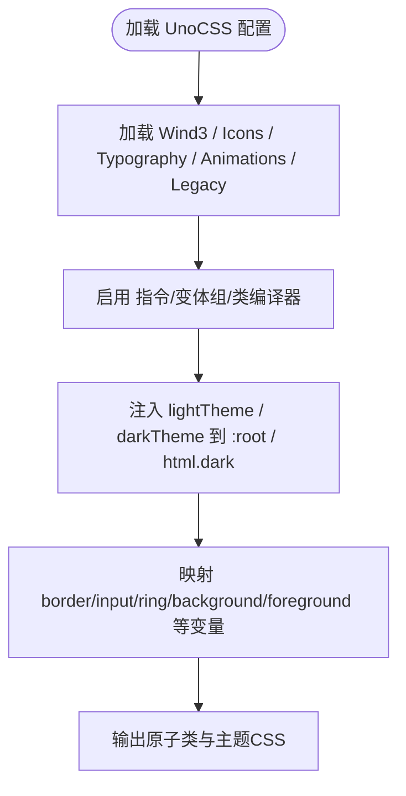
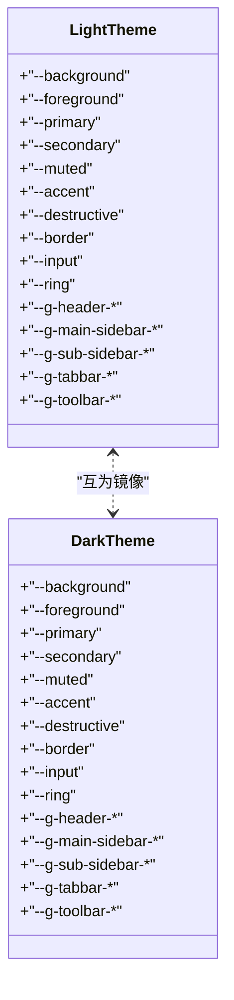
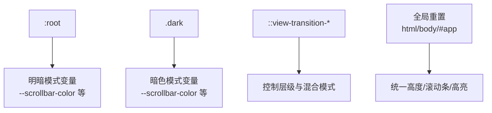
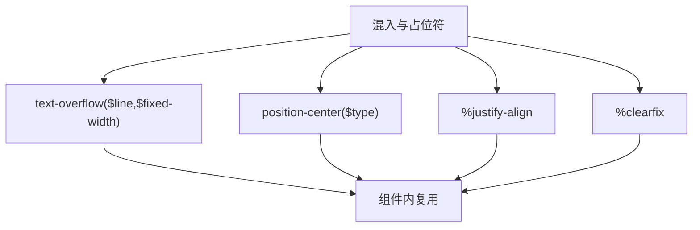
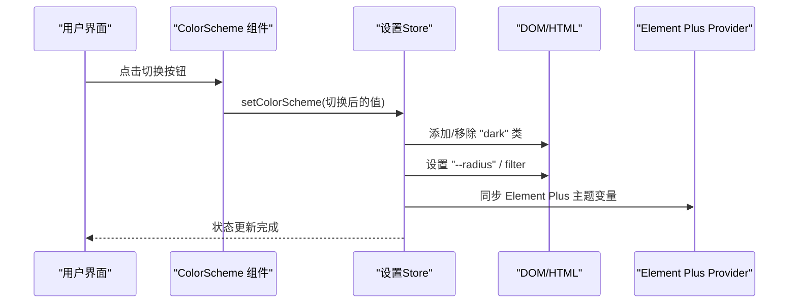
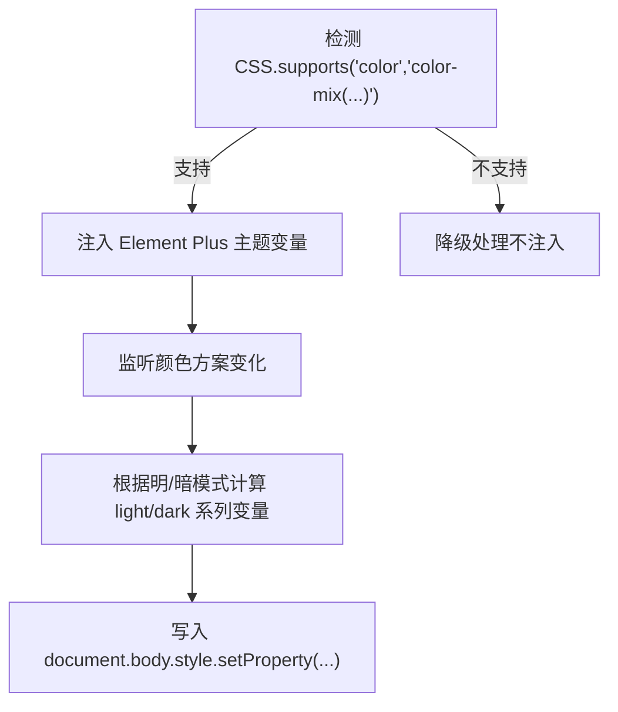
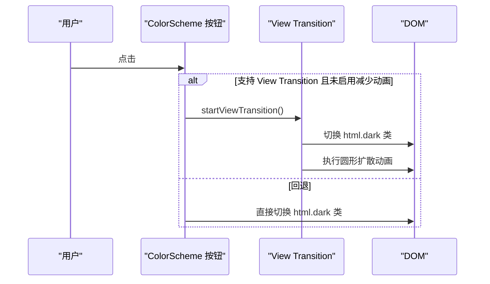
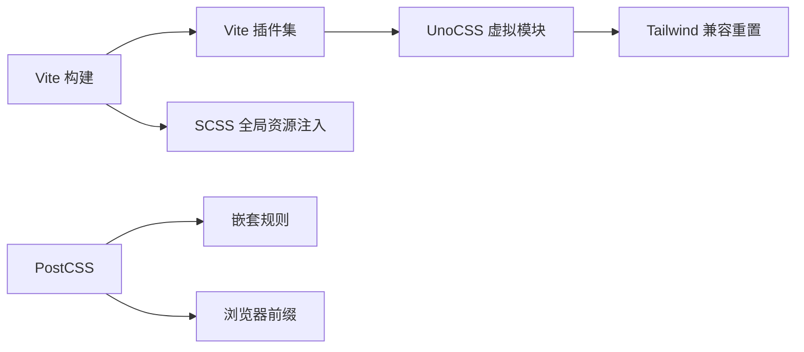

# 样式与主题

**本文引用的文件**
- [uno.config.ts](file://frontend-fantastic-admin/uno.config.ts)
- [themes/index.ts](file://frontend-fantastic-admin/themes/index.ts)
- [globals.css](file://frontend-fantastic-admin/src/assets/styles/globals.css)
- [utils.scss](file://frontend-fantastic-admin/src/assets/styles/resources/utils.scss)
- [variables.scss](file://frontend-fantastic-admin/src/assets/styles/resources/variables.scss)
- [main.ts](file://frontend-fantastic-admin/src/main.ts)
- [vite.config.ts](file://frontend-fantastic-admin/vite.config.ts)
- [postcss.config.js](file://frontend-fantastic-admin/postcss.config.js)
- [package.json](file://frontend-fantastic-admin/package.json)
- [index.vue](file://frontend-fantastic-admin/src/ui/provider/index.vue)
- [index.vue](file://frontend-fantastic-admin/src/layouts/components/Topbar/Toolbar/ColorScheme/index.vue)
- [settings.ts](file://frontend-fantastic-admin/src/store/modules/settings.ts)
- [App.vue](file://frontend-fantastic-admin/src/App.vue)

## 目录
1. [简介](#简介)
2. [项目结构](#项目结构)
3. [核心组件](#核心组件)
4. [架构总览](#架构总览)
5. [详细组件分析](#详细组件分析)
6. [依赖关系分析](#依赖关系分析)
7. [性能考量](#性能考量)
8. [故障排查指南](#故障排查指南)
9. [结论](#结论)
10. [附录](#附录)

## 简介
本文件面向MRR前端样式与主题系统，系统性阐述CSS架构设计、UnoCSS原子化样式与主题系统实现，覆盖全局样式组织、组件样式隔离、响应式设计策略；记录主题变量系统、颜色方案配置与暗色模式支持；解释样式模块化、CSS-in-JS使用与动态样式切换；并提供性能优化、浏览器兼容性与移动端适配建议，以及样式开发规范、命名约定与主题定制指南。

## 项目结构
前端样式与主题相关的关键目录与文件：
- UnoCSS配置：uno.config.ts
- 主题变量：themes/index.ts
- 全局样式：src/assets/styles/globals.css
- SCSS工具库：src/assets/styles/resources/utils.scss、variables.scss
- 应用入口：src/main.ts
- 构建与预处理：vite.config.ts、postcss.config.js、package.json
- 主题注入与元素主题桥接：src/ui/provider/index.vue
- 主题切换交互：src/layouts/components/Topbar/Toolbar/ColorScheme/index.vue
- 主题状态与动态样式：src/store/modules/settings.ts
- 应用根组件：src/App.vue

图表来源
- [main.ts:1-33](file://frontend-fantastic-admin/src/main.ts#L1-L33)
- [uno.config.ts:1-140](file://frontend-fantastic-admin/uno.config.ts#L1-L140)
- [globals.css:1-87](file://frontend-fantastic-admin/src/assets/styles/globals.css#L1-L87)
- [themes/index.ts:1-116](file://frontend-fantastic-admin/themes/index.ts#L1-L116)
- [settings.ts:1-181](file://frontend-fantastic-admin/src/store/modules/settings.ts#L1-L181)
- [index.vue:1-59](file://frontend-fantastic-admin/src/layouts/components/Topbar/Toolbar/ColorScheme/index.vue#L1-L59)
- [index.vue:1-37](file://frontend-fantastic-admin/src/ui/provider/index.vue#L1-L37)
- [vite.config.ts:1-64](file://frontend-fantastic-admin/vite.config.ts#L1-L64)
- [postcss.config.js:1-7](file://frontend-fantastic-admin/postcss.config.js#L1-L7)

章节来源
- [main.ts:1-33](file://frontend-fantastic-admin/src/main.ts#L1-L33)
- [vite.config.ts:1-64](file://frontend-fantastic-admin/vite.config.ts#L1-L64)
- [postcss.config.js:1-7](file://frontend-fantastic-admin/postcss.config.js#L1-L7)
- [package.json:1-131](file://frontend-fantastic-admin/package.json#L1-L131)

## 核心组件
- UnoCSS原子化样式引擎：通过预设、指令、变体组与编译类等能力，提供高效、可维护的样式体系，并内置视图过渡与主题桥接。
- 主题变量系统：以CSS变量为核心，分别定义浅色与深色主题的完整映射，统一管理背景、前景、容器、强调色等。
- 全局样式与布局变量：集中定义头部、侧边栏、标签栏、工具栏等尺寸与滚动条样式，支持明暗模式切换。
- SCSS工具库：提供文本省略、定位居中、两端对齐、清除浮动等混入与占位符，提升样式复用性。
- 主题状态与动态样式：通过Pinia Store管理颜色方案、圆角半径、滤镜模式、菜单模式与移动端自适应。
- 元素主题桥接：将UnoCSS主题变量映射到Element Plus等UI库的主题变量，实现统一风格。
- 视图过渡与主题切换：基于View Transition API实现平滑的主题切换动画。

章节来源
- [uno.config.ts:1-140](file://frontend-fantastic-admin/uno.config.ts#L1-L140)
- [themes/index.ts:1-116](file://frontend-fantastic-admin/themes/index.ts#L1-L116)
- [globals.css:1-87](file://frontend-fantastic-admin/src/assets/styles/globals.css#L1-L87)
- [utils.scss:1-54](file://frontend-fantastic-admin/src/assets/styles/resources/utils.scss#L1-L54)
- [settings.ts:1-181](file://frontend-fantastic-admin/src/store/modules/settings.ts#L1-L181)
- [index.vue:1-37](file://frontend-fantastic-admin/src/ui/provider/index.vue#L1-L37)
- [index.vue:1-59](file://frontend-fantastic-admin/src/layouts/components/Topbar/Toolbar/ColorScheme/index.vue#L1-L59)

## 架构总览
整体架构围绕“配置驱动 + 状态驱动 + 主题桥接”的思路展开：
- 配置驱动：UnoCSS配置集中声明内容扫描、预设、指令、变体与主题桥接，确保原子类与主题变量在构建期生成。
- 状态驱动：Pinia Store维护颜色方案、圆角、滤镜、菜单模式与移动端模式，运行时动态更新DOM属性与类名。
- 主题桥接：UnoCSS主题变量与Element Plus变量双向映射，保证组件库与自定义样式的视觉一致性。

图表来源
- [uno.config.ts:1-140](file://frontend-fantastic-admin/uno.config.ts#L1-L140)
- [themes/index.ts:1-116](file://frontend-fantastic-admin/themes/index.ts#L1-L116)
- [settings.ts:1-181](file://frontend-fantastic-admin/src/store/modules/settings.ts#L1-L181)
- [index.vue:1-37](file://frontend-fantastic-admin/src/ui/provider/index.vue#L1-L37)
- [index.vue:1-59](file://frontend-fantastic-admin/src/layouts/components/Topbar/Toolbar/ColorScheme/index.vue#L1-L59)
- [globals.css:1-87](file://frontend-fantastic-admin/src/assets/styles/globals.css#L1-L87)
- [utils.scss:1-54](file://frontend-fantastic-admin/src/assets/styles/resources/utils.scss#L1-L54)

## 详细组件分析

### UnoCSS配置与主题桥接
- 内容扫描与预设：配置包含多种预设（如Wind3、Typography、Icons、Animations、Legacy兼容），并启用指令、变体组与类编译器，确保原子类按需生成。
- 主题桥接：通过自定义预设将lightTheme与darkTheme注入到`:root`与`html.dark`，并为border、input、ring、background、foreground等提供统一映射。
- 快捷方式：提供flex布局快捷正则，自动归约为标准flex类，减少手写类名。
- 配置依赖：监听themes/index.ts变更以触发重新生成。

图表来源
- [uno.config.ts:17-139](file://frontend-fantastic-admin/uno.config.ts#L17-L139)
- [themes/index.ts:1-116](file://frontend-fantastic-admin/themes/index.ts#L1-L116)

章节来源
- [uno.config.ts:1-140](file://frontend-fantastic-admin/uno.config.ts#L1-L140)
- [themes/index.ts:1-116](file://frontend-fantastic-admin/themes/index.ts#L1-L116)

### 主题变量系统与颜色方案
- 浅色与深色主题：分别定义background、foreground、primary、secondary、muted、accent、destructive、border、input、ring等变量，并扩展为头部、侧边栏、标签栏、工具栏等区域的专用变量。
- 变量命名：采用HSL变量与CSS变量组合，便于在不同模式间切换与计算。
- 使用方式：UnoCSS预设直接消费这些变量，同时Element Plus桥接也读取这些变量。

图表来源
- [themes/index.ts:1-116](file://frontend-fantastic-admin/themes/index.ts#L1-L116)

章节来源
- [themes/index.ts:1-116](file://frontend-fantastic-admin/themes/index.ts#L1-L116)

### 全局样式与布局变量
- 布局变量：集中定义头部高度、主/次侧边栏宽度、Logo区高度、标签栏与工具栏高度等，便于组件复用。
- 明暗模式：通过`:root`与`.dark`切换滚动条颜色与颜色方案。
- 视图过渡：针对View Transition伪元素进行层级与混合模式控制，避免切换闪烁。
- 全局重置：统一body与#app高度，textarea字体继承，提升一致性。

图表来源
- [globals.css:1-87](file://frontend-fantastic-admin/src/assets/styles/globals.css#L1-L87)

章节来源
- [globals.css:1-87](file://frontend-fantastic-admin/src/assets/styles/globals.css#L1-L87)

### SCSS工具库与样式模块化
- 文本省略：支持单行与多行省略，兼容WebKit特性。
- 定位居中：支持x/y/xy三种居中方式，简化定位逻辑。
- 文本两端对齐：提供占位符样式，保证可复用。
- 清浮动：提供clearfix占位符，避免重复代码。

图表来源
- [utils.scss:1-54](file://frontend-fantastic-admin/src/assets/styles/resources/utils.scss#L1-L54)

章节来源
- [utils.scss:1-54](file://frontend-fantastic-admin/src/assets/styles/resources/utils.scss#L1-L54)
- [variables.scss:1-2](file://frontend-fantastic-admin/src/assets/styles/resources/variables.scss#L1-L2)

### 主题状态与动态样式
- 颜色方案：支持light/dark/跟随系统，切换时移除/添加`html.dark`类，并禁用过渡以避免闪烁。
- 圆角半径：根据设置动态写入`--radius`，影响组件圆角。
- 特殊模式：支持护眼/色弱模式，通过filter叠加实现。
- 移动端适配：根据UA与窗口宽度自动切换pc/mobile模式，控制侧边栏折叠状态。
- OS检测：识别mac/windows/linux/other，用于UI微调。

图表来源
- [index.vue:1-59](file://frontend-fantastic-admin/src/layouts/components/Topbar/Toolbar/ColorScheme/index.vue#L1-L59)
- [settings.ts:1-181](file://frontend-fantastic-admin/src/store/modules/settings.ts#L1-L181)
- [index.vue:1-37](file://frontend-fantastic-admin/src/ui/provider/index.vue#L1-L37)

章节来源
- [settings.ts:1-181](file://frontend-fantastic-admin/src/store/modules/settings.ts#L1-L181)
- [index.vue:1-37](file://frontend-fantastic-admin/src/ui/provider/index.vue#L1-L37)
- [index.vue:1-59](file://frontend-fantastic-admin/src/layouts/components/Topbar/Toolbar/ColorScheme/index.vue#L1-L59)

### 元素主题桥接（CSS-in-JS）
- 支持检测：先检测浏览器是否支持`color-mix`，再决定是否注入动态变量。
- 注入策略：根据当前颜色方案，动态计算并设置Element Plus的`--el-color-primary-light-x`与`--el-color-primary-dark-x`系列变量，确保明暗模式下的渐变正确。
- 实时更新：监听颜色方案变化，即时重算并注入。

图表来源
- [index.vue:1-37](file://frontend-fantastic-admin/src/ui/provider/index.vue#L1-L37)

章节来源
- [index.vue:1-37](file://frontend-fantastic-admin/src/ui/provider/index.vue#L1-L37)

### 视图过渡与主题切换
- 降级策略：若浏览器不支持View Transition或用户偏好减少动画，则回退到直接切换。
- 过渡动画：计算点击中心点与视口半径，生成圆形扩散动画，配合伪元素控制新旧根节点的层级与混合。
- 时序控制：使用`nextTick`确保DOM更新后再启动动画，避免闪烁。

图表来源
- [index.vue:1-59](file://frontend-fantastic-admin/src/layouts/components/Topbar/Toolbar/ColorScheme/index.vue#L1-L59)

章节来源
- [index.vue:1-59](file://frontend-fantastic-admin/src/layouts/components/Topbar/Toolbar/ColorScheme/index.vue#L1-L59)

### 响应式设计与移动端适配
- 移动端检测：优先通过UA判断移动设备，其次根据窗口宽度阈值切换移动端模式。
- 侧边栏行为：移动端默认折叠次导航，PC模式下保留上次状态。
- OS标识：在body上设置`data-os`，便于针对不同系统做微调。

章节来源
- [settings.ts:110-152](file://frontend-fantastic-admin/src/store/modules/settings.ts#L110-L152)
- [App.vue:10-40](file://frontend-fantastic-admin/src/App.vue#L10-L40)

## 依赖关系分析
- 构建链路：Vite加载插件，引入UnoCSS虚拟模块与Tailwind兼容重置；SCSS资源通过additionalData全局注入。
- 预处理链路：PostCSS启用nested与autoprefixer，保证嵌套规则与浏览器前缀。
- 依赖清单：项目依赖包括Vue、Element Plus、UnoCSS及其生态、SCSS嵌入式编译器等。

图表来源
- [vite.config.ts:1-64](file://frontend-fantastic-admin/vite.config.ts#L1-L64)
- [postcss.config.js:1-7](file://frontend-fantastic-admin/postcss.config.js#L1-L7)
- [package.json:1-131](file://frontend-fantastic-admin/package.json#L1-L131)

章节来源
- [vite.config.ts:1-64](file://frontend-fantastic-admin/vite.config.ts#L1-L64)
- [postcss.config.js:1-7](file://frontend-fantastic-admin/postcss.config.js#L1-L7)
- [package.json:1-131](file://frontend-fantastic-admin/package.json#L1-L131)

## 性能考量
- 原子化优先：通过UnoCSS按需生成原子类，减少冗余CSS体积。
- 编译与变体：启用类编译器与变体组，避免运行时解析复杂选择器。
- 动态变量注入：仅在支持的浏览器中注入动态变量，避免无谓计算。
- 视图过渡降级：在不支持或减少动画场景下回退，避免额外动画开销。
- 构建优化：开启生产构建与可选SourceMap，结合压缩插件降低包体。

## 故障排查指南
- 主题切换无效果
  - 检查是否正确添加/移除`html.dark`类，确认颜色方案状态已更新。
  - 确认`uno.config.ts`中的主题桥接预设已生效。
- Element Plus颜色异常
  - 确认浏览器支持`color-mix`，否则将降级不注入动态变量。
  - 检查Provider组件是否在应用根部正确包裹。
- 视图过渡不生效
  - 检查浏览器是否支持View Transition，或用户是否启用了“减少动画”。
  - 确认伪元素选择器与动画参数正确。
- 移动端适配异常
  - 检查UA与窗口宽度判断逻辑，确认移动端阈值与侧边栏状态同步。

章节来源
- [settings.ts:13-49](file://frontend-fantastic-admin/src/store/modules/settings.ts#L13-L49)
- [index.vue:1-37](file://frontend-fantastic-admin/src/ui/provider/index.vue#L1-L37)
- [index.vue:1-59](file://frontend-fantastic-admin/src/layouts/components/Topbar/Toolbar/ColorScheme/index.vue#L1-L59)

## 结论
本样式与主题系统以UnoCSS为核心，结合CSS变量与Pinia状态管理，实现了高可维护性的原子化样式体系与灵活的主题切换机制。通过主题桥接与动态变量注入，确保UI库与自定义样式的视觉一致；借助视图过渡与响应式策略，兼顾体验与性能。建议在后续迭代中持续优化主题变量粒度与组件映射，完善移动端微调与无障碍支持。

## 附录

### 开发规范与命名约定
- CSS变量命名：采用`--g-[area]-[component]-[property]`的层次化命名，便于检索与作用域隔离。
- UnoCSS类名：优先使用原子类，必要时通过预设或指令扩展；避免深层嵌套与特异性过高。
- SCSS混入：保持单一职责，参数明确，避免副作用。
- 主题变量：统一在themes/index.ts中维护，避免散落定义。

### 主题定制指南
- 新增颜色变量：在themes/index.ts中为lightTheme与darkTheme补充对应变量，确保所有区域变量齐全。
- 扩展区域变量：在globals.css中新增布局变量，供组件引用。
- 修改圆角与滤镜：通过设置Store的app.radius与enableMournMode/enableColorAmblyopiaMode进行全局调整。
- 组件映射：如需组件库变量联动，可在UI Provider中追加对应变量注入逻辑。