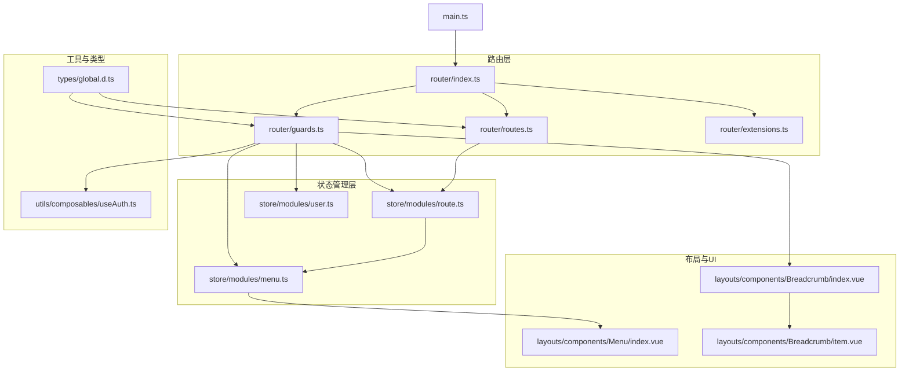
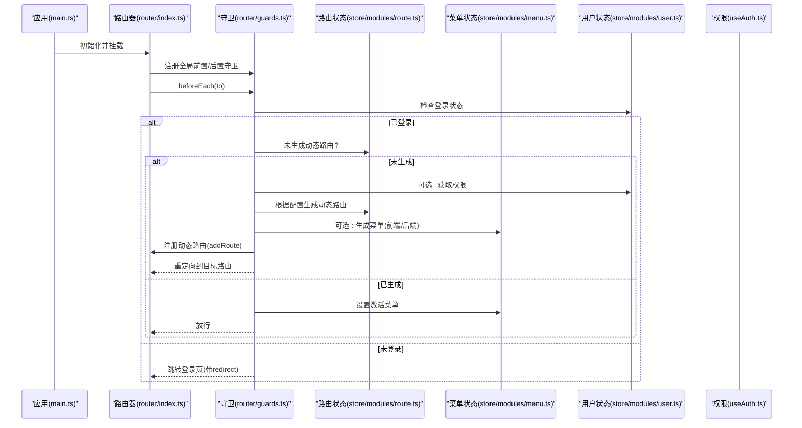
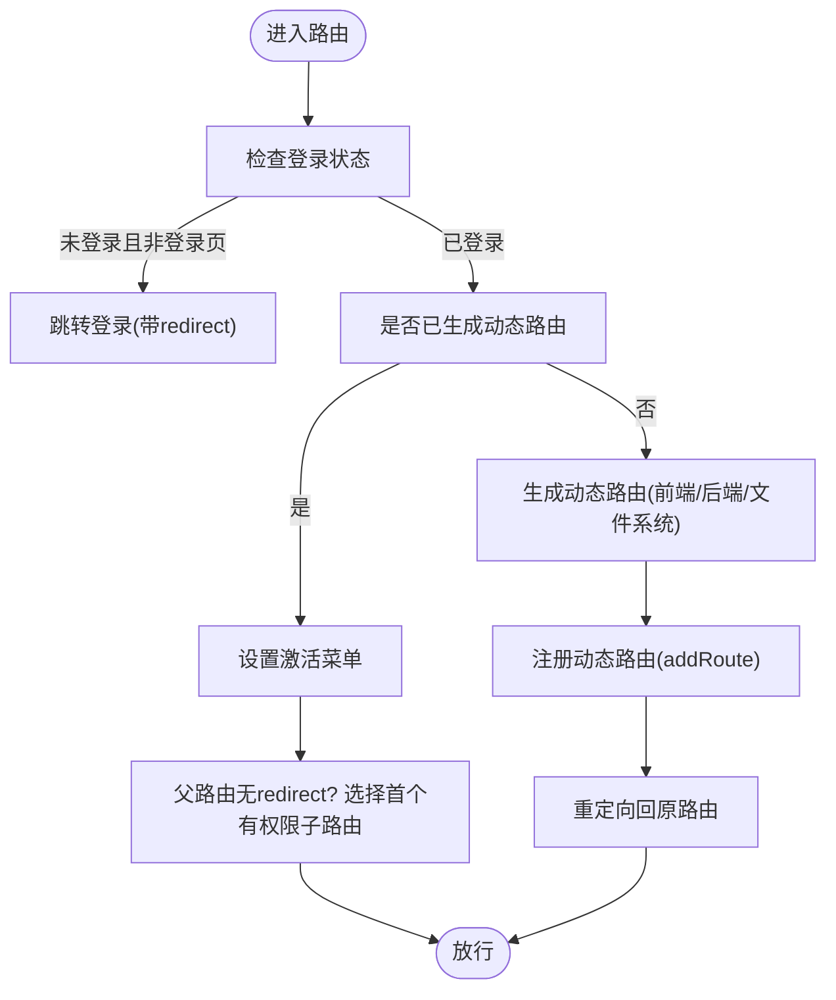
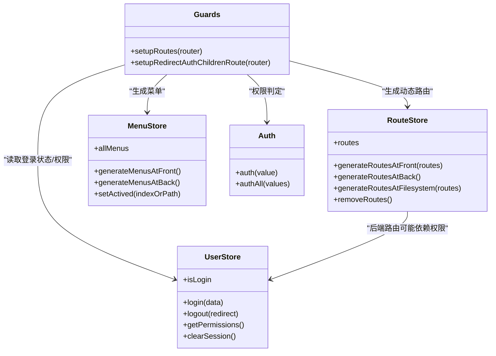
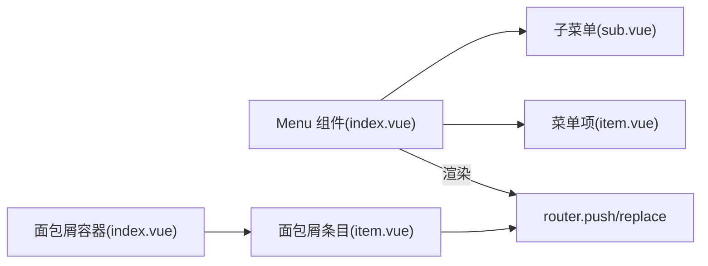
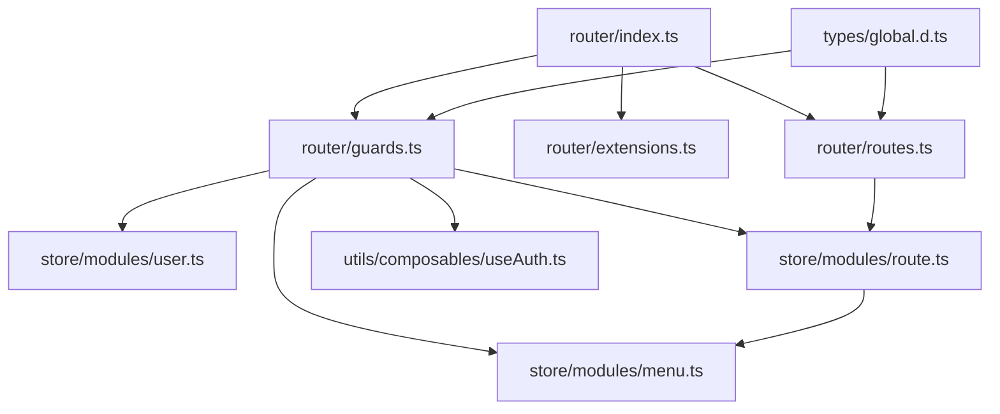

# 路由系统

**本文引用的文件**
- [router/index.ts](file://frontend-fantastic-admin/src/router/index.ts)
- [router/routes.ts](file://frontend-fantastic-admin/src/router/routes.ts)
- [router/guards.ts](file://frontend-fantastic-admin/src/router/guards.ts)
- [router/extensions.ts](file://frontend-fantastic-admin/src/router/extensions.ts)
- [store/modules/route.ts](file://frontend-fantastic-admin/src/store/modules/route.ts)
- [store/modules/menu.ts](file://frontend-fantastic-admin/src/store/modules/menu.ts)
- [store/modules/user.ts](file://frontend-fantastic-admin/src/store/modules/user.ts)
- [layouts/components/Menu/index.vue](file://frontend-fantastic-admin/src/layouts/components/Menu/index.vue)
- [layouts/components/Breadcrumb/index.vue](file://frontend-fantastic-admin/src/layouts/components/Breadcrumb/index.vue)
- [layouts/components/Breadcrumb/item.vue](file://frontend-fantastic-admin/src/layouts/components/Breadcrumb/item.vue)
- [utils/composables/useAuth.ts](file://frontend-fantastic-admin/src/utils/composables/useAuth.ts)
- [types/global.d.ts](file://frontend-fantastic-admin/src/types/global.d.ts)
- [main.ts](file://frontend-fantastic-admin/src/main.ts)

## 目录
1. [简介](#简介)
2. [项目结构](#项目结构)
3. [核心组件](#核心组件)
4. [架构总览](#架构总览)
5. [详细组件分析](#详细组件分析)
6. [依赖关系分析](#依赖关系分析)
7. [性能考量](#性能考量)
8. [故障排查指南](#故障排查指南)
9. [结论](#结论)
10. [附录](#附录)

## 简介
本文件面向MRR路由系统，围绕Vue Router配置结构、路由定义模式、导航守卫机制、路由元信息（meta）与权限控制、动态路由生成、菜单与面包屑联动、懒加载与性能优化等方面进行系统化技术文档整理。文档以“可读性优先”的原则，既覆盖实现细节，也提供可视化图表帮助理解。

## 项目结构
MRR前端采用模块化的路由组织方式，核心位于frontend-fantastic-admin/src/router目录，配合Pinia状态管理模块（route、menu、user等），以及布局与UI组件（Menu、Breadcrumb）完成菜单、权限、标题、进度条、页面缓存等能力。

**图表来源**
- [router/index.ts:1-24](file://frontend-fantastic-admin/src/router/index.ts#L1-L24)
- [router/routes.ts:1-191](file://frontend-fantastic-admin/src/router/routes.ts#L1-L191)
- [router/guards.ts:1-214](file://frontend-fantastic-admin/src/router/guards.ts#L1-L214)
- [router/extensions.ts:1-87](file://frontend-fantastic-admin/src/router/extensions.ts#L1-L87)
- [store/modules/route.ts:1-171](file://frontend-fantastic-admin/src/store/modules/route.ts#L1-L171)
- [store/modules/menu.ts:1-218](file://frontend-fantastic-admin/src/store/modules/menu.ts#L1-L218)
- [store/modules/user.ts:1-129](file://frontend-fantastic-admin/src/store/modules/user.ts#L1-L129)
- [layouts/components/Menu/index.vue:1-186](file://frontend-fantastic-admin/src/layouts/components/Menu/index.vue#L1-L186)
- [layouts/components/Breadcrumb/index.vue:1-22](file://frontend-fantastic-admin/src/layouts/components/Breadcrumb/index.vue#L1-L22)
- [layouts/components/Breadcrumb/item.vue:1-39](file://frontend-fantastic-admin/src/layouts/components/Breadcrumb/item.vue#L1-L39)
- [utils/composables/useAuth.ts:1-33](file://frontend-fantastic-admin/src/utils/composables/useAuth.ts#L1-L33)
- [types/global.d.ts:1-307](file://frontend-fantastic-admin/src/types/global.d.ts#L1-L307)
- [main.ts:1-33](file://frontend-fantastic-admin/src/main.ts#L1-L33)

**章节来源**
- [router/index.ts:1-24](file://frontend-fantastic-admin/src/router/index.ts#L1-L24)
- [main.ts:1-33](file://frontend-fantastic-admin/src/main.ts#L1-L33)

## 核心组件
- 路由入口与初始化：负责创建路由器、选择路由来源（前端/后端/文件系统）、挂载守卫与扩展。
- 路由定义：常量路由、系统路由、异步路由（含权限标记），以及基于文件系统的动态生成。
- 导航守卫：登录校验、权限生成、动态路由注入、自动重定向、进度条、标题设置、页面缓存策略。
- 菜单系统：从路由转换为菜单树，支持权限过滤、主导航定位、默认展开路径计算。
- 扩展能力：对router.push/go/replace/close的增强，支持标签页联动。
- 权限组合：统一的权限判定函数，支持单个/多个权限校验。
- 类型与元信息：全局RouteMeta扩展，定义title、icon、auth、menu、breadcrumb、cache等字段。

**章节来源**
- [router/routes.ts:1-191](file://frontend-fantastic-admin/src/router/routes.ts#L1-L191)
- [router/guards.ts:1-214](file://frontend-fantastic-admin/src/router/guards.ts#L1-L214)
- [store/modules/route.ts:1-171](file://frontend-fantastic-admin/src/store/modules/route.ts#L1-L171)
- [store/modules/menu.ts:1-218](file://frontend-fantastic-admin/src/store/modules/menu.ts#L1-L218)
- [router/extensions.ts:1-87](file://frontend-fantastic-admin/src/router/extensions.ts#L1-L87)
- [utils/composables/useAuth.ts:1-33](file://frontend-fantastic-admin/src/utils/composables/useAuth.ts#L1-L33)
- [types/global.d.ts:247-260](file://frontend-fantastic-admin/src/types/global.d.ts#L247-L260)

## 架构总览
下图展示了从应用启动到路由守卫执行、动态路由注入、菜单生成与页面渲染的关键交互。

**图表来源**
- [router/index.ts:16-17](file://frontend-fantastic-admin/src/router/index.ts#L16-L17)
- [router/guards.ts:6-101](file://frontend-fantastic-admin/src/router/guards.ts#L6-L101)
- [store/modules/route.ts:84-140](file://frontend-fantastic-admin/src/store/modules/route.ts#L84-L140)
- [store/modules/menu.ts:170-179](file://frontend-fantastic-admin/src/store/modules/menu.ts#L170-L179)
- [store/modules/user.ts:102-107](file://frontend-fantastic-admin/src/store/modules/user.ts#L102-L107)

## 详细组件分析

### 路由入口与初始化
- 历史模式：使用哈希历史。
- 路由来源选择：根据设置决定使用前端常量+系统路由、后端返回路由或文件系统自动生成路由。
- 守卫与扩展：初始化时挂载全局守卫与路由扩展。
- 启动完成：router.isReady后隐藏应用加载态。

**章节来源**
- [router/index.ts:9-24](file://frontend-fantastic-admin/src/router/index.ts#L9-L24)

### 路由定义与元信息
- 常量路由：登录页、通配页（404）。
- 系统路由：根布局与首页，首页meta包含动态标题与面包屑开关。
- 异步路由：按模块分组（系统管理、业务管理、运维中心），每个路由携带权限标识（auth）与图标、标题等。
- 文件系统路由：通过虚拟模块生成，支持layout包装与常量路由筛选。

元信息字段（RouteMeta）：
- title/icon：标题与图标，支持函数形式。
- auth：权限字符串或数组。
- menu/breadcrumb/cache/noCache/link/activeMenu/defaultOpened：菜单可见性、面包屑、缓存策略、外部链接、高亮菜单、默认展开等。

**章节来源**
- [router/routes.ts:7-57](file://frontend-fantastic-admin/src/router/routes.ts#L7-L57)
- [router/routes.ts:59-174](file://frontend-fantastic-admin/src/router/routes.ts#L59-L174)
- [router/routes.ts:176-182](file://frontend-fantastic-admin/src/router/routes.ts#L176-L182)
- [types/global.d.ts:247-260](file://frontend-fantastic-admin/src/types/global.d.ts#L247-L260)

### 导航守卫机制
- 登录校验与重定向：未登录访问非登录路由时，跳转登录并携带redirect参数；已登录访问登录路由时重定向至首页。
- 动态路由生成：首次进入时根据配置调用前端/后端/文件系统生成策略，创建路由匹配器，注册到路由器。
- 自动重定向：父路由未配置redirect时，自动选择首个具备访问权限的子路由作为目标。
- 进度条：可配置启用，beforeEach开始加载，afterEach结束。
- 标题设置：根据路由元信息设置页面标题。
- 页面缓存：afterEach根据meta.cache与noCache策略决定是否缓存/清理缓存。
- 其他：滚动到顶部等。

**图表来源**
- [router/guards.ts:6-101](file://frontend-fantastic-admin/src/router/guards.ts#L6-L101)
- [router/guards.ts:104-116](file://frontend-fantastic-admin/src/router/guards.ts#L104-L116)
- [router/guards.ts:118-146](file://frontend-fantastic-admin/src/router/guards.ts#L118-L146)
- [router/guards.ts:148-197](file://frontend-fantastic-admin/src/router/guards.ts#L148-L197)

**章节来源**
- [router/guards.ts:6-101](file://frontend-fantastic-admin/src/router/guards.ts#L6-L101)
- [router/guards.ts:104-116](file://frontend-fantastic-admin/src/router/guards.ts#L104-L116)
- [router/guards.ts:118-146](file://frontend-fantastic-admin/src/router/guards.ts#L118-L146)
- [router/guards.ts:148-197](file://frontend-fantastic-admin/src/router/guards.ts#L148-L197)

### 权限控制与动态路由
- 权限判定：useAuth提供auth/authAll，支持字符串或数组，结合用户权限集合判断。
- 用户权限：用户状态管理负责登录、登出、权限拉取与持久化。
- 路由生成：
  - 前端：直接使用asyncRoutes。
  - 后端：调用接口获取路由树并格式化。
  - 文件系统：使用虚拟模块生成并可选layout包装。
- 菜单生成：将路由转换为菜单树，支持权限过滤与默认展开路径计算。

**图表来源**
- [store/modules/user.ts:102-107](file://frontend-fantastic-admin/src/store/modules/user.ts#L102-L107)
- [store/modules/route.ts:84-140](file://frontend-fantastic-admin/src/store/modules/route.ts#L84-L140)
- [store/modules/menu.ts:170-179](file://frontend-fantastic-admin/src/store/modules/menu.ts#L170-L179)
- [router/guards.ts:6-101](file://frontend-fantastic-admin/src/router/guards.ts#L6-L101)
- [utils/composables/useAuth.ts:13-26](file://frontend-fantastic-admin/src/utils/composables/useAuth.ts#L13-L26)

**章节来源**
- [utils/composables/useAuth.ts:1-33](file://frontend-fantastic-admin/src/utils/composables/useAuth.ts#L1-L33)
- [store/modules/user.ts:102-107](file://frontend-fantastic-admin/src/store/modules/user.ts#L102-L107)
- [store/modules/route.ts:84-140](file://frontend-fantastic-admin/src/store/modules/route.ts#L84-L140)
- [store/modules/menu.ts:170-179](file://frontend-fantastic-admin/src/store/modules/menu.ts#L170-L179)

### 菜单系统与面包屑
- 菜单渲染：主菜单组件接收菜单树，区分单项与子菜单，支持手风琴、折叠、激活态联动。
- 菜单来源：前端静态菜单、后端动态菜单，或基于文件系统的路由转换。
- 面包屑：面包屑容器与条目组件，条目可点击跳转，支持替换/追加两种导航模式。

**图表来源**
- [layouts/components/Menu/index.vue:1-186](file://frontend-fantastic-admin/src/layouts/components/Menu/index.vue#L1-L186)
- [layouts/components/Breadcrumb/index.vue:1-22](file://frontend-fantastic-admin/src/layouts/components/Breadcrumb/index.vue#L1-L22)
- [layouts/components/Breadcrumb/item.vue:1-39](file://frontend-fantastic-admin/src/layouts/components/Breadcrumb/item.vue#L1-L39)

**章节来源**
- [layouts/components/Menu/index.vue:1-186](file://frontend-fantastic-admin/src/layouts/components/Menu/index.vue#L1-L186)
- [layouts/components/Breadcrumb/index.vue:1-22](file://frontend-fantastic-admin/src/layouts/components/Breadcrumb/index.vue#L1-L22)
- [layouts/components/Breadcrumb/item.vue:1-39](file://frontend-fantastic-admin/src/layouts/components/Breadcrumb/item.vue#L1-L39)

### 路由扩展与标签页联动
- push/go/replace扩展：在启用标签栏时记录当前tabId，便于离开/关闭时清理。
- close扩展：在某些合并策略下关闭当前标签页后再跳转。

**章节来源**
- [router/extensions.ts:8-79](file://frontend-fantastic-admin/src/router/extensions.ts#L8-L79)

## 依赖关系分析
- 路由入口依赖：router/index.ts依赖路由定义、守卫与扩展。
- 守卫依赖：guards.ts依赖用户、路由、菜单状态，以及权限组合。
- 菜单依赖：menu.ts依赖路由原始数据与路径解析工具，输出菜单树供UI渲染。
- 类型依赖：global.d.ts为所有路由元信息与设置项提供类型支撑。

**图表来源**
- [router/index.ts:1-24](file://frontend-fantastic-admin/src/router/index.ts#L1-L24)
- [router/guards.ts:1-214](file://frontend-fantastic-admin/src/router/guards.ts#L1-L214)
- [router/extensions.ts:1-87](file://frontend-fantastic-admin/src/router/extensions.ts#L1-L87)
- [router/routes.ts:1-191](file://frontend-fantastic-admin/src/router/routes.ts#L1-L191)
- [store/modules/route.ts:1-171](file://frontend-fantastic-admin/src/store/modules/route.ts#L1-L171)
- [store/modules/menu.ts:1-218](file://frontend-fantastic-admin/src/store/modules/menu.ts#L1-L218)
- [store/modules/user.ts:1-129](file://frontend-fantastic-admin/src/store/modules/user.ts#L1-L129)
- [utils/composables/useAuth.ts:1-33](file://frontend-fantastic-admin/src/utils/composables/useAuth.ts#L1-L33)
- [types/global.d.ts:247-260](file://frontend-fantastic-admin/src/types/global.d.ts#L247-L260)

**章节来源**
- [router/index.ts:1-24](file://frontend-fantastic-admin/src/router/index.ts#L1-L24)
- [router/guards.ts:1-214](file://frontend-fantastic-admin/src/router/guards.ts#L1-L214)
- [store/modules/route.ts:1-171](file://frontend-fantastic-admin/src/store/modules/route.ts#L1-L171)
- [store/modules/menu.ts:1-218](file://frontend-fantastic-admin/src/store/modules/menu.ts#L1-L218)
- [store/modules/user.ts:1-129](file://frontend-fantastic-admin/src/store/modules/user.ts#L1-L129)
- [types/global.d.ts:247-260](file://frontend-fantastic-admin/src/types/global.d.ts#L247-L260)

## 性能考量
- 路由懒加载：所有页面组件均采用动态导入，天然实现按需加载与代码分割。
- 进度条：可配置启用，避免长时间白屏带来的感知延迟。
- 页面缓存：afterEach根据meta.cache与noCache策略精确控制keep-alive缓存，减少重复渲染成本。
- 中间层路由处理：删除中间层路由的组件，避免不必要的渲染与匹配开销。
- 文件系统路由：通过虚拟模块生成，减少手工维护成本，提升构建期可优化空间。

**章节来源**
- [router/routes.ts:10-12](file://frontend-fantastic-admin/src/router/routes.ts#L10-L12)
- [router/guards.ts:118-146](file://frontend-fantastic-admin/src/router/guards.ts#L118-L146)
- [router/guards.ts:148-197](file://frontend-fantastic-admin/src/router/guards.ts#L148-L197)
- [store/modules/route.ts:62-75](file://frontend-fantastic-admin/src/store/modules/route.ts#L62-L75)

## 故障排查指南
- 登录后仍被重定向到登录页
  - 检查用户登录状态与权限拉取是否成功。
  - 确认动态路由生成流程是否抛错并触发了登出。
- 动态路由未生效
  - 确认设置中的routeBaseOn配置与实际生成策略一致。
  - 检查addRoute注册过程与异常捕获分支。
- 权限不足导致菜单/路由不可见
  - 使用权限组合函数验证auth值与用户权限集合。
  - 检查菜单过滤逻辑与默认展开路径计算。
- 面包屑不显示或错误
  - 确认路由meta.breadcrumb与title配置。
  - 检查面包屑容器与条目的点击事件绑定。
- 页面缓存异常
  - 核对meta.cache与noCache策略，确认组件name存在且与路由匹配。

**章节来源**
- [router/guards.ts:79-88](file://frontend-fantastic-admin/src/router/guards.ts#L79-L88)
- [store/modules/user.ts:66-100](file://frontend-fantastic-admin/src/store/modules/user.ts#L66-L100)
- [utils/composables/useAuth.ts:1-33](file://frontend-fantastic-admin/src/utils/composables/useAuth.ts#L1-L33)
- [layouts/components/Breadcrumb/index.vue:1-22](file://frontend-fantastic-admin/src/layouts/components/Breadcrumb/index.vue#L1-L22)
- [layouts/components/Breadcrumb/item.vue:1-39](file://frontend-fantastic-admin/src/layouts/components/Breadcrumb/item.vue#L1-L39)

## 结论
MRR路由系统以Vue Router为核心，结合Pinia状态管理与自定义守卫/扩展，实现了灵活的路由来源选择、完善的权限控制、动态菜单与面包屑联动、以及可观测的性能优化策略。通过元信息标准化与类型约束，系统在可维护性与可扩展性方面具备良好基础。

## 附录

### 路由配置规范与命名约定
- 路由命名：使用语义化英文命名，避免重复；父子路由建议体现层级关系。
- 路由路径：统一使用绝对路径，避免相对路径引发的匹配问题。
- 元信息字段：
  - title：页面标题，支持函数形式以动态生成。
  - icon：图标类名，遵循项目图标规范。
  - auth：权限标识，字符串或数组；空串表示无需权限。
  - menu：是否参与菜单渲染，默认true。
  - breadcrumb：是否参与面包屑，默认true。
  - cache/noCache：页面缓存策略，支持布尔/字符串/数组。
  - activeMenu：高亮菜单路径。
  - defaultOpened：默认展开的菜单项。
  - link：外部链接，meta.link存在时菜单项作为外链处理。
- 菜单模式：支持侧边栏、顶部、单栏三种模式；主导航点击模式支持切换/跳转/智能选择。
- 标题与进度条：可配置动态标题与进度条开关。

**章节来源**
- [types/global.d.ts:247-260](file://frontend-fantastic-admin/src/types/global.d.ts#L247-L260)
- [types/global.d.ts:10-244](file://frontend-fantastic-admin/src/types/global.d.ts#L10-L244)

### 动态路由生成策略
- 前端生成：使用asyncRoutes，适合路由稳定、权限集中管理的场景。
- 后端生成：调用接口获取路由树，适合权限与路由由后端统一管控的场景。
- 文件系统生成：基于虚拟模块与layout包装，适合大型项目按文件结构自动生成路由。

**章节来源**
- [router/guards.ts:41-58](file://frontend-fantastic-admin/src/router/guards.ts#L41-L58)
- [store/modules/route.ts:84-140](file://frontend-fantastic-admin/src/store/modules/route.ts#L84-L140)

### 扩展开发指南
- 新增路由：在对应路由源（前端/后端/文件系统）添加路由定义，确保meta字段完整。
- 新增权限：在用户权限拉取接口中返回新权限，或在本地存储中补充。
- 新增菜单：若使用前端菜单，可在菜单模块中新增；若使用后端菜单，需后端接口支持。
- 新增页面缓存策略：在afterEach中根据路由meta.cache与noCache策略扩展缓存逻辑。
- 新增导航扩展：在extensions中扩展router方法，注意与标签栏联动的兼容性。

**章节来源**
- [router/extensions.ts:81-87](file://frontend-fantastic-admin/src/router/extensions.ts#L81-L87)
- [router/guards.ts:148-197](file://frontend-fantastic-admin/src/router/guards.ts#L148-L197)
- [store/modules/menu.ts:170-179](file://frontend-fantastic-admin/src/store/modules/menu.ts#L170-L179)