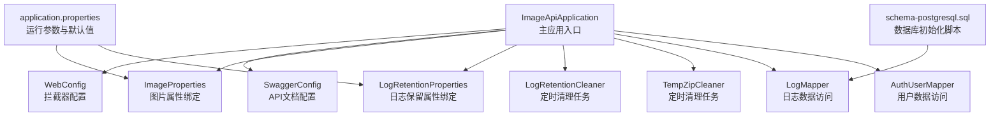
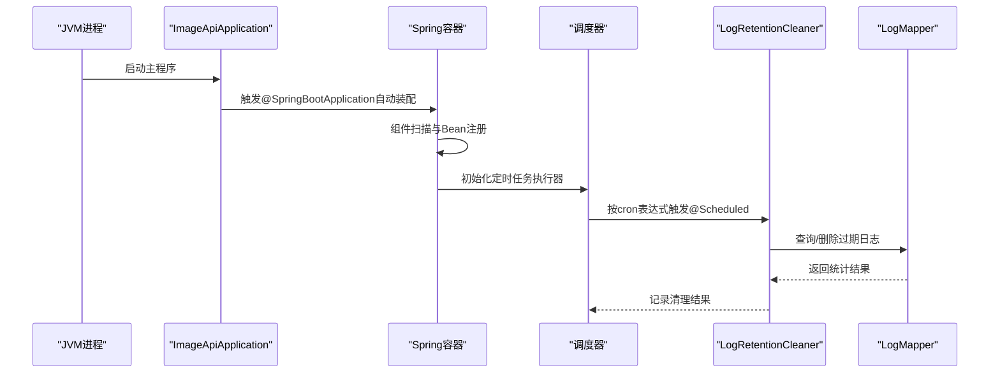
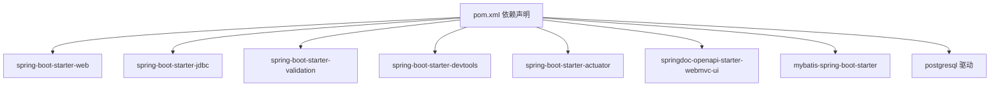
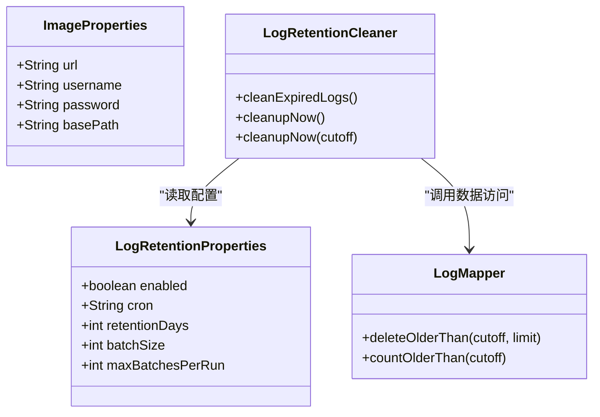

# Spring Boot配置

**本文引用的文件**
- [ImageApiApplication.java](file://backend-repo/src/main/java/com/zjcxph/imgapi/ImageApiApplication.java)
- [application.properties](file://backend-repo/src/main/resources/application.properties)
- [application-local.example.properties](file://backend-repo/src/main/resources/application-local.example.properties)
- [application-mac.properties](file://backend-repo/src/main/resources/application-mac.properties)
- [ImageProperties.java](file://backend-repo/src/main/java/com/zjcxph/imgapi/config/ImageProperties.java)
- [LogRetentionProperties.java](file://backend-repo/src/main/java/com/zjcxph/imgapi/config/LogRetentionProperties.java)
- [LogRetentionCleaner.java](file://backend-repo/src/main/java/com/zjcxph/imgapi/scheduler/LogRetentionCleaner.java)
- [TempZipCleaner.java](file://backend-repo/src/main/java/com/zjcxph/imgapi/scheduler/TempZipCleaner.java)
- [LogMapper.java](file://backend-repo/src/main/java/com/zjcxph/imgapi/mapper/LogMapper.java)
- [AuthUserMapper.java](file://backend-repo/src/main/java/com/zjcxph/imgapi/mapper/AuthUserMapper.java)
- [WebConfig.java](file://backend-repo/src/main/java/com/zjcxph/imgapi/config/WebConfig.java)
- [SwaggerConfig.java](file://backend-repo/src/main/java/com/zjcxph/imgapi/config/SwaggerConfig.java)
- [schema-postgresql.sql](file://backend-repo/src/main/resources/schema-postgresql.sql)
- [pom.xml](file://backend-repo/pom.xml)

## 目录
1. [简介](#简介)
2. [项目结构](#项目结构)
3. [核心组件](#核心组件)
4. [架构总览](#架构总览)
5. [详细组件分析](#详细组件分析)
6. [依赖分析](#依赖分析)
7. [性能考虑](#性能考虑)
8. [故障排查指南](#故障排查指南)
9. [结论](#结论)
10. [附录](#附录)

## 简介
本文件面向MRR项目的Spring Boot后端配置，围绕以下目标展开：深入解释@SpringBootApplication注解与自动配置机制；详解@EnableScheduling启用定时任务的功能与应用场景；记录@ConfigurationPropertiesScan配置属性扫描的使用方法与配置文件加载顺序；解释@MapperScan MyBatis Mapper扫描路径；分析application.properties中的数据库连接、服务器端口、日志级别等关键配置项；并提供不同环境下的配置文件管理策略与最佳实践。

## 项目结构
后端位于backend-repo目录，采用标准Spring Boot布局：
- 主应用入口位于com.zjcxph.imgapi包下，包含@SpringBootApplication、@EnableScheduling、@ConfigurationPropertiesScan、@MapperScan等关键注解
- 配置文件位于resources目录，包含application.properties及示例/环境特定配置
- 配置类位于config包，包含Web拦截器、Swagger、图片与日志保留等属性配置
- 定时任务位于scheduler包，包含日志清理与临时文件清理
- 数据访问层位于mapper包，使用MyBatis注解方式定义SQL
- 资源初始化脚本位于resources，包含PostgreSQL建表与索引

图表来源
- [ImageApiApplication.java:1-20](file://backend-repo/src/main/java/com/zjcxph/imgapi/ImageApiApplication.java#L1-L20)
- [WebConfig.java:1-61](file://backend-repo/src/main/java/com/zjcxph/imgapi/config/WebConfig.java#L1-L61)
- [SwaggerConfig.java:1-41](file://backend-repo/src/main/java/com/zjcxph/imgapi/config/SwaggerConfig.java#L1-L41)
- [ImageProperties.java:1-45](file://backend-repo/src/main/java/com/zjcxph/imgapi/config/ImageProperties.java#L1-L45)
- [LogRetentionProperties.java:1-54](file://backend-repo/src/main/java/com/zjcxph/imgapi/config/LogRetentionProperties.java#L1-L54)
- [LogRetentionCleaner.java:1-119](file://backend-repo/src/main/java/com/zjcxph/imgapi/scheduler/LogRetentionCleaner.java#L1-L119)
- [TempZipCleaner.java:1-57](file://backend-repo/src/main/java/com/zjcxph/imgapi/scheduler/TempZipCleaner.java#L1-L57)
- [LogMapper.java:1-166](file://backend-repo/src/main/java/com/zjcxph/imgapi/mapper/LogMapper.java#L1-L166)
- [AuthUserMapper.java:1-78](file://backend-repo/src/main/java/com/zjcxph/imgapi/mapper/AuthUserMapper.java#L1-L78)
- [application.properties:1-49](file://backend-repo/src/main/resources/application.properties#L1-L49)
- [schema-postgresql.sql:1-109](file://backend-repo/src/main/resources/schema-postgresql.sql#L1-L109)

章节来源
- [ImageApiApplication.java:1-20](file://backend-repo/src/main/java/com/zjcxph/imgapi/ImageApiApplication.java#L1-L20)
- [application.properties:1-49](file://backend-repo/src/main/resources/application.properties#L1-L49)

## 核心组件
本节聚焦于Spring Boot配置的关键注解与组件职责：
- @SpringBootApplication：组合注解，启用自动配置与组件扫描，默认扫描当前包及其子包
- @EnableScheduling：开启基于注解的定时任务支持，配合@Component与@Scheduled使用
- @ConfigurationPropertiesScan：启用对@ConfigurationProperties类的扫描与绑定
- @MapperScan：指定MyBatis Mapper接口扫描路径，避免在每个Mapper上重复标注@Mapper
- WebConfig：注册拦截器，统一处理登录、授权与日志记录
- SwaggerConfig：配置OpenAPI安全方案与基础信息
- ImageProperties/LogRetentionProperties：通过@ConfigurationProperties绑定application.properties中的image与app.log-retention前缀配置
- LogRetentionCleaner/TempZipCleaner：实现定时清理逻辑，前者清理过期访问日志，后者清理临时文件

章节来源
- [ImageApiApplication.java:9-12](file://backend-repo/src/main/java/com/zjcxph/imgapi/ImageApiApplication.java#L9-L12)
- [WebConfig.java:11-61](file://backend-repo/src/main/java/com/zjcxph/imgapi/config/WebConfig.java#L11-L61)
- [SwaggerConfig.java:11-41](file://backend-repo/src/main/java/com/zjcxph/imgapi/config/SwaggerConfig.java#L11-L41)
- [ImageProperties.java:5-45](file://backend-repo/src/main/java/com/zjcxph/imgapi/config/ImageProperties.java#L5-L45)
- [LogRetentionProperties.java:5-54](file://backend-repo/src/main/java/com/zjcxph/imgapi/config/LogRetentionProperties.java#L5-L54)
- [LogRetentionCleaner.java:13-29](file://backend-repo/src/main/java/com/zjcxph/imgapi/scheduler/LogRetentionCleaner.java#L13-L29)
- [TempZipCleaner.java:15-29](file://backend-repo/src/main/java/com/zjcxph/imgapi/scheduler/TempZipCleaner.java#L15-L29)

## 架构总览
下图展示Spring Boot启动到定时任务执行的关键流程：

图表来源
- [ImageApiApplication.java:15-17](file://backend-repo/src/main/java/com/zjcxph/imgapi/ImageApiApplication.java#L15-L17)
- [LogRetentionCleaner.java:26-29](file://backend-repo/src/main/java/com/zjcxph/imgapi/scheduler/LogRetentionCleaner.java#L26-L29)
- [LogRetentionCleaner.java:39-117](file://backend-repo/src/main/java/com/zjcxph/imgapi/scheduler/LogRetentionCleaner.java#L39-L117)
- [LogMapper.java:41-56](file://backend-repo/src/main/java/com/zjcxph/imgapi/mapper/LogMapper.java#L41-L56)

## 详细组件分析

### @SpringBootApplication与自动配置机制
- 作用：启用Spring Boot的自动配置与组件扫描，简化配置
- 控制流：主类启动后，Spring Boot根据类路径与条件注解自动装配各组件（如Web、MyBatis、Actuator、OpenAPI等）
- 与本项目的关系：结合@EnableScheduling、@ConfigurationPropertiesScan、@MapperScan，形成完整的运行时配置

章节来源
- [ImageApiApplication.java:12-12](file://backend-repo/src/main/java/com/zjcxph/imgapi/ImageApiApplication.java#L12-L12)
- [pom.xml:27-88](file://backend-repo/pom.xml#L27-L88)

### @EnableScheduling：定时任务功能与场景
- 功能：启用基于@Scheduled的定时任务执行能力
- 场景：
  - 日志保留清理：按cron周期清理过期访问日志
  - 临时文件清理：定期清理临时目录中过期的临时文件
- 关键点：@Scheduled支持cron、fixedDelay、fixedRate等多种模式；需确保任务线程池与并发控制满足业务需求

章节来源
- [ImageApiApplication.java:9-9](file://backend-repo/src/main/java/com/zjcxph/imgapi/ImageApiApplication.java#L9-L9)
- [LogRetentionCleaner.java:26-29](file://backend-repo/src/main/java/com/zjcxph/imgapi/scheduler/LogRetentionCleaner.java#L26-L29)
- [TempZipCleaner.java:28-29](file://backend-repo/src/main/java/com/zjcxph/imgapi/scheduler/TempZipCleaner.java#L28-L29)

### @ConfigurationPropertiesScan：配置属性扫描与加载顺序
- 使用方法：在主应用类上启用扫描，随后通过@ConfigurationProperties类绑定前缀配置
- 绑定示例：
  - image.* → ImageProperties
  - app.log-retention.* → LogRetentionProperties
- 加载顺序（从低优先级到高优先级）：
  1) application.properties（仓库内默认配置）
  2) 环境变量（如SPRING_DATASOURCE_URL等）
  3) 运行参数（如--spring.profiles.active）
  4) 环境特定配置文件（如application-local.properties、application-mac.properties）
- 最佳实践：生产环境务必通过环境变量或外部配置覆盖敏感字段（如数据库密码、密钥）

章节来源
- [ImageApiApplication.java:10-10](file://backend-repo/src/main/java/com/zjcxph/imgapi/ImageApiApplication.java#L10-L10)
- [ImageProperties.java:5-5](file://backend-repo/src/main/java/com/zjcxph/imgapi/config/ImageProperties.java#L5-L5)
- [LogRetentionProperties.java:5-5](file://backend-repo/src/main/java/com/zjcxph/imgapi/config/LogRetentionProperties.java#L5-L5)
- [application.properties:1-49](file://backend-repo/src/main/resources/application.properties#L1-L49)
- [application-local.example.properties:1-22](file://backend-repo/src/main/resources/application-local.example.properties#L1-L22)
- [application-mac.properties:1-28](file://backend-repo/src/main/resources/application-mac.properties#L1-L28)

### @MapperScan：MyBatis Mapper扫描路径
- 配置：@MapperScan("com.zjcxph.imgapi.mapper")
- 行为：扫描指定包下带有@Mapper注解的接口，无需在每个接口重复声明
- 与本项目的关系：所有Mapper接口位于com.zjcxph.imgapi.mapper包下，确保被自动注册为Spring Bean

章节来源
- [ImageApiApplication.java:11-11](file://backend-repo/src/main/java/com/zjcxph/imgapi/ImageApiApplication.java#L11-L11)
- [LogMapper.java:9-9](file://backend-repo/src/main/java/com/zjcxph/imgapi/mapper/LogMapper.java#L9-L9)
- [AuthUserMapper.java:13-13](file://backend-repo/src/main/java/com/zjcxph/imgapi/mapper/AuthUserMapper.java#L13-L13)

### application.properties关键配置解析
- 服务器与压缩
  - server.port：服务监听端口（可由环境变量覆盖）
  - server.compression.*：响应压缩配置
  - spring.web.resources.cache.*：静态资源缓存策略
- 数据源与初始化
  - spring.datasource.*：PostgreSQL连接参数（驱动、URL、用户名、密码、Hikari连接池参数）
  - spring.sql.init.*：初始化策略（模式、脚本位置、执行时机）
- 日志
  - logging.level.*：根日志级别与Mapper包调试日志
  - logging.file.name与logback滚动策略：日志文件名与滚动大小
- 图片与凭证
  - image.*：图片服务地址、用户名、密码、本地基础路径
- 开发与监控
  - spring.devtools.restart.enabled：开发热重启
  - management.endpoints.web.exposure.include与show-details：Actuator端点暴露
- 日志保留清理
  - app.log-retention.*：开关、cron、保留天数、批大小、每轮最大批次
- AES密钥
  - aes.secret.key：加密密钥（必须在真实环境覆盖）

章节来源
- [application.properties:2-49](file://backend-repo/src/main/resources/application.properties#L2-L49)

### 不同环境下的配置文件管理策略与最佳实践
- 环境文件命名与激活
  - 示例文件：application-local.example.properties、application-mac.properties
  - 激活方式：通过--spring.profiles.active=local或mac在运行参数中指定
- 覆盖策略
  - 仓库内默认值（application.properties）
  - 环境变量（优先级高于默认值）
  - 运行参数（如端口、数据源URL）
  - 环境特定文件（如application-local.properties）
- 最佳实践
  - 生产环境仅通过环境变量与外部配置文件覆盖敏感字段
  - 将非敏感配置（如日志级别、缓存策略）纳入仓库，敏感配置放入CI/CD机密或外部配置中心
  - 为不同团队/环境维护独立的示例文件，避免直接修改默认配置

章节来源
- [application-local.example.properties:1-22](file://backend-repo/src/main/resources/application-local.example.properties#L1-L22)
- [application-mac.properties:1-28](file://backend-repo/src/main/resources/application-mac.properties#L1-L28)
- [application.properties:1-49](file://backend-repo/src/main/resources/application.properties#L1-L49)

## 依赖分析
- Spring Boot Starter：web、jdbc、validation、devtools、actuator、openapi
- MyBatis：mybatis-spring-boot-starter与测试starter
- 数据库：PostgreSQL驱动
- 其他：JWT、PDF处理、编码工具、Lombok

图表来源
- [pom.xml:27-88](file://backend-repo/pom.xml#L27-L88)

章节来源
- [pom.xml:1-136](file://backend-repo/pom.xml#L1-L136)

## 性能考虑
- 连接池参数：合理设置maximum-pool-size、minimum-idle、connection-timeout、idle-timeout、max-lifetime，避免连接泄漏与抖动
- 响应压缩：对JSON/XML/HTML等大响应启用压缩，降低带宽占用
- 静态资源缓存：长期缓存策略减少重复请求
- 定时任务批处理：日志清理采用分批删除与最大批次限制，避免长时间阻塞
- SQL优化：数据库初始化脚本包含必要索引，建议结合查询计划与慢查询日志持续优化

## 故障排查指南
- 数据库连接失败
  - 检查spring.datasource.url、username、password是否正确覆盖
  - 确认PostgreSQL服务可用与网络连通性
- 定时任务未执行
  - 确认@EnableScheduling已生效且@Scheduled表达式合法
  - 检查日志保留开关与保留天数是否为正数
- 日志清理未生效
  - 查看app.log-retention.enabled与cron配置
  - 检查数据库中access_log表是否存在与索引是否完整
- 静态资源缓存问题
  - 核对spring.web.resources.cache.*配置与浏览器缓存策略

章节来源
- [application.properties:10-22](file://backend-repo/src/main/resources/application.properties#L10-L22)
- [application.properties:40-45](file://backend-repo/src/main/resources/application.properties#L40-L45)
- [LogRetentionCleaner.java:39-117](file://backend-repo/src/main/java/com/zjcxph/imgapi/scheduler/LogRetentionCleaner.java#L39-L117)
- [schema-postgresql.sql:61-88](file://backend-repo/src/main/resources/schema-postgresql.sql#L61-L88)

## 结论
本项目通过@SpringBootApplication、@EnableScheduling、@ConfigurationPropertiesScan、@MapperScan等注解，构建了简洁而强大的Spring Boot运行时。配合application.properties与环境特定配置文件，实现了灵活的配置管理与跨环境部署。定时任务模块（日志清理与临时文件清理）体现了生产级运维能力。建议在生产环境中严格区分敏感与非敏感配置，并通过环境变量与外部配置中心进行安全覆盖。

## 附录

### 配置属性绑定类关系图

图表来源
- [ImageProperties.java:5-45](file://backend-repo/src/main/java/com/zjcxph/imgapi/config/ImageProperties.java#L5-L45)
- [LogRetentionProperties.java:5-54](file://backend-repo/src/main/java/com/zjcxph/imgapi/config/LogRetentionProperties.java#L5-L54)
- [LogRetentionCleaner.java:18-24](file://backend-repo/src/main/java/com/zjcxph/imgapi/scheduler/LogRetentionCleaner.java#L18-L24)
- [LogMapper.java:41-56](file://backend-repo/src/main/java/com/zjcxph/imgapi/mapper/LogMapper.java#L41-L56)