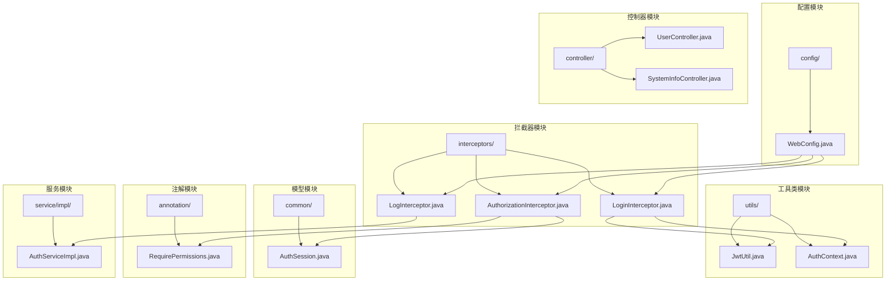
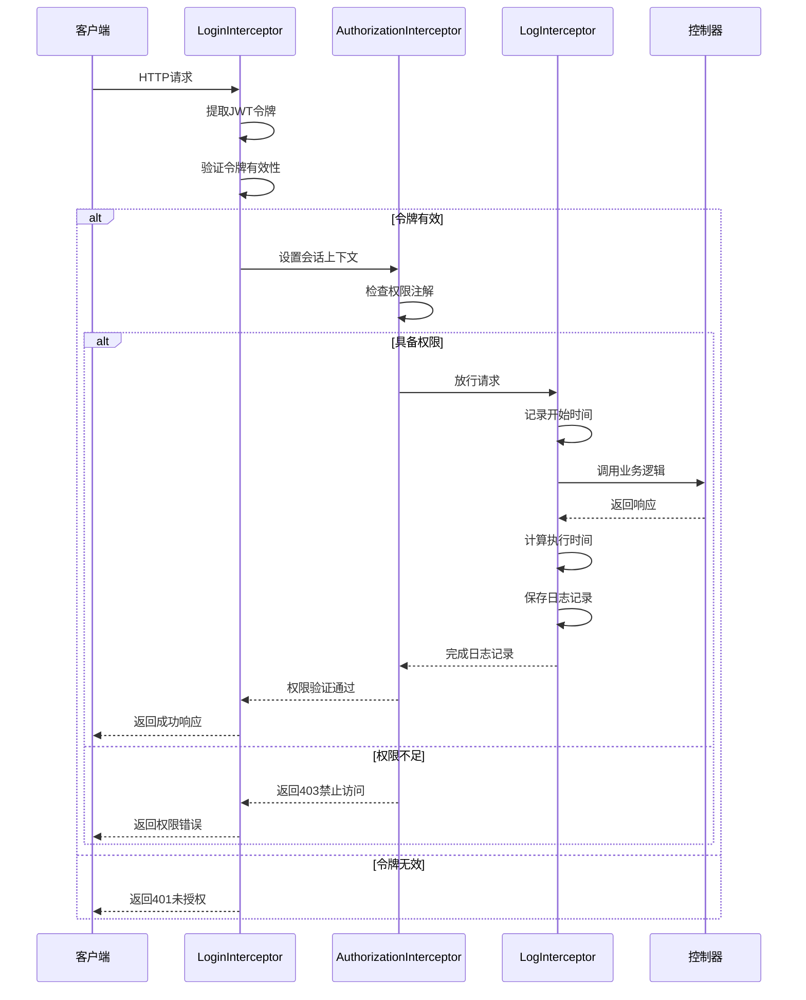
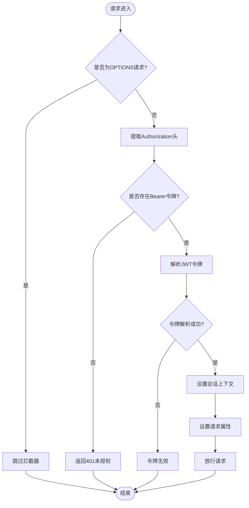
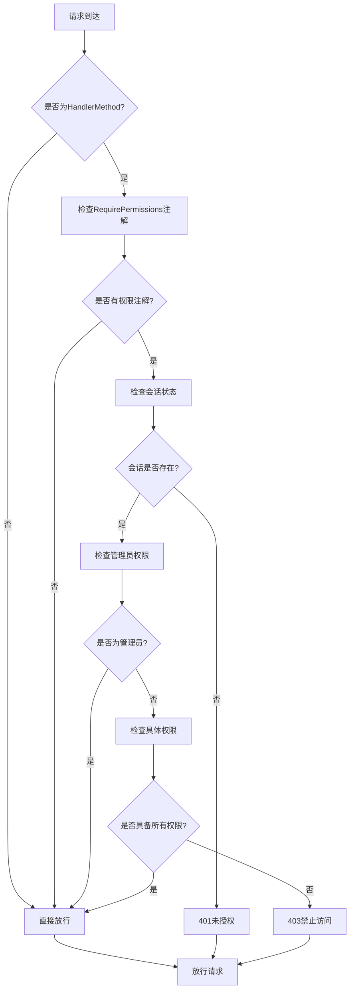
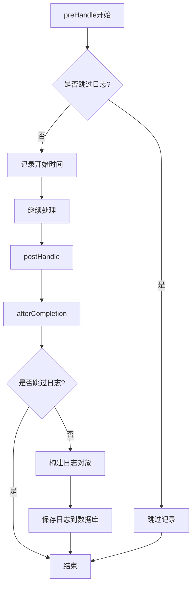
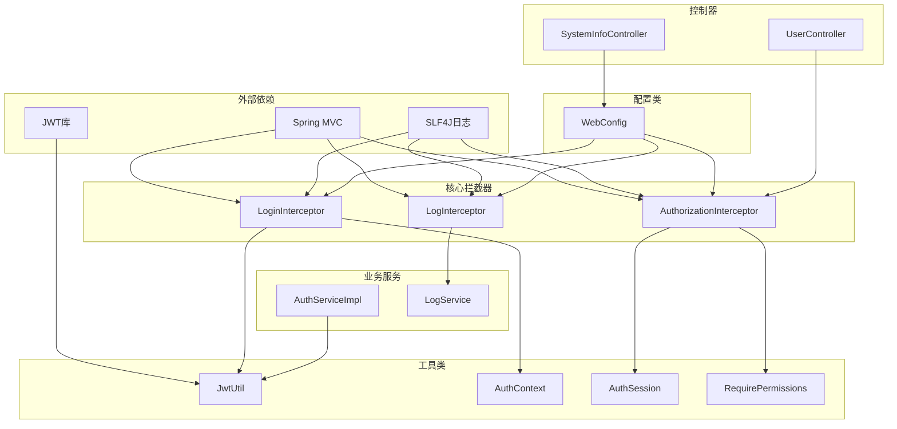
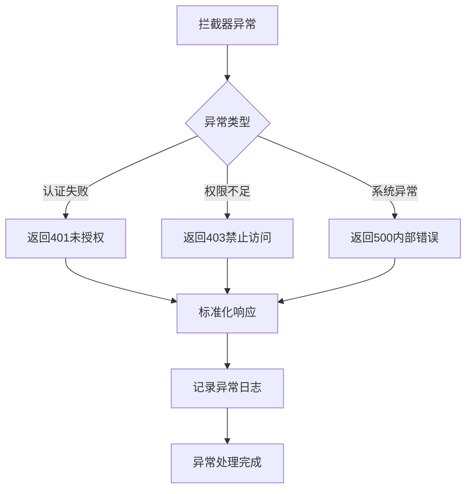
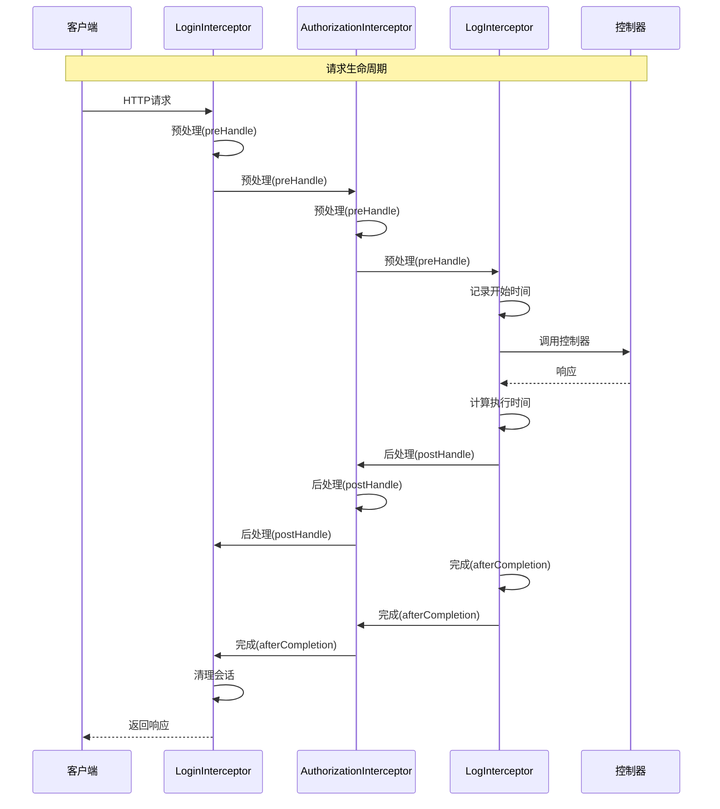

# Web拦截器与过滤器


**本文档引用的文件**
- [AuthorizationInterceptor.java](file://backend-repo/src/main/java/com/zjcxph/imgapi/interceptors/AuthorizationInterceptor.java)
- [LogInterceptor.java](file://backend-repo/src/main/java/com/zjcxph/imgapi/interceptors/LogInterceptor.java)
- [LoginInterceptor.java](file://backend-repo/src/main/java/com/zjcxph/imgapi/interceptors/LoginInterceptor.java)
- [WebConfig.java](file://backend-repo/src/main/java/com/zjcxph/imgapi/config/WebConfig.java)
- [JwtUtil.java](file://backend-repo/src/main/java/com/zjcxph/imgapi/utils/JwtUtil.java)
- [AuthSession.java](file://backend-repo/src/main/java/com/zjcxph/imgapi/common/AuthSession.java)
- [RequirePermissions.java](file://backend-repo/src/main/java/com/zjcxph/imgapi/annotation/RequirePermissions.java)
- [AuthContext.java](file://backend-repo/src/main/java/com/zjcxph/imgapi/utils/AuthContext.java)
- [AuthServiceImpl.java](file://backend-repo/src/main/java/com/zjcxph/imgapi/service/impl/AuthServiceImpl.java)
- [UserController.java](file://backend-repo/src/main/java/com/zjcxph/imgapi/controller/UserController.java)
- [SystemInfoController.java](file://backend-repo/src/main/java/com/zjcxph/imgapi/controller/SystemInfoController.java)


## 目录
1. [简介](#简介)
2. [项目结构](#项目结构)
3. [核心组件](#核心组件)
4. [架构概览](#架构概览)
5. [详细组件分析](#详细组件分析)
6. [依赖关系分析](#依赖关系分析)
7. [性能考虑](#性能考虑)
8. [故障排除指南](#故障排除指南)
9. [结论](#结论)
10. [附录](#附录)

## 简介

MRR项目的Web拦截器与过滤器系统是整个后端安全架构的核心组成部分，负责处理用户认证、权限验证、日志记录和会话管理等关键功能。该系统采用Spring MVC拦截器机制，通过三个主要拦截器实现完整的Web层安全控制：LoginInterceptor负责JWT令牌验证和登录状态检查，AuthorizationInterceptor实现基于注解的权限控制，LogInterceptor提供详细的请求响应日志记录。

系统设计遵循分层架构原则，每个拦截器职责明确，通过WebConfig进行统一配置和注册，确保拦截器链的正确执行顺序和高效的性能表现。

## 项目结构

MRR项目的Web拦截器相关文件组织结构如下：



**图表来源**
- [AuthorizationInterceptor.java:1-78](file://backend-repo/src/main/java/com/zjcxph/imgapi/interceptors/AuthorizationInterceptor.java#L1-L78)
- [WebConfig.java:1-61](file://backend-repo/src/main/java/com/zjcxph/imgapi/config/WebConfig.java#L1-L61)

**章节来源**
- [WebConfig.java:1-61](file://backend-repo/src/main/java/com/zjcxph/imgapi/config/WebConfig.java#L1-L61)
- [AuthorizationInterceptor.java:1-78](file://backend-repo/src/main/java/com/zjcxph/imgapi/interceptors/AuthorizationInterceptor.java#L1-L78)

## 核心组件

MRR项目的Web拦截器系统由以下核心组件构成：

### 拦截器组件

1. **LoginInterceptor** - 登录状态拦截器
   - 负责JWT令牌提取和验证
   - 管理用户会话状态
   - 处理未授权访问场景

2. **AuthorizationInterceptor** - 权限拦截器  
   - 实现基于注解的权限控制
   - 支持管理员特殊权限
   - 处理权限不足的访问拒绝

3. **LogInterceptor** - 日志拦截器
   - 记录请求响应详细信息
   - 过滤系统管理接口日志
   - 支持执行时间统计

### 配置组件

4. **WebConfig** - 拦截器配置
   - 统一管理拦截器注册
   - 定义路径匹配规则
   - 配置排除路径列表

### 工具组件

5. **JwtUtil** - JWT工具类
   - 令牌生成和解析
   - 密钥管理和过期控制
   - 用户信息序列化

6. **AuthSession** - 认证会话模型
   - 用户身份信息封装
   - 权限列表管理
   - 角色权限判断

**章节来源**
- [LoginInterceptor.java:1-69](file://backend-repo/src/main/java/com/zjcxph/imgapi/interceptors/LoginInterceptor.java#L1-L69)
- [AuthorizationInterceptor.java:1-78](file://backend-repo/src/main/java/com/zjcxph/imgapi/interceptors/AuthorizationInterceptor.java#L1-L78)
- [LogInterceptor.java:1-90](file://backend-repo/src/main/java/com/zjcxph/imgapi/interceptors/LogInterceptor.java#L1-L90)
- [WebConfig.java:1-61](file://backend-repo/src/main/java/com/zjcxph/imgapi/config/WebConfig.java#L1-L61)

## 架构概览

MRR项目的Web拦截器架构采用三层拦截器链设计，确保从外到内的安全控制层次：



**图表来源**
- [LoginInterceptor.java:29-52](file://backend-repo/src/main/java/com/zjcxph/imgapi/interceptors/LoginInterceptor.java#L29-L52)
- [AuthorizationInterceptor.java:22-56](file://backend-repo/src/main/java/com/zjcxph/imgapi/interceptors/AuthorizationInterceptor.java#L22-L56)
- [LogInterceptor.java:21-58](file://backend-repo/src/main/java/com/zjcxph/imgapi/interceptors/LogInterceptor.java#L21-L58)

### 执行顺序规则

拦截器按照注册顺序执行，具体规则如下：

1. **预处理阶段**（preHandle）：LoginInterceptor → AuthorizationInterceptor → LogInterceptor
2. **后处理阶段**（postHandle）：LogInterceptor → AuthorizationInterceptor → LoginInterceptor  
3. **完成阶段**（afterCompletion）：LogInterceptor → AuthorizationInterceptor → LoginInterceptor

这种设计确保了：
- 登录验证在权限检查之前进行
- 日志记录覆盖完整的请求生命周期
- 会话清理在请求完成后执行

**章节来源**
- [WebConfig.java:24-59](file://backend-repo/src/main/java/com/zjcxph/imgapi/config/WebConfig.java#L24-L59)

## 详细组件分析

### LoginInterceptor - 登录状态检查

LoginInterceptor负责处理JWT令牌的提取、验证和用户会话管理：

#### 核心功能分析



**图表来源**
- [LoginInterceptor.java:29-52](file://backend-repo/src/main/java/com/zjcxph/imgapi/interceptors/LoginInterceptor.java#L29-L52)

#### JWT令牌验证机制

LoginInterceptor使用JwtUtil进行令牌验证，验证过程包括：

1. **令牌格式检查**：验证Authorization头是否以"Bear "开头
2. **令牌解析**：调用JwtUtil.parseToken进行JWT解析
3. **异常处理**：捕获令牌解析异常并返回401状态码
4. **会话设置**：成功解析后设置AuthContext和请求属性

#### 会话管理策略

- 使用ThreadLocal存储当前用户会话
- 在请求完成后自动清理会话上下文
- 支持AuthSession对象的完整用户信息

**章节来源**
- [LoginInterceptor.java:1-69](file://backend-repo/src/main/java/com/zjcxph/imgapi/interceptors/LoginInterceptor.java#L1-L69)
- [JwtUtil.java:61-75](file://backend-repo/src/main/java/com/zjcxph/imgapi/utils/JwtUtil.java#L61-L75)
- [AuthContext.java:1-28](file://backend-repo/src/main/java/com/zjcxph/imgapi/utils/AuthContext.java#L1-L28)

### AuthorizationInterceptor - 权限拦截器

AuthorizationInterceptor实现基于注解的细粒度权限控制：

#### 权限验证流程



**图表来源**
- [AuthorizationInterceptor.java:22-56](file://backend-repo/src/main/java/com/zjcxph/imgapi/interceptors/AuthorizationInterceptor.java#L22-L56)

#### 权限控制逻辑

权限验证采用"全匹配"策略：
- 必须同时具备注解中声明的所有权限
- 管理员角色自动获得所有权限
- 支持动态权限列表检查

管理员权限判定标准：
1. 角色代码为"ADMIN"
2. 权限列表包含"user:manage"或"role:manage"

**章节来源**
- [AuthorizationInterceptor.java:1-78](file://backend-repo/src/main/java/com/zjcxph/imgapi/interceptors/AuthorizationInterceptor.java#L1-L78)
- [RequirePermissions.java:1-13](file://backend-repo/src/main/java/com/zjcxph/imgapi/annotation/RequirePermissions.java#L1-L13)
- [AuthSession.java:81-88](file://backend-repo/src/main/java/com/zjcxph/imgapi/common/AuthSession.java#L81-L88)

### LogInterceptor - 日志拦截器

LogInterceptor提供完整的请求响应日志记录功能：

#### 日志记录策略



**图表来源**
- [LogInterceptor.java:21-58](file://backend-repo/src/main/java/com/zjcxph/imgapi/interceptors/LogInterceptor.java#L21-L58)

#### 日志记录内容

日志拦截器记录以下关键信息：
- **请求信息**：客户端IP、请求URI、HTTP方法、User-Agent
- **响应信息**：响应状态码、执行时间
- **环境信息**：请求参数、请求体、Referer
- **时间戳**：访问时间、执行耗时

#### 跳过规则

系统自动跳过以下类型的请求日志：
- OPTIONS预检请求
- 静态资源请求
- Swagger文档接口
- 系统管理接口（/actuator/**）
- 错误页面和favicon.ico

**章节来源**
- [LogInterceptor.java:1-90](file://backend-repo/src/main/java/com/zjcxph/imgapi/interceptors/LogInterceptor.java#L1-L90)

### WebConfig - 拦截器配置

WebConfig负责拦截器的统一配置和注册：

#### 拦截器注册策略

```mermaid
graph LR
subgraph "拦截器注册"
A[LoginInterceptor] --> B[路径匹配: /**]
C[AuthorizationInterceptor] --> D[路径匹配: /**]
E[LogInterceptor] --> F[路径匹配: /**]
end
subgraph "排除规则"
B --> G[/login, /v1/auth/login]
B --> H[/v1/img-api/hello]
B --> I[/v1/system/**]
B --> J[/v1/statistics-api/**]
B --> K[/v1/monitoring-api/pressure-tests/**]
B --> L[/swagger-ui/**]
B --> M[/v3/api-docs/**]
B --> N[/docs/**]
B --> O[/error, /favicon.ico]
B --> P[/actuator/health, /actuator/info]
D --> Q[无特定排除]
F --> R[/docs/**, /swagger-ui/**]
F --> S[/v3/api-docs/**]
F --> T[/favicon.ico, /error]
F --> U[/actuator/**]
end
```

**图表来源**
- [WebConfig.java:24-59](file://backend-repo/src/main/java/com/zjcxph/imgapi/config/WebConfig.java#L24-L59)

#### 路径匹配规则

- **LoginInterceptor**：对所有请求进行登录验证，但排除多个公开接口
- **AuthorizationInterceptor**：对所有请求进行权限检查
- **LogInterceptor**：对所有请求进行日志记录，但排除系统管理接口

**章节来源**
- [WebConfig.java:1-61](file://backend-repo/src/main/java/com/zjcxph/imgapi/config/WebConfig.java#L1-L61)

## 依赖关系分析

MRR项目Web拦截器系统的依赖关系呈现清晰的分层结构：



**图表来源**
- [LoginInterceptor.java:1-69](file://backend-repo/src/main/java/com/zjcxph/imgapi/interceptors/LoginInterceptor.java#L1-L69)
- [AuthorizationInterceptor.java:1-78](file://backend-repo/src/main/java/com/zjcxph/imgapi/interceptors/AuthorizationInterceptor.java#L1-L78)
- [LogInterceptor.java:1-90](file://backend-repo/src/main/java/com/zjcxph/imgapi/interceptors/LogInterceptor.java#L1-L90)
- [WebConfig.java:1-61](file://backend-repo/src/main/java/com/zjcxph/imgapi/config/WebConfig.java#L1-L61)

### 关键依赖关系

1. **LoginInterceptor依赖**：
   - JwtUtil：JWT令牌解析和验证
   - AuthContext：线程本地会话管理
   - AuthorizationInterceptor：共享的会话属性常量

2. **AuthorizationInterceptor依赖**：
   - RequirePermissions：权限注解处理
   - AuthSession：用户权限信息
   - SLF4J：日志记录

3. **LogInterceptor依赖**：
   - LogService：日志持久化
   - SLF4J：日志记录

**章节来源**
- [LoginInterceptor.java:1-69](file://backend-repo/src/main/java/com/zjcxph/imgapi/interceptors/LoginInterceptor.java#L1-L69)
- [AuthorizationInterceptor.java:1-78](file://backend-repo/src/main/java/com/zjcxph/imgapi/interceptors/AuthorizationInterceptor.java#L1-L78)
- [LogInterceptor.java:1-90](file://backend-repo/src/main/java/com/zjcxph/imgapi/interceptors/LogInterceptor.java#L1-L90)

## 性能考虑

### 拦截器性能优化策略

1. **早期退出优化**
   - LoginInterceptor对OPTIONS请求直接跳过
   - AuthorizationInterceptor对无注解方法直接放行
   - LogInterceptor跳过静态资源和系统管理接口

2. **内存使用优化**
   - 使用ThreadLocal避免线程间数据竞争
   - JWT令牌解析结果缓存（由JWT库内部处理）
   - 及时清理会话上下文防止内存泄漏

3. **日志性能优化**
   - 异步日志记录（通过LogService实现）
   - 条件日志记录，避免重复写入
   - 执行时间计算使用毫秒级精度

### 性能监控指标

- **拦截器执行时间**：记录每个拦截器的处理耗时
- **令牌验证成功率**：监控JWT验证性能
- **权限检查耗时**：评估权限验证开销
- **日志记录延迟**：监控日志写入性能

## 故障排除指南

### 常见问题诊断

#### 1. JWT令牌验证失败

**症状**：所有受保护接口返回401未授权

**排查步骤**：
1. 检查JWT_SECRET_KEY环境变量配置
2. 验证令牌格式是否正确（Bearer前缀）
3. 确认令牌未过期
4. 检查服务器时间同步

**解决方案**：
- 更新正确的JWT密钥
- 重新生成有效的JWT令牌
- 同步服务器时间

#### 2. 权限验证异常

**症状**：管理员无法访问某些功能

**排查步骤**：
1. 检查用户角色代码是否为"ADMIN"
2. 验证权限列表中是否包含"user:manage"或"role:manage"
3. 确认RequirePermissions注解使用正确

**解决方案**：
- 更新用户角色和权限
- 修正权限注解配置
- 重新登录获取最新权限

#### 3. 日志记录异常

**症状**：日志表中缺少请求记录

**排查步骤**：
1. 检查LogInterceptor排除规则
2. 验证LogService配置
3. 确认数据库连接正常

**解决方案**：
- 调整日志排除规则
- 修复LogService配置
- 检查数据库连接池

### 异常处理策略

系统采用统一的异常处理机制：



**章节来源**
- [LoginInterceptor.java:59-67](file://backend-repo/src/main/java/com/zjcxph/imgapi/interceptors/LoginInterceptor.java#L59-L67)
- [AuthorizationInterceptor.java:58-68](file://backend-repo/src/main/java/com/zjcxph/imgapi/interceptors/AuthorizationInterceptor.java#L58-L68)

## 结论

MRR项目的Web拦截器与过滤器系统实现了完整的Web安全控制框架，具有以下特点：

### 设计优势

1. **分层架构**：三个拦截器各司其职，职责分离清晰
2. **可扩展性**：基于注解的权限控制支持灵活的权限管理
3. **性能优化**：多处早期退出和条件检查减少不必要的处理
4. **可观测性**：完整的日志记录和异常处理机制

### 安全特性

1. **多层防护**：登录验证、权限检查、日志审计形成完整安全链
2. **细粒度控制**：基于注解的权限控制支持精确的访问控制
3. **会话管理**：ThreadLocal确保线程安全的会话管理
4. **令牌安全**：JWT令牌包含完整用户信息和权限标识

### 最佳实践建议

1. **权限设计**：合理划分权限级别，避免过度授权
2. **日志策略**：平衡日志详细程度和性能影响
3. **监控告警**：建立拦截器性能和异常监控机制
4. **定期审计**：定期审查权限配置和访问日志

该系统为MRR项目提供了坚实的安全基础，能够有效保护系统免受未授权访问和权限滥用的影响。

## 附录

### 自定义拦截器开发指南

#### 开发步骤

1. **创建拦截器类**
   ```java
   @Component
   public class CustomInterceptor implements HandlerInterceptor {
       @Override
       public boolean preHandle(...) {
           // 实现拦截逻辑
           return true;
       }
   }
   ```

2. **在WebConfig中注册**
   ```java
   @Override
   public void addInterceptors(InterceptorRegistry registry) {
       registry.addInterceptor(customInterceptor)
               .addPathPatterns("/**")
               .excludePathPatterns("/public/**");
   }
   ```

3. **实现必要的接口方法**
   - preHandle：请求预处理
   - postHandle：响应后处理
   - afterCompletion：请求完成清理

#### 性能优化建议

1. **避免阻塞操作**：在拦截器中避免长时间阻塞操作
2. **及时清理资源**：确保会话和临时资源及时释放
3. **合理使用缓存**：对频繁访问的数据进行缓存
4. **异步处理**：将耗时操作移至异步处理

### 拦截器链执行流程图



**图表来源**
- [LoginInterceptor.java:55-57](file://backend-repo/src/main/java/com/zjcxph/imgapi/interceptors/LoginInterceptor.java#L55-L57)
- [AuthorizationInterceptor.java:22-56](file://backend-repo/src/main/java/com/zjcxph/imgapi/interceptors/AuthorizationInterceptor.java#L22-L56)
- [LogInterceptor.java:36-58](file://backend-repo/src/main/java/com/zjcxph/imgapi/interceptors/LogInterceptor.java#L36-L58)