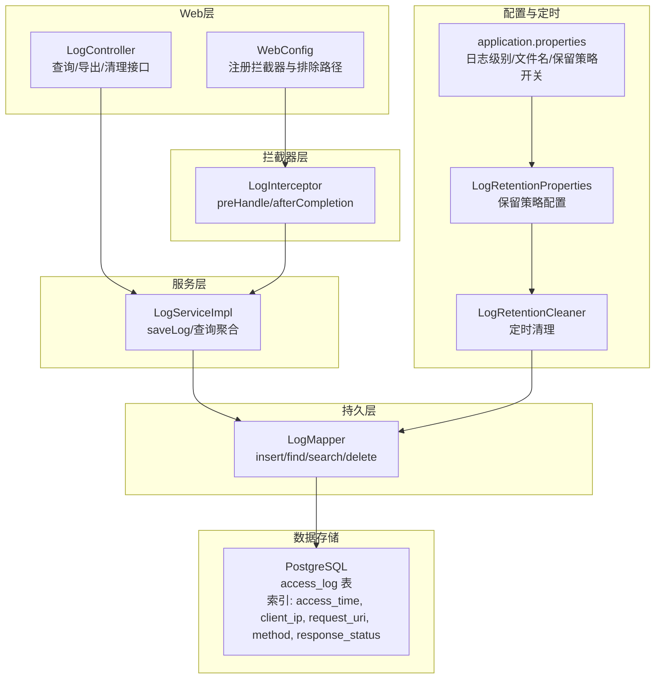
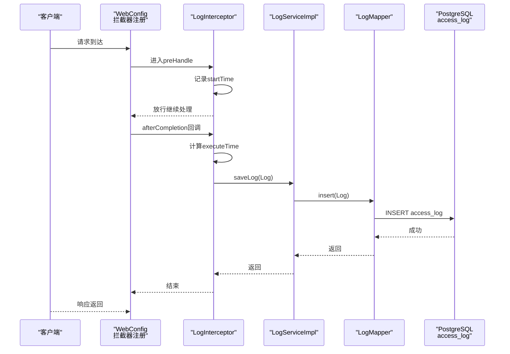
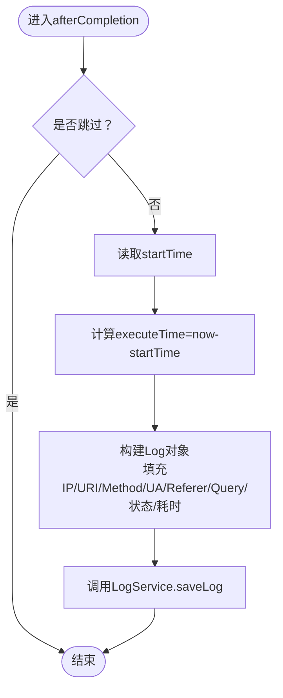
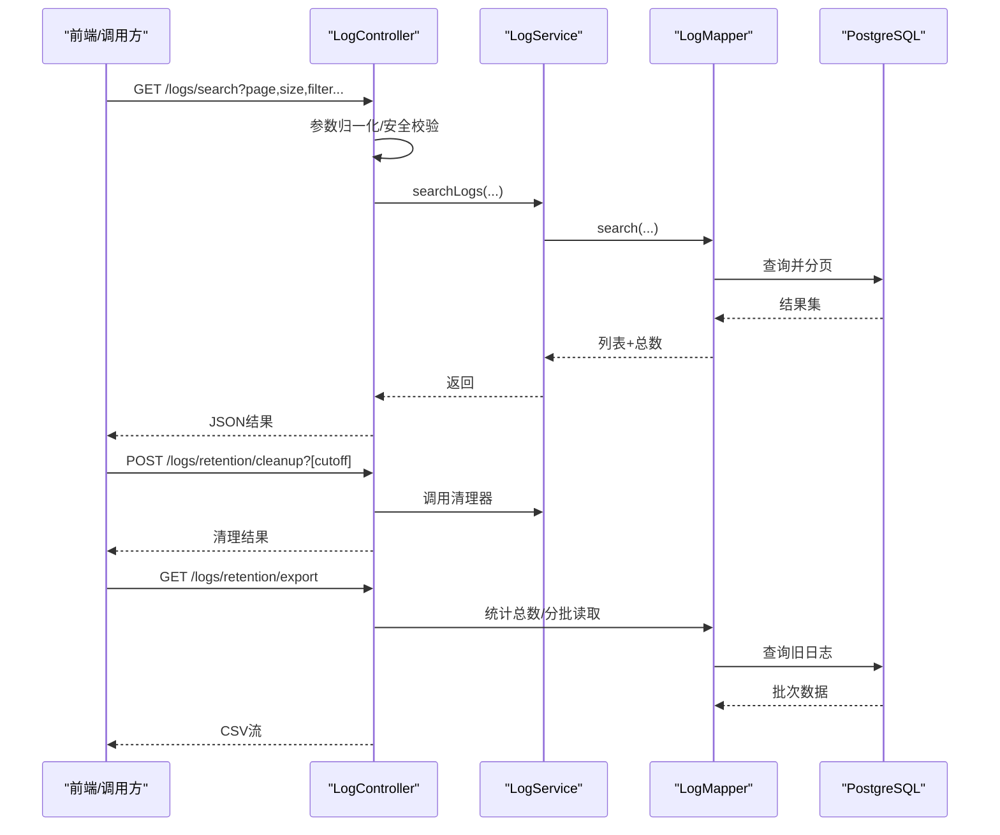
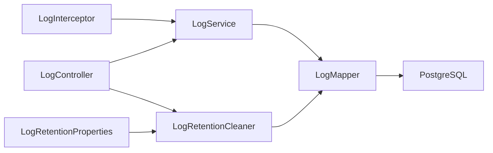

# 日志拦截器

**本文引用的文件**
- [LogInterceptor.java](file://backend-repo/src/main/java/com/zjcxph/imgapi/interceptors/LogInterceptor.java)
- [WebConfig.java](file://backend-repo/src/main/java/com/zjcxph/imgapi/config/WebConfig.java)
- [LogController.java](file://backend-repo/src/main/java/com/zjcxph/imgapi/controller/LogController.java)
- [LogServiceImpl.java](file://backend-repo/src/main/java/com/zjcxph/imgapi/service/impl/LogServiceImpl.java)
- [LogMapper.java](file://backend-repo/src/main/java/com/zjcxph/imgapi/mapper/LogMapper.java)
- [Log.java](file://backend-repo/src/main/java/com/zjcxph/imgapi/entity/Log.java)
- [LogRetentionProperties.java](file://backend-repo/src/main/java/com/zjcxph/imgapi/config/LogRetentionProperties.java)
- [LogRetentionCleaner.java](file://backend-repo/src/main/java/com/zjcxph/imgapi/scheduler/LogRetentionCleaner.java)
- [schema-postgresql.sql](file://backend-repo/src/main/resources/schema-postgresql.sql)
- [application.properties](file://backend-repo/src/main/resources/application.properties)
- [logs.ts](file://frontend-repo/src/api/logs.ts)

## 目录
1. [简介](#简介)
2. [项目结构](#项目结构)
3. [核心组件](#核心组件)
4. [架构总览](#架构总览)
5. [详细组件分析](#详细组件分析)
6. [依赖关系分析](#依赖关系分析)
7. [性能考量](#性能考量)
8. [故障排查指南](#故障排查指南)
9. [结论](#结论)
10. [附录](#附录)

## 简介
本文件面向MRR项目的“日志拦截器”子系统，系统性阐述LogInterceptor的请求-响应日志记录功能与实现机制，覆盖时间戳、请求参数、响应状态等关键字段的采集方式；并结合后端控制器、服务层、持久层与数据库设计，给出性能影响评估、优化策略、日志级别与敏感信息过滤建议、结构化日志最佳实践、日志存储与查询方案以及开发/生产环境的日志策略调整方法。

## 项目结构
围绕日志拦截与访问日志的全链路涉及以下模块：
- 拦截器：LogInterceptor（请求前后记录）
- Web配置：WebConfig（注册拦截器及排除路径）
- 控制器：LogController（日志查询、导出、清理）
- 服务：LogServiceImpl（日志写入与查询聚合）
- 持久层：LogMapper（SQL映射与分页、检索、清理）
- 实体：Log（日志数据模型）
- 配置：LogRetentionProperties、application.properties（保留策略与日志文件配置）
- 定时任务：LogRetentionCleaner（按保留策略定期清理过期日志）
- 数据库：schema-postgresql.sql（access_log表结构与索引）

图表来源
- [WebConfig.java:24-59](file://backend-repo/src/main/java/com/zjcxph/imgapi/config/WebConfig.java#L24-L59)
- [LogInterceptor.java:21-58](file://backend-repo/src/main/java/com/zjcxph/imgapi/interceptors/LogInterceptor.java#L21-L58)
- [LogController.java:32-148](file://backend-repo/src/main/java/com/zjcxph/imgapi/controller/LogController.java#L32-L148)
- [LogServiceImpl.java:17-20](file://backend-repo/src/main/java/com/zjcxph/imgapi/service/impl/LogServiceImpl.java#L17-L20)
- [LogMapper.java:24-27](file://backend-repo/src/main/java/com/zjcxph/imgapi/mapper/LogMapper.java#L24-L27)
- [LogRetentionProperties.java:5-53](file://backend-repo/src/main/java/com/zjcxph/imgapi/config/LogRetentionProperties.java#L5-L53)
- [LogRetentionCleaner.java:26-37](file://backend-repo/src/main/java/com/zjcxph/imgapi/scheduler/LogRetentionCleaner.java#L26-L37)
- [application.properties:24-49](file://backend-repo/src/main/resources/application.properties#L24-L49)
- [schema-postgresql.sql:61-90](file://backend-repo/src/main/resources/schema-postgresql.sql#L61-L90)

章节来源
- [WebConfig.java:24-59](file://backend-repo/src/main/java/com/zjcxph/imgapi/config/WebConfig.java#L24-L59)
- [LogInterceptor.java:21-58](file://backend-repo/src/main/java/com/zjcxph/imgapi/interceptors/LogInterceptor.java#L21-L58)
- [LogController.java:32-148](file://backend-repo/src/main/java/com/zjcxph/imgapi/controller/LogController.java#L32-L148)
- [LogServiceImpl.java:17-20](file://backend-repo/src/main/java/com/zjcxph/imgapi/service/impl/LogServiceImpl.java#L17-L20)
- [LogMapper.java:24-27](file://backend-repo/src/main/java/com/zjcxph/imgapi/mapper/LogMapper.java#L24-L27)
- [LogRetentionProperties.java:5-53](file://backend-repo/src/main/java/com/zjcxph/imgapi/config/LogRetentionProperties.java#L5-L53)
- [LogRetentionCleaner.java:26-37](file://backend-repo/src/main/java/com/zjcxph/imgapi/scheduler/LogRetentionCleaner.java#L26-L37)
- [application.properties:24-49](file://backend-repo/src/main/resources/application.properties#L24-L49)
- [schema-postgresql.sql:61-90](file://backend-repo/src/main/resources/schema-postgresql.sql#L61-L90)

## 核心组件
- LogInterceptor：在请求进入前记录开始时间，在请求完成后计算执行耗时并落库，同时采集客户端IP、URI、方法、UA、Referer、查询串、响应状态码等。
- WebConfig：注册拦截器并排除静态资源、Swagger、Actuator、favicon等非业务路径。
- LogController：提供日志查询、按条件搜索、导出CSV、触发清理等接口。
- LogServiceImpl：封装日志写入与分页查询。
- LogMapper：定义插入、分页查询、条件搜索、清理过期、计数等SQL。
- Log实体：承载日志字段。
- LogRetentionProperties/LogRetentionCleaner：配置保留天数、批大小、最大批次，定时清理过期日志。
- application.properties：设置日志级别、日志文件名、保留策略开关与参数。
- schema-postgresql.sql：定义access_log表结构与多字段索引。

章节来源
- [LogInterceptor.java:15-88](file://backend-repo/src/main/java/com/zjcxph/imgapi/interceptors/LogInterceptor.java#L15-L88)
- [WebConfig.java:24-59](file://backend-repo/src/main/java/com/zjcxph/imgapi/config/WebConfig.java#L24-L59)
- [LogController.java:32-148](file://backend-repo/src/main/java/com/zjcxph/imgapi/controller/LogController.java#L32-L148)
- [LogServiceImpl.java:17-20](file://backend-repo/src/main/java/com/zjcxph/imgapi/service/impl/LogServiceImpl.java#L17-L20)
- [LogMapper.java:24-27](file://backend-repo/src/main/java/com/zjcxph/imgapi/mapper/LogMapper.java#L24-L27)
- [Log.java:8-19](file://backend-repo/src/main/java/com/zjcxph/imgapi/entity/Log.java#L8-L19)
- [LogRetentionProperties.java:5-53](file://backend-repo/src/main/java/com/zjcxph/imgapi/config/LogRetentionProperties.java#L5-L53)
- [LogRetentionCleaner.java:26-37](file://backend-repo/src/main/java/com/zjcxph/imgapi/scheduler/LogRetentionCleaner.java#L26-L37)
- [application.properties:24-49](file://backend-repo/src/main/resources/application.properties#L24-L49)
- [schema-postgresql.sql:61-90](file://backend-repo/src/main/resources/schema-postgresql.sql#L61-L90)

## 架构总览
下图展示一次HTTP请求从进入拦截器到完成后的日志落库流程，以及与控制器、服务、持久层、数据库的交互。

图表来源
- [WebConfig.java:24-59](file://backend-repo/src/main/java/com/zjcxph/imgapi/config/WebConfig.java#L24-L59)
- [LogInterceptor.java:21-58](file://backend-repo/src/main/java/com/zjcxph/imgapi/interceptors/LogInterceptor.java#L21-L58)
- [LogServiceImpl.java:17-20](file://backend-repo/src/main/java/com/zjcxph/imgapi/service/impl/LogServiceImpl.java#L17-L20)
- [LogMapper.java:24-27](file://backend-repo/src/main/java/com/zjcxph/imgapi/mapper/LogMapper.java#L24-L27)
- [schema-postgresql.sql:61-73](file://backend-repo/src/main/resources/schema-postgresql.sql#L61-L73)

## 详细组件分析

### LogInterceptor：请求-响应日志拦截
- 生命周期钩子
  - preHandle：跳过OPTIONS、静态资源处理器、特定路径（如Swagger、Actuator、favicon、/error），其余请求记录startTime。
  - afterCompletion：计算executeTime（毫秒），构造Log对象并调用LogService保存。
- 采集字段
  - 时间戳：accessTime（Date）。
  - 客户端IP：通过X-Forwarded-For、X-Real-IP回退至remoteAddr。
  - 请求信息：requestURI、method、queryString。
  - 响应信息：responseStatus（字符串）、executeTime（毫秒）。
  - 其他：userAgent、Referer。
  - 特殊：requestBody为空（当前未读取请求体）。
- 跳过规则
  - 方法为OPTIONS或处理器为ResourceHttpRequestHandler时跳过。
  - URI以/docs/、/swagger-ui/、/v3/api-docs/、/actuator/开头，或为/favicon.ico、/error时跳过。

图表来源
- [LogInterceptor.java:36-58](file://backend-repo/src/main/java/com/zjcxph/imgapi/interceptors/LogInterceptor.java#L36-L58)
- [LogInterceptor.java:60-77](file://backend-repo/src/main/java/com/zjcxph/imgapi/interceptors/LogInterceptor.java#L60-L77)
- [LogInterceptor.java:79-88](file://backend-repo/src/main/java/com/zjcxph/imgapi/interceptors/LogInterceptor.java#L79-L88)

章节来源
- [LogInterceptor.java:21-58](file://backend-repo/src/main/java/com/zjcxph/imgapi/interceptors/LogInterceptor.java#L21-L58)
- [LogInterceptor.java:60-77](file://backend-repo/src/main/java/com/zjcxph/imgapi/interceptors/LogInterceptor.java#L60-L77)
- [LogInterceptor.java:79-88](file://backend-repo/src/main/java/com/zjcxph/imgapi/interceptors/LogInterceptor.java#L79-L88)

### WebConfig：拦截器注册与排除
- 注册顺序：登录拦截器 → 权限拦截器 → 访问日志拦截器。
- 排除路径：Swagger、Actuator、favicon、/error等非业务或静态资源路径。
- 影响：确保日志拦截器对大多数业务请求生效，避免噪音。

章节来源
- [WebConfig.java:24-59](file://backend-repo/src/main/java/com/zjcxph/imgapi/config/WebConfig.java#L24-L59)

### LogController：查询、导出与清理
- 查询接口
  - 分页获取全部日志、按IP、按URI查询。
  - 搜索接口支持关键词、客户端IP、请求URI、方法、响应状态、起止时间。
- 导出接口
  - 将过期日志按批导出为CSV，包含所有字段列头。
- 清理接口
  - 触发立即清理或按指定截止时间清理。
- 参数限制
  - 最大页大小限制为200，防止过大分页导致性能问题。

图表来源
- [LogController.java:65-202](file://backend-repo/src/main/java/com/zjcxph/imgapi/controller/LogController.java#L65-L202)
- [LogController.java:108-148](file://backend-repo/src/main/java/com/zjcxph/imgapi/controller/LogController.java#L108-L148)
- [LogServiceImpl.java:46-69](file://backend-repo/src/main/java/com/zjcxph/imgapi/service/impl/LogServiceImpl.java#L46-L69)
- [LogMapper.java:103-113](file://backend-repo/src/main/java/com/zjcxph/imgapi/mapper/LogMapper.java#L103-L113)
- [LogMapper.java:63-68](file://backend-repo/src/main/java/com/zjcxph/imgapi/mapper/LogMapper.java#L63-L68)

章节来源
- [LogController.java:65-202](file://backend-repo/src/main/java/com/zjcxph/imgapi/controller/LogController.java#L65-L202)
- [LogController.java:108-148](file://backend-repo/src/main/java/com/zjcxph/imgapi/controller/LogController.java#L108-L148)
- [LogServiceImpl.java:46-69](file://backend-repo/src/main/java/com/zjcxph/imgapi/service/impl/LogServiceImpl.java#L46-L69)
- [LogMapper.java:103-113](file://backend-repo/src/main/java/com/zjcxph/imgapi/mapper/LogMapper.java#L103-L113)
- [LogMapper.java:63-68](file://backend-repo/src/main/java/com/zjcxph/imgapi/mapper/LogMapper.java#L63-L68)

### LogServiceImpl：日志写入与查询聚合
- 写入：直接委托LogMapper.insert。
- 查询：提供按ID、分页列表、按IP/URI、搜索、计数等方法，统一偏移量计算。

章节来源
- [LogServiceImpl.java:17-20](file://backend-repo/src/main/java/com/zjcxph/imgapi/service/impl/LogServiceImpl.java#L17-L20)
- [LogServiceImpl.java:27-69](file://backend-repo/src/main/java/com/zjcxph/imgapi/service/impl/LogServiceImpl.java#L27-L69)

### LogMapper：SQL映射与索引利用
- 插入：insert，生成主键id。
- 查询：findAll、findByClientIp、findByRequestUri、findById。
- 搜索：基于多个条件的动态SQL，支持关键词模糊匹配与时间范围过滤。
- 清理：deleteOlderThan（分批删除），countOlderThan，findOlderThan。
- 索引：access_time、client_ip、request_uri、method、response_status等，提升查询与清理效率。

章节来源
- [LogMapper.java:24-27](file://backend-repo/src/main/java/com/zjcxph/imgapi/mapper/LogMapper.java#L24-L27)
- [LogMapper.java:29-36](file://backend-repo/src/main/java/com/zjcxph/imgapi/mapper/LogMapper.java#L29-L36)
- [LogMapper.java:70-113](file://backend-repo/src/main/java/com/zjcxph/imgapi/mapper/LogMapper.java#L70-L113)
- [LogMapper.java:41-51](file://backend-repo/src/main/java/com/zjcxph/imgapi/mapper/LogMapper.java#L41-L51)
- [schema-postgresql.sql:83-89](file://backend-repo/src/main/resources/schema-postgresql.sql#L83-L89)

### Log实体：字段与默认值
- 字段：id、clientIp、requestUri、method、userAgent、accessTime、queryString、requestBody、responseStatus、executeTime、referer。
- 默认requestBody为空字符串，便于后续扩展。

章节来源
- [Log.java:8-19](file://backend-repo/src/main/java/com/zjcxph/imgapi/entity/Log.java#L8-L19)

### 保留策略与定时清理
- 配置项：enabled、cron、retentionDays、batchSize、maxBatchesPerRun。
- 定时任务：按cron周期执行清理；也可手动触发cleanupNow。
- 清理逻辑：按截止时间分批删除，统计删除数量与剩余条目，记录日志。

章节来源
- [LogRetentionProperties.java:5-53](file://backend-repo/src/main/java/com/zjcxph/imgapi/config/LogRetentionProperties.java#L5-L53)
- [LogRetentionCleaner.java:26-37](file://backend-repo/src/main/java/com/zjcxph/imgapi/scheduler/LogRetentionCleaner.java#L26-L37)
- [LogRetentionCleaner.java:39-117](file://backend-repo/src/main/java/com/zjcxph/imgapi/scheduler/LogRetentionCleaner.java#L39-L117)

### 数据库表结构与索引
- 表：access_log，包含客户端IP、URI、方法、UA、时间、查询串、请求体、响应状态、耗时、Referer。
- 索引：按访问时间降序、时间升序+ID、客户端IP、URI、方法、响应状态等，支撑高频查询与清理。

章节来源
- [schema-postgresql.sql:61-90](file://backend-repo/src/main/resources/schema-postgresql.sql#L61-L90)

## 依赖关系分析
- 组件耦合
  - LogInterceptor仅依赖LogService与HttpServletRequest/Response，低耦合。
  - LogController依赖LogService、LogMapper、LogRetentionCleaner、LogRetentionProperties，承担对外接口职责。
  - LogServiceImpl依赖LogMapper，职责清晰。
  - LogMapper依赖数据库，遵循MyBatis映射约定。
- 外部依赖
  - Spring MVC拦截器机制、MyBatis ORM、PostgreSQL。
- 循环依赖
  - 无循环依赖，层次清晰。

图表来源
- [LogInterceptor.java:18-19](file://backend-repo/src/main/java/com/zjcxph/imgapi/interceptors/LogInterceptor.java#L18-L19)
- [LogServiceImpl.java:14-15](file://backend-repo/src/main/java/com/zjcxph/imgapi/service/impl/LogServiceImpl.java#L14-L15)
- [LogMapper.java:24-27](file://backend-repo/src/main/java/com/zjcxph/imgapi/mapper/LogMapper.java#L24-L27)
- [LogController.java:39-54](file://backend-repo/src/main/java/com/zjcxph/imgapi/controller/LogController.java#L39-L54)
- [LogRetentionCleaner.java:21-24](file://backend-repo/src/main/java/com/zjcxph/imgapi/scheduler/LogRetentionCleaner.java#L21-L24)
- [LogRetentionProperties.java:5-53](file://backend-repo/src/main/java/com/zjcxph/imgapi/config/LogRetentionProperties.java#L5-L53)

章节来源
- [LogInterceptor.java:18-19](file://backend-repo/src/main/java/com/zjcxph/imgapi/interceptors/LogInterceptor.java#L18-L19)
- [LogServiceImpl.java:14-15](file://backend-repo/src/main/java/com/zjcxph/imgapi/service/impl/LogServiceImpl.java#L14-L15)
- [LogMapper.java:24-27](file://backend-repo/src/main/java/com/zjcxph/imgapi/mapper/LogMapper.java#L24-L27)
- [LogController.java:39-54](file://backend-repo/src/main/java/com/zjcxph/imgapi/controller/LogController.java#L39-L54)
- [LogRetentionCleaner.java:21-24](file://backend-repo/src/main/java/com/zjcxph/imgapi/scheduler/LogRetentionCleaner.java#L21-L24)
- [LogRetentionProperties.java:5-53](file://backend-repo/src/main/java/com/zjcxph/imgapi/config/LogRetentionProperties.java#L5-L53)

## 性能考量
- 拦截器开销
  - 仅在afterCompletion阶段进行毫秒级耗时计算与一次数据库插入，开销极低。
  - 跳过规则减少静态资源、Swagger、Actuator等请求的记录，降低噪声与IO。
- 数据库写入
  - 单条INSERT，无复杂事务，适合高并发场景。
  - 建议开启数据库连接池与合适的批量写入策略（如异步队列+批量入库）以进一步降低尾延迟。
- 查询与清理
  - 搜索接口有LIKE模糊匹配，建议对高频关键词建立全文索引或采用专用搜索引擎（如ES）替代。
  - 清理采用分批删除，避免长时间锁表；可结合分区表策略进一步优化。
- 缓存与限流
  - 对频繁访问的接口可考虑缓存热点日志片段，但需注意一致性。
  - 在高并发场景下，可在网关层做限流与熔断，保护后端日志服务。

[本节为通用性能讨论，不直接分析具体文件，故无章节来源]

## 故障排查指南
- 日志未落库
  - 检查WebConfig是否正确注册拦截器且未排除目标路径。
  - 确认LogInterceptor的skip规则是否误判（如OPTIONS、静态资源）。
- 字段缺失
  - requestBody当前为空，若需记录请求体，请在拦截器中读取并设置（注意大小限制与编码）。
  - Referer/UA可能为空，属正常现象。
- 查询性能差
  - 确认索引是否存在（access_time、client_ip、request_uri、method、response_status）。
  - 搜索条件过多或LIKE通配符前置会导致全表扫描，建议优化条件或引入搜索引擎。
- 清理无效
  - 检查LogRetentionProperties配置（enabled、retentionDays、batchSize、maxBatchesPerRun）。
  - 查看LogRetentionCleaner日志输出，确认是否被跳过或异常。
- 文件日志
  - application.properties中配置了root日志级别与日志文件名，必要时调整级别以定位问题。

章节来源
- [WebConfig.java:24-59](file://backend-repo/src/main/java/com/zjcxph/imgapi/config/WebConfig.java#L24-L59)
- [LogInterceptor.java:60-77](file://backend-repo/src/main/java/com/zjcxph/imgapi/interceptors/LogInterceptor.java#L60-L77)
- [Log.java:16-16](file://backend-repo/src/main/java/com/zjcxph/imgapi/entity/Log.java#L16-L16)
- [schema-postgresql.sql:83-89](file://backend-repo/src/main/resources/schema-postgresql.sql#L83-L89)
- [LogRetentionProperties.java:5-53](file://backend-repo/src/main/java/com/zjcxph/imgapi/config/LogRetentionProperties.java#L5-L53)
- [LogRetentionCleaner.java:39-117](file://backend-repo/src/main/java/com/zjcxph/imgapi/scheduler/LogRetentionCleaner.java#L39-L117)
- [application.properties:24-29](file://backend-repo/src/main/resources/application.properties#L24-L29)

## 结论
LogInterceptor提供了轻量、可配置的请求-响应日志能力，配合完善的查询、导出与清理机制，满足MRR系统的可观测性需求。通过合理的索引、分批清理与可选的异步入库策略，可在保证性能的同时获得高质量的访问日志数据。

[本节为总结性内容，不直接分析具体文件，故无章节来源]

## 附录

### 日志字段与采集要点
- 时间戳：accessTime（Date）。
- 客户端IP：优先X-Forwarded-For，其次X-Real-IP，最后remoteAddr。
- 请求信息：requestURI、method、queryString。
- 响应信息：responseStatus（字符串）、executeTime（毫秒）。
- 其他：userAgent、Referer。
- 特殊：requestBody当前为空。

章节来源
- [LogInterceptor.java:45-55](file://backend-repo/src/main/java/com/zjcxph/imgapi/interceptors/LogInterceptor.java#L45-L55)
- [LogInterceptor.java:79-88](file://backend-repo/src/main/java/com/zjcxph/imgapi/interceptors/LogInterceptor.java#L79-L88)

### 配置与敏感信息过滤
- 日志级别与文件
  - application.properties中配置root日志级别与日志文件名，便于在不同环境调整。
- 保留策略
  - 启用开关、Cron表达式、保留天数、批大小、每轮最大批次。
- 敏感信息过滤建议
  - requestBody：如需记录，应在拦截器中读取并进行脱敏（如密码字段替换）。
  - Referer/UA：可按需脱敏或忽略。
  - 关键字搜索：避免将敏感词作为搜索条件。

章节来源
- [application.properties:24-29](file://backend-repo/src/main/resources/application.properties#L24-L29)
- [application.properties:40-45](file://backend-repo/src/main/resources/application.properties#L40-L45)
- [LogRetentionProperties.java:5-53](file://backend-repo/src/main/java/com/zjcxph/imgapi/config/LogRetentionProperties.java#L5-L53)

### 结构化日志与格式化最佳实践
- 结构化字段
  - 使用JSON格式输出，包含时间戳、请求ID、客户端IP、URI、方法、耗时、状态码、用户代理、Referer等。
- 格式化
  - 固定宽度或分隔符（逗号/制表符）用于CSV导出。
- 可观测性
  - 为每次请求生成唯一traceId，贯穿日志与链路追踪系统。

[本节为通用最佳实践，不直接分析具体文件，故无章节来源]

### 日志存储与查询建议
- 存储
  - PostgreSQL：当前实现，适合中小规模日志；建议开启归档与备份。
  - 大规模场景：考虑日志集中化（如ELK/EFK）或对象存储+冷热分层。
- 查询
  - 使用索引覆盖常用查询维度（client_ip、request_uri、method、response_status、access_time）。
  - 对高频搜索引入全文索引或搜索引擎（如ES）。
- 导出
  - 使用LogController的CSV导出接口，按保留策略分批导出历史数据。

章节来源
- [schema-postgresql.sql:83-89](file://backend-repo/src/main/resources/schema-postgresql.sql#L83-L89)
- [LogController.java:108-148](file://backend-repo/src/main/java/com/zjcxph/imgapi/controller/LogController.java#L108-L148)

### 开发与生产环境日志策略
- 开发环境
  - 提高日志级别（如DEBUG）以便调试；关闭或缩短保留策略。
- 生产环境
  - 保持INFO级别，启用保留策略与分批清理；关注磁盘与IO压力。
  - 前端通过logs.ts调用后端接口进行日志查询与导出。

章节来源
- [application.properties:24-29](file://backend-repo/src/main/resources/application.properties#L24-L29)
- [application.properties:40-45](file://backend-repo/src/main/resources/application.properties#L40-L45)
- [logs.ts:3-17](file://frontend-repo/src/api/logs.ts#L3-L17)