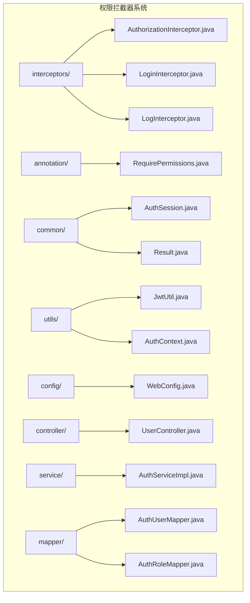
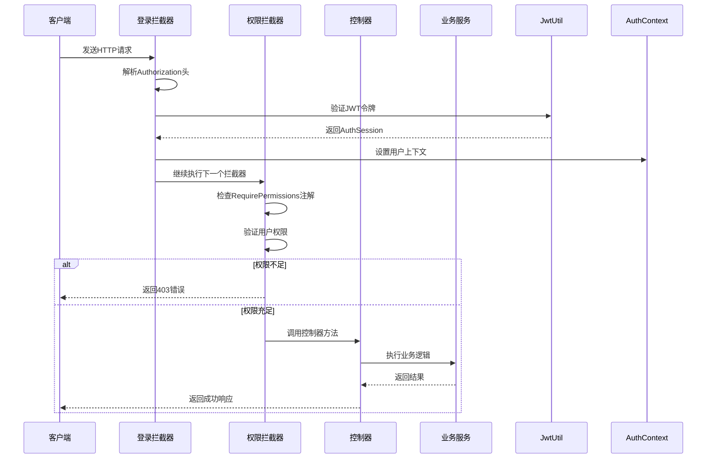
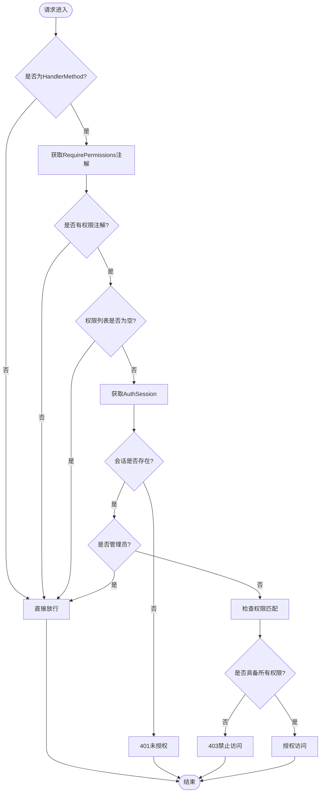
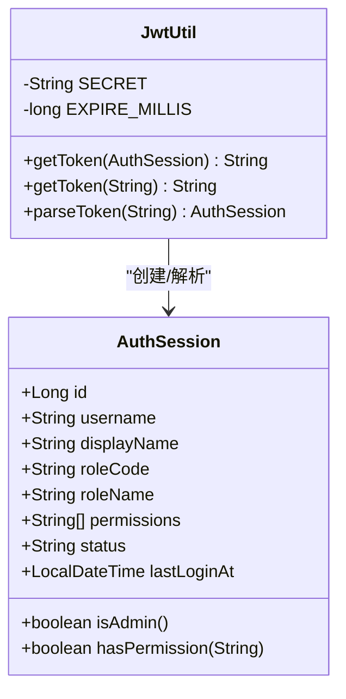
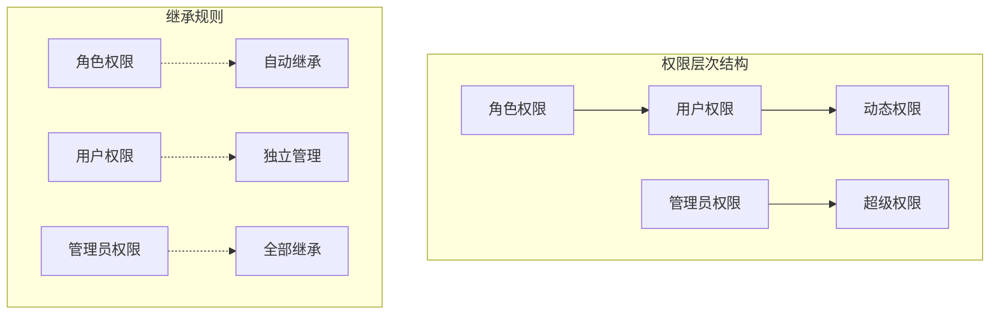
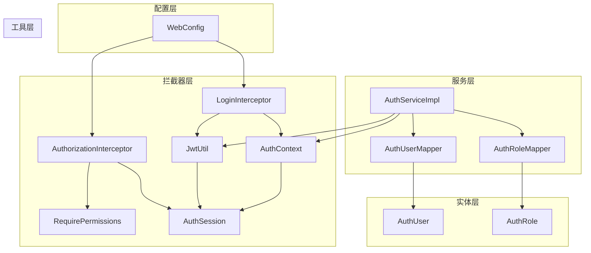

# 权限拦截器


**本文档引用的文件**
- [AuthorizationInterceptor.java](file://backend-repo/src/main/java/com/zjcxph/imgapi/interceptors/AuthorizationInterceptor.java)
- [RequirePermissions.java](file://backend-repo/src/main/java/com/zjcxph/imgapi/annotation/RequirePermissions.java)
- [AuthSession.java](file://backend-repo/src/main/java/com/zjcxph/imgapi/common/AuthSession.java)
- [JwtUtil.java](file://backend-repo/src/main/java/com/zjcxph/imgapi/utils/JwtUtil.java)
- [WebConfig.java](file://backend-repo/src/main/java/com/zjcxph/imgapi/config/WebConfig.java)
- [LoginInterceptor.java](file://backend-repo/src/main/java/com/zjcxph/imgapi/interceptors/LoginInterceptor.java)
- [AuthServiceImpl.java](file://backend-repo/src/main/java/com/zjcxph/imgapi/service/impl/AuthServiceImpl.java)
- [UserController.java](file://backend-repo/src/main/java/com/zjcxph/imgapi/controller/UserController.java)
- [AuthRole.java](file://backend-repo/src/main/java/com/zjcxph/imgapi/entity/AuthRole.java)
- [AuthUser.java](file://backend-repo/src/main/java/com/zjcxph/imgapi/entity/AuthUser.java)
- [Result.java](file://backend-repo/src/main/java/com/zjcxph/imgapi/common/Result.java)


## 目录
1. [简介](#简介)
2. [项目结构](#项目结构)
3. [核心组件](#核心组件)
4. [架构概览](#架构概览)
5. [详细组件分析](#详细组件分析)
6. [依赖关系分析](#依赖关系分析)
7. [性能考虑](#性能考虑)
8. [故障排除指南](#故障排除指南)
9. [结论](#结论)
10. [附录](#附录)

## 简介

MRR项目的权限拦截器系统基于Spring MVC拦截器实现，采用JWT令牌验证和基于注解的权限控制机制。该系统提供了细粒度的权限管理能力，支持管理员权限的特殊处理、权限继承规则以及灵活的权限扩展。

系统的核心设计目标是：
- 提供透明的权限控制机制
- 支持声明式的权限注解
- 实现高效的JWT令牌验证
- 确保权限检查的可维护性和可扩展性

## 项目结构

权限拦截器系统主要分布在以下目录结构中：



**图表来源**
- [AuthorizationInterceptor.java:1-78](file://backend-repo/src/main/java/com/zjcxph/imgapi/interceptors/AuthorizationInterceptor.java#L1-L78)
- [RequirePermissions.java:1-13](file://backend-repo/src/main/java/com/zjcxph/imgapi/annotation/RequirePermissions.java#L1-L13)

**章节来源**
- [AuthorizationInterceptor.java:1-78](file://backend-repo/src/main/java/com/zjcxph/imgapi/interceptors/AuthorizationInterceptor.java#L1-L78)
- [WebConfig.java:1-61](file://backend-repo/src/main/java/com/zjcxph/imgapi/config/WebConfig.java#L1-L61)

## 核心组件

### 权限拦截器（AuthorizationInterceptor）

权限拦截器是整个权限系统的核心组件，负责在请求到达控制器之前进行权限验证。其主要职责包括：

- 检查控制器方法是否标注了权限注解
- 验证用户会话的有效性
- 执行权限匹配逻辑
- 处理权限验证失败的情况

### 权限注解（RequirePermissions）

RequirePermissions是一个简单的注解，用于声明式地指定方法或类所需的权限。其特点：
- 支持方法级别和类级别的权限声明
- 允许指定多个权限要求
- 采用数组形式定义权限列表

### 认证会话（AuthSession）

AuthSession是权限系统中的核心数据结构，封装了用户的认证和授权信息：

- 用户标识信息：id、username、displayName
- 角色信息：roleCode、roleName
- 权限集合：permissions列表
- 状态信息：status、lastLoginAt
- 管理员判断：isAdmin()方法
- 权限查询：hasPermission()方法

**章节来源**
- [AuthorizationInterceptor.java:17-78](file://backend-repo/src/main/java/com/zjcxph/imgapi/interceptors/AuthorizationInterceptor.java#L17-L78)
- [RequirePermissions.java:8-12](file://backend-repo/src/main/java/com/zjcxph/imgapi/annotation/RequirePermissions.java#L8-L12)
- [AuthSession.java:7-89](file://backend-repo/src/main/java/com/zjcxph/imgapi/common/AuthSession.java#L7-L89)

## 架构概览

MRR项目的权限拦截器系统采用分层架构设计，通过拦截器链实现请求的权限控制：



**图表来源**
- [LoginInterceptor.java:29-52](file://backend-repo/src/main/java/com/zjcxph/imgapi/interceptors/LoginInterceptor.java#L29-L52)
- [AuthorizationInterceptor.java:22-56](file://backend-repo/src/main/java/com/zjcxph/imgapi/interceptors/AuthorizationInterceptor.java#L22-L56)
- [JwtUtil.java:61-75](file://backend-repo/src/main/java/com/zjcxph/imgapi/utils/JwtUtil.java#L61-L75)

系统架构的关键特性：
- **拦截器链**：登录拦截器先于权限拦截器执行
- **JWT验证**：使用Auth0库进行令牌解析和验证
- **线程安全**：通过ThreadLocal管理用户上下文
- **声明式权限**：基于注解的权限控制机制

## 详细组件分析

### 权限拦截器实现分析

#### 核心验证流程



**图表来源**
- [AuthorizationInterceptor.java:22-56](file://backend-repo/src/main/java/com/zjcxph/imgapi/interceptors/AuthorizationInterceptor.java#L22-L56)

#### 管理员权限特殊处理

管理员权限具有最高优先级，系统通过以下规则识别管理员：

1. **角色码检查**：当roleCode为"ADMIN"时直接放行
2. **权限检查**：检查是否包含"user:manage"或"role:manage"权限
3. **权限继承**：管理员自动继承所有其他权限

管理员权限的判断逻辑：
- 传统管理员：roleCode="ADMIN"
- 功能管理员：拥有"user:manage"或"role:manage"权限
- 权限继承：管理员拥有所有其他权限

**章节来源**
- [AuthorizationInterceptor.java:70-76](file://backend-repo/src/main/java/com/zjcxph/imgapi/interceptors/AuthorizationInterceptor.java#L70-L76)
- [AuthSession.java:81-84](file://backend-repo/src/main/java/com/zjcxph/imgapi/common/AuthSession.java#L81-L84)

### JWT令牌验证机制

#### 令牌生成流程



**图表来源**
- [JwtUtil.java:12-77](file://backend-repo/src/main/java/com/zjcxph/imgapi/utils/JwtUtil.java#L12-L77)
- [AuthSession.java:7-89](file://backend-repo/src/main/java/com/zjcxph/imgapi/common/AuthSession.java#L7-L89)

#### 令牌解析过程

令牌解析采用HMAC256算法验证签名，并从载荷中提取用户信息：

1. **环境变量配置**：从JWT_SECRET_KEY读取密钥
2. **默认密钥**：如果未设置则使用内置默认值
3. **载荷提取**：解析id、username、displayName等基础信息
4. **权限数组**：提取permissions数组并转换为列表
5. **时间验证**：自动验证令牌过期时间

**章节来源**
- [JwtUtil.java:14-58](file://backend-repo/src/main/java/com/zjcxph/imgapi/utils/JwtUtil.java#L14-L58)
- [JwtUtil.java:61-75](file://backend-repo/src/main/java/com/zjcxph/imgapi/utils/JwtUtil.java#L61-L75)

### 权限注解使用方法

RequirePermissions注解支持多种使用方式：

#### 方法级别使用
```java
@RequirePermissions({"user:manage", "role:read"})
@GetMapping("/users")
public Result<List&lt;User&gt;> getUsers() {
    // 方法实现
}
```

#### 类级别使用
```java
@RequirePermissions({"role:read"})
@RestController
@RequestMapping("/api")
public class UserController {
    // 所有方法都需要role:read权限
}
```

#### 多权限组合
```java
@RequirePermissions({"user:create", "user:update", "user:delete"})
@PostMapping("/users")
public Result&lt;User&gt; createUser(@RequestBody UserRequest request) {
    // 需要同时具备三个权限
}
```

**章节来源**
- [RequirePermissions.java:8-12](file://backend-repo/src/main/java/com/zjcxph/imgapi/annotation/RequirePermissions.java#L8-L12)
- [UserController.java:60-82](file://backend-repo/src/main/java/com/zjcxph/imgapi/controller/UserController.java#L60-L82)

### 权限存储机制

#### 用户权限存储

用户权限通过多种方式存储和管理：

1. **数据库存储**：AuthUser实体中的permissionsCsv字段
2. **内存缓存**：AuthSession中的permissions列表
3. **角色继承**：AuthRole实体中的permissions字段

权限数据的转换流程：
- 数据库CSV格式 → 内存列表格式
- 去重和标准化处理
- 缓存到AuthSession对象

**章节来源**
- [AuthUser.java:116-132](file://backend-repo/src/main/java/com/zjcxph/imgapi/entity/AuthUser.java#L116-L132)
- [AuthServiceImpl.java:136-145](file://backend-repo/src/main/java/com/zjcxph/imgapi/service/impl/AuthServiceImpl.java#L136-L145)

### 权限继承规则

系统实现了灵活的权限继承机制：



权限继承的具体实现：
- **角色到用户**：用户自动继承所属角色的所有权限
- **用户到会话**：登录时将用户权限加载到AuthSession
- **管理员特殊处理**：管理员自动获得所有权限

**章节来源**
- [AuthRole.java](file://backend-repo/src/main/java/com/zjcxph/imgapi/entity/AuthRole.java#L10)
- [AuthUser.java:116-132](file://backend-repo/src/main/java/com/zjcxph/imgapi/entity/AuthUser.java#L116-L132)

## 依赖关系分析

### 组件依赖图



**图表来源**
- [WebConfig.java:14-21](file://backend-repo/src/main/java/com/zjcxph/imgapi/config/WebConfig.java#L14-L21)
- [LoginInterceptor.java:3-6](file://backend-repo/src/main/java/com/zjcxph/imgapi/interceptors/LoginInterceptor.java#L3-L6)
- [AuthorizationInterceptor.java:3-9](file://backend-repo/src/main/java/com/zjcxph/imgapi/interceptors/AuthorizationInterceptor.java#L3-L9)

### 关键依赖关系

1. **拦截器依赖**：LoginInterceptor依赖JwtUtil进行令牌验证
2. **权限依赖**：AuthorizationInterceptor依赖AuthSession进行权限检查
3. **配置依赖**：WebConfig配置拦截器注册和路径映射
4. **服务依赖**：AuthServiceImpl依赖数据库映射器和工具类

**章节来源**
- [WebConfig.java:24-47](file://backend-repo/src/main/java/com/zjcxph/imgapi/config/WebConfig.java#L24-L47)
- [LoginInterceptor.java:30-52](file://backend-repo/src/main/java/com/zjcxph/imgapi/interceptors/LoginInterceptor.java#L30-L52)

## 性能考虑

### 拦截器性能优化

1. **早期返回**：对于非HandlerMethod请求直接放行
2. **空注解检查**：避免不必要的权限检查
3. **会话复用**：通过ThreadLocal减少重复查询
4. **权限缓存**：权限列表在会话中缓存

### JWT令牌优化

1. **最小化载荷**：只包含必要的用户信息
2. **合理过期时间**：24小时过期时间平衡安全性与性能
3. **密钥管理**：支持环境变量配置提高安全性

### 内存使用优化

1. **权限列表去重**：登录时对权限进行去重处理
2. **字符串池化**：权限字符串的高效存储
3. **及时清理**：请求完成后清理ThreadLocal上下文

## 故障排除指南

### 常见权限问题

#### 401 未授权错误
**可能原因**：
- 缺少Authorization头
- JWT令牌格式不正确
- 令牌已过期
- 令牌签名验证失败

**解决方案**：
1. 确认客户端正确发送Authorization头
2. 验证JWT_SECRET_KEY配置
3. 检查服务器时间同步
4. 重新登录获取新令牌

#### 403 禁止访问错误
**可能原因**：
- 用户权限不足
- 未满足所有必需权限
- 管理员权限配置错误

**解决方案**：
1. 检查用户实际拥有的权限
2. 验证RequirePermissions注解的权限列表
3. 确认管理员权限配置

#### 权限继承问题
**可能原因**：
- 角色权限未正确配置
- 用户权限更新未生效
- 权限缓存未刷新

**解决方案**：
1. 检查AuthRole的permissions字段
2. 确认用户权限更新流程
3. 清除权限缓存后重新登录

**章节来源**
- [LoginInterceptor.java:59-67](file://backend-repo/src/main/java/com/zjcxph/imgapi/interceptors/LoginInterceptor.java#L59-L67)
- [AuthorizationInterceptor.java:58-68](file://backend-repo/src/main/java/com/zjcxph/imgapi/interceptors/AuthorizationInterceptor.java#L58-L68)

### 错误响应格式

系统提供统一的错误响应格式：

```json
{
    "code": 401,
    "message": "Please login first",
    "timestamp": "2024-01-01T12:00:00"
}
```

错误类型及对应状态码：
- **401 未授权**：未登录或令牌无效
- **403 禁止访问**：权限不足
- **400 服务器内部错误**：服务器异常

**章节来源**
- [AuthorizationInterceptor.java:58-68](file://backend-repo/src/main/java/com/zjcxph/imgapi/interceptors/AuthorizationInterceptor.java#L58-L68)
- [LoginInterceptor.java:59-67](file://backend-repo/src/main/java/com/zjcxph/imgapi/interceptors/LoginInterceptor.java#L59-L67)

## 结论

MRR项目的权限拦截器系统通过精心设计的架构实现了高效、灵活且安全的权限控制机制。系统的主要优势包括：

1. **声明式权限控制**：通过RequirePermissions注解实现直观的权限声明
2. **管理员特权机制**：提供灵活的管理员权限处理
3. **JWT集成**：采用标准的JWT令牌进行身份验证
4. **可扩展性**：支持自定义权限类型的扩展
5. **性能优化**：通过多种机制确保系统的高性能运行

该系统为MRR项目提供了坚实的安全基础，能够有效保护系统资源并支持未来的功能扩展。

## 附录

### 配置示例

#### 拦截器配置
```java
@Configuration
public class WebConfig implements WebMvcConfigurer {
    
    @Override
    public void addInterceptors(InterceptorRegistry registry) {
        // 注册登录拦截器（排除公共路径）
        registry.addInterceptor(loginInterceptor)
                .addPathPatterns("/**")
                .excludePathPatterns(
                    "/login",
                    "/v1/auth/login",
                    "/v1/system/**"
                );
                
        // 注册权限拦截器（对所有路径生效）
        registry.addInterceptor(authorizationInterceptor)
                .addPathPatterns("/**");
    }
}
```

#### 权限注解使用示例
```java
@RestController
@RequirePermissions({"role:read"})
public class UserController {
    
    @GetMapping("/users")
    @RequirePermissions({"user:read"})
    public List&lt;User&gt; getUsers() {
        return userService.getAllUsers();
    }
    
    @PostMapping("/users")
    @RequirePermissions({"user:create"})
    public User createUser(@RequestBody CreateUserRequest request) {
        return userService.createUser(request);
    }
}
```

### 最佳实践

1. **权限设计原则**
   - 使用功能导向的权限命名（如user:read、user:create）
   - 避免过度细分权限，保持权限粒度适中
   - 合理使用管理员权限，避免滥用

2. **性能优化建议**
   - 在控制器类级别使用通用权限注解
   - 避免在同一方法上声明过多权限
   - 定期清理无效的权限配置

3. **安全配置建议**
   - 设置合适的JWT过期时间
   - 使用强密码的JWT_SECRET_KEY
   - 定期轮换密钥
   - 实施适当的速率限制

4. **监控和日志**
   - 记录权限验证失败的日志
   - 监控高权限操作的使用情况
   - 定期审计权限分配情况

### 扩展权限系统

#### 自定义权限类型
要添加新的权限类型，需要：

1. **定义权限常量**
```java
public interface PermissionConstants {
    String REPORT_VIEW = "report:view";
    String REPORT_GENERATE = "report:generate";
    String CONFIG_UPDATE = "config:update";
}
```

2. **更新角色权限**
在AuthRole实体中添加新的权限到permissions字段

3. **应用权限注解**
```java
@RequirePermissions({PermissionConstants.REPORT_VIEW})
@GetMapping("/reports")
public List&lt;Report&gt; getReports() {
    // 实现
}
```

4. **权限验证流程**
系统会自动处理新权限的验证，无需额外配置

**章节来源**
- [AuthRole.java](file://backend-repo/src/main/java/com/zjcxph/imgapi/entity/AuthRole.java#L10)
- [AuthUser.java:116-132](file://backend-repo/src/main/java/com/zjcxph/imgapi/entity/AuthUser.java#L116-L132)