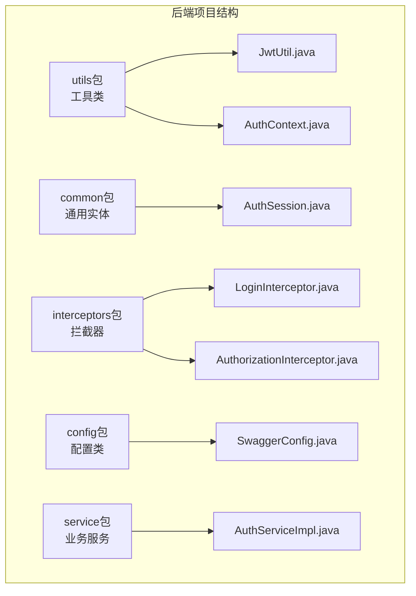
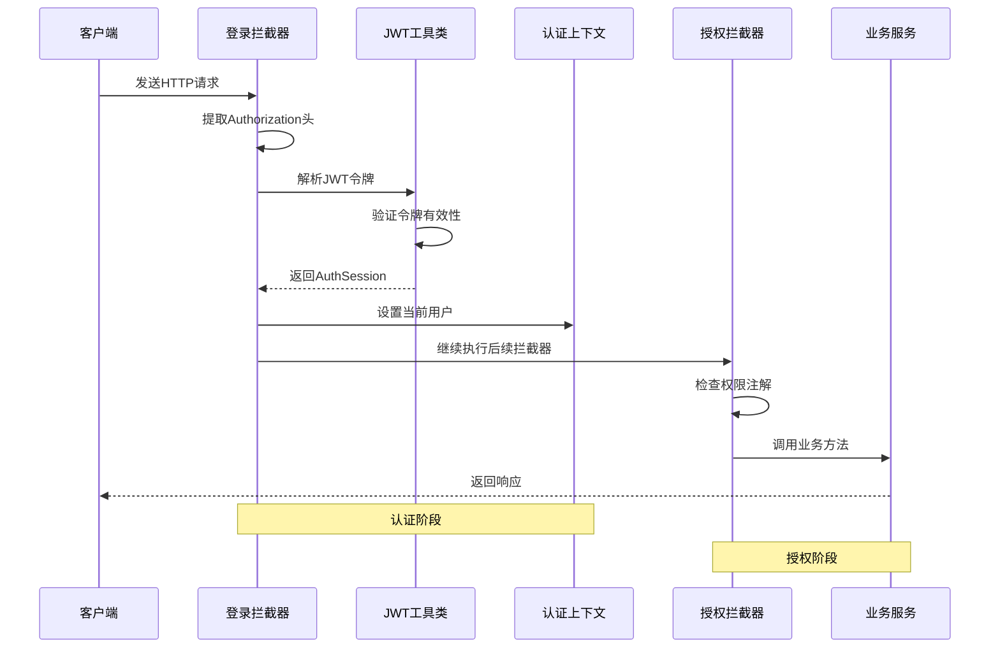
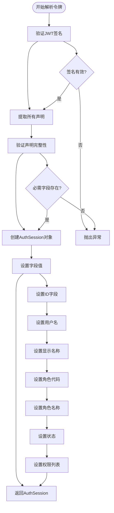
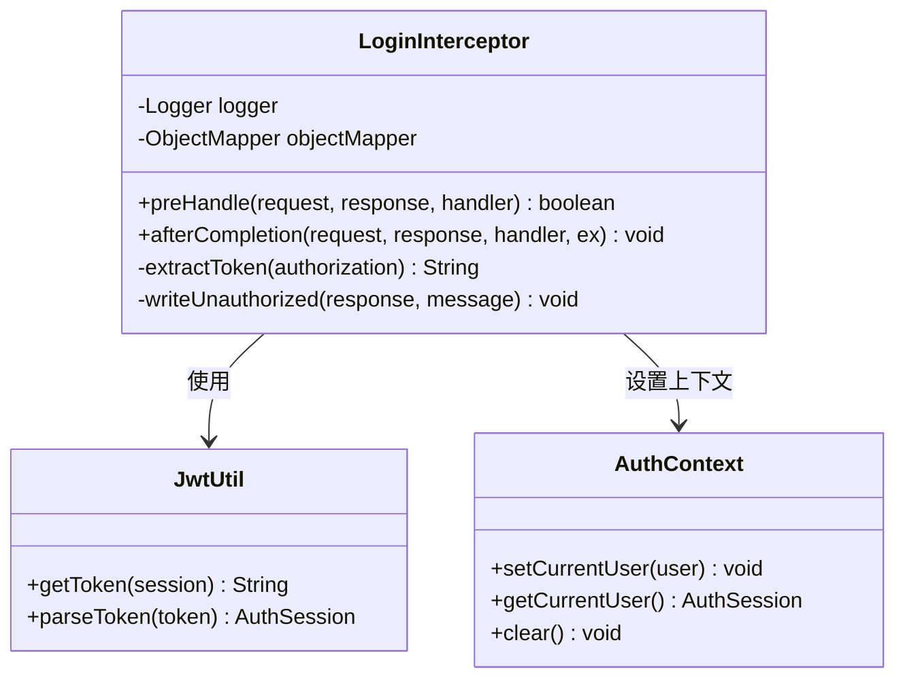
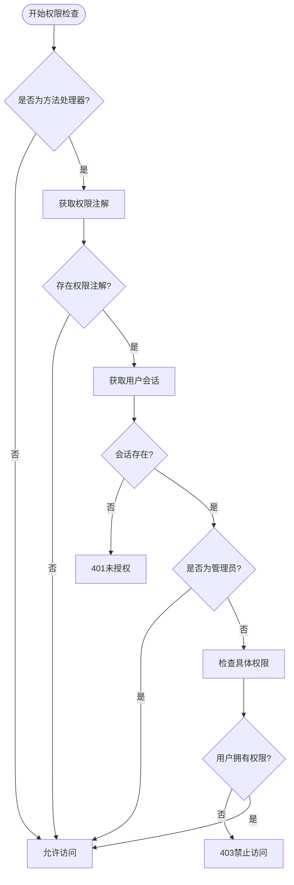
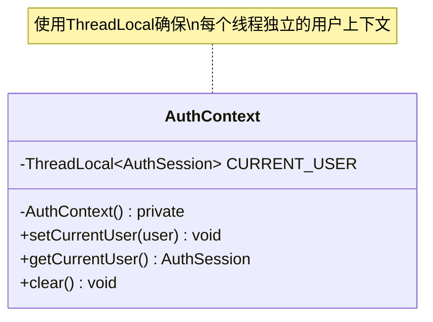
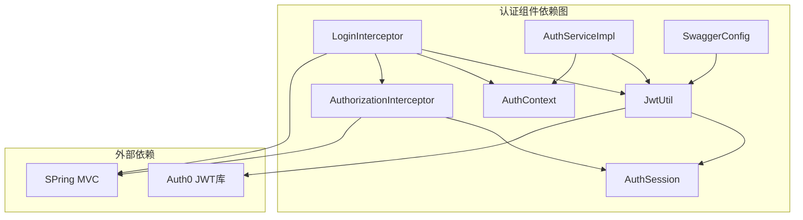

# JWT认证机制


**本文档引用的文件**
- [JwtUtil.java](file://backend-repo/src/main/java/com/zjcxph/imgapi/utils/JwtUtil.java)
- [AuthSession.java](file://backend-repo/src/main/java/com/zjcxph/imgapi/common/AuthSession.java)
- [LoginInterceptor.java](file://backend-repo/src/main/java/com/zjcxph/imgapi/interceptors/LoginInterceptor.java)
- [AuthorizationInterceptor.java](file://backend-repo/src/main/java/com/zjcxph/imgapi/interceptors/AuthorizationInterceptor.java)
- [AuthContext.java](file://backend-repo/src/main/java/com/zjcxph/imgapi/utils/AuthContext.java)
- [AuthServiceImpl.java](file://backend-repo/src/main/java/com/zjcxph/imgapi/service/impl/AuthServiceImpl.java)
- [SwaggerConfig.java](file://backend-repo/src/main/java/com/zjcxph/imgapi/config/SwaggerConfig.java)
- [application.properties](file://backend-repo/src/main/resources/application.properties)


## 目录
1. [简介](#简介)
2. [项目结构](#项目结构)
3. [核心组件](#核心组件)
4. [架构概览](#架构概览)
5. [详细组件分析](#详细组件分析)
6. [依赖关系分析](#依赖关系分析)
7. [性能考虑](#性能考虑)
8. [故障排除指南](#故障排除指南)
9. [结论](#结论)

## 简介

MRR项目的JWT认证机制基于Java JWT库实现，采用HMAC256签名算法，提供24小时有效期的令牌管理。该机制通过拦截器链路实现请求级别的身份验证和授权控制，结合Spring MVC的拦截器机制构建完整的认证体系。

## 项目结构

后端项目采用标准的Maven目录结构，JWT认证相关的代码主要分布在以下包中：



**图表来源**
- [JwtUtil.java:1-77](file://backend-repo/src/main/java/com/zjcxph/imgapi/utils/JwtUtil.java#L1-L77)
- [AuthSession.java:1-90](file://backend-repo/src/main/java/com/zjcxph/imgapi/common/AuthSession.java#L1-L90)

**章节来源**
- [JwtUtil.java:1-77](file://backend-repo/src/main/java/com/zjcxph/imgapi/utils/JwtUtil.java#L1-L77)
- [AuthSession.java:1-90](file://backend-repo/src/main/java/com/zjcxph/imgapi/common/AuthSession.java#L1-L90)

## 核心组件

### JwtUtil工具类

JwtUtil是JWT认证机制的核心工具类，负责令牌的生成、解析和验证。该类采用单例模式设计，提供静态方法供整个应用使用。

**主要特性：**
- **密钥管理**：支持从环境变量JWT_SECRET_KEY读取密钥，若未设置则使用默认密钥
- **令牌生成**：基于AuthSession对象生成JWT令牌，包含用户身份信息和权限数据
- **令牌解析**：验证JWT的有效性并提取用户会话信息
- **签名算法**：使用HMAC256算法确保令牌完整性

**章节来源**
- [JwtUtil.java:12-77](file://backend-repo/src/main/java/com/zjcxph/imgapi/utils/JwtUtil.java#L12-L77)

### AuthSession会话对象

AuthSession是用户会话数据的载体，封装了用户认证后的所有相关信息。

**核心字段：**
- `id`: 用户唯一标识符
- `username`: 用户名
- `displayName`: 显示名称
- `roleCode`: 角色代码
- `roleName`: 角色名称
- `permissions`: 权限列表
- `status`: 用户状态
- `lastLoginAt`: 最后登录时间

**权限判断方法：**
- `isAdmin()`: 判断是否为管理员用户
- `hasPermission(permission)`: 检查用户是否具有指定权限

**章节来源**
- [AuthSession.java:7-90](file://backend-repo/src/main/java/com/zjcxph/imgapi/common/AuthSession.java#L7-L90)

## 架构概览

MRR项目的JWT认证架构采用拦截器链路设计，通过多个拦截器协同完成完整的认证和授权流程。



**图表来源**
- [LoginInterceptor.java:29-52](file://backend-repo/src/main/java/com/zjcxph/imgapi/interceptors/LoginInterceptor.java#L29-L52)
- [JwtUtil.java:61-75](file://backend-repo/src/main/java/com/zjcxph/imgapi/utils/JwtUtil.java#L61-L75)
- [AuthContext.java:12-22](file://backend-repo/src/main/java/com/zjcxph/imgapi/utils/AuthContext.java#L12-L22)

## 详细组件分析

### JWT令牌生成流程

JWT令牌的生成过程遵循以下步骤：

```mermaid
flowchart TD
Start([开始生成令牌]) --> CreateSession[创建AuthSession对象]
CreateSession --> SetExpire[设置过期时间<br/>24小时后]
SetExpire --> AddClaims[添加声明(Claims)]
AddClaims --> SignToken[使用HMAC256签名]
SignToken --> ReturnToken[返回JWT字符串]
AddClaims --> CheckId{是否存在ID?}
CheckId --> |是| AddId[添加id声明]
CheckId --> |否| CheckUsername{是否存在用户名?}
AddId --> CheckUsername
CheckUsername --> |是| AddUsername[添加username声明]
CheckUsername --> |否| CheckDisplayName{是否存在显示名称?}
AddUsername --> CheckDisplayName
CheckDisplayName --> |是| AddDisplayName[添加displayName声明]
CheckDisplayName --> |否| CheckRoleCode{是否存在角色代码?}
AddDisplayName --> CheckRoleCode
CheckRoleCode --> |是| AddRoleCode[添加roleCode声明]
CheckRoleCode --> |否| CheckRoleName{是否存在角色名称?}
AddRoleCode --> CheckRoleName
CheckRoleName --> |是| AddRoleName[添加roleName声明]
CheckRoleName --> |否| CheckStatus{是否存在状态?}
AddRoleName --> CheckStatus
CheckStatus --> |是| AddStatus[添加status声明]
CheckStatus --> |否| CheckPermissions{是否存在权限?}
AddStatus --> CheckPermissions
CheckPermissions --> |是| AddPermissions[添加permissions数组声明]
CheckPermissions --> |否| SignToken
```

**图表来源**
- [JwtUtil.java:28-59](file://backend-repo/src/main/java/com/zjcxph/imgapi/utils/JwtUtil.java#L28-L59)

**章节来源**
- [JwtUtil.java:22-59](file://backend-repo/src/main/java/com/zjcxph/imgapi/utils/JwtUtil.java#L22-L59)

### 令牌解析与验证机制

令牌解析过程包含严格的验证步骤：



**图表来源**
- [JwtUtil.java:61-75](file://backend-repo/src/main/java/com/zjcxph/imgapi/utils/JwtUtil.java#L61-L75)

**章节来源**
- [JwtUtil.java:61-75](file://backend-repo/src/main/java/com/zjcxph/imgapi/utils/JwtUtil.java#L61-L75)

### 登录拦截器实现

登录拦截器负责从HTTP请求中提取和验证JWT令牌：



**图表来源**
- [LoginInterceptor.java:17-69](file://backend-repo/src/main/java/com/zjcxph/imgapi/interceptors/LoginInterceptor.java#L17-L69)
- [JwtUtil.java:22-75](file://backend-repo/src/main/java/com/zjcxph/imgapi/utils/JwtUtil.java#L22-L75)
- [AuthContext.java:5-28](file://backend-repo/src/main/java/com/zjcxph/imgapi/utils/AuthContext.java#L5-L28)

**章节来源**
- [LoginInterceptor.java:29-52](file://backend-repo/src/main/java/com/zjcxph/imgapi/interceptors/LoginInterceptor.java#L29-L52)

### 授权拦截器机制

授权拦截器实现基于注解的权限控制：



**图表来源**
- [AuthorizationInterceptor.java:22-56](file://backend-repo/src/main/java/com/zjcxph/imgapi/interceptors/AuthorizationInterceptor.java#L22-L56)

**章节来源**
- [AuthorizationInterceptor.java:22-56](file://backend-repo/src/main/java/com/zjcxph/imgapi/interceptors/AuthorizationInterceptor.java#L22-L56)

### 认证上下文管理

AuthContext提供线程本地存储的用户会话管理：



**图表来源**
- [AuthContext.java:5-28](file://backend-repo/src/main/java/com/zjcxph/imgapi/utils/AuthContext.java#L5-L28)

**章节来源**
- [AuthContext.java:5-28](file://backend-repo/src/main/java/com/zjcxph/imgapi/utils/AuthContext.java#L5-L28)

## 依赖关系分析

JWT认证机制的组件间依赖关系如下：



**图表来源**
- [JwtUtil.java:3-6](file://backend-repo/src/main/java/com/zjcxph/imgapi/utils/JwtUtil.java#L3-L6)
- [LoginInterceptor.java:3-6](file://backend-repo/src/main/java/com/zjcxph/imgapi/interceptors/LoginInterceptor.java#L3-L6)
- [AuthorizationInterceptor.java:3-4](file://backend-repo/src/main/java/com/zjcxph/imgapi/interceptors/AuthorizationInterceptor.java#L3-L4)

**章节来源**
- [JwtUtil.java:1-11](file://backend-repo/src/main/java/com/zjcxph/imgapi/utils/JwtUtil.java#L1-L11)
- [LoginInterceptor.java:1-16](file://backend-repo/src/main/java/com/zjcxph/imgapi/interceptors/LoginInterceptor.java#L1-L16)

## 性能考虑

### 令牌缓存策略

当前实现中，JWT令牌在每次请求时都会重新解析和验证。对于高并发场景，可以考虑以下优化：

1. **令牌缓存**：对已验证的令牌进行短期缓存
2. **异步验证**：使用异步方式处理令牌验证
3. **批量验证**：对相同用户的连续请求进行批处理验证

### 内存管理

- **ThreadLocal清理**：确保在请求完成后清理ThreadLocal中的用户信息
- **对象池**：考虑使用对象池减少AuthSession对象的创建开销

## 故障排除指南

### 常见问题及解决方案

**令牌验证失败**
- 检查JWT_SECRET_KEY环境变量是否正确设置
- 确认客户端发送的Authorization头格式正确
- 验证令牌是否在24小时有效期内

**权限拒绝访问**
- 检查用户权限列表中是否包含所需的权限
- 确认角色代码是否正确设置
- 验证权限注解的使用是否正确

**会话丢失**
- 确保在请求完成后调用AuthContext.clear()
- 检查线程安全问题
- 验证Spring容器中的拦截器配置

**章节来源**
- [LoginInterceptor.java:46-51](file://backend-repo/src/main/java/com/zjcxph/imgapi/interceptors/LoginInterceptor.java#L46-L51)
- [AuthorizationInterceptor.java:58-68](file://backend-repo/src/main/java/com/zjcxph/imgapi/interceptors/AuthorizationInterceptor.java#L58-L68)

## 结论

MRR项目的JWT认证机制通过简洁而有效的设计实现了完整的身份验证和授权功能。该机制的主要优势包括：

1. **安全性**：采用HMAC256算法和24小时有效期确保令牌安全
2. **可扩展性**：基于拦截器的设计便于功能扩展
3. **易用性**：简单的API接口和清晰的错误处理
4. **性能**：轻量级实现，适合高并发场景

建议在生产环境中进一步完善以下方面：
- 实现令牌刷新机制
- 加强密钥管理策略
- 添加更详细的日志记录
- 考虑分布式环境下的会话同步