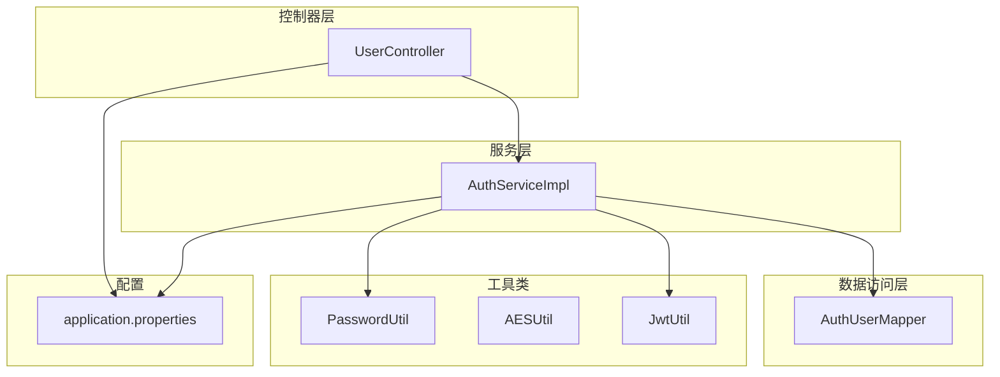
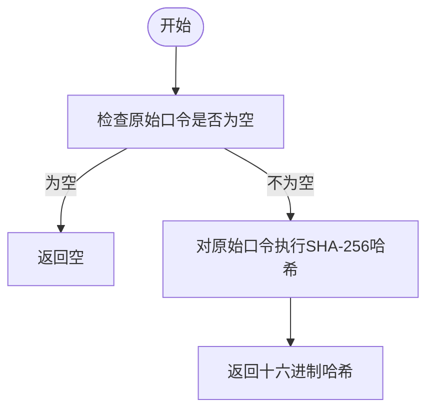
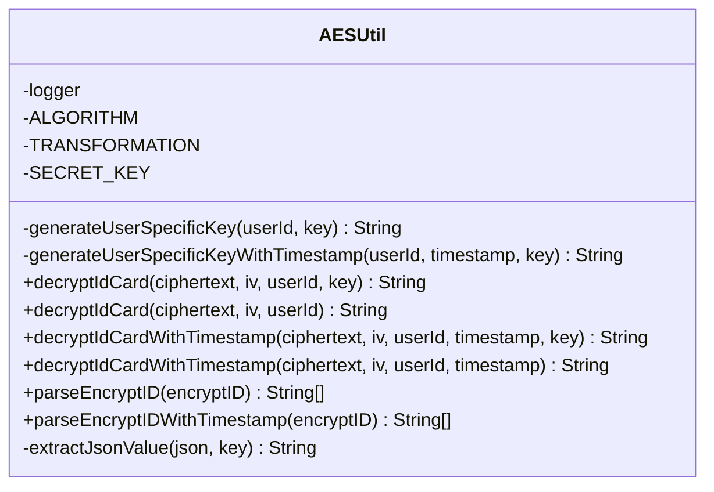
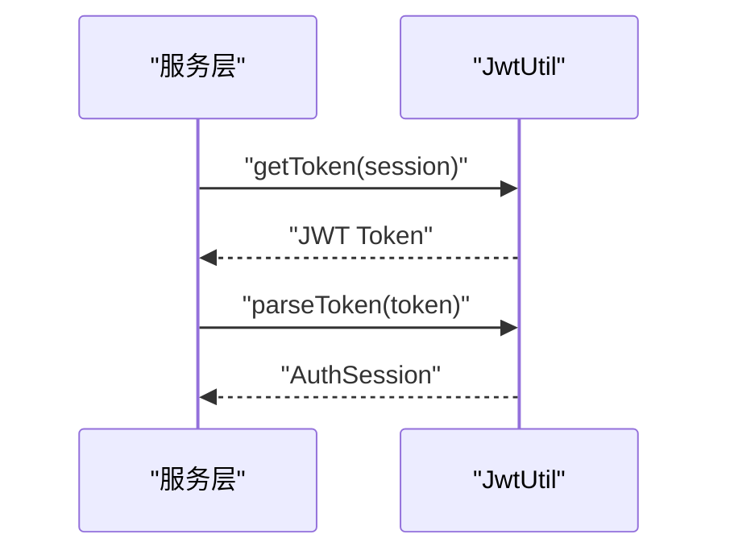
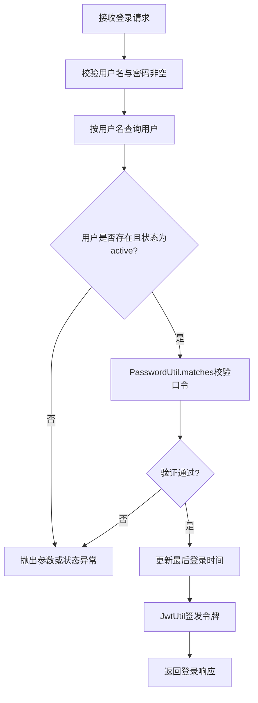
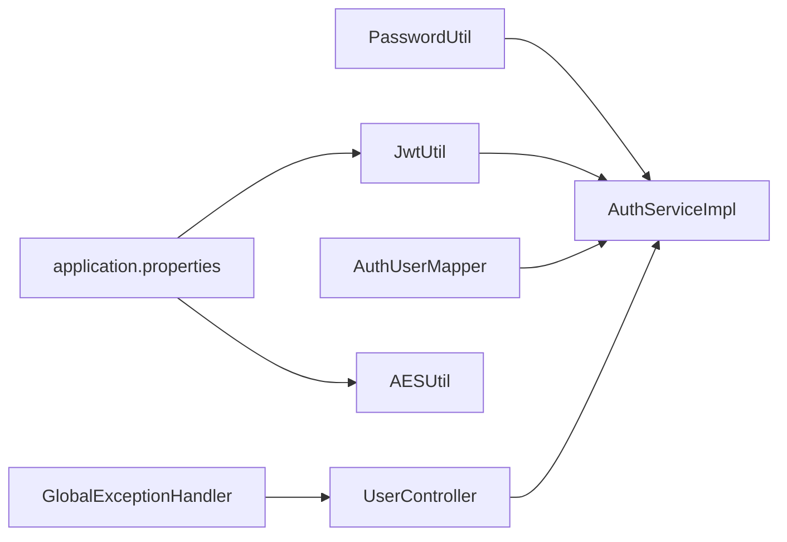

# 密码加密与安全


**本文引用的文件**
- [PasswordUtil.java](file://backend-repo/src/main/java/com/zjcxph/imgapi/utils/PasswordUtil.java)
- [AESUtil.java](file://backend-repo/src/main/java/com/zjcxph/imgapi/utils/AESUtil.java)
- [JwtUtil.java](file://backend-repo/src/main/java/com/zjcxph/imgapi/utils/JwtUtil.java)
- [AuthServiceImpl.java](file://backend-repo/src/main/java/com/zjcxph/imgapi/service/impl/AuthServiceImpl.java)
- [AuthUserMapper.java](file://backend-repo/src/main/java/com/zjcxph/imgapi/mapper/AuthUserMapper.java)
- [UserController.java](file://backend-repo/src/main/java/com/zjcxph/imgapi/controller/UserController.java)
- [application.properties](file://backend-repo/src/main/resources/application.properties)
- [GlobalExceptionHandler.java](file://backend-repo/src/main/java/com/zjcxph/imgapi/handler/GlobalExceptionHandler.java)


## 目录
1. [简介](#简介)
2. [项目结构](#项目结构)
3. [核心组件](#核心组件)
4. [架构总览](#架构总览)
5. [详细组件分析](#详细组件分析)
6. [依赖分析](#依赖分析)
7. [性能考虑](#性能考虑)
8. [故障排查指南](#故障排查指南)
9. [结论](#结论)
10. [附录](#附录)

## 简介
本文件聚焦于 MRR 项目的密码加密与数据安全机制，围绕以下目标展开：
- 深入分析 PasswordUtil 的密码哈希与验证流程，明确算法选择、盐值策略与验证逻辑。
- 解释 AESUtil 的对称加密实现，覆盖密钥生成、初始化向量（IV）使用、加密模式配置及兼容性设计。
- 总结密码策略要求（最小长度、复杂度规则、历史密码限制），并给出可落地的建议。
- 提供敏感数据存储最佳实践：数据库加密、传输加密与静态数据保护。
- 补充密码重置流程、安全审计日志与异常处理机制的设计要点。

## 项目结构
后端采用 Spring Boot 架构，安全相关代码主要集中在工具类与服务层：
- 工具类：PasswordUtil（密码哈希）、AESUtil（对称加解密）、JwtUtil（令牌签发与解析）
- 服务层：AuthServiceImpl（登录、会话构建）
- 数据访问：AuthUserMapper（用户查询与状态更新）
- 控制器：UserController（对外接口）
- 配置：application.properties（数据源、日志、AES 密钥等）
- 全局异常：GlobalExceptionHandler（统一异常处理）



图表来源
- [UserController.java:1-95](file://backend-repo/src/main/java/com/zjcxph/imgapi/controller/UserController.java#L1-L95)
- [AuthServiceImpl.java:1-151](file://backend-repo/src/main/java/com/zjcxph/imgapi/service/impl/AuthServiceImpl.java#L1-L151)
- [AuthUserMapper.java:1-78](file://backend-repo/src/main/java/com/zjcxph/imgapi/mapper/AuthUserMapper.java#L1-L78)
- [PasswordUtil.java:1-24](file://backend-repo/src/main/java/com/zjcxph/imgapi/utils/PasswordUtil.java#L1-L24)
- [AESUtil.java:1-233](file://backend-repo/src/main/java/com/zjcxph/imgapi/utils/AESUtil.java#L1-L233)
- [JwtUtil.java:1-77](file://backend-repo/src/main/java/com/zjcxph/imgapi/utils/JwtUtil.java#L1-L77)
- [application.properties:1-49](file://backend-repo/src/main/resources/application.properties#L1-L49)

章节来源
- [UserController.java:1-95](file://backend-repo/src/main/java/com/zjcxph/imgapi/controller/UserController.java#L1-L95)
- [AuthServiceImpl.java:1-151](file://backend-repo/src/main/java/com/zjcxph/imgapi/service/impl/AuthServiceImpl.java#L1-L151)
- [AuthUserMapper.java:1-78](file://backend-repo/src/main/java/com/zjcxph/imgapi/mapper/AuthUserMapper.java#L1-L78)
- [PasswordUtil.java:1-24](file://backend-repo/src/main/java/com/zjcxph/imgapi/utils/PasswordUtil.java#L1-L24)
- [AESUtil.java:1-233](file://backend-repo/src/main/java/com/zjcxph/imgapi/utils/AESUtil.java#L1-L233)
- [JwtUtil.java:1-77](file://backend-repo/src/main/java/com/zjcxph/imgapi/utils/JwtUtil.java#L1-L77)
- [application.properties:1-49](file://backend-repo/src/main/resources/application.properties#L1-L49)

## 核心组件
- PasswordUtil：提供 SHA-256 哈希与明文匹配验证，用于用户口令存储与校验。
- AESUtil：提供基于 AES/CBC/PKCS5Padding 的加解密能力，支持用户级密钥派生与时间戳兼容。
- JwtUtil：基于 HMAC256 的 JWT 签发与解析，承载会话信息并设置过期时间。
- AuthServiceImpl：登录流程的核心，调用 PasswordUtil 进行口令验证，使用 JwtUtil 生成令牌。
- AuthUserMapper：负责用户信息查询与最后登录时间更新。
- application.properties：定义数据源、日志与 AES 密钥等运行时配置。
- GlobalExceptionHandler：统一捕获业务异常与参数校验异常，输出标准化响应。

章节来源
- [PasswordUtil.java:1-24](file://backend-repo/src/main/java/com/zjcxph/imgapi/utils/PasswordUtil.java#L1-L24)
- [AESUtil.java:1-233](file://backend-repo/src/main/java/com/zjcxph/imgapi/utils/AESUtil.java#L1-L233)
- [JwtUtil.java:1-77](file://backend-repo/src/main/java/com/zjcxph/imgapi/utils/JwtUtil.java#L1-L77)
- [AuthServiceImpl.java:1-151](file://backend-repo/src/main/java/com/zjcxph/imgapi/service/impl/AuthServiceImpl.java#L1-L151)
- [AuthUserMapper.java:1-78](file://backend-repo/src/main/java/com/zjcxph/imgapi/mapper/AuthUserMapper.java#L1-L78)
- [application.properties:1-49](file://backend-repo/src/main/resources/application.properties#L1-L49)
- [GlobalExceptionHandler.java:1-62](file://backend-repo/src/main/java/com/zjcxph/imgapi/handler/GlobalExceptionHandler.java#L1-L62)

## 架构总览
下图展示登录流程中的关键交互：客户端发起登录请求，控制器调用服务层，服务层通过工具类进行口令验证与令牌签发，并在成功后记录最后登录时间。

```mermaid
sequenceDiagram
participant C as "客户端"
participant UC as "UserController"
participant ASI as "AuthServiceImpl"
participant AUM as "AuthUserMapper"
participant PU as "PasswordUtil"
participant JU as "JwtUtil"
C->>UC : "POST /login"
UC->>ASI : "login(req)"
ASI->>AUM : "findByUsername(username)"
AUM-->>ASI : "AuthUser"
ASI->>PU : "matches(password, passwordHash)"
PU-->>ASI : "布尔结果"
ASI->>AUM : "updateLastLoginAt(id, now)"
ASI->>JU : "getToken(session)"
JU-->>ASI : "JWT Token"
ASI-->>UC : "LoginResponseDTO"
UC-->>C : "Result&lt;LoginResponseDTO&gt;"
```

图表来源
- [UserController.java:38-47](file://backend-repo/src/main/java/com/zjcxph/imgapi/controller/UserController.java#L38-L47)
- [AuthServiceImpl.java:36-62](file://backend-repo/src/main/java/com/zjcxph/imgapi/service/impl/AuthServiceImpl.java#L36-L62)
- [AuthUserMapper.java:16-29](file://backend-repo/src/main/java/com/zjcxph/imgapi/mapper/AuthUserMapper.java#L16-L29)
- [PasswordUtil.java:17-22](file://backend-repo/src/main/java/com/zjcxph/imgapi/utils/PasswordUtil.java#L17-L22)
- [JwtUtil.java:22-59](file://backend-repo/src/main/java/com/zjcxph/imgapi/utils/JwtUtil.java#L22-L59)

## 详细组件分析

### PasswordUtil 组件分析
- 算法选择：采用 SHA-256 哈希，返回十六进制摘要。
- 盐值策略：未使用随机盐，而是直接对原始口令进行哈希；该做法在安全性上存在风险（易受彩虹表攻击）。
- 验证流程：将明文口令再次哈希并与数据库中存储的哈希进行不区分大小写比较。
- 建议改进：引入随机盐（如 UUID）并与哈希值共同存储；或迁移到更现代的口令哈希算法（如 bcrypt、scrypt、argon2）。



图表来源
- [PasswordUtil.java:10-15](file://backend-repo/src/main/java/com/zjcxph/imgapi/utils/PasswordUtil.java#L10-L15)

章节来源
- [PasswordUtil.java:1-24](file://backend-repo/src/main/java/com/zjcxph/imgapi/utils/PasswordUtil.java#L1-L24)

### AESUtil 组件分析
- 算法与模式：AES/CBC/PKCS5Padding，使用 UTF-8 编码与十六进制表示。
- 密钥管理：
  - 默认密钥常量存在于代码中，需通过环境变量覆盖（见配置项）。
  - 支持两种用户级密钥派生方式：带时间戳与不带时间戳，确保密钥长度固定为 32 字节。
- 初始化向量（IV）：从十六进制字符串解析为字节数组，作为解密参数的一部分。
- 兼容性设计：提供解析加密 ID 的方法，支持旧版“ciphertext_iv”与新版 JSON 格式。
- 异常处理：内部捕获异常并记录错误日志，抛出运行时异常以向上游传播。



图表来源
- [AESUtil.java:19-233](file://backend-repo/src/main/java/com/zjcxph/imgapi/utils/AESUtil.java#L19-L233)

章节来源
- [AESUtil.java:1-233](file://backend-repo/src/main/java/com/zjcxph/imgapi/utils/AESUtil.java#L1-L233)
- [application.properties:47-49](file://backend-repo/src/main/resources/application.properties#L47-L49)

### JwtUtil 组件分析
- 签发：基于 HMAC256 算法，设置过期时间为 24 小时；将用户会话信息（如 id、username、角色、权限等）作为声明。
- 解析：使用相同密钥验证签名并提取声明，构造 AuthSession。
- 安全要点：密钥来自环境变量，若未配置则使用内置默认值，生产环境务必替换。



图表来源
- [JwtUtil.java:22-75](file://backend-repo/src/main/java/com/zjcxph/imgapi/utils/JwtUtil.java#L22-L75)

章节来源
- [JwtUtil.java:1-77](file://backend-repo/src/main/java/com/zjcxph/imgapi/utils/JwtUtil.java#L1-L77)

### 登录流程与安全控制
- 参数校验：用户名与密码均不能为空。
- 账号状态：仅当状态为“active”时允许登录。
- 口令验证：通过 PasswordUtil.matches 进行哈希比对。
- 会话与令牌：成功后更新最后登录时间并签发 JWT。
- 权限控制：控制器层使用注解进行权限校验。



图表来源
- [AuthServiceImpl.java:36-62](file://backend-repo/src/main/java/com/zjcxph/imgapi/service/impl/AuthServiceImpl.java#L36-L62)
- [AuthUserMapper.java:16-29](file://backend-repo/src/main/java/com/zjcxph/imgapi/mapper/AuthUserMapper.java#L16-L29)
- [PasswordUtil.java:17-22](file://backend-repo/src/main/java/com/zjcxph/imgapi/utils/PasswordUtil.java#L17-L22)
- [JwtUtil.java:22-59](file://backend-repo/src/main/java/com/zjcxph/imgapi/utils/JwtUtil.java#L22-L59)

章节来源
- [AuthServiceImpl.java:1-151](file://backend-repo/src/main/java/com/zjcxph/imgapi/service/impl/AuthServiceImpl.java#L1-L151)
- [AuthUserMapper.java:1-78](file://backend-repo/src/main/java/com/zjcxph/imgapi/mapper/AuthUserMapper.java#L1-L78)
- [UserController.java:1-95](file://backend-repo/src/main/java/com/zjcxph/imgapi/controller/UserController.java#L1-L95)

## 依赖分析
- PasswordUtil 与 AESUtil 为纯工具类，无外部依赖。
- JwtUtil 依赖第三方 JWT 库，密钥来源于环境变量。
- AuthServiceImpl 依赖 PasswordUtil、JwtUtil 与 AuthUserMapper。
- 全局异常处理器统一处理业务异常与参数校验异常。



图表来源
- [AuthServiceImpl.java:1-151](file://backend-repo/src/main/java/com/zjcxph/imgapi/service/impl/AuthServiceImpl.java#L1-L151)
- [UserController.java:1-95](file://backend-repo/src/main/java/com/zjcxph/imgapi/controller/UserController.java#L1-L95)
- [application.properties:1-49](file://backend-repo/src/main/resources/application.properties#L1-L49)
- [GlobalExceptionHandler.java:1-62](file://backend-repo/src/main/java/com/zjcxph/imgapi/handler/GlobalExceptionHandler.java#L1-L62)

章节来源
- [AuthServiceImpl.java:1-151](file://backend-repo/src/main/java/com/zjcxph/imgapi/service/impl/AuthServiceImpl.java#L1-L151)
- [GlobalExceptionHandler.java:1-62](file://backend-repo/src/main/java/com/zjcxph/imgapi/handler/GlobalExceptionHandler.java#L1-L62)

## 性能考虑
- PasswordUtil 使用 SHA-256，计算开销低，适合高并发场景；但缺乏盐值与自适应迭代次数，安全性不足。
- AESUtil 的解密过程涉及十六进制解析与字符集编码，整体开销较小。
- JWT 的签发与解析为轻量操作，建议结合缓存与合理的过期策略优化会话管理。
- 建议对频繁的登录尝试增加速率限制与账户锁定策略，降低暴力破解风险。

## 故障排查指南
- 登录失败：
  - 检查用户名是否存在且状态为“active”。
  - 确认 PasswordUtil.matches 的哈希值与数据库一致。
  - 查看全局异常处理器返回的错误码与消息。
- 解密失败：
  - 确认 ciphertext 与 iv 为合法的十六进制字符串。
  - 新版本需使用 JSON 格式的加密 ID。
  - 检查 AES 密钥是否正确配置（环境变量）。
- 令牌无效：
  - 确认 JWT_SECRET_KEY 是否正确配置。
  - 检查令牌是否过期。

章节来源
- [AuthServiceImpl.java:36-62](file://backend-repo/src/main/java/com/zjcxph/imgapi/service/impl/AuthServiceImpl.java#L36-L62)
- [GlobalExceptionHandler.java:1-62](file://backend-repo/src/main/java/com/zjcxph/imgapi/handler/GlobalExceptionHandler.java#L1-L62)
- [AESUtil.java:70-99](file://backend-repo/src/main/java/com/zjcxph/imgapi/utils/AESUtil.java#L70-L99)
- [application.properties:14-16](file://backend-repo/src/main/resources/application.properties#L14-L16)

## 结论
- 当前实现具备基本的安全能力：口令经 SHA-256 存储、JWT 令牌签发、AES 对敏感数据进行对称加解密。
- 存在的安全隐患：口令未加盐、默认密钥硬编码、缺少密码复杂度与历史口令限制策略。
- 建议优先事项：引入随机盐与自适应口令哈希算法、密钥外置化、完善密码策略与审计日志。

## 附录

### 密码策略要求（建议）
- 最小长度：≥ 12 位
- 复杂度规则：包含大写字母、小写字母、数字与特殊字符
- 历史口令限制：禁止重复最近 5 次使用的口令
- 账户锁定：连续失败 N 次后临时锁定，超时自动解锁
- 口令轮换：强制每 90 天更换一次

### 敏感数据存储最佳实践
- 数据库加密：对存储的口令与敏感字段（如身份证号）启用透明数据加密（TDE）或应用层加密。
- 传输加密：强制使用 HTTPS/TLS，禁用明文协议。
- 静态数据保护：对日志文件与备份介质进行加密存储，密钥与证书妥善保管。
- 密钥管理：密钥通过硬件安全模块（HSM）或密钥管理服务（KMS）管理，定期轮换。

### 密码重置流程（建议）
- 请求阶段：校验用户身份（邮箱/手机号），发送一次性重置链接或验证码。
- 验证阶段：限制重置窗口（如 10 分钟），防止滥用。
- 更新阶段：重置后立即失效旧口令，记录历史口令，执行复杂度校验。
- 审计阶段：记录重置时间、IP、UA、结果等信息。

### 安全审计日志
- 登录事件：用户名、时间、IP、UA、结果（成功/失败）、设备指纹
- 密钥变更：密钥轮换时间、操作人、旧密钥标识、新密钥标识
- 敏感操作：用户管理、角色变更、密码重置、数据导出等
- 异常事件：参数校验失败、权限拒绝、解密失败、令牌过期

### 异常处理机制
- 业务异常：通过 BusinessException 抛出，由 GlobalExceptionHandler 统一转为标准响应。
- 参数校验异常：ConstraintViolationException 映射为 400 错误。
- 权限异常：IllegalStateException 映射为 403 错误。
- 通用异常：其他未捕获异常映射为 500 错误。

章节来源
- [GlobalExceptionHandler.java:1-62](file://backend-repo/src/main/java/com/zjcxph/imgapi/handler/GlobalExceptionHandler.java#L1-L62)