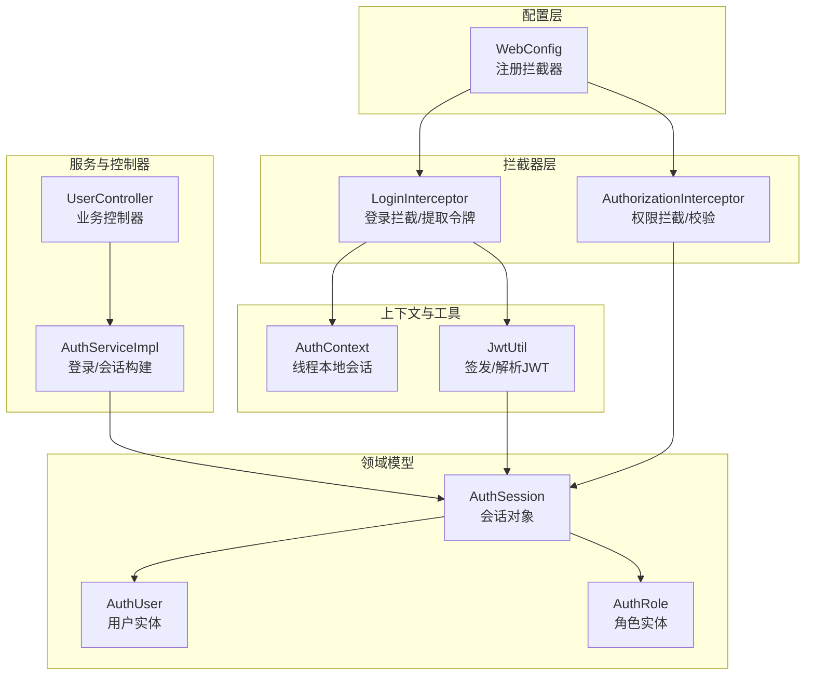
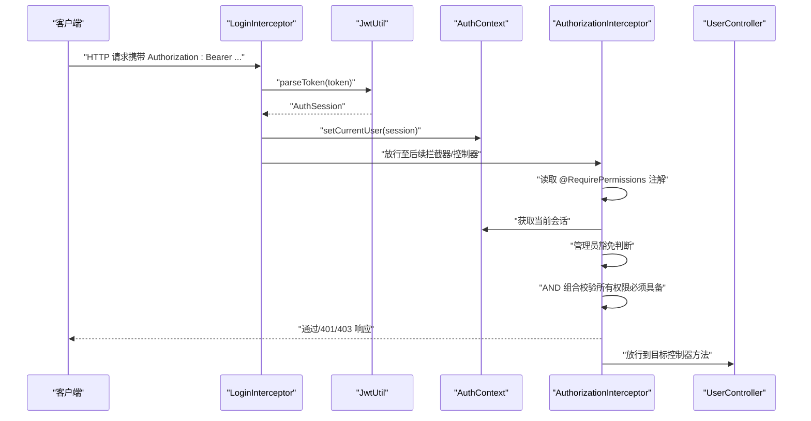
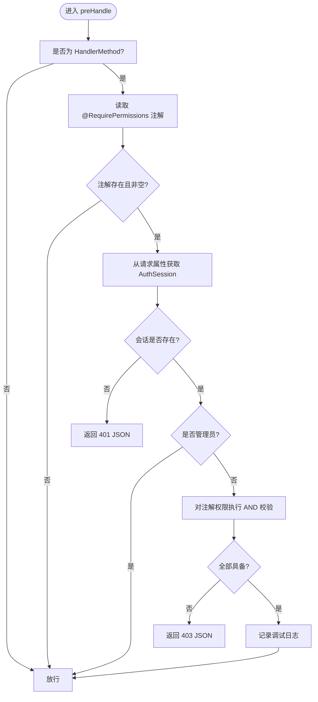
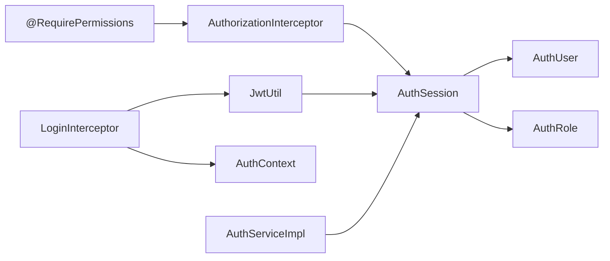

# 权限注解控制

**本文引用的文件**
- [RequirePermissions.java](file://backend-repo/src/main/java/com/zjcxph/imgapi/annotation/RequirePermissions.java)
- [AuthorizationInterceptor.java](file://backend-repo/src/main/java/com/zjcxph/imgapi/interceptors/AuthorizationInterceptor.java)
- [WebConfig.java](file://backend-repo/src/main/java/com/zjcxph/imgapi/config/WebConfig.java)
- [LoginInterceptor.java](file://backend-repo/src/main/java/com/zjcxph/imgapi/interceptors/LoginInterceptor.java)
- [AuthSession.java](file://backend-repo/src/main/java/com/zjcxph/imgapi/common/AuthSession.java)
- [AuthContext.java](file://backend-repo/src/main/java/com/zjcxph/imgapi/utils/AuthContext.java)
- [JwtUtil.java](file://backend-repo/src/main/java/com/zjcxph/imgapi/utils/JwtUtil.java)
- [AuthUser.java](file://backend-repo/src/main/java/com/zjcxph/imgapi/entity/AuthUser.java)
- [AuthRole.java](file://backend-repo/src/main/java/com/zjcxph/imgapi/entity/AuthRole.java)
- [AuthServiceImpl.java](file://backend-repo/src/main/java/com/zjcxph/imgapi/service/impl/AuthServiceImpl.java)
- [UserController.java](file://backend-repo/src/main/java/com/zjcxph/imgapi/controller/UserController.java)

## 目录
1. [简介](#简介)
2. [项目结构](#项目结构)
3. [核心组件](#核心组件)
4. [架构总览](#架构总览)
5. [详细组件分析](#详细组件分析)
6. [依赖分析](#依赖分析)
7. [性能考虑](#性能考虑)
8. [故障排查指南](#故障排查指南)
9. [结论](#结论)
10. [附录](#附录)

## 简介
本文件针对 MRR 项目的权限注解控制系统进行深入技术文档化，重点覆盖以下方面：
- 自定义注解 @RequirePermissions 的设计理念与实现机制（参数定义、权限表达式解析与执行时机）
- 拦截器 AuthorizationInterceptor 的工作原理（请求拦截、权限验证、异常处理与响应返回）
- 权限继承关系与权限组合逻辑（AND 组合语义）
- 权限配置最佳实践（粒度划分、角色映射、动态权限更新）
- 权限缓存策略、性能优化与调试技巧
- 在控制器方法与类级别使用权限注解的实际示例

## 项目结构
权限控制体系由“注解 + 拦截器 + 会话上下文 + JWT 工具 + 实体与服务”协同构成，整体围绕 Spring MVC 拦截器链展开。

图表来源
- [WebConfig.java:24-59](file://backend-repo/src/main/java/com/zjcxph/imgapi/config/WebConfig.java#L24-L59)
- [LoginInterceptor.java:29-52](file://backend-repo/src/main/java/com/zjcxph/imgapi/interceptors/LoginInterceptor.java#L29-L52)
- [AuthorizationInterceptor.java:22-56](file://backend-repo/src/main/java/com/zjcxph/imgapi/interceptors/AuthorizationInterceptor.java#L22-L56)
- [AuthContext.java:5-27](file://backend-repo/src/main/java/com/zjcxph/imgapi/utils/AuthContext.java#L5-L27)
- [JwtUtil.java:61-75](file://backend-repo/src/main/java/com/zjcxph/imgapi/utils/JwtUtil.java#L61-L75)
- [AuthUser.java:116-132](file://backend-repo/src/main/java/com/zjcxph/imgapi/entity/AuthUser.java#L116-L132)
- [AuthRole.java:37-43](file://backend-repo/src/main/java/com/zjcxph/imgapi/entity/AuthRole.java#L37-L43)
- [AuthSession.java:81-88](file://backend-repo/src/main/java/com/zjcxph/imgapi/common/AuthSession.java#L81-L88)
- [AuthServiceImpl.java:107-145](file://backend-repo/src/main/java/com/zjcxph/imgapi/service/impl/AuthServiceImpl.java#L107-L145)
- [UserController.java:59-93](file://backend-repo/src/main/java/com/zjcxph/imgapi/controller/UserController.java#L59-L93)

章节来源
- [WebConfig.java:12-59](file://backend-repo/src/main/java/com/zjcxph/imgapi/config/WebConfig.java#L12-L59)

## 核心组件
- 自定义注解：@RequirePermissions，用于声明控制器方法或类所需的权限集合
- 登录拦截器：从请求头提取 Bearer Token，解析为 AuthSession 并注入到请求属性与线程上下文
- 权限拦截器：读取注解、获取会话、判定管理员豁免、执行 AND 组合校验
- 会话与上下文：AuthSession 封装用户身份与权限；AuthContext 提供线程本地存储
- JWT 工具：签发含权限数组的 JWT，并解析回 AuthSession
- 用户/角色实体：承载权限字符串与角色信息，服务层负责拆分与装配

章节来源
- [RequirePermissions.java:8-12](file://backend-repo/src/main/java/com/zjcxph/imgapi/annotation/RequirePermissions.java#L8-L12)
- [LoginInterceptor.java:29-52](file://backend-repo/src/main/java/com/zjcxph/imgapi/interceptors/LoginInterceptor.java#L29-L52)
- [AuthorizationInterceptor.java:22-56](file://backend-repo/src/main/java/com/zjcxph/imgapi/interceptors/AuthorizationInterceptor.java#L22-L56)
- [AuthSession.java:7-88](file://backend-repo/src/main/java/com/zjcxph/imgapi/common/AuthSession.java#L7-L88)
- [AuthContext.java:5-27](file://backend-repo/src/main/java/com/zjcxph/imgapi/utils/AuthContext.java#L5-L27)
- [JwtUtil.java:28-75](file://backend-repo/src/main/java/com/zjcxph/imgapi/utils/JwtUtil.java#L28-L75)
- [AuthUser.java:116-132](file://backend-repo/src/main/java/com/zjcxph/imgapi/entity/AuthUser.java#L116-L132)
- [AuthRole.java:37-43](file://backend-repo/src/main/java/com/zjcxph/imgapi/entity/AuthRole.java#L37-L43)
- [AuthServiceImpl.java:107-145](file://backend-repo/src/main/java/com/zjcxph/imgapi/service/impl/AuthServiceImpl.java#L107-L145)

## 架构总览
下图展示了从请求进入应用到权限校验完成的关键交互路径。

图表来源
- [LoginInterceptor.java:29-52](file://backend-repo/src/main/java/com/zjcxph/imgapi/interceptors/LoginInterceptor.java#L29-L52)
- [JwtUtil.java:61-75](file://backend-repo/src/main/java/com/zjcxph/imgapi/utils/JwtUtil.java#L61-L75)
- [AuthContext.java:12-22](file://backend-repo/src/main/java/com/zjcxph/imgapi/utils/AuthContext.java#L12-L22)
- [AuthorizationInterceptor.java:22-56](file://backend-repo/src/main/java/com/zjcxph/imgapi/interceptors/AuthorizationInterceptor.java#L22-L56)
- [UserController.java:59-93](file://backend-repo/src/main/java/com/zjcxph/imgapi/controller/UserController.java#L59-L93)

## 详细组件分析

### 自定义注解 RequirePermissions
- 设计理念
  - 通过元注解限定作用范围（方法与类），便于在类级别统一声明权限策略
  - 使用字符串数组作为权限集合，天然支持“AND”组合（所有权限必须满足）
- 参数定义
  - value(): 字符串数组，默认为空数组
- 解析与执行时机
  - 在权限拦截器中读取方法注解，若方法未标注则回退到类级注解
  - 若注解不存在或为空，则跳过权限校验（放行）

章节来源
- [RequirePermissions.java:8-12](file://backend-repo/src/main/java/com/zjcxph/imgapi/annotation/RequirePermissions.java#L8-L12)
- [AuthorizationInterceptor.java:29-35](file://backend-repo/src/main/java/com/zjcxph/imgapi/interceptors/AuthorizationInterceptor.java#L29-L35)

### AuthorizationInterceptor 权限拦截器
- 请求拦截
  - 仅对 HandlerMethod 进行处理；静态资源等直接放行
- 权限验证
  - 优先读取方法级注解，其次回退到类级注解
  - 若注解为空或无值，直接放行
  - 从请求属性中获取 AuthSession；缺失则返回 401
  - 管理员豁免：角色码为 ADMIN 或具备特定管理权限
  - AND 组合校验：注解中的所有权限必须存在于会话权限列表
- 异常处理与响应
  - 未登录：401 JSON 响应
  - 无权限：403 JSON 响应
- 执行时机
  - 在登录拦截器之后、控制器之前执行

图表来源
- [AuthorizationInterceptor.java:22-56](file://backend-repo/src/main/java/com/zjcxph/imgapi/interceptors/AuthorizationInterceptor.java#L22-L56)

章节来源
- [AuthorizationInterceptor.java:18-78](file://backend-repo/src/main/java/com/zjcxph/imgapi/interceptors/AuthorizationInterceptor.java#L18-L78)

### 登录拦截器 LoginInterceptor
- 职责
  - 提取 Authorization 头中的 Bearer Token
  - 使用 JwtUtil 解析为 AuthSession
  - 将 AuthSession 写入请求属性与线程上下文 AuthContext
  - 异常时返回 401 JSON
- 生命周期
  - afterCompletion 中清理线程上下文，避免线程复用导致的数据残留

章节来源
- [LoginInterceptor.java:17-69](file://backend-repo/src/main/java/com/zjcxph/imgapi/interceptors/LoginInterceptor.java#L17-L69)

### 会话与上下文 AuthSession 与 AuthContext
- AuthSession
  - 封装用户标识、角色、权限列表、状态与最后登录时间
  - 提供 isAdmin 与 hasPermission 辅助方法
- AuthContext
  - 基于 ThreadLocal 的线程安全会话持有者
  - 提供 setCurrentUser、getCurrentUser、clear 方法

章节来源
- [AuthSession.java:7-88](file://backend-repo/src/main/java/com/zjcxph/imgapi/common/AuthSession.java#L7-L88)
- [AuthContext.java:5-27](file://backend-repo/src/main/java/com/zjcxph/imgapi/utils/AuthContext.java#L5-L27)

### JWT 工具 JwtUtil
- 职责
  - 签发：将 AuthSession 中的权限数组写入 JWT 的数组声明
  - 解析：从 JWT 中恢复 AuthSession（含权限列表）
- 安全与配置
  - 密钥来自环境变量，未设置时使用默认值
  - 默认有效期 24 小时

章节来源
- [JwtUtil.java:12-77](file://backend-repo/src/main/java/com/zjcxph/imgapi/utils/JwtUtil.java#L12-L77)

### 用户与角色实体
- AuthUser
  - permissionsCsv 字段可拆分为权限列表
  - 提供 hasPermission 辅助方法
- AuthRole
  - permissions 字段描述角色所拥有的权限集合

章节来源
- [AuthUser.java:116-132](file://backend-repo/src/main/java/com/zjcxph/imgapi/entity/AuthUser.java#L116-L132)
- [AuthRole.java:37-43](file://backend-repo/src/main/java/com/zjcxph/imgapi/entity/AuthRole.java#L37-L43)

### 服务层 AuthServiceImpl
- 登录流程
  - 验证用户凭据与状态
  - 更新最近登录时间
  - 构造 AuthSession（含权限列表）
  - 返回 JWT 与会话
- 权限拆分
  - splitPermissions 将逗号分隔的权限字符串拆分为去重后的列表

章节来源
- [AuthServiceImpl.java:36-62](file://backend-repo/src/main/java/com/zjcxph/imgapi/service/impl/AuthServiceImpl.java#L36-L62)
- [AuthServiceImpl.java:107-145](file://backend-repo/src/main/java/com/zjcxph/imgapi/service/impl/AuthServiceImpl.java#L107-L145)

### 控制器使用示例
- 方法级注解
  - 列表用户、更新用户、删除用户均要求 user:manage 权限
  - 列出角色要求 role:read 权限
- 类级注解
  - 可在控制器类上统一声明权限策略，方法未显式声明时回退使用类级注解

章节来源
- [UserController.java:59-93](file://backend-repo/src/main/java/com/zjcxph/imgapi/controller/UserController.java#L59-L93)

## 依赖分析
- 注解与拦截器
  - AuthorizationInterceptor 依赖 RequirePermissions 注解与 AuthSession
- 拦截器链
  - WebConfig 注册 LoginInterceptor 与 AuthorizationInterceptor
  - LoginInterceptor 在 AuthorizationInterceptor 之前执行
- 会话与工具
  - LoginInterceptor 依赖 JwtUtil 与 AuthContext
  - JwtUtil 依赖 AuthSession
- 服务与实体
  - AuthServiceImpl 依赖 AuthUserMapper/AuthRoleMapper，构造 AuthSession 并拆分权限
  - AuthSession 依赖 AuthUser/AuthRole 的权限信息

图表来源
- [RequirePermissions.java:8-12](file://backend-repo/src/main/java/com/zjcxph/imgapi/annotation/RequirePermissions.java#L8-L12)
- [AuthorizationInterceptor.java:22-56](file://backend-repo/src/main/java/com/zjcxph/imgapi/interceptors/AuthorizationInterceptor.java#L22-L56)
- [LoginInterceptor.java:29-52](file://backend-repo/src/main/java/com/zjcxph/imgapi/interceptors/LoginInterceptor.java#L29-L52)
- [JwtUtil.java:61-75](file://backend-repo/src/main/java/com/zjcxph/imgapi/utils/JwtUtil.java#L61-L75)
- [AuthContext.java:12-22](file://backend-repo/src/main/java/com/zjcxph/imgapi/utils/AuthContext.java#L12-L22)
- [AuthServiceImpl.java:107-145](file://backend-repo/src/main/java/com/zjcxph/imgapi/service/impl/AuthServiceImpl.java#L107-L145)
- [AuthUser.java:116-132](file://backend-repo/src/main/java/com/zjcxph/imgapi/entity/AuthUser.java#L116-L132)
- [AuthRole.java:37-43](file://backend-repo/src/main/java/com/zjcxph/imgapi/entity/AuthRole.java#L37-L43)

章节来源
- [WebConfig.java:24-59](file://backend-repo/src/main/java/com/zjcxph/imgapi/config/WebConfig.java#L24-L59)

## 性能考虑
- 权限组合逻辑
  - 当前实现采用“AND 组合”，即注解中列出的所有权限都必须具备才允许访问
  - 对于权限数量较多的方法，建议在服务层进行权限预聚合，减少重复计算
- 缓存策略
  - 会话权限来源于 JWT 声明，可在服务层对用户权限进行短期缓存（如基于 Redis 的会话缓存）
  - 对热点权限查询可引入本地缓存（注意并发与失效策略）
- 线程上下文清理
  - LoginInterceptor.afterCompletion 清理 AuthContext，避免线程复用导致的脏数据
- 序列化与网络开销
  - JWT 中包含权限数组，建议控制权限数量，避免单个 JWT 过大
- 日志与调试
  - 权限拦截器记录调试日志，生产环境可按需关闭或降级

## 故障排查指南
- 401 未授权
  - 检查请求头是否包含有效的 Bearer Token
  - 确认 Token 未过期且签名正确
  - 确认 LoginInterceptor 是否成功解析并写入 AuthSession
- 403 禁止访问
  - 检查 @RequirePermissions 注解中声明的权限是否与会话权限一致
  - 确认会话权限列表是否正确从数据库/角色/用户中加载
  - 排查管理员豁免逻辑是否触发
- 管理员权限
  - 角色码为 ADMIN 或具备 user:manage/role:manage 权限时可豁免
- 调试技巧
  - 开启权限拦截器的日志输出，确认注解读取与 AND 校验结果
  - 在 AuthServiceImpl 中核对 splitPermissions 的拆分逻辑
  - 使用 AuthContext.getCurrentUser 核对当前线程会话

章节来源
- [AuthorizationInterceptor.java:58-68](file://backend-repo/src/main/java/com/zjcxph/imgapi/interceptors/AuthorizationInterceptor.java#L58-L68)
- [LoginInterceptor.java:54-57](file://backend-repo/src/main/java/com/zjcxph/imgapi/interceptors/LoginInterceptor.java#L54-L57)
- [AuthServiceImpl.java:136-145](file://backend-repo/src/main/java/com/zjcxph/imgapi/service/impl/AuthServiceImpl.java#L136-L145)

## 结论
MRR 项目的权限注解控制系统以简洁的注解与拦截器为核心，结合 JWT 与线程上下文实现高效的权限校验。其设计遵循“类级声明、方法覆盖”的层次化策略，AND 组合确保权限的强一致性。通过合理的权限粒度划分、角色映射与动态权限更新流程，可进一步提升系统的安全性与可维护性。

## 附录

### 权限注解使用示例（路径）
- 方法级注解示例
  - [UserController.java:59-61](file://backend-repo/src/main/java/com/zjcxph/imgapi/controller/UserController.java#L59-L61)
  - [UserController.java:66-69](file://backend-repo/src/main/java/com/zjcxph/imgapi/controller/UserController.java#L66-L69)
  - [UserController.java:73-75](file://backend-repo/src/main/java/com/zjcxph/imgapi/controller/UserController.java#L73-L75)
  - [UserController.java:84-87](file://backend-repo/src/main/java/com/zjcxph/imgapi/controller/UserController.java#L84-L87)

### 权限继承与组合逻辑
- 继承关系
  - 方法级注解优先于类级注解
  - 若两者均未声明，则不进行权限校验
- 组合逻辑
  - AND 组合：注解中列出的所有权限必须存在于会话权限列表
  - OR 组合需求可通过在注解中合并多个权限项实现（当前注解定义为字符串数组，天然支持多权限声明）

章节来源
- [AuthorizationInterceptor.java:29-35](file://backend-repo/src/main/java/com/zjcxph/imgapi/interceptors/AuthorizationInterceptor.java#L29-L35)
- [RequirePermissions.java:11](file://backend-repo/src/main/java/com/zjcxph/imgapi/annotation/RequirePermissions.java#L11)