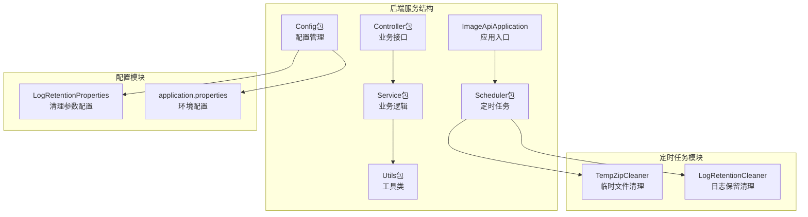
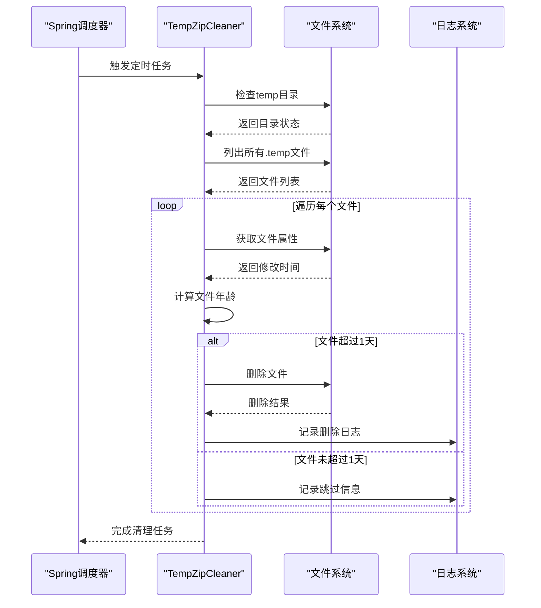
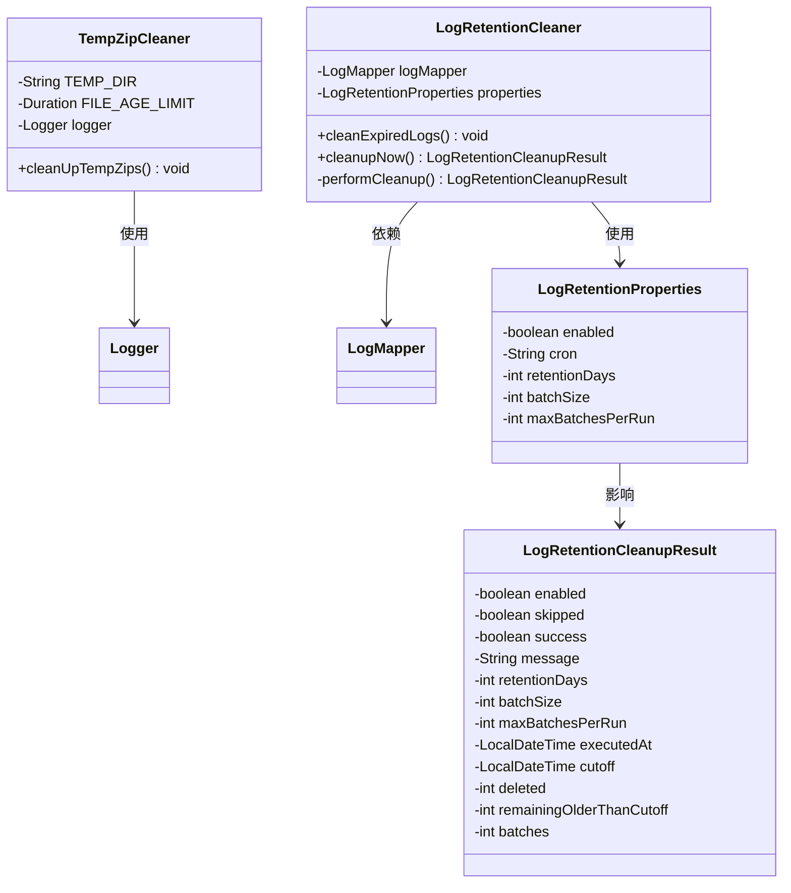
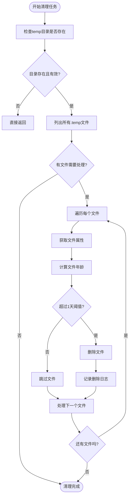
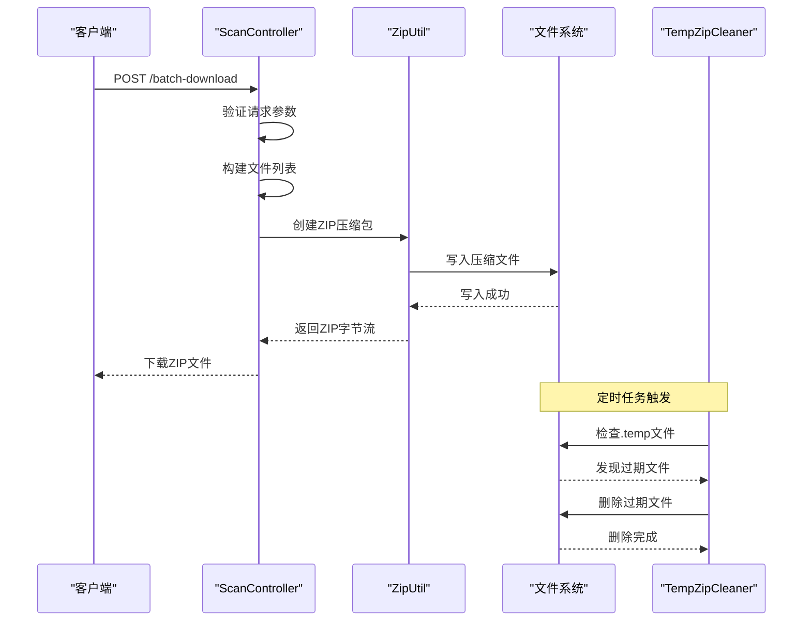
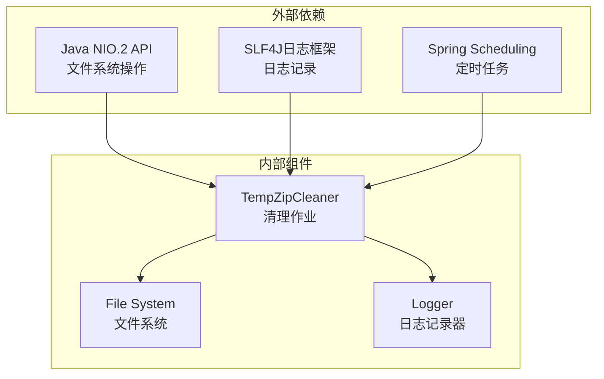

# 临时文件清理作业

**本文档引用的文件**
- [TempZipCleaner.java](file://backend-repo/src/main/java/com/zjcxph/imgapi/scheduler/TempZipCleaner.java)
- [LogRetentionCleaner.java](file://backend-repo/src/main/java/com/zjcxph/imgapi/scheduler/LogRetentionCleaner.java)
- [LogRetentionProperties.java](file://backend-repo/src/main/java/com/zjcxph/imgapi/config/LogRetentionProperties.java)
- [LogRetentionCleanupResult.java](file://backend-repo/src/main/java/com/zjcxph/imgapi/dto/resp/LogRetentionCleanupResult.java)
- [application.properties](file://backend-repo/src/main/resources/application.properties)
- [ZipUtil.java](file://backend-repo/src/main/java/com/zjcxph/imgapi/utils/ZipUtil.java)
- [ScanController.java](file://backend-repo/src/main/java/com/zjcxph/imgapi/controller/ScanController.java)
- [ImageApiApplication.java](file://backend-repo/src/main/java/com/zjcxph/imgapi/ImageApiApplication.java)

## 目录
1. [简介](#简介)
2. [项目结构](#项目结构)
3. [核心组件](#核心组件)
4. [架构概览](#架构概览)
5. [详细组件分析](#详细组件分析)
6. [依赖分析](#依赖分析)
7. [性能考虑](#性能考虑)
8. [故障排除指南](#故障排除指南)
9. [结论](#结论)
10. [附录](#附录)

## 简介

MRR项目的临时文件清理作业是一个关键的系统维护组件，专门负责清理临时压缩包文件，确保系统磁盘空间的有效利用和系统的稳定运行。该作业通过定时调度机制自动检测和删除过期的临时文件，防止临时文件无限增长导致的存储空间浪费和系统性能下降。

本文档深入分析了TempZipCleaner类的设计目的、清理策略、识别规则和清理条件，详细记录了定时清理任务的调度周期和执行频率设置，说明了临时文件的存储路径管理和清理范围控制，并提供了清理作业的监控指标和性能影响评估。同时，文档包含了异常情况下的回滚机制和数据安全保障措施，以及如何配置清理阈值和批量处理参数以优化系统性能。

## 项目结构

MRR项目采用标准的Spring Boot分层架构，临时文件清理作业位于scheduler包中，与日志保留清理作业并列存在，体现了系统对不同类型数据清理的统一管理理念。

**图表来源**
- [ImageApiApplication.java:1-20](file://backend-repo/src/main/java/com/zjcxph/imgapi/ImageApiApplication.java#L1-L20)
- [TempZipCleaner.java:1-57](file://backend-repo/src/main/java/com/zjcxph/imgapi/scheduler/TempZipCleaner.java#L1-L57)
- [LogRetentionCleaner.java:1-119](file://backend-repo/src/main/java/com/zjcxph/imgapi/scheduler/LogRetentionCleaner.java#L1-L119)

**章节来源**
- [ImageApiApplication.java:1-20](file://backend-repo/src/main/java/com/zjcxph/imgapi/ImageApiApplication.java#L1-L20)
- [application.properties:1-49](file://backend-repo/src/main/resources/application.properties#L1-L49)

## 核心组件

### TempZipCleaner类设计概述

TempZipCleaner是MRR项目中专门负责临时文件清理的核心组件，采用了Spring Boot的定时任务机制，通过@Scheduled注解实现自动化的文件清理功能。该类的设计体现了以下核心特点：

- **单一职责原则**：专注于临时文件的识别和清理，不涉及其他业务逻辑
- **自动化执行**：基于cron表达式的定时调度，无需人工干预
- **安全防护**：包含完整的异常处理和边界检查机制
- **可配置性**：支持通过环境变量调整清理策略

### 清理策略分析

TempZipCleaner采用基于时间阈值的清理策略，具体实现如下：

1. **文件识别策略**：仅处理扩展名为".temp"的文件，确保清理范围的精确性
2. **时间阈值判断**：设置1天的文件老化期限，超过此期限的文件将被删除
3. **批量处理机制**：遍历目录中的所有匹配文件，逐个进行清理判断
4. **原子性操作**：使用try-catch块确保单个文件处理失败不影响整体执行

**章节来源**
- [TempZipCleaner.java:15-57](file://backend-repo/src/main/java/com/zjcxph/imgapi/scheduler/TempZipCleaner.java#L15-L57)

## 架构概览

临时文件清理作业在MRR系统中的架构位置体现了其作为基础设施组件的重要作用。该作业与系统的其他组件形成了清晰的层次关系，既独立运行又与其他模块保持必要的交互。

**图表来源**
- [TempZipCleaner.java:28-55](file://backend-repo/src/main/java/com/zjcxph/imgapi/scheduler/TempZipCleaner.java#L28-L55)

### 组件关系图

**图表来源**
- [TempZipCleaner.java:15-57](file://backend-repo/src/main/java/com/zjcxph/imgapi/scheduler/TempZipCleaner.java#L15-L57)
- [LogRetentionCleaner.java:14-119](file://backend-repo/src/main/java/com/zjcxph/imgapi/scheduler/LogRetentionCleaner.java#L14-L119)
- [LogRetentionProperties.java:6-54](file://backend-repo/src/main/java/com/zjcxph/imgapi/config/LogRetentionProperties.java#L6-L54)
- [LogRetentionCleanupResult.java:8-119](file://backend-repo/src/main/java/com/zjcxph/imgapi/dto/resp/LogRetentionCleanupResult.java#L8-L119)

## 详细组件分析

### TempZipCleaner类深度解析

#### 设计模式与实现原理

TempZipCleaner采用了简单的定时任务模式，通过Spring的@EnableScheduling注解启用调度功能。类的设计遵循了最小化原则，只包含必要的清理逻辑，避免了过度复杂化。

**图表来源**
- [TempZipCleaner.java:28-55](file://backend-repo/src/main/java/com/zjcxph/imgapi/scheduler/TempZipCleaner.java#L28-L55)

#### 关键配置参数

| 参数名称 | 默认值 | 含义 | 配置位置 |
|---------|--------|------|----------|
| TEMP_DIR | "./temp" | 临时文件存储目录 | 类常量定义 |
| FILE_AGE_LIMIT | 1天 | 文件老化阈值 | 类常量定义 |
| 调度周期 | 每天中午12点 | 清理执行频率 | cron表达式 |

#### 异常处理机制

TempZipCleaner实现了完善的异常处理策略，确保单个文件的处理失败不会影响整个清理任务的执行：

1. **文件访问异常**：捕获文件权限问题、文件损坏等异常
2. **系统资源异常**：处理磁盘空间不足、内存不足等系统级异常
3. **日志记录**：所有异常都会被记录到系统日志中，便于问题追踪

**章节来源**
- [TempZipCleaner.java:15-57](file://backend-repo/src/main/java/com/zjcxph/imgapi/scheduler/TempZipCleaner.java#L15-L57)

### 临时文件生成与使用流程

#### 批量下载功能中的临时文件

在ScanController的批量下载功能中，系统会生成临时的ZIP压缩包文件，这些文件在下载完成后会被清理：

**图表来源**
- [ScanController.java:256-281](file://backend-repo/src/main/java/com/zjcxph/imgapi/controller/ScanController.java#L256-L281)
- [ZipUtil.java:16-21](file://backend-repo/src/main/java/com/zjcxph/imgapi/utils/ZipUtil.java#L16-L21)
- [TempZipCleaner.java:28-55](file://backend-repo/src/main/java/com/zjcxph/imgapi/scheduler/TempZipCleaner.java#L28-L55)

#### 临时文件生命周期管理

临时文件从生成到清理的完整生命周期包括以下阶段：

1. **生成阶段**：用户发起批量下载请求，系统创建临时ZIP文件
2. **使用阶段**：客户端下载临时文件，文件处于活跃状态
3. **清理阶段**：定时任务检测并删除过期的临时文件
4. **回收阶段**：文件系统释放磁盘空间

**章节来源**
- [ScanController.java:283-315](file://backend-repo/src/main/java/com/zjcxph/imgapi/controller/ScanController.java#L283-L315)
- [ZipUtil.java:23-49](file://backend-repo/src/main/java/com/zjcxph/imgapi/utils/ZipUtil.java#L23-L49)

### 日志保留清理作业对比分析

为了更好地理解临时文件清理作业的设计理念，我们可以将其与日志保留清理作业进行对比分析：

| 特性 | TempZipCleaner | LogRetentionCleaner |
|------|----------------|---------------------|
| **清理对象** | 临时ZIP文件(.temp) | 数据库日志记录 |
| **清理策略** | 基于时间阈值 | 基于保留天数 |
| **执行频率** | 固定1天间隔 | 可配置cron表达式 |
| **批量处理** | 单文件处理 | 支持批量删除 |
| **配置参数** | 仅文件夹和阈值 | 多参数可配置 |
| **监控指标** | 简单删除计数 | 详细清理报告 |

这种对比分析有助于理解不同类型数据清理的最佳实践和适用场景。

**章节来源**
- [LogRetentionCleaner.java:14-119](file://backend-repo/src/main/java/com/zjcxph/imgapi/scheduler/LogRetentionCleaner.java#L14-L119)
- [LogRetentionProperties.java:6-54](file://backend-repo/src/main/java/com/zjcxph/imgapi/config/LogRetentionProperties.java#L6-L54)

## 依赖分析

### 外部依赖关系

TempZipCleaner类的依赖关系相对简单，主要依赖于Java标准库和Spring框架的核心功能：

**图表来源**
- [TempZipCleaner.java:3-13](file://backend-repo/src/main/java/com/zjcxph/imgapi/scheduler/TempZipCleaner.java#L3-L13)

### 内部耦合度分析

TempZipCleaner类具有较低的内部耦合度，主要体现在：

1. **单一职责**：专注于文件清理功能，不涉及其他业务逻辑
2. **简单接口**：仅暴露一个公共方法用于执行清理任务
3. **常量配置**：使用类常量存储配置参数，便于维护
4. **独立运行**：不需要外部依赖即可正常工作

### 循环依赖风险

经过分析，TempZipCleaner类不存在循环依赖风险，因为：

- 该类不依赖任何其他清理类
- 不依赖数据库或其他外部服务
- 仅依赖Java标准库和Spring框架
- 与业务控制器没有直接依赖关系

**章节来源**
- [TempZipCleaner.java:1-57](file://backend-repo/src/main/java/com/zjcxph/imgapi/scheduler/TempZipCleaner.java#L1-L57)

## 性能考虑

### 时间复杂度分析

TempZipCleaner的时间复杂度为O(n)，其中n是temp目录中.temp文件的数量。具体分析如下：

- **目录检查**：O(1) - 常量时间检查目录存在性
- **文件列表**：O(n) - 遍历所有文件
- **文件属性获取**：O(1) - 单个文件属性读取
- **时间比较**：O(1) - 单个文件年龄计算
- **文件删除**：O(1) - 单个文件删除操作

总时间复杂度：O(n) + O(1) + O(n) + O(n) + O(n) = O(n)

### 空间复杂度分析

空间复杂度为O(1)，因为：

- 使用固定大小的缓冲区进行文件读取
- 存储的变量数量不随文件数量变化
- 不创建与文件数量相关的数据结构

### 性能优化建议

基于当前实现，可以考虑以下优化方案：

1. **并发处理**：对于大量文件的情况，可以考虑使用并行流处理
2. **批量删除**：减少文件系统调用次数
3. **缓存机制**：缓存目录结构信息，减少重复查询
4. **智能调度**：根据系统负载动态调整清理频率

### 资源使用监控

TempZipCleaner在执行过程中会消耗以下系统资源：

- **CPU时间**：主要用于文件属性读取和时间计算
- **内存使用**：少量内存用于文件路径和属性对象
- **磁盘I/O**：文件属性读取和删除操作
- **网络带宽**：清理作业不涉及网络操作

## 故障排除指南

### 常见问题及解决方案

#### 1. 目录不存在问题

**问题描述**：temp目录不存在或权限不足

**解决方案**：
- 确保temp目录在应用启动时已创建
- 检查文件系统权限设置
- 验证目录路径配置正确

**章节来源**
- [TempZipCleaner.java:30-33](file://backend-repo/src/main/java/com/zjcxph/imgapi/scheduler/TempZipCleaner.java#L30-L33)

#### 2. 文件权限问题

**问题描述**：无法读取或删除某些文件

**解决方案**：
- 检查文件的所有者和权限设置
- 确认应用程序有足够的文件系统权限
- 排查文件是否被其他进程占用

**章节来源**
- [TempZipCleaner.java:49-52](file://backend-repo/src/main/java/com/zjcxph/imgapi/scheduler/TempZipCleaner.java#L49-L52)

#### 3. 磁盘空间不足

**问题描述**：清理过程中磁盘空间不足

**解决方案**：
- 监控磁盘使用率，及时扩容
- 调整清理阈值，增加清理频率
- 实施磁盘配额管理

### 错误日志分析

TempZipCleaner会记录详细的错误日志，便于问题诊断：

1. **文件访问错误**：记录具体的文件路径和错误类型
2. **权限不足**：记录权限相关的错误信息
3. **系统资源错误**：记录磁盘空间、内存等系统资源问题

### 监控指标建议

为了更好地监控临时文件清理作业的运行状态，建议收集以下指标：

- **清理成功率**：成功清理的文件数量占总文件数量的比例
- **平均处理时间**：单个文件的平均处理时间
- **磁盘空间回收量**：清理作业回收的磁盘空间总量
- **异常发生率**：清理过程中异常事件的发生频率

**章节来源**
- [TempZipCleaner.java:47-51](file://backend-repo/src/main/java/com/zjcxph/imgapi/scheduler/TempZipCleaner.java#L47-L51)

## 结论

MRR项目的临时文件清理作业通过TempZipCleaner类实现了高效、可靠的临时文件管理。该作业具有以下显著优势：

1. **设计简洁**：采用单一职责原则，专注于临时文件清理功能
2. **自动化程度高**：基于定时调度，无需人工干预
3. **安全性强**：完善的异常处理和边界检查机制
4. **可配置性强**：支持通过环境变量调整清理策略

通过合理的配置和监控，TempZipCleaner能够有效防止临时文件无限增长，确保系统磁盘空间的合理利用，为MRR项目的稳定运行提供重要保障。

## 附录

### 配置参数详解

#### 应用程序配置

| 配置项 | 默认值 | 说明 | 用途 |
|--------|--------|------|------|
| server.port | 18045 | 服务器端口 | Web服务端口配置 |
| logging.file.name | img-api.log | 日志文件名 | 应用程序日志输出 |
| app.log-retention.enabled | false | 日志保留开关 | 日志清理功能开关 |
| app.log-retention.cron | 0 30 2 * * ? | 日志清理调度 | 日志清理执行周期 |
| app.log-retention.retention-days | 1095 | 日志保留天数 | 日志保留时间阈值 |
| app.log-retention.batch-size | 5000 | 批处理大小 | 日志清理批量数量 |
| app.log-retention.max-batches-per-run | 20 | 最大批次数 | 单次清理最大批次数 |

#### 临时文件清理配置

| 参数 | 默认值 | 说明 | 优化建议 |
|------|--------|------|----------|
| TEMP_DIR | ./temp | 临时文件目录 | 建议使用绝对路径 |
| FILE_AGE_LIMIT | 1天 | 文件老化阈值 | 根据业务需求调整 |
| 调度周期 | 每天中午12点 | 清理执行频率 | 可根据负载调整 |

### 最佳实践建议

1. **定期审查**：定期检查清理效果和系统性能
2. **容量规划**：根据业务增长预测磁盘空间需求
3. **监控告警**：建立清理作业的监控和告警机制
4. **备份策略**：重要数据清理前做好备份准备
5. **测试验证**：在生产环境部署前充分测试清理逻辑

### 故障恢复流程

当清理作业出现问题时，建议按照以下流程进行恢复：

1. **问题诊断**：检查日志文件，确定问题类型
2. **临时处理**：手动清理部分文件，缓解磁盘压力
3. **修复实施**：根据问题类型实施相应的修复措施
4. **验证测试**：确认修复效果，重新运行清理作业
5. **预防改进**：总结经验教训，完善预防措施