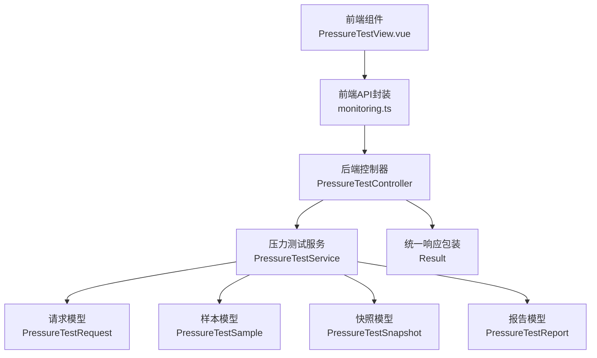
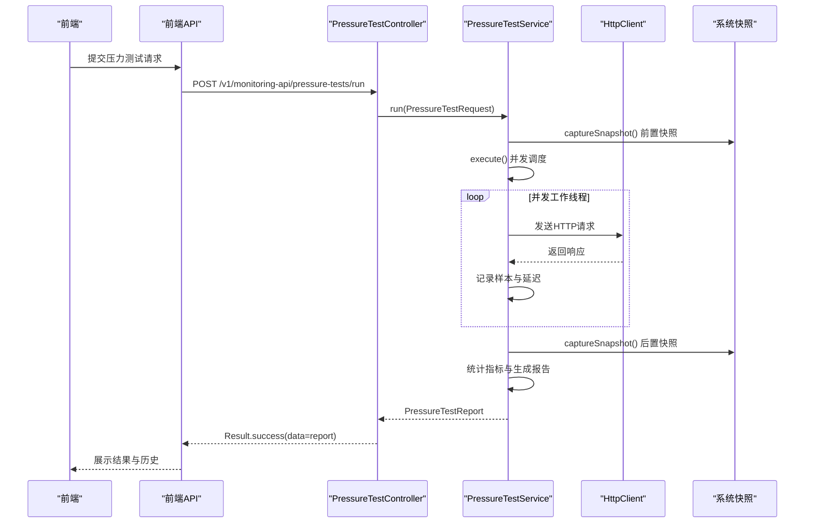
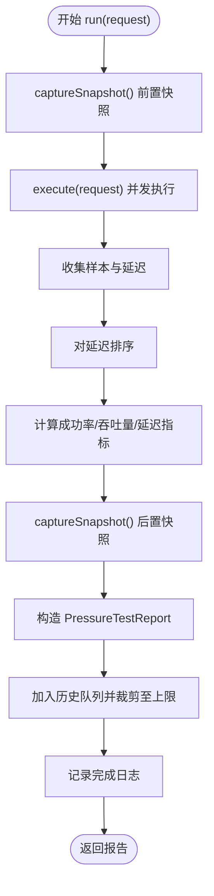
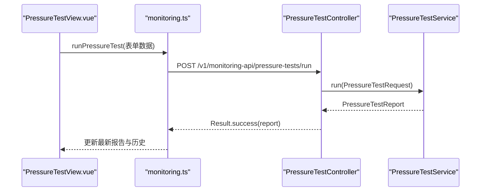
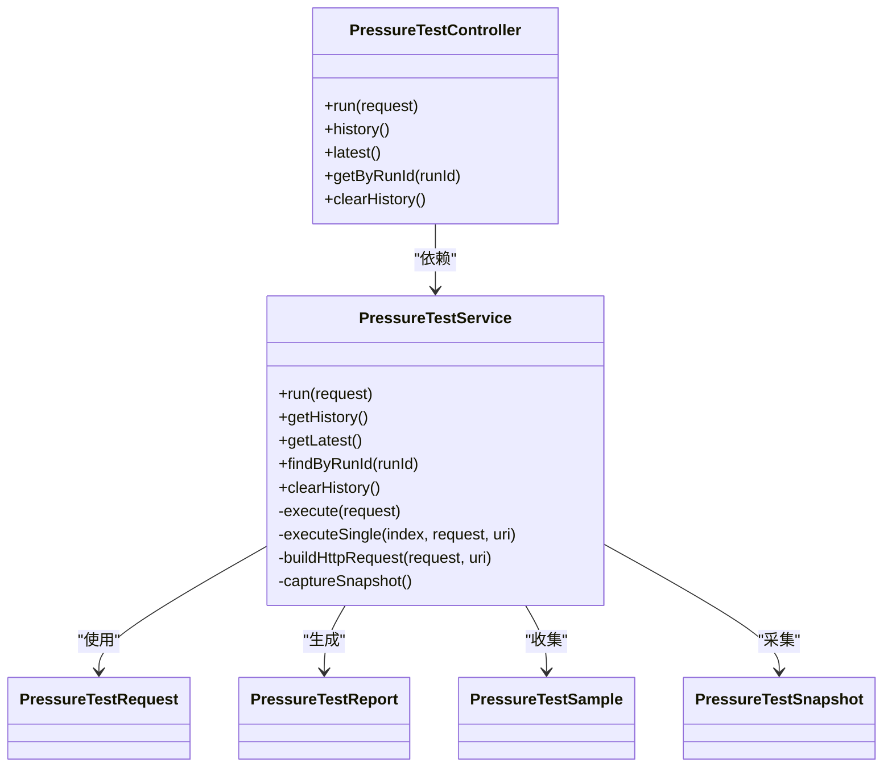

# 压力测试监控服务

**本文档引用的文件**
- [PressureTestService.java](file://backend-repo/src/main/java/com/zjcxph/imgapi/monitoring/PressureTestService.java)
- [PressureTestReport.java](file://backend-repo/src/main/java/com/zjcxph/imgapi/monitoring/PressureTestReport.java)
- [PressureTestRequest.java](file://backend-repo/src/main/java/com/zjcxph/imgapi/monitoring/PressureTestRequest.java)
- [PressureTestSample.java](file://backend-repo/src/main/java/com/zjcxph/imgapi/monitoring/PressureTestSample.java)
- [PressureTestSnapshot.java](file://backend-repo/src/main/java/com/zjcxph/imgapi/monitoring/PressureTestSnapshot.java)
- [PressureTestController.java](file://backend-repo/src/main/java/com/zjcxph/imgapi/controller/PressureTestController.java)
- [PressureTestServiceTest.java](file://backend-repo/src/test/java/com/zjcxph/imgapi/PressureTestServiceTest.java)
- [PressureTestControllerIntegrationTest.java](file://backend-repo/src/test/java/com/zjcxph/imgapi/PressureTestControllerIntegrationTest.java)
- [PressureTestView.vue](file://frontend-repo/src/components/admin/PressureTestView.vue)
- [monitoring.ts](file://frontend-repo/src/api/monitoring.ts)
- [README.md](file://backend-repo/README.md)
- [SYSTEM_ARCHITECTURE.md](file://SYSTEM_ARCHITECTURE.md)

## 目录
1. [简介](#简介)
2. [项目结构](#项目结构)
3. [核心组件](#核心组件)
4. [架构概览](#架构概览)
5. [详细组件分析](#详细组件分析)
6. [依赖关系分析](#依赖关系分析)
7. [性能考虑](#性能考虑)
8. [故障排查指南](#故障排查指南)
9. [结论](#结论)
10. [附录](#附录)

## 简介
本文件面向MRR项目的压力测试监控服务，围绕PressureTestService类展开，系统性阐述其核心功能、监控机制、请求生成与执行流程、结果收集与报告结构，并提供并发控制、资源限制、性能基准测试流程、自动化执行与报告生成等实践指导。文档同时结合前后端集成点，帮助读者在高负载场景下评估系统表现并定位瓶颈。

## 项目结构
压力测试相关代码主要分布在后端的monitoring包与controller包中，前端通过Admin Dashboard中的PressureTestView组件调用后端API进行压力测试的发起、历史查询与结果展示。整体采用“控制器-服务-数据模型”的分层设计，保证职责清晰与可测试性。

图表来源
- [PressureTestView.vue:124-247](file://frontend-repo/src/components/admin/PressureTestView.vue#L124-L247)
- [monitoring.ts:1-22](file://frontend-repo/src/api/monitoring.ts#L1-L22)
- [PressureTestController.java:22-72](file://backend-repo/src/main/java/com/zjcxph/imgapi/controller/PressureTestController.java#L22-L72)
- [PressureTestService.java:32-292](file://backend-repo/src/main/java/com/zjcxph/imgapi/monitoring/PressureTestService.java#L32-L292)
- [PressureTestRequest.java:12-179](file://backend-repo/src/main/java/com/zjcxph/imgapi/monitoring/PressureTestRequest.java#L12-L179)
- [PressureTestSample.java:3-81](file://backend-repo/src/main/java/com/zjcxph/imgapi/monitoring/PressureTestSample.java#L3-L81)
- [PressureTestSnapshot.java:3-117](file://backend-repo/src/main/java/com/zjcxph/imgapi/monitoring/PressureTestSnapshot.java#L3-L117)
- [PressureTestReport.java:6-316](file://backend-repo/src/main/java/com/zjcxph/imgapi/monitoring/PressureTestReport.java#L6-L316)

章节来源
- [PressureTestController.java:22-72](file://backend-repo/src/main/java/com/zjcxph/imgapi/controller/PressureTestController.java#L22-L72)
- [PressureTestService.java:32-292](file://backend-repo/src/main/java/com/zjcxph/imgapi/monitoring/PressureTestService.java#L32-L292)
- [PressureTestView.vue:1-305](file://frontend-repo/src/components/admin/PressureTestView.vue#L1-L305)
- [monitoring.ts:1-22](file://frontend-repo/src/api/monitoring.ts#L1-L22)

## 核心组件
- PressureTestService：压力测试核心执行器，负责并发调度、HTTP请求发送、延迟统计、成功率计算、吞吐量计算、内存与系统负载快照采集以及报告生成与历史维护。
- PressureTestController：对外暴露REST接口，接收前端请求，调用服务并返回统一响应。
- PressureTestRequest：压力测试请求参数模型，包含名称、目标URL、HTTP方法、并发数、总请求数、超时时间、请求头与请求体。
- PressureTestReport：压力测试报告模型，承载本次测试的汇总指标与样本明细。
- PressureTestSample：单次请求样本，记录状态码、成功标志、延迟与错误信息。
- PressureTestSnapshot：系统资源快照，包含堆内存使用、提交值、最大值、使用率、系统负载平均值、可用处理器数与时间戳。

章节来源
- [PressureTestService.java:32-292](file://backend-repo/src/main/java/com/zjcxph/imgapi/monitoring/PressureTestService.java#L32-L292)
- [PressureTestController.java:22-72](file://backend-repo/src/main/java/com/zjcxph/imgapi/controller/PressureTestController.java#L22-L72)
- [PressureTestRequest.java:12-179](file://backend-repo/src/main/java/com/zjcxph/imgapi/monitoring/PressureTestRequest.java#L12-L179)
- [PressureTestReport.java:6-316](file://backend-repo/src/main/java/com/zjcxph/imgapi/monitoring/PressureTestReport.java#L6-L316)
- [PressureTestSample.java:3-81](file://backend-repo/src/main/java/com/zjcxph/imgapi/monitoring/PressureTestSample.java#L3-L81)
- [PressureTestSnapshot.java:3-117](file://backend-repo/src/main/java/com/zjcxph/imgapi/monitoring/PressureTestSnapshot.java#L3-L117)

## 架构概览
压力测试模块遵循“控制器-服务-模型”分层，前端通过API封装调用后端控制器，控制器将请求参数封装为PressureTestRequest并交由PressureTestService执行。服务内部使用固定线程池并发执行HTTP请求，收集样本并计算指标，生成PressureTestReport，同时维护最多20条的历史记录。

图表来源
- [PressureTestController.java:35-41](file://backend-repo/src/main/java/com/zjcxph/imgapi/controller/PressureTestController.java#L35-L41)
- [PressureTestService.java:44-112](file://backend-repo/src/main/java/com/zjcxph/imgapi/monitoring/PressureTestService.java#L44-L112)
- [PressureTestView.vue:183-208](file://frontend-repo/src/components/admin/PressureTestView.vue#L183-L208)
- [monitoring.ts:3-5](file://frontend-repo/src/api/monitoring.ts#L3-L5)

## 详细组件分析

### PressureTestService 类
- 并发控制与执行
  - 使用固定大小线程池（并发数）并发执行请求，通过原子游标保证任务分配有序且不重复。
  - 每个线程循环从全局游标取下一个请求序号，直到达到总请求数为止。
- 请求构建与发送
  - 根据请求方法动态构建HTTP请求；对POST/PUT/PATCH自动设置请求体与Content-Type（如未显式提供）；DELETE使用专用方法；其他方法使用GET。
  - 设置超时时间，避免阻塞；捕获中断、IO异常与非法参数异常，记录错误信息。
- 指标计算
  - 收集所有样本延迟，排序后计算最小、平均、P95、最大延迟。
  - 成功率 = 成功数/总请求数；吞吐量 = 总请求数/测试总时长（毫秒）。
- 快照与历史
  - 在测试开始与结束时分别采集系统快照（堆内存、系统负载、CPU核数），用于对比前后资源变化。
  - 维护最多20条历史记录，支持按runId检索与清空。
- 日志与可观测性
  - 测试完成后输出关键指标日志，便于审计与问题定位。

图表来源
- [PressureTestService.java:44-112](file://backend-repo/src/main/java/com/zjcxph/imgapi/monitoring/PressureTestService.java#L44-L112)
- [PressureTestService.java:138-170](file://backend-repo/src/main/java/com/zjcxph/imgapi/monitoring/PressureTestService.java#L138-L170)
- [PressureTestService.java:232-251](file://backend-repo/src/main/java/com/zjcxph/imgapi/monitoring/PressureTestService.java#L232-L251)
- [PressureTestService.java:287-291](file://backend-repo/src/main/java/com/zjcxph/imgapi/monitoring/PressureTestService.java#L287-L291)

章节来源
- [PressureTestService.java:32-292](file://backend-repo/src/main/java/com/zjcxph/imgapi/monitoring/PressureTestService.java#L32-L292)

### PressureTestRequest 请求参数
- 字段与约束
  - 名称：必填，非空白字符串，默认值为“pressure-test”。
  - 目标URL：必填，非空白字符串。
  - 方法：GET/POST/PUT/PATCH/DELETE之一，默认GET。
  - 并发数：≥1且≤128，默认1。
  - 总请求数：≥1且≤10000，默认1。
  - 超时毫秒：≥100且≤30000，默认3000。
  - 请求体：可选JSON字符串。
  - 请求头：映射结构，保持插入顺序。
- 归一化处理
  - 对名称与方法进行空白裁剪与默认值填充；方法转大写；请求体为空字符串时归为null。

章节来源
- [PressureTestRequest.java:12-179](file://backend-repo/src/main/java/com/zjcxph/imgapi/monitoring/PressureTestRequest.java#L12-L179)

### PressureTestReport 报告数据结构
- 基本信息：runId、名称、目标URL、方法、并发数、总请求数。
- 质量指标：成功数、失败数、成功率、最小/平均/P95/最大延迟（毫秒）、吞吐量（rps）、测试时长（毫秒）、开始/结束时间。
- 资源快照：前置与后置堆内存使用、提交值、最大值、使用率、系统负载平均值、可用处理器数、时间戳。
- 样本明细：按请求序号排序的样本列表。

章节来源
- [PressureTestReport.java:6-316](file://backend-repo/src/main/java/com/zjcxph/imgapi/monitoring/PressureTestReport.java#L6-L316)

### PressureTestSample 单样本模型
- 字段：序号、状态码、成功标志、延迟（毫秒）、错误信息。
- 用途：记录每次HTTP请求的结果与耗时，支撑延迟分布与错误分析。

章节来源
- [PressureTestSample.java:3-81](file://backend-repo/src/main/java/com/zjcxph/imgapi/monitoring/PressureTestSample.java#L3-L81)

### PressureTestSnapshot 系统快照
- 字段：堆使用字节、堆提交字节、堆最大字节、堆使用百分比、系统负载平均值、可用处理器数、时间戳。
- 用途：对比测试前后系统资源占用，辅助定位内存泄漏与CPU瓶颈。

章节来源
- [PressureTestSnapshot.java:3-117](file://backend-repo/src/main/java/com/zjcxph/imgapi/monitoring/PressureTestSnapshot.java#L3-L117)

### 前后端集成与自动化
- 前端组件
  - PressureTestView.vue提供表单输入（名称、URL、方法、并发、请求数、超时、请求头、请求体），支持执行、刷新历史、清空历史与重置。
  - 实时展示最新报告摘要（runId、成功率、P95、吞吐量、总耗时）与历史表格。
- API封装
  - monitoring.ts提供run、history、latest、byRunId、clear等方法，统一路径前缀“/monitoring-api/pressure-tests”。
- 控制器
  - PressureTestController暴露/run、/history、/latest、/{runId}、/history删除等端点，返回Result包装的响应。

图表来源
- [PressureTestView.vue:183-208](file://frontend-repo/src/components/admin/PressureTestView.vue#L183-L208)
- [monitoring.ts:3-5](file://frontend-repo/src/api/monitoring.ts#L3-L5)
- [PressureTestController.java:35-41](file://backend-repo/src/main/java/com/zjcxph/imgapi/controller/PressureTestController.java#L35-L41)
- [PressureTestService.java:44-112](file://backend-repo/src/main/java/com/zjcxph/imgapi/monitoring/PressureTestService.java#L44-L112)

章节来源
- [PressureTestView.vue:124-247](file://frontend-repo/src/components/admin/PressureTestView.vue#L124-L247)
- [monitoring.ts:1-22](file://frontend-repo/src/api/monitoring.ts#L1-L22)
- [PressureTestController.java:22-72](file://backend-repo/src/main/java/com/zjcxph/imgapi/controller/PressureTestController.java#L22-L72)

## 依赖关系分析
- 组件耦合
  - PressureTestController仅依赖PressureTestService接口，低耦合高内聚。
  - PressureTestService内部依赖Java标准库（HTTP客户端、并发工具、时间格式化、JVM MXBean）与自定义模型。
- 外部依赖
  - Spring Boot运行时（注解驱动、日志框架）。
  - 前端通过Element Plus与Axios（经封装）调用后端API。
- 可能的循环依赖
  - 当前结构无循环依赖，各层职责清晰。

图表来源
- [PressureTestController.java:22-72](file://backend-repo/src/main/java/com/zjcxph/imgapi/controller/PressureTestController.java#L22-L72)
- [PressureTestService.java:32-292](file://backend-repo/src/main/java/com/zjcxph/imgapi/monitoring/PressureTestService.java#L32-L292)
- [PressureTestRequest.java:12-179](file://backend-repo/src/main/java/com/zjcxph/imgapi/monitoring/PressureTestRequest.java#L12-L179)
- [PressureTestReport.java:6-316](file://backend-repo/src/main/java/com/zjcxph/imgapi/monitoring/PressureTestReport.java#L6-L316)
- [PressureTestSample.java:3-81](file://backend-repo/src/main/java/com/zjcxph/imgapi/monitoring/PressureTestSample.java#L3-L81)
- [PressureTestSnapshot.java:3-117](file://backend-repo/src/main/java/com/zjcxph/imgapi/monitoring/PressureTestSnapshot.java#L3-L117)

章节来源
- [PressureTestController.java:22-72](file://backend-repo/src/main/java/com/zjcxph/imgapi/controller/PressureTestController.java#L22-L72)
- [PressureTestService.java:32-292](file://backend-repo/src/main/java/com/zjcxph/imgapi/monitoring/PressureTestService.java#L32-L292)

## 性能考虑
- 并发与资源限制
  - 并发数上限128，总请求数上限10000，超时上限30秒，防止过度消耗系统资源。
  - 固定线程池大小与原子游标保证任务均匀分配，避免饥饿。
- I/O与网络
  - 使用Java HTTP客户端，合理设置超时；对POST/PUT/PATCH自动设置UTF-8编码与Content-Type。
  - 异常路径记录错误信息，便于定位网络或目标服务问题。
- 内存与快照
  - 历史记录上限20条，避免长期运行导致内存膨胀。
  - 快照包含堆使用率与系统负载，便于识别内存瓶颈与CPU瓶颈。
- 指标稳定性
  - P95延迟避免极端值影响整体感知；吞吐量按毫秒级时长计算，提高精度。

章节来源
- [PressureTestRequest.java:23-33](file://backend-repo/src/main/java/com/zjcxph/imgapi/monitoring/PressureTestRequest.java#L23-L33)
- [PressureTestService.java:138-170](file://backend-repo/src/main/java/com/zjcxph/imgapi/monitoring/PressureTestService.java#L138-L170)
- [PressureTestService.java:232-251](file://backend-repo/src/main/java/com/zjcxph/imgapi/monitoring/PressureTestService.java#L232-L251)
- [PressureTestService.java:287-291](file://backend-repo/src/main/java/com/zjcxph/imgapi/monitoring/PressureTestService.java#L287-L291)

## 故障排查指南
- 常见问题与定位
  - 超时或中断：检查目标服务健康状况与网络连通性；适当增大超时；关注中断异常记录。
  - 成功率低：检查目标URL可达性、鉴权与限流策略；查看失败样本的错误信息。
  - 内存飙升：对比前后快照的堆使用率与最大值；优化目标服务或降低并发/请求数。
  - CPU瓶颈：观察系统负载平均值是否接近CPU核数；减少并发或优化目标服务逻辑。
- 接口与数据验证
  - 使用控制器提供的/history、/latest、/{runId}与/history删除接口验证数据一致性与清理效果。
  - 单元测试与集成测试覆盖了基本指标校验与历史持久化行为。

章节来源
- [PressureTestServiceTest.java:40-104](file://backend-repo/src/test/java/com/zjcxph/imgapi/PressureTestServiceTest.java#L40-L104)
- [PressureTestControllerIntegrationTest.java:49-115](file://backend-repo/src/test/java/com/zjcxph/imgapi/PressureTestControllerIntegrationTest.java#L49-L115)
- [PressureTestController.java:43-71](file://backend-repo/src/main/java/com/zjcxph/imgapi/controller/PressureTestController.java#L43-L71)

## 结论
PressureTestService通过严谨的并发调度、完善的指标统计与系统快照采集，为MRR系统的压力测试提供了可靠的能力。结合前端可视化界面与REST API，实现了从配置到执行、从监控到报告的全链路自动化。建议在生产环境中根据目标服务能力逐步提升并发与请求数，配合快照数据持续优化系统性能与稳定性。

## 附录

### 性能基准测试标准流程
- 准备阶段
  - 明确测试目标（接口/功能模块）、预期SLA（成功率、P95延迟、吞吐量）。
  - 选择合适的并发数与总请求数，避免对线上环境造成过大冲击。
- 执行阶段
  - 通过前端或API提交PressureTestRequest，观察报告摘要与历史记录。
  - 关注成功率、P95延迟、吞吐量与前后快照差异。
- 分析阶段
  - 若成功率不足或P95偏高，逐步降低并发或优化目标服务；若内存使用率持续上升，检查GC与对象生命周期。
  - 对比不同场景的报告，形成性能基线与回归测试数据。

### 报告字段与指标定义
- 基本信息：runId、名称、目标URL、方法、并发、总请求数。
- 质量指标：成功数、失败数、成功率（%）、最小/平均/P95/最大延迟（ms）、吞吐量（rps）、测试时长（ms）、开始/结束时间。
- 资源快照：前置/后置堆使用/提交/最大（bytes）、堆使用率（%）、系统负载平均值、可用处理器数、时间戳。
- 样本明细：按序号排列的单次请求样本（状态码、成功标志、延迟、错误信息）。

章节来源
- [PressureTestReport.java:6-316](file://backend-repo/src/main/java/com/zjcxph/imgapi/monitoring/PressureTestReport.java#L6-L316)
- [PressureTestSnapshot.java:3-117](file://backend-repo/src/main/java/com/zjcxph/imgapi/monitoring/PressureTestSnapshot.java#L3-L117)
- [PressureTestSample.java:3-81](file://backend-repo/src/main/java/com/zjcxph/imgapi/monitoring/PressureTestSample.java#L3-L81)

### 并发控制与资源限制机制
- 并发数：1–128，固定线程池大小，原子游标分配任务。
- 请求数：1–10000，避免一次性产生过多负载。
- 超时：100–30000ms，防止长时间阻塞。
- 历史上限：20条，内存快照与样本明细受控。
- 快照采集：堆使用率与系统负载平均值，辅助识别瓶颈。

章节来源
- [PressureTestRequest.java:23-33](file://backend-repo/src/main/java/com/zjcxph/imgapi/monitoring/PressureTestRequest.java#L23-L33)
- [PressureTestService.java:138-170](file://backend-repo/src/main/java/com/zjcxph/imgapi/monitoring/PressureTestService.java#L138-L170)
- [PressureTestService.java:287-291](file://backend-repo/src/main/java/com/zjcxph/imgapi/monitoring/PressureTestService.java#L287-L291)

### 自动化执行与报告生成
- 前端自动化
  - 表单输入与执行按钮绑定，执行完成后自动刷新历史与最新报告。
  - 清空历史按钮触发后端删除接口，前端同步更新视图。
- 后端自动化
  - 控制器接收请求后直接调用服务执行并返回报告。
  - 历史维护与裁剪在服务内部完成，无需额外运维。

章节来源
- [PressureTestView.vue:183-232](file://frontend-repo/src/components/admin/PressureTestView.vue#L183-L232)
- [monitoring.ts:19-21](file://frontend-repo/src/api/monitoring.ts#L19-L21)
- [PressureTestController.java:66-71](file://backend-repo/src/main/java/com/zjcxph/imgapi/controller/PressureTestController.java#L66-L71)
- [PressureTestService.java:101-111](file://backend-repo/src/main/java/com/zjcxph/imgapi/monitoring/PressureTestService.java#L101-L111)