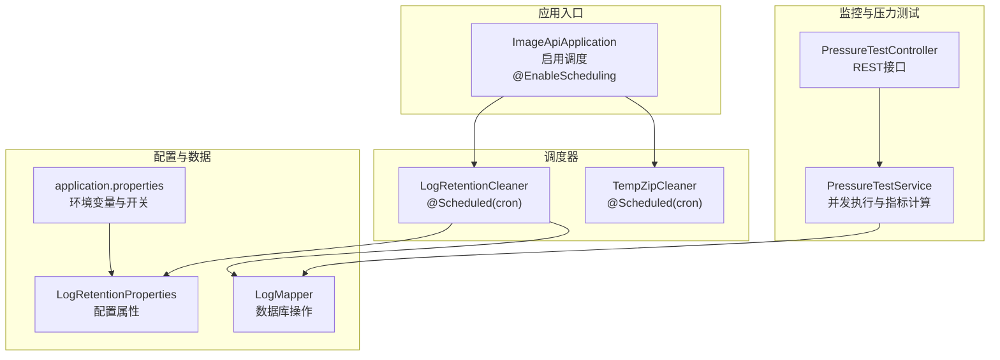
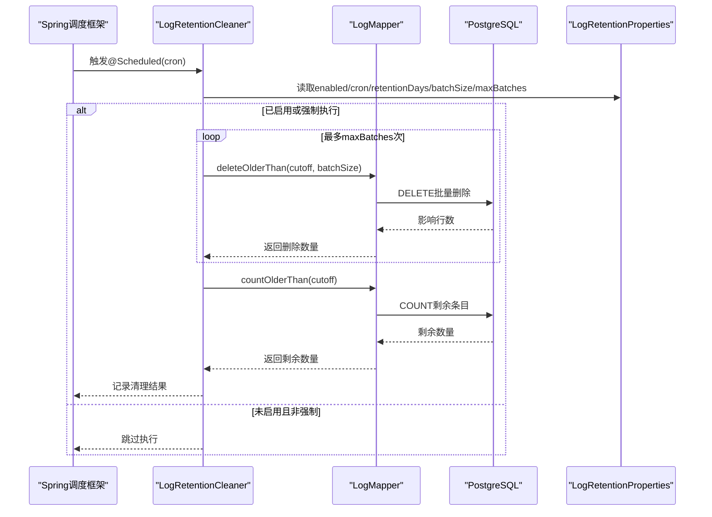
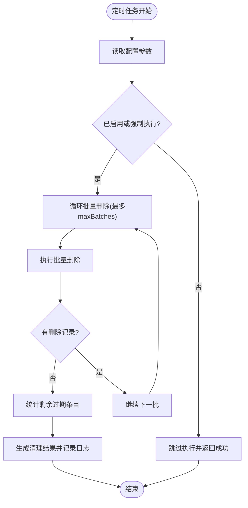
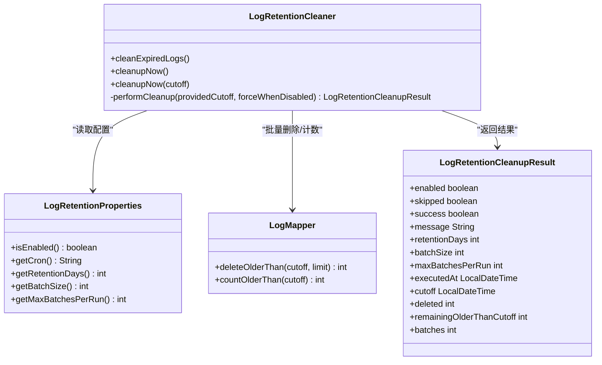
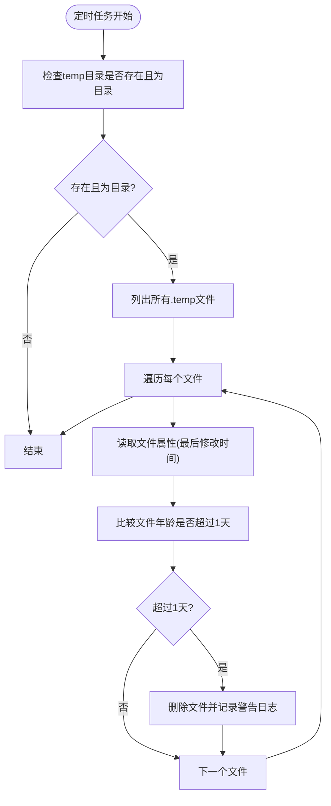
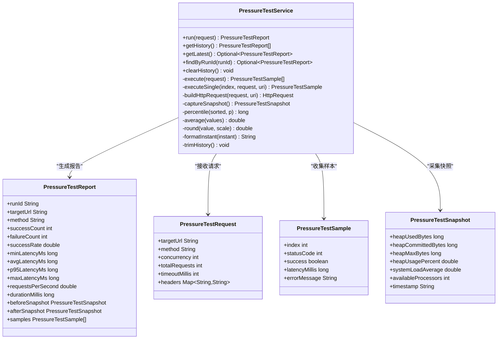
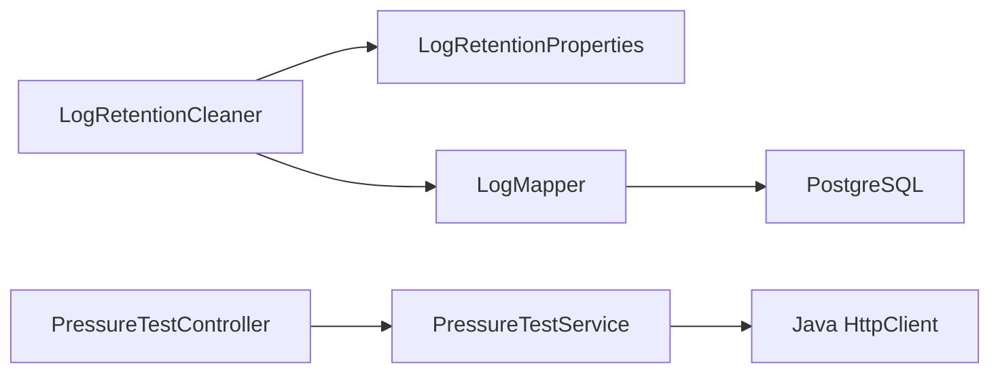

# 定时任务与后台作业

**本文档引用的文件**
- [ImageApiApplication.java](file://backend-repo/src/main/java/com/zjcxph/imgapi/ImageApiApplication.java)
- [LogRetentionCleaner.java](file://backend-repo/src/main/java/com/zjcxph/imgapi/scheduler/LogRetentionCleaner.java)
- [TempZipCleaner.java](file://backend-repo/src/main/java/com/zjcxph/imgapi/scheduler/TempZipCleaner.java)
- [PressureTestService.java](file://backend-repo/src/main/java/com/zjcxph/imgapi/monitoring/PressureTestService.java)
- [LogRetentionProperties.java](file://backend-repo/src/main/java/com/zjcxph/imgapi/config/LogRetentionProperties.java)
- [LogRetentionCleanupResult.java](file://backend-repo/src/main/java/com/zjcxph/imgapi/dto/resp/LogRetentionCleanupResult.java)
- [PressureTestController.java](file://backend-repo/src/main/java/com/zjcxph/imgapi/controller/PressureTestController.java)
- [LogMapper.java](file://backend-repo/src/main/java/com/zjcxph/imgapi/mapper/LogMapper.java)
- [application.properties](file://backend-repo/src/main/resources/application.properties)
- [PressureTestReport.java](file://backend-repo/src/main/java/com/zjcxph/imgapi/monitoring/PressureTestReport.java)
- [PressureTestRequest.java](file://backend-repo/src/main/java/com/zjcxph/imgapi/monitoring/PressureTestRequest.java)
- [PressureTestSample.java](file://backend-repo/src/main/java/com/zjcxph/imgapi/monitoring/PressureTestSample.java)
- [PressureTestSnapshot.java](file://backend-repo/src/main/java/com/zjcxph/imgapi/monitoring/PressureTestSnapshot.java)

## 目录
1. [简介](#简介)
2. [项目结构](#项目结构)
3. [核心组件](#核心组件)
4. [架构总览](#架构总览)
5. [详细组件分析](#详细组件分析)
6. [依赖关系分析](#依赖关系分析)
7. [性能考量](#性能考量)
8. [故障排查指南](#故障排查指南)
9. [结论](#结论)
10. [附录](#附录)

## 简介
本文件面向MRR项目的定时任务与后台作业系统，重点覆盖以下内容：
- 如何通过@EnableScheduling启用Spring调度框架，并在@Component类中使用@Scheduled定义定时任务
- 日志保留清理作业LogRetentionCleaner的执行策略、清理规则与可调参数
- 临时压缩包清理作业TempZipCleaner的调度周期与清理条件
- 压力测试服务PressureTestService的监控指标与性能评估方法
- 定时任务的并发控制、失败重试与异常处理机制
- 定时任务的监控告警与运维管理最佳实践

## 项目结构
MRR后端采用Spring Boot工程，定时任务与后台作业主要分布在以下包：
- 调度器：scheduler（包含LogRetentionCleaner、TempZipCleaner）
- 监控与压力测试：monitoring（包含PressureTestService及相关数据模型）
- 配置：config（包含LogRetentionProperties）
- 数据访问：mapper（包含LogMapper）
- 控制器：controller（包含PressureTestController）

图表来源
- [ImageApiApplication.java:9-9](file://backend-repo/src/main/java/com/zjcxph/imgapi/ImageApiApplication.java#L9-L9)
- [LogRetentionCleaner.java:26-29](file://backend-repo/src/main/java/com/zjcxph/imgapi/scheduler/LogRetentionCleaner.java#L26-L29)
- [TempZipCleaner.java:28-28](file://backend-repo/src/main/java/com/zjcxph/imgapi/scheduler/TempZipCleaner.java#L28-L28)
- [PressureTestService.java:44-112](file://backend-repo/src/main/java/com/zjcxph/imgapi/monitoring/PressureTestService.java#L44-L112)
- [LogRetentionProperties.java:5-12](file://backend-repo/src/main/java/com/zjcxph/imgapi/config/LogRetentionProperties.java#L5-L12)
- [LogMapper.java:41-56](file://backend-repo/src/main/java/com/zjcxph/imgapi/mapper/LogMapper.java#L41-L56)
- [application.properties:40-45](file://backend-repo/src/main/resources/application.properties#L40-L45)

章节来源
- [ImageApiApplication.java:1-20](file://backend-repo/src/main/java/com/zjcxph/imgapi/ImageApiApplication.java#L1-L20)
- [application.properties:1-49](file://backend-repo/src/main/resources/application.properties#L1-L49)

## 核心组件
- 定时任务入口与调度框架
  - 应用启动类通过@EnableScheduling启用调度支持，确保@Component标注的定时任务被Spring扫描并注册。
- 日志保留清理器
  - 通过@Scheduled(cron)按配置的Cron表达式定期清理过期访问日志；支持手动触发cleanupNow()接口；具备批量删除、剩余量统计与结果回传能力。
- 临时压缩包清理器
  - 每天中午12点清理temp目录下超过一天的临时文件，避免磁盘空间膨胀。
- 压力测试服务
  - 支持并发请求执行、延迟统计（最小/平均/p95/最大）、成功率、吞吐量、系统快照（堆内存、系统负载）等指标。
- 配置与数据访问
  - LogRetentionProperties提供可外部化的清理策略参数；LogMapper封装SQL删除与计数逻辑。

章节来源
- [ImageApiApplication.java:9-9](file://backend-repo/src/main/java/com/zjcxph/imgapi/ImageApiApplication.java#L9-L9)
- [LogRetentionCleaner.java:26-37](file://backend-repo/src/main/java/com/zjcxph/imgapi/scheduler/LogRetentionCleaner.java#L26-L37)
- [TempZipCleaner.java:28-55](file://backend-repo/src/main/java/com/zjcxph/imgapi/scheduler/TempZipCleaner.java#L28-L55)
- [PressureTestService.java:44-112](file://backend-repo/src/main/java/com/zjcxph/imgapi/monitoring/PressureTestService.java#L44-L112)
- [LogRetentionProperties.java:5-12](file://backend-repo/src/main/java/com/zjcxph/imgapi/config/LogRetentionProperties.java#L5-L12)
- [LogMapper.java:41-56](file://backend-repo/src/main/java/com/zjcxph/imgapi/mapper/LogMapper.java#L41-L56)

## 架构总览
定时任务与后台作业在MRR中的交互关系如下：

图表来源
- [LogRetentionCleaner.java:39-117](file://backend-repo/src/main/java/com/zjcxph/imgapi/scheduler/LogRetentionCleaner.java#L39-L117)
- [LogRetentionProperties.java:5-12](file://backend-repo/src/main/java/com/zjcxph/imgapi/config/LogRetentionProperties.java#L5-L12)
- [LogMapper.java:41-56](file://backend-repo/src/main/java/com/zjcxph/imgapi/mapper/LogMapper.java#L41-L56)

## 详细组件分析

### 定时任务配置与并发控制
- 启用方式
  - 在应用启动类上添加@EnableScheduling注解，激活调度支持。
- 并发控制
  - 默认单线程执行定时任务；如需多实例或多线程，可在配置中引入TaskScheduler与@Async配合使用（当前实现未使用@Async，建议在高负载场景下评估是否需要异步化）。
- 失败重试与异常处理
  - 定时任务方法内部捕获异常并记录错误日志，返回失败状态；未进行自动重试，建议结合外部监控与告警策略进行人工干预。
- 异常处理流程

图表来源
- [LogRetentionCleaner.java:39-117](file://backend-repo/src/main/java/com/zjcxph/imgapi/scheduler/LogRetentionCleaner.java#L39-L117)

章节来源
- [ImageApiApplication.java:9-9](file://backend-repo/src/main/java/com/zjcxph/imgapi/ImageApiApplication.java#L9-L9)
- [LogRetentionCleaner.java:39-117](file://backend-repo/src/main/java/com/zjcxph/imgapi/scheduler/LogRetentionCleaner.java#L39-L117)

### 日志保留清理作业（LogRetentionCleaner）
- 执行策略
  - 通过@Scheduled(cron)按配置的Cron表达式定时执行；支持手动触发cleanupNow()与cleanupNow(cutoff)。
  - 清理逻辑基于retentionDays计算截止时间，分批删除access_log中早于截止时间的数据，最多执行maxBatchesPerRun次。
- 清理规则
  - 若retentionDays<=0或未启用且非强制执行，则跳过清理。
  - 每批删除限制为batchSize，最终统计删除总数、剩余条目数与实际批次数。
- 结果回传
  - 返回LogRetentionCleanupResult，包含执行时间、截止时间、删除数量、剩余数量、批次数、消息与成功标志等字段。

图表来源
- [LogRetentionCleaner.java:13-37](file://backend-repo/src/main/java/com/zjcxph/imgapi/scheduler/LogRetentionCleaner.java#L13-L37)
- [LogRetentionProperties.java:5-12](file://backend-repo/src/main/java/com/zjcxph/imgapi/config/LogRetentionProperties.java#L5-L12)
- [LogMapper.java:41-56](file://backend-repo/src/main/java/com/zjcxph/imgapi/mapper/LogMapper.java#L41-L56)
- [LogRetentionCleanupResult.java:7-22](file://backend-repo/src/main/java/com/zjcxph/imgapi/dto/resp/LogRetentionCleanupResult.java#L7-L22)

章节来源
- [LogRetentionCleaner.java:26-117](file://backend-repo/src/main/java/com/zjcxph/imgapi/scheduler/LogRetentionCleaner.java#L26-L117)
- [LogRetentionProperties.java:5-54](file://backend-repo/src/main/java/com/zjcxph/imgapi/config/LogRetentionProperties.java#L5-L54)
- [LogRetentionCleanupResult.java:1-119](file://backend-repo/src/main/java/com/zjcxph/imgapi/dto/resp/LogRetentionCleanupResult.java#L1-L119)
- [LogMapper.java:41-56](file://backend-repo/src/main/java/com/zjcxph/imgapi/mapper/LogMapper.java#L41-L56)

### 临时压缩包清理作业（TempZipCleaner）
- 调度周期
  - 每天中午12点执行一次，清理temp目录下超过一天的临时文件。
- 清理条件
  - 仅清理扩展名为“.temp”的文件；基于文件最后修改时间与当前时间差判断是否超期。
- 异常处理
  - 对每个文件的检查与删除进行独立try-catch，避免单个文件异常影响整体清理流程。

图表来源
- [TempZipCleaner.java:28-55](file://backend-repo/src/main/java/com/zjcxph/imgapi/scheduler/TempZipCleaner.java#L28-L55)

章节来源
- [TempZipCleaner.java:15-57](file://backend-repo/src/main/java/com/zjcxph/imgapi/scheduler/TempZipCleaner.java#L15-L57)

### 压力测试服务（PressureTestService）
- 监控指标
  - 基础指标：总请求数、成功/失败次数、成功率、总耗时、吞吐量（每秒请求数）
  - 延迟指标：最小/平均/p95/最大延迟（毫秒）
  - 系统快照：堆内存使用/提交/最大、堆使用率、系统负载平均值、可用处理器数
- 性能评估方法
  - 通过并发线程池模拟多用户请求，收集样本并排序计算延迟分位数；对比前后系统快照评估资源占用。
- 历史管理
  - 维护固定长度的历史队列，限制历史报告数量，便于回溯与对比。

图表来源
- [PressureTestService.java:44-112](file://backend-repo/src/main/java/com/zjcxph/imgapi/monitoring/PressureTestService.java#L44-L112)
- [PressureTestReport.java:33-75](file://backend-repo/src/main/java/com/zjcxph/imgapi/monitoring/PressureTestReport.java#L33-L75)
- [PressureTestRequest.java:47-65](file://backend-repo/src/main/java/com/zjcxph/imgapi/monitoring/PressureTestRequest.java#L47-L65)
- [PressureTestSample.java:14-20](file://backend-repo/src/main/java/com/zjcxph/imgapi/monitoring/PressureTestSample.java#L14-L20)
- [PressureTestSnapshot.java:16-32](file://backend-repo/src/main/java/com/zjcxph/imgapi/monitoring/PressureTestSnapshot.java#L16-L32)

章节来源
- [PressureTestService.java:32-293](file://backend-repo/src/main/java/com/zjcxph/imgapi/monitoring/PressureTestService.java#L32-L293)
- [PressureTestController.java:22-73](file://backend-repo/src/main/java/com/zjcxph/imgapi/controller/PressureTestController.java#L22-L73)
- [PressureTestReport.java:6-317](file://backend-repo/src/main/java/com/zjcxph/imgapi/monitoring/PressureTestReport.java#L6-L317)
- [PressureTestRequest.java:12-180](file://backend-repo/src/main/java/com/zjcxph/imgapi/monitoring/PressureTestRequest.java#L12-L180)
- [PressureTestSample.java:3-82](file://backend-repo/src/main/java/com/zjcxph/imgapi/monitoring/PressureTestSample.java#L3-L82)
- [PressureTestSnapshot.java:3-118](file://backend-repo/src/main/java/com/zjcxph/imgapi/monitoring/PressureTestSnapshot.java#L3-L118)

## 依赖关系分析
- 组件耦合
  - LogRetentionCleaner依赖LogRetentionProperties与LogMapper；LogMapper封装数据库访问细节，降低上层复杂度。
  - PressureTestService依赖HttpClient与并发工具，内部聚合多个指标计算逻辑。
- 外部依赖
  - PostgreSQL作为数据存储；application.properties提供运行时参数注入。
- 循环依赖
  - 当前模块间无循环依赖，职责清晰。

图表来源
- [LogRetentionCleaner.java:18-24](file://backend-repo/src/main/java/com/zjcxph/imgapi/scheduler/LogRetentionCleaner.java#L18-L24)
- [LogRetentionProperties.java:5-12](file://backend-repo/src/main/java/com/zjcxph/imgapi/config/LogRetentionProperties.java#L5-L12)
- [LogMapper.java:41-56](file://backend-repo/src/main/java/com/zjcxph/imgapi/mapper/LogMapper.java#L41-L56)
- [PressureTestService.java:38-40](file://backend-repo/src/main/java/com/zjcxph/imgapi/monitoring/PressureTestService.java#L38-L40)
- [PressureTestController.java:29-33](file://backend-repo/src/main/java/com/zjcxph/imgapi/controller/PressureTestController.java#L29-L33)

章节来源
- [LogRetentionCleaner.java:18-24](file://backend-repo/src/main/java/com/zjcxph/imgapi/scheduler/LogRetentionCleaner.java#L18-L24)
- [LogMapper.java:41-56](file://backend-repo/src/main/java/com/zjcxph/imgapi/mapper/LogMapper.java#L41-L56)
- [PressureTestService.java:38-40](file://backend-repo/src/main/java/com/zjcxph/imgapi/monitoring/PressureTestService.java#L38-L40)
- [PressureTestController.java:29-33](file://backend-repo/src/main/java/com/zjcxph/imgapi/controller/PressureTestController.java#L29-L33)

## 性能考量
- 日志保留清理
  - 批量删除策略有效降低单次事务压力；建议根据数据库规模与索引情况调整batchSize与maxBatchesPerRun。
  - 截止时间计算基于执行时刻减去retentionDays，避免重复扫描全表。
- 临时文件清理
  - 每日定时清理，避免临时文件长期占用磁盘；对大量小文件场景建议优化文件系统或增加清理频率。
- 压力测试
  - 并发线程池大小直接影响CPU与网络资源消耗；建议结合目标URL的响应特性与服务器承载能力设置合理并发数。
  - 延迟分位数计算基于排序后的样本，建议在大规模测试时关注内存与排序开销。

[本节为通用性能指导，不直接分析具体文件]

## 故障排查指南
- 定时任务未执行
  - 检查@EnableScheduling是否生效；确认@Component类被Spring容器管理；核对Cron表达式格式。
- 日志清理未生效
  - 检查app.log-retention.enabled开关与retentionDays配置；查看清理结果中的skipped与message字段；确认数据库连接正常。
- 临时文件未清理
  - 检查temp目录路径与权限；确认文件扩展名符合“.temp”；查看日志中的警告信息。
- 压力测试异常
  - 关注请求构建阶段的异常（如非法URL、超时），以及工作线程执行异常；检查目标URL可达性与认证配置。
- 监控与告警
  - 利用Spring Actuator暴露的健康与指标端点，结合Prometheus/Grafana进行可视化监控；对清理失败与压力测试异常建立告警。

章节来源
- [application.properties:40-45](file://backend-repo/src/main/resources/application.properties#L40-L45)
- [LogRetentionCleaner.java:51-64](file://backend-repo/src/main/java/com/zjcxph/imgapi/scheduler/LogRetentionCleaner.java#L51-L64)
- [TempZipCleaner.java:30-33](file://backend-repo/src/main/java/com/zjcxph/imgapi/scheduler/TempZipCleaner.java#L30-L33)
- [PressureTestService.java:160-164](file://backend-repo/src/main/java/com/zjcxph/imgapi/monitoring/PressureTestService.java#L160-L164)

## 结论
MRR项目的定时任务与后台作业体系通过@EnableScheduling与@Scheduled实现了稳定的计划任务执行，结合可配置的日志清理策略与临时文件清理机制，保障了系统的长期稳定运行。压力测试服务提供了全面的性能评估能力，配合监控与告警体系，能够帮助运维团队及时发现并解决问题。建议在生产环境中进一步完善失败重试、异步化与资源隔离策略，以提升系统的可靠性与可维护性。

[本节为总结性内容，不直接分析具体文件]

## 附录
- 配置项参考
  - app.log-retention.enabled：是否启用日志保留清理
  - app.log-retention.cron：Cron表达式
  - app.log-retention.retention-days：保留天数
  - app.log-retention.batch-size：单批删除数量
  - app.log-retention.max-batches-per-run：单次最多执行批次数
- 接口参考
  - 压力测试接口：POST /v1/monitoring-api/pressure-tests/run、GET /v1/monitoring-api/pressure-tests/history、GET /v1/monitoring-api/pressure-tests/latest、GET /v1/monitoring-api/pressure-tests/{runId}、DELETE /v1/monitoring-api/pressure-tests/history

章节来源
- [application.properties:40-45](file://backend-repo/src/main/resources/application.properties#L40-L45)
- [PressureTestController.java:35-71](file://backend-repo/src/main/java/com/zjcxph/imgapi/controller/PressureTestController.java#L35-L71)