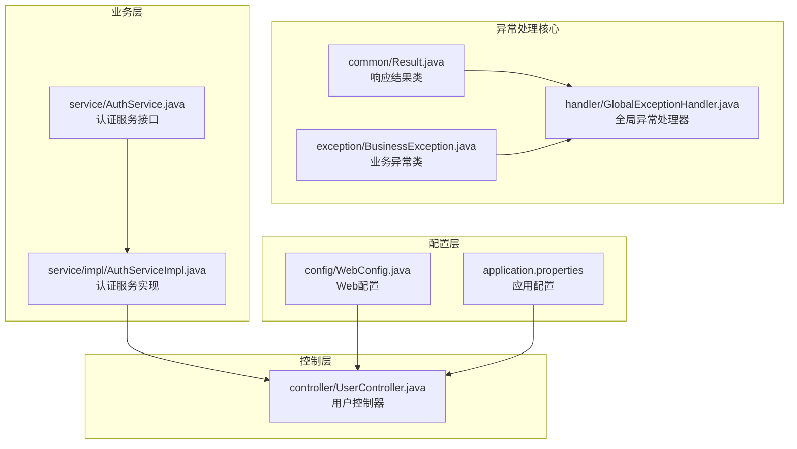
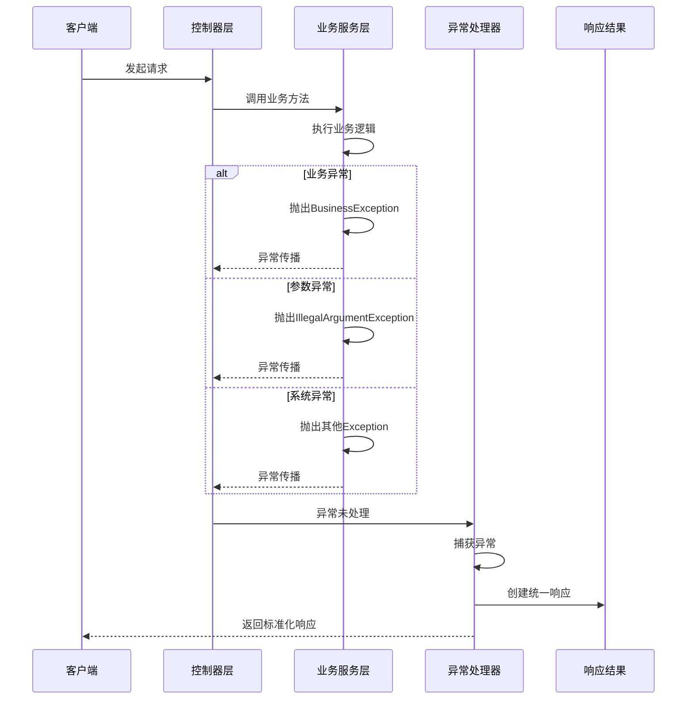
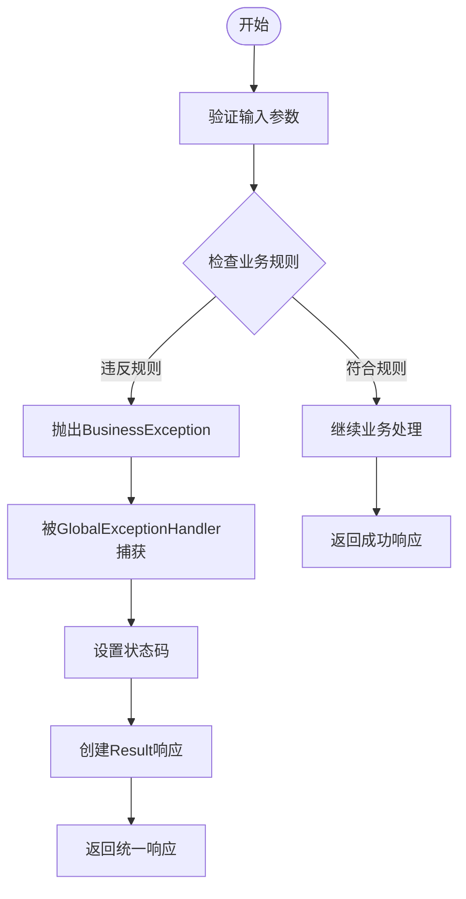
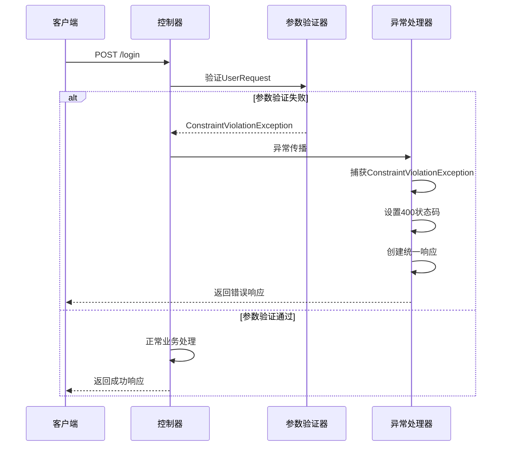
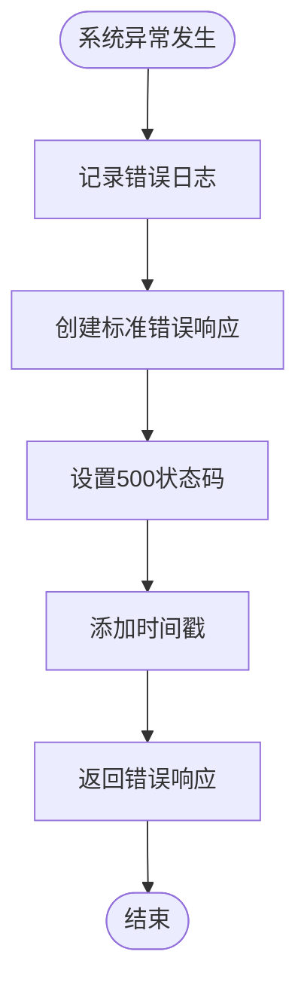
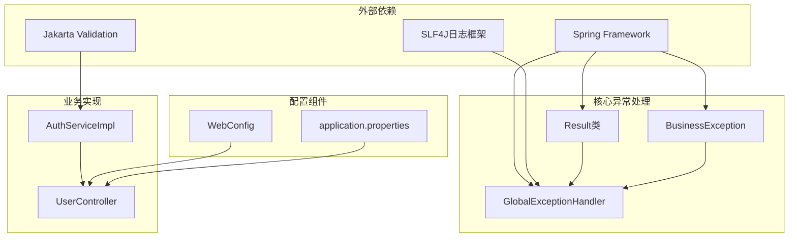

# 异常处理与全局错误管理


**本文档引用的文件**
- [Result.java](file://backend-repo/src/main/java/com/zjcxph/imgapi/common/Result.java)
- [BusinessException.java](file://backend-repo/src/main/java/com/zjcxph/imgapi/exception/BusinessException.java)
- [GlobalExceptionHandler.java](file://backend-repo/src/main/java/com/zjcxph/imgapi/handler/GlobalExceptionHandler.java)
- [UserController.java](file://backend-repo/src/main/java/com/zjcxph/imgapi/controller/UserController.java)
- [AuthServiceImpl.java](file://backend-repo/src/main/java/com/zjcxph/imgapi/service/impl/AuthServiceImpl.java)
- [UserRequest.java](file://backend-repo/src/main/java/com/zjcxph/imgapi/dto/req/UserRequest.java)
- [AuthUserUpdateRequest.java](file://backend-repo/src/main/java/com/zjcxph/imgapi/dto/req/AuthUserUpdateRequest.java)
- [WebConfig.java](file://backend-repo/src/main/java/com/zjcxph/imgapi/config/WebConfig.java)
- [application.properties](file://backend-repo/src/main/resources/application.properties)


## 目录
1. [简介](#简介)
2. [项目结构](#项目结构)
3. [核心组件](#核心组件)
4. [架构概览](#架构概览)
5. [详细组件分析](#详细组件分析)
6. [依赖关系分析](#依赖关系分析)
7. [性能考虑](#性能考虑)
8. [故障排除指南](#故障排除指南)
9. [结论](#结论)
10. [附录](#附录)

## 简介

MRR项目的异常处理系统采用统一的异常管理和响应机制，通过BusinessException业务异常、GlobalExceptionHandler全局异常处理器和Result响应结果类构建了完整的错误处理体系。该系统实现了对业务异常、系统异常、参数异常的分类处理，并提供了标准化的响应格式和日志记录机制。

## 项目结构

异常处理系统主要分布在以下目录结构中：



**图表来源**
- [Result.java:1-77](file://backend-repo/src/main/java/com/zjcxph/imgapi/common/Result.java#L1-L77)
- [BusinessException.java:1-20](file://backend-repo/src/main/java/com/zjcxph/imgapi/exception/BusinessException.java#L1-L20)
- [GlobalExceptionHandler.java:1-62](file://backend-repo/src/main/java/com/zjcxph/imgapi/handler/GlobalExceptionHandler.java#L1-L62)

**章节来源**
- [Result.java:1-77](file://backend-repo/src/main/java/com/zjcxph/imgapi/common/Result.java#L1-L77)
- [BusinessException.java:1-20](file://backend-repo/src/main/java/com/zjcxph/imgapi/exception/BusinessException.java#L1-L20)
- [GlobalExceptionHandler.java:1-62](file://backend-repo/src/main/java/com/zjcxph/imgapi/handler/GlobalExceptionHandler.java#L1-L62)

## 核心组件

### Result响应结果类

Result类是整个异常处理系统的核心数据结构，提供了统一的响应格式和链式调用支持。

**设计特点：**
- 泛型设计支持任意类型的数据封装
- 静态工厂方法提供便捷的创建方式
- 链式调用接口提升代码可读性
- 包含时间戳确保响应的时效性
- 支持分页场景的总数字段

**核心方法：**
- `success(String message)` - 创建成功响应
- `fail(String message)` - 创建失败响应  
- `code(Integer code)` - 设置响应码
- `message(String message)` - 设置消息内容
- `data(T data)` - 设置响应数据

**章节来源**
- [Result.java:12-18](file://backend-repo/src/main/java/com/zjcxph/imgapi/common/Result.java#L12-L18)
- [Result.java:39-52](file://backend-repo/src/main/java/com/zjcxph/imgapi/common/Result.java#L39-L52)

### BusinessException业务异常

BusinessException是系统定义的业务异常基类，继承自RuntimeException，专门用于处理业务逻辑中的异常情况。

**设计理念：**
- 统一业务异常的处理方式
- 支持自定义异常码和消息
- 与HTTP状态码保持一致的语义
- 便于前端进行针对性的错误处理

**构造方法：**
- `BusinessException(String message)` - 使用默认400状态码
- `BusinessException(Integer code, String message)` - 自定义状态码

**章节来源**
- [BusinessException.java:6-14](file://backend-repo/src/main/java/com/zjcxph/imgapi/exception/BusinessException.java#L6-L14)

### GlobalExceptionHandler全局异常处理器

GlobalExceptionHandler采用@RestControllerAdvice注解，提供全局的异常捕获和统一响应机制。

**异常处理策略：**
- 业务异常：映射到自定义状态码，统一400响应
- 参数校验异常：统一400 BAD_REQUEST响应
- 非法参数异常：统一400 BAD_REQUEST响应
- 非法状态异常：统一403 FORBIDDEN响应
- 其他异常：统一500 INTERNAL_SERVER_ERROR响应

**日志记录：**
- 业务异常：使用warn级别记录
- 参数异常：使用warn级别记录
- 系统异常：使用error级别记录

**章节来源**
- [GlobalExceptionHandler.java:19-30](file://backend-repo/src/main/java/com/zjcxph/imgapi/handler/GlobalExceptionHandler.java#L19-L30)
- [GlobalExceptionHandler.java:32-44](file://backend-repo/src/main/java/com/zjcxph/imgapi/handler/GlobalExceptionHandler.java#L32-L44)
- [GlobalExceptionHandler.java:53-60](file://backend-repo/src/main/java/com/zjcxph/imgapi/handler/GlobalExceptionHandler.java#L53-L60)

## 架构概览

异常处理系统的整体架构采用分层设计，从控制层到服务层再到异常处理器形成完整的异常处理链路。



**图表来源**
- [GlobalExceptionHandler.java:14-61](file://backend-repo/src/main/java/com/zjcxph/imgapi/handler/GlobalExceptionHandler.java#L14-L61)
- [UserController.java:38-47](file://backend-repo/src/main/java/com/zjcxph/imgapi/controller/UserController.java#L38-L47)

## 详细组件分析

### 业务异常处理流程

业务异常是MRR项目中最常见的异常类型，主要用于处理业务规则违反的情况。



**图表来源**
- [BusinessException.java:1-20](file://backend-repo/src/main/java/com/zjcxph/imgapi/exception/BusinessException.java#L1-L20)
- [GlobalExceptionHandler.java:19-30](file://backend-repo/src/main/java/com/zjcxph/imgapi/handler/GlobalExceptionHandler.java#L19-L30)

**章节来源**
- [BusinessException.java:1-20](file://backend-repo/src/main/java/com/zjcxph/imgapi/exception/BusinessException.java#L1-L20)
- [GlobalExceptionHandler.java:19-30](file://backend-repo/src/main/java/com/zjcxph/imgapi/handler/GlobalExceptionHandler.java#L19-L30)

### 参数异常处理机制

参数异常主要来源于Spring Validation框架的参数校验失败，系统提供了专门的异常处理器。



**图表来源**
- [GlobalExceptionHandler.java:32-37](file://backend-repo/src/main/java/com/zjcxph/imgapi/handler/GlobalExceptionHandler.java#L32-L37)
- [UserRequest.java:8-13](file://backend-repo/src/main/java/com/zjcxph/imgapi/dto/req/UserRequest.java#L8-L13)

**章节来源**
- [GlobalExceptionHandler.java:32-37](file://backend-repo/src/main/java/com/zjcxph/imgapi/handler/GlobalExceptionHandler.java#L32-L37)
- [UserRequest.java:8-13](file://backend-repo/src/main/java/com/zjcxph/imgapi/dto/req/UserRequest.java#L8-L13)

### 系统异常处理策略

系统异常是最底层的异常类型，通常由未预期的运行时错误引起。



**图表来源**
- [GlobalExceptionHandler.java:53-60](file://backend-repo/src/main/java/com/zjcxph/imgapi/handler/GlobalExceptionHandler.java#L53-L60)

**章节来源**
- [GlobalExceptionHandler.java:53-60](file://backend-repo/src/main/java/com/zjcxph/imgapi/handler/GlobalExceptionHandler.java#L53-L60)

### 异常分类与处理方式

系统将异常分为三个主要类别，每类都有相应的处理策略：

| 异常类型 | 触发条件 | 处理策略 | HTTP状态码 |
|---------|----------|----------|------------|
| 业务异常 | 业务规则违反 | 返回自定义状态码，统一400响应 | 400 |
| 参数异常 | 参数校验失败 | 返回400 BAD_REQUEST | 400 |
| 系统异常 | 未预期的运行时错误 | 返回500 INTERNAL_SERVER_ERROR | 500 |

**章节来源**
- [GlobalExceptionHandler.java:19-30](file://backend-repo/src/main/java/com/zjcxph/imgapi/handler/GlobalExceptionHandler.java#L19-L30)
- [GlobalExceptionHandler.java:32-44](file://backend-repo/src/main/java/com/zjcxph/imgapi/handler/GlobalExceptionHandler.java#L32-L44)
- [GlobalExceptionHandler.java:53-60](file://backend-repo/src/main/java/com/zjcxph/imgapi/handler/GlobalExceptionHandler.java#L53-L60)

## 依赖关系分析

异常处理系统的依赖关系体现了清晰的分层架构和职责分离。



**图表来源**
- [GlobalExceptionHandler.java:1-12](file://backend-repo/src/main/java/com/zjcxph/imgapi/handler/GlobalExceptionHandler.java#L1-L12)
- [AuthServiceImpl.java:1-25](file://backend-repo/src/main/java/com/zjcxph/imgapi/service/impl/AuthServiceImpl.java#L1-L25)
- [WebConfig.java:1-12](file://backend-repo/src/main/java/com/zjcxph/imgapi/config/WebConfig.java#L1-L12)

**章节来源**
- [GlobalExceptionHandler.java:1-12](file://backend-repo/src/main/java/com/zjcxph/imgapi/handler/GlobalExceptionHandler.java#L1-L12)
- [AuthServiceImpl.java:1-25](file://backend-repo/src/main/java/com/zjcxph/imgapi/service/impl/AuthServiceImpl.java#L1-L25)
- [WebConfig.java:1-12](file://backend-repo/src/main/java/com/zjcxph/imgapi/config/WebConfig.java#L1-L12)

## 性能考虑

异常处理系统在设计时充分考虑了性能影响，采用了多种优化策略：

### 日志性能优化
- 使用异步日志记录避免阻塞请求处理
- 合理的日志级别选择减少不必要的日志输出
- 条件化日志记录避免频繁的对象创建

### 响应性能优化
- 统一的响应格式减少序列化开销
- 链式调用接口提升代码执行效率
- 避免在异常处理中进行复杂的计算操作

### 内存使用优化
- 对象池化减少异常对象的创建频率
- 及时释放异常处理过程中的临时资源
- 避免异常信息中包含敏感的内存数据

## 故障排除指南

### 常见异常问题诊断

**业务异常处理问题：**
- 检查BusinessException的构造参数是否正确
- 验证状态码与HTTP状态码的一致性
- 确认异常消息的用户友好性

**参数异常处理问题：**
- 检查DTO类上的验证注解配置
- 验证参数校验的触发条件
- 确认ConstraintViolationException的处理逻辑

**系统异常处理问题：**
- 检查全局异常处理器的配置
- 验证日志记录的完整性和准确性
- 确认错误响应的标准化程度

### 调试技巧

**启用详细日志：**
```properties
logging.level.com.zjcxph.imgapi.handler=DEBUG
logging.level.com.zjcxph.imgapi.exception=DEBUG
```

**异常堆栈跟踪：**
- 在开发环境中启用完整的异常堆栈信息
- 使用SLF4J的MDC功能添加请求上下文信息
- 实现异常追踪ID确保问题的可追溯性

**章节来源**
- [application.properties:24-28](file://backend-repo/src/main/resources/application.properties#L24-L28)
- [GlobalExceptionHandler.java:17-17](file://backend-repo/src/main/java/com/zjcxph/imgapi/handler/GlobalExceptionHandler.java#L17-L17)

## 结论

MRR项目的异常处理系统通过BusinessException、GlobalExceptionHandler和Result三个核心组件构建了完整的错误处理体系。该系统具有以下优势：

1. **统一性**：所有异常都经过统一的处理和响应格式化
2. **可维护性**：清晰的分层架构便于代码维护和扩展
3. **可观测性**：完善的日志记录机制支持问题诊断和性能监控
4. **用户体验**：标准化的错误响应提升客户端的错误处理体验

系统在设计上充分考虑了性能影响，采用了多种优化策略确保异常处理不会成为系统的性能瓶颈。同时，通过合理的异常分类和处理策略，为不同类型的错误提供了恰当的响应方式。

## 附录

### 自定义异常开发指南

**创建新的业务异常：**
1. 继承BusinessException类
2. 定义合适的异常码和异常消息
3. 在业务逻辑中适当的位置抛出异常
4. 确保异常消息对用户友好且具有指导性

**扩展异常处理器：**
1. 在GlobalExceptionHandler中添加新的@ExceptionHandler方法
2. 定义异常处理逻辑和响应格式
3. 设置适当的HTTP状态码
4. 添加必要的日志记录

### 客户端错误处理建议

**最佳实践：**
- 根据响应码进行不同的错误处理策略
- 解析Result对象中的message字段显示给用户
- 对于401/403错误引导用户重新登录或申请权限
- 对于400错误解析具体的参数错误信息
- 实现错误重试机制处理临时性错误

**错误恢复策略：**
- 实现自动重试机制处理网络抖动
- 提供错误报告功能收集异常信息
- 实现优雅降级处理系统过载情况
- 建立错误监控和告警机制