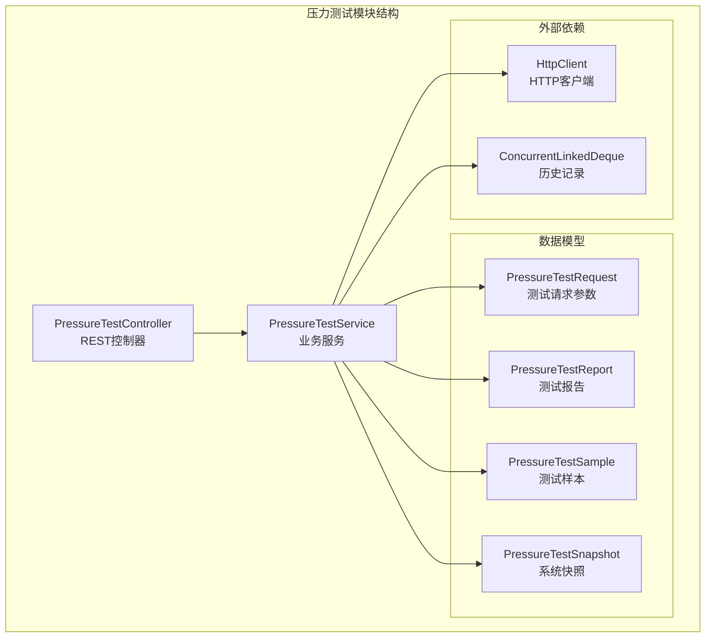
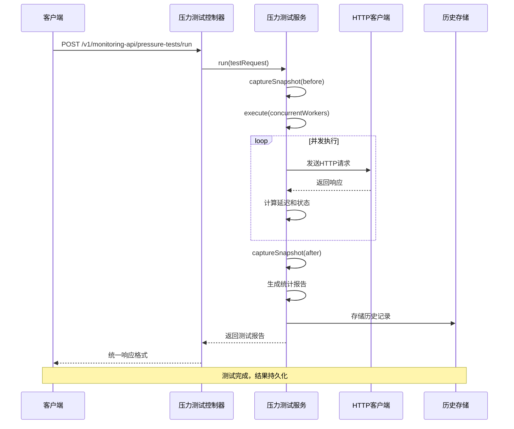
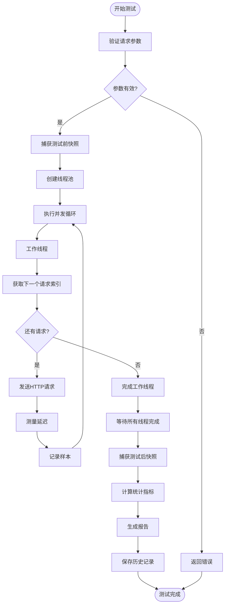
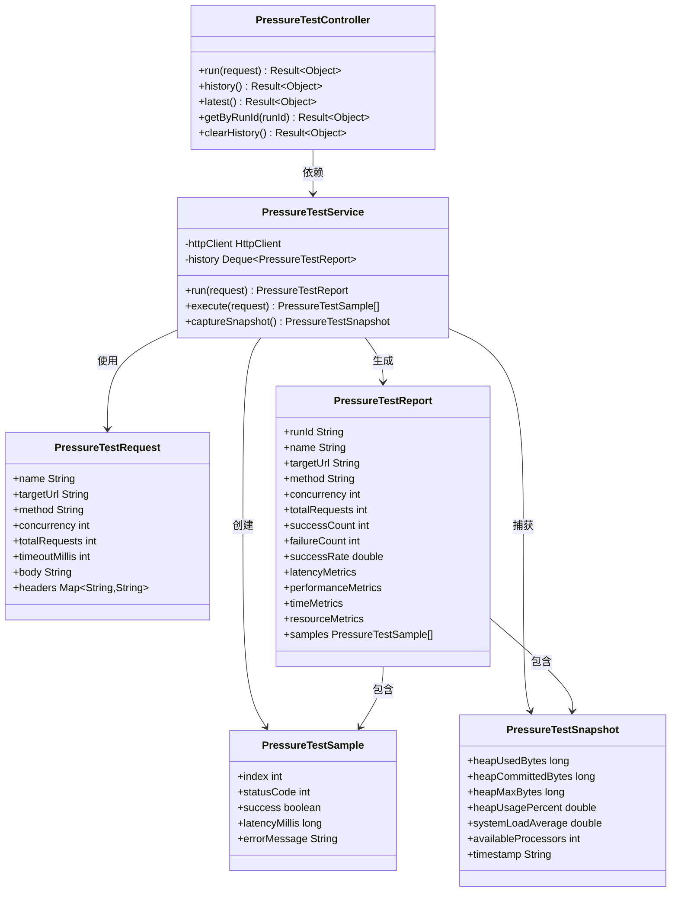

# 压力测试控制器


**本文档引用的文件**
- [PressureTestController.java](file://backend-repo/src/main/java/com/zjcxph/imgapi/controller/PressureTestController.java)
- [PressureTestService.java](file://backend-repo/src/main/java/com/zjcxph/imgapi/monitoring/PressureTestService.java)
- [PressureTestRequest.java](file://backend-repo/src/main/java/com/zjcxph/imgapi/monitoring/PressureTestRequest.java)
- [PressureTestReport.java](file://backend-repo/src/main/java/com/zjcxph/imgapi/monitoring/PressureTestReport.java)
- [PressureTestSample.java](file://backend-repo/src/main/java/com/zjcxph/imgapi/monitoring/PressureTestSample.java)
- [PressureTestSnapshot.java](file://backend-repo/src/main/java/com/zjcxph/imgapi/monitoring/PressureTestSnapshot.java)
- [PressureTestControllerIntegrationTest.java](file://backend-repo/src/test/java/com/zjcxph/imgapi/PressureTestControllerIntegrationTest.java)
- [API_CONTRACT.md](file://backend-repo/API_CONTRACT.md)


## 目录
1. [简介](#简介)
2. [项目结构](#项目结构)
3. [核心组件](#核心组件)
4. [架构概览](#架构概览)
5. [详细组件分析](#详细组件分析)
6. [依赖关系分析](#依赖关系分析)
7. [性能考虑](#性能考虑)
8. [故障排除指南](#故障排除指南)
9. [结论](#结论)
10. [附录](#附录)

## 简介

压力测试控制器是MRR（Medical Record Repository）系统中的关键监控组件，负责执行和管理HTTP压力测试。该控制器提供了完整的RESTful API接口，支持并发测试、性能基准测试、负载模拟和性能指标收集功能。通过该系统，开发者和运维人员可以评估系统的性能表现，识别性能瓶颈，并制定相应的优化策略。

该控制器基于Spring Boot框架构建，采用现代化的压力测试架构，支持多种HTTP方法、自定义请求头、请求体配置，并提供详细的性能报告和历史记录管理功能。

## 项目结构

压力测试功能位于后端服务的监控模块中，采用清晰的分层架构设计：



**图表来源**
- [PressureTestController.java:22-33](file://backend-repo/src/main/java/com/zjcxph/imgapi/controller/PressureTestController.java#L22-L33)
- [PressureTestService.java:32-42](file://backend-repo/src/main/java/com/zjcxph/imgapi/monitoring/PressureTestService.java#L32-L42)

**章节来源**
- [PressureTestController.java:1-73](file://backend-repo/src/main/java/com/zjcxph/imgapi/controller/PressureTestController.java#L1-L73)
- [PressureTestService.java:1-293](file://backend-repo/src/main/java/com/zjcxph/imgapi/monitoring/PressureTestService.java#L1-L293)

## 核心组件

### 压力测试控制器

压力测试控制器是RESTful API的入口点，提供以下核心功能：

- **测试执行**：启动新的压力测试任务
- **历史查询**：获取测试历史记录
- **结果检索**：获取最新或指定测试结果
- **数据清理**：清除历史测试记录

控制器采用标准的REST架构模式，每个操作对应一个HTTP端点，返回统一的响应格式。

### 压力测试服务

压力测试服务是核心业务逻辑实现，包含以下关键特性：

- **并发执行**：支持可配置的并发线程数
- **性能测量**：精确的延迟和吞吐量统计
- **资源监控**：系统内存和CPU使用情况跟踪
- **结果聚合**：生成详细的性能报告

### 数据模型体系

系统采用完整的数据模型来描述压力测试的各个方面：

- **请求模型**：定义测试配置参数
- **报告模型**：存储测试结果和统计数据
- **样本模型**：记录单个请求的详细信息
- **快照模型**：捕获测试过程中的系统状态

**章节来源**
- [PressureTestController.java:25-33](file://backend-repo/src/main/java/com/zjcxph/imgapi/controller/PressureTestController.java#L25-L33)
- [PressureTestService.java:32-136](file://backend-repo/src/main/java/com/zjcxph/imgapi/monitoring/PressureTestService.java#L32-L136)

## 架构概览

压力测试系统采用分层架构，确保了良好的关注点分离和可维护性：



**图表来源**
- [PressureTestController.java:35-41](file://backend-repo/src/main/java/com/zjcxph/imgapi/controller/PressureTestController.java#L35-L41)
- [PressureTestService.java:44-112](file://backend-repo/src/main/java/com/zjcxph/imgapi/monitoring/PressureTestService.java#L44-L112)

该架构实现了以下关键特性：
- **异步并发处理**：使用固定大小的线程池处理并发请求
- **资源隔离**：独立的HTTP客户端避免阻塞
- **结果持久化**：自动保存测试历史供后续分析
- **统一错误处理**：标准化的异常处理和响应格式

## 详细组件分析

### REST API接口定义

压力测试控制器提供以下RESTful接口：

#### 运行压力测试
- **端点**：`POST /v1/monitoring-api/pressure-tests/run`
- **功能**：启动新的压力测试任务
- **请求体**：`PressureTestRequest`对象
- **响应**：包含`PressureTestReport`的统一响应

#### 获取测试历史
- **端点**：`GET /v1/monitoring-api/pressure-tests/history`
- **功能**：获取所有历史测试记录
- **响应**：`List<PressureTestReport>`数组

#### 获取最新测试结果
- **端点**：`GET /v1/monitoring-api/pressure-tests/latest`
- **功能**：获取最近一次测试结果
- **响应**：单个`PressureTestReport`或null

#### 按运行ID获取报告
- **端点**：`GET /v1/monitoring-api/pressure-tests/{runId}`
- **功能**：根据运行ID获取特定测试报告
- **响应**：指定的`PressureTestReport`或错误信息

#### 清除历史记录
- **端点**：`DELETE /v1/monitoring-api/pressure-tests/history`
- **功能**：删除所有历史测试记录
- **响应**：确认消息

**章节来源**
- [PressureTestController.java:35-71](file://backend-repo/src/main/java/com/zjcxph/imgapi/controller/PressureTestController.java#L35-L71)

### 压力测试请求模型

`PressureTestRequest`类定义了完整的测试配置参数：

| 参数名称 | 类型 | 必需 | 默认值 | 限制 | 描述 |
|---------|------|------|--------|------|------|
| name | String | 否 | "pressure-test" | 非空 | 测试名称 |
| targetUrl | String | 是 | - | 非空 | 目标URL |
| method | String | 否 | "GET" | GET/POST/PUT/PATCH/DELETE | HTTP方法 |
| concurrency | int | 否 | 1 | 1-128 | 并发线程数 |
| totalRequests | int | 否 | 1 | 1-10000 | 总请求数 |
| timeoutMillis | int | 否 | 3000 | 100-30000 | 超时时间(ms) |
| body | String | 否 | null | 可选 | 请求体内容 |
| headers | `Map<String,String>` | 否 | {} | 可选 | 自定义请求头 |

**章节来源**
- [PressureTestRequest.java:12-179](file://backend-repo/src/main/java/com/zjcxph/imgapi/monitoring/PressureTestRequest.java#L12-L179)

### 压力测试报告模型

`PressureTestReport`类包含了完整的测试结果信息：

#### 基本信息
- **runId**：唯一测试标识符
- **name**：测试名称
- **targetUrl**：目标URL
- **method**：HTTP方法
- **concurrency**：并发数
- **totalRequests**：总请求数

#### 性能指标
- **successCount**：成功请求数
- **failureCount**：失败请求数
- **successRate**：成功率百分比
- **minLatencyMs**：最小延迟(ms)
- **avgLatencyMs**：平均延迟(ms)
- **p95LatencyMs**：95分位延迟(ms)
- **maxLatencyMs**：最大延迟(ms)
- **requestsPerSecond**：每秒请求数

#### 时间信息
- **durationMillis**：测试持续时间(ms)
- **startedAt/finishedAt**：开始和结束时间戳

#### 系统资源
- **beforeSnapshot/afterSnapshot**：测试前后系统快照
- **samples**：每个请求的详细样本

**章节来源**
- [PressureTestReport.java:6-316](file://backend-repo/src/main/java/com/zjcxph/imgapi/monitoring/PressureTestReport.java#L6-L316)

### 压力测试执行流程

压力测试服务的核心执行流程如下：



**图表来源**
- [PressureTestService.java:138-170](file://backend-repo/src/main/java/com/zjcxph/imgapi/monitoring/PressureTestService.java#L138-L170)
- [PressureTestService.java:44-112](file://backend-repo/src/main/java/com/zjcxph/imgapi/monitoring/PressureTestService.java#L44-L112)

**章节来源**
- [PressureTestService.java:138-170](file://backend-repo/src/main/java/com/zjcxph/imgapi/monitoring/PressureTestService.java#L138-L170)

### HTTP请求构建机制

压力测试服务支持多种HTTP方法和配置选项：

#### 支持的HTTP方法
- **GET**：默认方法，无请求体
- **POST**：可带JSON请求体
- **PUT**：更新资源
- **PATCH**：部分更新
- **DELETE**：删除资源

#### 请求头处理
- 自动设置Content-Type为application/json（当有请求体时）
- 支持自定义请求头覆盖
- 保持原始请求头不变

#### 请求体处理
- JSON格式自动检测和设置
- 支持任意字符串格式
- 自动编码UTF-8

**章节来源**
- [PressureTestService.java:190-230](file://backend-repo/src/main/java/com/zjcxph/imgapi/monitoring/PressureTestService.java#L190-L230)

### 性能指标计算

系统提供全面的性能指标计算：

#### 延迟统计
- **最小延迟**：最快响应时间
- **平均延迟**：所有请求的平均响应时间
- **95分位延迟**：95%请求的响应时间阈值
- **最大延迟**：最慢响应时间

#### 吞吐量指标
- **成功率**：成功请求数占总请求数的百分比
- **每秒请求数**：测试期间的平均吞吐量

#### 资源监控
- **内存使用**：堆内存使用量和百分比
- **系统负载**：操作系统平均负载
- **处理器数量**：可用CPU核心数

**章节来源**
- [PressureTestService.java:54-73](file://backend-repo/src/main/java/com/zjcxph/imgapi/monitoring/PressureTestService.java#L54-L73)
- [PressureTestService.java:232-251](file://backend-repo/src/main/java/com/zjcxph/imgapi/monitoring/PressureTestService.java#L232-L251)

## 依赖关系分析

压力测试系统具有清晰的依赖关系结构：



**图表来源**
- [PressureTestController.java:25-33](file://backend-repo/src/main/java/com/zjcxph/imgapi/controller/PressureTestController.java#L25-L33)
- [PressureTestService.java:32-42](file://backend-repo/src/main/java/com/zjcxph/imgapi/monitoring/PressureTestService.java#L32-L42)
- [PressureTestRequest.java:12-179](file://backend-repo/src/main/java/com/zjcxph/imgapi/monitoring/PressureTestRequest.java#L12-L179)

**章节来源**
- [PressureTestController.java:25-33](file://backend-repo/src/main/java/com/zjcxph/imgapi/controller/PressureTestController.java#L25-L33)
- [PressureTestService.java:32-42](file://backend-repo/src/main/java/com/zjcxph/imgapi/monitoring/PressureTestService.java#L32-L42)

## 性能考虑

### 并发控制

系统采用固定大小的线程池来控制并发度：

- **线程池大小**：等于配置的并发数
- **任务分配**：使用原子计数器进行公平的任务分配
- **资源回收**：测试完成后立即关闭线程池

### 内存管理

- **历史记录限制**：最多保留20条历史记录
- **样本存储**：按需存储每个请求的详细样本
- **快照频率**：仅在测试开始和结束时捕获系统状态

### 网络性能

- **HTTP客户端复用**：避免频繁创建连接
- **超时配置**：可配置的请求超时时间
- **重定向处理**：自动跟随HTTP重定向

### 监控开销

- **采样间隔**：仅在关键节点进行系统状态采样
- **指标计算**：在内存中进行实时统计计算
- **日志级别**：适当的日志级别避免性能影响

## 故障排除指南

### 常见问题及解决方案

#### 测试无法启动
**症状**：请求返回错误或超时
**可能原因**：
- 目标URL不可访问
- 网络连接问题
- 超时时间过短

**解决方法**：
- 验证目标URL可达性
- 增加timeoutMillis配置
- 检查网络防火墙设置

#### 并发数过高导致系统崩溃
**症状**：服务器响应缓慢或拒绝服务
**可能原因**：
- 并发数超过系统承载能力
- 内存不足
- CPU使用率过高

**解决方法**：
- 降低concurrency配置
- 监控系统资源使用情况
- 分批次执行大型测试

#### 结果不准确
**症状**：性能指标异常或波动较大
**可能原因**：
- 测试环境不稳定
- 其他进程干扰
- 缓存影响

**解决方法**：
- 在独立环境中执行测试
- 清理缓存和临时文件
- 多次测试取平均值

### 日志分析

系统提供了详细的日志输出：

- **测试开始**：记录测试配置参数
- **测试进度**：显示当前完成的请求数
- **错误信息**：记录请求失败的具体原因
- **测试完成**：汇总最终的性能指标

**章节来源**
- [PressureTestService.java:103-111](file://backend-repo/src/main/java/com/zjcxph/imgapi/monitoring/PressureTestService.java#L103-L111)

## 结论

压力测试控制器为MRR系统提供了强大而灵活的性能测试能力。通过RESTful API接口，用户可以轻松地执行各种类型的性能测试，包括并发测试、负载模拟和性能基准测试。

该系统的主要优势包括：

1. **完整的功能覆盖**：从测试配置到结果分析的全流程支持
2. **精确的性能指标**：提供详细的延迟和吞吐量统计
3. **系统资源监控**：实时跟踪内存和CPU使用情况
4. **历史记录管理**：方便的结果对比和趋势分析
5. **易于集成**：标准化的API接口便于自动化集成

通过合理配置和使用，该压力测试系统能够帮助开发团队及时发现性能瓶颈，优化系统架构，并确保在高负载情况下仍能提供稳定的服务。

## 附录

### 最佳实践建议

#### 测试场景配置
- **渐进式并发**：从低并发开始，逐步增加到目标水平
- **多样化负载**：包含不同类型的请求和数据量
- **真实场景模拟**：尽可能接近实际生产环境的配置

#### 测试数据准备
- **代表性数据集**：使用真实的业务数据进行测试
- **边界条件测试**：包含极端情况和异常场景
- **数据清理**：测试后及时清理临时数据

#### 结果分析方法
- **多维度分析**：同时考虑延迟、吞吐量和资源使用
- **趋势对比**：与历史数据进行对比分析
- **瓶颈识别**：重点关注异常的性能指标

#### 性能优化建议
- **数据库优化**：索引优化和查询调优
- **缓存策略**：合理的缓存配置和失效策略
- **连接池管理**：优化数据库和外部服务连接池
- **代码优化**：识别和优化热点代码路径

### API使用示例

#### 基本GET测试
```json
{
  "name": "basic-get-test",
  "targetUrl": "https://api.example.com/users",
  "method": "GET",
  "concurrency": 10,
  "totalRequests": 100,
  "timeoutMillis": 5000
}
```

#### POST请求测试
```json
{
  "name": "post-endpoint-test",
  "targetUrl": "https://api.example.com/users",
  "method": "POST",
  "concurrency": 5,
  "totalRequests": 50,
  "timeoutMillis": 10000,
  "headers": {
    "Authorization": "Bearer token",
    "Content-Type": "application/json"
  },
  "body": "{ \"name\": \"test\", \"email\": \"test@example.com\" }"
}
```

**章节来源**
- [PressureTestControllerIntegrationTest.java:50-88](file://backend-repo/src/test/java/com/zjcxph/imgapi/PressureTestControllerIntegrationTest.java#L50-L88)