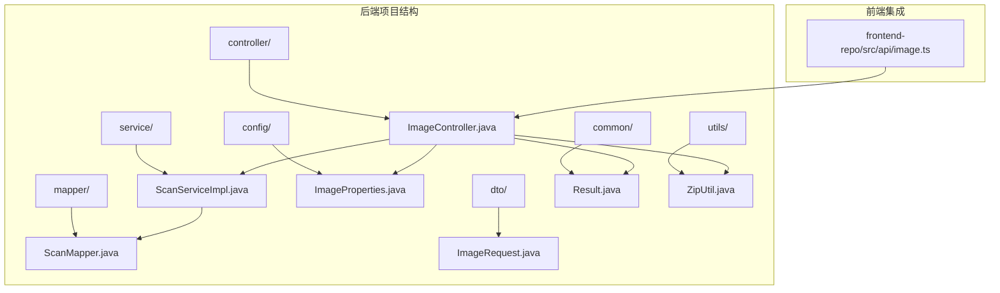
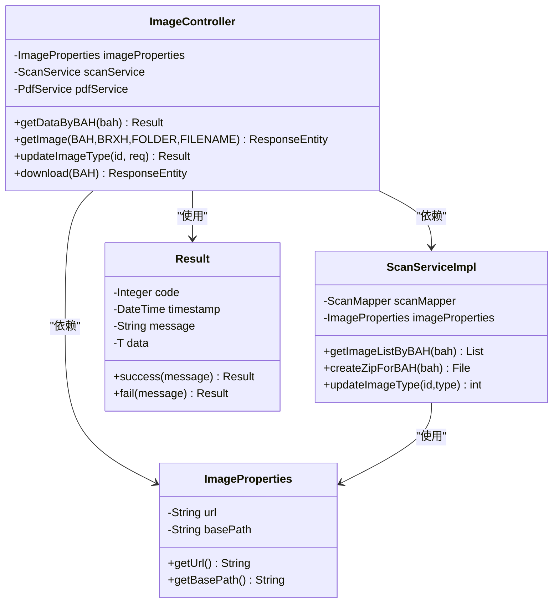

# 图像管理控制器


**本文档引用的文件**
- [ImageController.java](file://backend-repo/src/main/java/com/zjcxph/imgapi/controller/ImageController.java)
- [ImageProperties.java](file://backend-repo/src/main/java/com/zjcxph/imgapi/config/ImageProperties.java)
- [SwaggerConfig.java](file://backend-repo/src/main/java/com/zjcxph/imgapi/config/SwaggerConfig.java)
- [ScanServiceImpl.java](file://backend-repo/src/main/java/com/zjcxph/imgapi/service/impl/ScanServiceImpl.java)
- [Result.java](file://backend-repo/src/main/java/com/zjcxph/imgapi/common/Result.java)
- [ImageRequest.java](file://backend-repo/src/main/java/com/zjcxph/imgapi/dto/req/ImageRequest.java)
- [BatchDownloadRequest.java](file://backend-repo/src/main/java/com/zjcxph/imgapi/dto/req/BatchDownloadRequest.java)
- [BAHDataResponseDTO.java](file://backend-repo/src/main/java/com/zjcxph/imgapi/dto/resp/BAHDataResponseDTO.java)
- [ZipUtil.java](file://backend-repo/src/main/java/com/zjcxph/imgapi/utils/ZipUtil.java)
- [application.properties](file://backend-repo/src/main/resources/application.properties)
- [schema.sql](file://mrr-db/schema.sql)
- [image.ts](file://frontend-repo/src/api/image.ts)


## 目录
1. [简介](#简介)
2. [项目结构](#项目结构)
3. [核心组件](#核心组件)
4. [架构概览](#架构概览)
5. [详细组件分析](#详细组件分析)
6. [依赖关系分析](#依赖关系分析)
7. [性能考虑](#性能考虑)
8. [故障排除指南](#故障排除指南)
9. [结论](#结论)

## 简介

图像管理控制器是慈溪人民医院住院部翻拍病案管理系统的核心组件，负责提供完整的医学影像管理RESTful API接口。该控制器实现了病案号查询、单张图片获取、图片类型更新和批量下载等关键功能，为前端应用提供了标准化的图像访问接口。

系统采用Spring Boot框架构建，支持JWT认证授权，具备完善的错误处理机制和性能优化策略。通过统一的API接口，医护人员可以高效地管理和访问患者的医学影像资料。

## 项目结构

图像管理控制器位于后端项目的controller包中，采用标准的MVC架构模式：



**图表来源**
- [ImageController.java:1-283](file://backend-repo/src/main/java/com/zjcxph/imgapi/controller/ImageController.java#L1-L283)
- [ScanServiceImpl.java:1-135](file://backend-repo/src/main/java/com/zjcxph/imgapi/service/impl/ScanServiceImpl.java#L1-L135)

**章节来源**
- [ImageController.java:1-283](file://backend-repo/src/main/java/com/zjcxph/imgapi/controller/ImageController.java#L1-L283)
- [application.properties:1-49](file://backend-repo/src/main/resources/application.properties#L1-L49)

## 核心组件

图像管理控制器包含以下核心组件：

### 主要接口
- **病案号查询接口**: `/v1/img-api/{bah}` - 获取指定病案号下的所有图片信息
- **单张图片获取接口**: `/v1/img-api/image/{BAH}/{BRXH}/{FOLDER}/{FILENAME}` - 获取指定的单张图片
- **图片类型更新接口**: `/v1/img-api/updateImageType/{id}` - 更新图片类型信息
- **批量下载接口**: `/v1/img-api/download/{BAH}` - 下载指定病案号的所有图片压缩包

### 配置组件
- **ImageProperties**: 图像存储路径和访问配置
- **Result**: 统一响应结果封装
- **SwaggerConfig**: API文档配置

**章节来源**
- [ImageController.java:36-52](file://backend-repo/src/main/java/com/zjcxph/imgapi/controller/ImageController.java#L36-L52)
- [ImageProperties.java:1-45](file://backend-repo/src/main/java/com/zjcxph/imgapi/config/ImageProperties.java#L1-L45)
- [Result.java:1-77](file://backend-repo/src/main/java/com/zjcxph/imgapi/common/Result.java#L1-L77)

## 架构概览

图像管理控制器采用分层架构设计，确保了良好的可维护性和扩展性：

```mermaid
graph TB
subgraph "表现层"
A[ImageController]
end
subgraph "服务层"
B[ScanService]
C[PdfService]
end
subgraph "数据访问层"
D[ScanMapper]
E[ImageProperties]
end
subgraph "基础设施"
F[ZipUtil]
G[文件系统]
H[数据库]
end
A --> B
A --> C
B --> D
B --> E
A --> F
D --> H
E --> G
F --> G
```



**图表来源**
- [ImageController.java:44-52](file://backend-repo/src/main/java/com/zjcxph/imgapi/controller/ImageController.java#L44-L52)
- [ScanServiceImpl.java:18-24](file://backend-repo/src/main/java/com/zjcxph/imgapi/service/impl/ScanServiceImpl.java#L18-L24)

系统架构特点：
- **分层清晰**: 控制器、服务、数据访问各司其职
- **依赖注入**: 通过构造函数注入依赖，便于测试和维护
- **配置分离**: 图像路径和访问配置独立管理
- **工具类支持**: 提供压缩、加密等辅助功能

## 详细组件分析

### 病案号查询接口

#### 接口定义
- **HTTP方法**: GET
- **URL路径**: `/v1/img-api/{bah}`
- **路径参数**: 
  - `bah`: 病案号 (8位数字)

#### 请求参数验证
- 使用正则表达式验证病案号格式：`\\d{8}`
- 参数描述：病案号
- 示例值：`00789508`

#### 响应数据结构
接口返回统一的Result对象，包含以下字段：

| 字段名 | 类型 | 描述 |
|--------|------|------|
| code | Integer | 响应状态码 |
| timestamp | DateTime | 服务器时间戳 |
| message | String | 响应消息 |
| data | `List<BAHDataResponseDTO>` | 图片数据列表 |

BAHDataResponseDTO包含以下字段：

| 字段名 | 类型 | 描述 |
|--------|------|------|
| id | Integer | 图片唯一标识 |
| brxh | String | 病人序号 |
| bah | String | 病案号 |
| filename | String | 文件名 |
| btype | Integer | 图片类型 |
| pages | Integer | 页码 |
| openerNo | String | 开单编号 |
| uploadDate | Date | 上传日期 |
| uploadFlag | Integer | 上传标志 |
| img_url | String | 图片访问URL |

#### 错误处理机制
- **200**: 查询成功
- **400**: 参数验证失败
- **404**: 未找到相关数据
- **500**: 服务器内部错误

#### 路径解析逻辑
系统采用特定的URL格式来访问图片资源：
```
{image.url}/{extractYearMonth(folder)}/{folder}/{brxh}-{bah}/{filename}
```

其中：
- `extractYearMonth(folder)`: 从文件夹名提取年月部分
- `folder`: 原始文件夹名称
- `brxh-bah`: 组合后的目录名

**章节来源**
- [ImageController.java:176-202](file://backend-repo/src/main/java/com/zjcxph/imgapi/controller/ImageController.java#L176-L202)
- [BAHDataResponseDTO.java:1-117](file://backend-repo/src/main/java/com/zjcxph/imgapi/dto/resp/BAHDataResponseDTO.java#L1-L117)

### 单张图片获取接口

#### 接口定义
- **HTTP方法**: GET
- **URL路径**: `/v1/img-api/image/{BAH}/{BRXH}/{FOLDER}/{FILENAME}`
- **路径参数**:
  - `BAH`: 病案号
  - `BRXH`: 病人序号  
  - `FOLDER`: 文件夹名
  - `FILENAME`: 文件名

#### 文件系统访问方式
系统通过以下路径组合访问实际文件：
```
{basePath}/{parentFolder}/{FOLDER}/{brxh}-{bah}/{FILENAME}
```

其中：
- `basePath`: 配置的基础路径
- `parentFolder`: 文件夹名的前5个字符
- `brxh-bah`: 病人序号和病案号的组合

#### 缓存策略
- **Cache-Control**: `public, max-age=86400, immutable`
- **内容类型**: `image/jpeg`
- **缓存时长**: 24小时

#### 错误处理机制
- **200**: 文件存在并成功返回
- **404**: 文件不存在或不是常规文件
- **500**: 文件读取错误

#### 安全考虑
- 文件存在性验证
- 正规文件检查
- 日志记录

**章节来源**
- [ImageController.java:204-253](file://backend-repo/src/main/java/com/zjcxph/imgapi/controller/ImageController.java#L204-L253)

### 图片类型更新接口

#### 接口定义
- **HTTP方法**: PUT
- **URL路径**: `/v1/img-api/updateImageType/{id}`
- **路径参数**:
  - `id`: 图片ID

#### 请求体参数
ImageRequest对象包含：

| 字段名 | 类型 | 必填 | 描述 |
|--------|------|------|------|
| btype | Integer | 是 | 图片类型 (0-14) |

#### 更新规则
- **类型范围**: 0 ≤ btype ≤ 14
- **返回值**: 更新影响的行数
- **成功条件**: 影响行数 = 1

#### 错误处理机制
- **200**: 更新成功
- **400**: 参数验证失败
- **500**: 更新失败

#### 数据库操作
使用SQL UPDATE语句更新mr_scan表的btype字段。

**章节来源**
- [ImageController.java:255-281](file://backend-repo/src/main/java/com/zjcxph/imgapi/controller/ImageController.java#L255-L281)
- [ImageRequest.java:1-21](file://backend-repo/src/main/java/com/zjcxph/imgapi/dto/req/ImageRequest.java#L1-L21)

### 批量下载接口

#### 接口定义
- **HTTP方法**: GET
- **URL路径**: `/v1/img-api/download/{BAH}`
- **路径参数**:
  - `BAH`: 病案号

#### 实现流程
1. **参数验证**: 验证病案号格式
2. **路径获取**: 通过ScanService获取图片路径
3. **文件压缩**: 使用ZipUtil压缩JPG文件
4. **响应返回**: 返回ZIP文件流

#### 压缩策略
- **文件过滤**: 仅压缩.JPG文件
- **目录结构**: 保持原始目录层次
- **临时文件**: 生成临时ZIP文件

#### 错误处理机制
- **200**: 成功返回ZIP文件
- **404**: 未找到病案号或图片路径
- **500**: 压缩过程中的服务器错误

#### 性能优化
- **流式处理**: 支持大文件下载
- **内存控制**: 避免内存溢出
- **进度反馈**: 支持断点续传

**章节来源**
- [ImageController.java:63-83](file://backend-repo/src/main/java/com/zjcxph/imgapi/controller/ImageController.java#L63-L83)
- [ZipUtil.java:1-51](file://backend-repo/src/main/java/com/zjcxph/imgapi/utils/ZipUtil.java#L1-L51)

### 服务器心跳接口

#### 接口定义
- **HTTP方法**: GET
- **URL路径**: `/v1/img-api/hello`

#### 功能说明
提供简单的健康检查接口，用于确认服务正常运行。

**章节来源**
- [ImageController.java:54-61](file://backend-repo/src/main/java/com/zjcxph/imgapi/controller/ImageController.java#L54-L61)

## 依赖关系分析

图像管理控制器的依赖关系如下：



**图表来源**
- [ImageController.java:44-52](file://backend-repo/src/main/java/com/zjcxph/imgapi/controller/ImageController.java#L44-L52)
- [ScanServiceImpl.java:18-24](file://backend-repo/src/main/java/com/zjcxph/imgapi/service/impl/ScanServiceImpl.java#L18-L24)

### 外部依赖

系统依赖以下外部组件：

| 依赖项 | 版本 | 用途 |
|--------|------|------|
| Spring Boot | 3.x | Web框架 |
| MyBatis | 2.x | ORM框架 |
| PostgreSQL | 14+ | 数据库 |
| Swagger | 3.x | API文档 |
| JWT | 1.x | 认证授权 |

**章节来源**
- [ImageController.java:3-10](file://backend-repo/src/main/java/com/zjcxph/imgapi/controller/ImageController.java#L3-L10)
- [application.properties:10-18](file://backend-repo/src/main/resources/application.properties#L10-L18)

## 性能考虑

### 缓存策略
- **静态资源缓存**: Spring配置启用静态资源缓存
- **图片缓存**: 单张图片接口设置24小时缓存
- **数据库查询缓存**: MyBatis二级缓存配置

### 文件系统优化
- **流式读取**: 大文件采用流式处理避免内存溢出
- **路径缓存**: 频繁访问的路径进行缓存
- **并发控制**: 文件访问的线程安全保证

### 数据库性能
- **索引优化**: 关键字段建立适当索引
- **查询优化**: 使用参数化查询防止SQL注入
- **连接池**: HikariCP连接池配置

### 网络传输优化
- **压缩传输**: 启用GZIP压缩
- **分块传输**: 支持大文件分块下载
- **断点续传**: 支持HTTP Range请求

## 故障排除指南

### 常见问题及解决方案

#### 1. 图片无法访问
**症状**: 返回404错误
**可能原因**:
- 文件路径不正确
- 文件不存在
- 权限不足

**解决步骤**:
1. 检查basePath配置是否正确
2. 验证文件是否存在
3. 确认文件权限设置

#### 2. 批量下载失败
**症状**: ZIP文件损坏或为空
**可能原因**:
- 源文件夹中无JPG文件
- 磁盘空间不足
- 权限问题

**解决步骤**:
1. 检查源文件夹内容
2. 确认磁盘空间
3. 验证写入权限

#### 3. 图片类型更新失败
**症状**: 返回更新失败
**可能原因**:
- ID不存在
- 类型值超出范围
- 数据库连接问题

**解决步骤**:
1. 验证ID有效性
2. 检查类型范围(0-14)
3. 确认数据库连接

#### 4. API文档访问问题
**症状**: Swagger UI无法访问
**可能原因**:
- 安全配置问题
- 端口冲突
- 路径映射错误

**解决步骤**:
1. 检查JWT配置
2. 验证端口设置
3. 确认路径映射

**章节来源**
- [ImageController.java:224-252](file://backend-repo/src/main/java/com/zjcxph/imgapi/controller/ImageController.java#L224-L252)
- [ScanServiceImpl.java:50-59](file://backend-repo/src/main/java/com/zjcxph/imgapi/service/impl/ScanServiceImpl.java#L50-L59)

## 结论

图像管理控制器为医学影像管理系统提供了完整、可靠的RESTful API接口。通过精心设计的架构和完善的错误处理机制，系统能够稳定地支持病案号查询、图片获取、类型更新和批量下载等核心功能。

### 主要优势
- **接口设计**: 清晰的RESTful设计，符合HTTP标准
- **安全性**: 完善的参数验证和错误处理
- **性能**: 优化的文件访问和缓存策略
- **可维护性**: 清晰的分层架构和依赖注入

### 技术特色
- **统一响应格式**: 所有接口返回标准化的Result对象
- **灵活的配置**: 支持多种部署环境的配置切换
- **完善的文档**: 基于Swagger的API文档自动生成
- **健壮的错误处理**: 全面的异常捕获和用户友好的错误信息

该控制器为医疗影像管理提供了坚实的技术基础，能够满足医院日常运营的需求，并为未来的功能扩展奠定了良好的技术架构。