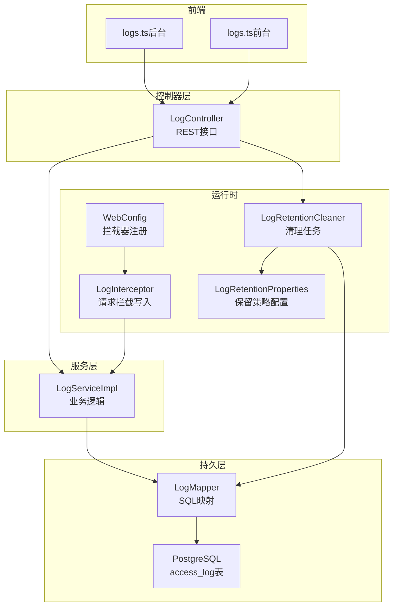
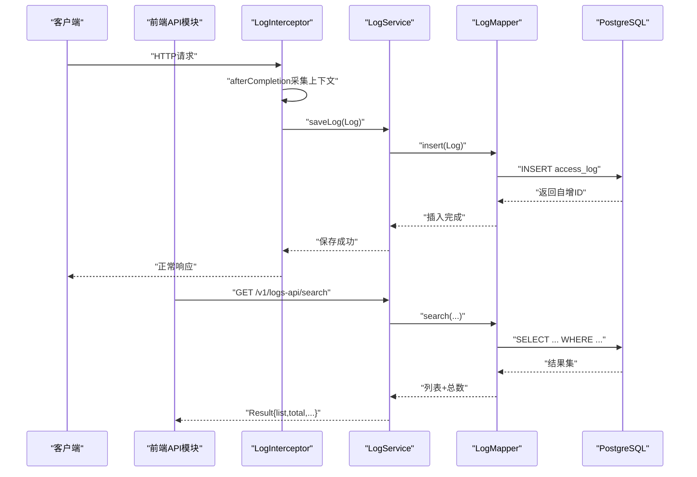
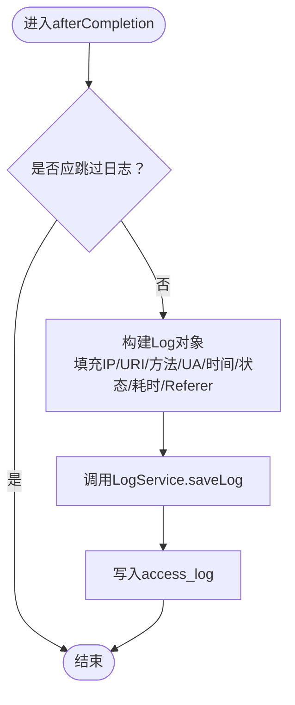
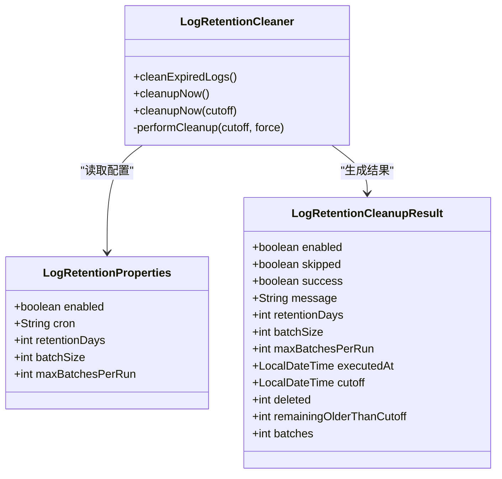
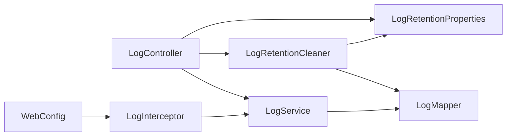

# 日志管理控制器


**本文引用的文件**
- [LogController.java](file://backend-repo/src/main/java/com/zjcxph/imgapi/controller/LogController.java)
- [LogServiceImpl.java](file://backend-repo/src/main/java/com/zjcxph/imgapi/service/impl/LogServiceImpl.java)
- [Log.java](file://backend-repo/src/main/java/com/zjcxph/imgapi/entity/Log.java)
- [LogRetentionCleanupResult.java](file://backend-repo/src/main/java/com/zjcxph/imgapi/dto/resp/LogRetentionCleanupResult.java)
- [LogRetentionCleaner.java](file://backend-repo/src/main/java/com/zjcxph/imgapi/scheduler/LogRetentionCleaner.java)
- [LogRetentionProperties.java](file://backend-repo/src/main/java/com/zjcxph/imgapi/config/LogRetentionProperties.java)
- [LogMapper.java](file://backend-repo/src/main/java/com/zjcxph/imgapi/mapper/LogMapper.java)
- [LogInterceptor.java](file://backend-repo/src/main/java/com/zjcxph/imgapi/interceptors/LogInterceptor.java)
- [WebConfig.java](file://backend-repo/src/main/java/com/zjcxph/imgapi/config/WebConfig.java)
- [schema-postgresql.sql](file://backend-repo/src/main/resources/schema-postgresql.sql)
- [application.properties](file://backend-repo/src/main/resources/application.properties)
- [logs.ts（前端-后台）](file://frontend-fantastic-admin/src/api/modules/logs.ts)
- [logs.ts（前端-前台）](file://frontend-repo/src/api/logs.ts)


## 目录
1. [简介](#简介)
2. [项目结构](#项目结构)
3. [核心组件](#核心组件)
4. [架构总览](#架构总览)
5. [详细组件分析](#详细组件分析)
6. [依赖分析](#依赖分析)
7. [性能考虑](#性能考虑)
8. [故障排查指南](#故障排查指南)
9. [结论](#结论)
10. [附录](#附录)

## 简介
本文件为后端日志管理控制器（LogController）的详细API文档，覆盖以下能力：
- 日志查询：按ID、分页全量、按客户端IP、按请求URI查询
- 日志过滤与检索：关键词、客户端IP、请求URI、HTTP方法、响应状态、时间范围
- 日志导出：基于保留策略导出过期访问日志为CSV
- 日志清理：基于保留策略的定时与手动清理
- 日志级别与格式：统一字段与时间格式化
- 存储策略：PostgreSQL表结构与索引设计
- 性能优化：分页、批量删除、流式导出
- 轮转与归档：基于保留天数的清理与导出
- 分析与监控：前端API对接与指标暴露

## 项目结构
后端采用Spring MVC + MyBatis实现，日志模块由控制器、服务、持久层、拦截器、调度器与配置组成；数据库为PostgreSQL，包含访问日志表及索引。



图示来源
- [LogController.java:32-54](file://backend-repo/src/main/java/com/zjcxph/imgapi/controller/LogController.java#L32-L54)
- [LogServiceImpl.java:11-70](file://backend-repo/src/main/java/com/zjcxph/imgapi/service/impl/LogServiceImpl.java#L11-L70)
- [LogMapper.java:9-165](file://backend-repo/src/main/java/com/zjcxph/imgapi/mapper/LogMapper.java#L9-L165)
- [LogInterceptor.java:15-89](file://backend-repo/src/main/java/com/zjcxph/imgapi/interceptors/LogInterceptor.java#L15-L89)
- [WebConfig.java:11-60](file://backend-repo/src/main/java/com/zjcxph/imgapi/config/WebConfig.java#L11-L60)
- [LogRetentionProperties.java:5-53](file://backend-repo/src/main/java/com/zjcxph/imgapi/config/LogRetentionProperties.java#L5-L53)
- [LogRetentionCleaner.java:13-118](file://backend-repo/src/main/java/com/zjcxph/imgapi/scheduler/LogRetentionCleaner.java#L13-L118)
- [schema-postgresql.sql:61-90](file://backend-repo/src/main/resources/schema-postgresql.sql#L61-L90)
- [logs.ts（前端-后台）:1-32](file://frontend-fantastic-admin/src/api/modules/logs.ts#L1-L32)
- [logs.ts（前端-前台）:1-18](file://frontend-repo/src/api/logs.ts#L1-L18)

章节来源
- [LogController.java:32-54](file://backend-repo/src/main/java/com/zjcxph/imgapi/controller/LogController.java#L32-L54)
- [LogServiceImpl.java:11-70](file://backend-repo/src/main/java/com/zjcxph/imgapi/service/impl/LogServiceImpl.java#L11-L70)
- [LogMapper.java:9-165](file://backend-repo/src/main/java/com/zjcxph/imgapi/mapper/LogMapper.java#L9-L165)
- [LogInterceptor.java:15-89](file://backend-repo/src/main/java/com/zjcxph/imgapi/interceptors/LogInterceptor.java#L15-L89)
- [WebConfig.java:11-60](file://backend-repo/src/main/java/com/zjcxph/imgapi/config/WebConfig.java#L11-L60)
- [LogRetentionProperties.java:5-53](file://backend-repo/src/main/java/com/zjcxph/imgapi/config/LogRetentionProperties.java#L5-L53)
- [LogRetentionCleaner.java:13-118](file://backend-repo/src/main/java/com/zjcxph/imgapi/scheduler/LogRetentionCleaner.java#L13-L118)
- [schema-postgresql.sql:61-90](file://backend-repo/src/main/resources/schema-postgresql.sql#L61-L90)
- [application.properties:40-45](file://backend-repo/src/main/resources/application.properties#L40-L45)
- [logs.ts（前端-后台）:1-32](file://frontend-fantastic-admin/src/api/modules/logs.ts#L1-L32)
- [logs.ts（前端-前台）:1-18](file://frontend-repo/src/api/logs.ts#L1-L18)

## 核心组件
- 控制器：提供REST接口，负责参数校验、分页安全处理、CSV导出流式输出、调用服务执行清理
- 服务：封装分页查询、统计计数、搜索条件拼装
- 持久层：MyBatis映射SQL，支持分页、条件查询、批量删除、导出扫描
- 拦截器：在afterCompletion阶段采集请求上下文并写入日志
- 配置与调度：保留策略配置与定时清理任务
- 数据库：access_log表与多维索引

章节来源
- [LogController.java:32-54](file://backend-repo/src/main/java/com/zjcxph/imgapi/controller/LogController.java#L32-L54)
- [LogServiceImpl.java:11-70](file://backend-repo/src/main/java/com/zjcxph/imgapi/service/impl/LogServiceImpl.java#L11-L70)
- [LogMapper.java:9-165](file://backend-repo/src/main/java/com/zjcxph/imgapi/mapper/LogMapper.java#L9-L165)
- [LogInterceptor.java:15-89](file://backend-repo/src/main/java/com/zjcxph/imgapi/interceptors/LogInterceptor.java#L15-L89)
- [LogRetentionProperties.java:5-53](file://backend-repo/src/main/java/com/zjcxph/imgapi/config/LogRetentionProperties.java#L5-L53)
- [LogRetentionCleaner.java:13-118](file://backend-repo/src/main/java/com/zjcxph/imgapi/scheduler/LogRetentionCleaner.java#L13-L118)
- [schema-postgresql.sql:61-90](file://backend-repo/src/main/resources/schema-postgresql.sql#L61-L90)

## 架构总览
日志管理通过拦截器自动采集访问数据，写入数据库；控制器提供查询、过滤、导出与清理接口；清理任务按配置周期执行或手动触发；前端通过API模块调用。



图示来源
- [LogInterceptor.java:36-58](file://backend-repo/src/main/java/com/zjcxph/imgapi/interceptors/LogInterceptor.java#L36-L58)
- [LogServiceImpl.java:17-20](file://backend-repo/src/main/java/com/zjcxph/imgapi/service/impl/LogServiceImpl.java#L17-L20)
- [LogMapper.java:24-27](file://backend-repo/src/main/java/com/zjcxph/imgapi/mapper/LogMapper.java#L24-L27)
- [LogController.java:150-202](file://backend-repo/src/main/java/com/zjcxph/imgapi/controller/LogController.java#L150-L202)

## 详细组件分析

### REST API定义与行为
- 基础路径
  - v2/logs 与 v1/logs-api 双路径兼容
- 查询类接口
  - GET /v1/logs-api/{id}：按ID查询单条日志
  - GET /v1/logs-api/：分页查询全部日志
  - GET /v1/logs-api/ip/{ip}：按客户端IP分页查询
  - GET /v1/logs-api/uri?uri=...：按请求URI分页查询
- 搜索与过滤
  - GET /v1/logs-api/search：支持关键词、客户端IP、请求URI、方法、响应状态、起止时间范围
- 清理与导出
  - POST /v1/logs-api/retention/cleanup：按保留策略清理过期日志（可指定截止时间）
  - GET /v1/logs-api/retention/export：导出过期日志为CSV（流式输出）

章节来源
- [LogController.java:56-202](file://backend-repo/src/main/java/com/zjcxph/imgapi/controller/LogController.java#L56-L202)

### 参数与分页安全
- 最大分页大小限制为200，防止过大内存占用
- 对传入字符串进行trim与空值归一化
- 时间参数格式化为“yyyy-MM-dd HH:mm:ss”
- 搜索接口对各过滤字段做非空与去空白处理

章节来源
- [LogController.java:36-37](file://backend-repo/src/main/java/com/zjcxph/imgapi/controller/LogController.java#L36-L37)
- [LogController.java:162-171](file://backend-repo/src/main/java/com/zjcxph/imgapi/controller/LogController.java#L162-L171)
- [LogController.java:204-214](file://backend-repo/src/main/java/com/zjcxph/imgapi/controller/LogController.java#L204-L214)

### 日志模型与字段
- 字段清单：id、clientIp、requestUri、method、userAgent、accessTime、queryString、requestBody、responseStatus、executeTime、referer
- 时间字段统一为Date类型，导出时格式化为“yyyy-MM-dd HH:mm:ss”

章节来源
- [Log.java:8-19](file://backend-repo/src/main/java/com/zjcxph/imgapi/entity/Log.java#L8-L19)
- [LogController.java:238-243](file://backend-repo/src/main/java/com/zjcxph/imgapi/controller/LogController.java#L238-L243)

### 数据库表结构与索引
- 表名：access_log
- 关键索引：按access_time倒序、(access_time,id)升序、client_ip、request_uri、method、response_status、method+status
- 作用：加速分页、按时间范围查询、按IP/URI/方法/状态过滤

章节来源
- [schema-postgresql.sql:61-90](file://backend-repo/src/main/resources/schema-postgresql.sql#L61-L90)

### 日志拦截与入库流程
- 拦截器在afterCompletion阶段采集请求头、请求体摘要、响应状态、耗时等
- 支持跳过OPTIONS、静态资源、Swagger、Actuator、favicon、/error等路径
- 客户端IP优先级：X-Forwarded-For → X-Real-IP → RemoteAddr



图示来源
- [LogInterceptor.java:36-58](file://backend-repo/src/main/java/com/zjcxph/imgapi/interceptors/LogInterceptor.java#L36-L58)
- [LogInterceptor.java:60-77](file://backend-repo/src/main/java/com/zjcxph/imgapi/interceptors/LogInterceptor.java#L60-L77)
- [LogInterceptor.java:79-88](file://backend-repo/src/main/java/com/zjcxph/imgapi/interceptors/LogInterceptor.java#L79-L88)
- [LogServiceImpl.java:17-20](file://backend-repo/src/main/java/com/zjcxph/imgapi/service/impl/LogServiceImpl.java#L17-L20)
- [LogMapper.java:24-27](file://backend-repo/src/main/java/com/zjcxph/imgapi/mapper/LogMapper.java#L24-L27)

章节来源
- [LogInterceptor.java:15-89](file://backend-repo/src/main/java/com/zjcxph/imgapi/interceptors/LogInterceptor.java#L15-L89)
- [WebConfig.java:49-58](file://backend-repo/src/main/java/com/zjcxph/imgapi/config/WebConfig.java#L49-L58)

### 日志清理与保留策略
- 配置项
  - enabled：是否启用
  - cron：定时表达式，默认每日凌晨2:30
  - retentionDays：保留天数，默认1095
  - batchSize：单批删除数量，默认5000
  - maxBatchesPerRun：每轮最大批次，默认20
- 行为
  - 定时任务：按cron执行清理
  - 手动触发：POST /v1/logs-api/retention/cleanup
  - 批量删除：按access_time升序与id升序分批删除，避免锁竞争
  - 结果反馈：包含是否启用、是否跳过、是否成功、消息、删除数量、剩余数量、批次数、截止时间等



图示来源
- [LogRetentionProperties.java:5-53](file://backend-repo/src/main/java/com/zjcxph/imgapi/config/LogRetentionProperties.java#L5-L53)
- [LogRetentionCleaner.java:13-118](file://backend-repo/src/main/java/com/zjcxph/imgapi/scheduler/LogRetentionCleaner.java#L13-L118)
- [LogRetentionCleanupResult.java:7-118](file://backend-repo/src/main/java/com/zjcxph/imgapi/dto/resp/LogRetentionCleanupResult.java#L7-L118)

章节来源
- [LogRetentionProperties.java:5-53](file://backend-repo/src/main/java/com/zjcxph/imgapi/config/LogRetentionProperties.java#L5-L53)
- [LogRetentionCleaner.java:26-37](file://backend-repo/src/main/java/com/zjcxph/imgapi/scheduler/LogRetentionCleaner.java#L26-L37)
- [LogRetentionCleaner.java:39-117](file://backend-repo/src/main/java/com/zjcxph/imgapi/scheduler/LogRetentionCleaner.java#L39-L117)
- [LogRetentionCleanupResult.java:7-118](file://backend-repo/src/main/java/com/zjcxph/imgapi/dto/resp/LogRetentionCleanupResult.java#L7-L118)

### 日志导出（CSV）
- 触发方式：GET /v1/logs-api/retention/export
- 条件：仅当保留天数大于0时允许导出
- 流式输出：逐批读取过期日志，写入UTF-8带BOM的CSV，包含表头与多行数据
- 响应头：Content-Disposition、X-Export-Total、X-Export-Cutoff、Content-Type=text/csv
- 批量策略：根据batchSize与总数量循环拉取

```mermaid
sequenceDiagram
participant C as "客户端"
participant LC as "LogController"
participant LR as "LogRetentionProperties"
participant LM as "LogMapper"
participant OS as "StreamingResponseBody"
C->>LC : "GET /v1/logs-api/retention/export"
LC->>LR : "读取retentionDays/batchSize"
LR-->>LC : "配置值"
LC->>LC : "计算cutoff=now()-days"
LC->>LM : "countOlderThan(cutoff)"
LM-->>LC : "total"
LC->>OS : "创建流式响应"
loop "分批导出"
LC->>LM : "findOlderThan(cutoff, batchSize, offset)"
LM-->>LC : "List&lt;Log&gt;"
LC->>OS : "写入CSV行"
end
LC-->>C : "返回CSV流"
```

图示来源
- [LogController.java:108-148](file://backend-repo/src/main/java/com/zjcxph/imgapi/controller/LogController.java#L108-L148)
- [LogRetentionProperties.java:5-53](file://backend-repo/src/main/java/com/zjcxph/imgapi/config/LogRetentionProperties.java#L5-L53)
- [LogMapper.java:41-68](file://backend-repo/src/main/java/com/zjcxph/imgapi/mapper/LogMapper.java#L41-L68)

章节来源
- [LogController.java:108-148](file://backend-repo/src/main/java/com/zjcxph/imgapi/controller/LogController.java#L108-L148)
- [LogMapper.java:41-68](file://backend-repo/src/main/java/com/zjcxph/imgapi/mapper/LogMapper.java#L41-L68)

### 日志查询与过滤
- 全量查询：分页参数page、size，返回list、total、totalPages
- IP/URI查询：分别按client_ip与request_uri过滤
- 搜索接口：支持keyword（多字段模糊）、clientIp、requestUri、method、responseStatus、startTime、endTime
- 计数与列表分离：先统计总数，再分页取数据，避免重复扫描

章节来源
- [LogController.java:65-92](file://backend-repo/src/main/java/com/zjcxph/imgapi/controller/LogController.java#L65-L92)
- [LogController.java:150-202](file://backend-repo/src/main/java/com/zjcxph/imgapi/controller/LogController.java#L150-L202)
- [LogServiceImpl.java:27-69](file://backend-repo/src/main/java/com/zjcxph/imgapi/service/impl/LogServiceImpl.java#L27-L69)
- [LogMapper.java:29-36](file://backend-repo/src/main/java/com/zjcxph/imgapi/mapper/LogMapper.java#L29-L36)
- [LogMapper.java:70-154](file://backend-repo/src/main/java/com/zjcxph/imgapi/mapper/LogMapper.java#L70-L154)

### 前端API对接
- 后台前端模块：提供search、getLogById、runLogRetentionCleanup、exportLogRetentionLogs四个方法
- 前台前端模块：提供对应search、getLogById、runLogRetentionCleanup、exportLogRetentionLogs方法
- 导出接口设置responseType为blob，便于下载CSV文件

章节来源
- [logs.ts（前端-后台）:1-32](file://frontend-fantastic-admin/src/api/modules/logs.ts#L1-L32)
- [logs.ts（前端-前台）:1-18](file://frontend-repo/src/api/logs.ts#L1-L18)

## 依赖分析
- 控制器依赖服务、清理器、映射器与保留配置
- 服务依赖映射器
- 清理器依赖映射器与保留配置
- 拦截器依赖服务，WebConfig注册拦截器



图示来源
- [LogController.java:39-53](file://backend-repo/src/main/java/com/zjcxph/imgapi/controller/LogController.java#L39-L53)
- [LogServiceImpl.java:14-15](file://backend-repo/src/main/java/com/zjcxph/imgapi/service/impl/LogServiceImpl.java#L14-L15)
- [LogRetentionCleaner.java:21-24](file://backend-repo/src/main/java/com/zjcxph/imgapi/scheduler/LogRetentionCleaner.java#L21-L24)
- [LogInterceptor.java:18-19](file://backend-repo/src/main/java/com/zjcxph/imgapi/interceptors/LogInterceptor.java#L18-L19)
- [WebConfig.java:24-58](file://backend-repo/src/main/java/com/zjcxph/imgapi/config/WebConfig.java#L24-L58)

章节来源
- [LogController.java:39-53](file://backend-repo/src/main/java/com/zjcxph/imgapi/controller/LogController.java#L39-L53)
- [LogServiceImpl.java:14-15](file://backend-repo/src/main/java/com/zjcxph/imgapi/service/impl/LogServiceImpl.java#L14-L15)
- [LogRetentionCleaner.java:21-24](file://backend-repo/src/main/java/com/zjcxph/imgapi/scheduler/LogRetentionCleaner.java#L21-L24)
- [LogInterceptor.java:18-19](file://backend-repo/src/main/java/com/zjcxph/imgapi/interceptors/LogInterceptor.java#L18-L19)
- [WebConfig.java:24-58](file://backend-repo/src/main/java/com/zjcxph/imgapi/config/WebConfig.java#L24-L58)

## 性能考虑
- 分页与上限
  - 控制器限制最大分页大小为200，避免超大结果集
- 批量删除
  - 清理器按批次删除，结合maxBatchesPerRun与batchSize控制单次删除量
- 索引优化
  - access_log针对高频查询字段建立索引，减少排序与过滤成本
- 流式导出
  - 导出采用StreamingResponseBody，边读边写，降低内存峰值
- 写入优化
  - 拦截器仅在afterCompletion阶段写入，避免阻塞请求主链路

章节来源
- [LogController.java:36-37](file://backend-repo/src/main/java/com/zjcxph/imgapi/controller/LogController.java#L36-L37)
- [LogRetentionCleaner.java:43-48](file://backend-repo/src/main/java/com/zjcxph/imgapi/scheduler/LogRetentionCleaner.java#L43-L48)
- [schema-postgresql.sql:83-89](file://backend-repo/src/main/resources/schema-postgresql.sql#L83-L89)
- [LogController.java:108-148](file://backend-repo/src/main/java/com/zjcxph/imgapi/controller/LogController.java#L108-L148)

## 故障排查指南
- 清理未执行
  - 检查app.log-retention.enabled是否为true
  - 检查cron表达式是否正确
  - 检查retentionDays是否大于0
- 手动清理无响应
  - 使用POST /v1/logs-api/retention/cleanup检查返回的LogRetentionCleanupResult
  - 关注message与success字段，定位失败原因
- 导出为空或400
  - 确认retentionDays > 0
  - 检查数据库中是否存在过期记录（countOlderThan）
- 查询性能差
  - 确认过滤条件是否命中索引
  - 适当缩小时间范围与关键词
- 写入异常
  - 检查拦截器排除规则是否误排除了目标路径
  - 查看数据库连接池与事务配置

章节来源
- [application.properties:40-45](file://backend-repo/src/main/resources/application.properties#L40-L45)
- [LogRetentionProperties.java:8-12](file://backend-repo/src/main/java/com/zjcxph/imgapi/config/LogRetentionProperties.java#L8-L12)
- [LogRetentionCleaner.java:51-64](file://backend-repo/src/main/java/com/zjcxph/imgapi/scheduler/LogRetentionCleaner.java#L51-L64)
- [LogRetentionCleaner.java:110-114](file://backend-repo/src/main/java/com/zjcxph/imgapi/scheduler/LogRetentionCleaner.java#L110-L114)
- [LogController.java:110-113](file://backend-repo/src/main/java/com/zjcxph/imgapi/controller/LogController.java#L110-L113)
- [schema-postgresql.sql:83-89](file://backend-repo/src/main/resources/schema-postgresql.sql#L83-L89)

## 结论
该日志管理模块通过拦截器自动采集、控制器提供查询与清理导出能力、清理器按配置周期执行、数据库索引保障查询效率，形成完整的日志生命周期管理方案。建议在生产环境开启保留清理与导出，并结合监控指标持续优化批次参数与索引策略。

## 附录

### API一览（按功能分组）
- 查询
  - GET /v1/logs-api/{id}
  - GET /v1/logs-api/
  - GET /v1/logs-api/ip/{ip}
  - GET /v1/logs-api/uri?uri=...
  - GET /v1/logs-api/search
- 清理与导出
  - POST /v1/logs-api/retention/cleanup
  - GET /v1/logs-api/retention/export

章节来源
- [LogController.java:56-202](file://backend-repo/src/main/java/com/zjcxph/imgapi/controller/LogController.java#L56-L202)

### 配置项参考
- app.log-retention.enabled：是否启用清理
- app.log-retention.cron：定时表达式
- app.log-retention.retention-days：保留天数
- app.log-retention.batch-size：单批删除数量
- app.log-retention.max-batches-per-run：每轮最大批次

章节来源
- [application.properties:40-45](file://backend-repo/src/main/resources/application.properties#L40-L45)
- [LogRetentionProperties.java:8-12](file://backend-repo/src/main/java/com/zjcxph/imgapi/config/LogRetentionProperties.java#L8-L12)