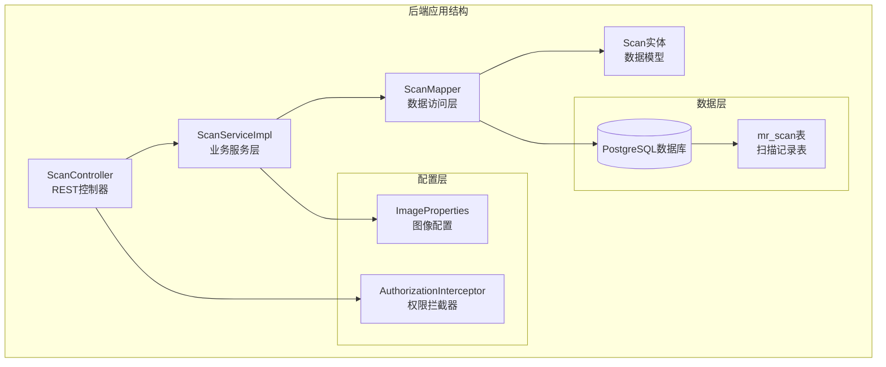
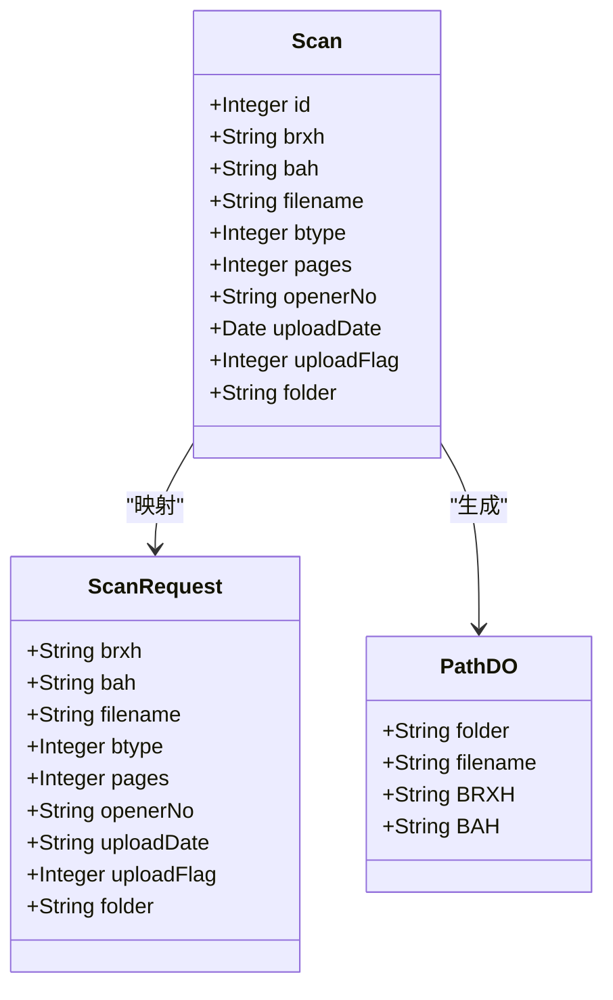
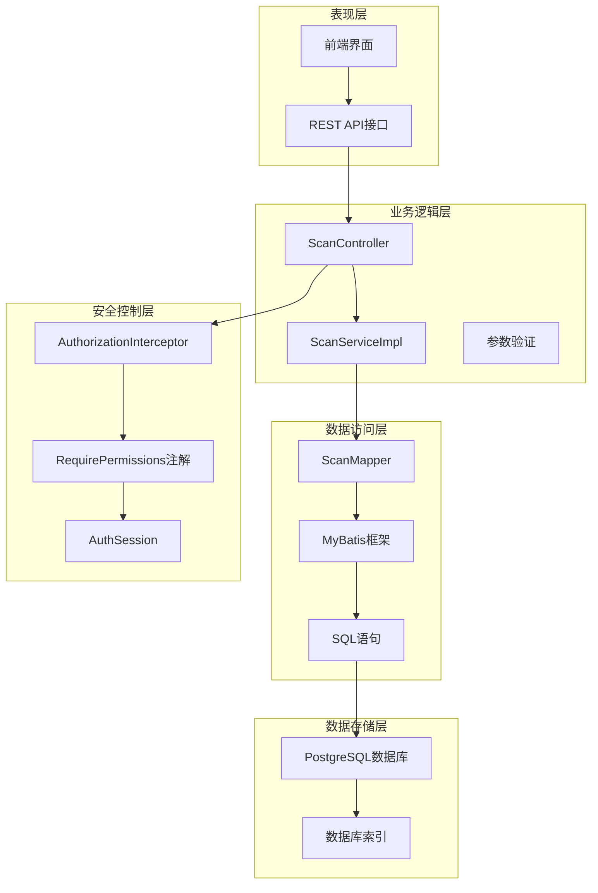
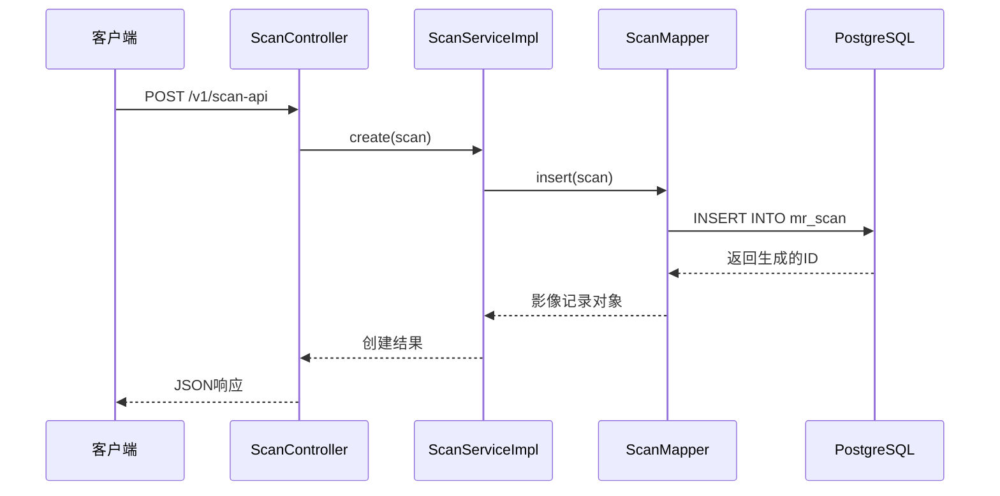
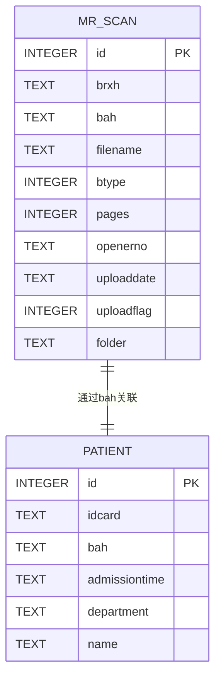
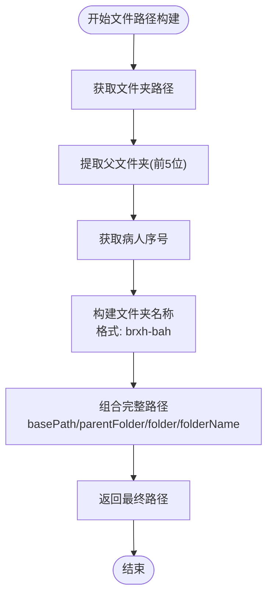
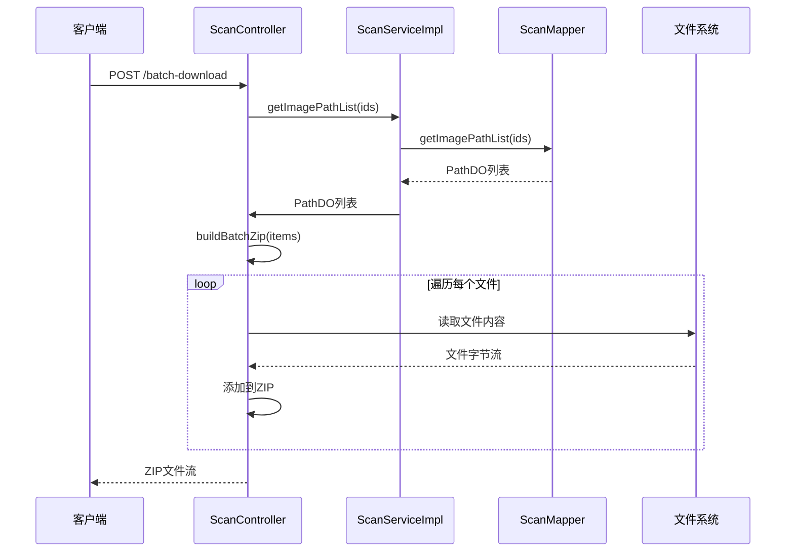
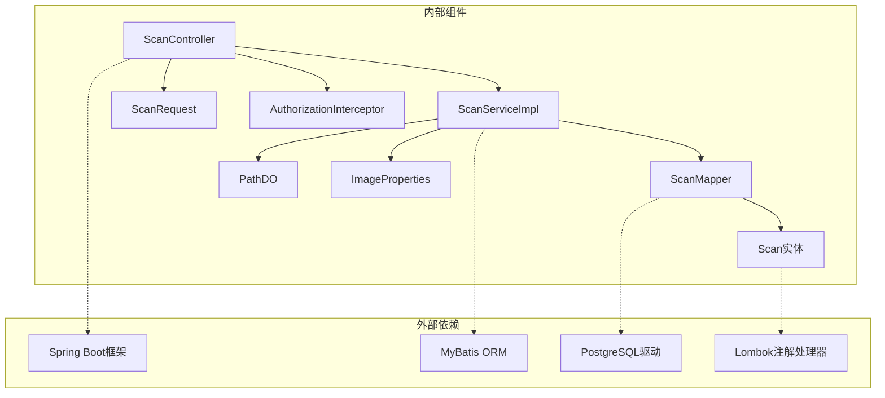
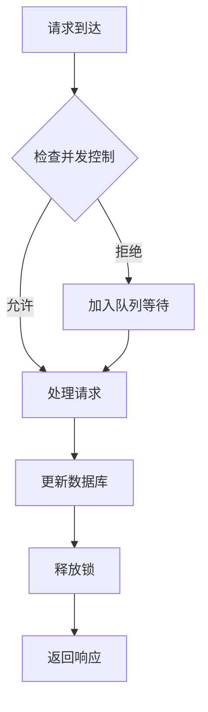
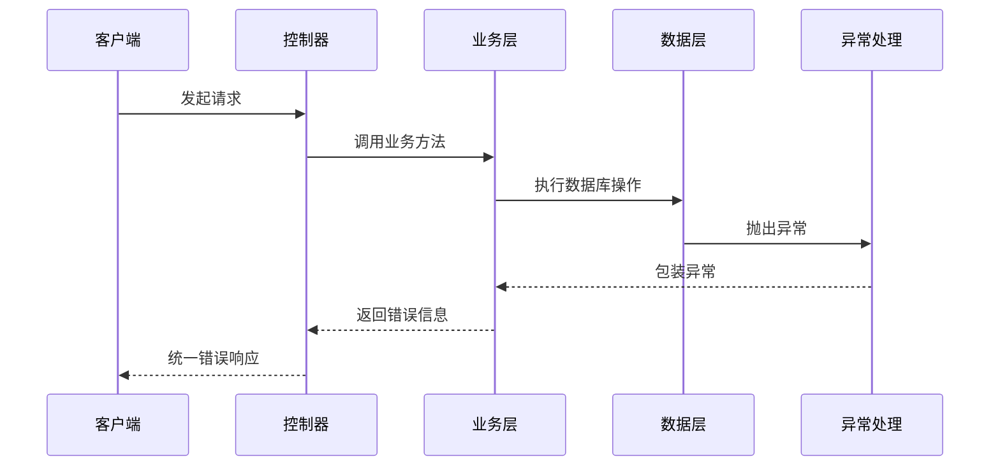

# 扫描记录Mapper技术文档

**本文档引用的文件**
- [ScanMapper.java](file://backend-repo/src/main/java/com/zjcxph/imgapi/mapper/ScanMapper.java)
- [Scan.java](file://backend-repo/src/main/java/com/zjcxph/imgapi/entity/Scan.java)
- [ScanServiceImpl.java](file://backend-repo/src/main/java/com/zjcxph/imgapi/service/impl/ScanServiceImpl.java)
- [ScanController.java](file://backend-repo/src/main/java/com/zjcxph/imgapi/controller/ScanController.java)
- [schema-postgresql.sql](file://backend-repo/src/main/resources/schema-postgresql.sql)
- [ScanRequest.java](file://backend-repo/src/main/java/com/zjcxph/imgapi/dto/req/ScanRequest.java)
- [PathDO.java](file://backend-repo/src/main/java/com/zjcxph/imgapi/entity/PathDO.java)
- [ImageProperties.java](file://backend-repo/src/main/java/com/zjcxph/imgapi/config/ImageProperties.java)
- [AuthorizationInterceptor.java](file://backend-repo/src/main/java/com/zjcxph/imgapi/interceptors/AuthorizationInterceptor.java)
- [RequirePermissions.java](file://backend-repo/src/main/java/com/zjcxph/imgapi/annotation/RequirePermissions.java)
- [ScanTest.java](file://backend-repo/src/test/java/com/zjcxph/imgapi/ScanTest.java)

## 目录
1. [简介](#简介)
2. [项目结构](#项目结构)
3. [核心组件](#核心组件)
4. [架构概览](#架构概览)
5. [详细组件分析](#详细组件分析)
6. [依赖关系分析](#依赖关系分析)
7. [性能考虑](#性能考虑)
8. [故障排除指南](#故障排除指南)
9. [结论](#结论)

## 简介

扫描记录Mapper是医学影像管理系统中的核心组件，负责管理mr_scan表的增删改查操作。该系统采用Spring Boot + MyBatis的架构设计，实现了完整的医学影像扫描记录生命周期管理，包括数据完整性约束、状态管理和安全访问控制。

系统主要功能包括：
- 扫描记录的完整CRUD操作
- 基于病案号和病人序号的快速检索
- 支持条件过滤和分页查询
- 批量文件下载和压缩打包
- 完整的权限控制和安全机制

## 项目结构

扫描记录模块在整体项目中的位置和组织方式如下：

**图表来源**
- [ScanController.java:1-333](file://backend-repo/src/main/java/com/zjcxph/imgapi/controller/ScanController.java#L1-L333)
- [ScanServiceImpl.java:1-135](file://backend-repo/src/main/java/com/zjcxph/imgapi/service/impl/ScanServiceImpl.java#L1-L135)
- [ScanMapper.java:1-131](file://backend-repo/src/main/java/com/zjcxph/imgapi/mapper/ScanMapper.java#L1-L131)

**章节来源**
- [ScanController.java:1-333](file://backend-repo/src/main/java/com/zjcxph/imgapi/controller/ScanController.java#L1-L333)
- [ScanServiceImpl.java:1-135](file://backend-repo/src/main/java/com/zjcxph/imgapi/service/impl/ScanServiceImpl.java#L1-L135)
- [ScanMapper.java:1-131](file://backend-repo/src/main/java/com/zjcxph/imgapi/mapper/ScanMapper.java#L1-L131)

## 核心组件

### 数据模型设计

扫描记录采用简洁而完整的设计，包含以下关键字段：

| 字段名 | 类型 | 描述 | 约束 |
|--------|------|------|------|
| id | INTEGER | 主键标识 | 自增, 主键 |
| brxh | TEXT | 病人序号 | 非空索引 |
| bah | TEXT | 病案号 | 非空索引 |
| filename | TEXT | 文件名 | 非空 |
| btype | INTEGER | 图片类型 | 可空 |
| pages | INTEGER | 页数 | 可空 |
| openerno | TEXT | 操作员编号 | 可空 |
| uploaddate | TEXT | 上传日期 | 可空 |
| uploadflag | INTEGER | 上传标志 | 可空 |
| folder | TEXT | 文件夹路径 | 可空 |

### 关键实体类

**图表来源**
- [Scan.java:1-116](file://backend-repo/src/main/java/com/zjcxph/imgapi/entity/Scan.java#L1-L116)
- [ScanRequest.java:1-105](file://backend-repo/src/main/java/com/zjcxph/imgapi/dto/req/ScanRequest.java#L1-L105)
- [PathDO.java:1-47](file://backend-repo/src/main/java/com/zjcxph/imgapi/entity/PathDO.java#L1-L47)

**章节来源**
- [Scan.java:1-116](file://backend-repo/src/main/java/com/zjcxph/imgapi/entity/Scan.java#L1-L116)
- [ScanRequest.java:1-105](file://backend-repo/src/main/java/com/zjcxph/imgapi/dto/req/ScanRequest.java#L1-L105)
- [PathDO.java:1-47](file://backend-repo/src/main/java/com/zjcxph/imgapi/entity/PathDO.java#L1-L47)

## 架构概览

扫描记录系统的整体架构采用经典的三层架构模式：

**图表来源**
- [ScanController.java:1-333](file://backend-repo/src/main/java/com/zjcxph/imgapi/controller/ScanController.java#L1-L333)
- [ScanServiceImpl.java:1-135](file://backend-repo/src/main/java/com/zjcxph/imgapi/service/impl/ScanServiceImpl.java#L1-L135)
- [ScanMapper.java:1-131](file://backend-repo/src/main/java/com/zjcxph/imgapi/mapper/ScanMapper.java#L1-L131)
- [AuthorizationInterceptor.java:1-78](file://backend-repo/src/main/java/com/zjcxph/imgapi/interceptors/AuthorizationInterceptor.java#L1-L78)

## 详细组件分析

### ScanMapper接口设计

ScanMapper作为数据访问层的核心接口，提供了完整的CRUD操作和复杂查询能力：

#### 基础CRUD操作

**图表来源**
- [ScanController.java:54-80](file://backend-repo/src/main/java/com/zjcxph/imgapi/controller/ScanController.java#L54-L80)
- [ScanServiceImpl.java:73-78](file://backend-repo/src/main/java/com/zjcxph/imgapi/service/impl/ScanServiceImpl.java#L73-L78)
- [ScanMapper.java:32-36](file://backend-repo/src/main/java/com/zjcxph/imgapi/mapper/ScanMapper.java#L32-L36)

#### 高级查询功能

系统支持多种查询模式：

1. **单字段查询**：基于病案号(BAH)和病人序号(BRXH)的精确查询
2. **复合条件查询**：支持多个字段的组合条件查询
3. **分页查询**：支持大数据集的高效分页
4. **批量查询**：支持通过ID列表批量获取文件路径信息

**章节来源**
- [ScanMapper.java:17-130](file://backend-repo/src/main/java/com/zjcxph/imgapi/mapper/ScanMapper.java#L17-L130)

### 数据完整性约束

系统通过数据库层面的约束确保数据完整性：

**图表来源**
- [schema-postgresql.sql:3-14](file://backend-repo/src/main/resources/schema-postgresql.sql#L3-L14)
- [schema-postgresql.sql:25-32](file://backend-repo/src/main/resources/schema-postgresql.sql#L25-L32)

**章节来源**
- [schema-postgresql.sql:3-14](file://backend-repo/src/main/resources/schema-postgresql.sql#L3-L14)

### 扫描状态管理

系统采用uploadflag字段实现逻辑删除机制：

| uploadflag值 | 状态描述 | 业务含义 |
|-------------|----------|----------|
| 1 | 正常状态 | 文件正常可用 |
| 0 | 已删除状态 | 逻辑删除，标记为不可用 |
| 其他值 | 特殊状态 | 业务特定用途 |

**章节来源**
- [ScanMapper.java:38-40](file://backend-repo/src/main/java/com/zjcxph/imgapi/mapper/ScanMapper.java#L38-L40)
- [ScanTest.java:174-179](file://backend-repo/src/test/java/com/zjcxph/imgapi/ScanTest.java#L174-L179)

### 文件路径存储和元数据处理

系统采用层次化的文件存储结构：

**图表来源**
- [ScanServiceImpl.java:32-46](file://backend-repo/src/main/java/com/zjcxph/imgapi/service/impl/ScanServiceImpl.java#L32-L46)
- [ScanController.java:317-331](file://backend-repo/src/main/java/com/zjcxph/imgapi/controller/ScanController.java#L317-L331)

**章节来源**
- [ScanServiceImpl.java:32-46](file://backend-repo/src/main/java/com/zjcxph/imgapi/service/impl/ScanServiceImpl.java#L32-L46)
- [ScanController.java:317-331](file://backend-repo/src/main/java/com/zjcxph/imgapi/controller/ScanController.java#L317-L331)

### 批量下载和压缩处理

系统支持高效的批量文件下载功能：

**图表来源**
- [ScanController.java:256-315](file://backend-repo/src/main/java/com/zjcxph/imgapi/controller/ScanController.java#L256-L315)
- [ScanServiceImpl.java:63-65](file://backend-repo/src/main/java/com/zjcxph/imgapi/service/impl/ScanServiceImpl.java#L63-L65)

**章节来源**
- [ScanController.java:256-315](file://backend-repo/src/main/java/com/zjcxph/imgapi/controller/ScanController.java#L256-L315)

## 依赖关系分析

### 组件间依赖关系

**图表来源**
- [ScanController.java:1-333](file://backend-repo/src/main/java/com/zjcxph/imgapi/controller/ScanController.java#L1-L333)
- [ScanServiceImpl.java:1-135](file://backend-repo/src/main/java/com/zjcxph/imgapi/service/impl/ScanServiceImpl.java#L1-L135)
- [ScanMapper.java:1-131](file://backend-repo/src/main/java/com/zjcxph/imgapi/mapper/ScanMapper.java#L1-L131)

### 数据库索引策略

系统针对高频查询字段建立了专门的索引：

| 索引名称 | 目标字段 | 查询场景 | 性能影响 |
|----------|----------|----------|----------|
| idx_mr_scan_bah | bah | 病案号查询 | 高效 |
| idx_mr_scan_brxh | brxh | 病人序号查询 | 高效 |
| idx_access_log_access_time | access_time | 日志查询 | 高效 |

**章节来源**
- [schema-postgresql.sql:75-83](file://backend-repo/src/main/resources/schema-postgresql.sql#L75-L83)

## 性能考虑

### 查询优化策略

1. **索引优化**：为常用查询字段建立索引
2. **分页查询**：避免全表扫描，支持大数据集分页
3. **条件查询**：使用动态SQL，只包含有效条件
4. **批量操作**：支持批量ID查询，减少数据库往返

### 缓存策略

系统建议的缓存策略：
- 热点查询结果缓存
- 配置信息缓存
- 频繁访问的扫描记录缓存

### 并发控制

## 故障排除指南

### 常见问题及解决方案

| 问题类型 | 症状 | 可能原因 | 解决方案 |
|----------|------|----------|----------|
| 数据库连接失败 | 连接超时 | 配置错误或网络问题 | 检查数据库配置和网络连接 |
| 权限不足 | 403错误 | 用户权限不够 | 检查用户角色和权限配置 |
| 文件路径错误 | 文件找不到 | 路径构建逻辑错误 | 验证文件夹结构和路径拼接 |
| 查询性能差 | 响应时间长 | 缺少索引或查询条件不当 | 添加索引或优化查询条件 |

### 错误处理机制

系统采用统一的异常处理机制：

**章节来源**
- [ScanController.java:88-101](file://backend-repo/src/main/java/com/zjcxph/imgapi/controller/ScanController.java#L88-L101)
- [ScanServiceImpl.java:50-59](file://backend-repo/src/main/java/com/zjcxph/imgapi/service/impl/ScanServiceImpl.java#L50-L59)

## 结论

扫描记录Mapper作为医学影像管理系统的核心组件，展现了优秀的架构设计和实现质量。系统通过清晰的分层架构、完善的权限控制、高效的查询优化和健壮的错误处理机制，为医疗影像数据管理提供了可靠的技术支撑。

主要优势包括：
- **模块化设计**：职责分离明确，便于维护和扩展
- **性能优化**：合理的索引策略和查询优化
- **安全性保障**：完整的权限控制和访问验证
- **可扩展性**：良好的接口设计支持功能扩展

未来可以考虑的改进方向：
- 增加缓存层以提升查询性能
- 实现更细粒度的权限控制
- 添加审计日志功能
- 优化批量操作的性能