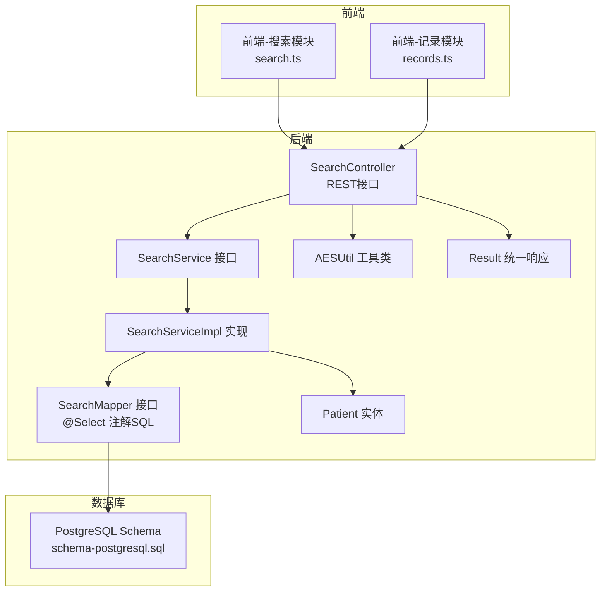
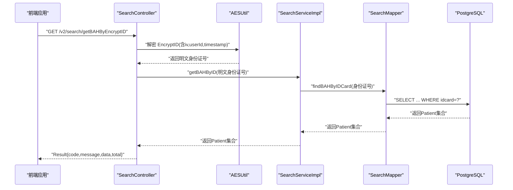
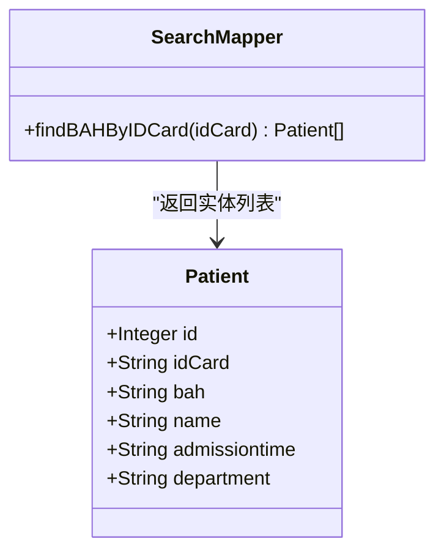
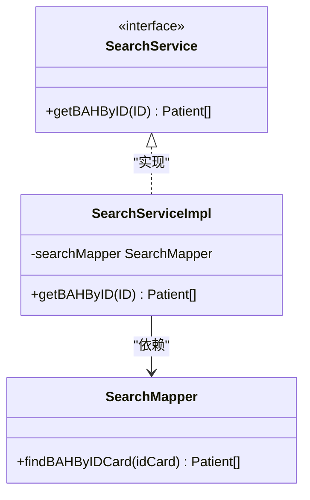
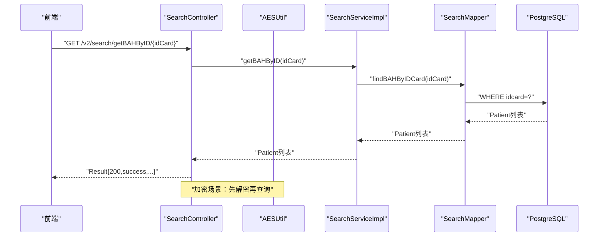
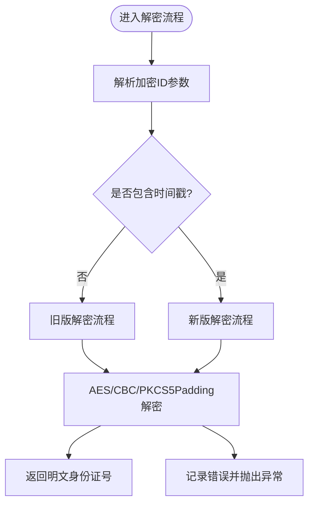
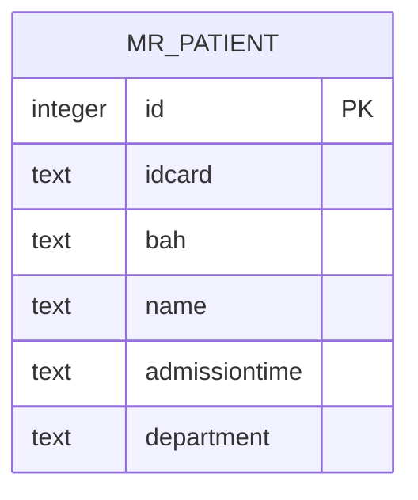
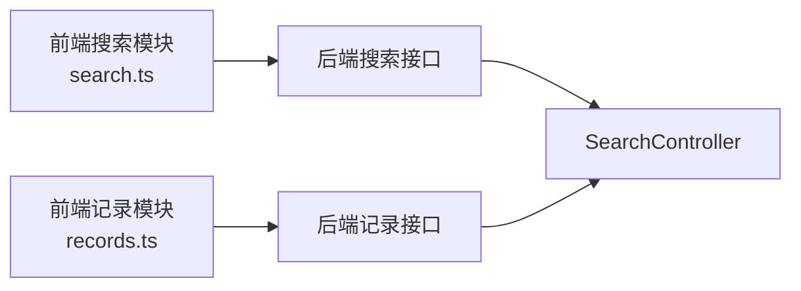
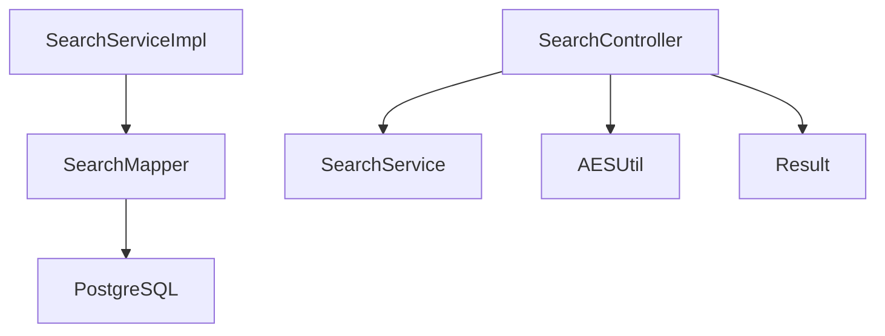

# 搜索查询Mapper

**本文引用的文件**
- [SearchMapper.java](file://backend-repo/src/main/java/com/zjcxph/imgapi/mapper/SearchMapper.java)
- [SearchService.java](file://backend-repo/src/main/java/com/zjcxph/imgapi/service/SearchService.java)
- [SearchServiceImpl.java](file://backend-repo/src/main/java/com/zjcxph/imgapi/service/impl/SearchServiceImpl.java)
- [SearchController.java](file://backend-repo/src/main/java/com/zjcxph/imgapi/controller/SearchController.java)
- [Patient.java](file://backend-repo/src/main/java/com/zjcxph/imgapi/entity/Patient.java)
- [AESUtil.java](file://backend-repo/src/main/java/com/zjcxph/imgapi/utils/AESUtil.java)
- [Result.java](file://backend-repo/src/main/java/com/zjcxph/imgapi/common/Result.java)
- [schema-postgresql.sql](file://backend-repo/src/main/resources/schema-postgresql.sql)
- [search.ts](file://frontend-fantastic-admin/src/api/modules/search.ts)
- [records.ts](file://frontend-repo/src/api/records.ts)
- [SearchControllerTest.java](file://backend-repo/src/test/java/com/zjcxph/imgapi/SearchControllerTest.java)

## 目录
1. [简介](#简介)
2. [项目结构](#项目结构)
3. [核心组件](#核心组件)
4. [架构总览](#架构总览)
5. [详细组件分析](#详细组件分析)
6. [依赖分析](#依赖分析)
7. [性能考虑](#性能考虑)
8. [故障排查指南](#故障排查指南)
9. [结论](#结论)
10. [附录](#附录)

## 简介
本技术文档围绕“搜索查询Mapper”展开，聚焦于SearchMapper接口及其在全文搜索与模糊匹配场景下的SQL查询设计与实现。当前代码库中的搜索能力以“根据身份证号查询病案号（BAH）”为核心，采用MyBatis注解方式直接编写SQL，并通过Controller层暴露REST接口；同时，为保障数据安全，前端传入的加密身份证号在后端进行解密后再执行查询。

文档将从系统架构、组件关系、数据流、处理逻辑、集成点、错误处理与性能特性等方面进行全面剖析，并结合数据库索引策略给出优化建议，最后提供排序与分页的实践示例以及用户体验与响应时间的优化要点。

## 项目结构
后端采用经典的分层架构：Controller负责HTTP请求入口与参数校验，Service封装业务逻辑，Mapper负责数据访问（本例中为MyBatis注解SQL），Entity承载数据模型，通用工具类与配置位于各自包下。数据库模式定义在资源文件中，并包含关键表与索引。

图表来源
- [SearchController.java:1-92](file://backend-repo/src/main/java/com/zjcxph/imgapi/controller/SearchController.java#L1-L92)
- [SearchService.java:1-11](file://backend-repo/src/main/java/com/zjcxph/imgapi/service/SearchService.java#L1-L11)
- [SearchServiceImpl.java:1-26](file://backend-repo/src/main/java/com/zjcxph/imgapi/service/impl/SearchServiceImpl.java#L1-L26)
- [SearchMapper.java:1-16](file://backend-repo/src/main/java/com/zjcxph/imgapi/mapper/SearchMapper.java#L1-L16)
- [Patient.java:1-103](file://backend-repo/src/main/java/com/zjcxph/imgapi/entity/Patient.java#L1-L103)
- [AESUtil.java:1-233](file://backend-repo/src/main/java/com/zjcxph/imgapi/utils/AESUtil.java#L1-L233)
- [Result.java:1-77](file://backend-repo/src/main/java/com/zjcxph/imgapi/common/Result.java#L1-L77)
- [schema-postgresql.sql:1-109](file://backend-repo/src/main/resources/schema-postgresql.sql#L1-L109)

章节来源
- [SearchController.java:1-92](file://backend-repo/src/main/java/com/zjcxph/imgapi/controller/SearchController.java#L1-L92)
- [SearchMapper.java:1-16](file://backend-repo/src/main/java/com/zjcxph/imgapi/mapper/SearchMapper.java#L1-L16)
- [schema-postgresql.sql:1-109](file://backend-repo/src/main/resources/schema-postgresql.sql#L1-L109)

## 核心组件
- SearchMapper：声明基于身份证号的精确查询SQL，返回患者信息集合。
- SearchService 及其实现：封装业务调用，将输入参数传递给Mapper。
- SearchController：对外提供REST接口，支持明文与加密两种输入方式；内部完成解密与日志记录。
- Patient 实体：映射数据库字段，承载查询结果。
- AESUtil：提供基于用户ID与时间戳的AES解密能力，兼容新旧版本。
- Result：统一响应包装，便于前后端交互。
- 数据库Schema：定义mr_patient表及索引，支撑身份证号精确查询。

章节来源
- [SearchMapper.java:1-16](file://backend-repo/src/main/java/com/zjcxph/imgapi/mapper/SearchMapper.java#L1-L16)
- [SearchService.java:1-11](file://backend-repo/src/main/java/com/zjcxph/imgapi/service/SearchService.java#L1-L11)
- [SearchServiceImpl.java:1-26](file://backend-repo/src/main/java/com/zjcxph/imgapi/service/impl/SearchServiceImpl.java#L1-L26)
- [SearchController.java:1-92](file://backend-repo/src/main/java/com/zjcxph/imgapi/controller/SearchController.java#L1-L92)
- [Patient.java:1-103](file://backend-repo/src/main/java/com/zjcxph/imgapi/entity/Patient.java#L1-L103)
- [AESUtil.java:1-233](file://backend-repo/src/main/java/com/zjcxph/imgapi/utils/AESUtil.java#L1-L233)
- [Result.java:1-77](file://backend-repo/src/main/java/com/zjcxph/imgapi/common/Result.java#L1-L77)
- [schema-postgresql.sql:1-109](file://backend-repo/src/main/resources/schema-postgresql.sql#L1-L109)

## 架构总览
下图展示了从前端到数据库的完整调用链路，包括加密参数解密与精确查询的关键步骤。

图表来源
- [SearchController.java:39-72](file://backend-repo/src/main/java/com/zjcxph/imgapi/controller/SearchController.java#L39-L72)
- [AESUtil.java:121-162](file://backend-repo/src/main/java/com/zjcxph/imgapi/utils/AESUtil.java#L121-L162)
- [SearchServiceImpl.java:21-24](file://backend-repo/src/main/java/com/zjcxph/imgapi/service/impl/SearchServiceImpl.java#L21-L24)
- [SearchMapper.java:14](file://backend-repo/src/main/java/com/zjcxph/imgapi/mapper/SearchMapper.java#L14)
- [Result.java:24-37](file://backend-repo/src/main/java/com/zjcxph/imgapi/common/Result.java#L24-L37)

## 详细组件分析

### SearchMapper 接口与SQL设计
- 设计目标：根据身份证号进行精确匹配查询，返回患者相关信息（含病案号）。
- SQL实现：通过MyBatis注解@Select直接声明查询语句，限定字段以减少网络传输与序列化开销。
- 返回类型：`List<Patient>`，便于后续服务层统一处理。
- 性能考量：当前SQL为等值匹配，配合数据库对idcard列建立索引可显著提升命中效率。

图表来源
- [SearchMapper.java:10-16](file://backend-repo/src/main/java/com/zjcxph/imgapi/mapper/SearchMapper.java#L10-L16)
- [Patient.java:6-19](file://backend-repo/src/main/java/com/zjcxph/imgapi/entity/Patient.java#L6-L19)

章节来源
- [SearchMapper.java:10-16](file://backend-repo/src/main/java/com/zjcxph/imgapi/mapper/SearchMapper.java#L10-L16)
- [schema-postgresql.sql:80](file://backend-repo/src/main/resources/schema-postgresql.sql#L80)

### SearchService 与 SearchServiceImpl
- SearchService：定义对外的业务契约，屏蔽具体实现细节。
- SearchServiceImpl：持有SearchMapper实例，将输入参数透传至Mapper，实现轻量级编排。
- 设计优势：便于替换实现、扩展缓存或引入事务控制。

图表来源
- [SearchService.java:7-10](file://backend-repo/src/main/java/com/zjcxph/imgapi/service/SearchService.java#L7-L10)
- [SearchServiceImpl.java:11-25](file://backend-repo/src/main/java/com/zjcxph/imgapi/service/impl/SearchServiceImpl.java#L11-L25)
- [SearchMapper.java:10-16](file://backend-repo/src/main/java/com/zjcxph/imgapi/mapper/SearchMapper.java#L10-L16)

章节来源
- [SearchService.java:1-11](file://backend-repo/src/main/java/com/zjcxph/imgapi/service/SearchService.java#L1-L11)
- [SearchServiceImpl.java:1-26](file://backend-repo/src/main/java/com/zjcxph/imgapi/service/impl/SearchServiceImpl.java#L1-L26)

### SearchController 控制器与API流程
- 接口设计：
  - 明文路径参数：/v2/search/getBAHByID/{idCard}
  - 加密参数：/v2/search/getBAHByEncryptID（含EncryptID、userId、iv、timestamp）
  - 兼容旧版：/v2/search/getBAHByEncryptIDLegacy（仅EncryptID、userId、iv）
- 安全处理：在控制器内完成AES解密，确保敏感数据在服务层以明文形式处理。
- 日志记录：对解密与查询过程进行日志输出，便于审计与问题定位。
- 统一响应：使用Result包装返回体，包含状态码、消息与数据。

图表来源
- [SearchController.java:39-79](file://backend-repo/src/main/java/com/zjcxph/imgapi/controller/SearchController.java#L39-L79)
- [AESUtil.java:121-162](file://backend-repo/src/main/java/com/zjcxph/imgapi/utils/AESUtil.java#L121-L162)
- [SearchServiceImpl.java:21-24](file://backend-repo/src/main/java/com/zjcxph/imgapi/service/impl/SearchServiceImpl.java#L21-L24)
- [SearchMapper.java:14](file://backend-repo/src/main/java/com/zjcxph/imgapi/mapper/SearchMapper.java#L14)
- [Result.java:24-37](file://backend-repo/src/main/java/com/zjcxph/imgapi/common/Result.java#L24-L37)

章节来源
- [SearchController.java:19-92](file://backend-repo/src/main/java/com/zjcxph/imgapi/controller/SearchController.java#L19-L92)
- [AESUtil.java:70-162](file://backend-repo/src/main/java/com/zjcxph/imgapi/utils/AESUtil.java#L70-L162)
- [Result.java:5-77](file://backend-repo/src/main/java/com/zjcxph/imgapi/common/Result.java#L5-L77)

### AESUtil 工具类与加密参数解析
- 支持两种解密模式：
  - 旧版：基于用户ID与固定密钥生成用户特定密钥，解密EncryptID中的密文与IV。
  - 新版：在旧版基础上加入时间戳，增强一次性与时效性。
- 参数解析：支持JSON格式{"ciphertext":"...","iv":"...","timestamp":"..."}或历史格式ciphertext_iv。
- 异常处理：对解密失败与格式异常进行日志记录与抛出运行时异常，便于上层捕获。

图表来源
- [AESUtil.java:170-215](file://backend-repo/src/main/java/com/zjcxph/imgapi/utils/AESUtil.java#L170-L215)
- [AESUtil.java:121-162](file://backend-repo/src/main/java/com/zjcxph/imgapi/utils/AESUtil.java#L121-L162)
- [AESUtil.java:70-99](file://backend-repo/src/main/java/com/zjcxph/imgapi/utils/AESUtil.java#L70-L99)

章节来源
- [AESUtil.java:1-233](file://backend-repo/src/main/java/com/zjcxph/imgapi/utils/AESUtil.java#L1-L233)

### 数据模型与数据库索引
- Patient 实体字段：id、idCard、bah、name、admissiontime、department。
- 数据库表：app.mr_patient，包含主键与关键字段。
- 索引策略：已为idcard建立唯一索引，确保等值查询高效稳定。
- 查询优化：当前SQL为精确匹配，索引可保证O(logN)查找；如需扩展全文检索或模糊匹配，可在现有索引基础上增加GIN/GIN trigram扩展或全文索引。

图表来源
- [schema-postgresql.sql:25-32](file://backend-repo/src/main/resources/schema-postgresql.sql#L25-L32)
- [Patient.java:6-19](file://backend-repo/src/main/java/com/zjcxph/imgapi/entity/Patient.java#L6-L19)

章节来源
- [schema-postgresql.sql:1-109](file://backend-repo/src/main/resources/schema-postgresql.sql#L1-L109)
- [Patient.java:1-103](file://backend-repo/src/main/java/com/zjcxph/imgapi/entity/Patient.java#L1-L103)

### 前端对接与API定义
- 前端搜索模块：提供按身份证号与按加密ID查询的函数，分别对应后端两条接口。
- 记录模块：提供扫描记录的分页与条件查询接口，与搜索功能形成互补。

图表来源
- [search.ts:4-12](file://frontend-fantastic-admin/src/api/modules/search.ts#L4-L12)
- [records.ts:3-56](file://frontend-repo/src/api/records.ts#L3-L56)
- [SearchController.java:19-92](file://backend-repo/src/main/java/com/zjcxph/imgapi/controller/SearchController.java#L19-L92)

章节来源
- [search.ts:1-13](file://frontend-fantastic-admin/src/api/modules/search.ts#L1-L13)
- [records.ts:1-56](file://frontend-repo/src/api/records.ts#L1-L56)

## 依赖分析
- 组件耦合度：SearchController依赖SearchService；SearchServiceImpl依赖SearchMapper；SearchMapper依赖数据库表结构；AESUtil独立于业务层但被控制器使用。
- 外部依赖：MyBatis注解驱动SQL执行；PostgreSQL数据库；Apache Commons Codec用于Hex编解码。
- 循环依赖：未发现循环依赖，层次清晰。

图表来源
- [SearchController.java:25-32](file://backend-repo/src/main/java/com/zjcxph/imgapi/controller/SearchController.java#L25-L32)
- [SearchServiceImpl.java:14-19](file://backend-repo/src/main/java/com/zjcxph/imgapi/service/impl/SearchServiceImpl.java#L14-L19)
- [SearchMapper.java:14](file://backend-repo/src/main/java/com/zjcxph/imgapi/mapper/SearchMapper.java#L14)
- [AESUtil.java:1-233](file://backend-repo/src/main/java/com/zjcxph/imgapi/utils/AESUtil.java#L1-L233)
- [Result.java:1-77](file://backend-repo/src/main/java/com/zjcxph/imgapi/common/Result.java#L1-L77)

章节来源
- [SearchController.java:1-92](file://backend-repo/src/main/java/com/zjcxph/imgapi/controller/SearchController.java#L1-L92)
- [SearchServiceImpl.java:1-26](file://backend-repo/src/main/java/com/zjcxph/imgapi/service/impl/SearchServiceImpl.java#L1-L26)
- [SearchMapper.java:1-16](file://backend-repo/src/main/java/com/zjcxph/imgapi/mapper/SearchMapper.java#L1-L16)
- [AESUtil.java:1-233](file://backend-repo/src/main/java/com/zjcxph/imgapi/utils/AESUtil.java#L1-L233)
- [Result.java:1-77](file://backend-repo/src/main/java/com/zjcxph/imgapi/common/Result.java#L1-L77)

## 性能考虑
- 当前查询为等值匹配，数据库对idcard建立索引（唯一索引）可确保高效命中。
- 若未来需要扩展全文搜索或模糊匹配：
  - PostgreSQL可启用pg_trgm扩展，使用相似度函数与GIN索引加速模糊匹配。
  - 全文检索可考虑将常用检索字段建立TSVECTOR索引，并结合多语言分词器。
- 分页与排序：
  - 在现有接口基础上，建议在服务层增加分页参数（page、size）与排序字段（如admissiontime降序），并在SQL中使用LIMIT/OFFSET或游标分页。
  - 排序字段建议建立复合索引以避免排序开销。
- 缓存策略：
  - 对高频查询（如近期热点身份证号）可引入Redis缓存，设置合理TTL。
- 响应时间要求：
  - 单条精确查询应在毫秒级；若引入全文检索，建议通过索引与查询计划优化将P95延迟控制在100ms以内。

[本节为通用性能指导，不直接分析具体文件]

## 故障排查指南
- 解密失败：
  - 检查EncryptID格式是否符合预期（JSON或ciphertext_iv）。
  - 确认iv与ciphertext均为合法十六进制字符串。
  - 验证用户ID与时间戳组合是否正确生成用户特定密钥。
- 查询无结果：
  - 确认身份证号是否正确传入且与数据库一致（大小写、空格等）。
  - 检查idcard索引是否存在且未损坏。
- 接口异常：
  - 查看控制器日志，确认异常栈信息。
  - 使用单元测试覆盖典型场景（如X-Forwarded-For、X-Real-IP、getRemoteAddr）。

章节来源
- [AESUtil.java:170-215](file://backend-repo/src/main/java/com/zjcxph/imgapi/utils/AESUtil.java#L170-L215)
- [SearchControllerTest.java:33-82](file://backend-repo/src/test/java/com/zjcxph/imgapi/SearchControllerTest.java#L33-L82)
- [schema-postgresql.sql:80](file://backend-repo/src/main/resources/schema-postgresql.sql#L80)

## 结论
当前搜索查询Mapper以简洁高效的等值查询为核心，结合AES解密与统一响应，满足了从加密前端到数据库的完整链路需求。数据库层面的索引设计为性能提供了基础保障。未来如需扩展全文检索与模糊匹配，可在现有索引基础上引入trigram与全文索引，并配套分页、排序与缓存策略，以进一步提升查询体验与系统吞吐。

[本节为总结性内容，不直接分析具体文件]

## 附录

### 不同搜索场景的SQL实现与性能调优
- 等值查询（当前实现）
  - SQL：WHERE idcard = ?
  - 索引：idx_mr_patient_idcard（唯一索引）
  - 性能：O(logN)，适合高频精确查询
- 模糊匹配（建议方案）
  - PostgreSQL trigram：使用similarity函数与GIN索引
  - 全文检索：TSVECTOR + 多语言分词器
  - 性能：通过索引与查询计划优化，控制P95延迟
- 全文搜索（建议方案）
  - 建立TSVECTOR索引，结合ILIKE或websearch_to_tsquery
  - 配合排序字段与分页参数，避免全表扫描

章节来源
- [schema-postgresql.sql:80](file://backend-repo/src/main/resources/schema-postgresql.sql#L80)

### 搜索结果排序与分页示例（设计思路）
- 排序字段建议：admissiontime（降序）、name（升序）
- 分页参数：page（从1开始）、size（10/20/50）
- SQL示例（概念性描述）：
  - SELECT ... FROM mr_patient WHERE idcard = ? ORDER BY admissiontime DESC LIMIT ? OFFSET ?
  - 全文检索：ORDER BY ts_rank DESC, admissiontime DESC
- 索引建议：为排序字段建立复合索引，减少排序成本

[本节为设计建议，不直接分析具体文件]

### 用户体验优化与响应时间要求
- 响应时间：单次查询P95控制在100ms以内
- 前端优化：防抖、骨架屏、空状态提示
- 后端优化：连接池、慢查询日志、缓存预热
- 安全与合规：加密参数解密在服务端完成，避免明文泄露

[本节为通用指导，不直接分析具体文件]